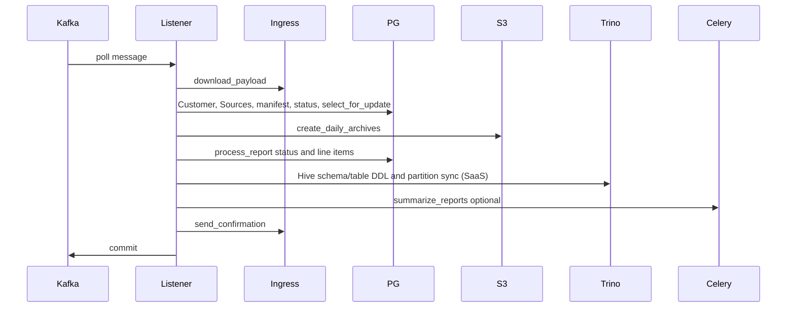
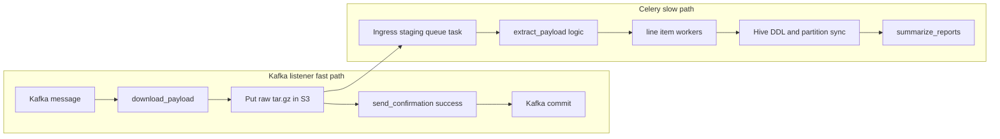

# Decouple PostgreSQL and Trino from the Kafka ingress listener

As-built behavior for branch `COST-8282-decouple-kafka` is in [`docs/architecture/ingress-staging.md`](docs/architecture/ingress-staging.md). This file is the design that branch implemented.

## Overview

Production Kafka lag on the HCCM upload topic grows when the single listener thread blocks before it can poll the next message or commit offsets. Two engines sit on that thread today:

- **PostgreSQL** — deadlocks and slow queries rewind the consumer (`OperationalError` / `InterfaceError` / `ReportProcessorDBError`), so no further messages are processed until the database recovers.
- **Trino / Hive (SaaS only)** — synchronous CSV→parquet conversion and Hive DDL inside `process_report` (`schema_exists`, `create_schema`, `create_table`, `sync_hive_partitions`) hold the same thread for the duration of those calls. Processor errors **commit** the offset instead of rewinding, so a Trino failure can drop the message while a slow metastore still stalls the consumer.

This document describes **current coupling** to both engines, an **existing incident mitigation** (PostgreSQL only), and a **target design** that separates:

- **Fast path (listener):** download from ingress → durable raw `.tar.gz` in S3 → ingress validation confirmation → Kafka commit. No tenant PostgreSQL transactions and no Trino client.
- **Slow path (workers):** extract, manifest/report DB updates, CSV split/upload, parquet + Hive table/partition work, line-item processing, and summarization.

**Design choices (agreed):**

- Send ingress validation **after** the payload is durably stored in S3 (not after line-item processing).
- **Phase 1** persists the **raw tarball** only; workers perform extract/split later.

**Primary code:** [`koku/masu/external/kafka_msg_handler.py`](../../koku/masu/external/kafka_msg_handler.py)

Related: [OpenShift CSV processing](csv-processing-ocp.md), [on-prem data flow](../onprem_data_flow.md), [Unleash feature flags](../agent/unleash-flags.md).

---

## Table of contents

- [Current behavior](#current-behavior-why-lag-grows)
- [Existing partial decoupling](#existing-partial-decoupling-incident-pattern)
- [Target architecture](#target-architecture)
- [Implementation phases](#recommended-implementation-phases)
- [Operational notes](#operational--contract-notes)
- [Files to touch](#files-to-touch-implementation)
- [Summary](#summary)

---

## Current behavior (why lag grows)

The HCCM listener runs in a **single consumer thread** ([`listen_for_messages_loop`](../../koku/masu/external/kafka_msg_handler.py)) with `enable.auto.commit: False`. A message is only committed after **`process_messages` returns successfully** ([`listen_for_messages`](../../koku/masu/external/kafka_msg_handler.py)).

`process_messages` does far more than download:

On `OperationalError` / `InterfaceError` / `ReportProcessorDBError`, the consumer **seeks back** and sleeps (`rewind_consumer_to_retry`), so **no further messages are processed** until the stuck work completes or the DB recovers.

Trino does not use that rewind path. `process_report` runs on the listener thread and sets `create_table: True`, which drives [`ParquetReportProcessor`](../../koku/masu/processor/parquet/parquet_report_processor.py). On SaaS, [`create_parquet_table`](../../koku/masu/processor/parquet/parquet_report_processor.py) opens a Trino connection (`TRINO_HOST`) for Hive DDL and `sync_hive_partitions` **before** the Kafka commit. [`ReportProcessorError`](../../koku/masu/external/kafka_msg_handler.py) / `ParquetReportProcessorError` **commit** the offset. Many `TrinoQueryError`s inside `_execute_trino_sql` are logged and swallowed, so a Hive blip may neither rewind nor fail the file — the thread still waits on the call.

### PostgreSQL touchpoints in the hot path

| Step | Function | DB usage |
|------|----------|----------|
| Pre-download | `handle_message` | `Customer.objects.filter(org_id=…)` for schema + DLQ flag |
| Extract | `extract_payload` | `Sources`/`Provider`, retention via `get_data_retention_months`, `create_cost_and_usage_report_manifest`, `ReportManifestDBAccessor.update_manifest_state`, `record_all_manifest_files` / `record_report_status` per file |
| Split/upload | `divide_csv_daily` | **`CostUsageReportManifest.objects.select_for_update()`** per day slice — high deadlock risk with multiple listeners |
| Post-extract | `process_messages` | **`process_report` → `_process_report_file` synchronously** in the listener thread |
| Summarize | `summarize_manifest` | `manifest_ready_for_summary` + Celery enqueue |

Ingress confirmation today runs **after** line-item work when `status` is set and not `DEBUG` (`process_messages`).

### Trino touchpoints in the hot path (SaaS)

Trino work is inside the same synchronous `process_report` call, not a separate listener step. [`_process_report_file`](../../koku/masu/processor/_tasks/process.py) → `ReportProcessor.process()` → `ParquetReportProcessor.convert_csv_to_parquet`.

| Step | Function | Trino usage |
|------|----------|-------------|
| Schema / table | `create_parquet_table` | `schema_exists`, `create_schema`, `table_exists`, `create_table` against the Hive catalog |
| Partitions | `sync_hive_partitions` | `system.sync_partition_metadata`, with retries on transient Hive/JDBC errors |
| Daily parquet | `create_daily_parquet` | second `create_parquet_table(daily=True)` after the daily parquet object is written |

`create_parquet_table` also calls `get_or_create_postgres_partition` (PostgreSQL). That stays on the worker with the rest of line-item bookkeeping.

`PayloadInfo.trino_schema` is only the tenant schema **name** passed into S3 path prefixes (`get_path_prefix` in `create_daily_archives`). It is not a Trino session. The fast path must not resolve it. Staging keys stay `{org_id}/{cluster_id}/…`.

On-prem (`settings.ONPREM`) skips `create_parquet_table` and writes daily frames to PostgreSQL. There is no Trino client on that path. The listener split still matters there because of PostgreSQL.

Summarization SQL that reads Trino already runs in Celery (`summarize_reports`). The listener only enqueues it, and only after `process_report` returns. Moving line-item processing off the listener also keeps that enqueue off the critical path.

---

## Existing partial decoupling (incident pattern)

[`INGRESS_DEAD_LETTER_QUEUE_FLAG`](../../koku/masu/processor/__init__.py) (`cost-management.backend.ingress-dead-letter-queue`) routes to `send_to_dead_letter_queue`:

- Still hits PG first: `Customer` lookup + `IngressDeadLetterQueue.get_or_create`
- Then: `download_payload` → `copy_data_to_s3_bucket` under `dead_letter_queue/{schema}/…` → update `s3_key`
- Returns success with **no** `report_metas` → listener confirms and commits without `extract_payload` / `process_report`

**Gaps for a production normal path:**

- DLQ is framed as park-and-skip; there is **no replay worker** in-repo.
- PG is still on the critical path before download.
- S3 layout is DLQ-specific.

The target design extends this pattern into the **primary** ingest path: confirm after S3, raw tarball first, workers for everything else.

---

## Target architecture

### Principles

1. **Listener does not open tenant/reporting transactions or a Trino connection** — no ORM and no Hive DDL on the fast path.
2. **Idempotency** keyed by `request_id` (and optionally manifest `assembly_id` from tarball after worker reads it). Parquet writes and Hive partition sync must tolerate a replay of the same tarball.
3. **Ingress validation** fires once the tarball is in S3, not after line items or after Trino tables exist.
4. **Dead letter / retry** for worker failures uses S3 + a small **public** staging table (extend `IngressDeadLetterQueue` or add `IngressStagingPayload`). Trino/Hive failures retry on the worker; they must not rewind the listener or commit an unprocessed offset.

---

## Recommended implementation phases

### Phase 1 — Fast path in the listener

**New Unleash enablement flag:** e.g. `cost-management.backend.ingress-staging-listener` — ON = fast path.

**Refactor `handle_message`**

- Add `stage_ingress_payload(request_id, value, context)`:
  1. `download_payload` (unchanged).
  2. **Peek manifest without PG:** `read_manifest_from_tarball` (already used in `extract_payload`) to read `cluster_id` and `assembly_id` from `manifest.json` only — no extract, no provider lookup.
  3. Upload to a **staging** prefix keyed by **cluster**, not schema — e.g.
     `{WAREHOUSE_PATH}/ingress_staging/{org_id}/{cluster_id}/YYYY/MM/DD/{sanitized_request_id}.tar.gz`
     Include `org_id` from the Kafka message (trusted ingress boundary) so keys stay unique if cluster identifiers ever overlap across tenants. **Do not** use `schema_name` in the path: it was only attractive because it can be derived from `org_id` without opening the tarball, but `cluster_id` is what operators and downstream processing use (`INSIGHTS_LOCAL_REPORT_DIR/{cluster_id}/…`, incident triage, multi-cluster orgs).
  4. **Durable write ordering:** S3 put succeeds before bookkeeping. Staging row stores `request_id`, `s3_key`, `org_id`, `cluster_id`, `assembly_id`, and raw kafka fields — **not** `schema_name` (worker resolves schema via `Sources` / `Provider` as today). Prefer **one short upsert** after S3 (`state=stored`, …). On PG failure after S3: raise `KafkaMsgHandlerError` to rewind (data is safe; worker can reconcile by `request_id` or listing under `cluster_id`).
  5. Return `(SUCCESS_CONFIRM_STATUS, None, None)` — no `report_metas`.

#### Why `cluster_id` instead of `schema_name` for S3 layout?

| | `schema_name` in path | `cluster_id` (+ `org_id`) in path |
|--|------------------------|-----------------------------------|
| Available on fast path | Yes, from Kafka `org_id` (no tarball) | Yes, after download + manifest peek (no PG) |
| Ops / debugging | Tenant-wide prefix; many clusters per folder | Aligns with cluster-centric logs and local report dirs |
| Multi-cluster org | All clusters share one prefix | Natural shard per cluster |
| DLQ precedent | [`send_to_dead_letter_queue`](../../koku/masu/external/kafka_msg_handler.py) uses `schema_name` | Staging is intentional greenfield layout; DLQ can stay as-is |

Manifest peek adds negligible cost (single small JSON read from tar) and runs **before** S3 upload, so the object lands once under the final key.

**Refactor `process_messages`**

- When fast path returns no `report_metas`: skip `process_report` / `summarize_manifest`; still `send_confirmation`.
- **Worker trigger** (avoid losing work if Celery enqueue fails after Kafka commit):
  - **Option A (recommended):** upsert staging row with `state=pending` before confirm; periodic beat or poller claims `pending` rows; listener does not need Celery on the critical path.
  - **Option B:** enqueue `process_staged_ingress_payload` in `process_messages` after successful handle; accept rare duplicate tasks (worker must be idempotent).

**Do not** call `extract_payload`, `process_report`, or `ParquetReportProcessor` from the listener when the staging flag is ON. CSV→parquet, Hive schema/table DDL, and `sync_hive_partitions` stay on the worker.

### Phase 2 — Worker owns today’s `extract_payload` pipeline

**New Celery task** (dedicated queue: `koku/common/queues.py` + `deploy/clowdapp.yaml`):

- Load staging row / `s3_key` by `request_id`.
- Download tarball from S3 to `Config.DATA_DIR` (or stream).
- Reuse existing functions with minimal moves:
  - Split `extract_payload` into **resolve provider + DB manifest** vs **process local tarball** so the worker entrypoint is `process_local_tarball(path, kafka_context)`.
- On success: mark staging `processed`; on failure: `failed` + retries with backoff.
- **`process_report` must not run in the listener** — move to the OCP worker queue (`get_customer_queue(schema, OCPQueue)`) as async tasks per report file, matching cloud `get_report_files` in [`koku/masu/processor/tasks.py`](../../koku/masu/processor/tasks.py).
- **SaaS:** that worker runs today's `ParquetReportProcessor` path unchanged in role: CSV → parquet in S3, `create_parquet_table` (Hive schema/table DDL), `sync_hive_partitions`. The listener never opens `TRINO_HOST`.
- **On-prem:** the same task writes line items to PostgreSQL (`handle_daily_frames_postgres`) and does not call Trino.

**Idempotency:** reuse `record_report_status` / manifest `assembly_id` so reprocessing a staged tarball does not double-process. Hive partition sync and parquet object keys must be safe to repeat for the same `request_id`.

### Phase 3 — Reduce deadlock surface in split/upload

Even on the worker path, `divide_csv_daily` `select_for_update` on `report_tracker` remains a deadlock hotspot. Follow-up (separate PR):

- Replace counter in manifest JSON with **deterministic filenames** (e.g. hash of content + day), object-store versioning, or advisory locks with consistent ordering.
- Stop calling `record_all_manifest_files` inside the per-file loop in `extract_payload` (redundant N DB round-trips).

### Implementation checklist

| ID | Task |
|----|------|
| map-fast-path | Add `stage_ingress_payload` + feature flag; listener returns after S3 + confirm path |
| staging-model | Extend `IngressDeadLetterQueue` or add `IngressStagingPayload` (`request_id`, `s3_key`, `state`, kafka payload) |
| celery-worker | Implement `process_staged_ingress_payload`: S3 → extract → async `process_report` per file (includes SaaS Hive DDL / partition sync) |
| idempotency-tests | Tests for duplicate `request_id`, PG failure after S3, worker replay |
| deadlock-followup | Optional: refactor `divide_csv_daily` `report_tracker` locking |

---

## Operational / contract notes

- **Ingress:** Confirming after S3 means other Insights apps may access the quarantine object before Koku has line items or Hive partitions — align with platform expectations. Downstream Trino queries can miss a payload until the worker finishes `sync_hive_partitions`.
- **Multiple listener pods:** Fast path must be idempotent on `request_id` (see DLQ tests in `koku/masu/test/external/test_kafka_msg_handler.py`).
- **On-prem:** No Trino. The same split still applies; workers still need PG for line items; listener lag decouples from PG outages. Production on-prem stays on `legacy_message_processing` until a later release. `cost-management.backend.ingress-staging-listener` is not in `ONPREM_FLAG_DEFAULTS`. `dev_fallback=True` is true only when the Unleash environment is `development`.
- **SaaS:** Listener lag also decouples from Trino and the Hive metastore. A metastore outage delays parquet visibility, not Kafka commit.
- **Feature flag rollout:** Default OFF in stage/prod; run parallel with DLQ flag, then deprecate DLQ-only path once staging + worker are stable.
- **Observability:** Metrics for staging lag (`now - stored_at`), worker backlog, confirmations without `process_complete`, and worker-side Trino/Hive duration (schema create, partition sync).

---

## Files to touch (implementation)

| Area | Files |
|------|--------|
| Listener fast path | `koku/masu/external/kafka_msg_handler.py` |
| Flag constant | `koku/masu/processor/__init__.py` |
| Staging model / migration | `koku/reporting_common/models.py` |
| Worker task | `koku/masu/processor/tasks.py` (+ new module if handler grows) |
| Trino/Hive (worker only) | `koku/masu/processor/parquet/parquet_report_processor.py`, `koku/masu/processor/report_parquet_processor_base.py` — reused, not called from the listener |
| Queue / deploy | `koku/common/queues.py`, `deploy/clowdapp.yaml` |
| Tests | `koku/masu/test/external/test_kafka_msg_handler.py` + worker tests |
| Docs | `docs/architecture/csv-processing-ocp.md` (listener vs worker diagram) |

---

## Summary

**Yes — decoupling is feasible** and partially prototyped via the ingress DLQ flag. The listener should become **download → S3 staging → confirm → commit**, with all PostgreSQL work (manifest, `select_for_update`, line items, summarize) and all Trino/Hive work (parquet tables, partition sync) on **async workers** keyed off durable S3 + a small staging record.

**Immediate mitigation (no full refactor):** enable `INGRESS_DEAD_LETTER_QUEUE_FLAG` per schema during incidents — reduces work in the listener but still blocks on PG before download, does not avoid Trino on the normal path, and does not process parked payloads until a replay worker exists.

---

## Changelog

| Date | Summary |
|------|---------|
| 2026-03-22 | Initial design doc from architecture planning session |
| 2026-03-22 | Staging S3 prefix: prefer `org_id` + `cluster_id` (manifest peek) over `schema_name` |
| 2026-09-29 | Explicit Trino/Hive decoupling: SaaS DDL and partition sync move to the worker with line-item processing |
