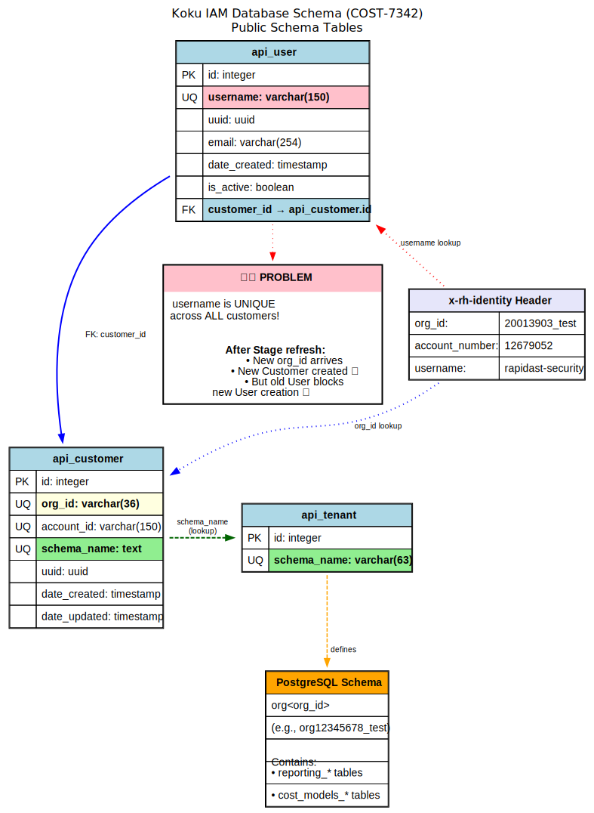

# COST-7342: Auto-Heal Org ID Mismatch After Stage Refresh

**Jira**: https://redhat.atlassian.net/browse/COST-7342  
**Runbook**: https://gitlab.cee.redhat.com/cost-management/service-docs/-/blob/main/docs/operations/sync-org-id-after-stage-refresh.md

## Table of Contents

1. [Problem Statement](#problem-statement)
2. [What is a "Stage Refresh"?](#what-is-a-stage-refresh)
3. [Database Schema Overview](#database-schema-overview)
4. [How the Bug Happens](#how-the-bug-happens)
5. [Current Manual Workaround](#current-manual-workaround)
6. [Solution: Self-Healing with Unleash](#solution-self-healing-with-unleash)
7. [Implementation Details](#implementation-details)
8. [Testing](#testing)
9. [Reproducing the Issue](#reproducing-the-issue)

---

## Problem Statement

After a Stage environment refresh, users recreated in Ethel (Red Hat's identity management system) receive new `org_id` and `account_number` values while keeping the same `username`. The Koku database still holds old User records, causing `IntegrityError` on the UNIQUE constraint for `username` when trying to persist new User objects.

**Current situation**: Requires manual SQL intervention by SRE to rename old users.

**Solution**: Automatic self-healing via Unleash feature flag that renames stale users when org_id mismatch is detected.

---

## What is a "Stage Refresh"?

A **Stage environment refresh** is a periodic operation on Red Hat's Stage (staging/test) environment where:

1. **Stage environment is wiped/rebuilt** - Reset to clean state or Production snapshot
2. **All test data is deleted** - Including user accounts, cost data, integrations
3. **Users must be recreated** - Test accounts need to be recreated in Ethel

### What is "Ethel"?

**Ethel** is Red Hat's internal identity management system. When you create a user in Ethel:
- It gets assigned an `org_id` and `account_number`
- These IDs are sent in the `x-rh-identity` header with every API request
- Koku uses these IDs to create Customer records and database schemas

### The Problem with Stage Refreshes

**Before refresh:**
```
Ethel: username="test-user", org_id=11111, account=55555
Koku:  username="test-user", customer → org_id=11111, schema=org11111
```

**After refresh (user backup/restore in Ethel):**
```
Ethel: username="test-user" (SAME!), org_id=22222 (NEW!), account=66666 (NEW!)
Koku:  username="test-user", customer → org_id=11111 (OLD - stale record!)
```

When the user makes their first API request after refresh:
- Header contains: `org_id=22222, username="test-user"`
- Koku creates new Customer with `org_id=22222` ✅
- But old User record exists with `username="test-user"` ❌
- **UNIQUE constraint violation** if code tries to save new User

### Why This Only Affects Stage

- **Production environments are NEVER refreshed** - Permanent, live customer data
- Users in Production don't get deleted and recreated
- org_id values don't change in Production
- This is purely a **Stage/Test environment issue**

### Real-World Example (COST-7156)

```
Before refresh:
  User: rapidast-security, Org ID: 19004189, Account: 11770720

After refresh:
  User: rapidast-security (SAME!), Org ID: 20013903 (NEW!), Account: 12679052 (NEW!)

Result: RapiDast scan job failed with IntegrityError
```

---

## Database Schema Overview

### Entity Relationship Diagram



### Public Schema Tables (Shared Across All Tenants)

| Table | Model | Purpose | Key Constraints |
|-------|-------|---------|-----------------|
| `api_customer` | `Customer` | Organization/account mapping | `org_id` UNIQUE, `account_id` UNIQUE, `schema_name` UNIQUE |
| `api_user` | `User` | User records | **`username` UNIQUE** ← The problem!, FK to `api_customer` |
| `api_tenant` | `Tenant` | Tenant schema metadata | `schema_name` UNIQUE |

**Migration**: `koku/api/migrations/0001_initial.py:47-154`

### Tenant-Specific Schemas (Isolated Per Customer)

Each customer gets their own PostgreSQL schema (e.g., `org12345678_test`) containing:
- `reporting_*` tables - Cost/usage data
- `cost_models_*` tables - Custom cost models

**Schema creation**: Cloned from `template0` via `public.clone_schema()` function

### Schema Name Computation

From `api/iam/serializers.py:61-63`:
```python
def create_schema_name(org_id):
    """Create a database schema name."""
    return f"org{org_id}"
```

### Relationships

```
api_customer (public schema)
    ├─ org_id: "12345678_test"              # From x-rh-identity header
    ├─ account_id: "11111111"               # From x-rh-identity header
    └─ schema_name: "org12345678_test"      # Computed: f"org{org_id}"
           │
           ├─→ api_tenant.schema_name       # Links to tenant metadata
           │       └─→ PostgreSQL schema "org12345678_test" (contains reporting data)
           │
           └─→ api_user.customer             # Users belonging to this customer
                   └─ username: "test-user" (UNIQUE across ALL customers!)
```

---

## How the Bug Happens

### Act 1 — Before the Stage Refresh (Normal State)

The database has one row in each table:

```
api_customer:  org_id=11111111_test, account=55555555, schema=org11111111_test
api_user:      username=test-user-refresh, customer_id → above
api_tenant:    schema_name=org11111111_test
```

Every request arrives with `org_id=11111111_test`. `IdentityHeaderMiddleware.process_request()` (line 345) finds the Customer, caches it, builds an in-memory `User` (line 365), and the request proceeds normally.

### Act 2 — Stage Refresh Happens

The Stage environment is wiped and rebuilt. The same person logs back in via Ethel and receives a **new `org_id`** and new `account_number` — but their **username is unchanged**.

Their next request hits the middleware. Here is what happens line by line:

**Line 345** — `Customer.objects.filter(org_id="22222222_test").get()`  
→ Raises `Customer.DoesNotExist` (new org_id is unknown)

**Line 357** — Falls into `except Customer.DoesNotExist`, calls `create_customer()`

**Lines 253–258** — `create_customer()` creates new Customer with new org_id and saves it  
→ **This succeeds** - no conflict on `org_id`

**Line 365** — Builds in-memory `User(username="test-user-refresh", customer=new_customer)` and stores in `USER_CACHE`  
→ **This does NOT hit the database** - middleware never calls `user.save()`

The middleware itself does not crash. The request gets through.

### Act 3 — Where It Actually Breaks

The in-memory `User` object is fine for read-heavy paths. The problem surfaces when any code path tries to **persist a `User` to `api_user`**. The most common trigger is `_create_user()` in `api/iam/serializers.py:19-23`:

```python
def _create_user(username, email, customer):
    user = User(username=username, email=email, customer=customer)
    user.save()   # IntegrityError if username already exists in api_user
```

The `api_user` table still holds the old row:

```
api_user: username=test-user-refresh, customer_id → old_customer (org_id=11111111_test)
```

The `username` column has a `UNIQUE` constraint (`api/iam/models.py:60`). Attempting to insert a second row with the same username raises:

```
IntegrityError: duplicate key value violates unique constraint "api_user_username_key"
DETAIL:  Key (username)=(test-user-refresh) already exists.
```

### The Core Tension

The middleware creates Customers eagerly for every unknown `org_id`, but **does not clean up the stale User** that belongs to the old Customer. The old `api_user` row sits in the DB pointing at an abandoned Customer — same username, wrong `org_id`, wrong schema. Any future attempt to persist the new User for the same username hits the UNIQUE constraint.

---

## Current Manual Workaround

From the [runbook](https://gitlab.cee.redhat.com/cost-management/service-docs/-/blob/main/docs/operations/sync-org-id-after-stage-refresh.md):

**Option A (Recommended - Reset User):**
```sql
-- Rename old user to free up the username
UPDATE api_user
   SET username = concat('old-', username)
 WHERE username = 'test-user-refresh';
```

On the next request with the new identity, the middleware creates a fresh Customer, Tenant, and schema automatically.

**Option B (Rare - Migrate Tenant):**
- Update Customer, Tenant, rename PostgreSQL schema
- Preserves existing data
- Only used when historical data must remain accessible

### Team Context from Eva (QE Team Lead)

The Cost QE team avoids this problem by creating **new users** after each refresh:
- `cost-qe-admin-01-b` (second generation)
- `cost-qe-admin-01-c` (third generation)
- Never backup/restore users in Ethel

**But**: Other teams who use Cost Management occasionally and restore their Ethel users still hit this bug, requiring manual SRE intervention.

---

## Solution: Self-Healing with Unleash

### Overview

Automatically detect org_id mismatch and rename stale users when enabled via Unleash feature flag.

### Feature Flag

**Name**: `cost-management.backend.auto-heal-org-mismatch`  
**Type**: Boolean (kill switch)  
**Default**: `false` (disabled globally - production safe)  
**Stage**: `true` (enabled in Stage environment only)  
**Production**: `false` (explicitly disabled)

### Behavior

When `Customer.DoesNotExist` is raised:

1. **Detection**: Check if a User exists with the same username but different customer.org_id
2. **Flag check**: Query Unleash flag `cost-management.backend.auto-heal-org-mismatch`
3. **If enabled (Stage)**:
   - Rename old user to `old-{username}`
   - Handle collisions with counter: `old-{username}-1`, `-2`, etc.
   - Skip rename on GET/HEAD requests (read-only)
   - Log auto-heal action
4. **If disabled (Production)**:
   - Log error with runbook link
   - Require manual SRE intervention

### Why Unleash?

✅ **Production safety** - Disabled by default, can't accidentally enable  
✅ **Runtime control** - Toggle without redeployment  
✅ **Emergency disable** - If bug discovered, disable immediately via Unleash UI  
✅ **Gradual rollout** - Can enable for specific orgs first if needed  
✅ **Observability** - Unleash tracks flag evaluations  
✅ **Team standards** - Koku already uses Unleash for feature flags  

### Addresses Eva's Concern

> "osobne bych takovou vec neautomatizovala..at nam v pripade nejakeho bugu nedojde k nechtenemu prejmenovani useru v produ"

Translation: "Personally I wouldn't automate this...so we don't accidentally rename users in prod if there's a bug"

**Solution**: Unleash flag disabled by default ensures this can't happen in production without explicit enablement.

---

## Implementation Details

### Code Changes

#### 1. Middleware Detection (`koku/koku/middleware.py`)

**Import added** (line 31):
```python
from koku.feature_flags import UNLEASH_CLIENT
```

**Detection logic** (lines 428-437, in `except Customer.DoesNotExist` block):
```python
except Customer.DoesNotExist:
    old_user = User.objects.filter(username=username).first()
    if old_user and old_user.customer and old_user.customer.org_id != org_id:
        IdentityHeaderMiddleware._handle_org_id_mismatch(
            old_user=old_user,
            new_org_id=org_id,
            new_account=account,
            username=username,
            request_method=request.method,
        )
    customer = IdentityHeaderMiddleware.create_customer(account, org_id, request.method)
```

#### 2. Self-Healing Method (`koku/koku/middleware.py:276-344`)

```python
@staticmethod
def _handle_org_id_mismatch(old_user, new_org_id, new_account, username, request_method):
    """Detect and optionally self-heal a username collision after a Stage environment refresh.

    After a Stage refresh the same username reappears with a new org_id.  The stale api_user
    row blocks any future attempt to persist a User with the same username (UNIQUE constraint).

    If the Unleash flag 'cost-management.backend.auto-heal-org-mismatch' is enabled the old
    user is renamed to 'old-<username>' (with a numeric suffix to avoid secondary collisions).
    The rename is skipped on GET/HEAD requests — same pattern as create_customer().

    If the flag is disabled an error is logged for manual SRE intervention.

    See: https://redhat.atlassian.net/browse/COST-7342
    Runbook: https://gitlab.cee.redhat.com/cost-management/service-docs/-/blob/main/docs/operations/sync-org-id-after-stage-refresh.md
    """
    old_org_id = old_user.customer.org_id

    auto_heal = UNLEASH_CLIENT.is_enabled(
        "cost-management.backend.auto-heal-org-mismatch",
        {"org_id": new_org_id, "username": username},
    )

    LOG.warning(
        log_json(
            msg="Org ID mismatch detected for user after environment refresh",
            username=username,
            old_org_id=old_org_id,
            new_org_id=new_org_id,
            new_account=new_account,
            auto_heal_enabled=auto_heal,
        )
    )

    if not auto_heal:
        LOG.error(
            log_json(
                msg="Org ID mismatch: auto-heal disabled, manual intervention required",
                username=username,
                old_org_id=old_org_id,
                new_org_id=new_org_id,
                feature_flag="cost-management.backend.auto-heal-org-mismatch",
            )
        )
        return

    if request_method in ("GET", "HEAD"):
        LOG.info(
            log_json(
                msg="Org ID mismatch: skipping rename on read-only request",
                username=username,
                request_method=request_method,
            )
        )
        return

    new_username = f"old-{username}"
    counter = 1
    while User.objects.filter(username=new_username).exists():
        new_username = f"old-{username}-{counter}"
        counter += 1

    old_user.username = new_username
    old_user.save()
    LOG.info(
        log_json(
            msg="Org ID mismatch: renamed stale user to free username (COST-7342)",
            old_username=username,
            new_username=new_username,
            old_org_id=old_org_id,
            new_org_id=new_org_id,
        )
    )
```

#### 3. Feature Flag Default (`koku/koku/feature_flags.py:36`)

```python
ONPREM_FLAG_DEFAULTS = {
    "cost-management.backend.ocp_gpu_cost_model": True,
    "cost-management.backend.disable-ingress-rate-limit": True,
    "cost-management.backend.override_customer_group_by_limit": False,
    "cost-management.backend.auto-heal-org-mismatch": False,  # Added for COST-7342
}
```

---

## Testing

### Unit Tests (`koku/koku/test_middleware.py`)

Six comprehensive test cases in `HandleOrgIdMismatchTest`:

1. **`test_auto_heal_renames_old_user`**  
   Flag ON + POST → old user renamed to `old-{username}`

2. **`test_auto_heal_disabled_no_rename`**  
   Flag OFF → old user NOT renamed (alert only)

3. **`test_get_request_skips_rename`**  
   Flag ON + GET → rename skipped (no writes on read-only)

4. **`test_head_request_skips_rename`**  
   Flag ON + HEAD → rename skipped

5. **`test_username_collision_uses_counter_suffix`**  
   If `old-{username}` exists → rename to `old-{username}-1`

6. **`test_auto_heal_logs_warning`**  
   Mismatch always logs WARNING regardless of flag state

### Running Tests

```bash
# All middleware tests
python koku/manage.py test koku.test_middleware

# Just COST-7342 tests
python koku/manage.py test koku.test_middleware.HandleOrgIdMismatchTest
```

---

## Reproducing the Issue

### Automated Reproduction

**Prerequisites**: Docker/Rancher Desktop running

**Start dev environment**:
```bash
make docker-up-min
```

**Reproduce the bug** (fully repeatable):
```bash
make -f Makefile.COST-7342 reproduce
```

**Reproduce with manual fix**:
```bash
make -f Makefile.COST-7342 reproduce-with-fix
```

### What the Reproduction Does

1. **Clean** - Delete all test data (safe to run multiple times)
2. **Create old identity** - Insert Customer (org_id=`11111111_test`), User (`test-user-refresh`), Tenant
3. **Show state** - Display current DB state
4. **Trigger bug** - Simulate Stage refresh with new org_id → shows `IntegrityError`
5. **Manual fix** - Rename old user to `old-test-user-refresh`
6. **Verify fix** - Confirm username is now free

### Files

| File | Purpose |
|------|---------|
| `Makefile.COST-7342` | Orchestration - composite flows and individual steps |
| `scripts/COST-7342/clean.py` | Remove test data |
| `scripts/COST-7342/create_old_identity.py` | Insert pre-refresh data |
| `scripts/COST-7342/show_state.py` | Dump test rows |
| `scripts/COST-7342/trigger_bug.py` | Demonstrate IntegrityError |
| `scripts/COST-7342/manual_fix.py` | Apply runbook fix |
| `scripts/COST-7342/gen_headers.py` | Generate x-rh-identity headers |

### Individual Steps

```bash
make -f Makefile.COST-7342 clean
make -f Makefile.COST-7342 create-old-identity
make -f Makefile.COST-7342 show-state
make -f Makefile.COST-7342 trigger-bug
make -f Makefile.COST-7342 manual-fix
make -f Makefile.COST-7342 verify-fix
```

### HTTP-Level Testing (curl)

```bash
# Generate headers
make -f Makefile.COST-7342 gen-headers

# Request with old identity
make -f Makefile.COST-7342 test-curl-old

# Request with new identity (triggers bug or fix)
make -f Makefile.COST-7342 test-curl-new
```

### Implementation Notes

**`docker exec` instead of `docker compose exec`**  
Scripts use `docker exec -i koku_server python koku/manage.py shell < script.py` to work from any directory, including git worktrees.

**Raw SQL in `clean.py`**  
Django's ORM cascade traversal tries to access tenant schema tables that don't exist for test org_ids, causing `ProgrammingError`. Raw SQL avoids this:

```python
cur.execute("DELETE FROM api_user WHERE customer_id IN (...)")
cur.execute("DELETE FROM api_customer WHERE org_id = ANY(%s)", [TEST_ORG_IDS])
```

**`show_state.py` user filter**  
Uses `customer__org_id__in` rather than username matching, so renamed users (`old-test-user-refresh`) are still shown.

---

## Summary

### Problem
After Stage refreshes, users get new org_id values but keep the same username, causing UNIQUE constraint violations that require manual SQL intervention.

### Solution
Self-healing via Unleash feature flag `cost-management.backend.auto-heal-org-mismatch`:
- **Disabled by default** (production safe)
- **Enabled in Stage** (auto-rename old users)
- **Alert-only in Production** (log error, require manual fix)

### Benefits
✅ Eliminates manual SRE intervention in Stage  
✅ Production safety via Unleash (disabled by default)  
✅ Runtime control without redeployment  
✅ Emergency disable capability  
✅ Comprehensive logging for observability  
✅ Fully tested and reproducible  

### Files Changed
- `koku/koku/middleware.py` - Detection + self-healing logic
- `koku/koku/feature_flags.py` - Flag default
- `koku/koku/test_middleware.py` - 6 comprehensive tests
- `Makefile.COST-7342` + `scripts/COST-7342/*` - Automated reproduction

### Next Steps
1. ✅ Implementation complete
2. ✅ Tests passing
3. ⬜ Create Unleash flag in UI
4. ⬜ Enable flag in Stage environment
5. ⬜ Monitor for auto-healing occurrences
6. ⬜ Update runbook with auto-heal information
7. ⬜ Close COST-7342 ticket
