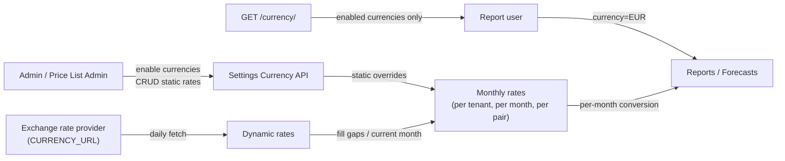

# Constant Currency

Design overview for constant currency in Cost Management
([COST-7252](https://redhat.atlassian.net/browse/COST-7252),
[COST-7345](https://redhat.atlassian.net/browse/COST-7345)).

Constant currency lets customers report costs in a stable target currency using
**per-month** exchange rates instead of applying today's market rate to every
month in a report range.

**Related docs**

| Document | Contents |
|----------|----------|
| [api.md](./api.md) | Endpoints, request/response shapes, permissions, errors |
| [design.md](./design.md) | Rate types, resolution rules, enablement, retention |

---

## Problem

Without constant currency, reports use a single latest exchange-rate matrix for
every month in the query. Historical months drift as market rates change daily.

Constant currency stores an effective rate **per currency pair per month**, so
a six-month report can use six different rates (or a customer-defined static
rate that covers those months).

---

## Concepts

| Concept | Meaning |
|---------|---------|
| **Enabled currency** | A currency available for the tenant in user-facing pickers and dynamic-rate population. Usually turned on by an administrator; base currencies from cloud provider billing are auto-enabled after summarization. |
| **Static exchange rate** | A tenant-defined rate for a directional pair (`base → target`) with a monthly validity window. |
| **Dynamic exchange rate** | A market rate fetched from the configured exchange-rate provider and stored per month. |
| **Monthly exchange rate** | The effective rate used when converting report (and forecast) costs for a given month and pair. Static rates override dynamic rates for that month. |
| **Finalized month** | Any month before the current calendar month. Its monthly rates are immutable. |

Feature gating uses Unleash flag
`cost-management.backend.constant-currency`. When the flag is off for a
tenant, reports keep the legacy “single latest rate for all months” behavior.

---

## User flows

### 1. Administrator enables currencies

1. Open **Settings → Currency**.
2. Browse or search the full ISO 4217 list
   (`GET …/settings/currency/`).
3. Enable a currency
   (`POST …/settings/currency/enabled/{code}/`),
   or rely on **auto-enable** when a cloud provider’s bill base currency
   appears in summarized AWS/Azure/GCP cost data.
4. Optionally disable a currency
   (`DELETE …/settings/currency/enabled/{code}/`).
   - At least one currency must remain enabled.
   - Disable is **blocked** (`400`) when the currency is the system/account
     default, or is used by cloud provider billing data, cost models, or
     price lists.

Enabled currencies drive:

- The public currency dropdown (`GET …/currency/`)
- Validation of report/forecast `currency` parameters
- Which pairs receive dynamic monthly rates

### 2. Price list administrator defines a static rate

1. From the currency settings view (static rates are nested under each base
   currency), create a rate
   (`POST …/settings/currency/static-rates/`).
2. Provide `base_currency`, `target_currency`, `exchange_rate`, `start_date`
   (first of a month), and `end_date` (last day of a month).
3. Update or delete later via
   `PUT` / `DELETE …/settings/currency/static-rates/{uuid}/`, subject to
   finalized-month rules (see [design.md](./design.md#static-rate-lifecycle)).

Static rates take precedence over dynamic rates for covered months. The reverse
direction is **not** auto-created as a static rate; unless the reverse pair is
also defined, reports use dynamic rates for that direction.

### 3. End user views costs in a target currency

1. Choose an enabled currency in the UI (backed by `GET …/currency/`).
2. Run a report or forecast for a date range.
3. With constant currency enabled:
   - Each month converts using that month’s monthly exchange rate for
     `bill/cost-model currency → target`.
   - If any required pair/month is missing, the API returns `400` with an
     actionable message (report data is not returned unconverted).

### 4. Operator inspects stored monthly rates (internal)

Ops/support can inspect the tenant’s monthly rates via the Masu admin endpoint
(`GET …/monthly_exchange_rates/?schema=…`). This is not a customer Settings API.

---

## Design at a glance

**Priority for a given pair and month**

1. Explicit static rate covering that month
2. Else dynamic monthly rate
3. Else request fails (no silent fallback to an unrelated month at query time)

Daily processing also **backfills missing past months** inside the data
retention window by copying forward from the next later existing rate for that
pair (never overwriting existing rows). Rates older than the retention window
are purged with other expired data ([COST-7345](https://redhat.atlassian.net/browse/COST-7345)).

---

## Design principles

1. **Per-month stability** — finalized months do not change when markets move.
2. **Static over dynamic** — customer-agreed rates win for their validity window.
3. **Controlled enablement** — only enabled currencies appear in UI; admins enable
   currencies, and cloud bill base currencies are auto-enabled after summarization.
4. **No multi-hop conversion** — only direct `base → target` pairs are used.
5. **Month-aligned validity** — static rate windows start on the 1st and end on
   the last day of a month.
6. **Show then error** — currencies can appear in pickers before every bill
   currency has a conversion path; missing rates produce a clear `400`.
7. **Retention aligned with cost data** — monthly rates live as long as retained
   report months for the tenant.
8. **Works without a market feed** — if `CURRENCY_URL` is unset, static rates
   still work; dynamic discovery/fetch is skipped.

---

## Roles and permissions

| Action | Permission |
|--------|------------|
| List currencies / enable / disable | Settings access |
| Create / update / delete static rates | Cost models (price list) access |
| Choose target currency on reports | Authenticated user (enabled currencies only) |
| Inspect monthly rates (Masu) | Internal/admin Masu API |
