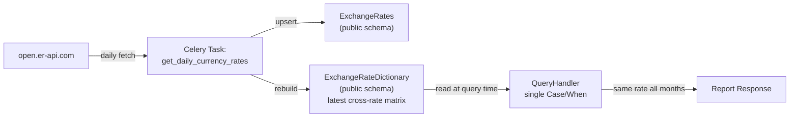
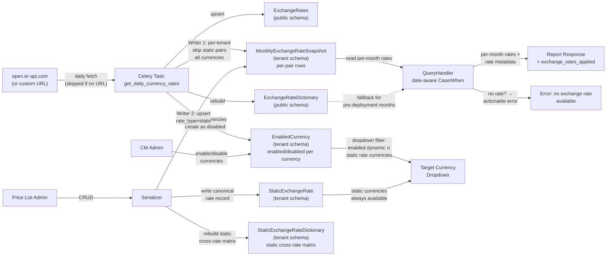

# Constant Currency for Cost Management

Technical design for user-defined ("static") exchange rates and dynamic rate
locking in the cost management pipeline, enabling customers to define stable,
agreed-upon currency conversion rates instead of relying on volatile daily
market rates.

**Jira Epic**: [COST-7252](https://redhat.atlassian.net/browse/COST-7252)
**Prerequisite reading**: [cost-models.md](../cost-models.md) — describes
the current cost model architecture that this feature extends.

---

## Decisions Needed

All design decisions for Phase 1 have been resolved.

| # | Decision | Status | Blocking Phase | Proposal |
|---|----------|--------|---------------|----------|
| **IQ-1** | Model placement: `cost_models` (tenant) vs `api` (shared) | **RESOLVED** | ~Phase 1~ | Both models in `cost_models` app (tenant schema). [Details](#iq-1-model-placement--resolved) |
| **IQ-2** | Unified snapshot table vs separate static/dynamic resolution at query time | **RESOLVED** | ~Phase 1~ | Single `MonthlyExchangeRateSnapshot` table as unified source. [Details](#iq-2-unified-snapshot-table--resolved) |
| **IQ-3** | Dynamic rate snapshotting: end-of-month only vs daily rolling | **RESOLVED** | ~Phase 1~ | Daily `update_or_create` for current month; immutable after month ends. [Details](#iq-3-dynamic-rate-snapshotting-strategy--resolved) |
| **IQ-4** | Month locking scope: static + dynamic vs dynamic only | **RESOLVED** | ~Phase 1~ | Locking applies only to dynamic rates; static rates are inherently stable. [Details](#iq-4-month-locking-scope--resolved) |
| **IQ-5** | Currency enablement: implicit vs explicit | **RESOLVED** | ~Phase 1~ | Explicit enablement by administrator; dynamic currencies arrive disabled. [Details](#iq-5-currency-enablement--resolved) |
| **IQ-6** | Rate resolution without `CURRENCY_URL` | **RESOLVED** | ~Phase 1~ | Static first, dynamic fallback, error if neither. `CURRENCY_URL` only affects fetch. [Details](#iq-6-rate-resolution-without-currency_url--resolved) |
| **IQ-7** | No-rate corner case: hide currency vs show with error | **RESOLVED** | ~Phase 1~ | Show currency in dropdown, return error when selected if no rate exists. [Details](#iq-7-no-rate-corner-case--resolved) |

---

## Open Questions — All Resolved

### OQ-1: Are dynamic rates stored in the database today? — RESOLVED

**Problem**: Does Koku persist historical exchange rates, or only the latest?

**Resolution**: The existing `ExchangeRateDictionary` model stores only the
*latest* cross-rate matrix as a JSONField. There is no historical record of past
exchange rates. The new `MonthlyExchangeRateSnapshot` model will provide
per-month, per-pair historical rate storage. See
[data-model.md § MonthlyExchangeRateSnapshot](./data-model.md#monthlyexchangeratesnapshot).

### OQ-2: Why store rates in the DB instead of computing at request time? — RESOLVED

**Problem**: Building the cross-rate matrix from raw `ExchangeRates` is
relatively lightweight. Why add a snapshot table?

**Resolution**: The snapshot table serves multiple purposes beyond performance:

1. **Historical stability** — finalized months retain their last recorded rate
2. **Static rate precedence** — static rates override dynamic without query-time merging logic
3. **Auditability** — each month's effective rate is recorded with its type (`static`/`dynamic`)
4. **Simplified query handler** — reads from one table, no multi-source merging at query time

---

## Implementation Questions + Proposals

### IQ-1: Model placement — RESOLVED

**Problem**: Should `StaticExchangeRate` and `MonthlyExchangeRateSnapshot` live in
the `api` app (shared/public schema) or `cost_models` app (tenant schema)?

**Resolution**: `cost_models` app (tenant schema). Static exchange rates are
tenant-specific — different tenants may have different bank-negotiated rates.
Dynamic snapshots are written per-tenant by the Celery task (same underlying
values across tenants, but tenant-isolated for data integrity).

**Rationale**: Aligns with existing cost model patterns. Naturally tenant-isolated
via `django-tenants`.

### IQ-2: Unified snapshot table — RESOLVED

**Problem**: Should query handlers merge rates from two sources
(`StaticExchangeRate` + `ExchangeRateDictionary`) at query time, or read from a
single pre-merged table?

**Resolution**: Single `MonthlyExchangeRateSnapshot` table. Both writers (Celery
task for dynamic, CRUD serializer for static) write to the same table. Query
handlers read **only** from this table.

**Rationale**: Eliminates query-time merging complexity. `rate_type` column tracks
provenance for report metadata. See
[pipeline-changes.md § Two Writers, One Reader](./pipeline-changes.md#two-writers-one-reader).

### IQ-3: Dynamic rate snapshotting strategy — RESOLVED

**Problem**: Should dynamic rates be snapshotted only on the last day of the month,
or updated daily?

**Resolution**: Daily `update_or_create` for the current month. This provides
resilience: if the task fails on the last day, the snapshot still contains the
most recent successful rate. Once the month ends, rows are never updated again.

**Rationale**: Rolling daily snapshots eliminate single-point-of-failure risk at
month boundaries. See [risk-register.md § R1](./risk-register.md#r1--celery-task-month-end-failure).

### IQ-4: Month locking scope — RESOLVED

**Problem**: Does "finalized month locking" apply to both static and dynamic rates?

**Resolution**: Dynamic rates only. Static rates are user-defined and inherently
stable — they don't change unless explicitly edited. The "locking" concept applies
to the dynamic fallback path: the Celery task overwrites the current month's
dynamic rows daily, but once the month rolls over, those rows are never touched
again.

### IQ-5: Currency enablement — RESOLVED

**Problem**: Should all currencies returned by the exchange rate API be
immediately available for use, or should an administrator explicitly enable them?

**Resolution**: Explicit enablement. Currencies fetched from the dynamic exchange
rate API arrive in Cost Management as **disabled** by default (stored in the
`EnabledCurrency` table with `enabled=False`). An administrator must explicitly
enable currencies through the Settings UI before they appear in the target
currency dropdown.

All currencies are always stored and snapshotted regardless of their enabled
status — the `enabled` flag only controls dropdown visibility, not data
storage or snapshotting. This ensures the underlying data is complete and
ready when an administrator enables a currency.

**Rationale**: Explicit enablement gives administrators control over which
currencies appear in their UI. In on-premise environments, customers may only
need a small subset of the ~170 currencies available from the API. Showing all
currencies by default would clutter the dropdown.

**Exception**: Static exchange rate pairs always make their currencies available
in the dropdown, regardless of `EnabledCurrency` status. If an administrator
defines a `USD→EUR` static rate, both `USD` and `EUR` are immediately available.

### IQ-6: Rate resolution without `CURRENCY_URL` — RESOLVED

**Problem**: How should Cost Management behave when `CURRENCY_URL` is not
configured (e.g., airgapped or disconnected deployments)?

**Resolution**: The system does not require `CURRENCY_URL` to function. Rate
resolution follows a simple priority: **static rates first, dynamic rates as
fallback, error if neither exists** for a given currency pair. When
`CURRENCY_URL` is empty or unset:

- The daily Celery task skips the API fetch step (no dynamic rates are fetched)
- Static exchange rates defined via the CRUD API work normally
- If dynamic rates were previously fetched (before the URL was removed), they
  remain available as fallback
- If no rate exists for a given pair (static or dynamic), the API returns an
  actionable error

The `CURRENCY_URL` setting is documented with the production API URL
(`open.er-api.com`) as a reference example. Only the free tier of the Open
Exchange Rates API is supported in this design.

**Rationale**: The system should work with whatever data is available rather
than treating the absence of `CURRENCY_URL` as a special mode. Customers can
define their own exchange rates via the CRUD API regardless of whether dynamic
rates are being fetched.

### IQ-7: No-rate corner case — RESOLVED

**Problem**: What happens when a currency is available in the dropdown (because
it appears in a static rate pair or is an enabled dynamic currency) but there is
no exchange rate path from the bill's source currency?

**Example**: Bill in USD. Static rates define EUR↔CHF and CNY↔SAR. User selects
EUR as the target currency. There is no USD→EUR rate.

**Resolution** (preferred approach): Show all available currencies in the
dropdown, but return an actionable error when the user selects a target currency
for which no conversion rate exists:

> *"No exchange rate available between USD and EUR. Ask your administrator to
> configure static exchange rates or enable dynamic exchange rates."*

**Rejected alternative**: Filter the dropdown to only show currencies with
available conversion paths from the bill currency. This was rejected because it
hides useful information from users — they wouldn't know which currencies exist
in the system or what to ask their administrator to configure.

---

## Quick Start

1. Read this README for decisions and architecture overview
2. Read [data-model.md](./data-model.md) for models, constraints, and migrations
3. Read [pipeline-changes.md](./pipeline-changes.md) for Celery task and query handler changes
4. Read [api-and-frontend.md](./api-and-frontend.md) for the CRUD endpoint and report enhancements
5. Read [phased-delivery.md](./phased-delivery.md) for Phase 1 artifacts, validation, and rollback
6. Read [risk-register.md](./risk-register.md) for risk mitigations

## Reading Order

### For the reviewing engineer

README → data-model.md → pipeline-changes.md → api-and-frontend.md →
phased-delivery.md → risk-register.md

### For frontend engineers

README (Architecture at a Glance) → api-and-frontend.md

---

## Document Catalog

| Document | Type | Summary |
|----------|------|---------|
| [README.md](./README.md) | **DD** | Decisions, architecture overview, key design decisions |
| [data-model.md](./data-model.md) | **DD** | New models, constraints, migration plan |
| [pipeline-changes.md](./pipeline-changes.md) | **DD** | Celery task modifications, query handler changes |
| [api-and-frontend.md](./api-and-frontend.md) | **DD** | CRUD endpoint, report response enhancement |
| [phased-delivery.md](./phased-delivery.md) | **DD** | Phase 1 & 2 artifacts, validation, rollback |
| [risk-register.md](./risk-register.md) | **Ref** | Risk summary, per-risk mitigations, risk × phase matrix |

---

## Architecture at a Glance

### Current Data Flow

**Key limitation**: `ExchangeRateDictionary` stores only the latest rates. All
months in a report query use the same exchange rate, causing historical reports
to drift as rates change daily.

### Proposed Data Flow (Phase 1)

**Key changes**:

1. Two writers feed one snapshot table
2. Query handler reads per-month rates instead of a single global rate
3. Report responses include rate provenance metadata
4. `StaticExchangeRateDictionary` mirrors `ExchangeRateDictionary` for static rates — rebuilt on every CRUD operation instead of daily
5. **Currency enablement**: Dynamic currencies arrive as disabled; administrator enables them via Settings to make them visible in the dropdown (all currencies are always stored and snapshotted)
6. **Rate resolution**: Static rates take precedence; dynamic rates are the fallback; error if neither exists. `CURRENCY_URL` only affects whether dynamic rates are fetched — the system works with whatever data is available
7. **Dropdown visibility**: Target currency dropdown shows only the union of enabled dynamic currencies and static rate currencies (disabled currencies are stored but hidden from the dropdown)
8. **No-rate error**: If user selects a currency with no conversion path from the bill currency, an actionable error is returned

---

## Key Design Decisions

| # | Decision | Rationale |
|---|----------|-----------|
| 1 | **Unified rate table**: `MonthlyExchangeRateSnapshot` stores both static and dynamic rates as per-pair rows | Query handlers read from one source; `rate_type` distinguishes provenance |
| 2 | **Model placement in `cost_models`** (tenant schema) | Static rates are tenant-specific; dynamic rates written per-tenant for isolation |
| 3 | **Static rates take precedence** | Daily task skips pairs with existing static rates for the current month |
| 4 | **No multi-hop conversion** | No chain conversion (e.g., USD→EUR→CNY) to avoid prioritization complexity |
| 5 | **Bidirectional implicit inverse** | USD→EUR at 0.87 implies EUR→USD = 1/0.87 unless explicitly defined |
| 6 | **Natural month boundaries** | Start/end dates must align to first/last day of month; no mid-month validity periods |
| 7 | **Simple integer versioning** | Auto-increment on `StaticExchangeRate.version`; Phase 2 adds full audit history |
| 8 | **Automatic finalized month locking** | Dynamic rows overwritten daily during current month; untouched after month ends |
| 9 | **Forward-only snapshots** | Pre-deployment months have no snapshot rows; fall back to `ExchangeRateDictionary` |
| 10 | **Per-pair rows, not JSON blob** | Enables `unique_together` constraint, simpler queries, cleaner ORM integration |
| 11 | **`StaticExchangeRateDictionary` mirrors `ExchangeRateDictionary`** | Same cross-rate matrix format; dynamic matrix rebuilt daily by Celery, static matrix rebuilt on each CRUD operation |
| 12 | **Explicit currency enablement** | Dynamic currencies arrive disabled; administrator enables them in Settings to control which currencies appear in the dropdown. All currencies are always stored and snapshotted regardless of enabled status. |
| 13 | **Configurable exchange rate URL** | `CURRENCY_URL` is a variable; empty value skips dynamic rate fetching. System works with whatever rates are available (static first, dynamic fallback, error if neither). Documentation references `open.er-api.com` (free tier) as the production example |
| 14 | **Show-then-error for no-rate currencies** | Available currencies appear in dropdown even without a conversion path from the bill currency; actionable error returned on selection |
| 15 | **Static rates bypass enablement** | Currencies in static exchange rate pairs are always available in dropdowns regardless of `EnabledCurrency` status |

---

## Changelog

| Version | Date | Summary |
|---------|------|---------|
| v1.0 | 2026-03-19 | Initial technical design |
| v1.1 | 2026-03-24 | Added currency enablement (IQ-5), airgapped mode (IQ-6), no-rate corner case (IQ-7), design decisions 12–15 |
| v1.2 | 2026-03-24 | Simplified enablement: `enabled` flag only controls dropdown visibility, not snapshotting. All currencies always stored. |
| v1.3 | 2026-03-24 | Removed airgapped mode concept. Rate resolution: static first, dynamic fallback, error if neither. `CURRENCY_URL` only affects API fetch. |
