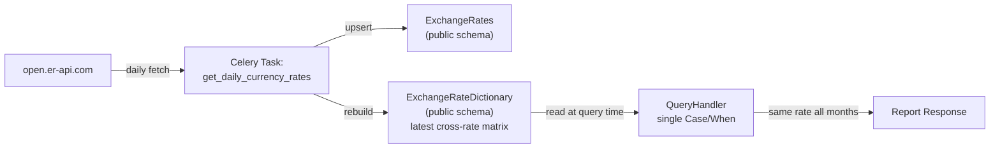
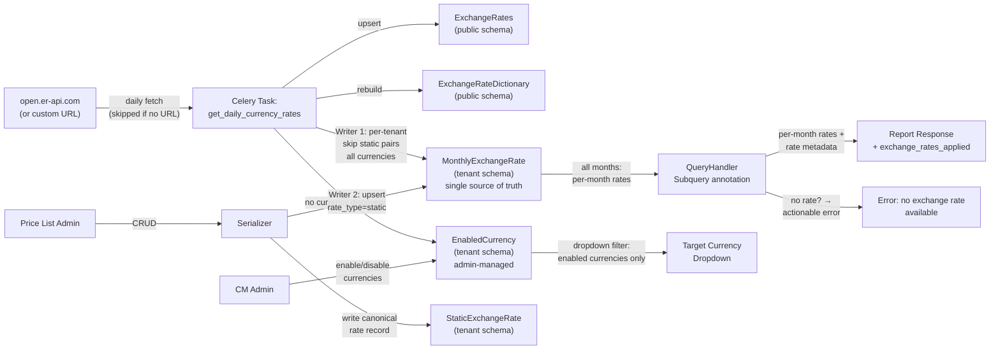

# Constant Currency for Cost Management

Technical design for user-defined ("static") exchange rates and dynamic rate
locking in the cost management pipeline, enabling customers to define stable,
agreed-upon currency conversion rates instead of relying on volatile daily
market rates.

**Jira Epic**: [COST-7252](https://redhat.atlassian.net/browse/COST-7252)
**Prerequisite reading**: [cost-models.md](../cost-models.md) — describes
the current cost model architecture that this feature extends.

---

## Decisions Needed

All design decisions for Phase 1 have been resolved.

| # | Decision | Status | Blocking Phase | Proposal |
|---|----------|--------|---------------|----------|
| **IQ-1** | Model placement: `cost_models` (tenant) vs `api` (shared) | **RESOLVED** | ~Phase 1~ | Both models in `cost_models` app (tenant schema). [Details](#iq-1-model-placement--resolved) |
| **IQ-2** | Unified table vs separate static/dynamic resolution at query time | **RESOLVED** | ~Phase 1~ | `MonthlyExchangeRate` is the single source of truth for all months. [Details](#iq-2-unified-table--resolved) |
| **IQ-3** | Dynamic rate snapshotting: end-of-month only vs daily rolling | **RESOLVED** | ~Phase 1~ | Daily `update_or_create` for current month; immutable after month ends. [Details](#iq-3-dynamic-rate-snapshotting-strategy--resolved) |
| **IQ-4** | Month locking scope: static + dynamic vs dynamic only | **RESOLVED** | ~Phase 1~ | Locking applies only to dynamic rates; static rates are inherently stable. [Details](#iq-4-month-locking-scope--resolved) |
| **IQ-5** | Currency enablement: implicit vs explicit | **RESOLVED** | ~Phase 1~ | Explicit enablement by administrator; dynamic currencies arrive disabled. [Details](#iq-5-currency-enablement--resolved) |
| **IQ-6** | Rate resolution without `CURRENCY_URL` | **RESOLVED** | ~Phase 1~ | Static first, dynamic fallback, error if neither. `CURRENCY_URL` only affects fetch. [Details](#iq-6-rate-resolution-without-currency_url--resolved) |
| **IQ-7** | No-rate corner case: hide currency vs show with error | **RESOLVED** | ~Phase 1~ | Show currency in dropdown, return error when selected if no rate exists. [Details](#iq-7-no-rate-corner-case--resolved) |

---

## Open Questions — All Resolved

### OQ-1: Are dynamic rates stored in the database today? — RESOLVED

**Problem**: Does Koku persist historical exchange rates, or only the latest?

**Resolution**: The existing `ExchangeRateDictionary` model stores only the
*latest* cross-rate matrix as a JSONField. There is no historical record of past
exchange rates. The new `MonthlyExchangeRate` model provides per-month, per-pair
rate storage — serving as the single source of truth for both current and
historical rates. See
[data-model.md § MonthlyExchangeRate](./data-model.md#monthlyexchangerate).

### OQ-2: Why store rates in the DB instead of computing at request time? — RESOLVED

**Problem**: Building the cross-rate matrix from raw `ExchangeRates` is
relatively lightweight. Why add a dedicated table?

**Resolution**: `MonthlyExchangeRate` serves multiple purposes beyond performance:

1. **Single source of truth** — one table for all months, current and past
2. **Historical stability** — finalized months retain their last recorded rate
3. **Auditability** — each month's effective rate is recorded with its type (`static`/`dynamic`)
4. **Month locking** — dynamic rates are locked at month-end; the table preserves whatever rate was in effect

Query handlers read from `MonthlyExchangeRate` for all months. The M2 migration
seeds current-month data from `ExchangeRateDictionary` at deployment time, so
data is available immediately. Pre-deployment months fall back to the earliest
available rate for each currency pair.

---

## Implementation Questions + Proposals

### IQ-1: Model placement — RESOLVED

**Problem**: Should `StaticExchangeRate` and `MonthlyExchangeRate` live in
the `api` app (shared/public schema) or `cost_models` app (tenant schema)?

**Resolution**: `cost_models` app (tenant schema). Static exchange rates are
tenant-specific — different tenants may have different bank-negotiated rates.
Dynamic rates are written per-tenant by the Celery task (same underlying
values across tenants, but tenant-isolated for data integrity).

**Rationale**: Aligns with existing cost model patterns. Naturally tenant-isolated
via `django-tenants`.

### IQ-2: Unified table — RESOLVED

**Problem**: Should query handlers merge rates from two sources
(`StaticExchangeRate` + `ExchangeRateDictionary`) at query time, or read from a
single pre-merged table?

**Resolution**: Single source of truth. `MonthlyExchangeRate` stores per-month,
per-pair rates for all months — both current and past. Two writers keep it
up to date:

- **Writer 1** (Celery task): Upserts `rate_type=dynamic` rows daily for the
  current month, skipping pairs with existing static rates.
- **Writer 2** (CRUD serializer): Upserts `rate_type=static` rows for each
  month in a static rate's validity period.

Query handlers read from `MonthlyExchangeRate` for all months. The `rate_type`
column tracks provenance for report metadata.

**Rationale**: A single table eliminates the two-tier resolution complexity
(previously: dictionaries for current month, snapshots for past months). The
current month's rows are kept up to date by the writers, so they are always
authoritative. Past months' rows are locked automatically when the month ends.
See [pipeline-changes.md § Rate Resolution](./pipeline-changes.md#rate-resolution-strategy).

### IQ-3: Dynamic rate snapshotting strategy — RESOLVED

**Problem**: Should dynamic rates be written only on the last day of the month,
or updated daily?

**Resolution**: Daily `update_or_create` for the current month. This provides
resilience: if the task fails on the last day, `MonthlyExchangeRate` still
contains the most recent successful rate. Once the month ends, rows are never
updated again.

**Rationale**: Rolling daily updates eliminate single-point-of-failure risk at
month boundaries. See [risk-register.md § R1](./risk-register.md#r1--celery-task-month-end-failure).

### IQ-4: Month locking scope — RESOLVED

**Problem**: Does "finalized month locking" apply to both static and dynamic rates?

**Resolution**: Dynamic rates only. Static rates are user-defined and inherently
stable — they don't change unless explicitly edited. The "locking" concept applies
to the dynamic fallback path: the Celery task overwrites the current month's
dynamic rows daily, but once the month rolls over, those rows are never touched
again.

### IQ-5: Currency enablement — RESOLVED

**Problem**: Should all currencies returned by the exchange rate API be
immediately available for use, or should an administrator explicitly enable them?

**Resolution**: Explicit enablement. The full list of known currencies comes from
Babel's ISO 4217 registry. Only currencies that an administrator has explicitly
enabled are stored in the `EnabledCurrency` table. An administrator must enable
currencies through the Settings API (`POST settings/currency/exchange_rate/{code}/enable/`) before
they appear in the target currency dropdown.

All currencies are always stored in `MonthlyExchangeRate` regardless of their
enabled status — the `EnabledCurrency` table only controls dropdown visibility,
not data storage. This ensures the underlying data is complete and
ready when an administrator enables a currency.

**Rationale**: Explicit enablement gives administrators control over which
currencies appear in their UI. In on-premise environments, customers may only
need a small subset of the ~300 ISO 4217 currencies. Showing all currencies by
default would clutter the dropdown.

### IQ-6: Rate resolution without `CURRENCY_URL` — RESOLVED

**Problem**: How should Cost Management behave when `CURRENCY_URL` is not
configured (e.g., airgapped or disconnected deployments)?

**Resolution**: The system does not require `CURRENCY_URL` to function. Rate
resolution follows a simple priority: **static rates first, dynamic rates as
fallback, error if neither exists** for a given currency pair. When
`CURRENCY_URL` is empty or unset:

- The daily Celery task skips the API fetch step (no dynamic rates are fetched)
- Static exchange rates defined via the CRUD API work normally
- If dynamic rates were previously fetched (before the URL was removed), they
  remain available as fallback
- If no rate exists for a given pair (static or dynamic), the API returns an
  actionable error

The `CURRENCY_URL` setting is documented with the production API URL
(`open.er-api.com`) as a reference example. Only the free tier of the Open
Exchange Rates API is supported in this design.

**Rationale**: The system should work with whatever data is available rather
than treating the absence of `CURRENCY_URL` as a special mode. Customers can
define their own exchange rates via the CRUD API regardless of whether dynamic
rates are being fetched.

### IQ-7: No-rate corner case — RESOLVED

**Problem**: What happens when a currency is available in the dropdown (because
it appears in a static rate pair or is an enabled dynamic currency) but there is
no exchange rate path from the bill's source currency?

**Example**: Bill in USD. Static rates define EUR↔CHF and CNY↔SAR. User selects
EUR as the target currency. There is no USD→EUR rate.

**Resolution** (preferred approach): Show all available currencies in the
dropdown, but return an actionable error when the user selects a target currency
for which no conversion rate exists:

> *"No exchange rate available between USD and EUR. Ask your administrator to
> configure static exchange rates or enable dynamic exchange rates."*

**Rejected alternative**: Filter the dropdown to only show currencies with
available conversion paths from the bill currency. This was rejected because it
hides useful information from users — they wouldn't know which currencies exist
in the system or what to ask their administrator to configure.

---

## Quick Start

1. Read this README for decisions and architecture overview
2. Read [data-model.md](./data-model.md) for models, constraints, and migrations
3. Read [pipeline-changes.md](./pipeline-changes.md) for Celery task and query handler changes
4. Read [api-and-frontend.md](./api-and-frontend.md) for the CRUD endpoint and report enhancements
5. Read [phased-delivery.md](./phased-delivery.md) for Phase 1 artifacts, validation, and rollback
6. Read [risk-register.md](./risk-register.md) for risk mitigations

## Reading Order

### For the reviewing engineer

README → data-model.md → pipeline-changes.md → api-and-frontend.md →
phased-delivery.md → risk-register.md

### For frontend engineers

README (Architecture at a Glance) → api-and-frontend.md

---

## Document Catalog

| Document | Type | Summary |
|----------|------|---------|
| [README.md](./README.md) | **DD** | Decisions, architecture overview, key design decisions |
| [data-model.md](./data-model.md) | **DD** | New models, constraints, migration plan |
| [pipeline-changes.md](./pipeline-changes.md) | **DD** | Celery task modifications, query handler changes |
| [api-and-frontend.md](./api-and-frontend.md) | **DD** | CRUD endpoint, report response enhancement |
| [phased-delivery.md](./phased-delivery.md) | **DD** | Phase 1 & 2 artifacts, validation, rollback |
| [risk-register.md](./risk-register.md) | **Ref** | Risk summary, per-risk mitigations, risk × phase matrix |

---

## Architecture at a Glance

### Current Data Flow

**Key limitation**: `ExchangeRateDictionary` stores only the latest rates. All
months in a report query use the same exchange rate, causing historical reports
to drift as rates change daily.

### Proposed Data Flow (Phase 1)

**Key changes**:

1. **Single source of truth**: `MonthlyExchangeRate` stores rates for all months (current and past); query handlers read from this one table
2. **Two writers**: Celery task writes dynamic rates daily for the current month; CRUD serializer writes static rates for affected months
3. **Rate resolution**: All months read from `MonthlyExchangeRate`; M2 migration seeds current-month data at deployment; pre-deployment months fall back to earliest available rate; error if no rate exists at all for a currency pair
4. Report responses include rate provenance metadata
5. **Currency enablement**: Dynamic currencies arrive as disabled; administrator enables them via Settings to make them visible in the dropdown (all currencies are always stored)
6. **Dropdown visibility**: Target currency dropdown shows only currencies that an administrator has explicitly enabled (static rate currencies still require enablement)
7. **No-rate error**: If user selects a currency with no conversion path from the bill currency, an actionable error is returned

---

## Key Design Decisions

| # | Decision | Rationale |
|---|----------|-----------|
| 1 | **`MonthlyExchangeRate` is the single source of truth** | One table for all months (current and past). Two writers keep it up to date; query handlers read from it for everything. Eliminates the complexity of two-tier resolution. |
| 2 | **Model placement in `cost_models`** (tenant schema) | Static rates are tenant-specific; dynamic rates written per-tenant for isolation |
| 3 | **Static rates take precedence** | Daily task skips pairs with existing static rates for the current month |
| 4 | **No multi-hop conversion** | No chain conversion (e.g., USD→EUR→CNY) to avoid prioritization complexity |
| 5 | **Bidirectional implicit inverse** | USD→EUR at 0.87 implies EUR→USD = 1/0.87 unless explicitly defined |
| 6 | **Natural month boundaries** | Start/end dates must align to first/last day of month; no mid-month validity periods |
| 7 | **Automatic finalized month locking** | Dynamic rows overwritten daily during current month; untouched after month ends |
| 8 | **Forward-only with current-month seed** | M2 migration seeds current-month data from `ExchangeRateDictionary`; pre-deployment months fall back to earliest available rate |
| 9 | **Per-pair rows, not JSON blob** | Enables `unique_together` constraint, simpler queries, cleaner ORM integration |
| 10 | **Explicit currency enablement** | Dynamic currencies arrive disabled; administrator enables them in Settings to control which currencies appear in the dropdown. All currencies are always stored regardless of enabled status. |
| 11 | **Configurable exchange rate URL** | `CURRENCY_URL` is a variable; empty value skips dynamic rate fetching. System works with whatever rates are available (static first, dynamic fallback, error if neither). Documentation references `open.er-api.com` (free tier) as the production example |
| 12 | **Show-then-error for no-rate currencies** | Available currencies appear in dropdown even without a conversion path from the bill currency; actionable error returned on selection |
| 13 | **Enablement is always required for reports** | Static exchange rate currencies must still be explicitly enabled to appear in the report dropdown. The settings admin page shows them regardless for management purposes. |

---

## Changelog

| Version | Date | Summary |
|---------|------|---------|
| v1.0 | 2026-03-19 | Initial technical design |
| v1.1 | 2026-03-24 | Added currency enablement (IQ-5), airgapped mode (IQ-6), no-rate corner case (IQ-7), design decisions 12–15 |
| v1.2 | 2026-03-24 | Simplified enablement: `enabled` flag only controls dropdown visibility, not snapshotting. All currencies always stored. |
| v1.3 | 2026-03-24 | Removed airgapped mode concept. Rate resolution: static first, dynamic fallback, error if neither. `CURRENCY_URL` only affects API fetch. |
| v1.4 | 2026-03-26 | Clarified two-tier rate resolution: dictionaries are sources of truth, snapshots are for historical report rates. Updated data flow diagram to show query handler reading from `StaticExchangeRateDictionary`. |
| v1.5 | 2026-03-30 | `MonthlyExchangeRate` replaces `MonthlyExchangeRateSnapshot` as single source of truth for all months. Removed `StaticExchangeRateDictionary`. Simplified data flow diagram and design decisions. Renumbered decisions (old 11 removed, old 12–15 → 11–14). |
| v1.6 | 2026-03-30 | Removed `ExchangeRateDictionary` fallback from query handler. M2 seeds current-month data. Decision #9 updated. |
| v1.7 | 2026-04-12 | Updated data flow diagram: query handler uses `Subquery` annotation instead of `Case`/`When`. |
| v1.8 | 2026-04-13 | Synced pre-deployment month references: fall back to earliest available rate (aligns with pipeline-changes.md v2.1). |
| v1.9 | 2026-04-28 | Updated currency enablement URL reference to `settings/currency/exchange_rate/{code}/enable/`. |
| v2.0 | 2026-04-28 | Removed static-rate enablement bypass (decision #13). Report dropdown governed solely by `EnabledCurrency`; settings admin page shows static rates regardless. |
