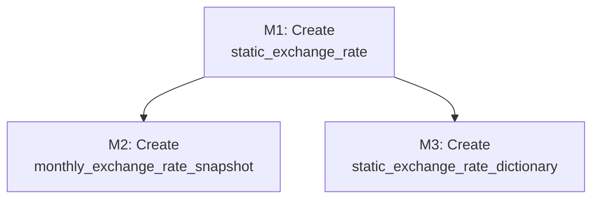

# Data Model Changes

Data model for the Constant Currency feature
([COST-7252](https://redhat.atlassian.net/browse/COST-7252)). Introduces two
new tenant-scoped models and their migrations.

> **See also**: [README.md § Architecture at a Glance](./README.md#architecture-at-a-glance)
> for the data flow diagrams that show how these models fit into the pipeline.

---

## Current State

**Public schema models** (no tenant context needed):

| Model | App | Purpose |
|-------|-----|---------|
| `ExchangeRates` | `api.currency` | Raw API response rows. One row per `(base_currency, exchange_rates JSONField)`. Updated daily by `get_daily_currency_rates`. |
| `ExchangeRateDictionary` | `api.currency` | Single row: `currency_exchange_dictionary` JSONField — nested dict `{base: {target: rate}}`. Rebuilt daily by `build_exchange_dictionary()` in `api/currency/utils.py`. |

**Example `ExchangeRates` rows**:

| id | base_currency | exchange_rates |
|----|---------------|----------------|
| 1 | `USD` | `{"EUR": 0.87, "GBP": 0.74, "CNY": 7.23, "JPY": 149.50}` |
| 2 | `EUR` | `{"USD": 1.15, "GBP": 0.85, "CNY": 8.31, "JPY": 171.80}` |
| 3 | `GBP` | `{"USD": 1.35, "EUR": 1.18, "CNY": 9.77, "JPY": 202.10}` |

**Example `ExchangeRateDictionary` row** (single row in the table):

| id | currency_exchange_dictionary | updated_timestamp |
|----|------------------------------|-------------------|
| 1 | *(see JSON below)* | `2026-03-24 06:00:00+00` |

**Current exchange rate storage** (simplified):

```json
{
  "USD": {"EUR": 0.87, "GBP": 0.74, "CNY": 7.23, ...},
  "EUR": {"USD": 1.15, "GBP": 0.85, "CNY": 8.31, ...},
  ...
}
```

**Limitation**: No historical rate storage. Only the latest snapshot exists.
All months in a report query use the same rate, meaning historical reports
drift as rates change daily.

---

## New Models

Both models are placed in `cost_models` app (tenant schema). See
[README.md § IQ-1](./README.md#iq-1-model-placement--resolved) for the
placement rationale.

### `StaticExchangeRate`

User-defined exchange rates with validity periods.

```python
class StaticExchangeRate(models.Model):
    uuid = models.UUIDField(primary_key=True, default=uuid4)
    base_currency = models.CharField(max_length=5)
    target_currency = models.CharField(max_length=5)
    exchange_rate = models.DecimalField(max_digits=33, decimal_places=15)
    start_date = models.DateField()   # first day of a natural month
    end_date = models.DateField()     # last day of a natural month (or later)
    version = models.IntegerField(default=1)
    created_timestamp = models.DateTimeField(auto_now_add=True)
    updated_timestamp = models.DateTimeField(auto_now=True)

    class Meta:
        db_table = "static_exchange_rate"
        ordering = ["-updated_timestamp"]
```

**Example `static_exchange_rate` rows**:

| uuid | base_currency | target_currency | exchange_rate | start_date | end_date | version | created_timestamp | updated_timestamp |
|------|---------------|-----------------|---------------|------------|----------|---------|-------------------|-------------------|
| `a1b2c3d4-...` | `USD` | `EUR` | `0.920000000000000` | `2026-01-01` | `2026-03-31` | 1 | `2026-01-15 10:30:00+00` | `2026-01-15 10:30:00+00` |
| `e5f6a7b8-...` | `USD` | `GBP` | `0.780000000000000` | `2026-01-01` | `2026-01-31` | 2 | `2026-01-10 08:00:00+00` | `2026-01-20 14:22:00+00` |
| `c9d0e1f2-...` | `EUR` | `GBP` | `0.848000000000000` | `2026-02-01` | `2026-06-30` | 1 | `2026-02-01 09:00:00+00` | `2026-02-01 09:00:00+00` |

In this example:
- The `USD→EUR` rate of `0.92` applies for Jan–Mar 2026 (overrides dynamic rates for those months)
- The `USD→GBP` rate was updated once (`version=2`) and only covers January
- The `EUR→GBP` rate covers Feb–Jun 2026

**Constraints** (enforced in serializer validation):

- `base_currency` and `target_currency` must be in `VALID_CURRENCIES`
- `base_currency != target_currency`
- `start_date` must be the 1st of a month; `end_date` must be the last day of
  that same month or a later month
- No overlapping validity periods for the same `(base_currency, target_currency)`
  directional pair
- `version` auto-increments on update (managed by serializer, not DB trigger)

**Computed properties**:

- `name` (read-only): `"{base_currency}-{target_currency}"`

**Bidirectional behavior**: If `USD→EUR` is defined but `EUR→USD` is not, the
inverse (`1/rate`) is used automatically. If both directions are explicitly
defined, each uses its own rate.

**Registration points**: None. This model is accessed only via the CRUD API
(see [api-and-frontend.md](./api-and-frontend.md)) and has side effects on
`MonthlyExchangeRateSnapshot` via the serializer.

### `EnabledCurrency`

Tracks which currencies are visible in the target currency dropdown. Currencies
must be explicitly enabled by an administrator before they appear in the
dropdown. All currencies are always stored and snapshotted regardless of their
enabled status — the `enabled` flag only controls dropdown visibility.

```python
class EnabledCurrency(models.Model):
    currency_code = models.CharField(max_length=5, unique=True)
    enabled = models.BooleanField(default=False)
    created_timestamp = models.DateTimeField(auto_now_add=True)
    updated_timestamp = models.DateTimeField(auto_now=True)

    class Meta:
        db_table = "enabled_currency"
        ordering = ["currency_code"]
```

**Example `enabled_currency` rows**:

| id | currency_code | enabled | created_timestamp | updated_timestamp |
|----|---------------|---------|-------------------|-------------------|
| 1 | `USD` | `true` | `2026-01-01 06:00:00+00` | `2026-01-01 06:00:00+00` |
| 2 | `EUR` | `true` | `2026-01-01 06:00:00+00` | `2026-01-15 10:30:00+00` |
| 3 | `GBP` | `false` | `2026-01-01 06:00:00+00` | `2026-01-01 06:00:00+00` |
| 4 | `CNY` | `false` | `2026-01-01 06:00:00+00` | `2026-01-01 06:00:00+00` |
| 5 | `JPY` | `false` | `2026-01-01 06:00:00+00` | `2026-01-01 06:00:00+00` |

In this example, `USD` and `EUR` are enabled and will appear in the target
currency dropdown. `GBP`, `CNY`, and `JPY` were discovered by the daily Celery
task (fetched from the exchange rate API) but have not yet been enabled by an
administrator — they are stored and snapshotted but hidden from the dropdown.

**Lifecycle**:

| Event | Action |
|-------|--------|
| Daily Celery task fetches from exchange rate API | Creates `EnabledCurrency` rows with `enabled=False` for any newly discovered currencies not already in the table |
| Administrator enables a currency in Settings | Sets `enabled=True` |
| Administrator disables a currency in Settings | Sets `enabled=False` |

**How currencies become "available" in dropdowns**:

A currency is visible in the target currency dropdown if **any** of the
following are true:

1. It has `enabled=True` in `EnabledCurrency`
2. It appears in any `StaticExchangeRate` pair (static rates make their currencies
   visible regardless of the `EnabledCurrency` status)

**Corner case — no usable rate**: A currency may be available in the dropdown but
have no exchange rate path from the bill's source currency. In this case, the API
returns an error: *"No exchange rate available. Ask your administrator to configure
static exchange rates or enable dynamic exchange rates."* See
[api-and-frontend.md § Corner Case: No Exchange Rate](./api-and-frontend.md#corner-case-no-exchange-rate).

**No `CURRENCY_URL` configured**: When the URL is not set, no dynamic currencies
are discovered by the Celery task, so no rows are created automatically. The
table may still contain previously fetched currencies or manually-created rows.
The system does not treat this as a special mode — it uses whatever rates are
available (static first, dynamic fallback, error if neither exists). If no
currencies are visible (all disabled and no static rates), the currency dropdown
is hidden or shows *"No exchange rates available."*

**Registration points**: None. Accessed via the Settings API (see
[api-and-frontend.md § Currency Enablement](./api-and-frontend.md#currency-enablement-settings-api)).

### `StaticExchangeRateDictionary`

Pre-computed cross-rate matrix for static rates. Mirrors the existing public
schema `ExchangeRateDictionary` (which stores the dynamic cross-rate matrix)
but lives in the tenant schema and contains only user-defined static rates.

```python
class StaticExchangeRateDictionary(models.Model):
    currency_exchange_dictionary = JSONField(null=True)
    updated_timestamp = models.DateTimeField(auto_now=True)

    class Meta:
        db_table = "static_exchange_rate_dictionary"
```

**Example content** (same nested dict format as `ExchangeRateDictionary`):

```json
{
  "USD": {"EUR": 0.87, "GBP": 0.74},
  "EUR": {"USD": 1.149425},
  "GBP": {"USD": 1.351351}
}
```

**Example `static_exchange_rate_dictionary` row** (single row in the table):

| id | currency_exchange_dictionary | updated_timestamp |
|----|------------------------------|-------------------|
| 1 | `{"USD": {"EUR": 0.92, "GBP": 0.78}, "EUR": {"USD": 1.086957, "GBP": 0.848}, "GBP": {"USD": 1.282051, "EUR": 1.179245}}` | `2026-02-01 09:00:00+00` |

Note how the dictionary includes implicit inverses: even though only `USD→EUR`,
`USD→GBP`, and `EUR→GBP` were explicitly defined in `StaticExchangeRate`, the
reverse directions (`EUR→USD`, `GBP→USD`, `GBP→EUR`) are computed as `1/rate`
and included automatically.

**Lifecycle**: Unlike `ExchangeRateDictionary` (rebuilt daily by a Celery task),
`StaticExchangeRateDictionary` is rebuilt on every `StaticExchangeRate` CRUD
operation:

| Event | Action |
|-------|--------|
| User **creates** a static rate | Rebuild the dictionary from all `StaticExchangeRate` rows |
| User **updates** a static rate | Rebuild the dictionary from all `StaticExchangeRate` rows |
| User **deletes** a static rate | Rebuild the dictionary from all `StaticExchangeRate` rows |

The rebuild is performed by the serializer inside the same `transaction.atomic()`
block as the `StaticExchangeRate` write. See
[pipeline-changes.md § Writer 2](./pipeline-changes.md#static-rate--snapshot--writer-2).

**Bidirectional behavior**: Implicit inverses (1/rate) are included in the matrix
for pairs where only one direction is explicitly defined, matching the behavior
of `ExchangeRateDictionary`.

**Registration points**: None. Configuration/metadata table, not a reporting
table.

### `MonthlyExchangeRateSnapshot`

Unified table storing both static and dynamic rates as per-pair rows. Single
source of truth for query-time resolution.

```python
class RateType(models.TextChoices):
    STATIC = "static", "Static"
    DYNAMIC = "dynamic", "Dynamic"

class MonthlyExchangeRateSnapshot(models.Model):
    year_month = models.CharField(max_length=7)       # "2026-03"
    base_currency = models.CharField(max_length=5)
    target_currency = models.CharField(max_length=5)
    exchange_rate = models.DecimalField(max_digits=33, decimal_places=15)
    rate_type = models.CharField(max_length=10, choices=RateType.choices)
    created_timestamp = models.DateTimeField(auto_now_add=True)
    updated_timestamp = models.DateTimeField(auto_now=True)

    class Meta:
        db_table = "monthly_exchange_rate_snapshot"
        unique_together = ("year_month", "base_currency", "target_currency")
```

**Constraints**:

- `unique_together` ensures one rate per `(month, base, target)` triple
- `rate_type` is constrained to `RateType.choices` (`"static"` or `"dynamic"`)

**Example `monthly_exchange_rate_snapshot` rows**:

| id | year_month | base_currency | target_currency | exchange_rate | rate_type | created_timestamp | updated_timestamp |
|----|------------|---------------|-----------------|---------------|-----------|-------------------|-------------------|
| 1 | `2026-01` | `USD` | `EUR` | `0.920000000000000` | `static` | `2026-01-15 10:30:00+00` | `2026-01-15 10:30:00+00` |
| 2 | `2026-02` | `USD` | `EUR` | `0.920000000000000` | `static` | `2026-01-15 10:30:00+00` | `2026-01-15 10:30:00+00` |
| 3 | `2026-03` | `USD` | `EUR` | `0.920000000000000` | `static` | `2026-01-15 10:30:00+00` | `2026-01-15 10:30:00+00` |
| 4 | `2026-01` | `USD` | `GBP` | `0.780000000000000` | `static` | `2026-01-10 08:00:00+00` | `2026-01-20 14:22:00+00` |
| 5 | `2026-02` | `USD` | `GBP` | `0.740000000000000` | `dynamic` | `2026-02-01 06:00:00+00` | `2026-02-01 06:00:00+00` |
| 6 | `2026-03` | `USD` | `GBP` | `0.738500000000000` | `dynamic` | `2026-03-01 06:00:00+00` | `2026-03-24 06:00:00+00` |
| 7 | `2026-01` | `USD` | `CNY` | `7.230000000000000` | `dynamic` | `2026-01-01 06:00:00+00` | `2026-01-31 06:00:00+00` |
| 8 | `2026-02` | `USD` | `CNY` | `7.185000000000000` | `dynamic` | `2026-02-01 06:00:00+00` | `2026-02-28 06:00:00+00` |

In this example:
- **Rows 1–3**: `USD→EUR` uses a **static** rate (`0.92`) for all three months
  because the user defined a static rate covering Jan–Mar 2026. The daily Celery
  task skips this pair for those months.
- **Row 4**: `USD→GBP` uses a **static** rate (`0.78`) for January only (the
  static rate's `end_date` was `2026-01-31`).
- **Rows 5–6**: `USD→GBP` falls back to **dynamic** rates for Feb and Mar since
  no static rate covers those months. The dynamic rate is updated daily by the
  Celery task.
- **Rows 7–8**: `USD→CNY` has no static rate defined, so all months use
  **dynamic** rates.

**Two writers, one reader pattern**:

- **Writer 1** (Celery task): Upserts `rate_type=RateType.DYNAMIC` rows daily for
  current month, skipping pairs with existing static rates. See
  [pipeline-changes.md § Writer 1](./pipeline-changes.md#modified-get_daily_currency_rates--writer-1).
- **Writer 2** (CRUD serializer): Upserts `rate_type=RateType.STATIC` rows for each
  month in a static rate's validity period. See
  [pipeline-changes.md § Writer 2](./pipeline-changes.md#static-rate--snapshot--writer-2).
- **Reader** (query handler): Reads all rows for the query's date range, builds
  per-month `Case`/`When` annotations. See
  [pipeline-changes.md § Reader](./pipeline-changes.md#modified-query-handler--reader).

**Registration points**: None. Not added to `UI_SUMMARY_TABLES` or any cleaner
registry — this is a configuration/metadata table, not a reporting table.

---

## Database Migration Plan

### Migration Sequence Overview



All are standard `CreateModel` migrations in `cost_models/migrations/`. Since
`cost_models` is a tenant app, migrations run in each tenant schema via
`migrate_schemas`.

### M1: Create `static_exchange_rate` Table

| Field | Value |
|-------|-------|
| **Phase** | 1 |
| **Type** | `CreateModel` (standard, no partitioning) |
| **App** | `cost_models` |
| **Depends on** | Previous `cost_models` migration |
| **Rollback** | `DeleteModel` |

**What migration does NOT do**: No data migration needed. Table starts empty;
populated via user CRUD.

### M2: Create `monthly_exchange_rate_snapshot` Table

| Field | Value |
|-------|-------|
| **Phase** | 1 |
| **Type** | `CreateModel` (standard, no partitioning) |
| **App** | `cost_models` |
| **Depends on** | M1 |
| **Rollback** | `DeleteModel` |

**What migration does NOT do**: No data migration or backfill. Table is populated
going forward by the daily Celery task and CRUD side effects.

### M3: Create `static_exchange_rate_dictionary` Table

| Field | Value |
|-------|-------|
| **Phase** | 1 |
| **Type** | `CreateModel` (standard, no partitioning) |
| **App** | `cost_models` |
| **Depends on** | M1 |
| **Rollback** | `DeleteModel` |

**What migration does NOT do**: No data migration needed. Table starts empty
(or with a single row containing an empty dictionary). Populated and rebuilt
automatically on each `StaticExchangeRate` CRUD operation.

### M4: Create `enabled_currency` Table

| Field | Value |
|-------|-------|
| **Phase** | 1 |
| **Type** | `CreateModel` (standard, no partitioning) |
| **App** | `cost_models` |
| **Depends on** | Previous `cost_models` migration |
| **Rollback** | `DeleteModel` |

**What migration does NOT do**: No data migration needed. Table is populated
going forward by the daily Celery task (which creates rows with `enabled=False`
for newly discovered currencies) and by administrator actions in Settings.

### Phase-to-Migration Mapping

| Phase | Migrations | Description |
|-------|-----------|-------------|
| 1 | M1, M2, M3, M4 | Create all new tables |
| 2 | TBD | Audit history tables (future) |

**Note**: No tables are partitioned (`set_pg_extended_mode` not needed).
Snapshot table volume is bounded by `months × currency_pairs`, and the
dictionary table holds a single row. Both are small enough for standard tables.

### On-Prem Considerations

Both models use standard Django ORM (no Trino, no raw SQL). Fully compatible
with on-prem (PostgreSQL-only) mode. No `trino_sql/` or `self_hosted_sql/`
changes required.

---

## Changelog

| Version | Date | Summary |
|---------|------|---------|
| v1.0 | 2026-03-19 | Initial data model design |
| v1.1 | 2026-03-24 | Added `EnabledCurrency` model, M4 migration |
| v1.2 | 2026-03-24 | Simplified enablement: `enabled` flag only controls dropdown visibility, not snapshotting |
| v1.3 | 2026-03-24 | Removed airgapped mode concept. Rate resolution: static first, dynamic fallback, error if neither. |
