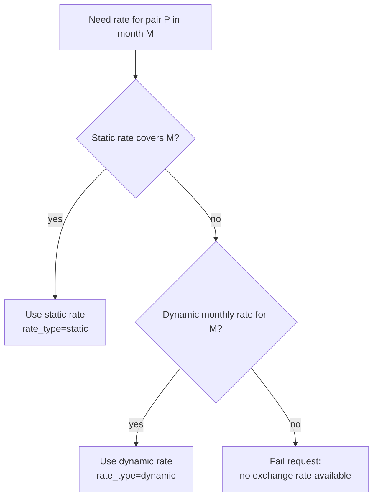

# Constant Currency Design

Product and data design for constant currency: what is stored, how rates are
chosen, and how time and retention behave. See [api.md](./api.md) for endpoints
and [README.md](./README.md) for user flows.

---

## Entities

All tenant-facing configuration is **per customer schema**.

### Enabled currency

A currency is available in UI pickers and for dynamic monthly-rate population
when it is enabled for the tenant.

- Enablement is explicit (administrator action).
- Presence of the currency in the tenant’s enabled set means “enabled”.
- At least one currency must remain enabled.
- Market discovery alone does **not** auto-enable currencies for the dropdown.

### Static exchange rate

Customer-defined directional rate:

| Attribute                           | Rule                                                 |
| ----------------------------------- | ---------------------------------------------------- |
| `base_currency` → `target_currency` | Directional; reverse is a separate definition        |
| `exchange_rate`                     | Strictly positive                                    |
| `start_date` / `end_date`           | Month-aligned (1st → last day of a month)            |
| Validity                            | No overlapping windows for the same directional pair |

Static rates are configuration. They override dynamic rates for months they
cover. They do **not** implicitly create a reverse static rate.

### Monthly exchange rate

Effective conversion rate used by reports/forecasts for one month and one pair.

| Attribute                           | Meaning                                    |
| ----------------------------------- | ------------------------------------------ |
| `effective_date`                    | First day of the month the rate applies to |
| `base_currency` / `target_currency` | Directional pair                           |
| `exchange_rate`                     | Multiplier applied for that month          |
| `rate_type`                         | `static` or `dynamic`                      |

**One rate per** `(effective_date, base_currency, target_currency)`.

This is the single source of truth at query time when the constant-currency
feature flag is on.

### Market snapshot (shared)

A platform-wide latest cross-rate matrix still exists for:

- Legacy conversion when the feature flag is off
- Feeding dynamic monthly rates for the current month

It is not historical; historical stability comes from monthly exchange rates.

---

## Rate types

| Type        | Source                                                                                 | Mutability                                                                                      |
| ----------- | -------------------------------------------------------------------------------------- | ----------------------------------------------------------------------------------------------- |
| **Static**  | Admin CRUD                                                                             | Current month follows the static definition; past months stay as written when they were current |
| **Dynamic** | Market feed (when `CURRENCY_URL` is set) + inverse synthesis for missing reverse pairs | Current month refreshed while the month is open; past months finalized                          |

### Inverse / reverse pairs

- Defining `USD → EUR` static does **not** create `EUR → USD` static.
- For dynamic rates, if the market matrix has a forward rate, the reverse
`1/rate` may be synthesized when missing.
- Reports never chain multi-hop conversions (e.g. USD→EUR→CNY).

---

## Month lifecycle

| Period                      | Behavior                                                                                                                         |
| --------------------------- | -------------------------------------------------------------------------------------------------------------------------------- |
| **Current month**           | Dynamic rates can be refreshed daily. Static CRUD updates the current month’s monthly row when the static window includes today. |
| **Past months (finalized)** | Monthly rows are not rewritten by the daily refresh or by routine static edits.                                                  |
| **Future months**           | Not pre-written. When a future month becomes current, writers populate it then.                                                  |

### Static rate lifecycle

| Action                        | Allowed when                                                                            | Effect on monthly rates                                                                             |
| ----------------------------- | --------------------------------------------------------------------------------------- | --------------------------------------------------------------------------------------------------- |
| Create                        | Window starts in current or future month                                                | Writes current-month static row if the window includes the current month                            |
| Update (any)                  | `base_currency` is immutable                                                            | Delete and recreate to change base                                                                  |
| Update (no finalized months)  | May change target/window/rate                                                           | Current-month monthly row updated; scope changes may restore dynamic for the old current-month pair |
| Update (has finalized months) | Can shrink `end_date` (not before previous month); cannot change target or `start_date` | Past months untouched; current month follows new definition                                         |
| Delete                        | Window not entirely in the past                                                         | Removes current-month static override and restores dynamic for that pair when possible              |
| Delete fully finalized        | Rejected                                                                                | Create a new rate from the current month instead                                                    |

---

## Currency enablement design

| Rule                 | Detail                                                                                       |
| -------------------- | -------------------------------------------------------------------------------------------- |
| Dropdown contents    | Enabled currencies only (`GET /currency/`)                                                   |
| Settings catalog     | Full ISO list with `enabled` + `has_dynamic_rate` + nested static rates                      |
| Disable blocked when | System default, account default, used by cloud provider billing, cost models, or price lists |
| Last currency        | Cannot disable the final enabled currency                                                    |
| Dynamic population   | Only **enabled** currency pairs receive dynamic monthly rates                                |

Unlike earlier design drafts, static-rate currencies are **not** automatically
shown in the end-user dropdown unless those currencies are also enabled.

---

## Report conversion design

When `cost-management.backend.constant-currency` is enabled for the tenant:

1. Determine the target currency from the request / user settings (must be
  enabled).
2. For each cost row’s usage month, look up
  `monthly rate(base → target)` for that month.
3. OCP continues to convert:
  - cost-model denominated amounts using the cost model’s currency
  - infrastructure / raw bill amounts using the bill’s currency
4. Validate coverage for the full query range up front: every distinct base
  currency that needs conversion must have a monthly rate for every month in
   range.
5. Gaps → `400` with an actionable message (no partial unconverted payload).

When the flag is off, behavior stays on the legacy single latest matrix for all
months.

---

## Daily rate maintenance

Conceptual daily job (product behavior, not task wiring):

1. If `CURRENCY_URL` is set, fetch the latest market rates and refresh the
  shared market snapshot.
2. If `CURRENCY_URL` is empty, skip the fetch; existing snapshot / static rates
  remain usable.
3. For each tenant:
  - Upsert **current-month** dynamic monthly rates for enabled pairs,
   skipping pairs that already have a static override for the month.
  - **Backfill** missing past months inside the retention window
  (see below).
  - Invalidate cached report views when monthly rates changed.

### Backward-looking backfill

Purpose: after enablement, deploy, or gaps in daily runs, ensure every month in
the retention window that has a later known rate for a pair also has earlier
months filled so multi-month reports do not fail coverage checks.

Rules:

- Only **creates** missing rows; never overwrites existing monthly rates.
- Walks **backward** from the newest existing rate for each pair.
- Each missing month inherits the **next later** existing rate for that pair.
- Example (retention Jan–Jun, rows at Apr and Jun):
`May ← Jun`, `Mar ← Apr`, `Feb ← Apr`, `Jan ← Apr`.
- Backfilled rows are stored as `rate_type=dynamic`.
- Window start is the same retention boundary used for cost data retention.

---

## Retention

Monthly exchange rates follow the tenant’s cost-data retention window:

- Default platform retention is `RETAIN_NUM_MONTHS` (default **4** months,
including the current month), overridable per tenant via data-retention
settings when configured.
- Rates with `effective_date` before that window start are purged during
expired-data cleanup (supports simulate mode like other cleaners).
- Backfill never creates rows outside that window.

This keeps monthly rates aligned with months that can still appear in retained
reports.

---

## Deployment modes

| Mode                                    | Behavior                                                                                                                |
| --------------------------------------- | ----------------------------------------------------------------------------------------------------------------------- |
| Market feed configured (`CURRENCY_URL`) | Daily dynamic refresh + backfill; static overrides still win                                                            |
| No market feed                          | Dynamic fetch skipped; static rates and any previously stored monthly rates remain; missing pairs error at query time   |
| Feature flag off                        | Legacy single-matrix conversion; Settings APIs may still manage enablement/static config for when the flag is turned on |

---

## Design decisions

| Decision                       | Choice                                                                    |
| ------------------------------ | ------------------------------------------------------------------------- |
| Source of truth for conversion | Monthly exchange rates (per month, per pair)                              |
| Static vs dynamic precedence   | Static wins for covered months                                            |
| Reverse static rates           | Not auto-generated; define both directions if both are required as static |
| Currency visibility            | Explicit enablement; dropdown = enabled set only                          |
| Month writing                  | Populate when month is current; finalize when month ends                  |
| Historical gaps                | Backward-looking fill from next later rate within retention               |
| Query-time missing rate        | Hard error (`400`), not silent omit or cross-month substitution           |
| Multi-hop conversion           | Not supported                                                             |
| Retention                      | Same window as retained cost months                                       |
| Feature rollout                | Unleash `cost-management.backend.constant-currency`                       |
