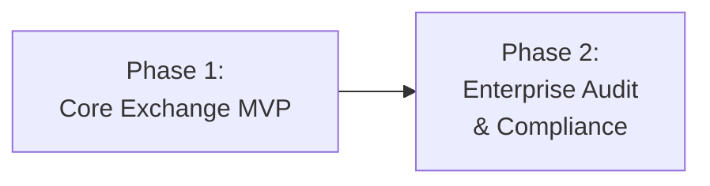

# Phased Delivery Plan

Phased delivery plan for the Constant Currency feature
([COST-7252](https://redhat.atlassian.net/browse/COST-7252)).

> **See also**: [README.md § Decisions Needed](./README.md#decisions-needed) for
> resolved design decisions that gate each phase.

---

## Phase Overview

| Phase | Goal | User-Facing? | Migrations | Rollback |
|-------|------|-------------|------------|----------|
| **1** | Static rate CRUD, dynamic locking, report metadata | Yes | M1, M2, M3 | Drop tables, revert code |
| **2** | Audit history, clone/copy, adjustment workflows | Yes | TBD | TBD |

---

## Phase 1: Core Exchange MVP

**Goal**: Enable customers to define static exchange rate pairs with monthly
validity periods, with automatic fallback to locked dynamic rates for undefined
pairs. Show rate provenance in report responses.

### Artifacts

| Artifact | File | Description |
|----------|------|-------------|
| `StaticExchangeRate` model | `koku/cost_models/models.py` | User-defined rate pairs with validity periods |
| `MonthlyExchangeRateSnapshot` model | `koku/cost_models/models.py` | Unified per-month, per-pair rate storage |
| `StaticExchangeRateDictionary` model | `koku/cost_models/models.py` | Pre-computed static cross-rate matrix |
| `EnabledCurrency` model | `koku/cost_models/models.py` | Tracks enabled/disabled currencies per tenant |
| Migration M1 | `koku/cost_models/migrations/XXXX_*.py` | Create `static_exchange_rate` table |
| Migration M2 | `koku/cost_models/migrations/XXXX_*.py` | Create `monthly_exchange_rate_snapshot` table |
| Migration M3 | `koku/cost_models/migrations/XXXX_*.py` | Create `static_exchange_rate_dictionary` table |
| Migration M4 | `koku/cost_models/migrations/XXXX_*.py` | Create `enabled_currency` table |
| Serializer | `koku/cost_models/static_exchange_rate_serializer.py` | Validation + snapshot side-effects |
| ViewSet | `koku/cost_models/static_exchange_rate_view.py` | CRUD API for static rates |
| Currency enablement view | `koku/api/settings/` or new file | Settings API for enable/disable currencies |
| Available currencies view | `koku/api/settings/` or new file | Returns available target currencies for dropdown |
| URL registration | `koku/cost_models/urls.py` | Router entry for `exchange-rate-pairs` |
| Settings URL registration | `koku/api/urls.py` or `koku/api/settings/urls.py` | Routes for currency enablement and available currencies endpoints |
| Celery task update | `koku/masu/celery/tasks.py` | Airgapped guard, currency discovery, enabled-currency filtered snapshot upsert per tenant |
| Query handler update | `koku/api/query_handler.py` | Date-aware `Case`/`When` annotations, available currency resolution |
| OCP handler update | `koku/api/report/ocp/query_handler.py` | OCP-specific snapshot-based rates |
| Forecast handler update | `koku/forecast/forecast.py` | Snapshot-based rate resolution |
| Report meta update | `koku/api/report/queries.py` | `exchange_rates_applied` metadata, no-rate error handling |
| OpenAPI update | `koku/docs/specs/openapi.json` | New endpoint definitions (exchange-rate-pairs, enabled-currencies, available-currencies) |
| Serializer tests | `koku/cost_models/test/test_static_exchange_rate_serializer.py` | Validation tests |
| View tests | `koku/cost_models/test/test_static_exchange_rate_view.py` | CRUD tests |
| Snapshot tests | `koku/cost_models/test/test_monthly_snapshot.py` | Snapshot creation, query, locking tests |
| Currency enablement tests | `koku/cost_models/test/test_enabled_currency.py` or `koku/api/settings/test/` | Enable/disable, discovery, available-currencies tests |
| No-rate error tests | `koku/api/report/test/` | Corner case: error when no conversion path exists |

### Validation

- [ ] Static rate CRUD: create, read, update, delete via API
- [ ] Overlapping validity period rejection returns 400
- [ ] Natural month boundary enforcement (mid-month dates rejected)
- [ ] Auto-increment version on update
- [ ] Bidirectional inverse rate resolution (1/rate when reverse undefined)
- [ ] Dynamic rate daily snapshot creation per tenant
- [ ] Static rate precedence: task skips pairs with existing static rates
- [ ] Finalized month immutability: past month rows never overwritten
- [ ] Date-aware `Case`/`When` annotations produce correct per-month rates
- [ ] Fallback to `ExchangeRateDictionary` for pre-deployment months
- [ ] `exchange_rates_applied` metadata appears in report responses
- [ ] Consecutive months with same rate/type collapsed into one period string
- [ ] `StaticExchangeRateDictionary` rebuilt on create, update, and delete of static rates
- [ ] `StaticExchangeRateDictionary` contains correct cross-rate matrix including implicit inverses
- [ ] Unit tests pass for serializer, view, snapshot logic, dictionary rebuild, query handler
- [ ] On-prem mode: full functionality without Trino
- [ ] **Currency enablement**: Dynamic currencies arrive as disabled in `EnabledCurrency`
- [ ] **Currency enablement**: Administrator can enable/disable currencies via Settings API
- [ ] **Currency enablement**: Only enabled currencies are snapshotted by the daily task
- [ ] **Airgapped mode**: Celery task skips API fetch when `CURRENCY_URL` is empty
- [ ] **Airgapped mode**: Only static rates are available when no URL is configured
- [ ] **Available currencies**: Dropdown shows union of enabled dynamic currencies and static rate currencies
- [ ] **Available currencies**: Static rate currencies appear regardless of `EnabledCurrency` status
- [ ] **No-rate corner case**: Selecting a target currency with no conversion path returns HTTP 400 with actionable error
- [ ] **No currencies available**: Dropdown hidden or shows "No exchange rates available" when no currencies are available
- [ ] **Currency discovery**: New currencies from API are created as disabled `EnabledCurrency` rows

### Rollback

1. Revert query handler changes in `koku/api/query_handler.py` (restore
   single-rate annotation from `ExchangeRateDictionary`)
2. Revert OCP query handler and forecast handler changes
3. Revert Celery task changes in `koku/masu/celery/tasks.py` (remove per-tenant
   snapshot logic, currency discovery, airgapped guard)
4. Revert report meta changes in `koku/api/report/queries.py` (remove
   `exchange_rates_applied` metadata and no-rate error handling)
5. Revert URL registration in `koku/cost_models/urls.py`
6. Revert Settings URL registration (remove currency enablement and
   available-currencies endpoints)
7. Drop tables via reverse migration (`migrate_schemas` runs `DeleteModel` for
   all four new tables: `static_exchange_rate`, `monthly_exchange_rate_snapshot`,
   `static_exchange_rate_dictionary`, `enabled_currency`)
8. Remove new files: serializer, view, currency enablement views, test files
9. Revert OpenAPI changes

---

## Phase 2: Enterprise Grade Compliance & Audit (Future)

**Goal**: Full audit trail, clone/copy functionality, and adjustment workflows
for retroactive rate changes.

### Deferred Artifacts

| Artifact | Description |
|----------|-------------|
| Version history | Verbose history of all currency changes; auditors can see who changed what and when |
| Clone/Copy | UI button to copy rate definitions (e.g., Q1 → Q2), including from previous versions |
| Adjustment workflow | Changes within billing period apply immediately; changes affecting past periods generate adjustments requiring admin approval |

### Preconditions

- Phase 1 fully deployed and stable
- Price list lifecycle adjustments system implemented (dependency)

---

## Risk Register (Compact)

See [risk-register.md](./risk-register.md) for full details.

| ID | Risk | Status | Phase |
|----|------|--------|-------|
| **R1** | Celery task month-end failure | Mitigated | 1 |
| **R2** | Task runtime with many tenants/pairs | Open | 1 |
| **R3** | Overlapping static rates | Mitigated | 1 |
| **R4** | Pre-deployment month gap | Accepted | 1 |
| **R5** | Query handler performance | Open | 1 |
| **R6** | Static rate deletion gap | Low | 1 |
| **R7** | No exchange rate for selected currency | Mitigated | 1 |
| **R8** | Airgapped mode with no rates configured | Accepted | 1 |

---

## Future Scalability Considerations

### Shorter Validity Periods

Future requirements may allow validity periods shorter than
one month (e.g., weekly). The current design stores `year_month` as a
`CharField(max_length=7)` in `MonthlyExchangeRateSnapshot`. Migrating to
shorter periods would require:

- A new snapshot table or column scheme (e.g., `period_start` / `period_end` dates)
- Updated query handler to build `Case`/`When` at finer granularity
- Updated Celery task to snapshot at the appropriate frequency

This is explicitly out of scope for Phase 1.

### Multi-Hop Conversion

Multi-hop conversion (e.g., EUR→USD→CNY when only EUR→USD and
USD→CNY are defined) is not supported. If customer demand emerges, a separate
design would be needed to handle path prioritization.

---

## Changelog

| Version | Date | Summary |
|---------|------|---------|
| v1.0 | 2026-03-19 | Initial phased delivery plan |
| v1.1 | 2026-03-24 | Added EnabledCurrency artifacts (M4, views, tests), currency enablement and airgapped validation items, R7/R8 risks, updated rollback steps |
