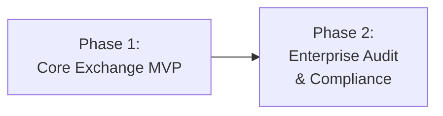

# Phased Delivery Plan

Phased delivery plan for the Constant Currency feature
([COST-7252](https://redhat.atlassian.net/browse/COST-7252)).

> **See also**: [README.md § Decisions Needed](./README.md#decisions-needed) for
> resolved design decisions that gate each phase.

---

## Phase Overview

| Phase | Goal | User-Facing? | Migrations | Rollback |
|-------|------|-------------|------------|----------|
| **1** | Static rate CRUD, dynamic locking, report metadata | Yes | M1, M2, M3 | Drop tables, revert code |

| **2** | Audit history, clone/copy, adjustment workflows | Yes | TBD | TBD |

---

## Phase 1: Core Exchange MVP

**Goal**: Enable customers to define static exchange rate pairs with monthly
validity periods, with automatic fallback to locked dynamic rates for undefined
pairs. Show rate provenance in report responses.

### Artifacts

| Artifact | File | Description |
|----------|------|-------------|
| `StaticExchangeRate` model | `koku/cost_models/models.py` | User-defined rate pairs with validity periods |
| `MonthlyExchangeRate` model | `koku/cost_models/models.py` | Single source of truth: per-month, per-pair rate storage for all months |
| `EnabledCurrency` model | `koku/cost_models/models.py` | Tracks enabled currencies per tenant (presence = enabled) |
| Migration M1 | `koku/cost_models/migrations/XXXX_*.py` | Create `static_exchange_rate` table |
| Migration M2 | `koku/cost_models/migrations/XXXX_*.py` | Create `monthly_exchange_rate` table + seed current-month data from `ExchangeRateDictionary` |
| Migration M3 | `koku/cost_models/migrations/XXXX_*.py` | Create `enabled_currency` table |
| Serializer | `koku/cost_models/static_exchange_rate_serializer.py` | Validation + `MonthlyExchangeRate` upsert side-effects |
| ViewSet | `koku/cost_models/static_exchange_rate_view.py` | CRUD API for static rates |
| Currency enablement view | `koku/api/settings/currency_views.py` | POST/DELETE enablement for individual currencies |
| URL registration | `koku/api/urls.py` | Routes for `settings/currency/exchange_rate/` (list/create, detail) and `settings/currency/enabled-currencies/` (enable/disable) |
| Celery task update | `koku/masu/celery/tasks.py` | Currency discovery, `MonthlyExchangeRate` upsert for all currencies per tenant (skips fetch if no `CURRENCY_URL`) |
| Query handler update | `koku/api/query_handler.py` | Read from `MonthlyExchangeRate` for all months (no fallback; M2 seeds current month) |
| OCP handler update | `koku/api/report/ocp/query_handler.py` | OCP-specific rate resolution from `MonthlyExchangeRate` |
| Forecast handler update | `koku/forecast/forecast.py` | Rate resolution from `MonthlyExchangeRate` |
| Report meta update | `koku/api/report/queries.py` | `exchange_rates_applied` metadata, no-rate error handling |
| OpenAPI update | `koku/docs/specs/openapi.json` | New endpoint definitions (exchange_rate list/create/update/delete, enable/disable) |
| Serializer tests | `koku/cost_models/test/test_static_exchange_rate_serializer.py` | Validation tests |
| View tests | `koku/cost_models/test/test_static_exchange_rate_view.py` | CRUD tests |
| MonthlyExchangeRate tests | `koku/cost_models/test/test_monthly_exchange_rate.py` | Rate creation, query, locking tests |
| Currency enablement tests | `koku/cost_models/test/test_enabled_currency.py` or `koku/api/settings/test/` | Enable/disable, discovery, currency-config tests |
| No-rate error tests | `koku/api/report/test/` | Corner case: error when no conversion path exists |

### Validation

- [ ] Static rate CRUD: create, read, update, delete via API
- [ ] Overlapping validity period rejection returns 400
- [ ] Natural month boundary enforcement (mid-month dates rejected)
- [ ] Bidirectional inverse rate resolution (1/rate when reverse undefined)
- [ ] Dynamic rate daily `MonthlyExchangeRate` upsert per tenant
- [ ] Static rate precedence: task skips pairs with existing static rates
- [ ] Finalized month immutability: past month rows never overwritten
- [ ] `MonthlyExchangeRate` is the single source of truth: query handler reads from it for all months (no fallback)
- [ ] M2 migration seeds current-month data from `ExchangeRateDictionary` into `MonthlyExchangeRate`
- [ ] `Subquery` annotations produce correct per-month rates from `MonthlyExchangeRate`
- [ ] Pre-deployment months (no exact-month rows) correctly fall back to earliest available rate
- [ ] `exchange_rates_applied` metadata appears in report responses
- [ ] Consecutive months with same rate/type collapsed into one period string
- [ ] Unit tests pass for serializer, view, MonthlyExchangeRate logic, query handler
- [ ] On-prem mode: full functionality without Trino
- [ ] **Currency enablement**: Administrator can enable currencies via `POST settings/currency/enabled-currencies/{code}/`
- [ ] **Currency enablement**: All currencies are stored in `MonthlyExchangeRate` regardless of enabled status; `enabled` flag only controls dropdown visibility
- [ ] **Rate resolution**: Static rates take precedence over dynamic rates; when `MonthlyExchangeRate` is empty (feature not configured), no currencies are enabled and costs returned as-is; when rows exist but not for target, error returned
- [ ] **No `CURRENCY_URL`**: Celery task skips API fetch; system works with whatever rates are available
- [ ] **Available currencies**: Report dropdown shows only enabled currencies (static rates do not bypass enablement)
- [ ] **Costs as-is**: When no exchange rates are configured at all (`MonthlyExchangeRate` empty), no currencies are enabled — serializer rejects any `currency` parameter and costs returned in original bill currency
- [ ] **No-rate corner case**: Selecting a target currency with no conversion path (when rates exist for other currencies) returns HTTP 400 with actionable error
- [ ] **No currencies available**: Dropdown hidden or shows "No exchange rates available" when no currencies are available
- [ ] **Currency list**: `GET settings/currency/exchange_rate/` returns currencies grouped by base currency with enabled flag and nested exchange rates

### Rollback

1. Revert query handler changes in `koku/api/query_handler.py` (restore
   single-rate annotation from `ExchangeRateDictionary`)
2. Revert OCP query handler and forecast handler changes
3. Revert Celery task changes in `koku/masu/celery/tasks.py` (remove per-tenant
   `MonthlyExchangeRate` upsert, currency discovery)
4. Revert report meta changes in `koku/api/report/queries.py` (remove
   `exchange_rates_applied` metadata and no-rate error handling)
5. Revert URL registration in `koku/api/urls.py` (remove `settings/currency/exchange_rate/` and `settings/currency/enabled-currencies/` routes)
7. Drop tables via reverse migration (`migrate_schemas` runs `DeleteModel` for
   all three new tables: `static_exchange_rate`, `monthly_exchange_rate`,
   `enabled_currency`)
8. Remove new files: serializer, view, currency enablement views, test files
9. Revert OpenAPI changes

---

## Phase 2: Enterprise Grade Compliance & Audit (Future)

**Goal**: Full audit trail, clone/copy functionality, and adjustment workflows
for retroactive rate changes.

### Deferred Artifacts

| Artifact | Description |
|----------|-------------|
| Version history | Verbose history of all currency changes; auditors can see who changed what and when |
| Clone/Copy | UI button to copy rate definitions (e.g., Q1 → Q2), including from previous versions |
| Adjustment workflow | Changes within billing period apply immediately; changes affecting past periods generate adjustments requiring admin approval |

### Preconditions

- Phase 1 fully deployed and stable
- Price list lifecycle adjustments system implemented (dependency)

---

## Risk Register (Compact)

See [risk-register.md](./risk-register.md) for full details.

| ID | Risk | Status | Phase |
|----|------|--------|-------|
| **R1** | Celery task month-end failure | Mitigated | 1 |
| **R2** | Task runtime with many tenants/pairs | Open | 1 |
| **R3** | Overlapping static rates | Mitigated | 1 |
| **R4** | Pre-deployment month gap | Resolved | 1 |
| **R5** | Query handler performance | Mitigated | 1 |
| **R6** | Static rate deletion gap | Mitigated | 1 |
| **R7** | No exchange rate for selected currency | Mitigated | 1 |
| **R8** | No rates configured (static or dynamic) | Accepted | 1 |

---

## Future Scalability Considerations

### Shorter Validity Periods

Future requirements may allow validity periods shorter than
one month (e.g., weekly). The current design stores `effective_date` as a
`DateField` in `MonthlyExchangeRate` (first day of month). Migrating to shorter
periods would require:

- Writing `MonthlyExchangeRate` rows at a finer granularity (e.g., weekly start dates)
- Updating the `unique_together` constraint if multiple rows per month are needed
- Updated query handler `Subquery` filter to match finer granularity
- Updated Celery task to write rates at the appropriate frequency

This is explicitly out of scope for Phase 1.

### Multi-Hop Conversion

Multi-hop conversion (e.g., EUR→USD→CNY when only EUR→USD and
USD→CNY are defined) is not supported. If customer demand emerges, a separate
design would be needed to handle path prioritization.

---

## Changelog

| Version | Date | Summary |
|---------|------|---------|
| v1.0 | 2026-03-19 | Initial phased delivery plan |
| v1.1 | 2026-03-24 | Added EnabledCurrency artifacts (M4, views, tests), currency enablement and airgapped validation items, R7/R8 risks, updated rollback steps |
| v1.2 | 2026-03-24 | Simplified enablement: `EnabledCurrency` table controls dropdown visibility. All currencies always stored and snapshotted. |
| v1.3 | 2026-03-24 | Removed airgapped mode concept. Rate resolution: static first, dynamic fallback, error if neither. |
| v1.4 | 2026-03-26 | Updated artifacts and validation to reflect two-tier rate resolution (dictionaries + snapshots). |
| v1.5 | 2026-03-29 | Updated future scalability section: `year_month` CharField replaced by `effective_date` DateField. |
| v1.6 | 2026-03-30 | `MonthlyExchangeRate` replaces `MonthlyExchangeRateSnapshot` as single source of truth. Removed `StaticExchangeRateDictionary` artifacts (model, M3 migration). Renumbered M4 → M3. Simplified validation items and rollback steps. |
| v1.7 | 2026-03-30 | M2 now seeds current-month data. Removed fallback validation item. Added M2 seed and pre-deployment default validation items. R4 resolved. |
| v1.8 | 2026-04-12 | Fixed R6 status from "Low" to "Mitigated" to match risk-register.md. |
| v1.9 | 2026-04-12 | R5 mitigated (Subquery replaces Case/When). Updated validation to reflect Subquery approach. |
| v2.0 | 2026-04-13 | Updated pre-deployment month validation item: fall back to earliest available rate (aligns with pipeline-changes.md v2.1). |
| v2.1 | 2026-04-28 | Updated URL references to `settings/currency/exchange_rate/`. Consolidated URL registration to `koku/api/urls.py`. Removed separate available-currencies endpoint. |
| v2.2 | 2026-04-28 | Removed static-rate enablement bypass from validation checklist. Report dropdown governed solely by `EnabledCurrency`. |
| v2.3 | 2026-04-28 | Added "costs as-is" validation item: when `MonthlyExchangeRate` is empty, feature inactive, costs returned as-is. Updated rate resolution and no-rate validation items. |
| v2.4 | 2026-04-30 | Fixed currency enablement URL to `settings/currency/enabled-currencies/{code}/`. Clarified "costs as-is": serializer blocks non-enabled currencies before query handler. |
