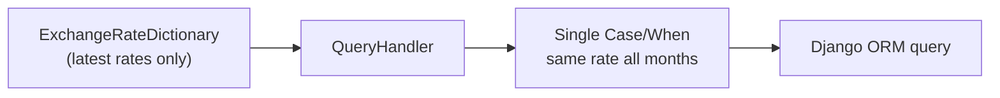
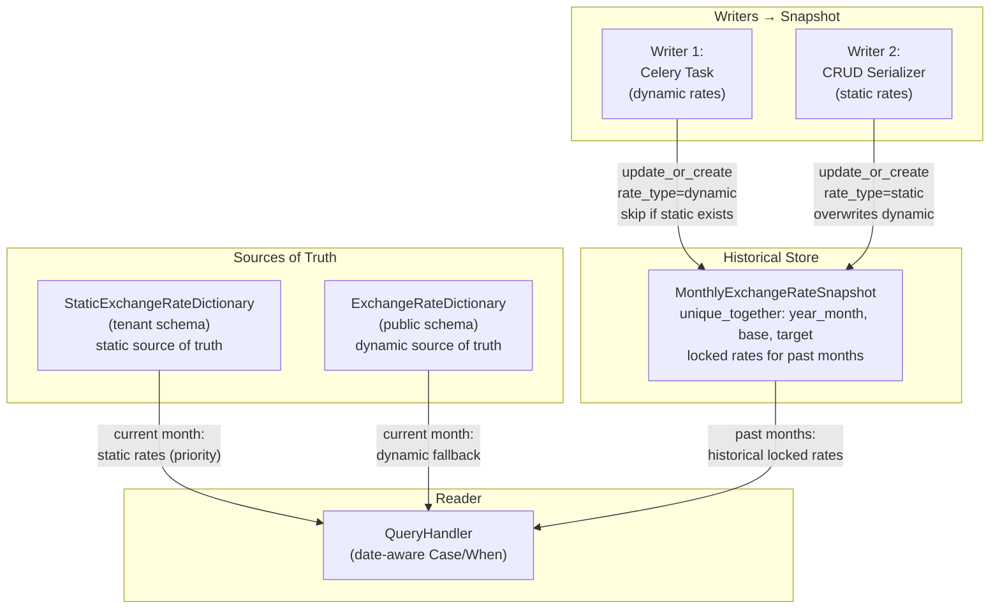

# Pipeline Changes

Pipeline modifications for the Constant Currency feature
([COST-7252](https://redhat.atlassian.net/browse/COST-7252)). Covers the Celery
task changes, query handler changes, and the two-writer/one-reader pattern.

> **See also**: [README.md § IQ-2](./README.md#iq-2-unified-snapshot-table--resolved)
> and [README.md § IQ-3](./README.md#iq-3-dynamic-rate-snapshotting-strategy--resolved)
> for the design decisions behind these changes.

---

## Current Pipeline

### Orchestration Order

1. `get_daily_currency_rates` Celery beat task fires daily
2. Fetches rates from `CURRENCY_URL` (configured in `koku/koku/settings.py`,
   defaults to `open.er-api.com`)
3. Upserts `ExchangeRates` rows for each base currency
4. Rebuilds `ExchangeRateDictionary` via `build_exchange_dictionary()`
   (cross-rate matrix in `api/currency/utils.py`)

### How Exchange Rates Work Today

At query time, `QueryHandler.exchange_rate_annotation_dict` (in
`koku/api/query_handler.py`) reads from `ExchangeRateDictionary` and builds a
single `Case`/`When` annotation. This annotation applies the **same rate** to
all months in the query range.



**Problem**: When a user queries a 6-month report, every month uses today's
exchange rate. If the rate changed significantly over those 6 months, the
historical data is misleading.

---

## Proposed Pipeline Changes

### Configurable Exchange Rate API URL

The exchange rate API URL is already configurable via `CURRENCY_URL` in
`koku/koku/settings.py`. This design makes the URL meaningful for on-premise
deployments:

- **Default**: `open.er-api.com` (Open Exchange Rates API, free tier)
- **Custom**: Customers can point to any compatible exchange rate API
- **Empty/unset**: Celery task skips the API fetch step (no dynamic rates fetched)

Documentation should include the production API URL as an example for customers
configuring their own on-premise deployment.

> **Scope**: Only the free tier of Open Exchange Rates API is supported.
> Paid-tier features (e.g., historical rates, time-series) are out of scope
> for this design and would be covered by a future PRD if needed.

### New Orchestration Order

1. `get_daily_currency_rates` Celery beat task fires daily
2. **CHANGED**: Checks if `CURRENCY_URL` is configured; **skips API fetch if
   empty** (dynamic rates are simply not fetched; static rates still work)
3. Fetches rates from `CURRENCY_URL` *(unchanged when URL is set)*
4. Upserts `ExchangeRates` rows *(unchanged)*
5. Rebuilds `ExchangeRateDictionary` *(unchanged)*
6. **NEW**: Per-tenant currency discovery — creates `EnabledCurrency` rows
   with `enabled=False` for newly discovered currencies
7. **NEW**: Per-tenant snapshot upsert into `MonthlyExchangeRateSnapshot`
   for all currencies returned by the API

At query time:

8. **CHANGED**: `QueryHandler.exchange_rate_annotation_dict` uses two-tier
   resolution — `StaticExchangeRateDictionary` / `ExchangeRateDictionary` for
   current month, `MonthlyExchangeRateSnapshot` for past months
9. **CHANGED**: Builds per-month `Case`/`When` annotations (one rate per month)
10. **NEW**: Report response includes `exchange_rates_applied` metadata
11. **NEW**: Available currencies for dropdown computed from enabled dynamic
    currencies + static rate currencies (`enabled` flag controls dropdown
    visibility only, not storage)

### Two Sources of Truth, One Snapshot Store

The architecture has two authoritative rate dictionaries and one historical
snapshot table:



The dictionaries serve the same role they always have: `ExchangeRateDictionary`
is the authoritative source for dynamic rates (rebuilt daily),
`StaticExchangeRateDictionary` is the authoritative source for static rates
(rebuilt on every CRUD operation). The snapshot table is a derived store that
locks rates at month boundaries for historical report accuracy.

---

## Modified: `get_daily_currency_rates` — Writer 1

**File**: `koku/masu/celery/tasks.py`

### Step 1: Check for `CURRENCY_URL`

If `CURRENCY_URL` is empty or unset, skip the API fetch and dynamic snapshot
steps. The system does not require `CURRENCY_URL` to function — it uses
whatever rates are available (static first, then dynamic, then error if
neither exists for a given pair).

```python
if not settings.CURRENCY_URL:
    LOG.info(log_json(msg="CURRENCY_URL not configured; skipping dynamic exchange rate fetch"))
    return
```

### Step 2: Fetch and store (unchanged)

Fetch rates from `CURRENCY_URL`, upsert `ExchangeRates`, rebuild
`ExchangeRateDictionary`. This logic is unchanged from today.

### Step 3: Currency discovery + snapshot upsert (new)

After rebuilding `ExchangeRateDictionary`, add per-tenant currency discovery
and snapshot upsert:

```python
current_month = dh.today.strftime("%Y-%m")
exchange_dict = ExchangeRateDictionary.objects.first().currency_exchange_dictionary
all_api_currencies = set(exchange_dict.keys())

for tenant in Tenant.objects.exclude(schema_name="public"):
    with schema_context(tenant.schema_name):
        # Currency discovery: create EnabledCurrency rows for newly seen currencies
        existing_codes = set(EnabledCurrency.objects.values_list("currency_code", flat=True))
        new_currencies = all_api_currencies - existing_codes
        EnabledCurrency.objects.bulk_create(
            [EnabledCurrency(currency_code=code, enabled=False) for code in new_currencies],
            ignore_conflicts=True,
        )

        # Pre-fetch all static pairs for this month in a single query
        static_pairs = set(
            MonthlyExchangeRateSnapshot.objects.filter(
                year_month=current_month,
                rate_type=RateType.STATIC,
            ).values_list("base_currency", "target_currency")
        )

        # Snapshot ALL currencies — enabled flag only controls dropdown visibility
        for base_cur, targets in exchange_dict.items():
            for target_cur, rate in targets.items():
                if base_cur == target_cur:
                    continue
                if (base_cur, target_cur) not in static_pairs:
                    MonthlyExchangeRateSnapshot.objects.update_or_create(
                        year_month=current_month,
                        base_currency=base_cur,
                        target_currency=target_cur,
                        defaults={"exchange_rate": rate, "rate_type": RateType.DYNAMIC},
                    )
```

**Key behaviors**:

- **URL check**: If `CURRENCY_URL` is not configured, the task skips the API
  fetch. Dynamic rates are simply not fetched; the system uses whatever rates
  are available (static first, dynamic fallback, error if neither exists).
- **Currency discovery**: Creates `EnabledCurrency` rows with `enabled=False`
  for any new currencies returned by the API. These appear in Settings as
  disabled currencies that the administrator can enable.
- **All currencies snapshotted**: Snapshots dynamic rates for all currency
  pairs returned by the API. The `enabled` flag on `EnabledCurrency` only
  controls dropdown visibility, not snapshotting.
- Runs daily; overwrites current month's dynamic rows with latest rate
- Skips pairs with `rate_type=RateType.STATIC` (static takes precedence)
- Past months' rows are never updated (automatic finalization)
- Forward-only: no backfill of months before deployment

**Risk linkage**: See [risk-register.md § R1](./risk-register.md#r1--celery-task-month-end-failure),
[risk-register.md § R2](./risk-register.md#r2--task-runtime-with-many-tenantspairs),
[risk-register.md § R7](./risk-register.md#r7--no-exchange-rate-for-selected-currency),
[risk-register.md § R8](./risk-register.md#r8--no-rates-configured)

---

## Modified: Query Handler — Reader

**Files to modify**:

| File | Change |
|------|--------|
| `koku/api/query_handler.py` | Base `QueryHandler`: new rate resolution logic, date-aware `Case`/`When` |
| `koku/api/report/ocp/query_handler.py` | OCP override: use two-tier rate resolution |
| `koku/forecast/forecast.py` | Forecast handler: use two-tier rate resolution |

### Rate Resolution Strategy

The query handler resolves exchange rates using a two-tier approach:

| Month | Source | Rationale |
|-------|--------|-----------|
| **Past (finalized) months** | `MonthlyExchangeRateSnapshot` | Locked rates that were in effect during that month |
| **Current month** | `StaticExchangeRateDictionary` (priority) → `ExchangeRateDictionary` (fallback) | Live authoritative rates from the sources of truth |
| **Pre-deployment months** | `ExchangeRateDictionary` (legacy fallback) | No snapshot rows exist; preserves current behavior |

This mirrors the existing pattern: today, `ExchangeRateDictionary` is the sole
source of truth for exchange rates. The new design adds
`StaticExchangeRateDictionary` as a higher-priority source for static rates,
and uses the snapshot table to lock historical rates for past months.

### New: `effective_exchange_rates` Property

```python
@cached_property
def effective_exchange_rates(self):
    """Load exchange rates for the query date range.

    Past months: from MonthlyExchangeRateSnapshot (locked historical rates).
    Current month: from StaticExchangeRateDictionary (static priority),
    then ExchangeRateDictionary (dynamic fallback).
    """
    current_month = self.dh.today.strftime("%Y-%m")
    past_months = [m.strftime("%Y-%m") for m in self._iter_months() if m.strftime("%Y-%m") != current_month]

    rates = {}

    # Past months: read from snapshot (locked historical rates)
    if past_months:
        for snap in MonthlyExchangeRateSnapshot.objects.filter(
            year_month__in=past_months,
            target_currency=self.currency,
        ):
            rates[snap.year_month] = snap

    # Current month: read from dictionaries (sources of truth)
    if current_month in [m.strftime("%Y-%m") for m in self._iter_months()]:
        rate = self._resolve_current_month_rate()
        if rate:
            rates[current_month] = rate

    return rates
```

### New: `_resolve_current_month_rate`

Resolves the current month's rate from the authoritative dictionaries, with
static rates taking priority over dynamic:

```python
def _resolve_current_month_rate(self):
    """Resolve current month rate from dictionaries (sources of truth).

    Priority: StaticExchangeRateDictionary > ExchangeRateDictionary.
    """
    # Static dictionary (source of truth for static rates)
    static_dict = StaticExchangeRateDictionary.objects.first()
    if static_dict and static_dict.currency_exchange_dictionary:
        for base_cur, targets in static_dict.currency_exchange_dictionary.items():
            if self.currency in targets:
                return SimpleNamespace(
                    base_currency=base_cur,
                    exchange_rate=targets[self.currency],
                    rate_type="static",
                )

    # Dynamic dictionary (source of truth for dynamic rates)
    dynamic_dict = ExchangeRateDictionary.objects.first()
    if dynamic_dict and dynamic_dict.currency_exchange_dictionary:
        for base_cur, targets in dynamic_dict.currency_exchange_dictionary.items():
            if self.currency in targets:
                return SimpleNamespace(
                    base_currency=base_cur,
                    exchange_rate=targets[self.currency],
                    rate_type="dynamic",
                )

    return None
```

### Changed: `exchange_rate_annotation_dict`

Replace single-rate annotation with per-month `Case`/`When`:

```python
whens = []
for year_month, rate_info in self.effective_exchange_rates.items():
    month_start, month_end = month_bounds(year_month)
    whens.append(When(
        usage_start__gte=month_start,
        usage_start__lt=month_end,
        **{self._mapper.cost_units_key: rate_info.base_currency},
        then=Value(rate_info.exchange_rate),
    ))
return {"exchange_rate": Case(*whens, default=1, output_field=DecimalField())}
```

### Fallback for Pre-Deployment Months

For months without snapshot rows (before deployment), fall back to the live
`ExchangeRateDictionary` (current behavior). This ensures backward compatibility:

```python
if not whens:
    # No snapshot data — fall back to ExchangeRateDictionary
    return self._legacy_exchange_rate_annotation_dict()
```

**Risk linkage**: See [risk-register.md § R4](./risk-register.md#r4--pre-deployment-month-gap),
[risk-register.md § R5](./risk-register.md#r5--query-handler-performance)

### New: Available Currency Resolution

The query handler (or a shared utility) computes the list of currencies
visible in the target currency dropdown. All currencies are stored and
snapshotted regardless of their enabled status — the `enabled` flag only
controls dropdown visibility. A currency is **visible in the dropdown** if any
of the following are true:

1. It has `enabled=True` in `EnabledCurrency`
2. It appears as either `base_currency` or `target_currency` in any
   `StaticExchangeRate` row (static rates make their currencies visible
   regardless of `EnabledCurrency` status)

```python
@cached_property
def available_currencies(self):
    """Currencies visible in the target currency dropdown."""
    # Dynamic: enabled currencies (all are snapshotted; enabled controls visibility only)
    enabled_codes = set(
        EnabledCurrency.objects.filter(enabled=True).values_list("currency_code", flat=True)
    )

    # Static: all currencies appearing in any static exchange rate pair
    static_currencies = set(
        StaticExchangeRate.objects.values_list("base_currency", flat=True)
    ) | set(
        StaticExchangeRate.objects.values_list("target_currency", flat=True)
    )

    return enabled_codes | static_currencies
```

When the user selects a target currency that is "available" but has **no
exchange rate path** from the bill's source currency (e.g., bill is in USD, user
selects EUR, but no USD→EUR rate exists — only EUR↔CHF and CNY↔SAR are defined),
the API returns an error rather than silently showing zero or unconverted costs:

> *"No exchange rate available. Ask your administrator to configure static
> exchange rates or enable dynamic exchange rates."*

When **no currencies are visible** (no dynamic currencies enabled and no
static rates defined), the frontend either hides the currency dropdown
entirely or shows *"No exchange rates available."* — whichever is simpler to
implement.

See [api-and-frontend.md § Corner Case: No Exchange Rate](./api-and-frontend.md#corner-case-no-exchange-rate)
for the full UX specification.

---

## Static Rate → Snapshot + Dictionary — Writer 2

**Trigger**: `StaticExchangeRate` CRUD operations (create, update, delete) via
the serializer in `koku/cost_models/static_exchange_rate_serializer.py`.

Each CRUD operation performs **two side effects** inside a single
`transaction.atomic()` block:

1. **Snapshot upsert/delete** — writes to `MonthlyExchangeRateSnapshot`
2. **Dictionary rebuild** — rebuilds `StaticExchangeRateDictionary`

### Side Effect 1: Snapshot Upsert

#### On Create / Update

For each month between `start_date` and `end_date`, upsert a row in
`MonthlyExchangeRateSnapshot` with `rate_type=RateType.STATIC` and the user-defined
rate. This overwrites any existing dynamic row for that pair/month (the
`unique_together` constraint ensures only one row per triple).

#### On Delete

Remove `rate_type=RateType.STATIC` rows for the affected months, then
proactively populate `rate_type=RateType.DYNAMIC` rows from the current
`ExchangeRateDictionary` for those pairs/months. This eliminates the data gap
that would otherwise exist until the next daily Celery task run.

### Side Effect 2: Rebuild `StaticExchangeRateDictionary`

After every create, update, or delete, rebuild the `StaticExchangeRateDictionary`
cross-rate matrix from all remaining `StaticExchangeRate` rows. This mirrors how
the daily Celery task rebuilds `ExchangeRateDictionary` from `ExchangeRates`.

```python
def _rebuild_static_exchange_rate_dictionary():
    """Rebuild the static cross-rate matrix from all StaticExchangeRate rows."""
    static_rates = StaticExchangeRate.objects.all()
    matrix = {}
    for rate in static_rates:
        matrix.setdefault(rate.base_currency, {})[rate.target_currency] = float(rate.exchange_rate)
        # Implicit inverse
        if rate.target_currency not in matrix or rate.base_currency not in matrix.get(rate.target_currency, {}):
            matrix.setdefault(rate.target_currency, {})[rate.base_currency] = 1.0 / float(rate.exchange_rate)

    StaticExchangeRateDictionary.objects.update_or_create(
        defaults={"currency_exchange_dictionary": matrix},
    )
```

| Event | Snapshot Action | Dictionary Action |
|-------|----------------|-------------------|
| **Create** | Upsert `rate_type=static` rows for affected months | Rebuild matrix from all `StaticExchangeRate` rows |
| **Update** | Upsert `rate_type=static` rows for affected months | Rebuild matrix from all `StaticExchangeRate` rows |
| **Delete** | Remove static rows, insert dynamic fallback rows | Rebuild matrix from remaining `StaticExchangeRate` rows |

**Parallel with dynamic rates**: `ExchangeRateDictionary` (public schema) is
rebuilt daily by the Celery task from `ExchangeRates`. `StaticExchangeRateDictionary`
(tenant schema) is rebuilt on every CRUD operation from `StaticExchangeRate`.
Both serve as **sources of truth** for their respective rate types — query
handlers read from both dictionaries for current-month rate resolution (static
priority, dynamic fallback). The snapshot table stores the historical record
for past months.

All operations (StaticExchangeRate write + snapshot upsert + dictionary rebuild)
are wrapped in a single `transaction.atomic()` block, ensuring atomicity.

**Risk linkage**: See [risk-register.md § R6](./risk-register.md#r6--static-rate-deletion-gap)

---

## Finalized Month Locking

When the billing period (natural month) is finalized, the last of the month's
exchange rate is stored for that month, so that the cost report for a finalized
period of time does not change afterwards.

This is handled automatically by the unified `MonthlyExchangeRateSnapshot` table:

- **Dynamic rates**: The daily Celery task overwrites the current month's dynamic
  rows every day. Once the month rolls over, those rows are never updated again —
  they're locked with the last successfully fetched rate.
- **Static rates**: Inherently stable. The user defines them; they don't change
  unless explicitly edited. No locking needed.
- **Resilience**: If the daily task fails on the last day of the month, the
  snapshot still has the rate from the most recent successful day.
- **Forward-only**: Months before deployment have no snapshot rows and fall back
  to the live `ExchangeRateDictionary`.

---

## Unchanged Components

| File | Reason |
|------|--------|
| `koku/api/currency/models.py` | `ExchangeRates` and `ExchangeRateDictionary` remain as-is; `ExchangeRateDictionary` continues as the source of truth for dynamic rates (now also used for current-month dynamic rate resolution alongside `StaticExchangeRateDictionary` for static rates) |
| `koku/api/currency/utils.py` | `build_exchange_dictionary` unchanged |
| `koku/koku/settings.py` | `CURRENCY_URL` unchanged (already configurable); empty value causes Celery task to skip API fetch |
| `masu/database/sql/` | No SQL template changes (all changes are Django ORM) |
| `masu/database/trino_sql/` | No Trino changes |
| `masu/database/self_hosted_sql/` | No self-hosted changes |

---

## Changelog

| Version | Date | Summary |
|---------|------|---------|
| v1.0 | 2026-03-19 | Initial pipeline changes design |
| v1.1 | 2026-03-24 | Added airgapped mode, currency discovery, enabled-currency filtering, available currency resolution |
| v1.2 | 2026-03-24 | Simplified enablement: `enabled` flag only controls dropdown visibility. All currencies always stored and snapshotted. |
| v1.3 | 2026-03-24 | Removed airgapped mode concept. Rate resolution is: static first, dynamic fallback, error if neither. `CURRENCY_URL` only affects whether the Celery task fetches from the API. |
| v1.4 | 2026-03-26 | Two-tier rate resolution: dictionaries as sources of truth for current month, snapshots for historical report rates. Updated query handler pseudocode. |
