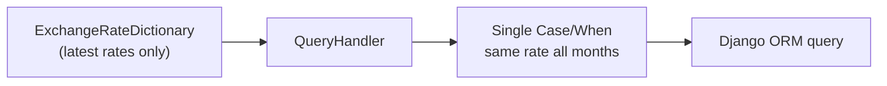
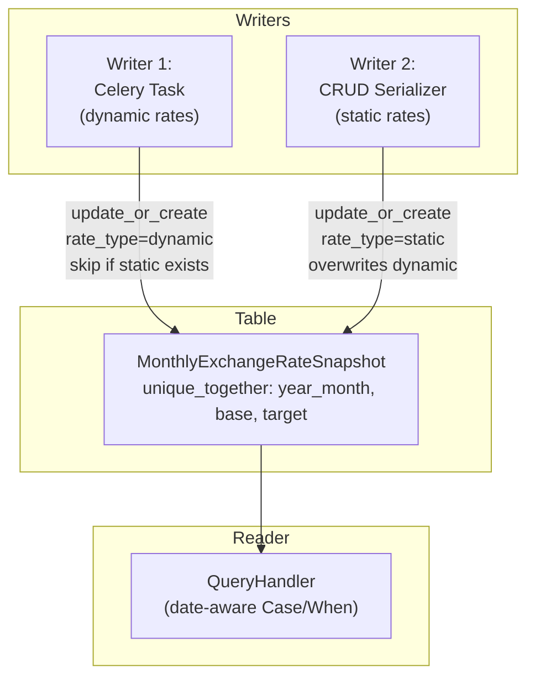

# Pipeline Changes

Pipeline modifications for the Constant Currency feature
([COST-7252](https://redhat.atlassian.net/browse/COST-7252)). Covers the Celery
task changes, query handler changes, and the two-writer/one-reader pattern.

> **See also**: [README.md § IQ-2](./README.md#iq-2-unified-snapshot-table--resolved)
> and [README.md § IQ-3](./README.md#iq-3-dynamic-rate-snapshotting-strategy--resolved)
> for the design decisions behind these changes.

---

## Current Pipeline

### Orchestration Order

1. `get_daily_currency_rates` Celery beat task fires daily
2. Fetches rates from `CURRENCY_URL` (configured in `koku/koku/settings.py`,
   defaults to `open.er-api.com`)
3. Upserts `ExchangeRates` rows for each base currency
4. Rebuilds `ExchangeRateDictionary` via `build_exchange_dictionary()`
   (cross-rate matrix in `api/currency/utils.py`)

### How Exchange Rates Work Today

At query time, `QueryHandler.exchange_rate_annotation_dict` (in
`koku/api/query_handler.py`) reads from `ExchangeRateDictionary` and builds a
single `Case`/`When` annotation. This annotation applies the **same rate** to
all months in the query range.



**Problem**: When a user queries a 6-month report, every month uses today's
exchange rate. If the rate changed significantly over those 6 months, the
historical data is misleading.

---

## Proposed Pipeline Changes

### New Orchestration Order

1. `get_daily_currency_rates` Celery beat task fires daily
2. Fetches rates from `CURRENCY_URL` *(unchanged)*
3. Upserts `ExchangeRates` rows *(unchanged)*
4. Rebuilds `ExchangeRateDictionary` *(unchanged)*
5. **NEW**: Per-tenant snapshot upsert into `MonthlyExchangeRateSnapshot`

At query time:

6. **CHANGED**: `QueryHandler.exchange_rate_annotation_dict` reads from
   `MonthlyExchangeRateSnapshot` instead of `ExchangeRateDictionary`
7. **CHANGED**: Builds per-month `Case`/`When` annotations (one rate per month)
8. **NEW**: Report response includes `exchange_rates_applied` metadata

### Two Writers, One Reader

The `MonthlyExchangeRateSnapshot` table has two writers and one reader:



---

## Modified: `get_daily_currency_rates` — Writer 1

**File**: `koku/masu/celery/tasks.py`

After existing logic (upsert `ExchangeRates`, rebuild `ExchangeRateDictionary`),
add per-tenant snapshot upsert:

```python
current_month = dh.today.strftime("%Y-%m")
exchange_dict = ExchangeRateDictionary.objects.first().currency_exchange_dictionary

for tenant in Tenant.objects.exclude(schema_name="public"):
    with schema_context(tenant.schema_name):
        for base_cur, targets in exchange_dict.items():
            for target_cur, rate in targets.items():
                if base_cur == target_cur:
                    continue
                if not MonthlyExchangeRateSnapshot.objects.filter(
                    year_month=current_month,
                    base_currency=base_cur,
                    target_currency=target_cur,
                    rate_type="static",
                ).exists():
                    MonthlyExchangeRateSnapshot.objects.update_or_create(
                        year_month=current_month,
                        base_currency=base_cur,
                        target_currency=target_cur,
                        defaults={"exchange_rate": rate, "rate_type": "dynamic"},
                    )
```

**Key behaviors**:

- Runs daily; overwrites current month's dynamic rows with latest rate
- Skips pairs with `rate_type="static"` (static takes precedence)
- Past months' rows are never updated (automatic finalization)
- Forward-only: no backfill of months before deployment

**Risk linkage**: See [risk-register.md § R1](./risk-register.md#r1--celery-task-month-end-failure),
[risk-register.md § R2](./risk-register.md#r2--task-runtime-with-many-tenantspairs)

---

## Modified: Query Handler — Reader

**Files to modify**:

| File | Change |
|------|--------|
| `koku/api/query_handler.py` | Base `QueryHandler`: new `effective_exchange_rates` cached property, date-aware `Case`/`When` |
| `koku/api/report/ocp/query_handler.py` | OCP override: use snapshot-based rates |
| `koku/forecast/forecast.py` | Forecast handler: use snapshot-based rate resolution |

### New: `effective_exchange_rates` Property

```python
@cached_property
def effective_exchange_rates(self):
    """Load pre-computed exchange rates for the query date range."""
    months = [m.strftime("%Y-%m") for m in self._iter_months()]
    return MonthlyExchangeRateSnapshot.objects.filter(
        year_month__in=months,
        target_currency=self.currency,
    )
```

### Changed: `exchange_rate_annotation_dict`

Replace single-rate annotation with per-month `Case`/`When`:

```python
whens = []
for snapshot_row in self.effective_exchange_rates:
    month_start, month_end = month_bounds(snapshot_row.year_month)
    whens.append(When(
        usage_start__gte=month_start,
        usage_start__lt=month_end,
        **{self._mapper.cost_units_key: snapshot_row.base_currency},
        then=Value(snapshot_row.exchange_rate),
    ))
return {"exchange_rate": Case(*whens, default=1, output_field=DecimalField())}
```

### Fallback for Pre-Deployment Months

For months without snapshot rows (before deployment), fall back to the live
`ExchangeRateDictionary` (current behavior). This ensures backward compatibility:

```python
if not whens:
    # No snapshot data — fall back to ExchangeRateDictionary
    return self._legacy_exchange_rate_annotation_dict()
```

**Risk linkage**: See [risk-register.md § R4](./risk-register.md#r4--pre-deployment-month-gap),
[risk-register.md § R5](./risk-register.md#r5--query-handler-performance)

---

## Static Rate → Snapshot — Writer 2

**Trigger**: `StaticExchangeRate` CRUD operations (create, update, delete) via
the serializer in `koku/cost_models/static_exchange_rate_serializer.py`.

### On Create / Update

For each month between `start_date` and `end_date`, upsert a row in
`MonthlyExchangeRateSnapshot` with `rate_type="static"` and the user-defined
rate. This overwrites any existing dynamic row for that pair/month (the
`unique_together` constraint ensures only one row per triple).

### On Delete

Remove `rate_type="static"` rows for the affected months. The next daily Celery
task run will populate `rate_type="dynamic"` rows for those pairs/months.

**Risk linkage**: See [risk-register.md § R6](./risk-register.md#r6--static-rate-deletion-gap)

---

## Finalized Month Locking

**Per the PRD**: *"When the billing period (natural month) is finalized, we will
use the last of the month's exchange rate and store it for that month, so that
the cost report for a finalized period of time does not change afterwards."*

This is handled automatically by the unified `MonthlyExchangeRateSnapshot` table:

- **Dynamic rates**: The daily Celery task overwrites the current month's dynamic
  rows every day. Once the month rolls over, those rows are never updated again —
  they're locked with the last successfully fetched rate.
- **Static rates**: Inherently stable. The user defines them; they don't change
  unless explicitly edited. No locking needed.
- **Resilience**: If the daily task fails on the last day of the month, the
  snapshot still has the rate from the most recent successful day.
- **Forward-only**: Months before deployment have no snapshot rows and fall back
  to the live `ExchangeRateDictionary`.

---

## Unchanged Components

| File | Reason |
|------|--------|
| `koku/api/currency/models.py` | `ExchangeRates` and `ExchangeRateDictionary` remain as-is; serve as data source for dynamic snapshots |
| `koku/api/currency/utils.py` | `build_exchange_dictionary` unchanged |
| `koku/koku/settings.py` | `CURRENCY_URL` unchanged |
| `masu/database/sql/` | No SQL template changes (all changes are Django ORM) |
| `masu/database/trino_sql/` | No Trino changes |
| `masu/database/self_hosted_sql/` | No self-hosted changes |

---

## Changelog

| Version | Date | Summary |
|---------|------|---------|
| v1.0 | 2026-03-19 | Initial pipeline changes design |
