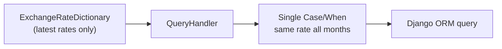
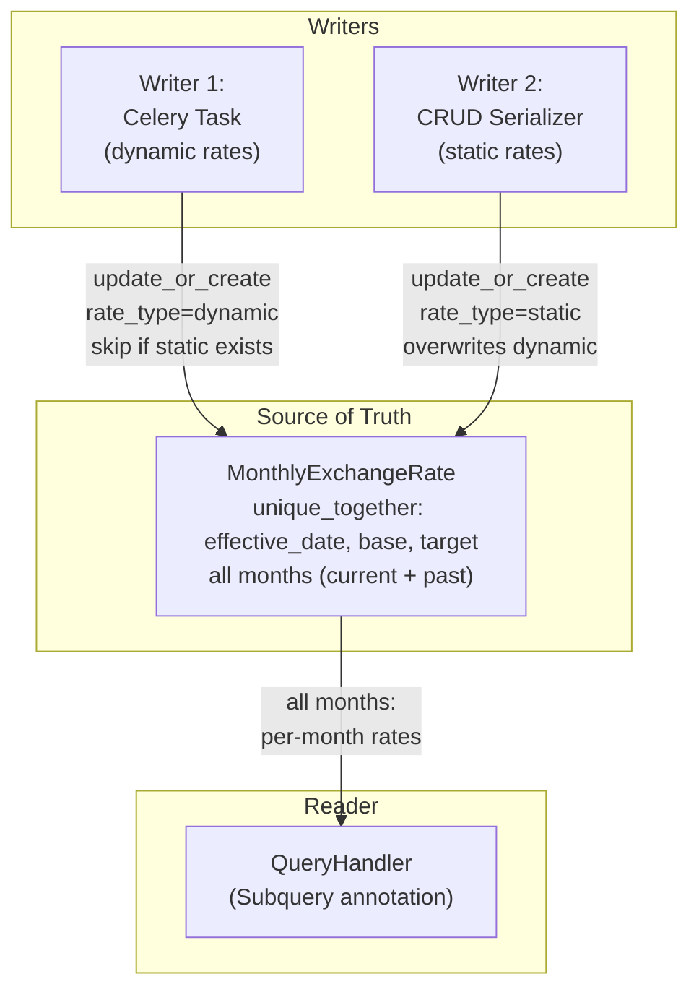

# Pipeline Changes

Pipeline modifications for the Constant Currency feature
([COST-7252](https://redhat.atlassian.net/browse/COST-7252)). Covers the Celery
task changes, query handler changes, and the two-writer/one-reader pattern.

> **See also**: [README.md § IQ-2](./README.md#iq-2-unified-table--resolved)
> and [README.md § IQ-3](./README.md#iq-3-dynamic-rate-snapshotting-strategy--resolved)
> for the design decisions behind these changes.

---

## Current Pipeline

### Orchestration Order

1. `get_daily_currency_rates` Celery beat task fires daily
2. Fetches rates from `CURRENCY_URL` (configured in `koku/koku/settings.py`,
   defaults to `open.er-api.com`)
3. Upserts `ExchangeRates` rows for each target currency (rates vs USD)
4. Rebuilds `ExchangeRateDictionary` via `build_exchange_dictionary()`
   (cross-rate matrix in `api/currency/utils.py`)

### How Exchange Rates Work Today

At query time, `QueryHandler.exchange_rate_annotation_dict` (in
`koku/api/query_handler.py`) reads from `ExchangeRateDictionary` and builds a
single `Case`/`When` annotation. This annotation applies the **same rate** to
all months in the query range.



**OCP dual-annotation pattern**: The OCP query handler overrides
`exchange_rate_annotation_dict` to produce **two** annotations instead of one:

- **`exchange_rate`** — matches on `source_uuid`. Currency is resolved via
  `source_uuid` → `CostModelMap` → `CostModel.currency`. Used for
  supplementary/cost-model costs (CPU, memory, volume, GPU rates) and
  distributed platform/worker/GPU costs.
- **`infra_exchange_rate`** — matches on `cost_units_key` (`raw_currency`).
  Currency comes from the underlying cloud provider's bill. Used for
  `infrastructure_raw_cost`, `infrastructure_markup_cost`, and distributed
  unattributed storage/network costs.

This split is necessary because OCP line items carry costs from two different
currency sources on the same row (cost model currency vs cloud bill currency).

**Problem**: When a user queries a 6-month report, every month uses today's
exchange rate. If the rate changed significantly over those 6 months, the
historical data is misleading.

---

## Proposed Pipeline Changes

### Configurable Exchange Rate API URL

The exchange rate API URL is already configurable via `CURRENCY_URL` in
`koku/koku/settings.py`. This design makes the URL meaningful for on-premise
deployments:

- **Default**: `open.er-api.com` (Open Exchange Rates API, free tier)
- **Custom**: Customers can point to any compatible exchange rate API
- **Empty/unset**: Celery task skips the API fetch step (no dynamic rates fetched)

Documentation should include the production API URL as an example for customers
configuring their own on-premise deployment.

> **Scope**: Only the free tier of Open Exchange Rates API is supported.
> Paid-tier features (e.g., historical rates, time-series) are out of scope
> for this design and would be covered by a future PRD if needed.

### New Orchestration Order

1. `get_daily_currency_rates` Celery beat task fires daily
2. **CHANGED**: Checks if `CURRENCY_URL` is configured; **skips API fetch if
   empty** (dynamic rates are simply not fetched; static rates still work)
3. Fetches rates from `CURRENCY_URL` *(unchanged when URL is set)*
4. Upserts `ExchangeRates` rows *(unchanged)*
5. Rebuilds `ExchangeRateDictionary` *(unchanged)*
6. **NEW**: Per-tenant upsert into `MonthlyExchangeRate` for all currencies
   returned by the API

At query time:

8. **CHANGED**: `QueryHandler.exchange_rate_annotation_dict` resolves rates
   from `MonthlyExchangeRate` via `Subquery` (correlated by month and currency)
9. **CHANGED**: Per-month rate resolution via `Subquery` annotation (replaces
   single-rate `Case`/`When`)
10. **NEW**: Report response includes `exchange_rates_applied` metadata
11. **NEW**: Available currencies for dropdown computed from `EnabledCurrency`
    table only (static rates do not bypass enablement)

### Single Source of Truth: `MonthlyExchangeRate`

`MonthlyExchangeRate` is the single source of truth for exchange rates used
in reports. Two writers keep it up to date; the query handler reads from it
for all months (current and past):



For the current month, dynamic rows are overwritten daily with the latest rate
from the API. Once the month ends, those rows are never updated again —
they're locked with the last successfully fetched rate. Static rows are written
on every CRUD operation and take precedence over dynamic rows (the
`unique_together` constraint ensures only one row per triple).

---

## Modified: `get_daily_currency_rates` — Writer 1

**File**: `koku/masu/celery/tasks.py`

### Step 1: Check for `CURRENCY_URL`

If `CURRENCY_URL` is empty or unset, skip the API fetch and dynamic rate upsert
steps. The system does not require `CURRENCY_URL` to function — it uses
whatever rates are available (static first, then dynamic, then error if
neither exists for a given pair).

```python
if not settings.CURRENCY_URL:
    LOG.info(log_json(msg="CURRENCY_URL not configured; skipping dynamic exchange rate fetch"))
    return
```

### Step 2: Fetch and store (unchanged)

Fetch rates from `CURRENCY_URL`, upsert `ExchangeRates`, rebuild
`ExchangeRateDictionary`. This logic is unchanged from today.

### Step 3: `MonthlyExchangeRate` upsert (new)

After rebuilding `ExchangeRateDictionary`, upsert per-tenant
`MonthlyExchangeRate` rows:

```python
current_month = dh.this_month_start  # date(2026, 3, 1)
exchange_dict = ExchangeRateDictionary.objects.first().currency_exchange_dictionary

for tenant in Tenant.objects.exclude(schema_name="public"):
    with schema_context(tenant.schema_name):
        # Pre-fetch all static pairs for this month in a single query
        static_pairs = set(
            MonthlyExchangeRate.objects.filter(
                effective_date=current_month,
                rate_type=RateType.STATIC,
            ).values_list("base_currency", "target_currency")
        )

        # Upsert all currencies — EnabledCurrency controls dropdown visibility
        for base_cur, targets in exchange_dict.items():
            for target_cur, rate in targets.items():
                if base_cur == target_cur:
                    continue
                if (base_cur, target_cur) not in static_pairs:
                    MonthlyExchangeRate.objects.update_or_create(
                        effective_date=current_month,
                        base_currency=base_cur,
                        target_currency=target_cur,
                        defaults={"exchange_rate": rate, "rate_type": RateType.DYNAMIC},
                    )
```

**Key behaviors**:

- **URL check**: If `CURRENCY_URL` is not configured, the task skips the API
  fetch. Dynamic rates are simply not fetched; the system uses whatever rates
  are available (static first, dynamic fallback). If `MonthlyExchangeRate` is
  completely empty (no rates configured), the feature is inactive and costs are
  returned as-is in their original bill currency.
- **All currencies stored**: Upserts dynamic rates for all currency pairs
  returned by the API. The `EnabledCurrency` table controls dropdown visibility,
  not rate storage. Administrators enable currencies via the Settings API.
- Runs daily; overwrites current month's dynamic rows with latest rate
- Skips pairs with `rate_type=RateType.STATIC` (static takes precedence)
- Past months' rows are never updated (automatic finalization)
- Forward-only: no backfill of months before deployment

**Risk linkage**: See [risk-register.md § R1](./risk-register.md#r1--celery-task-month-end-failure),
[risk-register.md § R2](./risk-register.md#r2--task-runtime-with-many-tenantspairs),
[risk-register.md § R7](./risk-register.md#r7--no-exchange-rate-for-selected-currency),
[risk-register.md § R8](./risk-register.md#r8--no-rates-configured)

---

## Modified: Query Handler — Reader

**Files to modify**:

| File | Change |
|------|--------|
| `koku/api/query_handler.py` | Base `QueryHandler`: `Subquery`-based `exchange_rate_annotation_dict` using `MonthlyExchangeRate` correlated by `TruncMonth(usage_start)` and `cost_units_key` |
| `koku/api/report/ocp/query_handler.py` | OCP override: dual-annotation `Subquery` pattern (`exchange_rate` via cost model currency + `infra_exchange_rate` via `raw_currency`). `source_to_currency_map` no longer needed. |
| `koku/api/report/ocp/provider_map.py` | **No changes** — already references `exchange_rate` and `infra_exchange_rate` by name |
| `koku/forecast/forecast.py` | Forecast handler: use `MonthlyExchangeRate` for rate resolution |

### Rate Resolution Strategy

The query handler resolves exchange rates from `MonthlyExchangeRate` — a single
table that serves as the source of truth for all months:

| Month | Source | Rationale |
|-------|--------|-----------|
| **All months** | `MonthlyExchangeRate` | Single source of truth; current month rows are kept up to date by writers; past month rows are locked |

No fallback to `ExchangeRateDictionary` is needed. The M2 migration seeds the
current month's data from `ExchangeRateDictionary` at deployment time (see
[data-model.md § M2](./data-model.md#m2-create-and-seed-monthly_exchange_rate-table)),
so `MonthlyExchangeRate` has data from the moment of deployment.

**Pre-deployment months**: For months before deployment, no
`MonthlyExchangeRate` rows exist for the exact month. Instead of defaulting to
a rate of 1 (no conversion), the query handler falls back to the **earliest
available rate** for that currency pair. For example, if the feature is deployed
in March, a query for February will use March's rate — the best available
approximation. This is implemented as a second `Subquery` inside `Coalesce`
(see [base annotation](#changed-base-exchange_rate_annotation_dict) and
[OCP annotation](#changed-ocp-exchange_rate_annotation_dict-dual-annotation-pattern)).

**Missing rates**: If no rate exists at all for a required currency pair (both
the exact-month and earliest-available subqueries return `NULL`), the annotation
evaluates to `NULL`. A [post-query validation step](#post-query-exchange-rate-validation)
detects these `NULL` values and raises an exception — this indicates a system
configuration error (e.g., the Celery seeding task failed or
`MonthlyExchangeRate` was not populated).

The `rate_type` column tracks whether each rate is static or dynamic (static
rows take precedence via the `unique_together` constraint — when a static rate
is written, it overwrites any existing dynamic row for the same triple).

### Changed: Base `exchange_rate_annotation_dict`

Replace single-rate `Case`/`When` with a correlated `Subquery` that joins
`MonthlyExchangeRate` by truncating `usage_start` to its month. This is the
base implementation in `ReportQueryHandler` used by AWS, Azure, and GCP:

```python
@cached_property
def exchange_rate_annotation_dict(self):
    # Primary: exact month match
    rate_subquery = MonthlyExchangeRate.objects.filter(
        effective_date=TruncMonth(OuterRef("usage_start")),
        base_currency=OuterRef(self._mapper.cost_units_key),
        target_currency=self.currency,
    ).values("exchange_rate")[:1]

    # Fallback: earliest available rate for this currency pair
    # (covers pre-deployment months where no exact-month row exists)
    earliest_rate_subquery = MonthlyExchangeRate.objects.filter(
        base_currency=OuterRef(self._mapper.cost_units_key),
        target_currency=self.currency,
    ).order_by("effective_date").values("exchange_rate")[:1]

    return {
        "exchange_rate": Coalesce(
            Subquery(rate_subquery),
            Subquery(earliest_rate_subquery),
            output_field=DecimalField(),
        )
    }
```

**Three-level resolution**:

| Priority | Source | When it applies |
|----------|--------|-----------------|
| 1st | Exact month match | Normal case — rate exists for that month |
| 2nd | Earliest available rate | Pre-deployment months (no row for that month, but rows exist for later months) |
| 3rd | `NULL` | No rates at all for this currency pair — caught by [post-query validation](#post-query-exchange-rate-validation) |

For cloud providers (AWS, Azure, GCP), `cost_units_key` points to the bill's
currency column (e.g., `currency_code`). All cost columns use the same
currency (the cloud bill currency), so a single `exchange_rate` annotation is
sufficient.

**Why `Subquery` instead of `Case`/`When`?** The previous design built
per-month `Case`/`When` clauses, which scaled as `O(months × currencies)` and
required a separate `effective_exchange_rates` property to pre-fetch rates.
The `Subquery` approach delegates the lookup to the database via a correlated
subquery — no Python-side rate pre-fetching, no growing `CASE` expressions,
and PostgreSQL can leverage the `unique_together` index on
`(effective_date, base_currency, target_currency)` for efficient lookups.

**Performance note**: PostgreSQL evaluates `Coalesce` lazily — the
`earliest_rate_subquery` only executes when the first subquery returns `NULL`.
The `order_by("effective_date")[:1]` is efficient with the existing index.

### Changed: OCP `exchange_rate_annotation_dict` (Dual-Annotation Pattern)

The OCP query handler **overrides** `exchange_rate_annotation_dict` to produce
**two** annotations instead of one. This is necessary because OCP line items
carry costs from two different currency sources on the same row:

| Annotation | Matches on | Currency source | Used for |
|------------|-----------|-----------------|----------|
| `exchange_rate` | `source_uuid` | Cost model currency (`CostModel.currency` via `CostModelMap`) | Supplementary/cost-model costs: CPU, memory, volume, GPU rates; platform and worker distributed costs; GPU unallocated |
| `infra_exchange_rate` | `cost_units_key` (`raw_currency`) | Cloud bill currency (from the underlying AWS/Azure/GCP bill) | Infrastructure costs: `infrastructure_raw_cost`, `infrastructure_markup_cost`; unattributed storage and network |

**Why two annotations?** OCP clusters don't have a "bill currency" for
cost-model-derived costs — the currency is determined by the cost model
assigned to each source. Meanwhile, infrastructure costs (for OCP-on-cloud)
come from the underlying cloud provider's bill and carry their own currency
in the `raw_currency` column. These can be different currencies on the same
row, so they need independent exchange rate lookups.

**Existing code** (`koku/api/report/ocp/query_handler.py`):

- `source_to_currency_map` resolves `source_uuid` → `CostModel.currency`
  via `CostModelMap` → `CostModel` (Python-side lookup)
- `exchange_rate` `Case`/`When` matches on `source_uuid`
- `infra_exchange_rate` `Case`/`When` matches on `cost_units_key`
  (`raw_currency`)

**Updated pseudocode** — the `Subquery`-based constant-currency version:

```python
@cached_property
def exchange_rate_annotation_dict(self):
    # Step 1: Resolve source_uuid → cost model currency via DB subquery
    # (replaces the Python-side source_to_currency_map lookup)
    cost_model_currency = CostModel.objects.filter(
        cost_model_map__provider_uuid=OuterRef("source_uuid"),
    ).values("currency")[:1]

    # Step 2: Supplementary / cost-model costs — rate by cost model currency
    exchange_rate_subquery = MonthlyExchangeRate.objects.filter(
        effective_date=TruncMonth(OuterRef("usage_start")),
        base_currency=Subquery(cost_model_currency),
        target_currency=self.currency,
    ).values("exchange_rate")[:1]

    # Step 2b: Fallback — earliest available rate for cost model currency pair
    earliest_exchange_rate_subquery = MonthlyExchangeRate.objects.filter(
        base_currency=Subquery(cost_model_currency),
        target_currency=self.currency,
    ).order_by("effective_date").values("exchange_rate")[:1]

    # Step 3: Infrastructure costs — rate by cloud bill currency column
    infra_exchange_rate_subquery = MonthlyExchangeRate.objects.filter(
        effective_date=TruncMonth(OuterRef("usage_start")),
        base_currency=OuterRef(self._mapper.cost_units_key),
        target_currency=self.currency,
    ).values("exchange_rate")[:1]

    # Step 3b: Fallback — earliest available rate for infra currency pair
    earliest_infra_rate_subquery = MonthlyExchangeRate.objects.filter(
        base_currency=OuterRef(self._mapper.cost_units_key),
        target_currency=self.currency,
    ).order_by("effective_date").values("exchange_rate")[:1]

    return {
        "exchange_rate": Coalesce(
            Subquery(exchange_rate_subquery),
            Subquery(earliest_exchange_rate_subquery),
            output_field=DecimalField(),
        ),
        "infra_exchange_rate": Coalesce(
            Subquery(infra_exchange_rate_subquery),
            Subquery(earliest_infra_rate_subquery),
            output_field=DecimalField(),
        ),
    }
```

Both annotations follow the same three-level resolution as the
[base implementation](#changed-base-exchange_rate_annotation_dict): exact month
→ earliest available → `NULL` (caught by post-query validation).

**Key change from current code**: `source_to_currency_map` (Python dict) is
replaced by a nested `Subquery` that resolves `source_uuid` → `CostModel.currency`
in the database. This eliminates the Python-side O(sources × months) loop and
lets PostgreSQL handle the join.

**Which annotation is used where** (in `koku/api/report/ocp/provider_map.py`
— these ORM expressions are unchanged by this feature):

| Provider map property | Annotation | Rationale |
|-----------------------|------------|-----------|
| `__cost_model_cost` (CPU + mem + vol + GPU) | `exchange_rate` | Cost model currency |
| `__cost_model_cpu_cost` | `exchange_rate` | Cost model currency |
| `__cost_model_memory_cost` | `exchange_rate` | Cost model currency |
| `__cost_model_volume_cost` | `exchange_rate` | Cost model currency |
| `__cost_model_gpu_cost` | `exchange_rate` | Cost model currency |
| `cloud_infrastructure_cost` | `infra_exchange_rate` | Cloud bill currency |
| `markup_cost` | `infra_exchange_rate` | Derived from infra cost |
| `distributed_platform_cost` | `exchange_rate` | Cost model rates |
| `distributed_worker_cost` | `exchange_rate` | Cost model rates |
| `distributed_unallocated_gpu_cost` | `exchange_rate` | Cost model rates |
| `distributed_unattributed_storage_cost` | `infra_exchange_rate` | Infrastructure-sourced |
| `distributed_unattributed_network_cost` | `infra_exchange_rate` | Infrastructure-sourced |

The provider map itself requires **no changes** — it already references
`exchange_rate` and `infra_exchange_rate` by name, and the query handler
produces both annotations.

### Pre-Deployment Months

Months before deployment have no `MonthlyExchangeRate` rows for the exact month.
The query handler falls back to the **earliest available rate** for that currency
pair — typically the rate from the deployment month (seeded by the M2 migration).
This provides the best available approximation rather than showing unconverted
costs.

For example, if the feature is deployed in March 2026 and a user queries
January–April data:

| Month | Resolution | Rate used |
|-------|-----------|-----------|
| January 2026 | No exact match → earliest available (March) | March rate |
| February 2026 | No exact match → earliest available (March) | March rate |
| March 2026 | Exact match | March rate |
| April 2026 | Exact match | April rate |

The M2 migration seeds the current month at deployment time, so there is no gap
for the deployment month. Going forward, the daily Celery task and CRUD
operations populate future months.

If no rate exists at all for a required currency pair (both subqueries return
`NULL`), the [post-query validation](#post-query-exchange-rate-validation) raises
an exception.

**Risk linkage**: See [risk-register.md § R5](./risk-register.md#r5--query-handler-performance)

### Pre-Query Exchange Rate Validation

Before executing the report query, the query handler validates that exchange
rate data exists for the requested target currency. This validation has two
levels:

```python
def _validate_exchange_rates(self, target_currency):
    """Raise ExchangeRateNotFound if no MonthlyExchangeRate rows exist for the target currency.

    Skips validation when MonthlyExchangeRate is completely empty (feature not configured).
    The Coalesce(..., Value(1)) fallback in provider maps ensures costs are returned as-is.
    """
    with tenant_context(self.tenant):
        if not MonthlyExchangeRate.objects.exists():
            return  # feature not configured, costs returned as-is
        if not MonthlyExchangeRate.objects.filter(target_currency=target_currency).exists():
            raise ExchangeRateNotFound(target_currency)
```

**Key design choices**:

- **Feature activation**: When `MonthlyExchangeRate` is completely empty (no
  rates configured at all), the feature is inactive. Validation is skipped and
  costs are returned as-is in their original bill currency. The
  `Coalesce("exchange_rate", Value(1))` fallback in provider maps ensures NULL
  annotations resolve to `1` (no conversion).
- **Pre-query check**: The validation runs before the query executes. It
  verifies that *any* `MonthlyExchangeRate` row exists for the target currency.
  Per-row mismatches (e.g., a specific base currency with no rate) are handled
  gracefully by the `Coalesce` fallback to `1`.
- **Exception type**: `ExchangeRateNotFound` is a custom exception caught by
  the view layer and returned as HTTP 400 with an actionable error message.
  This only fires when rates are configured but not for the requested currency
  — indicating an administrator configuration gap, not a system error.

### New: Available Currency Resolution

The report dropdown shows only currencies that an administrator has explicitly
enabled via the `EnabledCurrency` table. Defining a static exchange rate does
**not** automatically make its currencies available in the report dropdown — the
administrator must still enable them.

The settings admin page (`GET settings/currency/exchange_rate/`) shows all
currencies with static rates regardless of enabled status, so the administrator
can manage them without needing to enable them first.

When the user selects a currency that is enabled but has **no exchange rate
path** from the bill's source currency, the API returns an error rather than
silently showing zero or unconverted costs:

> *"No exchange rate available. Ask your administrator to configure static
> exchange rates or enable dynamic exchange rates."*

When **no currencies are enabled**, the frontend either hides the currency
dropdown entirely or shows *"No exchange rates available."*

See [api-and-frontend.md § Corner Case: No Exchange Rate](./api-and-frontend.md#corner-case-no-exchange-rate)
for the full UX specification.

---

## Static Rate → `MonthlyExchangeRate` Upsert — Writer 2

**Trigger**: `StaticExchangeRate` CRUD operations (create, update, delete) via
the serializer in `koku/cost_models/static_exchange_rate_serializer.py`.

Each CRUD operation upserts or removes rows in `MonthlyExchangeRate` inside a
single `transaction.atomic()` block.

### On Create / Update

For each month between `start_date` and `end_date`, upsert a row in
`MonthlyExchangeRate` with `rate_type=RateType.STATIC` and the user-defined
rate. This overwrites any existing dynamic row for that pair/month (the
`unique_together` constraint ensures only one row per triple).

### On Delete

Remove `rate_type=RateType.STATIC` rows for the affected months, then
proactively populate `rate_type=RateType.DYNAMIC` rows from the current
`ExchangeRateDictionary` for those pairs/months. This eliminates the data gap
that would otherwise exist until the next daily Celery task run.

| Event | `MonthlyExchangeRate` Action |
|-------|------------------------------|
| **Create** | Upsert `rate_type=static` rows for affected months |
| **Update** | Upsert `rate_type=static` rows for affected months |
| **Delete** | Remove static rows, insert dynamic fallback rows |

All operations (StaticExchangeRate write + MonthlyExchangeRate upsert) are
wrapped in a single `transaction.atomic()` block, ensuring atomicity.

**Risk linkage**: See [risk-register.md § R6](./risk-register.md#r6--static-rate-deletion-gap)

---

## Finalized Month Locking

When the billing period (natural month) is finalized, the last of the month's
exchange rate is stored for that month, so that the cost report for a finalized
period of time does not change afterwards.

This is handled automatically by the `MonthlyExchangeRate` table:

- **Dynamic rates**: The daily Celery task overwrites the current month's dynamic
  rows every day. Once the month rolls over, those rows are never updated again —
  they're locked with the last successfully fetched rate.
- **Static rates**: Inherently stable. The user defines them; they don't change
  unless explicitly edited. No locking needed.
- **Resilience**: If the daily task fails on the last day of the month, the
  table still has the rate from the most recent successful day.
- **Forward-only**: Months before deployment have no `MonthlyExchangeRate` rows;
  the current month is seeded during M2 migration. Pre-deployment months use the
  earliest available rate (see [Pre-Deployment Months](#pre-deployment-months)).

---

## Cache Invalidation

The Koku API uses `cache_page` backed by Valkey/Redis (default TTL: 1 hour).
When exchange rates change, cached report responses will serve stale currency
conversions until the cache expires. Both write paths must invalidate the
tenant's report cache to ensure users see updated conversions immediately.

**Existing pattern**: Cost model updates already invalidate the cache via
`invalidate_view_cache_for_tenant_and_source_type()` in
`koku/masu/processor/cost_model_cost_updater.py`. Exchange rate changes follow
the same approach.

### CRUD Serializer (Writer 2)

After a static rate create, update, or delete, the serializer flushes the
tenant's report cache for all source types. Since exchange rates affect all
provider reports (not just a single source type), use
`invalidate_view_cache_for_tenant_and_all_source_types()`:

```python
# In StaticExchangeRateSerializer, after MonthlyExchangeRate upsert/delete:
from koku.cache import invalidate_view_cache_for_tenant_and_all_source_types

invalidate_view_cache_for_tenant_and_all_source_types(schema_name)
```

### Celery Task (Writer 1)

After the daily `MonthlyExchangeRate` upsert completes for a tenant, flush
that tenant's report cache. This runs inside the existing per-tenant loop:

```python
# In get_daily_currency_rates, after MonthlyExchangeRate upsert per tenant:
from koku.cache import invalidate_view_cache_for_tenant_and_all_source_types

invalidate_view_cache_for_tenant_and_all_source_types(tenant.schema_name)
```

**Why all source types?** Exchange rates apply across all providers — a USD→EUR
rate change affects AWS, Azure, GCP, and OCP reports equally. Invalidating
per-source-type would miss cross-provider reports (e.g., OCP-on-AWS).

---

## Unchanged Components

| File | Reason |
|------|--------|
| `koku/api/currency/models.py` | `ExchangeRates` and `ExchangeRateDictionary` remain as-is; `ExchangeRateDictionary` is still rebuilt daily by the Celery task and serves as the intermediate source for dynamic rates (the task reads from it to populate `MonthlyExchangeRate`). The M2 migration also reads from it to seed current-month data. No longer used by the query handler at query time. |
| `koku/api/currency/utils.py` | `build_exchange_dictionary` unchanged |
| `koku/koku/settings.py` | `CURRENCY_URL` unchanged (already configurable); empty value causes Celery task to skip API fetch |
| `masu/database/sql/` | No SQL template changes (all changes are Django ORM) |
| `masu/database/trino_sql/` | No Trino changes |
| `masu/database/self_hosted_sql/` | No self-hosted changes |

---

## Changelog

| Version | Date | Summary |
|---------|------|---------|
| v1.0 | 2026-03-19 | Initial pipeline changes design |
| v1.1 | 2026-03-24 | Added airgapped mode, currency discovery, enabled-currency filtering, available currency resolution |
| v1.2 | 2026-03-24 | Simplified enablement: `enabled` flag only controls dropdown visibility. All currencies always stored and snapshotted. |
| v1.3 | 2026-03-24 | Removed airgapped mode concept. Rate resolution is: static first, dynamic fallback, error if neither. `CURRENCY_URL` only affects whether the Celery task fetches from the API. |
| v1.4 | 2026-03-26 | Two-tier rate resolution: dictionaries as sources of truth for current month, snapshots for historical report rates. Updated query handler pseudocode. |
| v1.5 | 2026-03-29 | Replaced `year_month` CharField references with `effective_date` DateField in all pseudocode and diagrams. |
| v1.6 | 2026-03-30 | `MonthlyExchangeRate` is now the single source of truth for all months (current and past). Removed `StaticExchangeRateDictionary` and two-tier resolution. Query handler reads from one table. Writer 2 simplified to upsert only. |
| v1.7 | 2026-03-30 | Removed `ExchangeRateDictionary` fallback from query handler. M2 migration seeds current-month data at deployment. Pre-deployment months have no conversion (rate=1). |
| v1.8 | 2026-04-12 | Documented OCP dual-annotation pattern (`exchange_rate` + `infra_exchange_rate`). Updated `effective_exchange_rates` return type to `{(effective_date, base_currency): row}`. Added OCP override pseudocode and annotation-to-cost-type mapping table. |
| v1.9 | 2026-04-12 | Replaced `_iter_months()` with explicit date range filter. Added cache invalidation section for both CRUD and Celery writers. |
| v2.0 | 2026-04-12 | Adopted `Subquery` approach for rate resolution (replaces `Case`/`When`). Removed `effective_exchange_rates` property. OCP uses nested `Subquery` for `source_uuid` → cost model currency resolution. R5 mitigated. |
| v2.1 | 2026-04-12 | Pre-deployment months now fall back to earliest available rate instead of defaulting to 1. Added post-query validation that raises `ExchangeRateNotFound` when no rate exists for a currency pair. Removed `Value(Decimal("1"))` from `Coalesce` in both base and OCP annotations. |
| v2.2 | 2026-04-13 | Fixed current pipeline description: `ExchangeRates` upserts per target currency (not base). Fixed "stored and stored" typo in available currency resolution. |
| v2.3 | 2026-04-28 | Removed static-rate enablement bypass from available currency resolution. Report dropdown governed solely by `EnabledCurrency`. |
| v2.4 | 2026-04-28 | Replaced post-query validation pseudocode with actual pre-query implementation. Added "costs as-is" behavior: when `MonthlyExchangeRate` is empty, feature inactive, validation skipped. |
