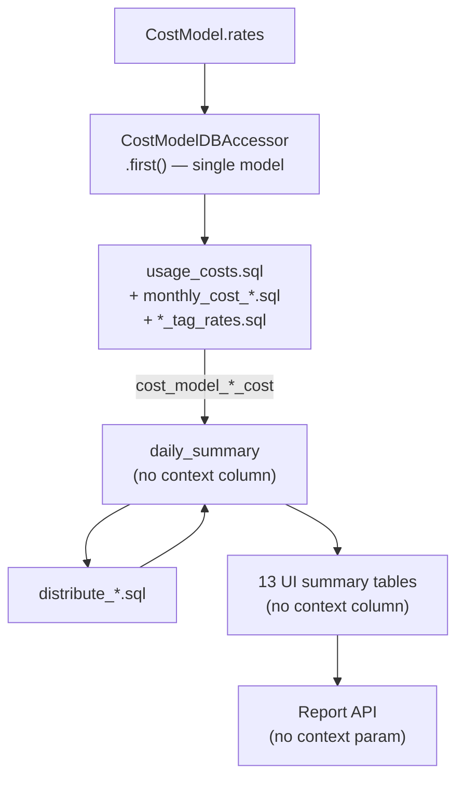
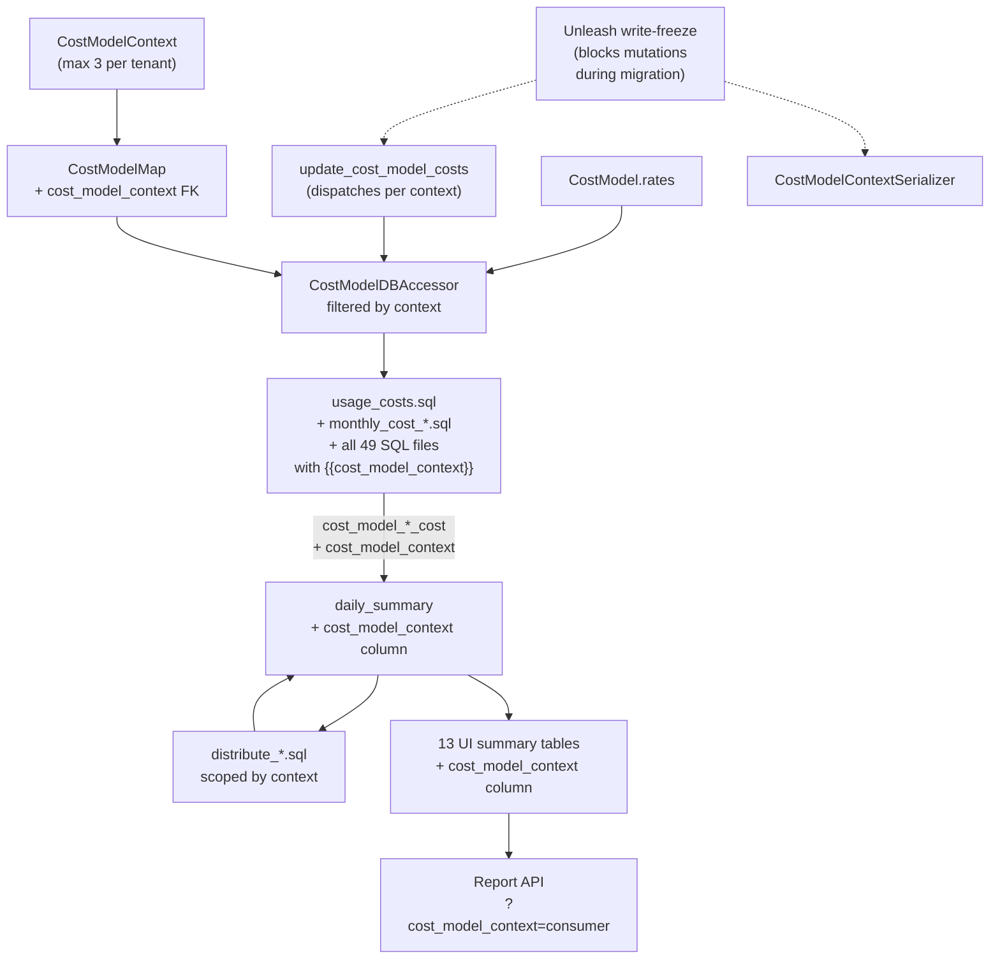
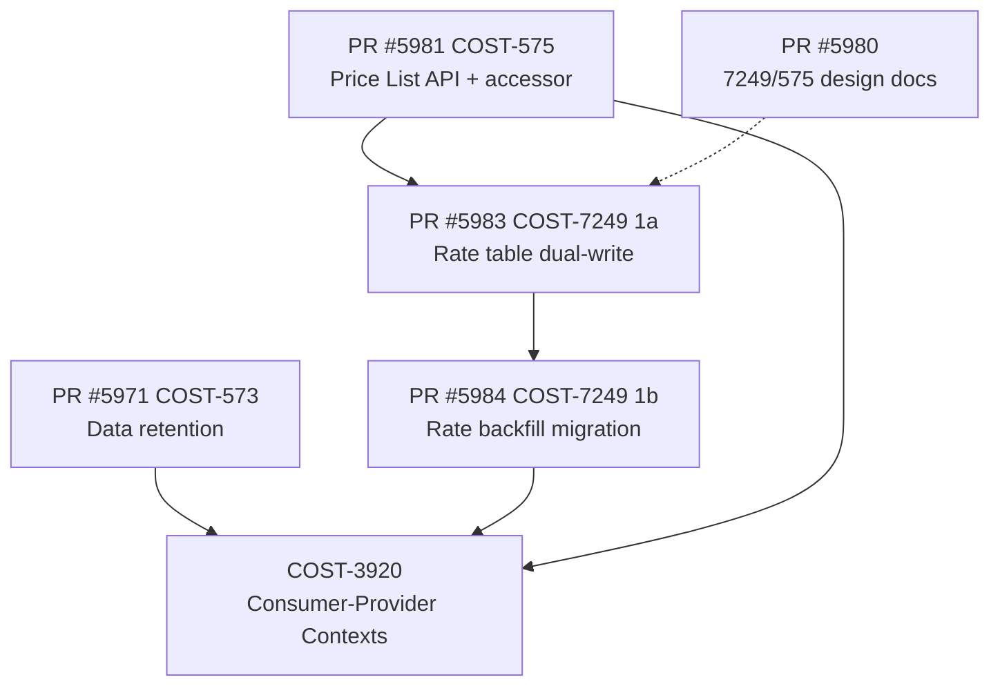

# Consumer-Provider Cost Models

Technical design for **cost model contexts** in the OpenShift cost
management pipeline, enabling multiple cost models per OCP cluster
(e.g., Provider vs Consumer) with per-context cost calculation,
reporting, and access control.

**Jira Epic**: [COST-3920](https://redhat.atlassian.net/browse/COST-3920)
**PRD**: Consumer-Provider Cost Models (cost model contexts)

**Prerequisite reading**: [current-architecture.md](./current-architecture.md) —
describes the cost model architecture this feature extends.

---

## Decisions Needed from Tech Lead

The following design decisions require tech lead confirmation before
implementation proceeds.

| # | Decision | Status | Blocking Phase | Proposal |
|---|----------|--------|---------------|----------|
| **DQ-1** | Migration strategy: nullable AddField + RunSQL backfill vs DEFAULT clause | Pending | Phase 1-2 | [Details](#dq-1-migration-strategy) |
| **DQ-2** | Write-freeze Unleash flag during data migration | Pending | Phase 5 | [Details](#dq-2-write-freeze-during-migration) |
| **DQ-3** | RBAC scope: Koku-side auth (v1) vs platform RBAC | Pending | Phase 4 | [Details](#dq-3-rbac-scope) |
| **DQ-4** | Per-context pipeline dispatch: parallel Celery tasks vs sequential loop | Pending | Phase 3 | [Details](#dq-4-per-context-pipeline-dispatch) |

### DQ-1: Migration Strategy

**Problem**: Adding `cost_model_context` to 14 reporting tables
(1 daily summary + 13 UI summaries) that contain millions of rows.
Existing cost-model rows (identified by `cost_model_rate_type IS NOT NULL`)
need a `'default'` context value — otherwise the pipeline's scoped
`DELETE WHERE cost_model_context = X` will miss NULL legacy rows,
causing data duplication.

**Proposal: Nullable AddField + RunSQL backfill.**

Follows the established pattern from migration 0339 (`cost_model_gpu_cost`).
AddField with `null=True` is a metadata-only operation on PostgreSQL.
A subsequent RunSQL migration backfills `cost_model_context = 'default'`
on rows where `cost_model_rate_type IS NOT NULL`. See
[risk-register.md § R1](./risk-register.md#r1-was-tq-3-daily-summary-migration--resolved-by-codebase-pattern).

| # | Approach | Pros | Cons | Verdict |
|---|----------|------|------|---------|
| A | Nullable AddField + RunSQL backfill | Follows koku precedent; metadata-only DDL; predictable | Backfill may take time on large tenants | **Proposed** |
| B | AddField with DEFAULT clause | No separate backfill | Not used anywhere in koku; PostgreSQL rewrites table for non-NULL DEFAULT | Rejected |
| C | Background Celery backfill | Non-blocking | Complex; hard to coordinate with pipeline; no koku precedent | Rejected |

### DQ-2: Write-Freeze During Migration

**Problem**: Between migration deployment and code deployment, the
pipeline could write context-tagged rows alongside unbackfilled NULL
rows, causing duplicates.

**Proposal: Dedicated Unleash flag** following the PR #5983
`disable-cost-model-writes` pattern. Flag
`cost-management.backend.disable-cost-model-context-writes` blocks
context mutations (serializer) and context-tagged pipeline writes
(task guard). Reads remain open.

See [phased-delivery.md § Deployment Runbook](./phased-delivery.md#deployment-runbook).

### DQ-3: RBAC Scope

**Problem**: Koku's RBAC service has no "context" dimension.

**Proposal: Koku-side authorization for v1** (Option C from
[current-architecture.md § 6.3](./current-architecture.md#63-alternatives)).
A `CostModelContextPermission` class subclasses `CostModelsAccessPermission`,
checks `cost_model.read` access when `cost_model_context` is explicitly
in the request query params, and falls through to standard OCP report
permissions otherwise. No RBAC service changes required. Migration to
platform RBAC can happen later without API changes. Kessel/ReBAC is
out of scope for v1.

### DQ-4: Per-Context Pipeline Dispatch

**Problem**: The pipeline must run once per context per cluster.

**Proposal: Parallel Celery tasks** (Option B from
[risk-register.md § R2](./risk-register.md#r2-pipeline-runs-n-per-cluster)).
The `update_cost_model_costs` task, when called without a specific
context, queries `CostModelContext` for the tenant and dispatches
one task per context. Each task includes `cost_model_context` in the
Celery cache key (resolving R19). Most tenants will have 1-2 contexts,
keeping the common case fast.

---

## Architecture at a Glance

### Current Data Flow

### Proposed Data Flow

---

## Quick Start

| Your goal | Start here |
|-----------|------------|
| Understand today's cost model architecture | [current-architecture.md](./current-architecture.md) |
| Understand each PRD requirement and proposed implementation | [prd-gap-analysis.md](./prd-gap-analysis.md) |
| Understand in-flight PR dependencies | [dependency-analysis.md](./dependency-analysis.md) |
| Understand risks and mitigations | [risk-register.md](./risk-register.md) |
| Understand phased delivery, PR structure, and deployment | [phased-delivery.md](./phased-delivery.md) |
| Understand test strategy | [test-plan.md](./test-plan.md) |

## Reading Order

### For the reviewing engineer

1. This README (decisions first)
2. [current-architecture.md](./current-architecture.md) — baseline
3. [prd-gap-analysis.md](./prd-gap-analysis.md) — proposed implementation
4. [phased-delivery.md](./phased-delivery.md) — what ships when
5. [risk-register.md](./risk-register.md) — risks and mitigations

### For operators

1. [phased-delivery.md § Deployment Runbook](./phased-delivery.md#deployment-runbook)
2. [risk-register.md § R21](./risk-register.md) — deployment sequencing risk

---

## Document Catalog

| # | Document | Type | Summary |
|---|----------|------|---------|
| 1 | [README.md](README.md) | DD | Design overview, decisions needed, architecture diagrams |
| 2 | [current-architecture.md](current-architecture.md) | DD | Current cost model architecture: models, manager, pipeline, API |
| 3 | [prd-gap-analysis.md](prd-gap-analysis.md) | DD | PRD requirements with proposed implementation and code sketches |
| 4 | [dependency-analysis.md](dependency-analysis.md) | DD | In-flight PR analysis, merge ordering, conflict risks |
| 5 | [risk-register.md](risk-register.md) | Ref | Risk register: 21 risks, mitigations, decision rationales |
| 6 | [test-plan.md](test-plan.md) | TP | IEEE 829 test plan: 104 test cases, 38 BACs, 4 tiers |
| 7 | [phased-delivery.md](phased-delivery.md) | DD | Phased delivery plan, PR structure, deployment runbook |

---

## PRD Requirement Summary

| PRD Section | Requirement | Feasibility | Effort | Proposed Phase |
|-------------|-------------|-------------|--------|----------------|
| **Context setup** | CostModelContext model, max 3, one default | Straightforward | Low | 1 |
| **Assignment** | Context on CostModelMap, one model per context per cluster | Moderate | Medium | 1 |
| **Migration** | Default "Consumer" context, assign existing data, backfill reporting | Moderate | Medium | 1-2 |
| **Pipeline** | Per-context cost calculation | Hard | High | 3 |
| **Reporting tables** | Context dimension on summary tables | Hard | High | 2-3 |
| **API** | `cost_model_context` query parameter | Moderate | Medium | 4 |
| **RBAC integration** | Koku-side context permission (v1) | Moderate | Medium | 4 |
| **Write-freeze** | Unleash flag for migration data consistency | Moderate | Low | 5 |
| **Cost model creation** | Unchanged (context-free) | No work needed | None | — |
| **Default metering** | Empty context still reports usage at $0 | Exists today | Low | — |
| **UI** | Context dropdown, notifications | Frontend — out of koku scope | N/A | — |

---

## Dependency Graph (In-Flight PRs)

**Recommended merge order**:
1. PR #5981 (COST-575 Price List API) — foundation
2. PR #5983 → PR #5984 (COST-7249 Rate table) — depends on #5981
3. PR #5980 (design docs) — anytime
4. PR #5971 (COST-573 retention) — before COST-3920
5. COST-3920 — after all above

---

## Key Design Decisions

| Decision | Proposed Resolution | Rationale |
|----------|-------------------|-----------|
| Migration strategy | Nullable AddField + RunSQL backfill | Follows koku 0339/0341 precedent; avoids table rewrite |
| Write-freeze | Dedicated Unleash flag per PR #5983 pattern | Blocks mutations during migration; reads remain open |
| RBAC | Koku-side auth for v1; platform RBAC migration path | No cross-service dependency; ships independently |
| Pipeline dispatch | Parallel Celery tasks per (provider, context) | Independent contexts; reuses existing task infrastructure |
| SQL scoping | `AND cost_model_context = {{cost_model_context}}` in all SQL | Follows existing `cost_model_rate_type` scoping pattern |
| Feature flags | None for feature gating | Write-freeze flag is operational, not feature-gating |

---

## Changelog

| Version | Date | Summary |
|---------|------|---------|
| v1.0 | 2026-04-08 | Initial due diligence: codebase exploration, PRD gap analysis, dependency graph |
| v2.0 | 2026-04-09 | Evolved to design proposal: decisions needed, proposed architecture, phased delivery, write-freeze strategy, backfill migrations, updated risk register |
