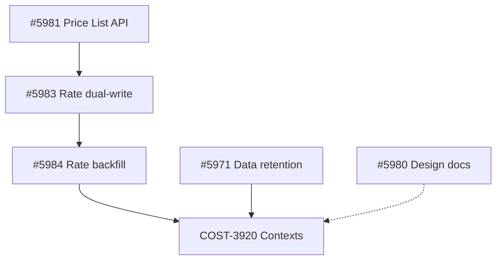
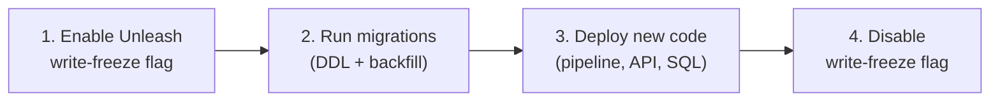

# Dependency Analysis — COST-3920

**Parent**: [README.md](README.md) · **Status**: Design Proposal

Analysis of in-flight PRs that overlap with COST-3920, their merge
ordering, and proposed deployment sequence.

---

## In-Flight PRs

### PR #5981 — COST-575 Price List API + Accessor

**Status**: Open
**Overlap**: Modifies `CostModelDBAccessor` (read path),
`CostModelManager` (create/update), `CostModelSerializer`.
COST-3920 builds on the same files.
**Impact**: Must merge first. COST-3920 migrations will depend on
the `PriceList` + `Rate` models introduced here.

### PR #5983 — COST-7249 Rate Table Dual-Write

**Status**: Open (depends on #5981)
**Overlap**: Adds `COST_MODEL_WRITE_FREEZE_FLAG` and
`_check_write_freeze()` on `CostModelSerializer`. **This establishes
the write-freeze pattern that COST-3920 proposes to follow** with
a dedicated flag for context writes.
**Impact**: Must merge before COST-3920. Provides the Unleash flag
precedent and migration numbering baseline for `cost_models`.

### PR #5984 — COST-7249 Rate Backfill Migration

**Status**: Open (depends on #5983)
**Overlap**: Data migration on `cost_models` app. COST-3920 migrations
must follow in sequence.
**Impact**: Last hard prerequisite. COST-3920 runs `makemigrations`
against clean main after this merges.

### PR #5980 — COST-7249/575 Design Docs

**Status**: Open
**Overlap**: None (documentation only).
**Impact**: Can merge anytime.

### PR #5971 — COST-573 Data Retention

**Status**: Open
**Overlap**: Adds `TenantSettings` model and retention pipeline
changes. Low overlap with cost model context, but retention must
account for context-scoped data in the future.
**Impact**: Preferred before COST-3920 but not a hard blocker.

---

## Merge Ordering

### Recommended sequence

### Critical path

`#5981` → `#5983` → `#5984` → **COST-3920**

This is the hard dependency chain. #5971 is preferred before
COST-3920 but can run in parallel if it stalls.

---

## COST-3920 Write-Freeze Flag

PR #5983 introduces `cost-management.backend.disable-cost-model-writes`
for rate table migration. COST-3920 proposes a **separate, dedicated**
flag: `cost-management.backend.disable-cost-model-context-writes`.

**Rationale**: The two flags have independent lifecycles. The rate
dual-write flag (#5983) will be disabled after rate migration completes.
The context write-freeze flag (COST-3920) will be enabled during
context migration and disabled afterward. Separate flags prevent
unintended interactions.

---

## COST-3920 Deployment Sequence

1. **Enable** `cost-management.backend.disable-cost-model-context-writes`
   (per-schema or global)
2. **Run migrations**: Phase 1 (cost_models 0012-0017) + Phase 2
   (reporting 0345-0348, including backfill)
3. **Deploy** Phase 3-5 code (pipeline, API, RBAC, write-freeze guards)
4. **Disable** the flag — context writes resume

**On-prem**: `MockUnleashClient` returns `False` for all flags.
Migrations-first deployment already prevents the race condition.

---

## Conflict Matrix

| PR | `cost_models/models.py` | `cost_models/serializers.py` | `masu/processor/__init__.py` | `masu/processor/tasks.py` | Migrations |
|----|------------------------|-----------------------------|-----------------------------|--------------------------|------------|
| #5981 | Yes (PriceList) | Yes (dual-write) | — | — | cost_models |
| #5983 | Yes (Rate) | Yes (write-freeze) | Yes (flag) | — | cost_models |
| #5984 | — | — | — | — | cost_models |
| #5971 | — | — | — | Yes (retention) | api |
| **COST-3920** | Yes (CostModelContext) | Yes (context serializer) | Yes (context flag) | Yes (context dispatch) | cost_models + reporting |

**Conflict zones**: `cost_models/serializers.py` and
`masu/processor/__init__.py` overlap with #5983. Resolve by rebasing
after #5983 merges.

---

## Risk Register (Dependency-Specific)

| ID | Risk | Mitigation |
|----|------|------------|
| D1 | Migration numbering collision | Run `makemigrations` against clean main after #5984 merges |
| D2 | Serializer merge conflicts with #5983 | Rebase after #5983; additive changes only |
| D3 | Write-freeze flag naming collision | Dedicated flag name distinct from #5983's flag |
| D4 | Predecessor PR stalls >2 weeks | Parallel-start: begin test-writing and design now; defer migrations until predecessors land |

---

## Changelog

| Version | Date | Summary |
|---------|------|---------|
| v1.0 | 2026-04-08 | Initial dependency analysis |
| v2.0 | 2026-04-09 | Design proposal: added COST-3920 write-freeze flag, deployment sequence, conflict matrix, dependency risks |
