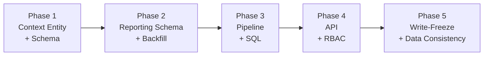
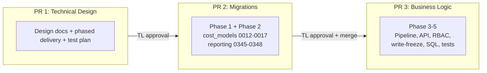
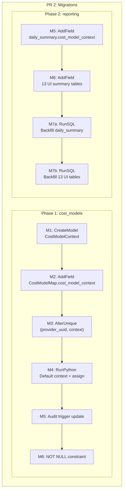

# Phased Delivery Plan

This document maps each proposed phase to specific code artifacts,
defines validation criteria, rollback strategies, and deployment
sequencing for the consumer-provider cost models feature.

**Parent**: [README.md](README.md) · **Status**: Design Proposal

---

## Decisions Pending Tech Lead Review

See [README.md § Decisions Needed from Tech Lead](./README.md#decisions-needed-from-tech-lead)
for full context.

| Decision | Status | Impact on this plan |
|----------|--------|-------------------|
| **DQ-1**: Migration strategy (nullable + backfill) | Pending | Phase 1-2 migration design depends on this |
| **DQ-2**: Write-freeze Unleash flag | Pending | Phase 5 artifacts + deployment runbook |
| **DQ-3**: RBAC scope (Koku-side v1) | Pending | Phase 4 permission design |
| **DQ-4**: Pipeline dispatch strategy | Pending | Phase 3 task orchestration |

---

## Phase Overview



| Phase | Goal | User-Facing? | Migrations | Rollback Strategy |
|-------|------|-------------|------------|-------------------|
| 1 | Context entity, assignment schema, data migration | No | cost_models 0012-0017 | Reverse migrations; remove CostModelContext rows |
| 2 | Context column on reporting tables + backfill | No | reporting 0345-0348 | Reverse migrations; column drops to NULL |
| 3 | Per-context pipeline execution + SQL scoping | No | None | Revert code; pipeline falls back to single-context |
| 4 | API parameter, RBAC, report filtering | Yes | None | Unregister URL route; remove query param |
| 5 | Write-freeze guards for migration consistency | No | None | Disable Unleash flag; guards become no-op |

---

## PR Structure



| PR | Contents | Branch | Gate |
|----|----------|--------|------|
| **PR 1** (this document) | Design docs only (`docs/architecture/consumer-provider-cost-models/`) | `COST-3920/consumer-provider-cost-models-docs` | TL approval |
| **PR 2** | All Django migrations (Phase 1 + Phase 2) | `COST-3920/consumer-provider-cost-models-migrations` | TL approval; CI green; backward-compatible |
| **PR 3** | Pipeline, API, RBAC, write-freeze, SQL templates, all tests | `COST-3920/consumer-provider-cost-models` | PR 2 merged; full regression suite green |

**TL requirement**: Migrations are separated from business logic.
Migrations deploy first and can be independently reverted if business
logic has issues. This is why Phase 1-2 (schema) are in PR 2 and
Phase 3-5 (code) are in PR 3.

---

## Phase 1: Context Entity + Schema

**Goal**: Introduce the `CostModelContext` model and modify
`CostModelMap` to support per-context assignment. No pipeline or API
changes — existing behavior unchanged.

### Proposed Artifacts

| Artifact | File | Description |
|----------|------|-------------|
| `CostModelContext` model | `cost_models/models.py` | UUID PK, `name`, `display_name`, `is_default`, `position` |
| Migration M1 | `cost_models/migrations/0012_create_cost_model_context.py` | CreateModel with partial unique index on `is_default=TRUE` |
| Migration M2 | `cost_models/migrations/0013_add_context_to_cost_model_map.py` | AddField: nullable FK `cost_model_context` on CostModelMap |
| Migration M3 | `cost_models/migrations/0014_alter_unique_cost_model_map.py` | AlterUniqueTogether: `(provider_uuid, cost_model_context)` |
| Migration M4 | `cost_models/migrations/0015_create_default_context.py` | RunPython: create default "Consumer" context per tenant; assign all CostModelMap rows |
| Audit trigger | `cost_models/migrations/0016_update_audit_trigger.py` | Include context array in audit row |
| NOT NULL constraint | `cost_models/migrations/0017_set_context_not_null.py` | After M4 backfill, set FK NOT NULL |

### Validation Criteria

- `CostModelContext` table exists in all tenant schemas
- Exactly one row with `is_default=TRUE` per tenant
- All existing `CostModelMap` rows have `cost_model_context` set
- Existing API endpoints function unchanged (no regression)
- Migrations forward and reverse cleanly
- Audit trigger captures context on INSERT/UPDATE/DELETE

### Rollback

1. Reverse M17 → M12 in order
2. `CostModelContext` table dropped; `CostModelMap` reverts to
   original schema
3. No data loss — cost models and assignments remain intact (FK was
   additive)

---

## Phase 2: Reporting Schema + Backfill

**Goal**: Add `cost_model_context` column to the daily summary table
and all 13 UI summary tables. Backfill existing cost-model rows with
`'default'`.

### Proposed Artifacts

| Artifact | File | Description |
|----------|------|-------------|
| Migration M5 | `reporting/migrations/0345_add_context_to_daily_summary.py` | AddField: nullable `cost_model_context` on `reporting_ocpusagelineitem_daily_summary` |
| Migration M6 | `reporting/migrations/0346_add_context_to_ui_summary_tables.py` | AddField: nullable `cost_model_context` on all 13 `reporting_ocp_*_summary_p` tables |
| Migration M7a | `reporting/migrations/0347_backfill_context_daily_summary.py` | RunSQL: `SET cost_model_context = 'default' WHERE cost_model_rate_type IS NOT NULL AND cost_model_context IS NULL` |
| Migration M7b | `reporting/migrations/0348_backfill_context_ui_summary_tables.py` | RunSQL: same backfill on all 13 UI summary tables |

### Tables Modified

| # | Table |
|---|-------|
| 1 | `reporting_ocpusagelineitem_daily_summary` |
| 2 | `reporting_ocp_cost_summary_p` |
| 3 | `reporting_ocp_cost_summary_by_node_p` |
| 4 | `reporting_ocp_cost_summary_by_project_p` |
| 5 | `reporting_ocp_gpu_summary_p` |
| 6 | `reporting_ocp_network_summary_p` |
| 7 | `reporting_ocp_network_summary_by_node_p` |
| 8 | `reporting_ocp_network_summary_by_project_p` |
| 9 | `reporting_ocp_pod_summary_p` |
| 10 | `reporting_ocp_pod_summary_by_node_p` |
| 11 | `reporting_ocp_pod_summary_by_project_p` |
| 12 | `reporting_ocp_vm_summary_p` |
| 13 | `reporting_ocp_volume_summary_p` |
| 14 | `reporting_ocp_volume_summary_by_project_p` |

### Why Backfill is Necessary

The pipeline uses scoped DELETEs:
```sql
DELETE FROM reporting_ocpusagelineitem_daily_summary
 WHERE cost_model_context = {{cost_model_context}}
   AND cost_model_rate_type = {{rate_type}}
   AND ...
```

Without backfill, existing rows have `cost_model_context = NULL`.
The scoped DELETE (`WHERE cost_model_context = 'default'`) will not
match them. On the next pipeline run, new rows with `cost_model_context
= 'default'` are inserted alongside the NULL legacy rows — causing
**data duplication** in reports.

### Validation Criteria

- Column exists on all 14 tables across all tenant schemas
- All rows with `cost_model_rate_type IS NOT NULL` have
  `cost_model_context = 'default'`
- Cloud/usage rows (`cost_model_rate_type IS NULL`) remain NULL
- Migrations forward and reverse cleanly
- Existing pipeline runs produce identical results (no regression)

### Rollback

1. Reverse M7b, M7a → backfilled values set back to NULL
2. Reverse M6, M5 → columns dropped
3. No data loss — cost data in existing columns is unchanged

---

## Phase 3: Pipeline + SQL

**Goal**: Enable per-context pipeline execution. Thread
`cost_model_context` through the full pipeline stack and into all
SQL templates.

### Proposed Artifacts

| Artifact | File(s) | Description |
|----------|---------|-------------|
| Task dispatch | `masu/processor/tasks.py` | `update_cost_model_costs` dispatches per-context Celery tasks |
| Accessor update | `masu/database/cost_model_db_accessor.py` | Optional `cost_model_context` parameter; filters CostModelMap by context FK |
| Updater chain | `masu/processor/cost_model_cost_updater.py`, `masu/processor/ocp/ocp_cost_model_cost_updater.py` | Thread `cost_model_context` to all accessor calls |
| SQL templates (49 files) | `masu/database/sql/openshift/cost_model/`, `self_hosted_sql/`, `trino_sql/`, `ui_summary/` | Add `{{cost_model_context}}` to DELETE WHERE, INSERT columns, GROUP BY |
| Distribution | `masu/database/sql/openshift/cost_model/distribute_cost/` | Context parameter in platform/worker/GPU distribution SQL |
| Cache key | `masu/processor/tasks.py` | Include `cost_model_context` in worker cache key |

### SQL Modification Pattern

Every cost model SQL file follows the same transformation:

**DELETE** (existing rows for this context):
```sql
-- Before:
DELETE FROM {{schema}}.reporting_ocpusagelineitem_daily_summary
 WHERE cost_model_rate_type = {{rate_type}} AND ...

-- After:
DELETE FROM {{schema}}.reporting_ocpusagelineitem_daily_summary
 WHERE cost_model_rate_type = {{rate_type}}
   AND cost_model_context = {{cost_model_context}}
   AND ...
```

**INSERT** (new context-tagged rows):
```sql
-- Before:
INSERT INTO {{schema}}.reporting_ocpusagelineitem_daily_summary (
    ..., cost_model_rate_type, ...
) SELECT ...

-- After:
INSERT INTO {{schema}}.reporting_ocpusagelineitem_daily_summary (
    ..., cost_model_rate_type, cost_model_context, ...
) SELECT ..., {{cost_model_context}}, ...
```

**UI Summary GROUP BY**:
```sql
-- Before:
GROUP BY usage_start, cluster_id, ..., cost_model_rate_type

-- After:
GROUP BY usage_start, cluster_id, ..., cost_model_rate_type, cost_model_context
```

### Files to Modify (49 SQL artifacts)

- 16 standard cost model SQL files
- 9 self-hosted cost model SQL files
- 9 Trino cost model SQL files
- 13 standard UI summary SQL files
- 2 UI summary usage-only variants (self-hosted + Trino)

### Validation Criteria

- Pipeline produces correct cost values per context
- Running pipeline for context A does not delete context B's rows
- Cloud/usage rows unaffected
- Worker cache keys prevent dedup collisions across contexts
- All SQL template tests pass for all 3 SQL paths

### Rollback

1. Revert Python code → pipeline ignores `cost_model_context`
2. Revert SQL templates → `cost_model_context` no longer in WHERE/INSERT/GROUP BY
3. Pipeline falls back to single-context behavior (reads first cost model)
4. Backfilled data in reporting tables remains but is harmless (unused column)

---

## Phase 4: API + RBAC

**Goal**: Expose `cost_model_context` as a query parameter on OCP
report endpoints and enforce context-aware access control.

### Proposed Artifacts

| Artifact | File | Description |
|----------|------|-------------|
| `CostModelContextSerializer` | `cost_models/serializers.py` | CRUD serializer for CostModelContext |
| `CostModelContextViewSet` | `cost_models/views.py` | ModelViewSet at `/api/v1/cost-model-contexts/` |
| `OCPQueryParamSerializer` | `api/report/ocp/serializers.py` | Add optional `cost_model_context` field |
| `OCPReportQueryHandler` | `api/report/ocp/query_handler.py` | Pass context to provider_map; add ORM filter |
| `CostModelContextPermission` | `api/common/permissions/cost_model_context_access.py` | Koku-side auth: subclasses CostModelsAccessPermission |
| URL registration | `cost_models/urls.py` | Register context viewset |

### API Contract

```
GET /api/v1/reports/openshift/costs/?cost_model_context=consumer
→ Returns cost data for context "consumer" only

GET /api/v1/reports/openshift/costs/
→ Returns all cost data (backward-compatible, no context filter)

GET /api/v1/cost-model-contexts/
→ Returns list of contexts for the tenant

POST /api/v1/cost-model-contexts/
→ Creates a new context (max 3)

PUT /api/v1/cost-model-contexts/{uuid}/
→ Updates a context

DELETE /api/v1/cost-model-contexts/{uuid}/
→ Deletes a non-default context
```

### RBAC Design

`CostModelContextPermission` only activates when `cost_model_context`
is explicitly in query params. When absent, standard OCP report
permissions apply. This prevents 403 errors on existing API clients
that do not send the parameter.

### Validation Criteria

- `cost_model_context=X` filters report data correctly
- Absence of parameter returns all data (no regression)
- RBAC denies access when user lacks `cost_model.read`
- Admin bypass works for ENHANCED_ORG_ADMIN
- Context CRUD API works (create, read, update, delete)
- Default context cannot be deleted
- Max 3 contexts enforced

### Rollback

1. Unregister context URL route
2. Revert serializer/query handler → parameter ignored
3. Revert permission class → no context check
4. Existing API behavior restored

---

## Phase 5: Write-Freeze + Data Consistency

**Goal**: Provide migration-time data consistency guarantees using
an Unleash feature flag that blocks context mutations during the
migration window.

### Proposed Artifacts

| Artifact | File | Description |
|----------|------|-------------|
| Unleash flag constant | `masu/processor/__init__.py` | `COST_MODEL_CONTEXT_WRITE_FREEZE_FLAG` |
| Helper function | `masu/processor/__init__.py` | `is_context_writes_disabled(schema)` |
| Serializer guard | `cost_models/serializers.py` | `_check_context_write_freeze()` on create/update |
| Pipeline guard | `masu/processor/tasks.py` | Skip context-tagged writes when flag active |

### Behavior Matrix

| Operation | Flag Enabled | Flag Disabled |
|-----------|-------------|---------------|
| Context create (POST) | **400 Bad Request** | Normal |
| Context update (PUT) | **400 Bad Request** | Normal |
| Context read (GET/list) | Normal | Normal |
| Pipeline (context=X) | **Skipped** (logged) | Normal |
| Pipeline (context=None) | Normal (legacy path) | Normal |

### On-Prem Behavior

`MockUnleashClient.is_enabled()` returns `False` for all flags.
The write-freeze guard is a no-op on on-prem deployments. This is
correct because on-prem deployments run migrations before code,
eliminating the race condition the flag guards against.

### Validation Criteria

- Flag active → context create/update returns 400
- Flag active → pipeline skips context-tagged writes
- Flag active → reads succeed
- Flag disabled → all operations succeed
- On-prem → flag never activates

### Rollback

Disable the Unleash flag. All guards become no-op. No code revert needed.

---

## Deployment Runbook

### SaaS Deployment

```
Step 1: Enable Unleash flag
        Flag: cost-management.backend.disable-cost-model-context-writes
        Scope: All schemas (or per-schema for staged rollout)
        Effect: Blocks context mutations + context-tagged pipeline writes
        Reads remain open.

Step 2: Deploy PR 2 (migrations)
        Runs: cost_models M1-M6 (DDL + data migration)
              reporting M5-M7b (DDL + backfill)
        Verify: Default context exists per tenant
                All CostModelMap rows have context assigned
                All reporting rows backfilled

Step 3: Deploy PR 3 (business logic)
        Runs: Pipeline, API, RBAC, write-freeze guards, SQL templates
        Verify: API responds (context CRUD returns 400 due to freeze)
                Pipeline skips context-tagged writes (logged)

Step 4: Disable Unleash flag
        Effect: Context mutations resume
                Pipeline processes per-context cost calculations
        Verify: Context CRUD succeeds
                Pipeline runs per-context
                Report API returns context-filtered data

Step 5: Monitor
        Watch: Pipeline logs for context dispatch
               Report data for duplicates
               Error rates on context endpoints
```

### On-Prem Deployment

On-prem deployments use `MockUnleashClient` (all flags return `False`).
The write-freeze is a no-op.

```
Step 1: Deploy PR 2 (migrations)
        Migrations run before application code starts.
        DDL + backfill complete before any pipeline or API traffic.

Step 2: Deploy PR 3 (business logic)
        Pipeline starts with context-aware SQL immediately.
        No race condition because migrations completed in Step 1.

Step 3: Verify
        Context CRUD works
        Pipeline runs per-context
        Report API returns context-filtered data
```

---

## Migration Dependency Chain



---

## Changelog

| Version | Date | Summary |
|---------|------|---------|
| v1.0 | 2026-04-09 | Initial phased delivery plan: 5 phases, 3 PRs, deployment runbook, write-freeze strategy, migration dependency chain |
