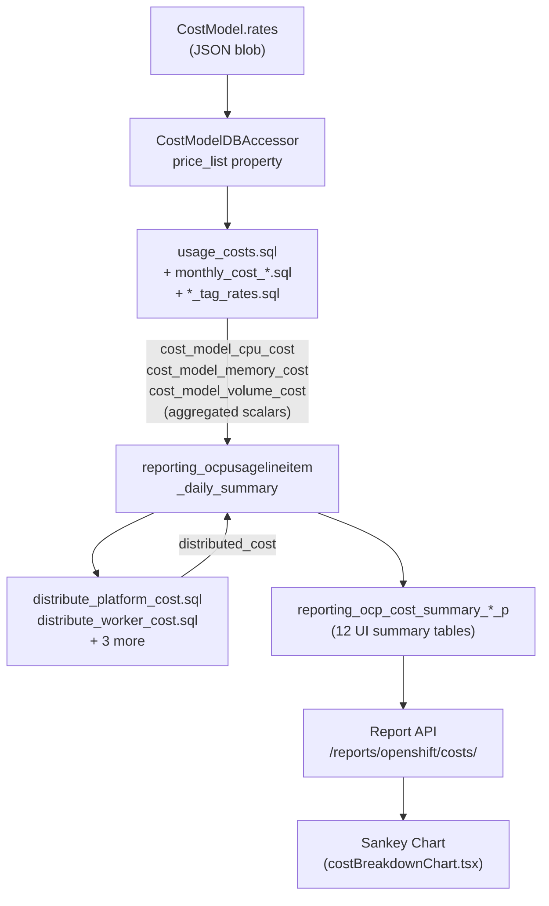
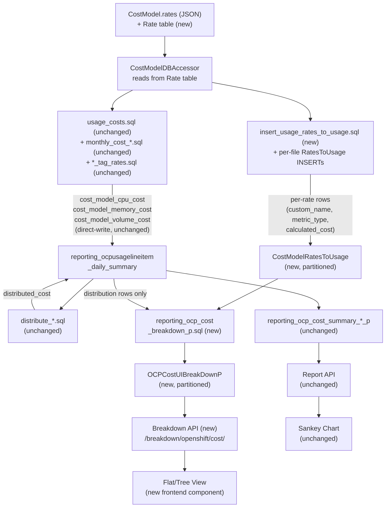

# Cost Breakdown for OpenShift Price List Costs

Technical design for per-rate cost breakdowns in the OpenShift cost
management pipeline, enabling users to see itemized costs (e.g.,
"OpenShift Subscriptions," "GuestOS Subscriptions," "Operation") instead
of aggregated totals.

**Jira Epic**: [COST-7249](https://redhat.atlassian.net/browse/COST-7249)
**Related Epics**: [COST-2105](https://redhat.atlassian.net/browse/COST-2105) (custom rates), [COST-4415](https://redhat.atlassian.net/browse/COST-4415) (cloud services)
**PRD**: [PRD04 — Cost Breakdown](https://docs.google.com/document/d/1wWdrYuhNpiJPMgVdJzS6yTvCKxRZ1g5j6CLzLJjASHA/edit?tab=t.0#heading=h.sdhov05ddhog)

**Prerequisite reading**: [cost-models.md](../cost-models.md) — describes
the current cost model architecture, rate types, distribution, and data
model that this feature extends.

---

## Decisions Needed from Tech Lead

Three design decisions require tech lead confirmation before
implementation proceeds past Phase 1. Each has a concrete proposal
backed by source code analysis and proof-of-concept artifacts.

| # | Decision | Blocking Phase | Proposal | PoC Artifact |
|---|----------|---------------|----------|--------------|
| **IQ-1** | Drop the aggregation step? Keep daily summary direct-write; use RatesToUsage only for breakdown table. | Phase 2 | [Details](#iq-1-aggregation-granularity-mismatch-phase-2-3) | [`poc/insert_usage_rates_to_usage.sql`](./poc/insert_usage_rates_to_usage.sql) demonstrates the coarser GROUP BY |
| **IQ-3** | Flat-row API or nested response? Standard koku flat rows with `path`/`parent_path` vs pre-built tree. | Phase 4 | [Details](#iq-3-breakdown-api-response-format-phase-4) | [`poc/reporting_ocp_cost_breakdown_p.sql`](./poc/reporting_ocp_cost_breakdown_p.sql) produces flat rows with path columns |
| **IQ-7** | `custom_name` optional with auto-generation? Or formal API version bump? | Phase 1 | [Details](#iq-7-backward-compatibility-for-custom_name-phase-1) | [`poc/price_list_compat.py`](./poc/price_list_compat.py) validates backward-compatible format |

Two additional low-risk proposals (IQ-6: remove speculative date fields;
IQ-8: nullable `cost_type` for distribution rows) can be confirmed
during the review without blocking.

### What the spikes resolved

Four proof-of-concept spikes were completed to reduce technical risk.
All artifacts are in [`poc/`](./poc/):

| Spike | Risk eliminated | Artifact |
|-------|----------------|----------|
| CTE + UNION ALL for RatesToUsage INSERT | IQ-2 (distribution-dependent `metric_type`), IQ-5 (SQL approach) | [`poc/insert_usage_rates_to_usage.sql`](./poc/insert_usage_rates_to_usage.sql) |
| `build_path()` CASE/WHEN SQL | IQ-4 (placeholder functions) | [`poc/reporting_ocp_cost_breakdown_p.sql`](./poc/reporting_ocp_cost_breakdown_p.sql) |
| Row-count estimation query | R3 (row explosion sizing) | [`poc/estimate_rates_to_usage_rows.sql`](./poc/estimate_rates_to_usage_rows.sql) |
| `_price_list_from_rate_table()` format compatibility | Phase 1 read-path risk | [`poc/price_list_compat.py`](./poc/price_list_compat.py) — 6/6 tests pass |

### Residual risks (cannot mitigate further before implementation)

- **R6**: 25 SQL file modifications — inherent volume, mitigated by
  per-file regression tests
- **R10**: Trino dialect edge cases — requires Trino-enabled dev
  environment in Phase 3
- **Phase 4 frontend accuracy**: `koku-ui` may change before Phase 4

---

## Open Questions — All Resolved

Previously blockers for Phase 2. All four have been resolved via source
code triage.

### OQ-1: How do the 6 CPU cost components map to named rates? — RESOLVED

Each component maps 1:1 to a distinct user-configurable rate metric in
`COST_MODEL_USAGE_RATES` (`api/metrics/constants.py`). Components 4-6
**are** independent rates — they are separate entries the user sets in
the cost model, not derived from other rates.

| # | Component | Rate metric | `metric_type` |
|---|-----------|-------------|---------------|
| 1 | Pod CPU usage | `cpu_core_usage_per_hour` | cpu |
| 2 | Pod CPU request | `cpu_core_request_per_hour` | cpu |
| 3 | Pod CPU effective usage | `cpu_core_effective_usage_per_hour` | cpu |
| 4 | Node core allocation | `node_core_cost_per_hour` | cpu |
| 5 | Cluster core allocation | `cluster_core_cost_per_hour` | cpu |
| 6 | Cluster hourly (via CTE) | `cluster_cost_per_hour` | cpu |

Memory has 4 rates (3 direct + cluster CTE), volume has 2 rates.
**Total: 12 `RatesToUsage` rows per daily summary row** when all rates
are configured. Rates set to 0 produce rows with `calculated_cost = 0`
(they can be excluded from the breakdown UI).

**SQL approach**: One CTE computes all 12 component expressions from
the same GROUP BY, then 12 INSERTs into `RatesToUsage` select one
component each. This avoids duplicating the base aggregation.

See [sql-pipeline.md § How usage_costs.sql Works Today](./sql-pipeline.md#how-usage_costssql-works-today) for the full SQL analysis.

### OQ-2: How do monthly cost rates map to `RatesToUsage` rows? — RESOLVED

`monthly_cost_cluster_and_node.sql` uses this GROUP BY:

```
GROUP BY usage_start, source_uuid, cluster_id, node, namespace,
         pod_labels, cost_category_id
```

This is **finer** than one row per `(namespace, node, usage_start)` —
`pod_labels` and `cost_category_id` can vary within the same namespace
on the same node. There are 6 monthly cost types in
`MONTHLY_COST_RATE_MAP`: Node, Node_Core_Month, Cluster, PVC, OCP_VM,
OCP_VM_CORE.

**Row count per monthly rate per month** =
`N_days × N_distinct(cluster, node, namespace, pod_labels, cost_category)`.

For `RatesToUsage`, each such row becomes one `RatesToUsage` INSERT.
The `monthly_cost_type` column (`Node`, `Cluster`, `PVC`, etc.)
serves as the `custom_name` for monthly rates.

**Rate selection**: The updater checks `_infra_rates` first, then
`_supplementary_rates`. A given monthly rate is either Infrastructure
**or** Supplementary (never both) per cost model.

### OQ-3: Aggregation validation strategy — RESOLVED

**Recommendation: Option C (regression tests).**

Source code triage confirmed that koku has **no existing infrastructure**
for dual-path or shadow-mode SQL comparison. The closest pattern is
`DataValidator` in `masu/processor/_tasks/data_validation.py`, which
validates raw usage data sums — a different concern.

Building a dual-write framework (Option A/B) would add significant
complexity for a one-time migration check. Instead:

1. **Phase 2 validation query** (`validate_rates_against_daily_summary.sql`)
   runs as a read-only `SELECT` comparing `SUM(RatesToUsage.calculated_cost)`
   against the existing daily summary `cost_model_*_cost` columns, per
   provider, per day. See [sql-pipeline.md](./sql-pipeline.md).
2. **Regression tests** with known-good cost model configurations verify
   that the aggregation step reproduces identical scalars.
3. **CI gate**: the validation query runs in integration tests before
   the aggregation path is promoted to production in Phase 3.

### OQ-4: Cost category reclassification and breakdown tree — RESOLVED

**No special handling needed.** Source code confirms that reclassification
already triggers full recomputation.

`CostGroupsAddView` and `CostGroupsRemoveView` (in
`api/settings/cost_groups/view.py`) both call `_summarize_current_month()`,
which enqueues `update_summary_tables` for each affected provider. This
task chains into `update_cost_model_costs`, which re-runs the full cost
model pipeline including UI summary population.

Since `OCPCostUIBreakDownP` population will be wired into the same
summary update chain (Phase 4), any cost category reclassification will
automatically repopulate the breakdown table for the current month.
No additional trigger is required.

---

## Implementation Questions + Proposals

These were identified during a final critical review. Each represents
a design gap or assumption. For each, we propose a solution based on
koku's existing architecture and patterns. The tech lead should confirm
or override these proposals.

### IQ-1: Aggregation granularity mismatch (Phase 2-3)

**Problem**: `usage_costs.sql` groups by `(pod_labels, volume_labels,
persistentvolumeclaim, cost_category_id)` — each distinct combination
gets its own daily summary row with its own costs. But
`CostModelRatesToUsage` does not have those columns. The aggregation
UPDATE (`aggregate_rates_to_daily_summary.sql`) joins at a coarser
grain and would overwrite individually correct per-row costs with a
single summed total.

**Proposal: Option B — drop the aggregation step.**

Koku's data flow is strictly one-directional: daily summary → derived
tables (UI summaries). There is no existing case where a derived table
writes back to the daily summary. Source code confirms all 12 UI
summary SQL files follow the same DELETE + INSERT FROM daily_summary
pattern (`populate_ui_summary_tables()`). Introducing a reverse flow
(RatesToUsage → daily summary) would be a new anti-pattern.

Instead: keep the direct-write path to the daily summary permanently
(unchanged). Use `RatesToUsage` exclusively to feed
`OCPCostUIBreakDownP` for the breakdown API. This means:

- `aggregate_rates_to_daily_summary.sql` is **removed** from the design
- `validate_rates_against_daily_summary.sql` becomes a **test-only**
  check (CI, not runtime)
- `RatesToUsage` stores per-rate costs at (namespace, node, day)
  granularity — it does not need `pod_labels`/`persistentvolumeclaim`
- The orchestration steps 4.5 and the Phase 3 "aggregation promotion"
  are removed
- Phase 5 no longer needs to "replace the direct-write path"

This simplifies the design, eliminates R2 (aggregation mismatch) as a
risk, and aligns with koku's established architecture.

### IQ-2: `cluster_cost_per_hour` metric_type is distribution-dependent (Phase 2)

**Problem**: `cluster_cost_per_hour` contributes to
`cost_model_cpu_cost` when `distribution = 'cpu'` but to
`cost_model_memory_cost` when `distribution = 'memory'`.

**Proposal: Set `metric_type` dynamically in the SQL.**

`usage_costs.sql` already uses ``
Jinja2 conditionals for this exact rate in the `cte_node_cost` CTE.
The `RatesToUsage` INSERT should use the same pattern:

```sql

'cpu' AS metric_type,

'memory' AS metric_type,

```

`node_core_cost_per_hour` and `cluster_core_cost_per_hour` (components
4-5) always contribute to `cost_model_cpu_cost` regardless of
distribution (verified in source), so their `metric_type` is always
`'cpu'`. Only `cluster_cost_per_hour` (component 6) needs the dynamic
conditional.

### IQ-3: Breakdown API response format (Phase 4)

**Problem**: The nested `breakdown` array format doesn't match koku's
standard query handler output.

**Proposal: Use the standard flat-row format.**

`OCPReportQueryHandler.execute_query()` returns `{data: [date buckets
with grouped values], total: {...}}`. Every existing OCP report
follows this convention — flat annotated rows, grouped by date and
`group_by` parameters.

The breakdown endpoint should follow the same pattern: each breakdown
entry is a flat row in `data`, with `path`, `depth`, `parent_path`,
`custom_name`, `cost_value`, etc. as columns. The frontend builds the
tree from `path`/`parent_path` client-side, the same way the Sankey
chart builds its visualization from flat cost data.

This avoids a custom query handler and keeps the API consistent with
all other koku report endpoints.

### IQ-4: `build_path()` logic (Phase 4)

**Problem**: Placeholder functions, not actual SQL.

**Proposal: CASE/WHEN expressions in the INSERT...SELECT.**

This follows the same pattern used by distribution SQL files (which
determine cost_model_rate_type via CASE) and UI summary SQL files.

```sql
-- top_category
CASE
    WHEN r.cost_category_id IS NULL THEN 'project'
    WHEN cc.name = 'Platform' THEN 'overhead'
    ELSE 'project'
END AS top_category,

-- breakdown_category
CASE
    WHEN r.metric_type = 'markup' THEN 'markup'
    WHEN r.metric_type IN ('cpu', 'memory', 'storage', 'gpu') THEN 'usage_cost'
    ELSE 'usage_cost'
END AS breakdown_category,

-- path (depth 4 for per-rate rows)
CASE
    WHEN r.cost_category_id IS NULL OR cc.name != 'Platform'
    THEN 'project.' ||
         CASE WHEN r.metric_type = 'markup' THEN 'markup'
              ELSE 'usage_cost' END ||
         '.' || r.custom_name
    ELSE 'overhead.' ||
         CASE WHEN r.metric_type = 'markup' THEN 'markup'
              ELSE 'usage_cost' END ||
         '.' || r.custom_name
END AS path,

-- depth: always 4 for leaf per-rate rows
4 AS depth,

-- parent_path
CASE
    WHEN r.cost_category_id IS NULL OR cc.name != 'Platform'
    THEN 'project.' ||
         CASE WHEN r.metric_type = 'markup' THEN 'markup'
              ELSE 'usage_cost' END
    ELSE 'overhead.' ||
         CASE WHEN r.metric_type = 'markup' THEN 'markup'
              ELSE 'usage_cost' END
END AS parent_path
```

Intermediate tree nodes (depth 1-3: `total_cost`, `project`,
`project.usage_cost`) are aggregated from leaf rows using a separate
INSERT with `GROUP BY top_category, breakdown_category` and
`SUM(cost_value)`.

### IQ-5: SQL approach for RatesToUsage INSERTs (Phase 2)

**Problem**: 12 rate-component INSERTs need a home.

**Proposal: Separate SQL file with CTE + single INSERT using UNION ALL.**

New file: `sql/openshift/cost_model/insert_usage_rates_to_usage.sql`,
called by a new accessor method after `populate_usage_costs()`.

```sql
WITH base AS (
    SELECT
        usage_start, cluster_id, node, namespace, data_source,
        cost_category_id, source_uuid, report_period_id, cluster_alias,
        sum(pod_usage_cpu_core_hours) AS cpu_usage_hours,
        sum(pod_request_cpu_core_hours) AS cpu_request_hours,
        ...
    FROM {{schema | sqlsafe}}.reporting_ocpusagelineitem_daily_summary
    WHERE ...
    GROUP BY usage_start, cluster_id, node, namespace, data_source,
             cost_category_id, source_uuid, report_period_id, cluster_alias
)
INSERT INTO {{schema | sqlsafe}}.cost_model_rates_to_usage (...)
SELECT ... 'cpu_core_usage_per_hour', 'cpu', cpu_usage_hours * {{cpu_core_usage_per_hour}}, ...
FROM base WHERE {{cpu_core_usage_per_hour}} != 0
UNION ALL
SELECT ... 'cpu_core_request_per_hour', 'cpu', cpu_request_hours * {{cpu_core_request_per_hour}}, ...
FROM base WHERE {{cpu_core_request_per_hour}} != 0
UNION ALL
...
```

This is a single SQL statement (CTE + INSERT with UNION ALL), so it
works with `_prepare_and_execute_raw_sql_query`. The `WHERE rate != 0`
clauses skip zero-rate components, avoiding unnecessary rows.
`UNION ALL` with a CTE exists as a pattern in koku
(`ocp_tag_mapping_update_daily_summary.sql`).

Note: the CTE GROUP BY is **coarser** than `usage_costs.sql` (no
`pod_labels`/`persistentvolumeclaim`). This is correct because
`RatesToUsage` is a derived table for the breakdown API, not a mirror
of the daily summary (see IQ-1).

### IQ-6: `PriceList.usage_start/usage_end` (Phase 1)

**Problem**: Speculative fields not in the PRD.

**Proposal: Remove them.**

Koku's existing models are minimal. `CostModel` has no date-bounding
on rates. Adding speculative fields contradicts the YAGNI principle.
If time-bounded pricing is needed later, the columns can be added in a
future migration with no impact on existing data.

### IQ-7: Backward compatibility for `custom_name` (Phase 1)

**Problem**: Adding `custom_name` as required breaks existing API
consumers.

**Proposal: `required=False` with auto-generation.**

Koku's `RateSerializer` already has `description` as `required=False`.
Apply the same pattern to `custom_name`:

```python
custom_name = serializers.CharField(max_length=50, required=False, allow_blank=True)
```

If not provided, auto-generate from `description` or `metric.name`
using the same `generate_custom_name()` logic from migration M3. This
is backward compatible — existing API consumers work without changes,
and new consumers can set meaningful names.

### IQ-8: `cost_type` on `OCPCostUIBreakDownP` (Phase 4)

**Problem**: `cost_type` is ambiguous for distribution rows.

**Proposal: Make `cost_type` nullable.**

Distribution rows on the daily summary use `cost_model_rate_type`
(`platform_distributed`, `worker_distributed`, etc.) as the sole
identifier — there is no separate cost_type field on those rows.
Follow the same pattern on `OCPCostUIBreakDownP`:

- Per-rate rows: `cost_type = "Infrastructure"` or `"Supplementary"`
- Distribution rows: `cost_type = NULL`

The API can derive a display label from `cost_model_rate_type` when
`cost_type` is NULL. This avoids inventing semantics that don't exist
in the source data.

---

## Quick Start

| Your goal | Start here |
|-----------|------------|
| Understand the new database tables and migration | [data-model.md](./data-model.md) |
| Understand SQL pipeline changes and per-rate write strategy | [sql-pipeline.md](./sql-pipeline.md) |
| Understand API and frontend integration points | [api-and-frontend.md](./api-and-frontend.md) |
| Understand the phased delivery plan and risks | [phased-delivery.md](./phased-delivery.md) |

---

## Reading Order

### For the reviewing engineer

1. This README (open questions first)
2. [data-model.md](./data-model.md) — new tables, schema, migration
3. [sql-pipeline.md](./sql-pipeline.md) — how per-rate data flows through the SQL pipeline
4. [phased-delivery.md](./phased-delivery.md) — what ships when, rollback strategy

### For frontend engineers

1. [api-and-frontend.md](./api-and-frontend.md) — new endpoint, response format, component plan

---

## Document Catalog

| Document | Type | Summary |
|----------|------|---------|
| [data-model.md](./data-model.md) | DD | New Django models (`PriceList`, `Rate`, `CostModelRatesToUsage`, `OCPCostUIBreakDownP`), `custom_name` migration strategy, tree structure definition |
| [sql-pipeline.md](./sql-pipeline.md) | DD | Current vs proposed data flow, SQL file inventory (20+ files across 3 paths), `CostModelDBAccessor` changes, aggregation step design |
| [api-and-frontend.md](./api-and-frontend.md) | DD | Cost model API changes (`custom_name`, dual-write), new breakdown endpoint, frontend components, export integration |
| [phased-delivery.md](./phased-delivery.md) | DD | 5-phase plan with per-phase artifacts, validation criteria, rollback strategy, risk register |

---

## Architecture at a Glance

### Current Data Flow



### Proposed Data Flow (with IQ-1 proposal: no aggregation step)



The key insight: the existing pipeline (daily summary → distribution →
UI summary → report API → Sankey) is **completely unchanged**. Per-rate
identity flows through a **parallel path**: `RatesToUsage` →
`OCPCostUIBreakDownP` → breakdown API. There is no aggregation step
writing back from `RatesToUsage` to the daily summary — data flows
strictly one-directionally, matching koku's established architecture.

> **Pending IQ-1 confirmation**: If the tech lead prefers a single
> source of truth in `RatesToUsage`, the aggregation step can be
> restored, but it would require adding `pod_labels`, `volume_labels`,
> `persistentvolumeclaim` to `CostModelRatesToUsage` and redesigning
> the aggregation JOIN. See [IQ-1](#iq-1-aggregation-granularity-mismatch-phase-2-3).

---

## Key Design Decisions

| Decision | Resolution | Rationale |
|----------|-----------|-----------|
| Feature flags | None | Dual-write (JSON + Rate table) is the rollback mechanism; no Unleash flags |
| Distribution SQL changes | None | Distribution operates on aggregated daily summary columns, not per-rate data |
| Sankey chart changes | None | Sankey reads from existing report API which is unchanged |
| Rate table read path | Switched in Phase 1, permanent in Phase 5 | Dual-write preserves JSON for rollback |
