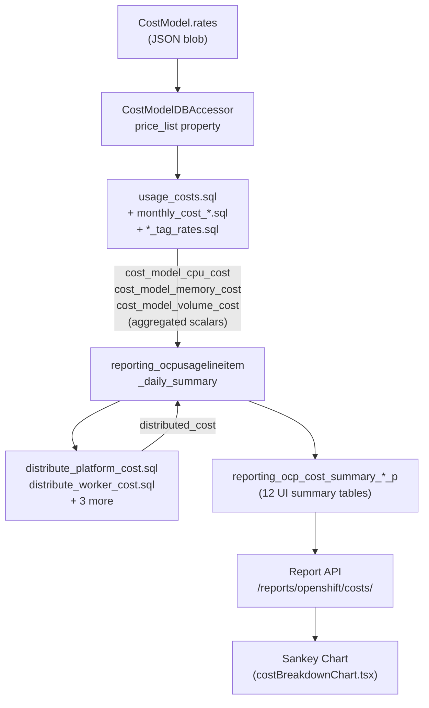
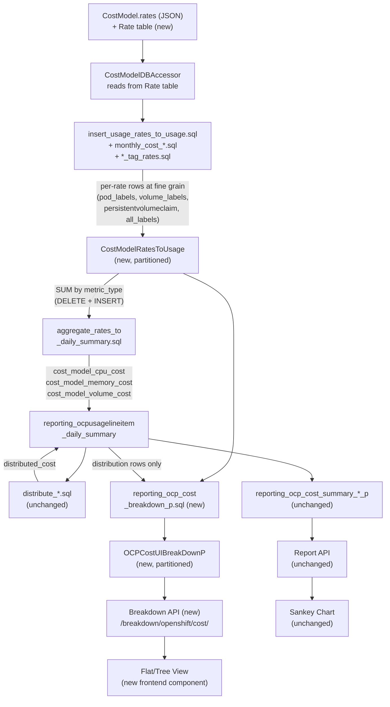

# Cost Breakdown for OpenShift Price List Costs

Technical design for per-rate cost breakdowns in the OpenShift cost
management pipeline, enabling users to see itemized costs (e.g.,
"OpenShift Subscriptions," "GuestOS Subscriptions," "Operation") instead
of aggregated totals.

**Jira Epic**: [COST-7249](https://redhat.atlassian.net/browse/COST-7249)
**Related Epics**: [COST-2105](https://redhat.atlassian.net/browse/COST-2105) (custom rates), [COST-4415](https://redhat.atlassian.net/browse/COST-4415) (cloud services)
**PRD**: [PRD04 — Cost Breakdown](https://docs.google.com/document/d/1wWdrYuhNpiJPMgVdJzS6yTvCKxRZ1g5j6CLzLJjASHA/edit?tab=t.0#heading=h.sdhov05ddhog)

**Prerequisite reading**: [cost-models.md](../cost-models.md) — describes
the current cost model architecture, rate types, distribution, and data
model that this feature extends.

---

## Decisions Needed from Tech Lead

Three key design decisions have been resolved by the tech lead.
IQ-1, IQ-3, and IQ-7 are confirmed.

| # | Decision | Status | Blocking Phase | Proposal | PoC Artifact |
|---|----------|--------|---------------|----------|--------------|
| **IQ-1** | Single source of truth: RatesToUsage with aggregation to daily summary. | **RESOLVED** | ~Phase 2~ | [Details](#iq-1-aggregation-granularity-mismatch-phase-2-3) | [`poc/insert_usage_rates_to_usage.sql`](./poc/insert_usage_rates_to_usage.sql) demonstrates fine-grained GROUP BY |
| **IQ-3** | Flat-row DB storage with both flat and nested API response formats. | **RESOLVED** | ~Phase 4~ | [Details](#iq-3-breakdown-api-response-format-phase-4) | [`poc/reporting_ocp_cost_breakdown_p.sql`](./poc/reporting_ocp_cost_breakdown_p.sql) produces flat rows with path columns |
| **IQ-7** | `custom_name` optional with auto-generation from `description` or `metric.name`. Backward compatible. | **RESOLVED** | ~Phase 1~ | [Details](#iq-7-backward-compatibility-for-custom_name-phase-1) | [`poc/price_list_compat.py`](./poc/price_list_compat.py) validates backward-compatible format |

One new design gap requires investigation:

| # | Decision | Status | Blocking Phase | Proposal | PoC Artifact |
|---|----------|--------|---------------|----------|--------------|
| **IQ-9** | Distribution per-rate identity: how to preserve per-rate breakdown for distributed costs. | Open | Phase 4 | [Details](#iq-9-distribution-per-rate-identity-gap) | [sql-pipeline.md § Back-Allocation SQL](./sql-pipeline.md#back-allocation-sql-sketch) |

Two additional low-risk proposals (IQ-6: remove speculative date fields;
IQ-8: nullable `cost_type` for distribution rows) can be confirmed
during the review without blocking.

### What the spikes resolved

Four proof-of-concept spikes were completed to reduce technical risk.
All artifacts are in [`poc/`](./poc/):

| Spike | Risk eliminated | Artifact |
|-------|----------------|----------|
| CTE + UNION ALL for RatesToUsage INSERT | IQ-2 (distribution-dependent `metric_type`), IQ-5 (SQL approach) | [`poc/insert_usage_rates_to_usage.sql`](./poc/insert_usage_rates_to_usage.sql) |
| `build_path()` CASE/WHEN SQL | IQ-4 (placeholder functions) | [`poc/reporting_ocp_cost_breakdown_p.sql`](./poc/reporting_ocp_cost_breakdown_p.sql) |
| Row-count estimation query | R3 (row explosion sizing) | [`poc/estimate_rates_to_usage_rows.sql`](./poc/estimate_rates_to_usage_rows.sql) |
| `_price_list_from_rate_table()` format compatibility | Phase 1 read-path risk | [`poc/price_list_compat.py`](./poc/price_list_compat.py) — 6/6 tests pass |

### Residual risks (cannot mitigate further before implementation)

- **R6**: 25 SQL file modifications — inherent volume, mitigated by
  per-file regression tests
- **R10**: Trino dialect edge cases — requires Trino-enabled dev
  environment in Phase 3
- **Phase 4 frontend accuracy**: `koku-ui` may change before Phase 4

---

## Open Questions — All Resolved

Previously blockers for Phase 2. All four have been resolved via source
code triage.

### OQ-1: How do the 6 CPU cost components map to named rates? — RESOLVED

Each component maps 1:1 to a distinct user-configurable rate metric in
`COST_MODEL_USAGE_RATES` (`api/metrics/constants.py`). Components 4-6
**are** independent rates — they are separate entries the user sets in
the cost model, not derived from other rates.

| # | Component | Rate metric | `metric_type` |
|---|-----------|-------------|---------------|
| 1 | Pod CPU usage | `cpu_core_usage_per_hour` | cpu |
| 2 | Pod CPU request | `cpu_core_request_per_hour` | cpu |
| 3 | Pod CPU effective usage | `cpu_core_effective_usage_per_hour` | cpu |
| 4 | Node core allocation | `node_core_cost_per_hour` | cpu |
| 5 | Cluster core allocation | `cluster_core_cost_per_hour` | cpu |
| 6 | Cluster hourly (via CTE) | `cluster_cost_per_hour` | cpu |

Memory has 4 rates (3 direct + cluster CTE), volume has 2 rates.
**Total: 12 `RatesToUsage` rows per daily summary row** when all rates
are configured. Rates set to 0 produce rows with `calculated_cost = 0`
(they can be excluded from the breakdown UI).

**SQL approach**: One CTE computes all 12 component expressions from
the same GROUP BY, then 12 INSERTs into `RatesToUsage` select one
component each. This avoids duplicating the base aggregation.

See [sql-pipeline.md § How usage_costs.sql Works Today](./sql-pipeline.md#how-usage_costssql-works-today) for the full SQL analysis.

### OQ-2: How do monthly cost rates map to `RatesToUsage` rows? — RESOLVED

`monthly_cost_cluster_and_node.sql` uses this GROUP BY:

```
GROUP BY usage_start, source_uuid, cluster_id, node, namespace,
         pod_labels, cost_category_id
```

This is **finer** than one row per `(namespace, node, usage_start)` —
`pod_labels` and `cost_category_id` can vary within the same namespace
on the same node. There are 6 monthly cost types in
`MONTHLY_COST_RATE_MAP`: Node, Node_Core_Month, Cluster, PVC, OCP_VM,
OCP_VM_CORE.

**Row count per monthly rate per month** =
`N_days × N_distinct(cluster, node, namespace, pod_labels, cost_category)`.

For `RatesToUsage`, each such row becomes one `RatesToUsage` INSERT.
The `monthly_cost_type` column (`Node`, `Cluster`, `PVC`, etc.)
serves as the `custom_name` for monthly rates.

**Rate selection**: The updater checks `_infra_rates` first, then
`_supplementary_rates`. A given monthly rate is either Infrastructure
**or** Supplementary (never both) per cost model.

### OQ-3: Aggregation validation strategy — RESOLVED

**Recommendation: Option C (regression tests).**

Source code triage confirmed that koku has **no existing infrastructure**
for dual-path or shadow-mode SQL comparison. The closest pattern is
`DataValidator` in `masu/processor/_tasks/data_validation.py`, which
validates raw usage data sums — a different concern.

Building a dual-write framework (Option A/B) would add significant
complexity for a one-time migration check. Instead:

1. **Phase 2 validation query** (`validate_rates_against_daily_summary.sql`)
   runs as a read-only `SELECT` comparing `SUM(RatesToUsage.calculated_cost)`
   against the existing daily summary `cost_model_*_cost` columns, per
   provider, per day. See [sql-pipeline.md](./sql-pipeline.md).
2. **Regression tests** with known-good cost model configurations verify
   that the aggregation step reproduces identical scalars.
3. **CI gate**: the validation query runs in integration tests to
   verify aggregation correctness.

### OQ-4: Cost category reclassification and breakdown tree — RESOLVED

**No special handling needed.** Source code confirms that reclassification
already triggers full recomputation.

`CostGroupsAddView` and `CostGroupsRemoveView` (in
`api/settings/cost_groups/view.py`) both call `_summarize_current_month()`,
which enqueues `update_summary_tables` for each affected provider. This
task chains into `update_cost_model_costs`, which re-runs the full cost
model pipeline including UI summary population.

Since `OCPCostUIBreakDownP` population will be wired into the same
summary update chain (Phase 4), any cost category reclassification will
automatically repopulate the breakdown table for the current month.
No additional trigger is required.

---

## Implementation Questions + Proposals

These were identified during a final critical review. Each represents
a design gap or assumption. For each, we propose a solution based on
koku's existing architecture and patterns. The tech lead should confirm
or override these proposals.

### IQ-1: Aggregation granularity mismatch (Phase 2-3) — RESOLVED

**Problem**: `usage_costs.sql` groups by `(pod_labels, volume_labels,
persistentvolumeclaim, cost_category_id)` — each distinct combination
gets its own daily summary row with its own costs. The original
`CostModelRatesToUsage` design did not have those columns, making
aggregation back to the daily summary impossible at the correct
granularity.

**Resolution**: Tech lead confirmed the single-source-of-truth
approach. `CostModelRatesToUsage` gains four fine-grained columns
(`pod_labels`, `volume_labels`, `persistentvolumeclaim`, `all_labels`)
to match the `usage_costs.sql` GROUP BY exactly. The aggregation step
uses DELETE + INSERT (matching `usage_costs.sql`'s existing pattern)
to populate the daily summary from `RatesToUsage`.

This means:

- `aggregate_rates_to_daily_summary.sql` is a **Phase 2 production
  artifact** — it replaces `usage_costs.sql` direct-write immediately
- `validate_rates_against_daily_summary.sql` is a **CI-only** regression
  test that verifies aggregation correctness in integration tests
- `RatesToUsage` stores per-rate costs at the same granularity as the
  daily summary — it IS the single source of truth
- There is no temporary dual-path: `usage_costs.sql` direct-write is
  replaced (not kept alongside) in Phase 2
- Phase 5 includes removing dead code from the legacy direct-write path

**New risks introduced by this approach** (captured in the
[risk register](./phased-delivery.md#risk-register)):

- **R13**: JSONB column JOINs in the aggregation SQL may be slow
  without proper indexing. Mitigation: benchmark the aggregation query
  in Phase 2 with realistic data volumes.
- **R3 update**: Fine-grained granularity increases `RatesToUsage` row
  counts beyond the original 36M/month worst-case estimate. Must
  re-benchmark with realistic data.

### IQ-2: `cluster_cost_per_hour` metric_type is distribution-dependent (Phase 2)

**Problem**: `cluster_cost_per_hour` contributes to
`cost_model_cpu_cost` when `distribution = 'cpu'` but to
`cost_model_memory_cost` when `distribution = 'memory'`.

**Proposal: Set `metric_type` dynamically in the SQL.**

`usage_costs.sql` already uses ``
Jinja2 conditionals for this exact rate in the `cte_node_cost` CTE.
The `RatesToUsage` INSERT should use the same pattern:

```sql

'cpu' AS metric_type,

'memory' AS metric_type,

```

`node_core_cost_per_hour` and `cluster_core_cost_per_hour` (components
4-5) always contribute to `cost_model_cpu_cost` regardless of
distribution (verified in source), so their `metric_type` is always
`'cpu'`. Only `cluster_cost_per_hour` (component 6) needs the dynamic
conditional.

### IQ-3: Breakdown API response format (Phase 4) — RESOLVED

**Problem**: The nested `breakdown` array format doesn't match koku's
standard query handler output.

**Resolution**: Tech lead confirmed flat-row DB storage with **both**
flat and nested API response formats. The UI mocks require both views.

- **Database**: `OCPCostUIBreakDownP` stores flat rows with `path`,
  `depth`, `parent_path`, `custom_name`, `cost_value`, etc.
- **Flat API response**: Standard `OCPReportQueryHandler`-style output
  with flat annotated rows grouped by date. Uses the same `provider_map`
  pattern as all other koku report endpoints.
- **Nested API response**: Built from the same flat DB rows by
  reconstructing the tree from `path`/`parent_path` server-side (or
  client-side). Controlled via `?view=tree` query parameter.

This keeps the DB layer simple (flat rows, standard indexes, standard
pagination) while serving both UI views from a single data source.

### IQ-4: `build_path()` logic (Phase 4)

**Problem**: Placeholder functions, not actual SQL.

**Proposal: CASE/WHEN expressions in the INSERT...SELECT.**

This follows the same pattern used by distribution SQL files (which
determine cost_model_rate_type via CASE) and UI summary SQL files.

```sql
-- top_category
CASE
    WHEN r.cost_category_id IS NULL THEN 'project'
    WHEN cc.name = 'Platform' THEN 'overhead'
    ELSE 'project'
END AS top_category,

-- breakdown_category
CASE
    WHEN r.metric_type = 'markup' THEN 'markup'
    WHEN r.metric_type IN ('cpu', 'memory', 'storage', 'gpu') THEN 'usage_cost'
    ELSE 'usage_cost'
END AS breakdown_category,

-- path (depth 4 for per-rate rows)
CASE
    WHEN r.cost_category_id IS NULL OR cc.name != 'Platform'
    THEN 'project.' ||
         CASE WHEN r.metric_type = 'markup' THEN 'markup'
              ELSE 'usage_cost' END ||
         '.' || r.custom_name
    ELSE 'overhead.' ||
         CASE WHEN r.metric_type = 'markup' THEN 'markup'
              ELSE 'usage_cost' END ||
         '.' || r.custom_name
END AS path,

-- depth: 4 for per-rate leaf rows (Source 1 in breakdown population SQL).
-- Distribution leaf rows (Source 2) use depth 3 — see data-model.md hierarchy table.
4 AS depth,

-- parent_path
CASE
    WHEN r.cost_category_id IS NULL OR cc.name != 'Platform'
    THEN 'project.' ||
         CASE WHEN r.metric_type = 'markup' THEN 'markup'
              ELSE 'usage_cost' END
    ELSE 'overhead.' ||
         CASE WHEN r.metric_type = 'markup' THEN 'markup'
              ELSE 'usage_cost' END
END AS parent_path
```

Intermediate tree nodes (depth 1-3: `total_cost`, `project`,
`project.usage_cost`) are aggregated from per-rate leaf rows (depth 4)
using a separate INSERT with `GROUP BY top_category, breakdown_category`
and `SUM(cost_value)`. Distribution leaf rows (depth 3, e.g.,
`overhead.platform_distributed`) are inserted directly from the daily
summary — see [`poc/reporting_ocp_cost_breakdown_p.sql`](./poc/reporting_ocp_cost_breakdown_p.sql)
Source 2. **If IQ-9 Option 2 is approved**, Source 2 is augmented by
back-allocation SQL that splits each `distributed_cost` into per-rate
shares at depth 4-5 (see [IQ-9](#iq-9-distribution-per-rate-identity-gap)
and [sql-pipeline.md § Back-Allocation SQL](./sql-pipeline.md#back-allocation-sql-sketch)).

### IQ-5: SQL approach for RatesToUsage INSERTs (Phase 2)

**Problem**: 12 rate-component INSERTs need a home.

**Proposal: Separate SQL file with CTE + single INSERT using UNION ALL.**

New file: `sql/openshift/cost_model/insert_usage_rates_to_usage.sql`,
called by a new accessor method after `populate_usage_costs()`.

```sql
WITH base AS (
    SELECT
        usage_start, cluster_id, node, namespace, data_source,
        persistentvolumeclaim, pod_labels, volume_labels, all_labels,
        cost_category_id, source_uuid, report_period_id, cluster_alias,
        sum(pod_usage_cpu_core_hours) AS cpu_usage_hours,
        sum(pod_request_cpu_core_hours) AS cpu_request_hours,
        ...
    FROM {{schema | sqlsafe}}.reporting_ocpusagelineitem_daily_summary
    WHERE ...
    GROUP BY usage_start, cluster_id, node, namespace, data_source,
             persistentvolumeclaim, pod_labels, volume_labels, all_labels,
             cost_category_id, source_uuid, report_period_id, cluster_alias
)
INSERT INTO {{schema | sqlsafe}}.cost_model_rates_to_usage (...)
SELECT ... 'cpu_core_usage_per_hour', 'cpu', cpu_usage_hours * {{cpu_core_usage_per_hour}}, ...
FROM base WHERE {{cpu_core_usage_per_hour}} != 0
UNION ALL
SELECT ... 'cpu_core_request_per_hour', 'cpu', cpu_request_hours * {{cpu_core_request_per_hour}}, ...
FROM base WHERE {{cpu_core_request_per_hour}} != 0
UNION ALL
...
```

This is a single SQL statement (CTE + INSERT with UNION ALL), so it
works with `_prepare_and_execute_raw_sql_query`. The `WHERE rate != 0`
clauses skip zero-rate components, avoiding unnecessary rows.
`UNION ALL` with a CTE exists as a pattern in koku
(`ocp_tag_mapping_update_daily_summary.sql`).

The CTE GROUP BY matches `usage_costs.sql` exactly (including
`pod_labels`, `volume_labels`, `persistentvolumeclaim`, `all_labels`).
This is required so the aggregation step can produce daily summary rows
at the correct granularity (see [IQ-1](#iq-1-aggregation-granularity-mismatch-phase-2-3)).

### IQ-6: `PriceList.usage_start/usage_end` (Phase 1)

**Problem**: Speculative fields not in the PRD.

**Proposal: Remove them.**

Koku's existing models are minimal. `CostModel` has no date-bounding
on rates. Adding speculative fields contradicts the YAGNI principle.
If time-bounded pricing is needed later, the columns can be added in a
future migration with no impact on existing data.

### IQ-7: Backward compatibility for `custom_name` (Phase 1) — RESOLVED

**Problem**: Adding `custom_name` as required breaks existing API
consumers.

**Resolution**: Tech lead confirmed auto-generation approach.
`custom_name` is `required=False` with auto-generation from
`description` or `metric.name`.

Koku's `RateSerializer` already has `description` as `required=False`.
Apply the same pattern to `custom_name`:

```python
custom_name = serializers.CharField(max_length=50, required=False, allow_blank=True)
```

If not provided, auto-generate from `description` or `metric.name`
using the same `generate_custom_name()` logic from migration M3. This
is backward compatible — existing API consumers work without changes,
and new consumers can set meaningful names.

### IQ-8: `cost_type` on `OCPCostUIBreakDownP` (Phase 4)

**Problem**: `cost_type` is ambiguous for distribution rows.

**Proposal: Make `cost_type` nullable.**

Distribution rows on the daily summary use `cost_model_rate_type`
(`platform_distributed`, `worker_distributed`, etc.) as the sole
identifier — there is no separate cost_type field on those rows.
Follow the same pattern on `OCPCostUIBreakDownP`:

- Per-rate rows: `cost_type = "Infrastructure"` or `"Supplementary"`
- Distribution rows: `cost_type = NULL`

The API can derive a display label from `cost_model_rate_type` when
`cost_type` is NULL. This avoids inventing semantics that don't exist
in the source data.

### IQ-9: Distribution per-rate identity gap

**Problem**: Distribution SQL (`distribute_platform_cost.sql`,
`distribute_worker_cost.sql`, `distribute_unattributed_storage_cost.sql`,
`distribute_unattributed_network_cost.sql`, `distribute_unallocated_gpu_cost.sql`)
reads **aggregated** `cost_model_*_cost` columns from the daily summary
and produces a single `distributed_cost` per namespace/node. Per-rate
identity is completely lost.

For example: Platform cost = $60 ($20 from "OpenShift Subscriptions" CPU
rate + $30 from "RHEL" rate + $10 from memory rate). After distribution,
Project A gets `distributed_cost = $12` — with no record of which rates
contributed to that $12.

**Impact on breakdown tree**: The tree can only show distribution nodes
at depth 3 (e.g., `overhead.platform_distributed`) without per-rate
drill-down. The aspirational depth 5 structure
(`overhead.platform_distributed.usage_cost.OpenShift_Subscriptions`)
is unreachable without changes to the distribution data flow. See
[data-model.md § Tree Structure Definition](./data-model.md#tree-structure-definition).

#### Investigation findings

Source code analysis of the 5 distribution SQL files and their
orchestration (`ocp_cost_model_cost_updater.py`,
`ocp_report_db_accessor.py`) revealed the following constraints:

1. **Infrastructure costs are in the mix.** Distribution sums:
   ```
   total_cost = infrastructure_raw_cost + infrastructure_markup_cost
              + cost_model_cpu_cost + cost_model_memory_cost
              + cost_model_volume_cost
   ```
   Infrastructure raw/markup comes from cloud billing, not cost model
   rates. It does not exist in `RatesToUsage`. Any per-rate breakdown
   must account for the infrastructure portion separately.

2. **Distribution before aggregation is not feasible.**
   - GPU distribution reads `cost_model_gpu_cost` from the daily
     summary, populated by `monthly_cost_gpu.sql` (a tag-based cost)
     — not from `RatesToUsage`.
   - All 5 distribution types depend on aggregated daily summary
     columns (`cost_model_*_cost`, `pod_effective_usage_*_hours`)
     that do not exist in `RatesToUsage`.
   - Orchestration order cannot be rearranged to
     `RatesToUsage → distribute → aggregate`.

3. **All 5 distribution types follow the same formula:**
   ```
   distributed_cost = (pod_effective_usage / total_usage) * total_cost
   ```
   The allocation is proportional to CPU or memory usage (controlled
   by the `{{distribution}}` parameter). Source namespaces (Platform,
   Worker unallocated, etc.) receive a negation row (`0 - total_cost`)
   to zero out their cost.

4. **Existing distribution SQL stays untouched in the proposed flow.**
   The single-source-of-truth pipeline is:
   `RatesToUsage INSERT → aggregate → distribute → UI summary`.
   Distribution reads from the daily summary after aggregation — the
   same inputs as today.

#### Options evaluated

| # | Approach | Invasiveness | Per-rate identity | Infrastructure handling | Risk |
|---|----------|-------------|-------------------|------------------------|------|
| 1 | Rewrite distribution SQL to read from `RatesToUsage` | HIGH (modify 5+ SQL files, new GPU handling) | Full | Must add synthetic rate or handle separately | New bugs in well-tested distribution pipeline |
| 2 | **Back-allocate proportionally (recommended)** | MEDIUM (new SQL step in breakdown population, no changes to existing distribution) | Cost model rates: full. Infrastructure: one aggregate entry. | "Infrastructure" entry under each distribution node | Proportional approximation; join complexity |
| 3 | Show aggregate only | NONE | None | N/A | Feature value reduced for overhead drill-down |

#### Recommendation: Option 2 — back-allocate proportionally

**Rationale**:

- Existing distribution logic stays **completely unchanged** — no risk
  of breaking a critical, well-tested pipeline that has been stable
  for years.
- Aligns with "single source of truth" — `RatesToUsage` provides the
  rate proportions used for back-allocation.
- Infrastructure costs naturally appear as a single "Infrastructure"
  entry under each distribution node. Attributing cloud infrastructure
  to specific cost model rates doesn't make semantic sense — those
  costs don't come from rates.
- The proportional split is mathematically equivalent to what
  distribution already does. Distribution itself is proportional
  (`pod_usage / total_usage * total_cost`), so back-allocating by
  rate proportion preserves the same logic one level deeper.
- Scales with Price List Lifecycles and Consumer & Provider — more
  rates in `RatesToUsage` means finer back-allocation automatically.

#### How Option 2 works

After existing distribution writes `distributed_cost` rows to the daily
summary (e.g., Platform cost = $60, Project A gets $12), a new step in
the breakdown population SQL computes per-rate shares:

1. **Look up source cost composition** from the daily summary for the
   source namespace (Platform):
   - Infrastructure: `infrastructure_raw_cost + infrastructure_markup_cost` = $20
   - Cost model: `cost_model_cpu_cost + cost_model_memory_cost + cost_model_volume_cost` = $40
   - Total: $60

2. **Look up per-rate proportions** from `RatesToUsage` for the source
   namespace:
   - "OpenShift Subscriptions" (CPU rate): $25 of the $40 cost model portion
   - "RHEL" (CPU rate): $15 of the $40

3. **Split the distributed cost** proportionally:
   - Infrastructure share: $12 × ($20 / $60) = **$4.00**
   - "OpenShift Subscriptions" share: $12 × ($25 / $60) = **$5.00**
   - "RHEL" share: $12 × ($15 / $60) = **$3.00**
   - Total: $4 + $5 + $3 = $12 ✓

This produces a depth 5 breakdown tree under overhead:

```
overhead.platform_distributed ($1000)               ← depth 3
├── infrastructure ($400)                            ← depth 4 (aggregate)
├── usage_cost ($500)                                ← depth 4 (aggregate)
│   ├── OpenShift Subscriptions ($300)               ← depth 5 (per-rate leaf)
│   └── GuestOS Subscriptions ($200)                 ← depth 5 (per-rate leaf)
└── markup ($100)                                    ← depth 4 (aggregate)
```

See [sql-pipeline.md § Back-Allocation SQL](./sql-pipeline.md#back-allocation-sql-sketch)
for the SQL sketch.

#### Open questions for tech lead

1. **Infrastructure as aggregate**: Is showing infrastructure costs as
   a single "Infrastructure" entry under each distribution node
   acceptable? Or should infrastructure be excluded from the breakdown
   tree entirely for distribution?

2. **Rounding tolerance**: The proportional split may produce minor
   rounding differences (< $0.01 per row). Is this within koku's
   existing tolerance? (Note: koku uses `NUMERIC(33, 15)` for cost
   columns.)

3. **GPU distribution**: GPU costs come from `monthly_cost_gpu.sql`,
   not from `usage_costs.sql`. They may or may not be in `RatesToUsage`
   depending on Phase 3 scope. Should GPU distribution be excluded
   from per-rate back-allocation initially?

**Decision needed from tech lead.**

---

## Quick Start

| Your goal | Start here |
|-----------|------------|
| Understand the new database tables and migration | [data-model.md](./data-model.md) |
| Understand SQL pipeline changes and per-rate write strategy | [sql-pipeline.md](./sql-pipeline.md) |
| Understand API and frontend integration points | [api-and-frontend.md](./api-and-frontend.md) |
| Understand the phased delivery plan and risks | [phased-delivery.md](./phased-delivery.md) |

---

## Reading Order

### For the reviewing engineer

1. This README (open questions first)
2. [data-model.md](./data-model.md) — new tables, schema, migration
3. [sql-pipeline.md](./sql-pipeline.md) — how per-rate data flows through the SQL pipeline
4. [phased-delivery.md](./phased-delivery.md) — what ships when, rollback strategy

### For frontend engineers

1. [api-and-frontend.md](./api-and-frontend.md) — new endpoint, response format, component plan

---

## Document Catalog

| Document | Type | Summary |
|----------|------|---------|
| [data-model.md](./data-model.md) | DD | New Django models (`PriceList`, `Rate`, `CostModelRatesToUsage`, `OCPCostUIBreakDownP`), `custom_name` migration strategy, tree structure definition |
| [sql-pipeline.md](./sql-pipeline.md) | DD | Current vs proposed data flow, SQL file inventory (20+ files across 3 paths), `CostModelDBAccessor` changes, aggregation step design |
| [api-and-frontend.md](./api-and-frontend.md) | DD | Cost model API changes (`custom_name`, dual-write), new breakdown endpoint, frontend components, export integration |
| [phased-delivery.md](./phased-delivery.md) | DD | 5-phase plan with per-phase artifacts, validation criteria, rollback strategy, risk register |

---

## Architecture at a Glance

### Current Data Flow



### Proposed Data Flow (IQ-1 resolved: single source of truth)



The key architectural change: **`RatesToUsage` is the single source of
truth** for cost model calculations. Cost data flows through one path:
`RatesToUsage` → aggregation → daily summary → distribution → UI
summary. The existing downstream pipeline (distribution, UI summary,
report API, Sankey) continues to work unchanged because it reads from
the same daily summary columns — only the **source** of those values
changes from `usage_costs.sql` direct-write to aggregation from
`RatesToUsage`.

There is no temporary dual-path. `usage_costs.sql` direct-write is
replaced by `RatesToUsage` INSERT + aggregation in Phase 2. A CI-only
validation query verifies aggregation correctness in integration tests.

---

## Key Design Decisions

| Decision | Resolution | Rationale |
|----------|-----------|-----------|
| Aggregation step | Kept (single source of truth) | Tech lead confirmed: eliminates dual-path maintenance and data integrity risk |
| Breakdown API format | Flat DB rows, both flat and nested API responses | Tech lead confirmed: UI mocks require both views; flat DB storage with server-side tree construction for nested view |
| `custom_name` backward compatibility | `required=False` with auto-generation | Tech lead confirmed: existing API consumers work unchanged; new consumers can set meaningful names |
| Feature flags | None | Dual-write (JSON + Rate table) is the rollback mechanism; no Unleash flags |
| Distribution SQL changes | Open (IQ-9) — recommending Option 2 (back-allocate) | Existing distribution SQL stays unchanged. Back-allocation in breakdown population SQL splits `distributed_cost` to per-rate shares using `RatesToUsage` proportions. Infrastructure shows as aggregate entry. **Pending tech lead confirmation.** |
| Sankey chart changes | None | Sankey reads from existing report API which is unchanged |
| Rate table read path | Switched in Phase 1, permanent in Phase 5 | Dual-write preserves JSON for rollback |
| Future scalability | Single source of truth scales for upcoming features | Price List Lifecycles (multiple price lists) and Consumer & Provider (multiple cost models) compound dual-write overhead; single calculation point avoids this |

---

## Changelog

All documents in this directory (`docs/architecture/cost-breakdown/`)
are versioned together. Each version corresponds to a commit on the
`COST-7249/cost-breakdown-design` branch.

| Version | Date | Commit | Summary |
|---------|------|--------|---------|
| v1.0 | 2026-03-17 | `9cb337ab9` | Initial technical design: 5 documents (README, data-model, sql-pipeline, api-and-frontend, phased-delivery) + 4 PoC artifacts. Covers schema normalization, SQL pipeline changes, API/frontend plan, and 5-phase delivery. 8 implementation questions (IQ-1 through IQ-8), 4 open questions (OQ-1 through OQ-4), 12 risks (R1-R12). |
| v1.1 | 2026-03-17 | `c1b28bc82` | Address gemini-code-assist review: fix off-by-one in `generate_custom_name` (`[:47]` → `[:46]`), replace `Rate.objects.create()` loop with `bulk_create()`. |
| v2.0 | 2026-03-17 | `1e05f2343` | **IQ-1 RESOLVED** (single source of truth). Major redesign: add 4 fine-grained columns to `CostModelRatesToUsage` (`pod_labels`, `volume_labels`, `persistentvolumeclaim`, `all_labels`). Aggregation SQL redesigned as DELETE + INSERT (replaces `usage_costs.sql` direct-write from Phase 2). Remove all dual-path language. Add R13 (JSONB JOIN performance). Update all 5 documents and PoC SQL. |
| v2.1 | 2026-03-17 | `369dbda50` | **IQ-3 RESOLVED** (flat DB rows, both flat and nested API responses). **IQ-7 RESOLVED** (auto-generate `custom_name`). Fix tree depth inconsistency (align hierarchy table with PoC SQL). Add future scalability section (Price List Lifecycles, Consumer & Provider). Document IQ-9 (distribution per-rate identity gap) as new open question. |
| v2.2 | 2026-03-17 | — | **IQ-9 investigation complete.** Expand IQ-9 with full source code analysis of distribution SQL. Recommend Option 2 (back-allocate proportionally). Add SQL sketch for back-allocation to sql-pipeline.md. Update data-model.md tree to show depth 5 structure. Add R14 (rounding), R15 (JOIN complexity). Add this changelog. |
| v2.3 | 2026-03-17 | — | **Blast-radius triage.** Fix 8 cross-document inconsistencies: remove erroneous `resource_id` from aggregation SQL sketch (G4, HIGH), fix RateSerializer `required=True` → `required=False` (G5), align M1 DDL with IQ-6 proposal (G3), add "infrastructure" breakdown_category (G2), update IQ-9 PoC artifact column (G1), add IQ-9 dependency to IQ-4 Source 2 (G8), fix serializer reference in phased-delivery (G6), document `labels` field purpose (G7). Add R16 (aggregation GROUP BY granularity), R17 (markup ORM overhead). |
