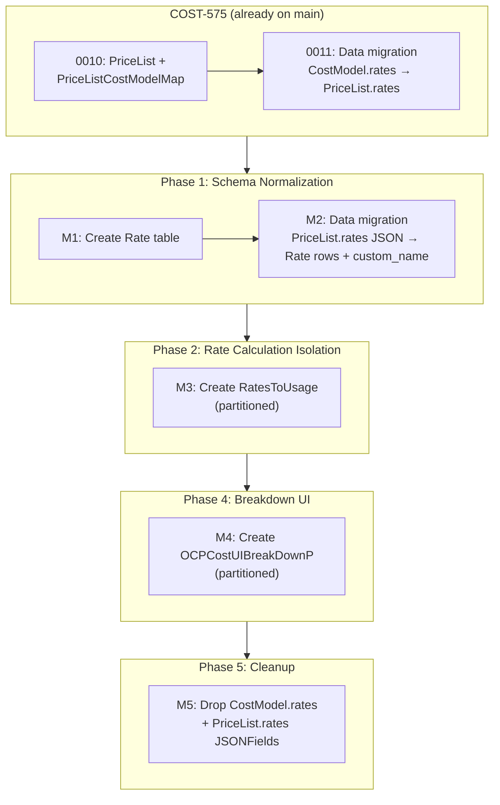
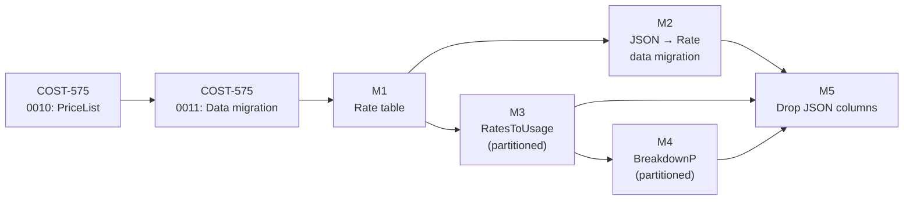

# Data Model Changes

This document describes the new Django models, schema changes, migration
strategy, and tree structure definition for cost breakdowns.

**Prerequisite**: [cost-models.md § Data Model](../cost-models.md#data-model)
for the current `CostModel` and `CostModelMap` schema.

---

## Current State

Rates are stored as a JSON blob on `CostModel.rates`:

```python
# cost_models/models.py
class CostModel(models.Model):
    rates = JSONField(default=dict)     # all rates for this cost model
    markup = JSONField(default=dict)
    distribution = models.TextField(choices=DISTRIBUTION_CHOICES)
    # ...
```

Example JSON structure:

```json
{
  "rates": [
    {
      "metric": {"name": "cpu_core_usage_per_hour"},
      "cost_type": "Infrastructure",
      "description": "CPU usage charge",
      "tiered_rates": [{"unit": "USD", "value": 0.22}]
    },
    {
      "metric": {"name": "node_cost_per_month"},
      "cost_type": "Infrastructure",
      "description": "",
      "tag_rates": {
        "tag_key": "app",
        "tag_values": [
          {"tag_value": "smoke", "value": 123, "unit": "USD", "default": true}
        ]
      }
    }
  ]
}
```

`CostModelDBAccessor.price_list` reads this JSON, groups rates by metric
name, and sums tiered rate values when multiple rates share the same
metric and cost type. Per-rate identity is lost at this point.

### COST-575 Foundation (Already on `main`)

[COST-575](https://redhat.atlassian.net/browse/COST-575) landed a
`PriceList` infrastructure that this design builds on. Two PRs
established the base:

| PR | What it delivered | Migration |
|----|-------------------|-----------|
| [#5963](https://github.com/project-koku/koku/pull/5963) | `PriceList` model (`price_list` table), `PriceListCostModelMap` junction table, dual-write in `CostModelManager` | `0010_add_price_list_models` |
| [#5957](https://github.com/project-koku/koku/pull/5957) | Data migration copying `CostModel.rates` JSON into `PriceList.rates` for all existing cost models | `0011_migrate_cost_model_rates_to_price_lists` |

The existing `PriceList` stores rates as a **JSON blob** — the same
denormalized format as `CostModel.rates`. This design extends it with
a normalized `Rate` table that extracts individual rates into relational
rows, adding the `custom_name` field required for per-rate breakdown
display.

The tech lead's [migration coordination gist](https://gist.github.com/myersCody/91195a531ada9c09d39a5c5234993654)
describes the shared dual-write strategy that both COST-575 and cost
breakdown follow:

```
CostModel (1) ──< (many) PriceList (1) ──< (many) Rate
```

**Key design decision**: We reuse the existing `price_list` table and
`price_list_cost_model_map` junction table from COST-575 rather than
creating parallel tables. The `Rate` table is the only new schema
addition in Phase 1.

The existing models on `main`:

```python
# cost_models/models.py (existing, from COST-575)
class PriceList(models.Model):
    class Meta:
        db_table = "price_list"
        ordering = ["name"]
        indexes = [
            models.Index(fields=["name"], name="price_list_name_idx"),
            models.Index(fields=["effective_start_date", "effective_end_date"], name="price_list_validity_idx"),
        ]

    uuid = models.UUIDField(primary_key=True, default=uuid4)
    name = models.TextField()
    description = models.TextField()
    currency = models.TextField()
    effective_start_date = models.DateField()
    effective_end_date = models.DateField()
    enabled = models.BooleanField(default=True)
    version = models.PositiveIntegerField(default=1)
    rates = JSONField()                                    # denormalized — supplemented by Rate table in Phase 1, dropped in Phase 5
    created_timestamp = models.DateTimeField(auto_now_add=True)
    updated_timestamp = models.DateTimeField(auto_now=True)

class PriceListCostModelMap(models.Model):
    class Meta:
        db_table = "price_list_cost_model_map"
        ordering = ["priority"]
        unique_together = ("price_list", "cost_model")

    price_list = models.ForeignKey("PriceList", on_delete=models.CASCADE, related_name="cost_model_maps")
    cost_model = models.ForeignKey("CostModel", on_delete=models.CASCADE, related_name="price_list_maps")
    priority = models.PositiveIntegerField()
```

**What COST-575 dual-write already does** (in `CostModelManager`):

- On `create()`: if rates are present, calls `_get_or_create_price_list()`
  which creates a `PriceList` row with the JSON blob and links it via
  `PriceListCostModelMap`
- On `update()`: if rates changed, syncs `PriceList.rates` JSON from
  `CostModel.rates`. Wrapped in `@transaction.atomic`.
- Data migration `0011`: for existing cost models, creates `PriceList`
  rows locked with `SELECT ... FOR UPDATE`, skips already-mapped models
  (idempotent)

---

## New Models

### PriceList (Existing — from COST-575)

The `PriceList` model and `PriceListCostModelMap` junction table already
exist on `main` (see [Current State § COST-575 Foundation](#cost-575-foundation-already-on-main)).
No new PriceList table is created in Phase 1.

The existing `price_list` table includes `effective_start_date` and
`effective_end_date` fields. **IQ-6 is superseded**: the original
proposal to remove date-bounding fields is moot because COST-575
shipped them. They remain as-is.

The link between `CostModel` and `PriceList` is through the
`PriceListCostModelMap` junction table (many-to-many), not a direct FK.
This supports future scenarios where multiple cost models share a price
list, or a cost model has multiple price lists.

### Rate

Individual rate definition. The `custom_name` field is the key addition
that enables per-rate breakdown display.

```python
# cost_models/models.py (new — Phase 1)
class Rate(models.Model):
    class Meta:
        db_table = "cost_model_rate"
        unique_together = ("price_list", "custom_name")
        indexes = [
            models.Index(fields=["price_list"], name="rate_price_list_idx"),
            models.Index(fields=["custom_name"], name="rate_custom_name_idx"),
            models.Index(fields=["metric"], name="rate_metric_idx"),
        ]

    uuid = models.UUIDField(primary_key=True, default=uuid4)
    price_list = models.ForeignKey("PriceList", on_delete=models.CASCADE, related_name="rate_rows")
    custom_name = models.CharField(max_length=50)          # NOT NULL, user-visible label
    description = models.TextField(blank=True, default="")
    metric = models.CharField(max_length=100)              # e.g. "cpu_core_usage_per_hour"
    metric_type = models.CharField(max_length=20)          # cpu, memory, storage, gpu
    cost_type = models.CharField(max_length=20)            # Infrastructure, Supplementary
    default_rate = models.DecimalField(max_digits=33, decimal_places=15)
    tag_key = models.CharField(max_length=253, blank=True, default="")
    tag_values = JSONField(default=dict)                   # [{tag_value, value, unit, ...}]
```

The `Rate` FK points to the existing `price_list` table from COST-575.
The `related_name` is `rate_rows` (not `rates`) to avoid collision with
the existing `PriceList.rates` JSONField. The path from `CostModel` to
`Rate` is: `CostModel → PriceListCostModelMap → PriceList → Rate`.

**Constraints**:

- `custom_name` is unique within a price list (enforced by `unique_together`)
- `custom_name` does not need to be unique across price lists
- Maximum 50 characters (UI display constraint from PRD)

### RatesToUsage

Per-rate cost rows produced by the SQL pipeline. Partitioned by
`usage_start` (same strategy as all OCP reporting tables).

```python
# reporting/provider/ocp/models.py (new)
class RatesToUsage(models.Model):
    class PartitionInfo:
        partition_type = "RANGE"
        partition_cols = ["usage_start"]

    class Meta:
        db_table = "rates_to_usage"
        indexes = [
            models.Index(fields=["usage_start", "source_uuid"], name="ratestousage_start_source_idx"),
            models.Index(fields=["report_period_id"], name="ratestousage_report_period_idx"),
            models.Index(fields=["namespace"], name="ratestousage_namespace_idx"),
            models.Index(fields=["cluster_id"], name="ratestousage_cluster_idx"),
            models.Index(fields=["custom_name"], name="ratestousage_custom_name_idx"),
            models.Index(fields=["monthly_cost_type"], name="ratestousage_monthly_cost_idx"),
        ]

    uuid = models.UUIDField(primary_key=True, default=uuid4)
    rate = models.ForeignKey("cost_models.Rate", on_delete=models.SET_NULL, null=True)
    cost_model = models.ForeignKey("cost_models.CostModel", on_delete=models.SET_NULL, null=True)
    report_period_id = models.IntegerField(null=True)      # FK to reporting_ocpusagereportperiod; used for cleanup scoping
    source_uuid = models.UUIDField()
    usage_start = models.DateField()
    usage_end = models.DateField()
    node = models.CharField(max_length=253, null=True)
    namespace = models.CharField(max_length=253, null=True)
    cluster_id = models.TextField()
    cluster_alias = models.TextField(null=True)
    data_source = models.CharField(max_length=63, null=True)
    persistentvolumeclaim = models.CharField(max_length=253, null=True)
    pod_labels = JSONField(null=True)
    volume_labels = JSONField(null=True)
    all_labels = JSONField(null=True)
    custom_name = models.CharField(max_length=50)
    metric_type = models.CharField(max_length=20)          # cpu, memory, storage, gpu — needed by aggregation SQL
    cost_model_rate_type = models.TextField(null=True)     # "Infrastructure" or "Supplementary" (from Rate.cost_type)
    monthly_cost_type = models.TextField(null=True)        # NULL=usage, Node, Cluster, PVC, Tag, OCP_VM, etc.
    calculated_cost = models.DecimalField(max_digits=33, decimal_places=15, null=True)
    distributed_cost = models.DecimalField(max_digits=33, decimal_places=15, null=True)  # Option 1: per-rate distributed rows (+recipient, -source)
    cost_category = models.ForeignKey(
        "OpenshiftCostCategory", on_delete=models.CASCADE, null=True
    )
    labels = JSONField(null=True)                         # denormalized union of pod_labels + volume_labels; used by existing koku label-based filtering
    label_hash = models.CharField(max_length=32, null=True) # R13 mitigation: md5(pod_labels::text || volume_labels::text || all_labels::text) — enables fast GROUP BY / JOIN without JSONB equality
```

### R13 Mitigation — `label_hash` column

#### The problem

The aggregation SQL (Phase 2) and the CI validation SQL both need to
GROUP BY or JOIN on three JSONB columns: `pod_labels`, `volume_labels`,
`all_labels`. These columns can be large — a single `pod_labels` value
may contain 20+ key-value pairs serialized as a JSONB document.

PostgreSQL JSONB equality (`=`) works by normalizing the document
(sorting keys, deduplicating) and comparing the full serialized
representation byte-by-byte. This is **O(document size)** per
comparison. In a GROUP BY over millions of rows, the planner must
hash or sort each row's JSONB values. For three JSONB columns, the
combined comparison cost dominates query time.

The aggregation runs **on every cost model recalculation** (not just
CI), so this is a production hot path.

See [risk-register.md § R13](./risk-register.md#r13--jsonb-join-performance-label_hash) for the full decision rationale (5 options evaluated).

At expected volumes, md5 collision probability is negligible; a collision would incorrectly merge two label groups and should surface as a CI validation diff.

#### Computation

```sql
md5(COALESCE(pod_labels::text, '')
    || COALESCE(volume_labels::text, '')
    || COALESCE(all_labels::text, ''))
```

The `::text` cast produces the normalized JSONB text representation
(keys sorted, whitespace removed). `COALESCE` handles NULLs so the
hash is deterministic even when one or more label columns are NULL.

**Key design notes**:

- `rate` is a nullable FK with `SET_NULL` — if a rate is deleted from
  the cost model, historical cost rows remain with the `custom_name`
  denormalized on the row itself.
- **Fine-grained columns** (`pod_labels`, `volume_labels`,
  `persistentvolumeclaim`, `all_labels`) match the GROUP BY granularity
  of `usage_costs.sql`. This is required so the aggregation step can
  produce rows at the exact same granularity as the daily summary,
  enabling `RatesToUsage` to serve as the single source of truth
  (see [IQ-1 resolution](./README.md#iq-1-aggregation-granularity-mismatch-phase-2-3)).
- **`distributed_cost` (IQ-9 Option 1).** Distribution runs *after* base
  `RatesToUsage` inserts and *before* aggregation. It writes **per-rate distributed rows** back to
  `RatesToUsage`, populating `distributed_cost` (positive on recipient
  namespaces, negative on source). `monthly_cost_type` on those rows
  indicates the distribution kind (e.g. `platform_distributed`). The
  breakdown population SQL reads these rows along with usage rows when
  building the tree. See
  [sql-pipeline.md § Distribution Costs in Breakdown](#distribution-costs-in-the-breakdown-tree).

### OCPCostUIBreakDownP

UI summary table for the breakdown API. Populated from
`RatesToUsage`. Partitioned by `usage_start`.

```python
# reporting/provider/ocp/models.py (new)
class OCPCostUIBreakDownP(models.Model):
    class PartitionInfo:
        partition_type = "RANGE"
        partition_cols = ["usage_start"]

    class Meta:
        db_table = "reporting_ocp_cost_breakdown_p"
        indexes = [
            models.Index(fields=["usage_start"], name="ocpcostbreakdown_usage_start"),
            models.Index(fields=["namespace"], name="ocpcostbreakdown_namespace"),
            models.Index(fields=["cluster_id"], name="ocpcostbreakdown_cluster_id"),
            models.Index(fields=["custom_name"], name="ocpcostbreakdown_custom_name"),
            models.Index(fields=["path"], name="ocpcostbreakdown_path"),
            models.Index(fields=["depth"], name="ocpcostbreakdown_depth"),
            models.Index(fields=["top_category"], name="ocpcostbreakdown_top_category"),
        ]

    id = models.UUIDField(primary_key=True)
    usage_start = models.DateField()
    usage_end = models.DateField()
    source_uuid = models.ForeignKey(
        "reporting.TenantAPIProvider", on_delete=models.CASCADE, null=True, db_column="source_uuid"
    )
    cluster_id = models.TextField()
    cluster_alias = models.TextField(null=True)
    namespace = models.TextField(null=True)
    node = models.TextField(null=True)
    cost_category = models.ForeignKey("OpenshiftCostCategory", on_delete=models.CASCADE, null=True)
    custom_name = models.CharField(max_length=50)
    metric_type = models.CharField(max_length=30)          # cpu, memory, storage, gpu
    cost_model_rate_type = models.TextField(null=True)     # All categorization: per-rate "Infrastructure"/"Supplementary"; distribution "platform_distributed", "worker_distributed", "unattributed_storage", "unattributed_network", "gpu_distributed", etc.
    cost_value = models.DecimalField(max_digits=33, decimal_places=15, null=True)
    distributed_cost = models.DecimalField(max_digits=33, decimal_places=15, null=True)
    path = models.CharField(max_length=200)                # e.g. "project.usage_cost.OpenShift_Subscriptions"
    depth = models.SmallIntegerField()                     # 1-5 (per-rate leaves at 4; distribution per-rate leaves at 5 with IQ-9 Option 1)
    parent_path = models.CharField(max_length=200)         # e.g. "project.usage_cost"
    top_category = models.CharField(max_length=200)        # "project" or "overhead"
    breakdown_category = models.CharField(max_length=50)   # "raw_cost", "usage_cost", "markup", "infrastructure" (IQ-9 Option 1)
```

**Registration points**:

- Add `"reporting_ocp_cost_breakdown_p"` to `UI_SUMMARY_TABLES` in
  `reporting/provider/ocp/models.py` — this ensures automatic partition
  creation (via `_handle_partitions()`) and cleanup (via
  `purge_expired_report_data_by_date()`)
- Add `"rates_to_usage"` to the purge table list in
  `masu/processor/ocp/ocp_report_db_cleaner.py` — this is the same
  partition-based cleanup used for all partitioned OCP tables. Provider
  deletion and data expiration both work through partition cleanup, not
  FK cascade, since `source_uuid` is a `UUIDField` (not a FK).
  This entry covers both SaaS and ONPREM modes since it is in the base
  `table_names` list (before the `if settings.ONPREM` branch).
  Do NOT also add to `get_self_hosted_table_names()` — that would
  create a duplicate entry when ONPREM=true.

**Pre-existing bug**: `reporting_ocp_vm_summary_p` is not in
`UI_SUMMARY_TABLES` and is not cleaned by the purge job. Should be
fixed alongside this work.

---

## Tree Structure Definition

The breakdown tree has a maximum depth of 4 levels for project-side
per-rate leaves and up to 5 levels under overhead when **IQ-9 Option 1
(per-rate distribution)** is in effect. Distribution rows in the tree
carry **full per-rate identity** at depth 4–5 because they are built from
per-rate `RatesToUsage` rows (including `distributed_cost` and
`monthly_cost_type` for the distribution kind). The `path` column encodes
the full hierarchy as a dot-separated string.

### Hierarchy Patterns

| Depth | Pattern | Example | Source |
|-------|---------|---------|--------|
| 1 | `total_cost` | `total_cost` | Aggregated from depth 2 |
| 2 | `{top_category}` | `project`, `overhead` | Aggregated from depth 3 |
| 3 | `{top_category}.{breakdown_category}` | `project.usage_cost`, `project.raw_cost` | Aggregated from depth 4 per-rate leaves |
| 3 | `overhead.{distribution_type}` | `overhead.platform_distributed`, `overhead.worker_distributed` | Aggregated from depth 4 children (per-rate distributed rows from `RatesToUsage`) |
| 4 | `{top_category}.{breakdown_category}.{name}` | `project.usage_cost.OpenShift_Subscriptions` | Per-rate leaf rows from `RatesToUsage` (usage / calculated cost) |
| 4 | `overhead.{dist_type}.infrastructure` | `overhead.platform_distributed.infrastructure` | Infrastructure aggregate (from distributed `RatesToUsage` rows where applicable) |
| 4 | `overhead.{dist_type}.{breakdown_category}` | `overhead.platform_distributed.usage_cost` | Aggregated from depth 5 per-rate distribution leaves (IQ-9 Option 1) |
| 5 | `overhead.{dist_type}.{breakdown_cat}.{name}` | `overhead.platform_distributed.usage_cost.OpenShift_Subscriptions` | Per-rate distribution leaf from `RatesToUsage` (`distributed_cost`, `monthly_cost_type` = distribution kind) |

**IQ-9 Option 1 (per-rate distribution)**: Distribution writes per-rate
rows back to `RatesToUsage` with `distributed_cost` and
`monthly_cost_type` (e.g. `platform_distributed`). Those rows retain the
same per-rate dimensions as usage rows (`custom_name`, `metric_type`,
`cost_model_rate_type` for Infrastructure vs Supplementary where
relevant), so the breakdown tree can drill to depth 4–5 under overhead
without a separate back-allocation pass. See
[README.md § IQ-9](./README.md#iq-9-distribution-per-rate-identity-gap)
and [sql-pipeline.md § Distribution Costs in Breakdown](#distribution-costs-in-the-breakdown-tree).

### Example Tree (with IQ-9 Option 1 per-rate distribution)

```
total_cost ($4000)
├── project ($2500)                                      ← depth 2 (aggregated)
│   ├── raw_cost ($1000)                                 ← depth 3 (aggregated)
│   │   ├── AmazonEC2 ($400)                             ← depth 4 (per-rate leaf)
│   │   ├── AmazonS3 ($300)                              ← depth 4 (per-rate leaf)
│   │   └── AmazonRDS ($300)                             ← depth 4 (per-rate leaf)
│   ├── usage_cost ($1200)                               ← depth 3 (aggregated)
│   │   ├── OpenShift Subscriptions ($500)               ← depth 4 (per-rate leaf)
│   │   ├── GuestOS Subscriptions ($400)                 ← depth 4 (per-rate leaf)
│   │   └── Operation ($300)                             ← depth 4 (per-rate leaf)
│   └── markup ($300)                                    ← depth 3 (aggregated)
└── overhead ($1500)                                     ← depth 2 (aggregated)
    ├── platform_distributed ($1000)                     ← depth 3 (aggregated from depth 4)
    │   ├── infrastructure ($400)                        ← depth 4 (infra aggregate)
    │   ├── usage_cost ($500)                            ← depth 4 (aggregated from depth 5)
    │   │   ├── OpenShift Subscriptions ($300)           ← depth 5 (per-rate distribution leaf)
    │   │   └── GuestOS Subscriptions ($200)             ← depth 5 (per-rate distribution leaf)
    │   └── markup ($100)                                ← depth 4 (aggregated from depth 5)
    └── worker_distributed ($500)                        ← depth 3 (same structure as above)
        ├── infrastructure ($200)                        ← depth 4
        └── usage_cost ($300)                            ← depth 4
            └── ...                                      ← depth 5
```

Depth 5 leaves under overhead reflect **per-rate distributed rows in
`RatesToUsage`** (Option 1), not a post-hoc back-allocation from the
daily summary alone.

### Relationship to `cost_category`

`top_category` maps to `OpenshiftCostCategory`:

- `top_category = "project"` → namespaces where `cost_category_id IS NULL`
  or `category_name != 'Platform'`
- `top_category = "overhead"` → namespaces where `category_name = 'Platform'`,
  plus synthetic namespaces (`Worker unallocated`, `Storage unattributed`,
  `Network unattributed`)

This mapping is the same logic used by `distribute_platform_cost.sql`
and `distribute_worker_cost.sql` today.

---

## Database Migration Plan

This section details every migration step across all phases. Each
migration is a separate Django migration file. The order matters —
later migrations depend on earlier ones.

### Migration Sequence Overview

COST-575 migrations `0010` and `0011` are prerequisites. Phase 1 adds
only the `Rate` table (M1) and a data migration to populate it (M2).



---

### M1: Create `cost_model_rate` Table

**Phase**: 1
**Type**: Schema migration (auto-generated)
**App**: `cost_models`
**Depends on**: `0011_migrate_cost_model_rates_to_price_lists` (COST-575)

```sql
CREATE TABLE cost_model_rate (
    uuid          UUID PRIMARY KEY DEFAULT uuid_generate_v4(),
    price_list_id UUID NOT NULL REFERENCES price_list(uuid) ON DELETE CASCADE,
    custom_name   VARCHAR(50) NOT NULL,
    description   TEXT NOT NULL DEFAULT '',
    metric        VARCHAR(100) NOT NULL,
    metric_type   VARCHAR(20) NOT NULL,
    cost_type     VARCHAR(20) NOT NULL,
    default_rate  NUMERIC(33, 15) NOT NULL,
    tag_key       VARCHAR(253) NOT NULL DEFAULT '',
    tag_values    JSONB NOT NULL DEFAULT '{}'::jsonb,

    UNIQUE (price_list_id, custom_name)
);

CREATE INDEX rate_price_list_idx ON cost_model_rate (price_list_id);
CREATE INDEX rate_custom_name_idx ON cost_model_rate (custom_name);
CREATE INDEX rate_metric_idx ON cost_model_rate (metric);
```

The FK references the existing `price_list` table (COST-575), not a new
table. This ensures a single `PriceList` concept shared between COST-575
(lifecycle management) and cost breakdown (per-rate normalization).

**Rollback**: `DROP TABLE cost_model_rate CASCADE;`

---

### M2: Data Migration — PriceList JSON to Rate Rows

**Phase**: 1
**Type**: Data migration (`RunPython`)
**App**: `cost_models`
**Depends on**: M1

This migration extracts individual rates from the existing
`PriceList.rates` JSON blob (populated by COST-575's migration `0011`)
into normalized `Rate` rows with auto-generated `custom_name`.

```python
# Pseudocode for the RunPython forward function
def migrate_rates_to_rate_table(apps, schema_editor):
    PriceList = apps.get_model("cost_models", "PriceList")
    PriceListCostModelMap = apps.get_model("cost_models", "PriceListCostModelMap")
    Rate = apps.get_model("cost_models", "Rate")
    CostModel = apps.get_model("cost_models", "CostModel")

    mapping_ids = list(
        PriceListCostModelMap.objects.select_related("price_list", "cost_model")
        .values_list("id", flat=True)
    )

    for mapping_id in mapping_ids:
        with transaction.atomic():
            mapping = PriceListCostModelMap.objects.select_related(
                "price_list", "cost_model"
            ).get(id=mapping_id)
            price_list = PriceList.objects.select_for_update().get(uuid=mapping.price_list_id)
            cost_model = CostModel.objects.select_for_update().get(uuid=mapping.cost_model_id)

            if not price_list.rates:
                continue

            # 1. Generate custom_name for each rate and create Rate rows
            used_names = set()
            rates_json = price_list.rates if isinstance(price_list.rates, list) else []
            updated_rates = []

            for rate_json in rates_json:
                custom_name = generate_custom_name(
                    description=rate_json.get("description", ""),
                    metric=rate_json.get("metric", {}).get("name", "unknown"),
                    used_names=used_names,
                )
                used_names.add(custom_name)

                metric_name = rate_json.get("metric", {}).get("name", "")
                metric_type = derive_metric_type(metric_name)

                tiered_rates = rate_json.get("tiered_rates", [])
                tag_rates = rate_json.get("tag_rates", {})
                raw_value = tiered_rates[0].get("value", 0) if tiered_rates else 0
                default_rate = Decimal(str(raw_value))  # JSON values may be strings ("0.0070000000")

                Rate.objects.create(
                    price_list=price_list,
                    custom_name=custom_name,
                    description=rate_json.get("description", ""),
                    metric=metric_name,
                    metric_type=metric_type,
                    cost_type=rate_json.get("cost_type", "Infrastructure"),
                    default_rate=default_rate,
                    tag_key=tag_rates.get("tag_key", ""),
                    tag_values=tag_rates.get("tag_values", {}),
                )

                # 2. Inject custom_name back into JSON for dual-write compatibility
                rate_json["custom_name"] = custom_name
                updated_rates.append(rate_json)

            # 3. Update both JSON blobs with custom_name added
            price_list.rates = updated_rates
            price_list.save(update_fields=["rates", "updated_timestamp"])
            cost_model.rates = updated_rates
            cost_model.save(update_fields=["rates"])
```

**Row-level locking** (`select_for_update`): Each mapping is processed
inside its own `transaction.atomic()` block with `select_for_update()`
on both the `PriceList` and `CostModel` rows. This matches COST-575's
migration `0011` pattern and serves as defense-in-depth for on-prem
deployments where the Unleash write-freeze flag is not available
(`MockUnleashClient` returns `False` by default). On SaaS, the Unleash
flag blocks API writes at a higher level; `select_for_update()` is a
complementary safeguard.

**`generate_custom_name` algorithm**:

```python
def generate_custom_name(description, metric, used_names):
    if description:
        candidate = description[:50]
    else:
        candidate = metric[:50]

    if candidate not in used_names:
        return candidate

    # Collision: truncate and add numeric suffix
    base = candidate[:46]
    for i in range(1000):
        suffixed = f"{base}_{i:03d}"
        if suffixed not in used_names:
            return suffixed

    raise ValueError(f"Cannot generate unique name for metric {metric}")
```

**`derive_metric_type` mapping** — use `USAGE_METRIC_MAP` from
`api/metrics/constants.py` (already maintained upstream):

```python
from api.metrics.constants import USAGE_METRIC_MAP

def derive_metric_type(metric_name: str) -> str:
    if metric_name in USAGE_METRIC_MAP:
        return USAGE_METRIC_MAP[metric_name]          # "cpu", "memory", or "storage"
    if "gpu" in metric_name:
        return "gpu"
    if metric_name in ("node_cost_per_month", "node_core_cost_per_month",
                       "cluster_cost_per_month"):
        return "cpu"                                   # monthly rates default to cpu
    if metric_name == "pvc_cost_per_month":
        return "storage"
    if metric_name.startswith("vm_"):
        return "cpu"                                   # VM costs default to cpu
    return "cpu"                                       # safe fallback
```

`USAGE_METRIC_MAP` covers the 9 main usage metrics:

| Metric | `metric_type` |
|--------|---------------|
| `cpu_core_usage_per_hour` | `cpu` |
| `cpu_core_request_per_hour` | `cpu` |
| `cpu_core_effective_usage_per_hour` | `cpu` |
| `memory_gb_usage_per_hour` | `memory` |
| `memory_gb_request_per_hour` | `memory` |
| `memory_gb_effective_usage_per_hour` | `memory` |
| `storage_gb_usage_per_month` | `storage` |
| `storage_gb_request_per_month` | `storage` |
| `cluster_core_cost_per_hour` | `cpu` |

**Precondition**: Enable the Unleash write-freeze flag
(`cost-management.backend.disable-cost-model-writes`) before running M2.
This prevents concurrent API writes from modifying `CostModel.rates` or
`PriceList.rates` JSON while the migration is iterating and injecting
`custom_name`. Disable the flag after M2 completes and validation passes.
See [api-and-frontend.md § Migration Write-Freeze Flag](./api-and-frontend.md#migration-write-freeze-flag-unleash)
and [risk-register.md § R20](./risk-register.md#r20--migration-write-corruption).

**What this migration does NOT do**:

- Does not create `PriceList` rows (COST-575's `0011` already did that)
- Does not modify `CostModelDBAccessor` read path (that's a code change,
  not a migration)
- Does not remove the `rates` JSON columns (that's Phase 5)
- Does not create partitioned tables (those are separate migrations)

**Rollback**: `RunPython(reverse_code=reverse_rate_migration)` — deletes
all `Rate` rows, removes `custom_name` key from `CostModel.rates` and
`PriceList.rates` JSON blobs. Does NOT delete `PriceList` rows (those
belong to COST-575).

**Estimated runtime**: O(N) where N = total number of price list
mappings. Typically small (hundreds, not millions). Should complete in
seconds.

---

### M3: Create `rates_to_usage` Table (Partitioned)

**Phase**: 2
**Type**: Schema migration
**App**: `reporting` (lives in `reporting/provider/ocp/models.py`)
**Depends on**: M1 (needs `cost_model_rate` table for FK)

```sql
CREATE TABLE rates_to_usage (
    uuid                 UUID PRIMARY KEY DEFAULT uuid_generate_v4(),
    rate_id              UUID REFERENCES cost_model_rate(uuid) ON DELETE SET NULL,  -- FK to new Rate table (Phase 1)
    cost_model_id        UUID REFERENCES cost_model(uuid) ON DELETE SET NULL,
    report_period_id     INTEGER,
    source_uuid          UUID NOT NULL,
    usage_start          DATE NOT NULL,
    usage_end            DATE NOT NULL,
    node                 VARCHAR(253),
    namespace            VARCHAR(253),
    cluster_id           TEXT NOT NULL,
    cluster_alias        TEXT,
    data_source          VARCHAR(63),
    persistentvolumeclaim VARCHAR(253),
    pod_labels           JSONB,
    volume_labels        JSONB,
    all_labels           JSONB,
    custom_name          VARCHAR(50) NOT NULL,
    metric_type          VARCHAR(20) NOT NULL,
    cost_model_rate_type TEXT,
    monthly_cost_type    TEXT,
    calculated_cost      NUMERIC(33, 15),
    distributed_cost     NUMERIC(33, 15),
    cost_category_id     INTEGER REFERENCES reporting_ocp_cost_category(id) ON DELETE CASCADE,
    labels               JSONB,
    label_hash           VARCHAR(32)      -- R13: md5(pod_labels || volume_labels || all_labels)
) PARTITION BY RANGE (usage_start);

CREATE INDEX ratestousage_start_source_idx ON rates_to_usage (usage_start, source_uuid);
CREATE INDEX ratestousage_report_period_idx ON rates_to_usage (report_period_id);
CREATE INDEX ratestousage_namespace_idx ON rates_to_usage (namespace);
CREATE INDEX ratestousage_cluster_idx ON rates_to_usage (cluster_id);
CREATE INDEX ratestousage_custom_name_idx ON rates_to_usage (custom_name);
CREATE INDEX ratestousage_monthly_cost_idx ON rates_to_usage (monthly_cost_type);
CREATE INDEX ratestousage_label_hash_idx ON rates_to_usage (label_hash);
```

**Partitioning**: Monthly partitions, managed by the same
`PartitionedTable` infrastructure used by all `reporting_ocp_*` tables.
Koku's partition manager creates and drops monthly partitions
automatically based on usage data date ranges.

**Partition creation wiring**: `rates_to_usage` is NOT a UI
summary table, so it is not covered by the `_handle_partitions()` call
in `ocp_report_parquet_summary_updater.py`. Instead, partition creation
is wired in the cost model updater via `PartitionHandlerMixin`:

```python
# ocp_cost_model_cost_updater.py inherits PartitionHandlerMixin
from koku.pg_partition import PartitionHandlerMixin

class OCPCostModelCostUpdater(OCPCloudUpdaterBase, PartitionHandlerMixin):
    ...
    def _ensure_rates_to_usage_partitions(self, start_date, end_date):
        """Create monthly partitions for rates_to_usage on demand."""
        with schema_context(self._schema):
            self._handle_partitions(
                self._schema, ["rates_to_usage"], start_date, end_date
            )
```

This creates the monthly partition on demand, before the first INSERT
for that month. `_handle_partitions()` is the same helper used by
`OCPReportParquetSummaryUpdater` for UI summary tables — it builds
`part_rec` dicts internally and handles multi-month date ranges.

**Rollback**: `DROP TABLE rates_to_usage CASCADE;`

---

### M4: Create `reporting_ocp_cost_breakdown_p` Table (Partitioned)

**Phase**: 4
**Type**: Schema migration
**App**: `reporting`
**Depends on**: M3

```sql
CREATE TABLE reporting_ocp_cost_breakdown_p (
    id                   UUID PRIMARY KEY DEFAULT uuid_generate_v4(),
    usage_start          DATE NOT NULL,
    usage_end            DATE NOT NULL,
    source_uuid          UUID REFERENCES api_tenantapiprovider(uuid) ON DELETE CASCADE,
    cluster_id           TEXT NOT NULL,
    cluster_alias        TEXT,
    namespace            TEXT,
    node                 TEXT,
    cost_category_id     INTEGER REFERENCES reporting_ocp_cost_category(id) ON DELETE CASCADE,
    custom_name          VARCHAR(50) NOT NULL,
    metric_type          VARCHAR(30) NOT NULL,
    cost_model_rate_type TEXT,
    cost_value           NUMERIC(33, 15),
    distributed_cost     NUMERIC(33, 15),
    path                 VARCHAR(200) NOT NULL,
    depth                SMALLINT NOT NULL,
    parent_path          VARCHAR(200) NOT NULL,
    top_category         VARCHAR(200) NOT NULL,
    breakdown_category   VARCHAR(50) NOT NULL
) PARTITION BY RANGE (usage_start);

CREATE INDEX ocpcostbreakdown_usage_start ON reporting_ocp_cost_breakdown_p (usage_start);
CREATE INDEX ocpcostbreakdown_namespace ON reporting_ocp_cost_breakdown_p (namespace);
CREATE INDEX ocpcostbreakdown_cluster_id ON reporting_ocp_cost_breakdown_p (cluster_id);
CREATE INDEX ocpcostbreakdown_custom_name ON reporting_ocp_cost_breakdown_p (custom_name);
CREATE INDEX ocpcostbreakdown_path ON reporting_ocp_cost_breakdown_p (path);
CREATE INDEX ocpcostbreakdown_depth ON reporting_ocp_cost_breakdown_p (depth);
CREATE INDEX ocpcostbreakdown_top_category ON reporting_ocp_cost_breakdown_p (top_category);
```

**Registration** (code change, not migration):

- Add `"reporting_ocp_cost_breakdown_p"` to `UI_SUMMARY_TABLES` in
  `reporting/provider/ocp/models.py`
- Add to `purge_expired_report_data_by_date()` in
  `masu/processor/ocp/ocp_report_db_cleaner.py`

**Rollback**: `DROP TABLE reporting_ocp_cost_breakdown_p CASCADE;` and
revert the `UI_SUMMARY_TABLES` / cleaner changes.

---

### M5: Drop `CostModel.rates` and `PriceList.rates` JSONFields

**Phase**: 5
**Type**: Schema migration (auto-generated by `makemigrations`)
**App**: `cost_models`
**Depends on**: M2, M3, M4, and confirmation that all tenants are migrated

```sql
ALTER TABLE cost_model DROP COLUMN rates;
ALTER TABLE price_list DROP COLUMN rates;
```

Both JSON columns are dropped — `CostModel.rates` (the original) and
`PriceList.rates` (the COST-575 mirror). By this point, the `Rate`
table is the sole source of truth.

**Preconditions** (must all be true before running):

- Dual-write has been active long enough that all cost models have
  corresponding `Rate` table rows
- `CostModelDBAccessor` reads exclusively from the `Rate` table
  (JSON read path removed)
- All SQL files use `RatesToUsage` path (no fallback to JSON)
- Backup of `cost_model` and `price_list` tables taken
- Unleash write-freeze flag (`cost-management.backend.disable-cost-model-writes`)
  enabled before running M5

**Rollback**: `ALTER TABLE cost_model ADD COLUMN rates JSONB DEFAULT '{}'::jsonb;`
and `ALTER TABLE price_list ADD COLUMN rates JSONB DEFAULT '{}'::jsonb;`
followed by a data migration to repopulate from the `Rate` table. This is
the only migration that is practically irreversible without a backup.

---

### Migration Dependency Graph



### Phase-to-Migration Mapping

| Phase | Migrations | Reversible? | Estimated Runtime |
|-------|-----------|-------------|-------------------|
| (prereq) | COST-575: 0010, 0011 | Yes (already on main) | N/A |
| 1 | M1, M2 | Yes (drop Rate table, revert JSON) | Seconds |
| 2 | M3 | Yes (drop table) | Seconds (empty table creation) |
| 4 | M4 | Yes (drop table) | Seconds (empty table creation) |
| 5 | M5 | Requires backup | Seconds (column drop) |

### On-Prem Considerations

On-prem deployments (`settings.ONPREM = True`) run migrations via the
`koku-metrics-operator` or manual `django-admin migrate`. The migration
sequence is the same. The only difference:

- `RatesToUsage` must also be added to the self-hosted table
  cleanup in `get_self_hosted_table_names()` if on-prem uses the
  self-hosted SQL path
- The `reporting_ocp_cost_breakdown_p` partition cleanup is automatic
  via `UI_SUMMARY_TABLES`

---

## Migration Strategy: `custom_name` Generation

Since `custom_name` is new and mandatory, existing rates must be migrated.
This is handled by M2 above.

### Edge Cases

- **Tag rates**: A rate with `tag_rates` gets one `Rate` row. The individual
  tag values are stored in `Rate.tag_values` JSON. The `custom_name` applies
  to the rate as a whole, not per tag value.
- **Duplicate metrics**: Two rates with the same `metric.name` but different
  `cost_type` (Infrastructure vs Supplementary) are distinct and get
  separate `custom_name` values.
- **Very long descriptions**: Truncated descriptions that collide after
  truncation get the incremental suffix treatment.
- **Empty cost models**: Cost models with empty rates are skipped. Note
  that COST-575's data migration `0011` already skips these for PriceList
  creation, so no `PriceListCostModelMap` exists to iterate in M2.
- **Rates with no tiered_rates or tag_rates**: These exist in the JSON but
  are skipped by `CostModelDBAccessor.price_list` today. They should still
  get `Rate` rows (with `default_rate = 0`) so the migration is complete.

---

## Changelog

| Version | Date | Summary |
|---------|------|---------|
| v1.0 | 2026-03-17 | Initial: 4 Django models (PriceList, Rate, RatesToUsage, OCPCostUIBreakDownP), 6 migrations (M1-M6), tree structure definition (depth 1-5), custom_name generation algorithm. |
| v2.0 | 2026-03-17 | IQ-1 resolved: add 4 fine-grained columns to RatesToUsage (pod_labels, volume_labels, persistentvolumeclaim, all_labels). Update M4 DDL. |
| v2.1 | 2026-03-17 | Fix tree depth inconsistency: align hierarchy table with PoC SQL (depth 4 per-rate, depth 3 distribution). Mark depth 5 as conditional on IQ-9. |
| v2.2 | 2026-03-17 | IQ-9 investigation: update hierarchy table and example tree to show depth 4-5 back-allocation structure. Add IQ-9 Option 2 annotations. Clarify intro text for current vs proposed state. |
| v2.3 | 2026-03-17 | Blast-radius triage: fix M1 DDL to remove IQ-6 columns (align with model), add "infrastructure" to breakdown_category comment, document `labels` field purpose. |
| v2.4 | 2026-03-17 | R13 mitigation: add `label_hash` column to RatesToUsage model and M4 DDL. Add `ratestousage_label_hash_idx` index. Add full decision rationale with 5 options evaluated, collision risk analysis, and computation details. |
| v3.0 | 2026-03-19 | **IQ-9 Option 1 adopted.** Add `distributed_cost` column to `RatesToUsage` model and M4 DDL. Drop `cost_type` from `OCPCostUIBreakDownP` and M5 DDL. Rename `CostModelRatesToUsage` → `RatesToUsage` / `cost_model_rates_to_usage` → `rates_to_usage`. Update tree structure for per-rate distribution. |
| v3.1 | 2026-03-19 | **Risk extraction.** Move R13 decision rationale table to [risk-register.md](./risk-register.md). Retain problem statement and computation details inline. |
| v4.0 | 2026-04-02 | **Align Phase 1 with COST-575.** Remove proposed `cost_model_price_list` model — reuse existing `price_list` table from COST-575 ([#5963](https://github.com/project-koku/koku/pull/5963), [#5957](https://github.com/project-koku/koku/pull/5957)). `Rate` FK now references `price_list(uuid)`. Drop M1 (PriceList creation) — already exists via COST-575 migrations `0010`/`0011`. Renumber M2→M1, M3→M2, M4→M3, M5→M4, M6→M5. M5 now drops both `CostModel.rates` and `PriceList.rates` JSON columns. IQ-6 superseded (COST-575 shipped `effective_start_date`/`effective_end_date`). Add COST-575 Foundation section to Current State. Reference tech lead's [migration coordination gist](https://gist.github.com/myersCody/91195a531ada9c09d39a5c5234993654). |
| v4.1 | 2026-04-02 | **R20: Migration write-freeze.** Add Unleash write-freeze precondition to M2 and M5. |
| v4.2 | 2026-04-02 | **Critical review.** Add `Decimal()` conversion to M2 pseudocode `default_rate`. Clarify `PriceList.rates` lifecycle comment (supplemented in Phase 1, dropped in Phase 5). |
| v4.3 | 2026-04-02 | **Self-resolve Concern 4.** Add `transaction.atomic()` + `select_for_update()` to M2 pseudocode for on-prem defense-in-depth, matching COST-575 0011 pattern. |
| v4.4 | 2026-04-06 | **Spec-vs-impl alignment.** Fix Rate model pseudocode: `tag_values` default `list` (not `dict`), `default_rate` nullable, add `created_timestamp`/`updated_timestamp`, `related_name="rate_rows"`. Fix M2 DDL to match. |
| v4.5 | 2026-04-06 | **Phase 2 DD findings.** Remove `resource_id` from RatesToUsage model and M4 DDL (not in source table, no SQL consumer). Fix partition creation pseudocode to use `PartitionHandlerMixin._handle_partitions()` (matches actual koku API). |
