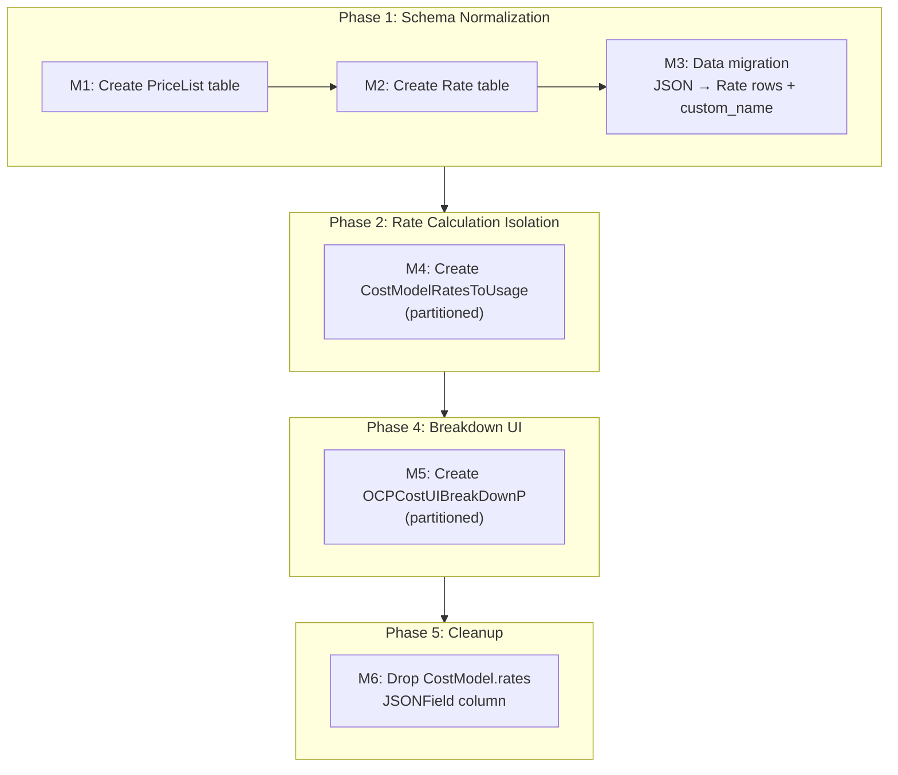
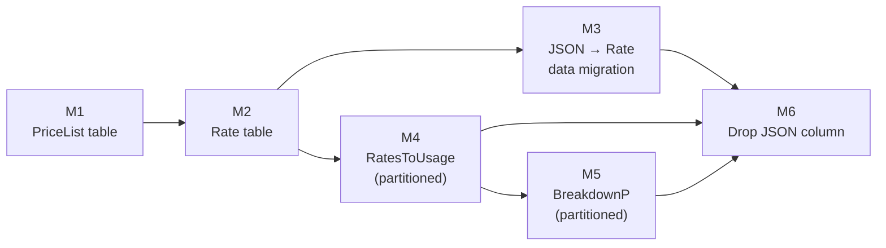

# Data Model Changes

This document describes the new Django models, schema changes, migration
strategy, and tree structure definition for cost breakdowns.

**Prerequisite**: [cost-models.md § Data Model](../cost-models.md#data-model)
for the current `CostModel` and `CostModelMap` schema.

---

## Current State

Rates are stored as a JSON blob on `CostModel.rates`:

```python
# cost_models/models.py
class CostModel(models.Model):
    rates = JSONField(default=dict)     # all rates for this cost model
    markup = JSONField(default=dict)
    distribution = models.TextField(choices=DISTRIBUTION_CHOICES)
    # ...
```

Example JSON structure:

```json
{
  "rates": [
    {
      "metric": {"name": "cpu_core_usage_per_hour"},
      "cost_type": "Infrastructure",
      "description": "CPU usage charge",
      "tiered_rates": [{"unit": "USD", "value": 0.22}]
    },
    {
      "metric": {"name": "node_cost_per_month"},
      "cost_type": "Infrastructure",
      "description": "",
      "tag_rates": {
        "tag_key": "app",
        "tag_values": [
          {"tag_value": "smoke", "value": 123, "unit": "USD", "default": true}
        ]
      }
    }
  ]
}
```

`CostModelDBAccessor.price_list` reads this JSON, groups rates by metric
name, and sums tiered rate values when multiple rates share the same
metric and cost type. Per-rate identity is lost at this point.

---

## New Models

### PriceList

Normalizes the relationship between a cost model and its rates.
Replaces the JSON blob as the source of truth (via dual-write from
`CostModelManager` during Phases 1-4).

```python
# cost_models/models.py (new)
class PriceList(models.Model):
    class Meta:
        db_table = "cost_model_price_list"
        indexes = [
            models.Index(fields=["cost_model"], name="pricelist_cost_model_idx"),
        ]

    uuid = models.UUIDField(primary_key=True, default=uuid4)
    cost_model = models.ForeignKey("CostModel", on_delete=models.CASCADE, related_name="price_lists")
    primary = models.BooleanField(default=True)
    fallback = models.BooleanField(default=False)
    # IQ-6 PROPOSAL: Remove usage_start/usage_end — PRD does not
    # require time-bounded pricing. Can be added in a future migration.
```

**IQ-6 PROPOSAL**: Remove `usage_start` and `usage_end`. Koku's
existing models are minimal (`CostModel` has no date-bounding). The
PRD doesn't require time-bounded rates. See
[README.md § IQ-6](./README.md#iq-6-pricelistusage_startusage_end-phase-1).

### Rate

Individual rate definition. The `custom_name` field is the key addition
that enables per-rate breakdown display.

```python
# cost_models/models.py (new)
class Rate(models.Model):
    class Meta:
        db_table = "cost_model_rate"
        unique_together = ("price_list", "custom_name")
        indexes = [
            models.Index(fields=["price_list"], name="rate_price_list_idx"),
            models.Index(fields=["custom_name"], name="rate_custom_name_idx"),
            models.Index(fields=["metric"], name="rate_metric_idx"),
        ]

    uuid = models.UUIDField(primary_key=True, default=uuid4)
    price_list = models.ForeignKey("PriceList", on_delete=models.CASCADE, related_name="rates")
    custom_name = models.CharField(max_length=50)          # NOT NULL, user-visible label
    description = models.TextField(blank=True, default="")
    metric = models.CharField(max_length=100)              # e.g. "cpu_core_usage_per_hour"
    metric_type = models.CharField(max_length=20)          # cpu, memory, storage, gpu
    cost_type = models.CharField(max_length=20)            # Infrastructure, Supplementary
    default_rate = models.DecimalField(max_digits=33, decimal_places=15)
    tag_key = models.CharField(max_length=253, blank=True, default="")
    tag_values = JSONField(default=dict)                   # [{tag_value, value, unit, ...}]
```

**Constraints**:

- `custom_name` is unique within a price list (enforced by `unique_together`)
- `custom_name` does not need to be unique across price lists
- Maximum 50 characters (UI display constraint from PRD)

### CostModelRatesToUsage

Per-rate cost rows produced by the SQL pipeline. Partitioned by
`usage_start` (same strategy as all OCP reporting tables).

```python
# reporting/provider/ocp/models.py (new)
class CostModelRatesToUsage(models.Model):
    class PartitionInfo:
        partition_type = "RANGE"
        partition_cols = ["usage_start"]

    class Meta:
        db_table = "cost_model_rates_to_usage"
        indexes = [
            models.Index(fields=["usage_start", "source_uuid"], name="ratestousage_start_source_idx"),
            models.Index(fields=["report_period_id"], name="ratestousage_report_period_idx"),
            models.Index(fields=["namespace"], name="ratestousage_namespace_idx"),
            models.Index(fields=["cluster_id"], name="ratestousage_cluster_idx"),
            models.Index(fields=["custom_name"], name="ratestousage_custom_name_idx"),
            models.Index(fields=["monthly_cost_type"], name="ratestousage_monthly_cost_idx"),
        ]

    uuid = models.UUIDField(primary_key=True, default=uuid4)
    rate = models.ForeignKey("cost_models.Rate", on_delete=models.SET_NULL, null=True)
    cost_model = models.ForeignKey("cost_models.CostModel", on_delete=models.SET_NULL, null=True)
    report_period_id = models.IntegerField(null=True)      # FK to reporting_ocpusagereportperiod; used for cleanup scoping
    source_uuid = models.TextField()
    usage_start = models.DateField()
    usage_end = models.DateField()
    node = models.CharField(max_length=253, null=True)
    namespace = models.CharField(max_length=253, null=True)
    cluster_id = models.TextField()
    cluster_alias = models.TextField(null=True)
    data_source = models.CharField(max_length=63, null=True)
    resource_id = models.CharField(max_length=253, null=True)
    persistentvolumeclaim = models.CharField(max_length=253, null=True)
    pod_labels = JSONField(null=True)
    volume_labels = JSONField(null=True)
    all_labels = JSONField(null=True)
    custom_name = models.CharField(max_length=50)
    metric_type = models.CharField(max_length=20)          # cpu, memory, storage, gpu — needed by aggregation SQL
    cost_model_rate_type = models.TextField(null=True)     # "Infrastructure" or "Supplementary" (from Rate.cost_type)
    monthly_cost_type = models.TextField(null=True)        # NULL=usage, Node, Cluster, PVC, Tag, OCP_VM, etc.
    calculated_cost = models.DecimalField(max_digits=33, decimal_places=15, null=True)
    cost_category = models.ForeignKey(
        "OpenshiftCostCategory", on_delete=models.CASCADE, null=True
    )
    labels = JSONField(null=True)
```

**Key design notes**:

- `rate` is a nullable FK with `SET_NULL` — if a rate is deleted from
  the cost model, historical cost rows remain with the `custom_name`
  denormalized on the row itself.
- **Fine-grained columns** (`pod_labels`, `volume_labels`,
  `persistentvolumeclaim`, `all_labels`) match the GROUP BY granularity
  of `usage_costs.sql`. This is required so the aggregation step can
  produce rows at the exact same granularity as the daily summary,
  enabling `RatesToUsage` to serve as the single source of truth
  (see [IQ-1 resolution](./README.md#iq-1-aggregation-granularity-mismatch-phase-2-3)).
- **No `distributed_cost` column.** Distribution runs *after* the
  aggregation step and writes new rows directly to the daily summary
  (with `cost_model_rate_type` = `platform_distributed`, etc.). These
  distribution rows are read directly from the daily summary by the
  breakdown population SQL (`reporting_ocp_cost_breakdown_p.sql`) —
  they do not pass through `RatesToUsage`. See
  [sql-pipeline.md § Distribution Costs in Breakdown](#distribution-costs-in-the-breakdown-tree).

### OCPCostUIBreakDownP

UI summary table for the breakdown API. Populated from
`CostModelRatesToUsage`. Partitioned by `usage_start`.

```python
# reporting/provider/ocp/models.py (new)
class OCPCostUIBreakDownP(models.Model):
    class PartitionInfo:
        partition_type = "RANGE"
        partition_cols = ["usage_start"]

    class Meta:
        db_table = "reporting_ocp_cost_breakdown_p"
        indexes = [
            models.Index(fields=["usage_start"], name="ocpcostbreakdown_usage_start"),
            models.Index(fields=["namespace"], name="ocpcostbreakdown_namespace"),
            models.Index(fields=["cluster_id"], name="ocpcostbreakdown_cluster_id"),
            models.Index(fields=["custom_name"], name="ocpcostbreakdown_custom_name"),
            models.Index(fields=["path"], name="ocpcostbreakdown_path"),
            models.Index(fields=["depth"], name="ocpcostbreakdown_depth"),
            models.Index(fields=["top_category"], name="ocpcostbreakdown_top_category"),
        ]

    id = models.UUIDField(primary_key=True)
    usage_start = models.DateField()
    usage_end = models.DateField()
    source_uuid = models.ForeignKey(
        "reporting.TenantAPIProvider", on_delete=models.CASCADE, null=True, db_column="source_uuid"
    )
    cluster_id = models.TextField()
    cluster_alias = models.TextField(null=True)
    namespace = models.TextField(null=True)
    node = models.TextField(null=True)
    cost_category = models.ForeignKey("OpenshiftCostCategory", on_delete=models.CASCADE, null=True)
    custom_name = models.CharField(max_length=50)
    metric_type = models.CharField(max_length=30)          # cpu, memory, storage, gpu
    cost_model_rate_type = models.TextField(null=True)     # Per-rate rows: "Infrastructure"/"Supplementary"; Distribution rows: "platform_distributed", "worker_distributed", "unattributed_storage", "unattributed_network", "gpu_distributed"
    cost_type = models.CharField(max_length=20, null=True)  # IQ-8: NULL for distribution rows — see README.md
    cost_value = models.DecimalField(max_digits=33, decimal_places=15, null=True)
    distributed_cost = models.DecimalField(max_digits=33, decimal_places=15, null=True)
    path = models.CharField(max_length=200)                # e.g. "project.usage_cost.OpenShift_Subscriptions"
    depth = models.SmallIntegerField()                     # 1-4 (per-rate leaves at 4; distribution leaves at 3)
    parent_path = models.CharField(max_length=200)         # e.g. "project.usage_cost"
    top_category = models.CharField(max_length=200)        # "project" or "overhead"
    breakdown_category = models.CharField(max_length=50)   # "raw_cost", "usage_cost", "markup"
```

**Registration points**:

- Add `"reporting_ocp_cost_breakdown_p"` to `UI_SUMMARY_TABLES` in
  `reporting/provider/ocp/models.py` — this ensures automatic partition
  creation (via `_handle_partitions()`) and cleanup (via
  `purge_expired_report_data_by_date()`)
- Add `"cost_model_rates_to_usage"` to the purge table list in
  `masu/processor/ocp/ocp_report_db_cleaner.py` — this is the same
  partition-based cleanup used for all partitioned OCP tables. Provider
  deletion and data expiration both work through partition cleanup, not
  FK cascade, since `source_uuid` is a `TextField` (not a FK).
- For on-prem, also add `"cost_model_rates_to_usage"` to
  `get_self_hosted_table_names()` in
  `reporting/provider/ocp/self_hosted_models.py`

**Pre-existing bug**: `reporting_ocp_vm_summary_p` is not in
`UI_SUMMARY_TABLES` and is not cleaned by the purge job. Should be
fixed alongside this work.

---

## Tree Structure Definition

The breakdown tree has a maximum depth of 4 levels for per-rate rows
and 3 levels for distribution rows. The `path` column encodes the
full hierarchy as a dot-separated string.

### Hierarchy Patterns

| Depth | Pattern | Example | Source |
|-------|---------|---------|--------|
| 1 | `total_cost` | `total_cost` | Aggregated from depth 2 |
| 2 | `{top_category}` | `project`, `overhead` | Aggregated from depth 3 |
| 3 | `{top_category}.{breakdown_category}` | `project.usage_cost`, `project.raw_cost` | Aggregated from depth 4 per-rate leaves |
| 3 | `overhead.{distribution_type}` | `overhead.platform_distributed`, `overhead.worker_distributed` | Distribution rows from daily summary |
| 4 | `{top_category}.{breakdown_category}.{name}` | `project.usage_cost.OpenShift_Subscriptions` | Per-rate leaf rows from `RatesToUsage` |

**Note on distribution rows**: Distribution SQL (`distribute_platform_cost.sql`,
etc.) operates on aggregated `cost_model_*_cost` columns in the daily
summary. Per-rate identity is lost at that point — the distributed cost
is a single scalar per namespace/node. As a result, distribution rows
in the breakdown tree are leaf nodes at depth 3 (e.g.,
`overhead.platform_distributed`) without further per-rate drill-down.

A potential depth 5 (`overhead.{distribution_type}.{breakdown_category}.{name}`)
would require distribution to operate on per-rate data from `RatesToUsage`.
This is tracked as a design gap — see [IQ-9](./README.md#iq-9-distribution-per-rate-identity-gap).

### Example Tree

```
total_cost ($4000)
├── project ($2500)                              ← depth 2 (aggregated)
│   ├── raw_cost ($1000)                         ← depth 3 (aggregated)
│   │   ├── AmazonEC2 ($400)                     ← depth 4 (per-rate leaf)
│   │   ├── AmazonS3 ($300)                      ← depth 4 (per-rate leaf)
│   │   └── AmazonRDS ($300)                     ← depth 4 (per-rate leaf)
│   ├── usage_cost ($1200)                       ← depth 3 (aggregated)
│   │   ├── OpenShift Subscriptions ($500)       ← depth 4 (per-rate leaf)
│   │   ├── GuestOS Subscriptions ($400)         ← depth 4 (per-rate leaf)
│   │   └── Operation ($300)                     ← depth 4 (per-rate leaf)
│   └── markup ($300)                            ← depth 3 (aggregated)
└── overhead ($1500)                             ← depth 2 (aggregated)
    ├── platform_distributed ($1000)             ← depth 3 (distribution leaf — no per-rate drill-down)
    └── worker_unallocated ($500)                ← depth 3 (distribution leaf — no per-rate drill-down)
```

### Relationship to `cost_category`

`top_category` maps to `OpenshiftCostCategory`:

- `top_category = "project"` → namespaces where `cost_category_id IS NULL`
  or `category_name != 'Platform'`
- `top_category = "overhead"` → namespaces where `category_name = 'Platform'`,
  plus synthetic namespaces (`Worker unallocated`, `Storage unattributed`,
  `Network unattributed`)

This mapping is the same logic used by `distribute_platform_cost.sql`
and `distribute_worker_cost.sql` today.

---

## Database Migration Plan

This section details every migration step across all phases. Each
migration is a separate Django migration file. The order matters —
later migrations depend on earlier ones.

### Migration Sequence Overview



---

### M1: Create `cost_model_price_list` Table

**Phase**: 1
**Type**: Schema migration (auto-generated by `makemigrations`)
**App**: `cost_models`
**Depends on**: latest existing `cost_models` migration

```sql
CREATE TABLE cost_model_price_list (
    uuid         UUID PRIMARY KEY DEFAULT uuid_generate_v4(),
    cost_model_id UUID NOT NULL REFERENCES cost_model(uuid) ON DELETE CASCADE,
    "primary"    BOOLEAN NOT NULL DEFAULT TRUE,
    fallback     BOOLEAN NOT NULL DEFAULT FALSE,
    usage_start  TIMESTAMP WITH TIME ZONE,
    usage_end    TIMESTAMP WITH TIME ZONE
);

CREATE INDEX pricelist_cost_model_idx ON cost_model_price_list (cost_model_id);
```

**Rollback**: `DROP TABLE cost_model_price_list CASCADE;`

---

### M2: Create `cost_model_rate` Table

**Phase**: 1
**Type**: Schema migration (auto-generated)
**App**: `cost_models`
**Depends on**: M1

```sql
CREATE TABLE cost_model_rate (
    uuid          UUID PRIMARY KEY DEFAULT uuid_generate_v4(),
    price_list_id UUID NOT NULL REFERENCES cost_model_price_list(uuid) ON DELETE CASCADE,
    custom_name   VARCHAR(50) NOT NULL,
    description   TEXT NOT NULL DEFAULT '',
    metric        VARCHAR(100) NOT NULL,
    metric_type   VARCHAR(20) NOT NULL,
    cost_type     VARCHAR(20) NOT NULL,
    default_rate  NUMERIC(33, 15) NOT NULL,
    tag_key       VARCHAR(253) NOT NULL DEFAULT '',
    tag_values    JSONB NOT NULL DEFAULT '{}'::jsonb,

    UNIQUE (price_list_id, custom_name)
);

CREATE INDEX rate_price_list_idx ON cost_model_rate (price_list_id);
CREATE INDEX rate_custom_name_idx ON cost_model_rate (custom_name);
CREATE INDEX rate_metric_idx ON cost_model_rate (metric);
```

**Rollback**: `DROP TABLE cost_model_rate CASCADE;` (cascades from
`cost_model_price_list` if M1 is also rolled back)

---

### M3: Data Migration — JSON to Rate Rows

**Phase**: 1
**Type**: Data migration (`RunPython`)
**App**: `cost_models`
**Depends on**: M2

This is the critical migration that populates `PriceList` and `Rate`
from the existing `CostModel.rates` JSON blob.

```python
# Pseudocode for the RunPython forward function
def migrate_rates_to_tables(apps, schema_editor):
    CostModel = apps.get_model("cost_models", "CostModel")
    PriceList = apps.get_model("cost_models", "PriceList")
    Rate = apps.get_model("cost_models", "Rate")

    for cost_model in CostModel.objects.all():
        if not cost_model.rates:
            continue

        # 1. Create one PriceList per CostModel
        price_list = PriceList.objects.create(
            cost_model=cost_model,
            primary=True,
            fallback=False,
        )

        # 2. Generate custom_name for each rate and create Rate rows
        used_names = set()
        rates_json = cost_model.rates if isinstance(cost_model.rates, list) else []
        updated_rates = []

        for rate_json in rates_json:
            custom_name = generate_custom_name(
                description=rate_json.get("description", ""),
                metric=rate_json.get("metric", {}).get("name", "unknown"),
                used_names=used_names,
            )
            used_names.add(custom_name)

            # Determine metric_type from metric name
            metric_name = rate_json.get("metric", {}).get("name", "")
            metric_type = derive_metric_type(metric_name)

            # Extract rate value
            tiered_rates = rate_json.get("tiered_rates", [])
            tag_rates = rate_json.get("tag_rates", {})
            default_rate = tiered_rates[0].get("value", 0) if tiered_rates else 0

            Rate.objects.create(
                price_list=price_list,
                custom_name=custom_name,
                description=rate_json.get("description", ""),
                metric=metric_name,
                metric_type=metric_type,
                cost_type=rate_json.get("cost_type", "Infrastructure"),
                default_rate=default_rate,
                tag_key=tag_rates.get("tag_key", ""),
                tag_values=tag_rates.get("tag_values", {}),
            )

            # 3. Inject custom_name back into JSON for dual-write compatibility
            rate_json["custom_name"] = custom_name
            updated_rates.append(rate_json)

        # 4. Update the JSON blob with custom_name added
        cost_model.rates = updated_rates
        cost_model.save(update_fields=["rates"])
```

**`generate_custom_name` algorithm**:

```python
def generate_custom_name(description, metric, used_names):
    if description:
        candidate = description[:50]
    else:
        candidate = metric[:50]

    if candidate not in used_names:
        return candidate

    # Collision: truncate and add numeric suffix
    base = candidate[:46]
    for i in range(1000):
        suffixed = f"{base}_{i:03d}"
        if suffixed not in used_names:
            return suffixed

    raise ValueError(f"Cannot generate unique name for metric {metric}")
```

**`derive_metric_type` mapping** — use `USAGE_METRIC_MAP` from
`api/metrics/constants.py` (already maintained upstream):

```python
from api.metrics.constants import USAGE_METRIC_MAP

def derive_metric_type(metric_name: str) -> str:
    if metric_name in USAGE_METRIC_MAP:
        return USAGE_METRIC_MAP[metric_name]          # "cpu", "memory", or "storage"
    if "gpu" in metric_name:
        return "gpu"
    if metric_name in ("node_cost_per_month", "node_core_cost_per_month",
                       "cluster_cost_per_month"):
        return "cpu"                                   # monthly rates default to cpu
    if metric_name == "pvc_cost_per_month":
        return "storage"
    if metric_name.startswith("vm_"):
        return "cpu"                                   # VM costs default to cpu
    return "cpu"                                       # safe fallback
```

`USAGE_METRIC_MAP` covers the 9 main usage metrics:

| Metric | `metric_type` |
|--------|---------------|
| `cpu_core_usage_per_hour` | `cpu` |
| `cpu_core_request_per_hour` | `cpu` |
| `cpu_core_effective_usage_per_hour` | `cpu` |
| `memory_gb_usage_per_hour` | `memory` |
| `memory_gb_request_per_hour` | `memory` |
| `memory_gb_effective_usage_per_hour` | `memory` |
| `storage_gb_usage_per_month` | `storage` |
| `storage_gb_request_per_month` | `storage` |
| `cluster_core_cost_per_hour` | `cpu` |

**What this migration does NOT do**:

- Does not modify `CostModelDBAccessor` read path (that's a code change,
  not a migration)
- Does not remove the `rates` JSON column (that's Phase 5)
- Does not create partitioned tables (those are separate migrations)

**Rollback**: `RunPython(reverse_code=migrate_tables_to_json)` — deletes
all `Rate` and `PriceList` rows, removes `custom_name` key from
`CostModel.rates` JSON blobs.

**Estimated runtime**: O(N) where N = total number of cost models.
Typically small (hundreds, not millions). Should complete in seconds.

---

### M4: Create `cost_model_rates_to_usage` Table (Partitioned)

**Phase**: 2
**Type**: Schema migration
**App**: `reporting` (lives in `reporting/provider/ocp/models.py`)
**Depends on**: M2 (needs `cost_model_rate` table for FK)

```sql
CREATE TABLE cost_model_rates_to_usage (
    uuid                 UUID PRIMARY KEY DEFAULT uuid_generate_v4(),
    rate_id              UUID REFERENCES cost_model_rate(uuid) ON DELETE SET NULL,
    cost_model_id        UUID REFERENCES cost_model(uuid) ON DELETE SET NULL,
    report_period_id     INTEGER,
    source_uuid          TEXT NOT NULL,
    usage_start          DATE NOT NULL,
    usage_end            DATE NOT NULL,
    node                 VARCHAR(253),
    namespace            VARCHAR(253),
    cluster_id           TEXT NOT NULL,
    cluster_alias        TEXT,
    data_source          VARCHAR(63),
    resource_id          VARCHAR(253),
    persistentvolumeclaim VARCHAR(253),
    pod_labels           JSONB,
    volume_labels        JSONB,
    all_labels           JSONB,
    custom_name          VARCHAR(50) NOT NULL,
    metric_type          VARCHAR(20) NOT NULL,
    cost_model_rate_type TEXT,
    monthly_cost_type    TEXT,
    calculated_cost      NUMERIC(33, 15),
    cost_category_id     INTEGER REFERENCES reporting_ocp_cost_category(id) ON DELETE CASCADE,
    labels               JSONB
) PARTITION BY RANGE (usage_start);

CREATE INDEX ratestousage_start_source_idx ON cost_model_rates_to_usage (usage_start, source_uuid);
CREATE INDEX ratestousage_report_period_idx ON cost_model_rates_to_usage (report_period_id);
CREATE INDEX ratestousage_namespace_idx ON cost_model_rates_to_usage (namespace);
CREATE INDEX ratestousage_cluster_idx ON cost_model_rates_to_usage (cluster_id);
CREATE INDEX ratestousage_custom_name_idx ON cost_model_rates_to_usage (custom_name);
CREATE INDEX ratestousage_monthly_cost_idx ON cost_model_rates_to_usage (monthly_cost_type);
```

**Partitioning**: Monthly partitions, managed by the same
`PartitionedTable` infrastructure used by all `reporting_ocp_*` tables.
Koku's partition manager creates and drops monthly partitions
automatically based on usage data date ranges.

**Partition creation wiring**: `cost_model_rates_to_usage` is NOT a UI
summary table, so it is not covered by the `_handle_partitions()` call
in `ocp_report_parquet_summary_updater.py`. Instead, partition creation
must be wired in the cost model updater, following the pattern used by
self-hosted line item tables:

```python
# In ocp_cost_model_cost_updater.py, before writing to RatesToUsage:
from koku.pg_partition import get_or_create_partition

get_or_create_partition(
    schema_name=self._schema,
    table_name="cost_model_rates_to_usage",
    start_date=start_date,
)
```

This creates the monthly partition on demand, before the first INSERT
for that month. See `write_to_self_hosted_table()` in
`ocp_report_parquet_processor.py` for the existing pattern.

**Rollback**: `DROP TABLE cost_model_rates_to_usage CASCADE;`

---

### M5: Create `reporting_ocp_cost_breakdown_p` Table (Partitioned)

**Phase**: 4
**Type**: Schema migration
**App**: `reporting`
**Depends on**: M4

```sql
CREATE TABLE reporting_ocp_cost_breakdown_p (
    id                   UUID PRIMARY KEY DEFAULT uuid_generate_v4(),
    usage_start          DATE NOT NULL,
    usage_end            DATE NOT NULL,
    source_uuid          UUID REFERENCES api_tenantapiprovider(uuid) ON DELETE CASCADE,
    cluster_id           TEXT NOT NULL,
    cluster_alias        TEXT,
    namespace            TEXT,
    node                 TEXT,
    cost_category_id     INTEGER REFERENCES reporting_ocp_cost_category(id) ON DELETE CASCADE,
    custom_name          VARCHAR(50) NOT NULL,
    metric_type          VARCHAR(30) NOT NULL,
    cost_model_rate_type TEXT,
    cost_type            VARCHAR(20),                -- NULL for distribution rows (IQ-8)
    cost_value           NUMERIC(33, 15),
    distributed_cost     NUMERIC(33, 15),
    path                 VARCHAR(200) NOT NULL,
    depth                SMALLINT NOT NULL,
    parent_path          VARCHAR(200) NOT NULL,
    top_category         VARCHAR(200) NOT NULL,
    breakdown_category   VARCHAR(50) NOT NULL
) PARTITION BY RANGE (usage_start);

CREATE INDEX ocpcostbreakdown_usage_start ON reporting_ocp_cost_breakdown_p (usage_start);
CREATE INDEX ocpcostbreakdown_namespace ON reporting_ocp_cost_breakdown_p (namespace);
CREATE INDEX ocpcostbreakdown_cluster_id ON reporting_ocp_cost_breakdown_p (cluster_id);
CREATE INDEX ocpcostbreakdown_custom_name ON reporting_ocp_cost_breakdown_p (custom_name);
CREATE INDEX ocpcostbreakdown_path ON reporting_ocp_cost_breakdown_p (path);
CREATE INDEX ocpcostbreakdown_depth ON reporting_ocp_cost_breakdown_p (depth);
CREATE INDEX ocpcostbreakdown_top_category ON reporting_ocp_cost_breakdown_p (top_category);
```

**Registration** (code change, not migration):

- Add `"reporting_ocp_cost_breakdown_p"` to `UI_SUMMARY_TABLES` in
  `reporting/provider/ocp/models.py`
- Add to `purge_expired_report_data_by_date()` in
  `masu/processor/ocp/ocp_report_db_cleaner.py`

**Rollback**: `DROP TABLE reporting_ocp_cost_breakdown_p CASCADE;` and
revert the `UI_SUMMARY_TABLES` / cleaner changes.

---

### M6: Drop `CostModel.rates` JSONField

**Phase**: 5
**Type**: Schema migration (auto-generated by `makemigrations`)
**App**: `cost_models`
**Depends on**: M3, M4, M5, and confirmation that all tenants are migrated

```sql
ALTER TABLE cost_model DROP COLUMN rates;
```

**Preconditions** (must all be true before running):

- Dual-write has been active long enough that all cost models have
  corresponding `Rate` table rows
- `CostModelDBAccessor` reads exclusively from the `Rate` table
  (JSON read path removed)
- All SQL files use `RatesToUsage` path (no fallback to JSON)
- Backup of `cost_model` table taken

**Rollback**: `ALTER TABLE cost_model ADD COLUMN rates JSONB DEFAULT '{}'::jsonb;`
followed by a data migration to repopulate from the `Rate` table. This is
the only migration that is practically irreversible without a backup.

---

### Migration Dependency Graph



### Phase-to-Migration Mapping

| Phase | Migrations | Reversible? | Estimated Runtime |
|-------|-----------|-------------|-------------------|
| 1 | M1, M2, M3 | Yes (drop tables, revert JSON) | Seconds |
| 2 | M4 | Yes (drop table) | Seconds (empty table creation) |
| 4 | M5 | Yes (drop table) | Seconds (empty table creation) |
| 5 | M6 | Requires backup | Seconds (column drop) |

### On-Prem Considerations

On-prem deployments (`settings.ONPREM = True`) run migrations via the
`koku-metrics-operator` or manual `django-admin migrate`. The migration
sequence is the same. The only difference:

- `CostModelRatesToUsage` must also be added to the self-hosted table
  cleanup in `get_self_hosted_table_names()` if on-prem uses the
  self-hosted SQL path
- The `reporting_ocp_cost_breakdown_p` partition cleanup is automatic
  via `UI_SUMMARY_TABLES`

---

## Migration Strategy: `custom_name` Generation

Since `custom_name` is new and mandatory, existing rates must be migrated.
This is handled by M3 above.

### Edge Cases

- **Tag rates**: A rate with `tag_rates` gets one `Rate` row. The individual
  tag values are stored in `Rate.tag_values` JSON. The `custom_name` applies
  to the rate as a whole, not per tag value.
- **Duplicate metrics**: Two rates with the same `metric.name` but different
  `cost_type` (Infrastructure vs Supplementary) are distinct and get
  separate `custom_name` values.
- **Very long descriptions**: Truncated descriptions that collide after
  truncation get the incremental suffix treatment.
- **Empty cost models**: Cost models with `rates = {}` or `rates = []` are
  skipped — no `PriceList` or `Rate` rows are created.
- **Rates with no tiered_rates or tag_rates**: These exist in the JSON but
  are skipped by `CostModelDBAccessor.price_list` today. They should still
  get `Rate` rows (with `default_rate = 0`) so the migration is complete.
