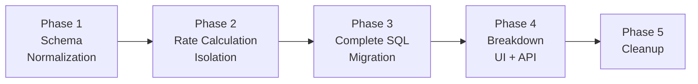

# Phased Delivery Plan

This document maps each phase to specific code artifacts, defines
validation criteria, rollback strategies, and the risk register.

---

## Decisions Pending Tech Lead Review

Three design decisions have been resolved (IQ-1, IQ-3, IQ-7). See
[README.md § Decisions Needed from Tech Lead](./README.md#decisions-needed-from-tech-lead)
for full context and PoC references.

| Decision | Status | Impact on this plan |
|----------|--------|-------------------|
| **IQ-1**: Single source of truth via RatesToUsage with aggregation | **RESOLVED** | Phase 2 replaces `usage_costs.sql` direct-write with RatesToUsage INSERT + aggregation (DELETE + INSERT). No dual-path. Fine-grained columns added to `CostModelRatesToUsage`. CI validation query verifies correctness. |
| **IQ-3**: Flat-row DB storage with both flat and nested API responses | **RESOLVED** | Phase 4 uses standard `OCPReportQueryHandler` with `provider_map.py` entry for flat view; tree view reconstructed from flat rows server-side via `?view=tree`. |
| **IQ-7**: `custom_name` optional with auto-generation | **RESOLVED** | Phase 1 `RateSerializer` uses `required=False` with auto-generation from `description` or `metric.name`. No API version bump needed. |
| **IQ-9**: Distribution per-rate identity | Open | Affects Phase 4 breakdown tree depth for distributed costs. Distribution SQL currently loses per-rate identity. See [README.md § IQ-9](./README.md#iq-9-distribution-per-rate-identity-gap). |

---

## Phase Overview



| Phase | Goal | User-Facing? | Migrations | Rollback Strategy |
|-------|------|-------------|------------|-------------------|
| 1 | Normalize rate storage | No | M1, M2, M3 | Revert code to JSON read path; dual-write preserves JSON |
| 2 | Per-rate cost tracking (usage costs only) | No | M4 | Revert code; truncate `RatesToUsage`; direct-write still active |
| 3 | Migrate all remaining SQL files | No | None | Revert individual SQL files |
| 4 | Expose breakdown data to UI | Yes | M5 | Unregister URL; leave table empty |
| 5 | Remove legacy JSON path | No | M6 | Restore from backup |

---

## Phase 1: Schema Normalization

**Goal**: Normalize rate storage without changing cost calculation behavior.

### Artifacts

| Artifact | File | Description |
|----------|------|-------------|
| `PriceList` model | `cost_models/models.py` | New Django model |
| `Rate` model | `cost_models/models.py` | New Django model with `custom_name` |
| Migration M1 | `cost_models/migrations/XXXX_create_price_list.py` | DDL for `cost_model_price_list` |
| Migration M2 | `cost_models/migrations/XXXX_create_rate.py` | DDL for `cost_model_rate` |
| Migration M3 | `cost_models/migrations/XXXX_migrate_json_to_rate.py` | Data migration: JSON → Rate rows |
| `RateSerializer` update | `cost_models/serializers.py` | Add `custom_name` field (required) |
| `CostModelSerializer` update | `cost_models/serializers.py` | Dual-write to JSON + Rate table |
| `CostModelDBAccessor` update | `masu/database/cost_model_db_accessor.py` | Read from Rate table (dual-write preserves JSON as fallback) |

### Validation

- All existing `CostModel` rows have corresponding `PriceList` + `Rate`
  rows after M3
- `custom_name` is populated for every rate (no NULLs)
- API backward-compatible: `GET /cost-models/{uuid}/` returns rates with
  `custom_name` added (existing fields unchanged)
- `CostModelDBAccessor.price_list` returns identical dict from Rate table
  as from JSON (compare with unit test)
- Cost calculation results unchanged (run existing test suite)

### Rollback

1. Revert `CostModelDBAccessor` code → reads from JSON (which is still
   populated via dual-write)
2. Revert dual-write code → API writes to JSON only
3. Reverse M3 → remove `custom_name` from JSON, delete Rate/PriceList rows
4. Drop tables via reverse M2, M1

---

## Phase 2: Rate Calculation Isolation

**Goal**: Write per-rate cost data to `CostModelRatesToUsage` for usage
costs (`usage_costs.sql` only).

> **Previously blocked by** OQ-1 and OQ-3 — both resolved. See
> [README.md](./README.md).

### Artifacts

| Artifact | File | Description |
|----------|------|-------------|
| `CostModelRatesToUsage` model | `reporting/provider/ocp/models.py` | New partitioned Django model |
| Migration M4 | `reporting/migrations/XXXX_create_rates_to_usage.py` | DDL for `cost_model_rates_to_usage` |
| RatesToUsage INSERT SQL | `masu/database/sql/openshift/cost_model/insert_usage_rates_to_usage.sql` | CTE + UNION ALL producing per-rate rows at fine granularity — **replaces** `usage_costs.sql` direct-write. See [PoC](./poc/insert_usage_rates_to_usage.sql) |
| Aggregation SQL | `masu/database/sql/openshift/cost_model/aggregate_rates_to_daily_summary.sql` | DELETE + INSERT: aggregates `RatesToUsage` → daily summary `cost_model_*_cost` columns. Replaces `usage_costs.sql` direct-write. |
| Orchestration update | `masu/processor/ocp/ocp_cost_model_cost_updater.py` | Replace `self._update_usage_costs()` with RatesToUsage INSERT + aggregation. No dual-path. |
| Accessor update | `masu/database/ocp_report_db_accessor.py` | New `populate_usage_rates_to_usage()` and `aggregate_rates_to_daily_summary()` methods; `populate_usage_costs()` retired |
| Markup → RatesToUsage | `masu/database/ocp_report_db_accessor.py` | New `populate_markup_rates_to_usage()` method (ORM INSERT into `RatesToUsage` after markup UPDATE) |
| CI Validation SQL | `masu/database/sql/openshift/cost_model/validate_rates_against_daily_summary.sql` | CI-only regression test: read-only comparison verifying aggregation correctness |
| Partition wiring | `masu/processor/ocp/ocp_cost_model_cost_updater.py` | Call `get_or_create_partition()` before writing to `RatesToUsage` (not in `UI_SUMMARY_TABLES`) |
| Purge update | `masu/processor/ocp/ocp_report_db_cleaner.py` | Add `cost_model_rates_to_usage` to `purge_expired_report_data_by_date()` |
| DELETE for recalculation | `masu/database/ocp_report_db_accessor.py` | New `delete_rates_to_usage()` method — runs before each recalculation cycle |

### Validation

- `RatesToUsage` populated with per-rate rows at fine granularity
  (matching `usage_costs.sql` GROUP BY exactly)
- **CI validation test**: `validate_rates_against_daily_summary.sql`
  confirms aggregated `RatesToUsage` values match expected daily summary
  costs at the full (namespace, node, pod_labels, volume_labels,
  persistentvolumeclaim, all_labels, day) granularity
- Existing test suite passes — aggregation produces identical daily
  summary rows to the retired `usage_costs.sql` direct-write
- Performance benchmark: query time on `RatesToUsage` AND the
  aggregation query for a tenant with 30 rates, 100 namespaces, 30 days
  of data. The JSONB columns in the aggregation GROUP BY should be
  benchmarked specifically (see risk R13). Use
  [`poc/estimate_rates_to_usage_rows.sql`](./poc/estimate_rates_to_usage_rows.sql)
  for baseline estimates (note: estimates are lower bounds — actual row
  counts will be higher with fine-grained granularity).

### Rollback

1. Revert new SQL files (`insert_usage_rates_to_usage.sql`,
   `aggregate_rates_to_daily_summary.sql`) and orchestration code
2. Restore `usage_costs.sql` direct-write call in the orchestration
   (`self._update_usage_costs(...)`) — the file itself is unchanged
3. Truncate `cost_model_rates_to_usage` partitions if needed

---

## Phase 3: Complete SQL Migration

**Goal**: Extend per-rate tracking to all remaining cost SQL files.

### Artifacts

| Artifact | File(s) | Count |
|----------|---------|-------|
| Tag rate SQL updates (`sql/`) | `infrastructure_tag_rates.sql`, `supplementary_tag_rates.sql`, `default_*_tag_rates.sql` | 4 files |
| Monthly cost SQL updates (`sql/`) | `monthly_cost_cluster_and_node.sql`, `monthly_cost_persistentvolumeclaim.sql`, `monthly_cost_persistentvolumeclaim_by_tag.sql`, `monthly_cost_virtual_machine.sql` | 4 files |
| Node tag SQL update (`sql/`) | `node_cost_by_tag.sql` | 1 file |
| Trino SQL updates (`trino_sql/`) | `hourly_cost_virtual_machine.sql`, `hourly_cost_vm_tag_based.sql`, `hourly_vm_core.sql`, `hourly_vm_core_tag_based.sql`, `monthly_vm_core.sql`, `monthly_vm_core_tag_based.sql`, `monthly_project_tag_based.sql`, `monthly_cost_gpu.sql` | 8 files |
| Self-hosted SQL updates (`self_hosted_sql/`) | Same 8 files as Trino (standard PostgreSQL syntax) | 8 files |
| Accessor updates | `ocp_report_db_accessor.py` | `populate_monthly_cost_sql()`, `populate_tag_cost_sql()`, `populate_tag_usage_costs()`, `populate_tag_usage_default_costs()`, `populate_vm_usage_costs()`, `populate_tag_based_costs()` — all pass `custom_name` and write to RatesToUsage |

**Total**: 25 SQL file modifications + 6 accessor method updates.
Each SQL file gains a RatesToUsage INSERT alongside its existing daily
summary INSERT. Aggregation (from Phase 2) already populates the daily
summary from `RatesToUsage`.

**Trino dialect note**: The 8 `trino_sql/` files must use catalog-qualified
table names for the `RatesToUsage` INSERT (e.g.,
`INSERT INTO postgres.{{schema | sqlsafe}}.cost_model_rates_to_usage`). The 8
`self_hosted_sql/` files use standard PostgreSQL syntax since they execute
against PostgreSQL via Django. See
[sql-pipeline.md § Trino/Self-Hosted Architecture](./sql-pipeline.md#trinoself-hosted-architecture).

### Validation

- All cost types flow through `RatesToUsage` (usage, monthly, tag-based)
- Aggregation (from Phase 2) continues to produce correct daily summary
  rows with the additional cost types flowing through `RatesToUsage`
- Distributed costs calculated correctly (distribution SQL is unchanged
  but verify end-to-end — it reads from aggregation output)
- Full regression: compare total costs per tenant before/after
- Tag-based costs: verify `custom_name` attached correctly (one name per
  rate, not per tag value)

### Rollback

- Per-SQL-file: revert individual SQL files to remove `RatesToUsage` INSERT
- Full revert: revert all SQL files + accessor changes; `RatesToUsage`
  can be truncated

---

## Phase 4: Breakdown UI Table + API + Frontend

**Goal**: Expose per-rate breakdown data to users.

### Artifacts

| Artifact | File | Description |
|----------|------|-------------|
| `OCPCostUIBreakDownP` model | `reporting/provider/ocp/models.py` | New partitioned Django model |
| Migration M5 | `reporting/migrations/XXXX_create_breakdown_p.py` | DDL for `reporting_ocp_cost_breakdown_p` |
| Breakdown population SQL | `masu/database/sql/openshift/ui_summary/reporting_ocp_cost_breakdown_p.sql` | Populate from `RatesToUsage` (per-rate) + daily summary (distribution back-allocation per IQ-9) with tree paths |
| Back-allocation SQL (IQ-9) | Part of `reporting_ocp_cost_breakdown_p.sql` | Split distribution `distributed_cost` into per-rate shares using `RatesToUsage` proportions. See [sql-pipeline.md](./sql-pipeline.md#back-allocation-sql-sketch) |
| `UI_SUMMARY_TABLES` update | `reporting/provider/ocp/models.py` | Add to tuple for partition cleanup |
| Provider map entry | `api/report/ocp/provider_map.py` | `cost_breakdown` report type |
| View class | `api/report/ocp/view.py` | `OCPCostBreakdownView` |
| Serializer | `api/report/ocp/serializers.py` | `CostBreakdownSerializer` |
| URL registration | `api/urls.py` | `breakdown/openshift/cost/` |
| Frontend: report type | `api/reports/report.ts` | `ReportType.costBreakdown` |
| Frontend: API path | `api/reports/ocpReports.ts` | `breakdown/openshift/cost/` |
| Frontend: flat list | `routes/details/components/costOverview/` | `CostBreakdownTable` component |
| Frontend: tab restructure | `routes/details/components/breakdown/breakdownBase.tsx` | Move usage cards to "Usage overview" tab |
| Frontend: export | `api/export/ocpExport.ts` | Breakdown CSV export |

### Validation

- Breakdown table populated correctly (spot-check against `RatesToUsage`)
- Back-allocation correctness: `SUM(per-rate distributed_cost)` per
  (namespace, node, day, distribution_type) equals the original
  `distributed_cost` row from the daily summary (rounding tolerance:
  < $0.01)
- API returns expected flat/tree structure (compare with PRD examples)
- API returns both flat and tree views correctly (`?view=flat`, `?view=tree`)
- Frontend renders breakdown table in Cost Overview tab
- Usage cards appear in new Usage Overview tab
- CSV export produces correct columns
- Existing Sankey chart still works (different data source)

### Rollback

- Don't register the URL → endpoint returns 404
- `OCPCostUIBreakDownP` can remain unpopulated (empty table)
- Revert frontend changes (tab restructure, new component)

---

## Phase 5: Cleanup

**Goal**: Remove legacy JSON rate storage path and dead `usage_costs.sql`
direct-write code.

### Artifacts

| Artifact | File | Description |
|----------|------|-------------|
| Migration M6 | `cost_models/migrations/XXXX_drop_rates_json.py` | `ALTER TABLE cost_model DROP COLUMN rates` |
| Remove dual-write | `cost_models/serializers.py` | API writes to Rate table only |
| Remove JSON read path | `masu/database/cost_model_db_accessor.py` | Remove `_price_list_from_json()` fallback |
| Remove `usage_costs.sql` direct-write | `masu/database/sql/openshift/cost_model/usage_costs.sql`, `ocp_report_db_accessor.py` | Dead code since Phase 2 aggregation took over. Remove the direct-write INSERT and its orchestration call. |
| Remove validation SQL | `masu/database/sql/openshift/cost_model/validate_rates_against_daily_summary.sql` | No longer needed once aggregation is the only path. Can be retained as a CI-only test if desired. |

### Preconditions

All of these must be verified before executing Phase 5:

- [ ] All tenants have been processed through the Rate table path
- [ ] No code path reads from `CostModel.rates` JSON
- [ ] Backup of `cost_model` table taken
- [ ] Full regression test suite passes

### Validation

- Full regression testing against all report endpoints
- Production monitoring for anomalies (cost values, API errors)
- Verify no references to `CostModel.rates` in codebase

### Rollback

- Restore `rates` column from backup
- Re-add dual-write code
- This is the only phase where rollback is practically difficult

---

## Risk Register

| ID | Risk | Severity | Likelihood | Phase | Mitigation |
|----|------|----------|------------|-------|------------|
| R1 | `usage_costs.sql` has 6 entangled CPU cost components that are hard to decompose into named rates | ~~HIGH~~ **MITIGATED** | ~~HIGH~~ LOW | 2 | **RESOLVED (OQ-1)**: All 6 map 1:1 to distinct rate metrics in `COST_MODEL_USAGE_RATES`. CTE approach avoids GROUP BY duplication. 12x row multiplier quantified. |
| R2 | Aggregation step produces different values than direct-write (rounding, NULLs, missing rows) | HIGH | MEDIUM | 2 | **RESOLVED (OQ-3)**: CI validation query compares at fine granularity (pod_labels, volume_labels, persistentvolumeclaim, all_labels). Strategy: CI regression tests + integration tests verifying aggregation correctness. Fine-grained columns on `RatesToUsage` resolve the granularity mismatch (IQ-1). |
| R3 | Row explosion in `RatesToUsage` causes query timeouts | MEDIUM | MEDIUM | 2 | 12x multiplier quantified (OQ-1). **Updated**: Fine-grained granularity increases row counts beyond the original 36M/month estimate — each unique `(pod_labels, volume_labels, persistentvolumeclaim, all_labels)` combination creates separate rows. Re-benchmark with realistic data; partition by month. |
| R4 | Monthly cost rates produce more rows than expected (per-namespace allocation) | ~~MEDIUM~~ **MITIGATED** | ~~HIGH~~ LOW | 3 | **RESOLVED (OQ-2)**: GROUP BY is `(usage_start, source_uuid, cluster_id, node, namespace, pod_labels, cost_category_id)`. Row count per monthly rate quantifiable from existing data. |
| R5 | Cost category reclassification invalidates breakdown tree | ~~MEDIUM~~ **MITIGATED** | ~~LOW~~ NONE | 4 | **RESOLVED (OQ-4)**: `CostGroupsAddView`/`CostGroupsRemoveView` already trigger `update_summary_tables` which chains into full cost model recomputation. No special handling needed. |
| R6 | 25 SQL file modifications across 3 paths introduce regressions | MEDIUM | MEDIUM | 3 | Modify one file at a time; regression tests per file; revert individual files if needed |
| R7 | Dual-write divergence (JSON and Rate table drift) | LOW | LOW | 1-4 | `_sync_rate_table` does delete-all + recreate on every write; no partial sync |
| R8 | `custom_name` migration produces ugly names for rates with empty descriptions | LOW | HIGH | 1 | Acceptable per PRD ("ugly but functional"); users can rename after migration |
| R9 | Frontend tab restructure breaks existing user workflows | LOW | LOW | 4 | Usage cards move to adjacent tab, not removed; link/breadcrumb from old location |
| R10 | Trino SQL dialect requires catalog-qualified table names for `RatesToUsage` INSERT | MEDIUM | MEDIUM | 3 | Test `trino_sql/` files with Trino locally; `self_hosted_sql/` files use standard PostgreSQL syntax and are lower risk |
| R11 | Concurrent cost model updates with overlapping date ranges create duplicate `RatesToUsage` rows | MEDIUM | LOW | 2-3 | Existing Redis lock (`WorkerCache.lock_single_task`) prevents identical `(schema, provider, start, end)` runs; DELETE-before-INSERT pattern (Step 0) clears stale rows per recalculation window; risk is limited to rare overlapping-range scenarios |
| R12 | `CostModelManager.update()` has no `@transaction.atomic` — dual-write (JSON save + Rate table sync) can partially fail | MEDIUM | MEDIUM | 1 | Add `@transaction.atomic` to `update()`. `create()` already has it. See [api-and-frontend.md](./api-and-frontend.md). |
| R13 | JSONB column equality JOINs in aggregation/validation SQL are slow on large datasets | **HIGH** | MEDIUM | 2 | The aggregation SQL (Phase 2) groups by `pod_labels`, `volume_labels`, `all_labels` (JSONB). PostgreSQL JSONB equality comparison without GIN indexes can be slow. **Mitigation**: (1) Benchmark aggregation query in Phase 2 with realistic data; (2) If slow, add a computed hash column (`md5(pod_labels::text \|\| volume_labels::text \|\| all_labels::text)`) to both tables and GROUP BY/JOIN on the hash instead; (3) GIN indexes on JSONB columns are an alternative but add write overhead. **Decision needed from tech lead.** |
| R14 | Back-allocation rounding: proportional split of `distributed_cost` to per-rate shares may produce minor rounding differences | LOW | HIGH | 4 | PostgreSQL `NUMERIC(33, 15)` provides 15 decimal places. Rounding error per row is < $0.01. **Mitigation**: Add a rounding reconciliation check in the breakdown population SQL (`SUM(per-rate shares)` vs original `distributed_cost`) and log any discrepancy > $0.01. Acceptable tolerance per existing koku cost precision. |
| R15 | Back-allocation JOIN complexity: matching distribution rows to source namespace costs and `RatesToUsage` proportions requires multi-table CTEs | MEDIUM | MEDIUM | 4 | The back-allocation SQL has 3 CTEs with JOINs across daily summary and `RatesToUsage`. **Mitigation**: (1) Benchmark with realistic data in Phase 4; (2) Source cost and rate_shares CTEs operate on source namespaces (small cardinality — typically 1 Platform namespace per cluster); (3) Indexes on `(usage_start, cluster_id, source_uuid)` cover the JOIN paths. |

### Risk × Phase Matrix

```
          Phase 1    Phase 2    Phase 3    Phase 4    Phase 5
R1          ✓          ✓ (mitigated — OQ-1 resolved)
R2                     ██ (aggregation replaces direct-write)
R3                     ██
R4          ✓          ✓          ✓ (mitigated — OQ-2 resolved)
R5          ✓          ✓          ✓          ✓ (mitigated — OQ-4 resolved)
R6                                ██
R7          ██         ██         ██         ██
R8          ██
R9                                           ██
R10                               ██
R11                    ██         ██
R12         ██
R13                    ██ (JSONB columns in aggregation GROUP BY)
R14                                         ██ (back-allocation rounding)
R15                                         ██ (back-allocation JOIN complexity)
```

---

## Future Scalability Considerations

The single-source-of-truth architecture (RatesToUsage → aggregation →
daily summary) was chosen in part because it scales better with two
upcoming features that will increase the rate calculation surface area.

### Price List Lifecycles

Multiple price lists per cost model means more rate calculations per
processing cycle. With a single source of truth, each additional price
list adds rows to `RatesToUsage` and the aggregation step folds them
into the daily summary automatically. A dual-path approach would
require updating both `usage_costs.sql` (direct-write) and the
`RatesToUsage` INSERT for every new price list configuration.

### Consumer and Provider

Multiple cost models applying to the same data multiplies the rate
calculation volume. The single-source-of-truth architecture handles
this naturally — each cost model writes its per-rate rows to
`RatesToUsage`, and aggregation produces the correct daily summary
totals. Dual-path maintenance overhead would compound with each
additional cost model.

### Architectural benefit

With the single calculation point in `RatesToUsage`, changes to rate
logic propagate automatically to both the daily summary (via
aggregation) and the breakdown table. QE validates cost correctness
once against the daily summary, rather than maintaining parallel
verification of two independent calculation paths across an expanding
set of rate configurations.

---

## Timeline Considerations

Phase 1 can start immediately — it has no open questions. The
`_price_list_from_rate_table()` format compatibility has been validated
by PoC tests ([`poc/price_list_compat.py`](./poc/price_list_compat.py),
6/6 pass).

Phase 2 is **unblocked** — all four open questions (OQ-1 through OQ-4)
have been resolved via source code triage, and IQ-1 has been confirmed
by the tech lead (single source of truth via aggregation, no dual-path).
The RatesToUsage INSERT SQL has been prototyped
([`poc/insert_usage_rates_to_usage.sql`](./poc/insert_usage_rates_to_usage.sql)).
Implementation can proceed immediately after Phase 1 ships. Key Phase 2
risk to monitor: R13 (JSONB column performance in aggregation).

Phases 3 and 4 can overlap: Phase 3 SQL changes are independent of
Phase 4 API/frontend work, as long as Phase 2 is complete. The
breakdown table population SQL has been prototyped
([`poc/reporting_ocp_cost_breakdown_p.sql`](./poc/reporting_ocp_cost_breakdown_p.sql)).

Phase 5 should only run after Phase 4 has been validated in production
for a sufficient period (recommended: at least one full billing cycle).

### Blocking dependencies

```
Phase 1 ← no blockers (start now)
Phase 2 ← Phase 1 (IQ-1 confirmed — single source of truth, no dual-path)
Phase 3 ← Phase 2 + R13 benchmark acceptable
Phase 4 ← Phase 3 (IQ-3 confirmed — flat DB rows, both API formats)
Phase 5 ← Phase 4 validated in production
```
