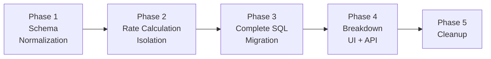

# Phased Delivery Plan

This document maps each phase to specific code artifacts, defines
validation criteria, rollback strategies, and the [risk register](./risk-register.md).

---

## Decisions Pending Tech Lead Review

Four design decisions have been resolved (IQ-1, IQ-3, IQ-7, IQ-9). See
[README.md § Decisions Needed from Tech Lead](./README.md#decisions-needed-from-tech-lead)
for full context and PoC references.

| Decision | Status | Impact on this plan |
|----------|--------|-------------------|
| **IQ-1**: Single source of truth via RatesToUsage with aggregation | **RESOLVED** | Phase 2 replaces `usage_costs.sql` direct-write with RatesToUsage INSERT + aggregation (DELETE + INSERT). No dual-path. Fine-grained columns added to `RatesToUsage`. CI validation query verifies correctness. |
| **IQ-3**: Flat-row DB storage with both flat and nested API responses | **RESOLVED** | Phase 4 uses standard `OCPReportQueryHandler` with `provider_map.py` entry for flat view; tree view reconstructed from flat rows server-side via `?view=tree`. |
| **IQ-7**: `custom_name` optional with auto-generation | **RESOLVED** | Phase 1 `RateSerializer` uses `required=False` with auto-generation from `description` or `metric.name`. No API version bump needed. |
| **IQ-9**: Distribution per-rate identity | **RESOLVED** | Distribution SQL rewritten (Option 1): new files read per-rate costs from `RatesToUsage` + usage metrics from daily summary, write distributed rows back to `RatesToUsage`. Old distribution files deprecated for rollback. Phase 4 breakdown table reads from single source (`RatesToUsage`). |

---

## Phase Overview



| Phase | Goal | User-Facing? | Migrations | Rollback Strategy |
|-------|------|-------------|------------|-------------------|
| (prereq) | PriceList infrastructure | No | COST-575: 0010, 0011 | Already on `main` |
| 1 | Normalize rate storage | No | M1, M2 | Drop Rate table; revert JSON; PriceList stays (COST-575) |
| 2 | Per-rate cost tracking (usage costs only) | No | M3 | Revert code; truncate `RatesToUsage`; direct-write still active |
| 3 | Migrate all remaining SQL files | No | None | Revert individual SQL files |
| 4 | Expose breakdown data to UI | Yes | M4 | Unregister URL; leave table empty |
| 5 | Remove legacy JSON path | No | M5 | Restore from backup |

### `rate_id` Enforcement by Phase

The target architecture uses `rate_id` as a durable FK link from
`RatesToUsage` to `Rate`. This capability is built incrementally —
**the database does not enforce it until the SQL INSERT paths are
updated in Phase 2+**. The table below clarifies what is actually
enforced vs. aspirational in each phase.

| Phase | `Rate` table | `rate_id` in API | `rate_id` in SQL INSERT | FK mode | CASCADE safe? |
|-------|-------------|-----------------|------------------------|---------|---------------|
| 1 | Created and populated | GET emits it; PUT accepts it | **Not populated** (`NULL`) | `SET_NULL` | No — NULL FKs don't cascade |
| 2 | Stable UUIDs (diff-based sync) | Round-tripped by clients | **Populated** (usage costs SQL) | `SET_NULL` → benchmarks | Pending benchmarks |
| 3 | Same as Phase 2 | Same | Populated (all 25 SQL files) | Same | Same |
| 4 | Same | Same | Populated (distribution SQL) | Switch to `CASCADE` if benchmarks pass | Yes |
| 5 | Same | Same | Same | `CASCADE` | Yes |

> **Important**: Until Phase 2 ships, `RatesToUsage.rate_id = NULL` for
> all rows. JOINs from `RatesToUsage` to `Rate` and CASCADE deletes
> have **no effect**. Do not assume FK continuity is active before
> Phase 2 is deployed and validated.

---

## Phase 1: Schema Normalization

**Goal**: Normalize rate storage without changing cost calculation behavior.

**Prerequisite**: COST-575 migrations `0010` (PriceList + PriceListCostModelMap
models) and `0011` (data migration copying CostModel.rates to PriceList.rates)
are already on `main`. Phase 1 builds on this foundation by adding a
normalized `Rate` table underneath the existing `PriceList`.

### Artifacts

| Artifact | File | Description |
|----------|------|-------------|
| `Rate` model | `cost_models/models.py` | New Django model with `custom_name`, FK to existing `PriceList` |
| Migration M1 | `cost_models/migrations/0012_create_rate.py` | DDL for `cost_model_rate` (depends on `0011`) |
| Migration M2 | `cost_models/migrations/0013_migrate_json_to_rate.py` | Data migration: PriceList.rates JSON → Rate rows |
| `RateSerializer` update | `cost_models/serializers.py` | Add `custom_name` field (`required=False`) |
| `CostModelSerializer` update | `cost_models/serializers.py` | Extend dual-write: JSON + PriceList.rates + Rate table |
| `CostModelManager` update | `cost_models/cost_model_manager.py` | Add `_sync_rate_table()` — diff-based sync (match by `rate_id` or `custom_name`; delete → update → create) preserving stable Rate UUIDs |
| Write-freeze flag helper | `masu/processor/__init__.py` | `is_cost_model_writes_disabled()` — Unleash flag to block cost model writes during migration |
| Write-freeze gating | `cost_models/serializers.py` | Check flag in `CostModelSerializer.create()` and `update()` via `self.customer.schema_name` → HTTP 503 |
| `CostModelDBAccessor` update | `masu/database/cost_model_db_accessor.py` | Read from Rate table via PriceListCostModelMap (dual-write preserves JSON as fallback) |

### Deployment Procedure for M2

1. Enable Unleash flag `cost-management.backend.disable-cost-model-writes`
   (blocks cost model API writes with HTTP 503)
2. Run `django-admin migrate` (executes M1 + M2)
3. Validate: all `PriceList` rows with rates have corresponding `Rate` rows
4. Disable Unleash flag (restores normal API writes)

### Validation

- All existing `PriceList` rows with non-empty rates have corresponding
  `Rate` rows after M2
- `custom_name` is populated for every rate (no NULLs)
- API backward-compatible: `GET /cost-models/{uuid}/` returns rates with
  `custom_name` added (existing fields unchanged)
- `CostModelDBAccessor.price_list` returns identical dict from Rate table
  as from JSON (compare with unit test)
- Cost calculation results unchanged (run existing test suite)

### Rollback

1. Revert `CostModelDBAccessor` code → reads from JSON (which is still
   populated via dual-write)
2. Revert `_sync_rate_table()` code → API writes to JSON + PriceList.rates only
3. Reverse M2 → remove `custom_name` from JSON blobs, delete Rate rows
4. Drop Rate table via reverse M1
5. PriceList and PriceListCostModelMap remain untouched (COST-575 owns them)

---

## Phase 2: Rate Calculation Isolation

**Goal**: Write per-rate cost data to `RatesToUsage` for usage
costs (`usage_costs.sql` only).

> **Previously blocked by** OQ-1 and OQ-3 — both resolved. See
> [README.md](./README.md).

### Artifacts

| Artifact | File | Description |
|----------|------|-------------|
| `RatesToUsage` model | `reporting/provider/ocp/models.py` | New partitioned Django model |
| Migration M3 | `reporting/migrations/XXXX_create_rates_to_usage.py` | DDL for `rates_to_usage` |
| RatesToUsage INSERT SQL | `masu/database/sql/openshift/cost_model/insert_usage_rates_to_usage.sql` | CTE + UNION ALL producing per-rate rows at fine granularity — **replaces** `usage_costs.sql` direct-write. See [PoC](./poc/insert_usage_rates_to_usage.sql) |
| Aggregation SQL | `masu/database/sql/openshift/cost_model/aggregate_rates_to_daily_summary.sql` | DELETE + INSERT: aggregates `RatesToUsage` → daily summary `cost_model_*_cost` columns. Replaces `usage_costs.sql` direct-write. |
| Orchestration update | `masu/processor/ocp/ocp_cost_model_cost_updater.py` | Replace `self._update_usage_costs()` with RatesToUsage INSERT + aggregation. No dual-path. |
| Accessor update | `masu/database/ocp_report_db_accessor.py` | New `populate_usage_rates_to_usage()` and `aggregate_rates_to_daily_summary()` methods; `populate_usage_costs()` retired |
| Markup → RatesToUsage | `masu/database/ocp_report_db_accessor.py` | New `populate_markup_rates_to_usage()` method (ORM INSERT into `RatesToUsage` after markup UPDATE) |
| CI Validation SQL | `masu/database/sql/openshift/cost_model/validate_rates_against_daily_summary.sql` | CI-only regression test: read-only comparison verifying aggregation correctness |
| Partition wiring | `masu/processor/ocp/ocp_cost_model_cost_updater.py` | Call `get_or_create_partition()` before writing to `RatesToUsage` (not in `UI_SUMMARY_TABLES`) |
| Purge update | `masu/processor/ocp/ocp_report_db_cleaner.py` | Add `rates_to_usage` to `purge_expired_report_data_by_date()` |
| DELETE for recalculation | `masu/database/ocp_report_db_accessor.py` | New `delete_rates_to_usage()` method — runs before each recalculation cycle |
| Prometheus instrumentation | `masu/prometheus_stats.py`, `masu/processor/ocp/ocp_cost_model_cost_updater.py` | Histograms and gauge for cost model pipeline timing and row counts. See [Concern 2 resolution](#concern-2-resolution--observability-instrumentation). |

### Concern 2 Resolution — Observability Instrumentation

`ocp_cost_model_cost_updater.py` currently has zero timing
instrumentation. The only related Prometheus metric is
`charge_update_attempts_count` (a task attempt counter in
`masu/prometheus_stats.py`). Koku has Prometheus infrastructure in
place (`WORKER_REGISTRY` in `masu/prometheus_stats.py`, exposed via
`/metrics` in `koku/probe_server.py`, Grafana dashboards in
`dashboards/`), but the cost model calculation pipeline is not
instrumented.

Phase 2 adds the following metrics, registered in
`masu/prometheus_stats.py` using `WORKER_REGISTRY` (existing pattern):

| Metric | Type | Labels | Threshold |
|--------|------|--------|-----------|
| `cost_model_rtu_insert_duration_seconds` | Histogram | `schema`, `source_uuid` | Benchmark #2: < 60s |
| `cost_model_aggregation_duration_seconds` | Histogram | `schema`, `source_uuid` | Benchmark #3: < 30s |
| `cost_model_rtu_row_count` | Gauge | `schema`, `source_uuid` | Benchmark #1: < 100M/month |
| `cost_model_update_total_duration_seconds` | Histogram | `schema`, `source_uuid` | Benchmark #7: < 5 min |

Instrumentation is added in `ocp_cost_model_cost_updater.py` around
the `RatesToUsage` INSERT, aggregation, and end-to-end update calls
using `time.perf_counter()` (same pattern as other koku timing code).

Thresholds mirror the Phase 2 benchmark acceptance criteria, enabling
Grafana dashboard panels and alerting rules to monitor the new pipeline
in production.

### Validation

- `RatesToUsage` populated with per-rate rows at fine granularity
  (matching `usage_costs.sql` GROUP BY exactly)
- **CI validation test**: `validate_rates_against_daily_summary.sql`
  confirms aggregated `RatesToUsage` values match expected daily summary
  costs at the full (namespace, node, pod_labels, volume_labels,
  persistentvolumeclaim, all_labels, day) granularity
- Existing test suite passes — aggregation produces identical daily
  summary rows to the retired `usage_costs.sql` direct-write
- Performance benchmark: query time on `RatesToUsage` AND the
  aggregation query for a tenant with 30 rates, 100 namespaces, 30 days
  of data. The JSONB columns in the aggregation GROUP BY should be
  benchmarked specifically (see risk R13). Use
  [`poc/estimate_rates_to_usage_rows.sql`](./poc/estimate_rates_to_usage_rows.sql)
  for baseline estimates (note: estimates are lower bounds — actual row
  counts will be higher with fine-grained granularity).

### R2/R3 Mitigation — Phase 2 Benchmarking Plan

See [risk-register.md § R2/R3](./risk-register.md#r2r3--aggregation-correctness-and-row-explosion) for the DELETE+INSERT decision rationale.

#### Why these benchmark thresholds

Before declaring Phase 2 complete, run these benchmarks against a
staging environment with realistic data. Use the largest available
tenant (or synthetic data matching production scale).

**Test configuration**: 30 rate types configured, 100 namespaces,
1000 nodes, 30 days of data, varying `pod_labels` cardinality.

The thresholds below are derived from koku's existing performance
envelope. Current `usage_costs.sql` processing completes in seconds for
typical tenants and < 60 seconds for the largest. Since the new pipeline
adds a RatesToUsage INSERT *and* an aggregation step (two queries
instead of one), we allow 2× the existing budget: 60s INSERT + 30s
aggregation = 90s vs current ~60s. The 5-minute end-to-end threshold
accounts for all steps (including distribution and UI summary, which
are unchanged).

| # | Benchmark | Acceptance Criteria | Risk |
|---|-----------|-------------------|------|
| 1 | `RatesToUsage` row count per month | < 100M rows/month (based on [`poc/estimate_rates_to_usage_rows.sql`](./poc/estimate_rates_to_usage_rows.sql) × fine-grained multiplier) | R3 |
| 2 | `insert_usage_rates_to_usage.sql` execution time | < 60 seconds per (source, rate_type, date range) | R3 |
| 3 | `aggregate_rates_to_daily_summary.sql` execution time | < 30 seconds per (source, date range) | R2, R13 |
| 4 | CI validation query: zero diff rows | All diffs = 0 (within NUMERIC precision) | R2 |
| 5 | `label_hash` index effectiveness | `EXPLAIN ANALYZE` shows index scan on `ratestousage_label_hash_idx` in aggregation | R13 |
| 6 | Markup ORM method processing time | < 30 seconds per (source, date range). If exceeded, switch to SQL fallback (R17). | R17 |
| 7 | End-to-end cost model update time | < 5 minutes per source (including distribution + UI summary) | R2, R3 |
| 8 | Partition size on disk | < 2 GB per monthly partition for `rates_to_usage` | R3 |

**If any benchmark fails**: Investigate and document findings before
proceeding to Phase 3. Key levers: reduce `pod_labels` cardinality
via hash-based grouping, optimize indexes, or adjust the fine-grained
columns to use `label_hash` only (dropping raw JSONB from GROUP BY).

### Rollback

1. Revert new SQL files (`insert_usage_rates_to_usage.sql`,
   `aggregate_rates_to_daily_summary.sql`) and orchestration code
2. Restore `usage_costs.sql` direct-write call in the orchestration
   (`self._update_usage_costs(...)`) — the file itself is unchanged
3. Truncate `rates_to_usage` partitions if needed

---

## Phase 3: Complete SQL Migration

**Goal**: Extend per-rate tracking to all remaining cost SQL files.

### Artifacts

| Artifact | File(s) | Count |
|----------|---------|-------|
| Tag rate SQL updates (`sql/`) | `infrastructure_tag_rates.sql`, `supplementary_tag_rates.sql`, `default_*_tag_rates.sql` | 4 files |
| Monthly cost SQL updates (`sql/`) | `monthly_cost_cluster_and_node.sql`, `monthly_cost_persistentvolumeclaim.sql`, `monthly_cost_persistentvolumeclaim_by_tag.sql`, `monthly_cost_virtual_machine.sql` | 4 files |
| Node tag SQL update (`sql/`) | `node_cost_by_tag.sql` | 1 file |
| Trino SQL updates (`trino_sql/`) | `hourly_cost_virtual_machine.sql`, `hourly_cost_vm_tag_based.sql`, `hourly_vm_core.sql`, `hourly_vm_core_tag_based.sql`, `monthly_vm_core.sql`, `monthly_vm_core_tag_based.sql`, `monthly_project_tag_based.sql`, `monthly_cost_gpu.sql` | 8 files |
| Self-hosted SQL updates (`self_hosted_sql/`) | Same 8 files as Trino (standard PostgreSQL syntax) | 8 files |
| Accessor updates | `ocp_report_db_accessor.py` | `populate_monthly_cost_sql()`, `populate_tag_cost_sql()`, `populate_tag_usage_costs()`, `populate_tag_usage_default_costs()`, `populate_vm_usage_costs()`, `populate_tag_based_costs()` — all pass `custom_name` and write to RatesToUsage |

**Total**: 25 SQL file modifications + 6 accessor method updates.
Each SQL file gains a RatesToUsage INSERT alongside its existing daily
summary INSERT. Aggregation (from Phase 2) already populates the daily
summary from `RatesToUsage`.

**Trino dialect note**: The 8 `trino_sql/` files must use catalog-qualified
table names for the `RatesToUsage` INSERT (e.g.,
`INSERT INTO postgres.{{schema | sqlsafe}}.rates_to_usage`). The 8
`self_hosted_sql/` files use standard PostgreSQL syntax since they execute
against PostgreSQL via Django. See
[sql-pipeline.md § Trino/Self-Hosted Architecture](./sql-pipeline.md#trinoself-hosted-architecture).

### Validation

- All cost types flow through `RatesToUsage` (usage, monthly, tag-based)
- Aggregation (from Phase 2) continues to produce correct daily summary
  rows with the additional cost types flowing through `RatesToUsage`
- Distributed costs: per-rate distribution SQL ships in **Phase 4** (IQ-9 Option 1 — 5 new files); Phase 3 verifies aggregation and daily summary with the additional cost types end-to-end using existing distribution until Phase 4 lands
- Full regression: compare total costs per tenant before/after
- Tag-based costs: verify `custom_name` attached correctly (one name per
  rate, not per tag value)

### R6 Mitigation — SQL File Testing Checklist

See [risk-register.md § R6](./risk-register.md#r6--sql-file-modification-regressions) for the per-file-per-PR decision rationale.

Trivially identical files (e.g., `infrastructure_tag_rates.sql` and
`supplementary_tag_rates.sql` which differ only in cost type) can be
combined into one PR if the reviewer agrees they are structurally
identical.

Each of the 25 SQL files must pass these checks before merging:

| # | Check | How |
|---|-------|-----|
| 1 | `RatesToUsage` INSERT produces expected row count | `SELECT COUNT(*)` with known cost model configuration |
| 2 | `custom_name` matches the `Rate.custom_name` for the rate being processed | Spot-check first 10 rows |
| 3 | `metric_type` is correct for the rate (cpu/memory/storage/gpu) | `SELECT DISTINCT metric_type` |
| 4 | `calculated_cost` matches the existing daily summary value for that rate | CI validation query (from Phase 2) |
| 5 | `label_hash` is populated and matches `md5(pod_labels \|\| volume_labels \|\| all_labels)` | `SELECT COUNT(*) WHERE label_hash IS NULL` = 0 |
| 6 | Aggregation output unchanged after adding the file | Compare daily summary totals before/after |
| 7 | Trino dialect correct (catalog-qualified names, `uuid()`, `CAST`) | Run against Trino-enabled dev environment |
| 8 | Self-hosted variant uses PostgreSQL syntax | Run against PostgreSQL directly |

**Ordering**: PostgreSQL path first (lower risk), then Trino, then
self-hosted (mirrors Trino). Tag-rate files before monthly-cost files
(simpler modifications first).

### Rollback

- Per-SQL-file: revert individual SQL files to remove `RatesToUsage` INSERT
- Full revert: revert all SQL files + accessor changes; `RatesToUsage`
  can be truncated

---

## Phase 4: Breakdown UI Table + API + Frontend

**Goal**: Expose per-rate breakdown data to users.

### Artifacts

| Artifact | File | Description |
|----------|------|-------------|
| `OCPCostUIBreakDownP` model | `reporting/provider/ocp/models.py` | New partitioned Django model |
| Migration M4 | `reporting/migrations/XXXX_create_breakdown_p.py` | DDL for `reporting_ocp_cost_breakdown_p` |
| Breakdown population SQL | `masu/database/sql/openshift/ui_summary/reporting_ocp_cost_breakdown_p.sql` | Populate from **single source** `RatesToUsage` (per-rate costs and per-rate distributed rows after IQ-9 Option 1) with tree paths — no separate back-allocation in breakdown SQL |
| Distribution per-rate SQL (IQ-9 Option 1) | 5 new distribution SQL files | Read per-rate costs from `RatesToUsage` + usage from daily summary, write per-rate distributed rows back to `RatesToUsage`. Old files deprecated. |
| `UI_SUMMARY_TABLES` update | `reporting/provider/ocp/models.py` | Add to tuple for partition cleanup |
| Provider map entry | `api/report/ocp/provider_map.py` | `cost_breakdown` report type |
| View class | `api/report/ocp/view.py` | `OCPCostBreakdownView` |
| Serializers | `api/report/ocp/serializers.py` | `CostBreakdownFlatItemSerializer` + `CostBreakdownTreeNodeSerializer` (IQ-3) |
| URL registration | `api/urls.py` | `breakdown/openshift/cost/` |
| Frontend: report type | `api/reports/report.ts` | `ReportType.costBreakdown` |
| Frontend: API path | `api/reports/ocpReports.ts` | `breakdown/openshift/cost/` |
| Frontend: flat list | `routes/details/components/costOverview/` | `CostBreakdownTable` component |
| Frontend: tab restructure | `routes/details/components/breakdown/breakdownBase.tsx` | Move usage cards to "Usage overview" tab |
| Frontend: export | `api/export/ocpExport.ts` | Breakdown CSV export |
| Distribution integration tests | `masu/test/database/test_ocp_report_db_accessor.py` | Execute actual distribution SQL against test data (not mocked); assert per-rate proportional correctness and edge cases. See [Concern 1 resolution](#concern-1-resolution--distribution-integration-tests). |

### Concern 1 Resolution — Distribution Integration Tests

Existing distribution tests in `test_ocp_report_db_accessor.py` mock
`_execute_raw_sql_query` and assert orchestration (method was called),
not mathematical correctness. The distribution SQL files contain
commented-out validation SQL that is never executed by tests. This means
R18's original mitigation ("existing integration tests sufficient") only
verifies the code path, not the numbers.

Phase 4 adds integration tests that execute the actual distribution SQL
against the test database (using `OCPReportDBAccessor` without mocking
the SQL execution layer) and assert:

1. Per-rate proportional correctness:
   `distributed_cost[rate] / total_distributed == rate_cost / total_cost`
2. `SUM(per-rate distributed rows)` = aggregate `distributed_cost` per
   (namespace, day, distribution_type)
3. No orphaned distributed rows (every row traces to a valid source)
4. Edge cases: single-node clusters (100% to one node), zero-cost
   namespaces (no divide-by-zero), GPU distribution by GPU-specific
   metrics
5. **Independent cross-check (Option 2's formula)**: Compute the expected
   per-rate distributed cost by proportionally splitting the daily
   summary's aggregate `distributed_cost` by `rate_cost / total_cost`.
   Assert it matches the actual per-rate `RatesToUsage` distributed rows
   within NUMERIC(33,15) precision. This encodes Option 2's back-allocation
   math as a test assertion — the mathematical safety net that Option 2
   would have provided in production.
6. **Cost conservation**: Net `SUM(distributed_cost)` across source
   (negative) + recipient (positive) rows = 0 per (day,
   distribution_type). Total distributed to recipients equals total
   removed from source namespaces.
7. **Sign invariant**: Source namespace rows have negative
   `distributed_cost`, recipient rows have positive, for each (day,
   distribution_type, rate).
8. **Idempotency**: Run distribution twice → identical `RatesToUsage`
   state. The DELETE + INSERT pattern guarantees this; the test confirms
   no duplication or partial deletes.
9. **Multi-rate proportionality**: With rate A at cost 3× rate B,
   `distributed_cost[A] / distributed_cost[B] = 3` for the same
   (namespace, day). Tests with 3+ rates of varying magnitudes.
10. **Rate mutation regression**: Modify a rate value, trigger
    recalculation, and verify distributed costs reflect the updated
    value (no stale cached amounts surviving recalculation).

These 10 assertions collectively replicate the safety net that IQ-9
Option 2 (back-allocation) would have provided at runtime. The tech lead
should be aware that these tests are now the sole verification mechanism
for per-rate distribution correctness, replacing Option 2 as the
fallback.

### Validation

- Breakdown table populated correctly (spot-check against `RatesToUsage`)
- Distribution per-rate correctness: `SUM(distributed_cost)` per
  (namespace, node, day, distribution_type) in `RatesToUsage` matches expected proportional allocation. No rounding concern — distribution writes exact proportional values.
- API returns expected flat/tree structure (compare with PRD examples)
- API returns both flat and tree views correctly (`?view=flat`, `?view=tree`)
- Frontend renders breakdown table in Cost Overview tab
- Usage cards appear in new Usage Overview tab
- CSV export produces correct columns
- Existing Sankey chart still works (different data source)

### Rollback

- Don't register the URL → endpoint returns 404
- `OCPCostUIBreakDownP` can remain unpopulated (empty table)
- Revert frontend changes (tab restructure, new component)

---

## Phase 5: Cleanup

**Goal**: Remove legacy JSON rate storage path and dead `usage_costs.sql`
direct-write code.

### Artifacts

| Artifact | File | Description |
|----------|------|-------------|
| Migration M5 | `cost_models/migrations/XXXX_drop_rates_json.py` | `ALTER TABLE cost_model DROP COLUMN rates` + `ALTER TABLE price_list DROP COLUMN rates` |
| Remove dual-write | `cost_models/serializers.py` | API writes to Rate table only |
| Remove JSON read path | `masu/database/cost_model_db_accessor.py` | Remove `_price_list_from_json()` fallback |
| Remove `usage_costs.sql` direct-write | `masu/database/sql/openshift/cost_model/usage_costs.sql`, `ocp_report_db_accessor.py` | Dead code since Phase 2 aggregation took over. Remove the direct-write INSERT and its orchestration call. |
| Remove validation SQL | `masu/database/sql/openshift/cost_model/validate_rates_against_daily_summary.sql` | No longer needed once aggregation is the only path. Can be retained as a CI-only test if desired. |

### Preconditions

All of these must be verified before executing Phase 5:

- [ ] All tenants have been processed through the Rate table path
- [ ] No code path reads from `CostModel.rates` JSON
- [ ] Backup of `cost_model` and `price_list` tables taken
- [ ] Full regression test suite passes
- [ ] Unleash write-freeze flag (`cost-management.backend.disable-cost-model-writes`) enabled

### Validation

- Full regression testing against all report endpoints
- Production monitoring for anomalies (cost values, API errors)
- Verify no references to `CostModel.rates` in codebase

### Rollback

- Restore `rates` column on both `cost_model` and `price_list` from backup
- Re-add dual-write code
- This is the only phase where rollback is practically difficult

---

## Risk Register

Full details, decision rationales, and mitigation plans are in
[risk-register.md](./risk-register.md).

| ID | Risk | Status |
|----|------|--------|
| R1 | 6 entangled CPU cost components | **MITIGATED** |
| R2 | Aggregation value mismatch | Active |
| R3 | Row explosion in `RatesToUsage` | Active |
| R4 | Monthly cost row counts | **MITIGATED** |
| R5 | Cost category reclassification | **MITIGATED** |
| R6 | 25 SQL file modifications | Active |
| R7 | Dual-write divergence | Active |
| R8 | `custom_name` ugly names | Active |
| R9 | Frontend tab restructure | Active |
| R10 | Trino SQL dialect | Active |
| R11 | Concurrent updates | Active |
| R12 | Missing `@transaction.atomic` | **MITIGATED** |
| R13 | JSONB JOIN performance | **MITIGATED** |
| R14 | Back-allocation rounding | **N/A** |
| R15 | Back-allocation JOIN complexity | **REPLACED** |
| R16 | Aggregation GROUP BY granularity | Active |
| R17 | Markup ORM overhead | **MITIGATED** |
| R18 | Distribution SQL rewrite regression | Active |
| R19 | Aggregation + `distributed_cost` | **RESOLVED** |
| R20 | Migration write-corruption | **MITIGATED** |

### Risk × Phase Matrix

See [risk-register.md § Risk × Phase Matrix](./risk-register.md#risk--phase-matrix).

---

## Future Scalability Considerations

The single-source-of-truth architecture (RatesToUsage → aggregation →
daily summary) was chosen in part because it scales better with two
upcoming features that will increase the rate calculation surface area.

### Price List Lifecycles

Multiple price lists per cost model means more rate calculations per
processing cycle. With a single source of truth, each additional price
list adds rows to `RatesToUsage` and the aggregation step folds them
into the daily summary automatically. A dual-path approach would
require updating both `usage_costs.sql` (direct-write) and the
`RatesToUsage` INSERT for every new price list configuration.

### Consumer and Provider

Multiple cost models applying to the same data multiplies the rate
calculation volume. The single-source-of-truth architecture handles
this naturally — each cost model writes its per-rate rows to
`RatesToUsage`, and aggregation produces the correct daily summary
totals. Dual-path maintenance overhead would compound with each
additional cost model.

### Architectural benefit

With the single calculation point in `RatesToUsage`, changes to rate
logic propagate automatically to both the daily summary (via
aggregation) and the breakdown table. QE validates cost correctness
once against the daily summary, rather than maintaining parallel
verification of two independent calculation paths across an expanding
set of rate configurations.

---

## Timeline Considerations

Phase 1 can start immediately — COST-575 prerequisites are on `main`
(migrations `0010`, `0011`) and all open questions are resolved. The
`_price_list_from_rate_table()` format compatibility has been validated
by PoC tests ([`poc/price_list_compat.py`](./poc/price_list_compat.py),
6/6 pass).

Phase 2 is **unblocked** — all four open questions (OQ-1 through OQ-4)
have been resolved via source code triage, and IQ-1 has been confirmed
by the tech lead (single source of truth via aggregation, no dual-path).
The RatesToUsage INSERT SQL has been prototyped
([`poc/insert_usage_rates_to_usage.sql`](./poc/insert_usage_rates_to_usage.sql)).
Implementation can proceed immediately after Phase 1 ships. Key Phase 2
risk to monitor: R13 (JSONB column performance in aggregation).

Phases 3 and 4 can overlap: Phase 3 SQL changes are independent of
Phase 4 API/frontend work, as long as Phase 2 is complete. The
breakdown table population SQL has been prototyped
([`poc/reporting_ocp_cost_breakdown_p.sql`](./poc/reporting_ocp_cost_breakdown_p.sql)).

Phase 5 should only run after Phase 4 has been validated in production
for a sufficient period (recommended: at least one full billing cycle).

### Blocking dependencies

```
Phase 1 ← COST-575 on main (0010, 0011) ✅
Phase 2 ← Phase 1 (IQ-1 confirmed — single source of truth, no dual-path)
Phase 3 ← Phase 2 + R13 benchmark acceptable
Phase 4 ← Phase 3 (IQ-3 confirmed — flat DB rows, both API formats)
Phase 5 ← Phase 4 validated in production
```

---

## Changelog

| Version | Date | Summary |
|---------|------|---------|
| v1.0 | 2026-03-17 | Initial: 5-phase delivery plan, artifact lists per phase, validation criteria, rollback strategies, risk register (R1-R12), risk × phase matrix, timeline and blocking dependencies. |
| v2.0 | 2026-03-17 | IQ-1 resolved: rewrite Phase 2 artifacts (usage_costs.sql replaced, validate moved to CI-only). Remove dual-path validation references. Update risk register (R2, R3 revised, R13 added). Update blocking dependencies. |
| v2.2 | 2026-03-17 | IQ-3/IQ-7 resolved, IQ-9 added: update decisions table. Add back-allocation SQL to Phase 4 artifacts and validation. Add risks R14 (rounding) and R15 (JOIN complexity). Add "Future Scalability Considerations" section. |
| v2.3 | 2026-03-17 | Blast-radius triage: fix Phase 4 serializer reference (two serializers, not one). Add R16 (aggregation GROUP BY granularity) and R17 (markup ORM overhead). Update risk × phase matrix. |
| v2.4 | 2026-03-17 | Risk mitigation: R13 downgraded to MITIGATED (label_hash). R6 — add 8-point SQL testing checklist for Phase 3. R2/R3 — add Phase 2 benchmarking plan with 8 acceptance criteria. Update R2, R3, R6, R14, R17 mitigation descriptions in risk register. |
| v2.5 | 2026-03-17 | Decision rationales: add alternatives-evaluated tables for R6 (per-file-per-PR, 4 options) and R2/R3 (DELETE+INSERT aggregation, 3 options + threshold derivation). |
| v3.0 | 2026-03-19 | **IQ-9 RESOLVED (Option 1).** Phase 4: replace back-allocation with 5 new per-rate distribution SQL files. Risk register: R14 eliminated, R15 replaced, R18 added (distribution rewrite regression). Rename `CostModelRatesToUsage` → `RatesToUsage`. |
| v3.1 | 2026-03-19 | **Risk extraction.** Move full risk register and decision rationales to [risk-register.md](./risk-register.md). Compact risk table retained here. Add R19. Replace R2/R3 and R6 rationale tables with links. |
| v4.0 | 2026-04-02 | **Align with COST-575.** Phase 1 prerequisite: COST-575 0010/0011 on `main`. Remove M1 (PriceList creation). Phase 1 artifacts: `Rate` model + M1 (Rate table) + M2 (data migration). Renumber M4→M3, M5→M4, M6→M5. Phase 1 rollback updated: PriceList stays (COST-575 owns it). Phase 5 drops both `CostModel.rates` and `PriceList.rates`. |
| v4.1 | 2026-04-02 | **R20: Migration write-freeze.** Add Unleash write-freeze flag to Phase 1 artifacts. Add deployment procedure for M2 (enable/disable flag around migration). Add flag to Phase 5 preconditions. Add R20 to risk summary. |
| v4.2 | 2026-04-02 | **Critical review.** Move write-freeze gating artifact from `cost_model_manager.py` to `serializers.py` (serializer has schema context). |
| v4.3 | 2026-04-02 | **Self-resolve concerns 1, 2.** Add distribution integration tests as Phase 4 artifact (Concern 1). Add Prometheus instrumentation as Phase 2 artifact (Concern 2). |
| v4.4 | 2026-04-03 | **Strengthen Concern 1 tests.** Expand distribution integration test assertions from 4 to 10. Add Option 2's back-allocation formula as independent cross-check (#5), cost conservation (#6), sign invariant (#7), idempotency (#8), multi-rate proportionality (#9), rate mutation regression (#10). These replace Option 2 as the safety net for per-rate distribution correctness. |
