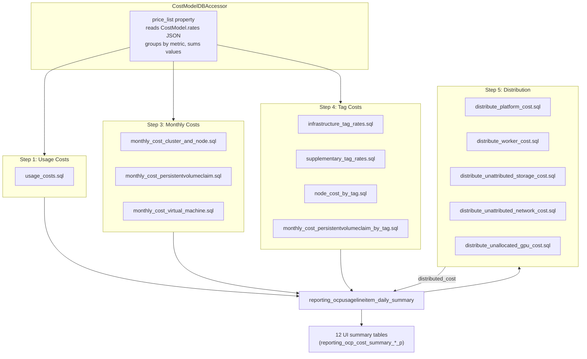

# SQL Pipeline Changes

This document describes how the cost calculation SQL pipeline changes to
support per-rate cost tracking via `CostModelRatesToUsage`.

> **See also**: OQ-1 and OQ-2 in [README.md](./README.md) — both resolved.
> OQ-1 confirms 12× row multiplication; OQ-2 confirms monthly cost row
> granularity is finer than one-per-namespace-node-day.

**Prerequisite**: [cost-models.md § Cost Calculation Pipeline](../cost-models.md#cost-calculation-pipeline)

---

## Current Pipeline

### Orchestration Order

`OCPCostModelCostUpdater.update_summary_cost_model_costs()` in
`masu/processor/ocp/ocp_cost_model_cost_updater.py` runs steps in this
fixed order:

1. **Usage costs** — `populate_usage_costs()` × 2 (Infrastructure, Supplementary)
2. **Markup** — `populate_markup_cost()` (ORM update, not SQL file)
3. **Monthly costs** — `populate_monthly_cost_sql()` × N (Node, Cluster, PVC, VM, etc.)
4. **Tag costs** (if tag rates exist):
   - `_delete_tag_usage_costs()`
   - `_update_tag_usage_costs()` → `populate_tag_usage_costs()` per (metric, tag_key, tag_value)
   - `_update_tag_usage_default_costs()` → `populate_tag_usage_default_costs()`
   - `_update_monthly_tag_based_cost()` → `populate_tag_cost_sql()` per tag_key
   - `_update_node_hour_tag_based_cost()` → `populate_tag_cost_sql()` per tag_key
   - `populate_tag_based_costs()`
5. **Distribution + UI summary** — `distribute_costs_and_update_ui_summary()`
   - `populate_distributed_cost_sql()` (runs all 5 `distribute_*.sql` files)
   - `populate_ui_summary_tables()` (populates all 12 UI summary tables)

### Data Flow Diagram



### How Markup Works Today

`populate_markup_cost()` in `ocp_report_db_accessor.py` uses a Django ORM
`UPDATE`, not a SQL file:

```python
OCPUsageLineItemDailySummary.objects.filter(
    cluster_id=cluster_id, usage_start__gte=start_date, usage_start__lte=end_date
).update(
    infrastructure_markup_cost=(
        Coalesce(F("infrastructure_raw_cost"), Value(0)) * markup
    ),
    infrastructure_project_markup_cost=(
        Coalesce(F("infrastructure_project_raw_cost"), Value(0)) * markup
    ),
)
```

Markup writes to two dedicated columns on the daily summary
(`infrastructure_markup_cost`, `infrastructure_project_markup_cost`) and
is exposed as `infra_markup` / `cost_markup` in the report API. No SQL
file is involved — this is purely ORM.

### How `usage_costs.sql` Works Today

Single DELETE + single INSERT. All rate values are passed as individual
SQL parameters:

| Parameter | Example Value | Used In |
|-----------|--------------|---------|
| `cpu_core_usage_per_hour` | 0.22 | `cost_model_cpu_cost` |
| `cpu_core_request_per_hour` | 0.10 | `cost_model_cpu_cost` |
| `cpu_core_effective_usage_per_hour` | 0.15 | `cost_model_cpu_cost` |
| `node_core_cost_per_hour` | 0.05 | `cost_model_cpu_cost` (distribution-dependent) |
| `cluster_core_cost_per_hour` | 0.03 | `cost_model_cpu_cost` (distribution-dependent) |
| `cluster_cost_per_hour` | 50.0 | `cost_model_cpu_cost` (via `cte_node_cost`) |
| `memory_gb_usage_per_hour` | 0.01 | `cost_model_memory_cost` |
| `memory_gb_request_per_hour` | 0.008 | `cost_model_memory_cost` |
| `memory_gb_effective_usage_per_hour` | 0.012 | `cost_model_memory_cost` |
| `storage_gb_usage_per_month` | 0.03 | `cost_model_volume_cost` |
| `storage_gb_request_per_month` | 0.02 | `cost_model_volume_cost` |

The SQL multiplies each usage metric by its rate and sums them into three
scalar columns: `cost_model_cpu_cost`, `cost_model_memory_cost`,
`cost_model_volume_cost`.

**Per-rate identity is lost here.** The INSERT produces one row per
`(usage_start, cluster_id, node, namespace, data_source, persistentvolumeclaim,
pod_labels, volume_labels, cost_category_id)`.

### How Tag Rates Work Today

Tag rates are **already per-rate** in execution:

- `infrastructure_tag_rates.sql` / `supplementary_tag_rates.sql` are
  called **once per (metric, tag_key, tag_value)** by `populate_tag_usage_costs()`
- Each execution produces rows with `monthly_cost_type = 'Tag'`
- The rate and tag value are SQL parameters, not aggregated

This means tag-based costs already have per-rate granularity in the daily
summary. The main change for `RatesToUsage` is copying these rows into
the new table with the `custom_name` attached.

### How Monthly Costs Work Today

`populate_monthly_cost_sql()` is called **once per (cost_type, rate_type)**
with a single `rate` value. Cost types: Node, Cluster, PVC, VM, VM_Core.

The SQL distributes the monthly rate across pods proportional to their
usage (CPU or memory, per `distribution` setting). Output rows have
`monthly_cost_type = 'Node'` (or Cluster, PVC, etc.).

---

## Proposed Pipeline Changes

### New Orchestration Order

```
0.  DELETE RatesToUsage → clear stale per-rate rows for this recalculation window (new)
1.  Usage costs      → write to daily_summary (UNCHANGED, direct-write preserved)
1b. RatesToUsage     → write per-rate rows to RatesToUsage (new)
2.  Markup           → ORM UPDATE on daily_summary (UNCHANGED)
2b. Markup → RTU     → ORM INSERT into RatesToUsage (new)
3.  Monthly costs    → write to daily_summary (UNCHANGED) + RatesToUsage (new)
4.  Tag costs        → write to daily_summary (UNCHANGED) + RatesToUsage (new)
4a. VM usage costs   → write to daily_summary (UNCHANGED, Trino/self-hosted) + RatesToUsage (new)
4b. Tag-based costs  → write to daily_summary (UNCHANGED, mixed paths) + RatesToUsage (new)
    — no aggregation step (IQ-1 proposal) —
5.  Distribution     → UNCHANGED (reads daily_summary direct-write columns)
6.  UI summary       → UNCHANGED
7.  Breakdown table  → populate OCPCostUIBreakDownP from RatesToUsage + distribution rows (new)
```

**IQ-1 proposal**: There is no step 4.5 aggregation. The daily summary
is written by the **unchanged** direct-write path (steps 1-4b), and
`RatesToUsage` feeds only the breakdown table (step 7). A read-only
validation query (`validate_rates_against_daily_summary.sql`) runs in
**CI tests only** to verify the two paths produce consistent totals.

Step 7 runs after distribution so that `distributed_cost` values are
available for the overhead branch of the breakdown tree.

### Markup → RatesToUsage (Step 2)

Markup does not use a SQL file — it is an ORM `UPDATE` on two columns.
To get markup into `RatesToUsage`, add an ORM `INSERT` after the existing
UPDATE. This keeps markup handling simple and avoids introducing a new
SQL file for a trivial calculation.

```python
# In ocp_report_db_accessor.py — new method
def populate_markup_rates_to_usage(self, markup, start_date, end_date, cluster_id, cost_model_id):
    """Write markup costs as RatesToUsage rows."""
    rows = OCPUsageLineItemDailySummary.objects.filter(
        cluster_id=cluster_id,
        usage_start__gte=start_date,
        usage_start__lte=end_date,
        infrastructure_markup_cost__isnull=False,
    ).exclude(infrastructure_markup_cost=0)

    bulk = []
    for row in rows.iterator():
        bulk.append(CostModelRatesToUsage(
            rate=None,                          # markup has no Rate row
            cost_model_id=cost_model_id,
            report_period_id=row.report_period_id,
            source_uuid=row.source_uuid,
            usage_start=row.usage_start,
            usage_end=row.usage_end,
            node=row.node,
            namespace=row.namespace,
            cluster_id=row.cluster_id,
            cluster_alias=row.cluster_alias,
            data_source=row.data_source,
            custom_name="Markup",               # fixed name; not user-configurable
            metric_type="markup",
            cost_model_rate_type="Infrastructure",
            monthly_cost_type=row.monthly_cost_type,
            calculated_cost=row.infrastructure_markup_cost,
            cost_category_id=row.cost_category_id,
        ))
    CostModelRatesToUsage.objects.bulk_create(bulk, batch_size=5000)
```

The `custom_name = "Markup"` is a fixed label (not from the `Rate` table)
because markup is a percentage applied to infrastructure raw cost, not a
named rate. `metric_type = "markup"` distinguishes it from cpu/memory/
storage/gpu in the aggregation step — markup costs are **not** summed
into `cost_model_cpu_cost` etc.; they flow through `RatesToUsage` →
`OCPCostUIBreakDownP` only for the breakdown tree.

### RatesToUsage Cleanup Before Recalculation (Step 0)

Each cost model recalculation must DELETE existing `RatesToUsage` rows
for the affected window before inserting new ones. This mirrors the
DELETE-then-INSERT pattern used by `usage_costs.sql` and
`delete_monthly_cost.sql` on the daily summary.

```sql
-- delete_rates_to_usage.sql
DELETE FROM {{schema | sqlsafe}}.cost_model_rates_to_usage
WHERE usage_start >= {{start_date}}
  AND usage_start <= {{end_date}}
  AND source_uuid = {{source_uuid}}
  AND report_period_id = {{report_period_id}};
```

This runs once at the start of `update_summary_cost_model_costs()`,
before any per-rate INSERTs. The scope matches the daily summary
cleanup: `(source_uuid, report_period_id, date range)`.

**Why not per-rate-type DELETE?** The daily summary uses separate DELETEs
for usage (`monthly_cost_type IS NULL`), monthly (`monthly_cost_type =
'Node'`), and tag costs (`monthly_cost_type = 'Tag'`). For `RatesToUsage`,
a single DELETE per recalculation window is simpler and avoids
order-of-operations bugs, since all per-rate rows are regenerated together.

### SQL File Inventory

#### Files That Need Modification (Phase 2-3)

Each file gains an additional INSERT into `cost_model_rates_to_usage`
alongside the existing INSERT into `reporting_ocpusagelineitem_daily_summary`.

**`sql/openshift/cost_model/` (PostgreSQL path)**:

| File | Phase | Change Description |
|------|-------|--------------------|
| `usage_costs.sql` | 2 | Add INSERT into `RatesToUsage` per rate component (see OQ-1) |
| `infrastructure_tag_rates.sql` | 3 | Add INSERT into `RatesToUsage` (one row per execution, `custom_name` from parameter) |
| `supplementary_tag_rates.sql` | 3 | Same as above |
| `default_infrastructure_tag_rates.sql` | 3 | Add INSERT into `RatesToUsage` for default tag rates |
| `default_supplementary_tag_rates.sql` | 3 | Same as above |
| `node_cost_by_tag.sql` | 3 | Add INSERT into `RatesToUsage` for both allocated and unallocated blocks |
| `monthly_cost_cluster_and_node.sql` | 3 | Add INSERT into `RatesToUsage` with monthly rate identity |
| `monthly_cost_persistentvolumeclaim.sql` | 3 | Same as above |
| `monthly_cost_persistentvolumeclaim_by_tag.sql` | 3 | Same as above |
| `monthly_cost_virtual_machine.sql` | 3 | Same as above |

**`trino_sql/openshift/cost_model/` (Trino/cloud path)**:

| File | Phase | Change Description |
|------|-------|--------------------|
| `hourly_cost_virtual_machine.sql` | 3 | Add INSERT into `RatesToUsage` |
| `hourly_cost_vm_tag_based.sql` | 3 | Same |
| `hourly_vm_core.sql` | 3 | Same |
| `hourly_vm_core_tag_based.sql` | 3 | Same |
| `monthly_vm_core.sql` | 3 | Same |
| `monthly_vm_core_tag_based.sql` | 3 | Same |
| `monthly_project_tag_based.sql` | 3 | Same |
| `monthly_cost_gpu.sql` | 3 | Same |

**`self_hosted_sql/openshift/cost_model/` (on-prem path)**:

Same 8 files as the Trino path — they mirror each other.

#### Files That Do NOT Change

| File | Reason |
|------|--------|
| `distribute_cost/distribute_platform_cost.sql` | Operates on aggregated `cost_model_*_cost` columns on daily summary |
| `distribute_cost/distribute_worker_cost.sql` | Same |
| `distribute_cost/distribute_unattributed_storage_cost.sql` | Same |
| `distribute_cost/distribute_unattributed_network_cost.sql` | Same |
| `distribute_cost/distribute_unallocated_gpu_cost.sql` | Same |
| `delete_monthly_cost_model_rate_type.sql` | Operates on daily summary |
| `delete_monthly_cost.sql` | Operates on daily summary |

#### New SQL Files

| File | Phase | Purpose |
|------|-------|---------|
| `sql/openshift/cost_model/delete_rates_to_usage.sql` | 2 | DELETE stale `RatesToUsage` rows before recalculation |
| `sql/openshift/cost_model/insert_usage_rates_to_usage.sql` | 2 | CTE + UNION ALL INSERT into `RatesToUsage` per rate component — see [PoC](./poc/insert_usage_rates_to_usage.sql) |
| `sql/openshift/cost_model/validate_rates_against_daily_summary.sql` | 2 | **Test-only** (per IQ-1 proposal): read-only comparison of `RatesToUsage` aggregates vs direct-write daily summary values |
| ~~`sql/openshift/cost_model/aggregate_rates_to_daily_summary.sql`~~ | ~~3~~ | **Removed per IQ-1 proposal.** Aggregation back to daily summary is dropped; direct-write path is preserved. If IQ-1 is rejected, this file would be restored. |
| `sql/openshift/ui_summary/reporting_ocp_cost_breakdown_p.sql` | 4 | Populate `OCPCostUIBreakDownP` from `RatesToUsage` + daily summary distribution rows — see [PoC](./poc/reporting_ocp_cost_breakdown_p.sql) |

---

## `CostModelDBAccessor` Changes

File: `masu/database/cost_model_db_accessor.py`

### `price_list` Property (Phase 1)

Currently reads from `CostModel.rates` JSON blob. In Phase 1, switch
to reading from the `Rate` table:

```python
@property
def price_list(self):
    return self._price_list_from_rate_table()

def _price_list_from_rate_table(self):
    """Read rates from the Rate table instead of JSON."""
    # Must produce the same dict structure as the old JSON-based path
    # so all downstream callers (populate_usage_costs, etc.) work unchanged
    ...
```

The output format must be identical to what the JSON-based path
produces today — a dict keyed by metric name with `tiered_rates` nested
by cost type. This is the backward-compatibility contract. The dual-write
approach (JSON + Rate table) ensures the JSON path can be restored by
reverting the code change if needed.

### `populate_usage_costs` (Phase 2)

Currently passes all rate values as SQL parameters in a single call.
Needs to additionally pass the `custom_name` for each rate so the
modified SQL can write to `RatesToUsage`.

The exact change depends on OQ-1 — whether we pass a list of
`(custom_name, rate_value)` tuples or restructure the SQL to run
once per rate.

### `populate_tag_usage_costs` (Phase 3)

Already runs once per `(metric, tag_key, tag_value)`. The change is
minimal: pass the `custom_name` (from the `Rate` row that owns this
tag) as an additional SQL parameter.

### `populate_monthly_cost_sql` (Phase 3)

Already runs once per `(cost_type, rate_type)`. Pass the `custom_name`
as an additional SQL parameter.

Note: For `OCP_VM_CORE`, this method dispatches to the Trino/self-hosted
SQL path (`monthly_vm_core.sql`) via `get_sql_folder_name()`. All other
cost types use the PostgreSQL path. See
[§ Trino/Self-Hosted Architecture](#trinoself-hosted-architecture) below.

### `populate_vm_usage_costs` (Phase 3)

This method **exclusively** uses the Trino/self-hosted SQL path. It
processes two metrics:

- `OCP_VM_HOUR` → `hourly_cost_virtual_machine.sql`
- `OCP_VM_CORE_HOUR` → `hourly_vm_core.sql`

Pass the `custom_name` as an additional SQL parameter. Both SQL files
need an INSERT into `RatesToUsage` with `metric_type = 'cpu'` (VM costs
map to CPU in the aggregation).

### `populate_tag_based_costs` (Phase 3)

This method dispatches per metric to different SQL paths:

| Metric | SQL Path | SQL File |
|--------|----------|----------|
| `OCP_VM_HOUR` | Trino/self-hosted | `hourly_cost_vm_tag_based.sql` |
| `OCP_VM_MONTH` | PostgreSQL | `monthly_cost_virtual_machine.sql` |
| `OCP_VM_CORE_MONTH` | Trino/self-hosted | `monthly_vm_core_tag_based.sql` |
| `OCP_VM_CORE_HOUR` | Trino/self-hosted | `hourly_vm_core_tag_based.sql` |
| `OCP_GPU_MONTH` | Trino/self-hosted | `monthly_cost_gpu.sql` |
| `OCP_PROJECT_MONTH` | Trino/self-hosted | `monthly_project_tag_based.sql` |

Pass the `custom_name` (from the `Rate` row that owns the tag) as an
additional SQL parameter to each file. The Trino/self-hosted SQL files
use `_execute_trino_multipart_sql_query` for execution.

### `populate_tag_usage_default_costs` (Phase 3)

Handles default tag rates — runs once per `(metric, tag_key)` for any
tag values not explicitly listed. Uses PostgreSQL path only:

- `default_infrastructure_tag_rates.sql`
- `default_supplementary_tag_rates.sql`

Pass `custom_name` as an additional SQL parameter.

### `populate_markup_rates_to_usage` (Phase 2 — New Method)

New ORM-based method to write markup costs into `RatesToUsage`. See
[§ Markup → RatesToUsage](#markup--ratestousage-step-2) above.

---

## The Aggregation Step

### Purpose

Bridge between per-rate `RatesToUsage` rows and the existing aggregated
daily summary columns. This ensures the downstream pipeline (distribution,
UI summary) continues to work unchanged.

### SQL Sketch — Phase 2 Validation Query (Read-Only)

In Phase 2 the direct-write path remains the source of truth. The
validation query compares `RatesToUsage` aggregates against the existing
daily summary values **without modifying** either table:

```sql
-- validate_rates_against_daily_summary.sql (Phase 2 only)
-- Read-only comparison — does NOT update any rows.

SELECT
    lids.uuid,
    lids.usage_start,
    lids.cluster_id,
    lids.namespace,
    lids.node,
    lids.data_source,
    lids.persistentvolumeclaim,
    lids.cost_model_rate_type,
    lids.monthly_cost_type,
    lids.cost_model_cpu_cost      AS direct_cpu,
    lids.cost_model_memory_cost   AS direct_memory,
    lids.cost_model_volume_cost   AS direct_volume,
    agg.total_cpu_cost            AS aggregated_cpu,
    agg.total_memory_cost         AS aggregated_memory,
    agg.total_volume_cost         AS aggregated_volume,
    lids.cost_model_cpu_cost    - COALESCE(agg.total_cpu_cost, 0)    AS diff_cpu,
    lids.cost_model_memory_cost - COALESCE(agg.total_memory_cost, 0) AS diff_memory,
    lids.cost_model_volume_cost - COALESCE(agg.total_volume_cost, 0) AS diff_volume
FROM {{schema | sqlsafe}}.reporting_ocpusagelineitem_daily_summary lids
LEFT JOIN (
    SELECT
        usage_start,
        cluster_id,
        namespace,
        node,
        data_source,
        cost_model_rate_type,
        monthly_cost_type,
        SUM(CASE WHEN metric_type = 'cpu'     THEN calculated_cost ELSE 0 END) AS total_cpu_cost,
        SUM(CASE WHEN metric_type = 'memory'  THEN calculated_cost ELSE 0 END) AS total_memory_cost,
        SUM(CASE WHEN metric_type = 'storage' THEN calculated_cost ELSE 0 END) AS total_volume_cost
    FROM {{schema | sqlsafe}}.cost_model_rates_to_usage
    WHERE usage_start >= {{start_date}}
      AND usage_start <= {{end_date}}
      AND source_uuid = {{source_uuid}}
    GROUP BY usage_start, cluster_id, namespace, node, data_source,
             cost_model_rate_type, monthly_cost_type
) AS agg
  ON  lids.usage_start            = agg.usage_start
  AND lids.cluster_id             = agg.cluster_id
  AND lids.namespace              = agg.namespace
  AND COALESCE(lids.node, '')     = COALESCE(agg.node, '')
  AND COALESCE(lids.data_source, '') = COALESCE(agg.data_source, '')
  AND COALESCE(lids.cost_model_rate_type, '') = COALESCE(agg.cost_model_rate_type, '')
  AND COALESCE(lids.monthly_cost_type, '')    = COALESCE(agg.monthly_cost_type, '')
WHERE lids.usage_start >= {{start_date}}
  AND lids.usage_start <= {{end_date}}
  AND lids.source_uuid = {{source_uuid}}
  AND lids.report_period_id = {{report_period_id}}
  AND (
       ABS(COALESCE(lids.cost_model_cpu_cost, 0)    - COALESCE(agg.total_cpu_cost, 0))    > 0.000000000000001
    OR ABS(COALESCE(lids.cost_model_memory_cost, 0) - COALESCE(agg.total_memory_cost, 0)) > 0.000000000000001
    OR ABS(COALESCE(lids.cost_model_volume_cost, 0) - COALESCE(agg.total_volume_cost, 0)) > 0.000000000000001
  );
```

If this returns **any** rows, the `RatesToUsage` writes have a bug. The
join granularity includes `data_source`, `monthly_cost_type`, and `node`
with `COALESCE` for nullable columns — these are all grouping dimensions
in `usage_costs.sql`.

**IQ-1 NOTE**: Same granularity concern as the production aggregation.
If IQ-1 proposal is accepted (drop aggregation step), this validation
query becomes test-only and the granularity mismatch is acceptable for
CI comparison — it validates totals at the (namespace, node, day)
level, which is sufficient for catching bugs.

### SQL Sketch — Phase 3+ Production Aggregation (UPDATE)

Once Phase 2 validation passes, this UPDATE replaces the direct-write
path:

```sql
-- aggregate_rates_to_daily_summary.sql (Phase 3+)
-- Runs after all cost writes and before distribution

UPDATE {{schema | sqlsafe}}.reporting_ocpusagelineitem_daily_summary AS lids
SET
    cost_model_cpu_cost    = agg.total_cpu_cost,
    cost_model_memory_cost = agg.total_memory_cost,
    cost_model_volume_cost = agg.total_volume_cost
FROM (
    SELECT
        usage_start,
        cluster_id,
        namespace,
        node,
        data_source,
        cost_model_rate_type,
        monthly_cost_type,
        SUM(CASE WHEN metric_type = 'cpu'     THEN calculated_cost ELSE 0 END) AS total_cpu_cost,
        SUM(CASE WHEN metric_type = 'memory'  THEN calculated_cost ELSE 0 END) AS total_memory_cost,
        SUM(CASE WHEN metric_type = 'storage' THEN calculated_cost ELSE 0 END) AS total_volume_cost
    FROM {{schema | sqlsafe}}.cost_model_rates_to_usage
    WHERE usage_start >= {{start_date}}
      AND usage_start <= {{end_date}}
      AND source_uuid = {{source_uuid}}
      AND metric_type IN ('cpu', 'memory', 'storage')
    GROUP BY usage_start, cluster_id, namespace, node, data_source,
             cost_model_rate_type, monthly_cost_type
) AS agg
WHERE lids.usage_start                             = agg.usage_start
  AND lids.cluster_id                              = agg.cluster_id
  AND COALESCE(lids.namespace, '')                 = COALESCE(agg.namespace, '')
  AND COALESCE(lids.node, '')                      = COALESCE(agg.node, '')
  AND COALESCE(lids.data_source, '')               = COALESCE(agg.data_source, '')
  AND COALESCE(lids.cost_model_rate_type, '')      = COALESCE(agg.cost_model_rate_type, '')
  AND COALESCE(lids.monthly_cost_type, '')         = COALESCE(agg.monthly_cost_type, '')
  AND lids.usage_start >= {{start_date}}
  AND lids.usage_start <= {{end_date}}
  AND lids.source_uuid = {{source_uuid}}
  AND lids.report_period_id = {{report_period_id}};
```

The `WHERE metric_type IN ('cpu', 'memory', 'storage')` excludes markup
and gpu rows from the aggregation into the three cost_model columns.

**IQ-2 PROPOSAL**: `cluster_cost_per_hour` (component 6) contributes
to `cost_model_cpu_cost` when `distribution = 'cpu'` but to
`cost_model_memory_cost` when `distribution = 'memory'`. Set
`metric_type` dynamically using the same ``
Jinja2 conditional already used in `cte_node_cost`. See
[README.md § IQ-2](./README.md#iq-2-cluster_cost_per_hour-metric_type-is-distribution-dependent-phase-2).

**GPU direct-write path is preserved.** `cost_model_gpu_cost` is a 4th
cost column on the daily summary, written directly by
`monthly_cost_gpu.sql` via `populate_tag_based_costs()`. This column is
never touched by `usage_costs.sql` or the aggregation step. GPU costs
still get INSERT'd into `RatesToUsage` (with `metric_type = 'gpu'`) for
the breakdown tree, but the aggregation UPDATE only writes
`cost_model_cpu_cost`, `cost_model_memory_cost`, and
`cost_model_volume_cost`. GPU distribution
(`distribute_unallocated_gpu_cost.sql`) reads `cost_model_gpu_cost`
from the daily summary and continues to work unchanged.

**IQ-1 PROPOSAL: Drop this aggregation step.** The daily summary's
row granularity includes `pod_labels`, `volume_labels`,
`persistentvolumeclaim`, and `cost_category_id` — none of which exist
on `RatesToUsage`. This UPDATE would overwrite individually correct
per-row costs with a single summed total, which is wrong.

Koku's data flow is strictly one-directional (daily summary → derived
tables). Introducing a reverse flow would be a new anti-pattern. The
proposal is to keep the direct-write path permanently and use
`RatesToUsage` only for the breakdown table. If accepted, this SQL
becomes a **test-only** validation check, not a runtime step. See
[README.md § IQ-1](./README.md#iq-1-aggregation-granularity-mismatch-phase-2-3).

---

## Insertion Point in Orchestration Code

File: `masu/processor/ocp/ocp_cost_model_cost_updater.py`

```python
def update_summary_cost_model_costs(self, summary_range):
    # Step 0 (NEW): Delete stale RatesToUsage rows for this window
    # with OCPReportDBAccessor(self._schema) as accessor:
    #     accessor.delete_rates_to_usage(...)

    self._update_usage_costs(...)            # Step 1  (daily summary direct-write, UNCHANGED)

    # Step 1b (NEW): Write per-rate rows to RatesToUsage
    # with OCPReportDBAccessor(self._schema) as accessor:
    #     accessor.populate_usage_rates_to_usage(...)

    self._update_markup_cost(...)            # Step 2  (ORM UPDATE on daily_summary, UNCHANGED)

    # Step 2b (NEW): Write markup to RatesToUsage
    # with OCPReportDBAccessor(self._schema) as accessor:
    #     accessor.populate_markup_rates_to_usage(...)

    self._update_monthly_cost(...)           # Step 3  (daily summary + RatesToUsage)
    if self._tag_infra_rates or ...:
        self._update_tag_*_costs(...)        # Step 4  (daily summary + RatesToUsage)
    self._update_vm_usage_costs(...)         # Step 4a (Trino/self-hosted + RatesToUsage)
    self._update_tag_based_costs(...)        # Step 4b (mixed paths + RatesToUsage)

    # IQ-1 PROPOSAL: No Step 4.5 aggregation. Daily summary is written
    # by the unchanged direct-write path. RatesToUsage feeds only the
    # breakdown table. Validation query runs in CI tests only.

    self.distribute_costs_and_update_ui_summary(summary_range)  # Step 5-6 (UNCHANGED)

    # Step 7 (NEW, Phase 4+): Populate breakdown table from RatesToUsage
    # + distribution rows from daily summary
    # with OCPReportDBAccessor(self._schema) as accessor:
    #     accessor.populate_breakdown_table(...)
```

---

## Distribution Costs in the Breakdown Tree

Distribution SQL (`distribute_platform_cost.sql`, `distribute_worker_cost.sql`,
etc.) creates **new rows** in `reporting_ocpusagelineitem_daily_summary` with
`cost_model_rate_type` set to `platform_distributed`, `worker_distributed`,
`unattributed_storage`, `unattributed_network`, or `gpu_distributed`. These
rows have `distributed_cost` set but no per-rate identity — they represent
proportional allocation of overhead costs to projects.

Distribution costs **do not flow through `CostModelRatesToUsage`**. The
`RatesToUsage` table only stores per-rate costs from the cost model pipeline
(with `cost_model_rate_type` = "Infrastructure" or "Supplementary").

The breakdown population SQL (`reporting_ocp_cost_breakdown_p.sql`, Phase 4)
reads from **two sources**:

1. `cost_model_rates_to_usage` — per-rate costs with `custom_name`,
   populating breakdown paths like `project.usage_cost.OpenShift_Subscriptions`

2. `reporting_ocpusagelineitem_daily_summary` — distribution rows only
   (WHERE `cost_model_rate_type` IN `platform_distributed`,
   `worker_distributed`, etc.), populating breakdown paths like
   `overhead.platform_distributed.usage_cost`

```sql
-- Sketch: breakdown population combines both sources
INSERT INTO {{schema}}.reporting_ocp_cost_breakdown_p (...)

-- Source 1: Per-rate costs from RatesToUsage
SELECT
    r.usage_start, r.cluster_id, r.namespace, r.node,
    r.custom_name,
    r.metric_type,
    r.cost_model_rate_type,
    r.calculated_cost AS cost_value,
    NULL AS distributed_cost,                   -- no distribution on per-rate rows
    build_path(r.cost_category_id, r.cost_model_rate_type, r.custom_name) AS path,
    ...
FROM {{schema}}.cost_model_rates_to_usage r
WHERE r.usage_start >= {{start_date}} AND r.usage_start <= {{end_date}}
  AND r.source_uuid = {{source_uuid}}

UNION ALL

-- Source 2: Distribution costs from daily summary
SELECT
    lids.usage_start, lids.cluster_id, lids.namespace, lids.node,
    lids.cost_model_rate_type AS custom_name,   -- e.g. "platform_distributed"
    'distributed' AS metric_type,
    lids.cost_model_rate_type,
    NULL AS cost_value,
    lids.distributed_cost,
    build_path_distributed(lids.cost_model_rate_type) AS path,
    ...
FROM {{schema}}.reporting_ocpusagelineitem_daily_summary lids
WHERE lids.usage_start >= {{start_date}} AND lids.usage_start <= {{end_date}}
  AND lids.source_uuid = {{source_uuid}}
  AND lids.cost_model_rate_type IN (
      'platform_distributed', 'worker_distributed',
      'unattributed_storage', 'unattributed_network', 'gpu_distributed'
  );
```

This two-source approach keeps `CostModelRatesToUsage` focused on
per-rate identity (what the user configured in their cost model) while
letting distribution costs flow from their existing path (the daily
summary) into the breakdown tree.

**IQ-4 PROPOSAL**: `build_path()` and `build_path_distributed()` are
implemented as CASE/WHEN expressions in the INSERT...SELECT, following
koku's standard SQL pattern. Concrete SQL is proposed in
[README.md § IQ-4](./README.md#iq-4-build_path-logic-phase-4).
Intermediate tree nodes (depth 1-3) are aggregated from leaf rows via
a separate INSERT with `GROUP BY top_category, breakdown_category`.

---

## Trino/Self-Hosted Architecture

### Three SQL Paths

The cost model pipeline uses three SQL directory paths. The same
accessor methods dispatch to different files depending on the deployment
mode.

| Path | Deployment | Execution Engine |
|------|------------|-----------------|
| `sql/openshift/cost_model/` | All (cloud + on-prem) | `_prepare_and_execute_raw_sql_query` (Django PostgreSQL) |
| `trino_sql/openshift/cost_model/` | Cloud only (`ONPREM=False`) | `_execute_trino_multipart_sql_query` (Trino → PostgreSQL catalog) |
| `self_hosted_sql/openshift/cost_model/` | On-prem only (`ONPREM=True`) | `_execute_trino_multipart_sql_query` (Django PostgreSQL) |

### Path Selection Logic

```python
# masu/database/report_db_accessor_base.py
def get_sql_folder_name(self):
    return "self_hosted_sql" if getattr(settings, "ONPREM", False) else "trino_sql"
```

Accessor methods check whether the file path contains `get_sql_folder_name()`
to decide the execution engine:

```python
if self.get_sql_folder_name() in metadata["file_path"]:
    self._execute_trino_multipart_sql_query(sql, bind_params=sql_params)
else:
    self._prepare_and_execute_raw_sql_query(table_name, sql, sql_params, operation="INSERT")
```

### Target Table

Both paths write to the **same** PostgreSQL table:
`reporting_ocpusagelineitem_daily_summary`. There is no separate
Trino-side storage for cost model data.

- **Cloud**: Trino has a PostgreSQL catalog connector that allows
  INSERT/UPDATE/DELETE on PostgreSQL tables using Trino SQL syntax.
- **On-prem**: `_execute_trino_multipart_sql_query` actually runs against
  PostgreSQL via the Django database connection (not Trino). The
  `self_hosted_sql/` files use standard PostgreSQL syntax.

### Method-to-SQL-Path Mapping

| Method | PostgreSQL (`sql/`) | Trino/self-hosted |
|--------|-------------------|-------------------|
| `populate_usage_costs()` | Always | Never |
| `populate_markup_cost()` | ORM only | N/A |
| `populate_monthly_cost_sql()` | Node, Cluster, PVC, VM | `OCP_VM_CORE` only |
| `populate_tag_usage_costs()` | Always | Never |
| `populate_tag_usage_default_costs()` | Always | Never |
| `populate_tag_cost_sql()` | Always | Never |
| `populate_vm_usage_costs()` | Never | Always |
| `populate_tag_based_costs()` | `OCP_VM_MONTH` only | GPU, VM core, project, VM hour |

### Implications for `RatesToUsage` Writes

Each SQL file that gains an INSERT into `cost_model_rates_to_usage` must
use the correct SQL dialect for its execution engine:

- **`sql/` files** (PostgreSQL): Standard `INSERT INTO ... SELECT ...`
  with JinjaSql template parameters. No special handling needed.

- **`trino_sql/` files** (cloud Trino): The INSERT must reference the
  PostgreSQL catalog (`postgres.`), consistent with existing Trino SQL
  files (e.g., `hourly_cost_virtual_machine.sql` uses
  `postgres.{{schema | sqlsafe}}.reporting_ocpusagelineitem_daily_summary`):
  ```sql
  INSERT INTO postgres.{{schema | sqlsafe}}.cost_model_rates_to_usage
  SELECT ... FROM postgres.{{schema | sqlsafe}}.reporting_ocpusagelineitem_daily_summary
  ```
  Trino uses `CAST({{rate}} AS DECIMAL(33, 15))` instead of
  PostgreSQL's `{{rate}}::decimal`, and `uuid()` instead of
  `uuid_generate_v4()`. Hive-sourced tables use the `hive.` catalog
  prefix.

- **`self_hosted_sql/` files** (on-prem): These execute against
  PostgreSQL directly (despite the method name), so they use standard
  PostgreSQL syntax — same as `sql/` files.

### RatesToUsage INSERT and Breakdown SQL — Always PostgreSQL

The RatesToUsage INSERT (`insert_usage_rates_to_usage.sql`),
validation query (`validate_rates_against_daily_summary.sql`, test-only),
and breakdown population (`reporting_ocp_cost_breakdown_p.sql`) live
only in the `sql/` path. They read from `cost_model_rates_to_usage`
(a PostgreSQL table) and write to PostgreSQL tables, so they always
execute via `_prepare_and_execute_raw_sql_query` regardless of
deployment mode. No Trino or self-hosted variants are needed.

> **IQ-1 note**: Per the proposal to drop the aggregation step,
> `aggregate_rates_to_daily_summary.sql` is removed from the runtime
> pipeline. If IQ-1 is rejected, it would be restored here as a
> PostgreSQL-only file.
