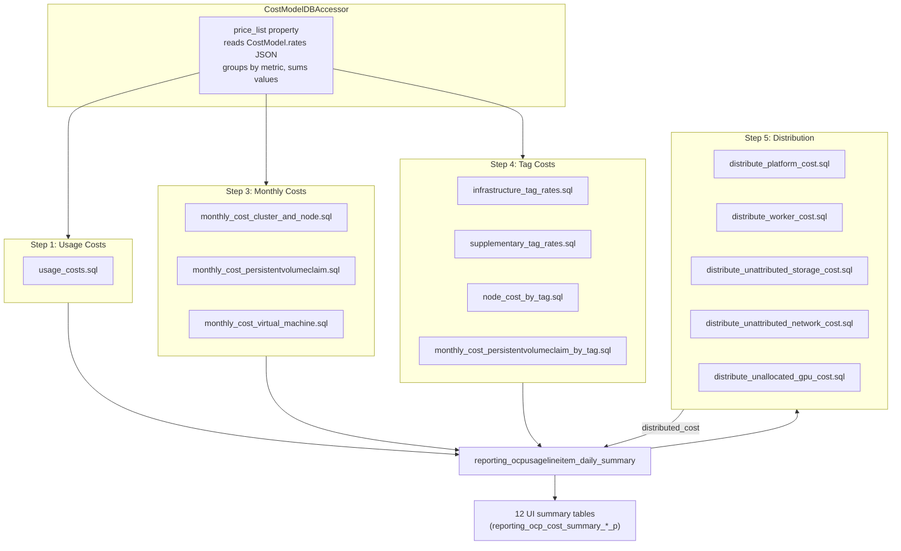

# SQL Pipeline Changes

This document describes how the cost calculation SQL pipeline changes to
support per-rate cost tracking via `RatesToUsage`.

> **See also**: OQ-1 and OQ-2 in [README.md](./README.md) — both resolved.
> OQ-1 confirms 12× row multiplication; OQ-2 confirms monthly cost row
> granularity is finer than one-per-namespace-node-day.

**Prerequisite**: [cost-models.md § Cost Calculation Pipeline](../cost-models.md#cost-calculation-pipeline)

---

## Current Pipeline

### Orchestration Order

`OCPCostModelCostUpdater.update_summary_cost_model_costs()` in
`masu/processor/ocp/ocp_cost_model_cost_updater.py` runs steps in this
fixed order:

1. **Usage costs** — `populate_usage_costs()` × 2 (Infrastructure, Supplementary)
2. **Markup** — `populate_markup_cost()` (ORM update, not SQL file)
3. **Monthly costs** — `populate_monthly_cost_sql()` × N (Node, Cluster, PVC, VM, etc.)
4. **Tag costs** (if tag rates exist):
   - `_delete_tag_usage_costs()`
   - `_update_tag_usage_costs()` → `populate_tag_usage_costs()` per (metric, tag_key, tag_value)
   - `_update_tag_usage_default_costs()` → `populate_tag_usage_default_costs()`
   - `_update_monthly_tag_based_cost()` → `populate_tag_cost_sql()` per tag_key
   - `_update_node_hour_tag_based_cost()` → `populate_tag_cost_sql()` per tag_key
   - `populate_tag_based_costs()`
5. **Distribution + UI summary** — `distribute_costs_and_update_ui_summary()`
   - `populate_distributed_cost_sql()` (runs all 5 `distribute_*.sql` files)
   - `populate_ui_summary_tables()` (populates all 12 UI summary tables)

### Data Flow Diagram



### How Markup Works Today

`populate_markup_cost()` in `ocp_report_db_accessor.py` uses a Django ORM
`UPDATE`, not a SQL file:

```python
OCPUsageLineItemDailySummary.objects.filter(
    cluster_id=cluster_id, usage_start__gte=start_date, usage_start__lte=end_date
).update(
    infrastructure_markup_cost=(
        Coalesce(F("infrastructure_raw_cost"), Value(0)) * markup
    ),
    infrastructure_project_markup_cost=(
        Coalesce(F("infrastructure_project_raw_cost"), Value(0)) * markup
    ),
)
```

Markup writes to two dedicated columns on the daily summary
(`infrastructure_markup_cost`, `infrastructure_project_markup_cost`) and
is exposed as `infra_markup` / `cost_markup` in the report API. No SQL
file is involved — this is purely ORM.

### How `usage_costs.sql` Works Today

Single DELETE + single INSERT. All rate values are passed as individual
SQL parameters:

| Parameter | Example Value | Used In |
|-----------|--------------|---------|
| `cpu_core_usage_per_hour` | 0.22 | `cost_model_cpu_cost` |
| `cpu_core_request_per_hour` | 0.10 | `cost_model_cpu_cost` |
| `cpu_core_effective_usage_per_hour` | 0.15 | `cost_model_cpu_cost` |
| `node_core_cost_per_hour` | 0.05 | `cost_model_cpu_cost` (distribution-dependent) |
| `cluster_core_cost_per_hour` | 0.03 | `cost_model_cpu_cost` (distribution-dependent) |
| `cluster_cost_per_hour` | 50.0 | `cost_model_cpu_cost` (via `cte_node_cost`) |
| `memory_gb_usage_per_hour` | 0.01 | `cost_model_memory_cost` |
| `memory_gb_request_per_hour` | 0.008 | `cost_model_memory_cost` |
| `memory_gb_effective_usage_per_hour` | 0.012 | `cost_model_memory_cost` |
| `storage_gb_usage_per_month` | 0.03 | `cost_model_volume_cost` |
| `storage_gb_request_per_month` | 0.02 | `cost_model_volume_cost` |

The SQL multiplies each usage metric by its rate and sums them into three
scalar columns: `cost_model_cpu_cost`, `cost_model_memory_cost`,
`cost_model_volume_cost`.

**Per-rate identity is lost here.** The INSERT produces one row per
`(usage_start, cluster_id, node, namespace, data_source, persistentvolumeclaim,
pod_labels, volume_labels, cost_category_id)`.

### How Tag Rates Work Today

Tag rates are **already per-rate** in execution:

- `infrastructure_tag_rates.sql` / `supplementary_tag_rates.sql` are
  called **once per (metric, tag_key, tag_value)** by `populate_tag_usage_costs()`
- Each execution produces rows with `monthly_cost_type = 'Tag'`
- The rate and tag value are SQL parameters, not aggregated

This means tag-based costs already have per-rate granularity in the daily
summary. The main change for `RatesToUsage` is copying these rows into
the new table with the `custom_name` attached.

### How Monthly Costs Work Today

`populate_monthly_cost_sql()` is called **once per (cost_type, rate_type)**
with a single `rate` value. Cost types: Node, Cluster, PVC, VM, VM_Core.

The SQL distributes the monthly rate across pods proportional to their
usage (CPU or memory, per `distribution` setting). Output rows have
`monthly_cost_type = 'Node'` (or Cluster, PVC, etc.).

---

## Proposed Pipeline Changes

### New Orchestration Order

`RatesToUsage` is the **single source of truth** from Phase 2 onward.
There is no temporary dual-path — `usage_costs.sql` direct-write is
replaced by per-rate INSERTs into `RatesToUsage`, per-rate distribution
(IQ-9 Option 1), then aggregation from `RatesToUsage` into the daily
summary (step 5a).

```
0.  DELETE RatesToUsage → clear stale per-rate rows (new)
1.  RatesToUsage     → write per-rate rows (replaces usage_costs.sql direct-write)
2.  Markup → RTU     → ORM INSERT into RatesToUsage (new)
3.  Monthly costs    → RatesToUsage (new)
4.  Tag costs        → RatesToUsage (new)
4a. VM usage costs   → RatesToUsage (Trino/self-hosted)
4b. Tag-based costs  → RatesToUsage (mixed paths)
4c. Raw cost → RTU   → INSERT infrastructure raw cost rows into RatesToUsage (new)
5.  Distribution     → reads per-rate costs from RatesToUsage + usage from daily summary → writes per-rate distributed rows back to RatesToUsage (REWRITTEN)
5a. AGGREGATE        → DELETE + INSERT: SUM(RatesToUsage) → daily_summary cost columns (new)
6.  UI summary       → UNCHANGED
7.  Breakdown table  → populate OCPCostUIBreakDownP from RatesToUsage (new)
```

Step 5 runs per-rate distribution SQL that joins `RatesToUsage` (source
namespace costs at rate granularity) with `pod_effective_usage_*_hours`
from `reporting_ocpusagelineitem_daily_summary` for proportional
allocation, then writes recipient and negation rows back into
`RatesToUsage` with `distributed_cost` populated.

Step 5a runs `aggregate_rates_to_daily_summary.sql` **after**
distribution so the daily summary reflects final values including
distributed amounts. It uses the same DELETE + INSERT pattern as
`usage_costs.sql` (delete rows with
`cost_model_rate_type IN ('Infrastructure', 'Supplementary')`, then
INSERT aggregated rows from `RatesToUsage`).

Step 7 reads a **single** source (`RatesToUsage`) for both per-rate
`calculated_cost` and per-rate `distributed_cost` leaves in the
breakdown tree.

### Markup → RatesToUsage (Step 2)

Markup does not use a SQL file — it is an ORM `UPDATE` on two columns.
To get markup into `RatesToUsage`, add an ORM `INSERT` after the existing
UPDATE. This keeps markup handling simple and avoids introducing a new
SQL file for a trivial calculation.

```python
# In ocp_report_db_accessor.py — new method
def populate_markup_rates_to_usage(self, markup, start_date, end_date, cluster_id, cost_model_id):
    """Write markup costs as RatesToUsage rows."""
    rows = OCPUsageLineItemDailySummary.objects.filter(
        cluster_id=cluster_id,
        usage_start__gte=start_date,
        usage_start__lte=end_date,
        infrastructure_markup_cost__isnull=False,
    ).exclude(infrastructure_markup_cost=0)

    bulk = []
    for row in rows.iterator():
        bulk.append(RatesToUsage(
            rate=None,                          # markup has no Rate row
            cost_model_id=cost_model_id,
            report_period_id=row.report_period_id,
            source_uuid=row.source_uuid,
            usage_start=row.usage_start,
            usage_end=row.usage_end,
            node=row.node,
            namespace=row.namespace,
            cluster_id=row.cluster_id,
            cluster_alias=row.cluster_alias,
            data_source=row.data_source,
            custom_name="Markup",               # fixed name; not user-configurable
            metric_type="markup",
            cost_model_rate_type="Infrastructure",
            monthly_cost_type=row.monthly_cost_type,
            calculated_cost=row.infrastructure_markup_cost,
            cost_category_id=row.cost_category_id,
        ))
    RatesToUsage.objects.bulk_create(bulk, batch_size=5000)
```

The `custom_name = "Markup"` is a fixed label (not from the `Rate` table)
because markup is a percentage applied to infrastructure raw cost, not a
named rate. `metric_type = "markup"` distinguishes it from cpu/memory/
storage/gpu in the aggregation step — markup costs are **not** summed
into `cost_model_cpu_cost` etc.; they flow through `RatesToUsage` →
`OCPCostUIBreakDownP` only for the breakdown tree.

#### R17 decision rationale — why ORM-first with SQL fallback

See [risk-register.md § R17](./risk-register.md#r17--markup-orm-overhead) for the full decision rationale (3 options evaluated).

**SQL-based alternative**: If the ORM-based approach above proves too
slow for large tenants, replace it with a raw SQL INSERT...SELECT that
avoids Python iteration entirely:

```sql
-- insert_markup_rates_to_usage.sql (R17 fallback)
INSERT INTO {{schema | sqlsafe}}.rates_to_usage (
    uuid, cost_model_id, report_period_id, source_uuid,
    usage_start, usage_end, node, namespace, cluster_id, cluster_alias,
    data_source, persistentvolumeclaim, pod_labels, volume_labels, all_labels,
    label_hash, custom_name, metric_type, cost_model_rate_type,
    monthly_cost_type, calculated_cost, cost_category_id
)
SELECT
    uuid_generate_v4(),
    {{cost_model_id}},
    lids.report_period_id,
    lids.source_uuid,
    lids.usage_start,
    lids.usage_end,
    lids.node,
    lids.namespace,
    lids.cluster_id,
    lids.cluster_alias,
    lids.data_source,
    lids.persistentvolumeclaim,
    lids.pod_labels,
    lids.volume_labels,
    lids.all_labels,
    md5(COALESCE(lids.pod_labels::text, '')
        || COALESCE(lids.volume_labels::text, '')
        || COALESCE(lids.all_labels::text, '')),
    'Markup',
    'markup',
    'Infrastructure',
    lids.monthly_cost_type,
    lids.infrastructure_markup_cost,
    lids.cost_category_id
FROM {{schema | sqlsafe}}.reporting_ocpusagelineitem_daily_summary lids
WHERE lids.usage_start >= {{start_date}}
  AND lids.usage_start <= {{end_date}}
  AND lids.source_uuid = {{source_uuid}}
  AND lids.cluster_id = {{cluster_id}}
  AND lids.infrastructure_markup_cost IS NOT NULL
  AND lids.infrastructure_markup_cost != 0
  AND (lids.cost_model_rate_type IS NULL
       OR lids.cost_model_rate_type NOT IN ('Infrastructure', 'Supplementary'));
```

This runs as a single SQL statement via `_prepare_and_execute_raw_sql_query`,
avoiding Python memory overhead. Use this approach if Phase 2 benchmarking
(R3) shows the ORM method exceeds acceptable processing time.

### RatesToUsage Cleanup Before Recalculation (Step 0)

Each cost model recalculation must DELETE existing `RatesToUsage` rows
for the affected window before inserting new ones. This mirrors the
DELETE-then-INSERT pattern used by `usage_costs.sql` and
`delete_monthly_cost.sql` on the daily summary.

```sql
-- delete_rates_to_usage.sql
DELETE FROM {{schema | sqlsafe}}.rates_to_usage
WHERE usage_start >= {{start_date}}
  AND usage_start <= {{end_date}}
  AND source_uuid = {{source_uuid}}
  AND report_period_id = {{report_period_id}};
```

This runs once at the start of `update_summary_cost_model_costs()`,
before any per-rate INSERTs. The scope matches the daily summary
cleanup: `(source_uuid, report_period_id, date range)`.

#### R11 decision rationale — why single DELETE (not per-rate-type)

See [risk-register.md § R11](./risk-register.md#r11--concurrent-cost-model-updates) for the full decision rationale (3 options evaluated).

### SQL File Inventory

#### Files That Need Modification (Phase 2-3)

Each file gains an additional INSERT into `rates_to_usage`
alongside the existing INSERT into `reporting_ocpusagelineitem_daily_summary`.

**`sql/openshift/cost_model/` (PostgreSQL path)**:

| File | Phase | Change Description |
|------|-------|--------------------|
| `usage_costs.sql` | 2 | **Replaced** by `insert_usage_rates_to_usage.sql` + `aggregate_rates_to_daily_summary.sql`. Direct-write to daily summary is retired in Phase 2. See [The Aggregation Step](#the-aggregation-step). |
| `infrastructure_tag_rates.sql` | 3 | Add INSERT into `RatesToUsage` (one row per execution, `custom_name` from parameter) |
| `supplementary_tag_rates.sql` | 3 | Same as above |
| `default_infrastructure_tag_rates.sql` | 3 | Add INSERT into `RatesToUsage` for default tag rates |
| `default_supplementary_tag_rates.sql` | 3 | Same as above |
| `node_cost_by_tag.sql` | 3 | Add INSERT into `RatesToUsage` for both allocated and unallocated blocks |
| `monthly_cost_cluster_and_node.sql` | 3 | Add INSERT into `RatesToUsage` with monthly rate identity |
| `monthly_cost_persistentvolumeclaim.sql` | 3 | Same as above |
| `monthly_cost_persistentvolumeclaim_by_tag.sql` | 3 | Same as above |
| `monthly_cost_virtual_machine.sql` | 3 | Same as above |

**`sql/openshift/cost_model/distribute_cost/` (IQ-9 Option 1)**:

| File | Phase | Change Description |
|------|-------|--------------------|
| `distribute_platform_cost.sql` | 4 | **REWRITTEN (IQ-9 Option 1):** new files read per-rate costs from `RatesToUsage` + usage metrics from daily summary, write per-rate distributed rows back to `RatesToUsage`. Old files deprecated for rollback. |
| `distribute_worker_cost.sql` | 4 | Same |
| `distribute_unattributed_storage_cost.sql` | 4 | Same |
| `distribute_unattributed_network_cost.sql` | 4 | Same |
| `distribute_unallocated_gpu_cost.sql` | 4 | Same |

**`trino_sql/openshift/cost_model/` (Trino/cloud path)**:

| File | Phase | Change Description |
|------|-------|--------------------|
| `hourly_cost_virtual_machine.sql` | 3 | Add INSERT into `RatesToUsage` |
| `hourly_cost_vm_tag_based.sql` | 3 | Same |
| `hourly_vm_core.sql` | 3 | Same |
| `hourly_vm_core_tag_based.sql` | 3 | Same |
| `monthly_vm_core.sql` | 3 | Same |
| `monthly_vm_core_tag_based.sql` | 3 | Same |
| `monthly_project_tag_based.sql` | 3 | Same |
| `monthly_cost_gpu.sql` | 3 | Same |

**`self_hosted_sql/openshift/cost_model/` (on-prem path)**:

Same 8 files as the Trino path — they mirror each other.

#### Files That Do NOT Change

| File | Reason |
|------|--------|
| `delete_monthly_cost_model_rate_type.sql` | Operates on daily summary |
| `delete_monthly_cost.sql` | Operates on daily summary |

#### New SQL Files

| File | Phase | Purpose |
|------|-------|---------|
| `sql/openshift/cost_model/delete_rates_to_usage.sql` | 2 | DELETE stale `RatesToUsage` rows before recalculation |
| `sql/openshift/cost_model/insert_usage_rates_to_usage.sql` | 2 | CTE + UNION ALL INSERT into `RatesToUsage` per rate component — see [PoC](./poc/insert_usage_rates_to_usage.sql) |
| `sql/openshift/cost_model/validate_rates_against_daily_summary.sql` | 2 | **CI-only** regression test: read-only comparison of `RatesToUsage` aggregates vs expected daily summary values. Used in integration tests to validate aggregation correctness. |
| `sql/openshift/cost_model/aggregate_rates_to_daily_summary.sql` | 2 | DELETE + INSERT: aggregates `RatesToUsage` into daily summary `cost_model_*_cost` columns, replacing `usage_costs.sql` direct-write. Runs **after** per-rate distribution (step 5a). See [The Aggregation Step](#the-aggregation-step). |
| `sql/openshift/cost_model/insert_raw_cost_rates_to_usage.sql` | 2 | INSERT infrastructure raw cost rows into `RatesToUsage` |
| `sql/openshift/cost_model/distribute_platform_cost_per_rate.sql` | 4 | Per-rate platform distribution (replaces `distribute_platform_cost.sql`) |
| `sql/openshift/cost_model/distribute_worker_cost_per_rate.sql` | 4 | Per-rate worker distribution |
| `sql/openshift/cost_model/distribute_unattributed_storage_per_rate.sql` | 4 | Per-rate storage distribution |
| `sql/openshift/cost_model/distribute_unattributed_network_per_rate.sql` | 4 | Per-rate network distribution |
| `sql/openshift/cost_model/distribute_unallocated_gpu_per_rate.sql` | 4 | Per-rate GPU distribution |
| `sql/openshift/ui_summary/reporting_ocp_cost_breakdown_p.sql` | 4 | Populate `OCPCostUIBreakDownP` from `RatesToUsage` — see [PoC](./poc/reporting_ocp_cost_breakdown_p.sql) |

---

## `CostModelDBAccessor` Changes

File: `masu/database/cost_model_db_accessor.py`

### `price_list` Property (Phase 1)

Currently reads from `CostModel.rates` JSON blob. In Phase 1, switch
to reading from the `Rate` table:

```python
@property
def price_list(self):
    return self._price_list_from_rate_table()

def _price_list_from_rate_table(self):
    """Read rates from the Rate table instead of JSON."""
    # Must produce the same dict structure as the old JSON-based path
    # so all downstream callers (populate_usage_costs, etc.) work unchanged
    ...
```

The output format must be identical to what the JSON-based path
produces today — a dict keyed by metric name with `tiered_rates` nested
by cost type. This is the backward-compatibility contract. The dual-write
approach (JSON + Rate table) ensures the JSON path can be restored by
reverting the code change if needed.

### `populate_usage_costs` (Phase 2)

Currently passes all rate values as SQL parameters in a single call.
Needs to additionally pass the `custom_name` for each rate so the
modified SQL can write to `RatesToUsage`.

The exact change depends on OQ-1 — whether we pass a list of
`(custom_name, rate_value)` tuples or restructure the SQL to run
once per rate.

### `populate_tag_usage_costs` (Phase 3)

Already runs once per `(metric, tag_key, tag_value)`. The change is
minimal: pass the `custom_name` (from the `Rate` row that owns this
tag) as an additional SQL parameter.

### `populate_monthly_cost_sql` (Phase 3)

Already runs once per `(cost_type, rate_type)`. Pass the `custom_name`
as an additional SQL parameter.

Note: For `OCP_VM_CORE`, this method dispatches to the Trino/self-hosted
SQL path (`monthly_vm_core.sql`) via `get_sql_folder_name()`. All other
cost types use the PostgreSQL path. See
[§ Trino/Self-Hosted Architecture](#trinoself-hosted-architecture) below.

### `populate_vm_usage_costs` (Phase 3)

This method **exclusively** uses the Trino/self-hosted SQL path. It
processes two metrics:

- `OCP_VM_HOUR` → `hourly_cost_virtual_machine.sql`
- `OCP_VM_CORE_HOUR` → `hourly_vm_core.sql`

Pass the `custom_name` as an additional SQL parameter. Both SQL files
need an INSERT into `RatesToUsage` with `metric_type = 'cpu'` (VM costs
map to CPU in the aggregation).

### `populate_tag_based_costs` (Phase 3)

This method dispatches per metric to different SQL paths:

| Metric | SQL Path | SQL File |
|--------|----------|----------|
| `OCP_VM_HOUR` | Trino/self-hosted | `hourly_cost_vm_tag_based.sql` |
| `OCP_VM_MONTH` | PostgreSQL | `monthly_cost_virtual_machine.sql` |
| `OCP_VM_CORE_MONTH` | Trino/self-hosted | `monthly_vm_core_tag_based.sql` |
| `OCP_VM_CORE_HOUR` | Trino/self-hosted | `hourly_vm_core_tag_based.sql` |
| `OCP_GPU_MONTH` | Trino/self-hosted | `monthly_cost_gpu.sql` |
| `OCP_PROJECT_MONTH` | Trino/self-hosted | `monthly_project_tag_based.sql` |

Pass the `custom_name` (from the `Rate` row that owns the tag) as an
additional SQL parameter to each file. The Trino/self-hosted SQL files
use `_execute_trino_multipart_sql_query` for execution.

### `populate_tag_usage_default_costs` (Phase 3)

Handles default tag rates — runs once per `(metric, tag_key)` for any
tag values not explicitly listed. Uses PostgreSQL path only:

- `default_infrastructure_tag_rates.sql`
- `default_supplementary_tag_rates.sql`

Pass `custom_name` as an additional SQL parameter.

### `populate_markup_rates_to_usage` (Phase 2 — New Method)

New ORM-based method to write markup costs into `RatesToUsage`. See
[§ Markup → RatesToUsage](#markup--ratestousage-step-2) above.

---

## The Aggregation Step

### Purpose

Bridge between per-rate `RatesToUsage` rows and the existing aggregated
daily summary columns. `RatesToUsage` is the **single source of truth**
for cost model calculations. Per-rate distribution (step 5) writes
distributed amounts back into `RatesToUsage`; aggregation (step 5a) then
rolls those rows up so the UI summary path still reads the same
`cost_model_*_cost` columns on the daily summary, now including
distributed cost in the totals.

### SQL Sketch — CI Validation Query (Read-Only)

A CI-only regression test query that compares `RatesToUsage` aggregates
against expected daily summary values. This runs in integration tests
to validate the aggregation logic, not at runtime:

```sql
-- validate_rates_against_daily_summary.sql (CI-only)
-- Read-only comparison — does NOT update any rows.
-- Returns rows where RatesToUsage aggregates differ from daily summary.
-- Used in integration tests with known-good cost model configurations.

SELECT
    lids.uuid,
    lids.usage_start,
    lids.cluster_id,
    lids.namespace,
    lids.node,
    lids.data_source,
    lids.persistentvolumeclaim,
    lids.pod_labels,
    lids.volume_labels,
    lids.all_labels,
    lids.cost_model_rate_type,
    lids.monthly_cost_type,
    lids.cost_model_cpu_cost      AS expected_cpu,
    lids.cost_model_memory_cost   AS expected_memory,
    lids.cost_model_volume_cost   AS expected_volume,
    agg.total_cpu_cost            AS aggregated_cpu,
    agg.total_memory_cost         AS aggregated_memory,
    agg.total_volume_cost         AS aggregated_volume,
    lids.cost_model_cpu_cost    - COALESCE(agg.total_cpu_cost, 0)    AS diff_cpu,
    lids.cost_model_memory_cost - COALESCE(agg.total_memory_cost, 0) AS diff_memory,
    lids.cost_model_volume_cost - COALESCE(agg.total_volume_cost, 0) AS diff_volume
FROM {{schema | sqlsafe}}.reporting_ocpusagelineitem_daily_summary lids
LEFT JOIN (
    SELECT
        usage_start,
        cluster_id,
        namespace,
        node,
        data_source,
        persistentvolumeclaim,
        label_hash,                    -- R13: hash-based grouping
        cost_model_rate_type,
        monthly_cost_type,
        SUM(CASE WHEN metric_type = 'cpu'     THEN calculated_cost ELSE 0 END) AS total_cpu_cost,
        SUM(CASE WHEN metric_type = 'memory'  THEN calculated_cost ELSE 0 END) AS total_memory_cost,
        SUM(CASE WHEN metric_type = 'storage' THEN calculated_cost ELSE 0 END) AS total_volume_cost
    FROM {{schema | sqlsafe}}.rates_to_usage
    WHERE usage_start >= {{start_date}}
      AND usage_start <= {{end_date}}
      AND source_uuid = {{source_uuid}}
    GROUP BY usage_start, cluster_id, namespace, node, data_source,
             persistentvolumeclaim, label_hash,
             cost_model_rate_type, monthly_cost_type
) AS agg
  ON  lids.usage_start            = agg.usage_start
  AND lids.cluster_id             = agg.cluster_id
  AND lids.namespace              = agg.namespace
  AND COALESCE(lids.node, '')     = COALESCE(agg.node, '')
  AND COALESCE(lids.data_source, '') = COALESCE(agg.data_source, '')
  AND COALESCE(lids.persistentvolumeclaim, '') = COALESCE(agg.persistentvolumeclaim, '')
  -- R13: JOIN on label_hash instead of 3 JSONB equality comparisons.
  -- The daily summary does not have label_hash, so we compute it on the fly.
  AND md5(COALESCE(lids.pod_labels::text, '') || COALESCE(lids.volume_labels::text, '') || COALESCE(lids.all_labels::text, ''))
      = agg.label_hash
  AND COALESCE(lids.cost_model_rate_type, '') = COALESCE(agg.cost_model_rate_type, '')
  AND COALESCE(lids.monthly_cost_type, '')    = COALESCE(agg.monthly_cost_type, '')
WHERE lids.usage_start >= {{start_date}}
  AND lids.usage_start <= {{end_date}}
  AND lids.source_uuid = {{source_uuid}}
  AND lids.report_period_id = {{report_period_id}}
  AND (
       ABS(COALESCE(lids.cost_model_cpu_cost, 0)    - COALESCE(agg.total_cpu_cost, 0))    > 0.000000000000001
    OR ABS(COALESCE(lids.cost_model_memory_cost, 0) - COALESCE(agg.total_memory_cost, 0)) > 0.000000000000001
    OR ABS(COALESCE(lids.cost_model_volume_cost, 0) - COALESCE(agg.total_volume_cost, 0)) > 0.000000000000001
  );
```

If this returns **any** rows, the aggregation logic has a bug. The
join granularity matches `usage_costs.sql` GROUP BY exactly. The
`label_hash` column (R13 mitigation) replaces 3 JSONB equality
comparisons with a single 32-char VARCHAR comparison.

> **Performance note (R13)**: The `label_hash` column
> (`md5(pod_labels::text || volume_labels::text || all_labels::text)`)
> is computed during the RatesToUsage INSERT and indexed via B-tree.
> Both the aggregation GROUP BY and the validation JOIN use `label_hash`
> instead of JSONB equality. This avoids O(n) deep comparison per row
> on potentially large JSON objects. The daily summary side computes the
> hash on the fly (`md5(COALESCE(...))`) in the validation query — this
> is acceptable for a CI-only read since it's evaluated once per daily
> summary row.

### SQL Sketch — Production Aggregation (DELETE + INSERT)

This DELETE + INSERT **replaces** the `usage_costs.sql` direct-write
path starting in Phase 2. The pattern matches `usage_costs.sql`'s
existing DELETE + INSERT approach:

```sql
-- aggregate_rates_to_daily_summary.sql (Phase 2+)
-- Runs after all per-rate INSERTs to RatesToUsage **and** after per-rate
-- distribution (step 5). Replaces usage_costs.sql direct-write.

-- Step 1: Delete existing cost model rows (same scope as usage_costs.sql DELETE)
DELETE FROM {{schema | sqlsafe}}.reporting_ocpusagelineitem_daily_summary
WHERE usage_start >= {{start_date}}
  AND usage_start <= {{end_date}}
  AND source_uuid = {{source_uuid}}
  AND report_period_id = {{report_period_id}}
  AND cost_model_rate_type IS NOT NULL
  AND cost_model_rate_type IN ('Infrastructure', 'Supplementary');

-- Step 2: INSERT aggregated rows from RatesToUsage
INSERT INTO {{schema | sqlsafe}}.reporting_ocpusagelineitem_daily_summary (
    uuid, report_period_id, cluster_id, cluster_alias, namespace, node,
    usage_start, usage_end, data_source, source_uuid,
    persistentvolumeclaim, pod_labels, volume_labels, all_labels,
    cost_category_id, cost_model_rate_type,
    cost_model_cpu_cost, cost_model_memory_cost, cost_model_volume_cost
)
SELECT
    uuid_generate_v4(),
    rtu.report_period_id,
    rtu.cluster_id,
    rtu.cluster_alias,
    rtu.namespace,
    rtu.node,
    rtu.usage_start,
    rtu.usage_start + interval '1 day' AS usage_end,
    rtu.data_source,
    rtu.source_uuid,
    rtu.persistentvolumeclaim,
    -- R13: JSONB columns retrieved via MIN() — functionally dependent on
    -- label_hash, so MIN() returns the correct value without JSONB comparison
    MIN(rtu.pod_labels) AS pod_labels,
    MIN(rtu.volume_labels) AS volume_labels,
    MIN(rtu.all_labels) AS all_labels,
    rtu.cost_category_id,
    rtu.cost_model_rate_type,
    SUM(CASE WHEN rtu.metric_type = 'cpu'     THEN rtu.calculated_cost ELSE 0 END),
    SUM(CASE WHEN rtu.metric_type = 'memory'  THEN rtu.calculated_cost ELSE 0 END),
    SUM(CASE WHEN rtu.metric_type = 'storage' THEN rtu.calculated_cost ELSE 0 END)
FROM {{schema | sqlsafe}}.rates_to_usage rtu
WHERE rtu.usage_start >= {{start_date}}
  AND rtu.usage_start <= {{end_date}}
  AND rtu.source_uuid = {{source_uuid}}
  AND rtu.metric_type IN ('cpu', 'memory', 'storage')
GROUP BY
    rtu.report_period_id,
    rtu.cluster_id,
    rtu.cluster_alias,
    rtu.namespace,
    rtu.node,
    rtu.usage_start,
    rtu.data_source,
    rtu.source_uuid,
    rtu.persistentvolumeclaim,
    rtu.label_hash,             -- R13: 32-char hash replaces 3 JSONB columns in GROUP BY
    rtu.cost_category_id,
    rtu.cost_model_rate_type;
```

**Why DELETE + INSERT instead of UPDATE?** `usage_costs.sql` creates new
rows in the daily summary (with `uuid_generate_v4()` and
`cost_model_rate_type = 'Infrastructure'/'Supplementary'`). It does not
update existing base rows. The aggregation step must follow the same
pattern so UI summary and other readers still see the same discrete
cost-model rows on the daily summary. Per-rate distribution runs **first**
on `RatesToUsage` (step 5); aggregation (step 5a) then rolls up RTU rows
(including distributed amounts) into those columns. An UPDATE would require
matching pre-existing rows, which don't exist if we've removed the
direct-write path.

The `WHERE metric_type IN ('cpu', 'memory', 'storage')` excludes markup
and gpu rows from the aggregation into the three cost_model columns.

**IQ-2 PROPOSAL**: `cluster_cost_per_hour` (component 6) contributes
to `cost_model_cpu_cost` when `distribution = 'cpu'` but to
`cost_model_memory_cost` when `distribution = 'memory'`. Set
`metric_type` dynamically using the same ``
Jinja2 conditional already used in `cte_node_cost`. See
[README.md § IQ-2](./README.md#iq-2-cluster_cost_per_hour-metric_type-is-distribution-dependent-phase-2).

**GPU path:** `cost_model_gpu_cost` on the daily summary is still written
by `monthly_cost_gpu.sql` via `populate_tag_based_costs()`. GPU costs are
also INSERT'd into `RatesToUsage` (`metric_type = 'gpu'`). Per-rate GPU
distribution uses `distribute_unallocated_gpu_per_rate.sql`, which reads
GPU rows from `RatesToUsage` and daily-summary usage metrics, then writes
per-rate distributed rows back to `RatesToUsage`; aggregation (step 5a)
rolls GPU and other metrics into the daily summary as designed.

---

## Insertion Point in Orchestration Code

File: `masu/processor/ocp/ocp_cost_model_cost_updater.py`

```python
def update_summary_cost_model_costs(self, summary_range):
    # Step 0 (NEW): Delete stale RatesToUsage rows for this window
    # with OCPReportDBAccessor(self._schema) as accessor:
    #     accessor.delete_rates_to_usage(...)

    # Step 1 (NEW): Write per-rate rows to RatesToUsage
    # REPLACES self._update_usage_costs() direct-write
    # with OCPReportDBAccessor(self._schema) as accessor:
    #     accessor.populate_usage_rates_to_usage(...)

    self._update_markup_cost(...)            # Step 2  (ORM UPDATE on daily_summary, UNCHANGED)

    # Step 2b (NEW): Write markup to RatesToUsage
    # with OCPReportDBAccessor(self._schema) as accessor:
    #     accessor.populate_markup_rates_to_usage(...)

    self._update_monthly_cost(...)           # Step 3  (RatesToUsage)
    if self._tag_infra_rates or ...:
        self._update_tag_*_costs(...)        # Step 4  (RatesToUsage)
    self._update_vm_usage_costs(...)         # Step 4a (Trino/self-hosted + RatesToUsage)
    self._update_tag_based_costs(...)        # Step 4b (mixed paths + RatesToUsage)

    # Steps 5–6: refactor distribute_costs_and_update_ui_summary() to run in order:
    #   (5) DISTRIBUTE — per-rate SQL reads RatesToUsage + daily summary usage
    #       metrics; writes per-rate distributed rows back to RatesToUsage
    #       (distribute_*_per_rate.sql).
    #   (5a) AGGREGATE — DELETE + INSERT: SUM(RatesToUsage) → daily_summary cost
    #       columns (after distribution so totals include distributed amounts).
    #   (6) UI summary — populate_ui_summary_tables() unchanged.
    self.distribute_costs_and_update_ui_summary(summary_range)

    # Step 7 (NEW, Phase 4+): Populate breakdown table from RatesToUsage only
    # (calculated_cost + distributed_cost both in RTU)
    # with OCPReportDBAccessor(self._schema) as accessor:
    #     accessor.populate_breakdown_table(...)
```

---

## Distribution Costs in the Breakdown Tree

Per-rate distribution SQL (`distribute_*_per_rate.sql`) reads **per-rate
costs** from `RatesToUsage` for the source namespace (Platform, Worker
unallocated, etc.) and **usage weights** from
`reporting_ocpusagelineitem_daily_summary` (`pod_effective_usage_*_hours` and
related fields used today for proportional allocation). It writes rows back
into `RatesToUsage`: source-namespace **negation** rows
(`distributed_cost = -calculated_cost` at the contributing rate grain) and
recipient-namespace rows with `distributed_cost = cost × usage_proportion`
per rate. Rows carrying distribution use the same `cost_model_rate_type`
discriminators as today (`platform_distributed`, `worker_distributed`, etc.)
so breakdown paths like `overhead.platform_distributed.usage_cost.<custom_name>`
remain consistent.

The breakdown population SQL (`reporting_ocp_cost_breakdown_p.sql`, Phase 4)
reads from **one** source: `rates_to_usage`. Each leaf row contributes either
`calculated_cost` (undistributed per-rate cost) or `distributed_cost`
(per-rate distributed amount), or both where the model emits both on the
same row — the concrete SELECT uses `COALESCE` / `CASE` to map columns into
the breakdown tree.

```sql
-- Sketch: single-source breakdown population from RatesToUsage
INSERT INTO {{schema}}.reporting_ocp_cost_breakdown_p (...)

SELECT
    r.usage_start, r.cluster_id, r.namespace, r.node,
    r.custom_name,
    r.metric_type,
    r.cost_model_rate_type,
    r.calculated_cost AS cost_value,
    r.distributed_cost,
    build_path(r.cost_category_id, r.cost_model_rate_type, r.custom_name) AS path,
    ...
FROM {{schema}}.rates_to_usage r
WHERE r.usage_start >= {{start_date}} AND r.usage_start <= {{end_date}}
  AND r.source_uuid = {{source_uuid}}
  AND (
      COALESCE(r.calculated_cost, 0) != 0
      OR COALESCE(r.distributed_cost, 0) != 0
  );
```

**IQ-4 PROPOSAL**: `build_path()` (and variants for overhead vs project
branches) are implemented as CASE/WHEN expressions in the INSERT...SELECT,
following koku's standard SQL pattern. Concrete SQL is proposed in
[README.md § IQ-4](./README.md#iq-4-build_path-logic-phase-4).
Intermediate tree nodes (depth 1-3) are aggregated from leaf rows via
a separate INSERT with `GROUP BY top_category, breakdown_category`.

---

## Per-Rate Distribution SQL Sketch (IQ-9 Option 1)

**Context**: IQ-9 **Option 1** distributes at **per-rate** granularity:
each `distribute_*_per_rate.sql` file mirrors the DELETE + INSERT pattern
of the legacy `distribute_*.sql` files (no in-place UPDATE). See
[README.md § IQ-9](./README.md#iq-9-distribution-per-rate-identity-gap).

For each distribution type:

- **Read** per-rate source costs from `RatesToUsage`, scoped to the source
  namespace (Platform, Worker unallocated, etc.) using the mapping table
  below.
- **JOIN** `reporting_ocpusagelineitem_daily_summary` for recipient (and
  source) rows that supply `pod_effective_usage_*_hours` (and the same
  usage fields the legacy SQL uses) so allocation proportions match
  today's behavior.
- **DELETE** then **INSERT** into `RatesToUsage` for the affected window /
  distribution type, same mechanical pattern as existing distribution SQL.
- **Write** new `RatesToUsage` rows with `cost_model_rate_type` set to the
  distribution discriminator (`platform_distributed`, …), `calculated_cost`
  NULL or 0 as appropriate, and **`distributed_cost`** populated:
  - **Source namespace**: negation rows, e.g. `distributed_cost =
    -calculated_cost` for each contributing per-rate row (so net movement
    balances).
  - **Recipient namespaces**: positive rows,
    `distributed_cost = rate_cost × usage_proportion` (per rate), where
    `usage_proportion` is derived from effective usage hours vs totals across
    recipients—identical proportion logic to the legacy files, but applied
    per rate row.

Concrete column lists, JOIN keys, and DELETE predicates follow each
existing `distribute_*.sql` file; only the cost input side moves from
aggregated daily-summary columns to `RatesToUsage`, and the output side
writes per-rate rows back to `RatesToUsage` instead of new daily-summary
distribution rows.

### Example pattern (platform — illustrative)

```sql
-- distribute_platform_cost_per_rate.sql — pattern sketch (not full DDL)

-- 1) Remove prior per-rate distribution rows for this type / window
DELETE FROM {{schema | sqlsafe}}.rates_to_usage rtu
WHERE rtu.usage_start >= {{start_date}}
  AND rtu.usage_start <= {{end_date}}
  AND rtu.source_uuid = {{source_uuid}}
  AND rtu.cost_model_rate_type = 'platform_distributed';

-- 2) INSERT source-namespace negation rows + recipient positive rows
INSERT INTO {{schema | sqlsafe}}.rates_to_usage (...)
SELECT ...
FROM {{schema | sqlsafe}}.rates_to_usage src
JOIN {{schema | sqlsafe}}.reporting_ocpusagelineitem_daily_summary lids
  ON /* grain + cluster + day; usage hours for proportion */
WHERE /* src rows: Platform category; not already distributed type */
  -- Negation branch: UNION ALL
  -- SELECT ..., distributed_cost = -src.calculated_cost, ...
  -- Recipient branch:
  -- SELECT ..., distributed_cost = src.calculated_cost * (lids.pod_effective_usage_cpu_core_hours / NULLIF(recipient_total_cpu_hours, 0)), ...
;
```

### Mapping distribution type to source namespace

Each distribution file applies the same source-namespace filter the legacy
SQL used when resolving the **pool** to distribute (now reading that pool
from `RatesToUsage` at rate granularity):

| Distribution type | Source namespace filter |
|-------------------|----------------------|
| `platform_distributed` | `cat.name = 'Platform'` |
| `worker_distributed` | `namespace = 'Worker unallocated'` |
| `unattributed_storage` | `namespace = 'Storage unattributed'` |
| `unattributed_network` | `namespace = 'Network unattributed'` |
| `gpu_distributed` | `namespace = 'GPU unallocated'` (Phase 3+ only) |

Parameterize per file or use CASE/WHEN if a shared template is preferred.

### GPU distribution note

GPU per-rate distribution (`distribute_unallocated_gpu_per_rate.sql`) reads
GPU per-rate rows from `RatesToUsage` (`metric_type = 'gpu'`) and joins
daily-summary usage the same way as `distribute_unallocated_gpu_cost.sql`.
Phase alignment with `monthly_cost_gpu.sql` / Phase 3 tag GPU rates is
unchanged; only the cost source and sink are `RatesToUsage`.

### R14 — reconciliation check (N/A under Option 1)

R14 targeted **back-allocation** rounding: splitting a single scalar
`distributed_cost` across inferred per-rate shares could drift from the
original total. **Option 1 does not do that** — distribution computes
`distributed_cost` per rate directly from `calculated_cost ×
usage_proportion`, so there is no separate reconciliation step between a
daily-summary scalar and derived shares. The prior post-INSERT
reconciliation query and "Rounding" row mitigation are **not applicable**;
keep using `NUMERIC(33,15)` as today.

### Intermediate nodes for distribution

Per-rate `RatesToUsage` rows (undistributed `calculated_cost` and
distributed `distributed_cost` leaves) feed `reporting_ocp_cost_breakdown_p`
as in [Distribution Costs in the Breakdown Tree](#distribution-costs-in-the-breakdown-tree).
Intermediate depth 4 nodes (e.g. `overhead.platform_distributed.usage_cost`)
are aggregated from leaves with the same `GROUP BY` + `SUM()` approach as
the existing PoC. The depth 3 distribution node (`overhead.platform_distributed`)
aggregates depth 4 children.

---

## Trino/Self-Hosted Architecture

### Three SQL Paths

The cost model pipeline uses three SQL directory paths. The same
accessor methods dispatch to different files depending on the deployment
mode.

| Path | Deployment | Execution Engine |
|------|------------|-----------------|
| `sql/openshift/cost_model/` | All (cloud + on-prem) | `_prepare_and_execute_raw_sql_query` (Django PostgreSQL) |
| `trino_sql/openshift/cost_model/` | Cloud only (`ONPREM=False`) | `_execute_trino_multipart_sql_query` (Trino → PostgreSQL catalog) |
| `self_hosted_sql/openshift/cost_model/` | On-prem only (`ONPREM=True`) | `_execute_trino_multipart_sql_query` (Django PostgreSQL) |

### Path Selection Logic

```python
# masu/database/report_db_accessor_base.py
def get_sql_folder_name(self):
    return "self_hosted_sql" if getattr(settings, "ONPREM", False) else "trino_sql"
```

Accessor methods check whether the file path contains `get_sql_folder_name()`
to decide the execution engine:

```python
if self.get_sql_folder_name() in metadata["file_path"]:
    self._execute_trino_multipart_sql_query(sql, bind_params=sql_params)
else:
    self._prepare_and_execute_raw_sql_query(table_name, sql, sql_params, operation="INSERT")
```

### Target Table

Both paths write to the **same** PostgreSQL table:
`reporting_ocpusagelineitem_daily_summary`. There is no separate
Trino-side storage for cost model data.

- **Cloud**: Trino has a PostgreSQL catalog connector that allows
  INSERT/UPDATE/DELETE on PostgreSQL tables using Trino SQL syntax.
- **On-prem**: `_execute_trino_multipart_sql_query` actually runs against
  PostgreSQL via the Django database connection (not Trino). The
  `self_hosted_sql/` files use standard PostgreSQL syntax.

### Method-to-SQL-Path Mapping

| Method | PostgreSQL (`sql/`) | Trino/self-hosted |
|--------|-------------------|-------------------|
| `populate_usage_costs()` | Always | Never |
| `populate_markup_cost()` | ORM only | N/A |
| `populate_monthly_cost_sql()` | Node, Cluster, PVC, VM | `OCP_VM_CORE` only |
| `populate_tag_usage_costs()` | Always | Never |
| `populate_tag_usage_default_costs()` | Always | Never |
| `populate_tag_cost_sql()` | Always | Never |
| `populate_vm_usage_costs()` | Never | Always |
| `populate_tag_based_costs()` | `OCP_VM_MONTH` only | GPU, VM core, project, VM hour |

### Implications for `RatesToUsage` Writes

Each SQL file that gains an INSERT into `rates_to_usage` must
use the correct SQL dialect for its execution engine:

- **`sql/` files** (PostgreSQL): Standard `INSERT INTO ... SELECT ...`
  with JinjaSql template parameters. No special handling needed.

- **`trino_sql/` files** (cloud Trino): The INSERT must reference the
  PostgreSQL catalog (`postgres.`), consistent with existing Trino SQL
  files (e.g., `hourly_cost_virtual_machine.sql` uses
  `postgres.{{schema | sqlsafe}}.reporting_ocpusagelineitem_daily_summary`):
  ```sql
  INSERT INTO postgres.{{schema | sqlsafe}}.rates_to_usage
  SELECT ... FROM postgres.{{schema | sqlsafe}}.reporting_ocpusagelineitem_daily_summary
  ```
  Trino uses `CAST({{rate}} AS DECIMAL(33, 15))` instead of
  PostgreSQL's `{{rate}}::decimal`, and `uuid()` instead of
  `uuid_generate_v4()`. Hive-sourced tables use the `hive.` catalog
  prefix.

- **`self_hosted_sql/` files** (on-prem): These execute against
  PostgreSQL directly (despite the method name), so they use standard
  PostgreSQL syntax — same as `sql/` files.

### RatesToUsage INSERT and Breakdown SQL — Always PostgreSQL

The RatesToUsage INSERT (`insert_usage_rates_to_usage.sql`),
validation query (`validate_rates_against_daily_summary.sql`),
aggregation (`aggregate_rates_to_daily_summary.sql`), per-rate
distribution (`distribute_*_per_rate.sql`), and breakdown population
(`reporting_ocp_cost_breakdown_p.sql`) live only in the `sql/` path.
They read from `rates_to_usage` (a PostgreSQL table) and/or the daily
summary as needed, and write to PostgreSQL tables, so they execute via
`_prepare_and_execute_raw_sql_query` regardless of deployment mode. No
Trino or self-hosted variants are needed for these files.

---

## Changelog

| Version | Date | Summary |
|---------|------|---------|
| v1.0 | 2026-03-17 | Initial: current vs proposed data flow, SQL file inventory (20+ files across 3 paths), CostModelDBAccessor changes, distribution costs in breakdown tree, Trino/self-hosted architecture. |
| v2.0 | 2026-03-17 | IQ-1 resolved: rewrite orchestration to single-source-of-truth (RatesToUsage INSERT + aggregation replaces usage_costs.sql direct-write). Add DELETE+INSERT aggregation SQL sketch. Update SQL file inventory. Add fine-grained columns to all SQL sketches. Remove dual-path language. |
| v2.2 | 2026-03-17 | IQ-9 investigation: add Back-Allocation SQL Sketch section with full CTE-based SQL for splitting distributed_cost to per-rate shares. Add source namespace mapping table, GPU distribution note, intermediate node aggregation approach. |
| v2.3 | 2026-03-17 | Blast-radius triage: remove erroneous `resource_id` from aggregation SQL sketch GROUP BY / SELECT (not in `usage_costs.sql` GROUP BY, confirmed by PoC). |
| v2.4 | 2026-03-17 | Risk mitigation: R13 — rewrite aggregation and validation SQL to use `label_hash` instead of JSONB GROUP BY/JOIN. R14 — add reconciliation check SQL sketch. R17 — add SQL-based markup INSERT fallback (`insert_markup_rates_to_usage.sql`). |
| v2.5 | 2026-03-17 | Decision rationales: add alternatives-evaluated tables for R11 (single DELETE scope, 3 options), R14 (reconciliation check, 3 options), R15 (3-CTE back-allocation, 4 options), R17 (ORM-first + SQL fallback, 3 options). |
| v3.0 | 2026-03-19 | **IQ-9 Option 1 adopted.** Distribution reads per-rate costs from `RatesToUsage` + usage from daily summary, writes distributed rows back to `RatesToUsage`. New orchestration: distribution before aggregation. Replace back-allocation SQL with per-rate distribution sketch. Add 5 new distribution files + raw cost INSERT. Rename table references. Remove R14/R15 rationales. |
| v3.1 | 2026-03-19 | **Risk extraction.** Move R11 and R17 decision rationale tables to [risk-register.md](./risk-register.md). Retain SQL fallback code inline. |
