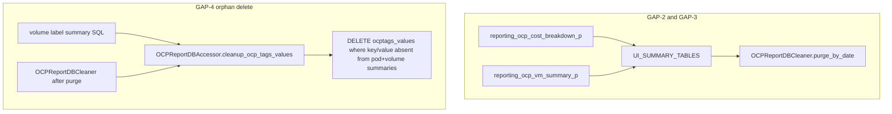

# COST-7904: OCP Retention Gap Fixes

**Jira:** COST-7904 (follow-up from COST-7705 on-prem retention audit)

## Overview

Wire cost-breakdown (and confirm VM) into OCP expired-data partition drops, add orphan cleanup for `reporting_ocptags_values` after label-summary rebuild and cleaner purge paths, then update retention/cost-breakdown docs and tests.

## Current state

- **GAP-3 already done in code:** `VM_UI_SUMMARY_TABLE` (`reporting_ocp_vm_summary_p`) is already in `UI_SUMMARY_TABLES`, so `OCPReportDBCleaner.purge_expired_report_data_by_date` already partition-drops it. `TestPurgeWiring` already asserts VM in the cleaner list.
- **GAP-2 still open:** `reporting_ocp_cost_breakdown_p` model exists (`OCPCostUIBreakDownP`) with `source_uuid` FK CASCADE, but is **not** in `UI_SUMMARY_TABLES`.
- **GAP-4 still open:** `reporting_ocptags_values` only deletes rows for **disabled** tag keys (volume label SQL). No orphan cleanup when label summaries disappear via source delete or retention cascade.
- Docs in `retention-policy.md` and cost-breakdown `data-model.md` still describe the old gaps.

## Approach



**GAP-4 decision (chosen):** orphan delete — remove `reporting_ocptags_values` rows whose `(key, value)` no longer appear in either pod or volume label summary. Run during normal label-summary rebuild **and** explicitly from the cleaner after retention / provider purge so last-source delete is covered. Do **not** implement cluster_ids array pruning (pre-existing summarization overwrite behavior stays out of scope).

---

## 1. GAP-2 / GAP-3 — partition-drop wiring

In `koku/reporting/provider/ocp/models.py`, add cost breakdown to `UI_SUMMARY_TABLES`:

```python
UI_SUMMARY_TABLES = (
    *UI_SUMMARY_TABLES_MARKUP_SUBSET,
    ...
    "reporting_ocp_gpu_summary_p",
    VM_UI_SUMMARY_TABLE,
    COST_BREAKDOWN_UI_SUMMARY_TABLE,  # reporting_ocp_cost_breakdown_p
)
```

No cleaner change needed for the table list — it already `extend(UI_SUMMARY_TABLES)`.

**Population skip:** Breakdown population SQL is not yet wired (Phase 4). Skip `COST_BREAKDOWN_UI_SUMMARY_TABLE` in `populate_ui_summary_tables()` the same way `VM_UI_SUMMARY_TABLE` is skipped, so adding it to the tuple enables partition create/cleanup without breaking the standard UI-summary loop.

---

## 2. GAP-4 — orphan tag-values cleanup

### SQL (efficiency-first)

**Do not** use correlated `NOT EXISTS` + `tv.value = ANY(summary.values)`. That form re-scans both summary tables per `ocptags_values` row and cannot use indexes for the array membership check.

Use an AWS-style CTE: materialize live `(key, value)` pairs once via `UNNEST`, then anti-join. Put this in a dedicated shared file `sql/openshift/reporting_ocptags_values_cleanup.sql`:

```sql
WITH live_tag_values AS (
    SELECT DISTINCT key, value
    FROM (
        SELECT ps.key, unnest(ps.values) AS value
        FROM {{schema | sqlsafe}}.reporting_ocpusagepodlabel_summary AS ps
        UNION ALL
        SELECT vs.key, unnest(vs.values) AS value
        FROM {{schema | sqlsafe}}.reporting_ocpstoragevolumelabel_summary AS vs
    ) AS kv
),
orphans AS (
    SELECT tv.uuid
    FROM {{schema | sqlsafe}}.reporting_ocptags_values AS tv
    LEFT JOIN live_tag_values AS live
        ON live.key = tv.key
       AND live.value = tv.value
    WHERE live.key IS NULL
)
DELETE FROM {{schema | sqlsafe}}.reporting_ocptags_values AS tv
    USING orphans AS o
    WHERE tv.uuid = o.uuid
;
```

Why this is better:
- One sequential pass over each (small) label-summary table + `unnest`
- Hash aggregate for `DISTINCT (key, value)`
- Single hash anti-join against `reporting_ocptags_values` (unique on `(key, value)`; key index `openshift_tags_value_key_idx`)
- Matches AWS orphan pattern (`cte_expired_tag_keys` + `DELETE ... USING`) but at `(key, value)` grain required by OCP
- No `FOR UPDATE` / `ORDER BY` on the orphan set (AWS also omits these on orphan delete)

### Accessor + cleaner hooks

In `ocp_report_db_accessor.py`, add `cleanup_ocp_tags_values()` that runs the shared SQL file. Call it at the end of `populate_volume_label_summary_table`.

In `ocp_report_db_cleaner.py`, after successful non-simulate deletes in both:

- `purge_expired_report_data` (provider_uuid path)
- `purge_expired_report_data_by_date`

call `accessor.cleanup_ocp_tags_values()` so orphans left by cascaded label-summary deletes are removed even when no subsequent summarization runs.

---

## 3. Tests

- Assert both `reporting_ocp_vm_summary_p` and `reporting_ocp_cost_breakdown_p` are in the cleaner `partition_of_table_name__in` list.
- Unit coverage for `cleanup_ocp_tags_values`:
  - orphan `(key, value)` with no pod/volume summary rows → deleted
  - `(key, value)` still referenced by a summary → retained
  - cleaner invokes cleanup after non-simulate purge (mock assert)

---

## 4. Docs

- `docs/architecture/cost-breakdown/data-model.md`: remove “pre-existing bug” for VM; state both VM and cost-breakdown are in `UI_SUMMARY_TABLES` for partition create/cleanup.
- `docs/architecture/data-retention/retention-policy.md`:
  - Merge class D into C (or mark D as covered via `UI_SUMMARY_TABLES`)
  - Update class G: orphan delete on label-summary rebuild + after OCP cleaner purge / source delete
  - Fix partition-drop parent counts for the added UI summary table

---

## Out of scope

- GAP-1 `rates_to_usage` source-delete (COST-7736)
- Pruning stale `cluster_ids` / `namespaces` / `nodes` arrays on rows that still have other clusters
- Feature flag (additive cleanup / registration only; no risky pipeline write-path change requiring Unleash)
- Implementing Phase 4 breakdown population SQL (only partition lifecycle wiring here)

---

## 5. Local reproduce / confirm fix

Use the on-prem-ish local stack (`db` + workers optional). Schema: `org1234567`.

### 5.1 Fast confirmation (unit tests)

```bash
cd $KOKU_ROOT
pipenv run python koku/manage.py test \
  masu.test.processor.ocp.test_phase2_rates_to_usage.TestPurgeWiring.test_rates_to_usage_in_cleaner_base_list \
  masu.test.processor.ocp.test_ocp_report_db_cleaner.OCPReportDBCleanerTest.test_purge_by_date_calls_cleanup_ocp_tags_values \
  masu.test.processor.ocp.test_ocp_report_db_cleaner.OCPReportDBCleanerTest.test_purge_by_date_simulate_skips_cleanup_ocp_tags_values \
  masu.test.processor.ocp.test_ocp_report_db_cleaner.OCPReportDBCleanerTest.test_purge_by_provider_calls_cleanup_ocp_tags_values \
  masu.test.database.test_ocp_report_db_accessor.OCPReportDBAccessorTest.test_cleanup_ocp_tags_values_removes_orphans_keeps_referenced \
  --no-input -v 2
```

Expect: cleaner table list includes `reporting_ocp_vm_summary_p` and `reporting_ocp_cost_breakdown_p`; orphan tag row deleted; referenced tag row kept; simulate skips cleanup.

### 5.2 GAP-2 / GAP-3 — partition-drop list (before vs after)

**Before (bug):** `reporting_ocp_cost_breakdown_p` (and historically VM) missing from the cleaner’s `partition_of_table_name__in` list, so expired monthly partitions for those parents were never dropped.

**After (fix):** both parents appear in `UI_SUMMARY_TABLES` and therefore in the cleaner list.

```bash
# Dev DB up
docker compose up -d db

# Inspect registration
pipenv run python - <<'PY'
import django, os
os.environ.setdefault("DJANGO_SETTINGS_MODULE", "koku.settings")
django.setup()
from reporting.provider.ocp.models import UI_SUMMARY_TABLES
assert "reporting_ocp_vm_summary_p" in UI_SUMMARY_TABLES
assert "reporting_ocp_cost_breakdown_p" in UI_SUMMARY_TABLES
print("UI_SUMMARY_TABLES OK:", len(UI_SUMMARY_TABLES), "tables")
for t in UI_SUMMARY_TABLES:
    print(" ", t)
PY
```

Manual partition drop smoke (optional — mutates tenant partitions):

```bash
# 1) Create a stale partition metadata row + child table for cost-breakdown
#    (month older than retention; example uses 2020-01)
docker compose exec db psql -U postgres -d postgres <<'SQL'
SET search_path TO org1234567;

-- Parent must already exist from migrations. Register a fake monthly partition
-- the cleaner will try to drop via PartitionedTable delete trigger.
INSERT INTO public.partitioned_tables (
  schema_name, table_name, partition_of_table_name, partition_type,
  partition_col, partition_parameters, active
) VALUES (
  'org1234567',
  'reporting_ocp_cost_breakdown_p_2020_01',
  'reporting_ocp_cost_breakdown_p',
  'range',
  'usage_start',
  '{"default": false, "from": "2020-01-01", "to": "2020-02-01"}',
  true
) ON CONFLICT DO NOTHING;

-- Create the physical partition if missing (no-op if parent partitioning differs)
DO $$
BEGIN
  EXECUTE $c$
    CREATE TABLE IF NOT EXISTS org1234567.reporting_ocp_cost_breakdown_p_2020_01
    PARTITION OF org1234567.reporting_ocp_cost_breakdown_p
    FOR VALUES FROM ('2020-01-01') TO ('2020-02-01')
  $c$;
EXCEPTION WHEN duplicate_table OR invalid_object_definition THEN
  NULL;
END $$;
SQL

# 2) Run date-based purge via Django shell (simulate=False)
pipenv run python - <<'PY'
import django, os
from datetime import datetime, timezone
os.environ.setdefault("DJANGO_SETTINGS_MODULE", "koku.settings")
django.setup()
from masu.processor.ocp.ocp_report_db_cleaner import OCPReportDBCleaner
cleaner = OCPReportDBCleaner("org1234567")
# Cutoff after the fake partition month so 2020-01 is eligible
cleaner.purge_expired_report_data_by_date(datetime(2020, 2, 1, tzinfo=timezone.utc), simulate=False)
print("purge complete")
PY

# 3) Confirm PartitionedTable row / child table gone
docker compose exec db psql -U postgres -d postgres -c "
SELECT table_name FROM partitioned_tables
WHERE schema_name='org1234567'
  AND partition_of_table_name='reporting_ocp_cost_breakdown_p'
  AND table_name LIKE '%2020_01%';
"
```

**Pre-fix expectation:** step 3 still shows the `2020_01` partition (cleaner never targeted the parent).
**Post-fix expectation:** step 3 returns zero rows (and the child relation is dropped).

Repeat the same pattern with `reporting_ocp_vm_summary_p` if validating GAP-3 on an older branch that lacked VM in `UI_SUMMARY_TABLES`.

### 5.3 GAP-4 — orphan `reporting_ocptags_values` (before vs after)

**Before (bug):** deleting/cascading label summaries (source delete or retention) left stale `(key, value)` rows in `reporting_ocptags_values`. Only **disabled** tag keys were removed from the index.

**After (fix):** `cleanup_ocp_tags_values()` removes index rows whose `(key, value)` no longer appear in pod or volume label summaries.

```bash
# Seed an orphan tag value (not present in either label summary)
docker compose exec db psql -U postgres -d postgres <<'SQL'
SET search_path TO org1234567;

INSERT INTO reporting_ocptags_values (
  uuid, key, value, cluster_ids, cluster_aliases, namespaces, nodes
) VALUES (
  gen_random_uuid(),
  'cost7904_orphan_key',
  'cost7904_orphan_value',
  ARRAY['orphan-cluster'],
  ARRAY['orphan-alias'],
  ARRAY['orphan-ns'],
  ARRAY['orphan-node']
) ON CONFLICT DO NOTHING;

-- Count before cleanup
SELECT count(*) AS orphan_before
FROM reporting_ocptags_values
WHERE key = 'cost7904_orphan_key' AND value = 'cost7904_orphan_value';
SQL

# Run cleanup (same path used after volume label summary + cleaner purge)
pipenv run python - <<'PY'
import django, os
os.environ.setdefault("DJANGO_SETTINGS_MODULE", "koku.settings")
django.setup()
from masu.database.ocp_report_db_accessor import OCPReportDBAccessor
with OCPReportDBAccessor("org1234567") as accessor:
    accessor.cleanup_ocp_tags_values()
print("cleanup_ocp_tags_values complete")
PY

docker compose exec db psql -U postgres -d postgres -c "
SET search_path TO org1234567;
SELECT count(*) AS orphan_after
FROM reporting_ocptags_values
WHERE key = 'cost7904_orphan_key' AND value = 'cost7904_orphan_value';
"
```

**Pre-fix expectation:** `orphan_after = 1` (no cleanup method / not wired).
**Post-fix expectation:** `orphan_after = 0`.

Optional end-to-end via cleaner (source delete path):

1. Note an OCP provider UUID:
   `docker compose exec db psql -U postgres -d postgres -c "SELECT uuid, name FROM api_provider WHERE type='OCP';"`
2. Insert an orphan tag value as above (or rely on real tags after deleting the only source that owned them).
3. Trigger provider purge:
   `pipenv run python - <<'PY'
   ...
   cleaner.purge_expired_report_data(provider_uuid="<OCP_UUID>", simulate=False)
   PY`
4. Confirm orphan rows are gone and worker/server logs contain `cleaning up orphaned ocp tag values`.

> **Caution:** provider purge deletes that source’s report periods and cascaded reporting data. Prefer a disposable local provider or stick to the direct `cleanup_ocp_tags_values()` steps above.

### 5.4 Masu expired_data API (optional)

GET simulates; DELETE runs for real only when `Config.DEBUG` is true:

```bash
# Simulate (safe)
curl -s "http://localhost:5042/api/cost-management/v1/expired_data/" | python3 -m json.tool

# Real delete — only if DEBUG is enabled in the masu-server env
curl -s -X DELETE "http://localhost:5042/api/cost-management/v1/expired_data/" | python3 -m json.tool
```

Watch `koku-worker` logs for partition drops listing both UI parents and for `cleaning up orphaned ocp tag values`.
