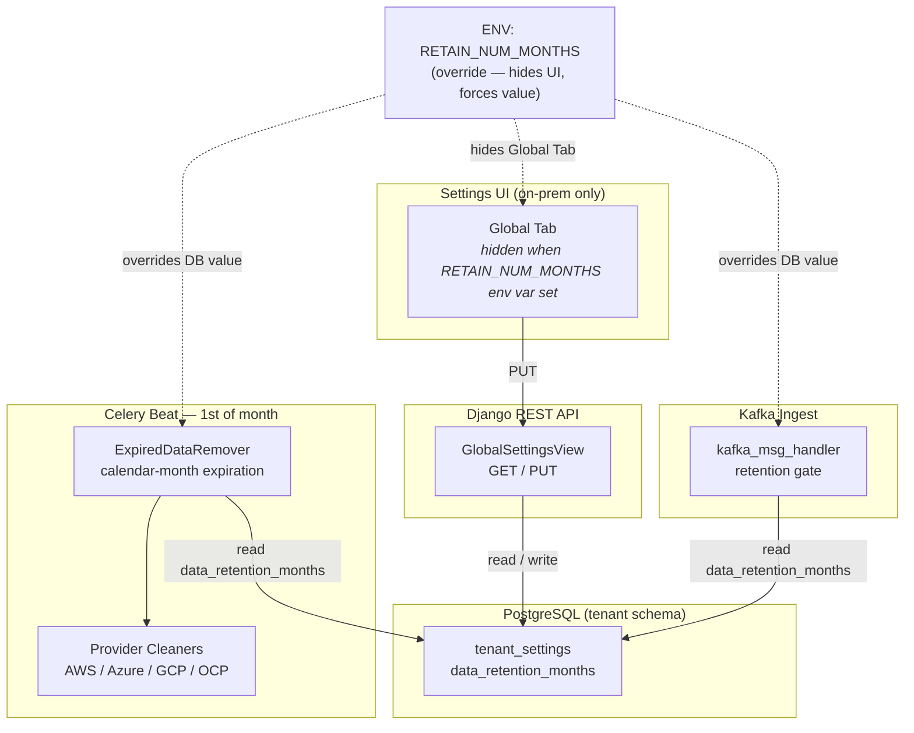

# Configurable Data Retention Period

Technical design for making the data retention period configurable at
runtime for Cost Management on-prem, replacing the static
`RETAIN_NUM_MONTHS` environment variable with a database-persisted
setting and a new Global Settings API endpoint.

**Jira Epic**: [COST-573](https://redhat.atlassian.net/browse/COST-573)
**PRD**: PRD06 — "More than 90 days of data"

---

## Decisions Needed from Tech Lead

### IQ-0: Initialization Strategy — Approach A vs Approach B

The central design question is how existing tenants acquire a
`data_retention_months` value. We propose two approaches:

**Approach A — Env-var fallback (no data migration)**

- The `tenant_settings` table is created empty.
- `get_data_retention_months(schema)` resolves the value using this
  priority chain: **env var → DB row → code default (3)**.
- Existing tenants with no row in `tenant_settings` continue to behave
  exactly as today — they fall back to the `RETAIN_NUM_MONTHS` env var
  (or its code default).
- A DB row is created only when an admin explicitly sets a value via
  the new PUT endpoint (on-prem only).
- **Pros**: Zero-risk rollout. No data migration. Behavior is identical
  to today until a user actively changes it.
- **Cons**: Retention value is not visible in the DB for tenants that
  have not opted in. Operational queries against `tenant_settings` may
  return no rows for most tenants.

**Approach B — Seed migration (all tenants get a row)**

- The `tenant_settings` table is created **and** a data migration seeds
  one row per existing tenant schema with `data_retention_months` set to
  the current `RETAIN_NUM_MONTHS` env var value (or code default `3`).
- `get_data_retention_months(schema)` still checks the env var first
  (backwards compatibility), but every tenant is guaranteed to have a
  DB row from day one.
- The PUT endpoint updates the existing row.
- **Pros**: DB is the single source of truth from the start. Simpler
  read path (row always exists). Easier to audit per-tenant retention.
- **Cons**: Requires a data migration that iterates tenant schemas.
  Slightly more complex rollout. The seeded value must match the env
  var at deploy time, or tenants could see a silent retention change.

**Recommendation**: We lean toward **Approach A** for a safer initial
rollout — no data migration risk, and the env var remains authoritative
until a user explicitly opts in. Approach B can be adopted later if the
team prefers DB-first.

**Tech lead input requested.**

---

| # | Decision | Status | Proposal |
|---|----------|--------|----------|
| **IQ-0** | Initialization strategy: env-var fallback (A) vs seed migration (B)? | **Open** | See above. Lean A. |
| **IQ-1** | Should `MASU_RETAIN_NUM_MONTHS_LINE_ITEM_ONLY` also become configurable, or remain env-var only? | Open | Keep as env-var only — it is an internal optimization knob, not user-facing. |
| **IQ-2** | `migrate_trino_tables` hardcodes `months = 5` for Trino partition cleanup, and the Postgres provider cleaners use the same static `Config.MASU_RETAIN_NUM_MONTHS` — both should read from `TenantSettings` to handle retention > 5 months. This applies to the full purge pipeline (Trino partitions + Postgres aggregated data). | Open | Yes — all cleanup paths (Trino partitions, Postgres partition deletes, manifest purge) should read from `get_data_retention_months()`. |
| **IQ-3** | Deploy defaults are inconsistent (kustomize: `3`, Django: `4`, docker-compose: `4`). Which is authoritative? | Open | Align all to `3` per PRD. |
| **IQ-4** | Frontend changes (koku-ui-onprem) — separate ticket or part of COST-573? | Open | Separate ticket — backend API ships first. |

---

## Document Catalog

| # | Document | Type | Description |
|---|----------|------|-------------|
| 1 | [data-model.md](data-model.md) | DD | `TenantSettings` schema, env-var override logic, migration, row lifecycle |
| 2 | [api.md](api.md) | DD | Global Settings endpoint, serializer, permissions, validation rules |
| 3 | [retention-pipeline.md](retention-pipeline.md) | DD | Purge flow changes, calendar-month fix, read-path refactor, Kafka ingest gate |
| 4 | [phased-delivery.md](phased-delivery.md) | DD | Implementation phases, per-phase artifacts, validation criteria, rollback strategy |

**Reading order**: 1 → 2 → 3 → 4

---

## Architecture Overview

---

## Current State

- `RETAIN_NUM_MONTHS` env var → `settings.RETAIN_NUM_MONTHS` (default `4`)
- `Config.MASU_RETAIN_NUM_MONTHS` mirrors `settings.RETAIN_NUM_MONTHS`
- `ExpiredDataRemover._calculate_expiration_date()` uses
  `months × timedelta(days=30)` — **approximation the PRD explicitly forbids**
- Purge runs on day 1 of each month via Celery Beat
  (`REMOVE_EXPIRED_REPORT_DATA_ON_DAY`)
- `kafka_msg_handler` rejects OCP payloads outside retention window
- `materialized_view_month_start()` uses `settings.RETAIN_NUM_MONTHS`
  to bound API query date ranges

---

## Key Design Decisions

| ID | Decision | Rationale |
|----|----------|-----------|
| D1 | Dedicated `TenantSettings` model (not JSON blob on `UserSettings`) | Typed columns, DB-level `CHECK` constraints, clean separation of operational settings from user preferences |
| D2 | Per-tenant-schema table (same as `user_settings`) | Matches existing multi-tenancy; ready for COST-7102 provider-layer migration |
| D3 | Env var `RETAIN_NUM_MONTHS` overrides DB and hides UI | PRD requirement for backwards compatibility with SaaS |
| D4 | `relativedelta(months=N)` replaces `months × 30 days` | PRD explicitly requires full calendar months |
| D5 | Single row per tenant (get-or-create pattern) | Simplicity; no multi-row coordination needed |
| D6 | Backend logic is environment-agnostic | The API, read helpers, purge pipeline, and Kafka gate work identically on SaaS and on-prem. The `ONPREM` flag only gates the **UI route registration** — all internal code paths use `get_data_retention_months()` regardless of environment. On SaaS, the env var is always set, so the DB value is never reached; on on-prem without the env var, the DB value (or default) is used. No `if ONPREM` checks in the retention logic. |

---

## Files Changed (Summary)

Detailed per-file changes are in each sub-document.

| Area | Files | Change Type |
|------|-------|-------------|
| **Model** | `reporting/tenant_settings/models.py` | New |
| **Migration** | `reporting/migrations/0344_tenantsettings.py` | New |
| **API** | `api/settings/views.py`, `api/settings/serializers.py`, `api/urls.py` | Modified |
| **Retention read path** | `api/settings/utils.py` (new helpers), `masu/config.py`, `koku/settings.py` | Modified |
| **Expiration calc** | `masu/processor/expired_data_remover.py` | Modified — calendar-month fix |
| **Materialized view** | `api/utils.py` | Modified — reads from helper |
| **Kafka gate** | `masu/external/kafka_msg_handler.py` | Modified — reads from helper |
| **Deploy defaults** | `koku/settings.py`, `docker-compose.yml` | Modified — align to 3 |

---

## Changelog

| Version | Date | Summary |
|---------|------|---------|
| v1.0 | 2026-03-11 | Initial draft from PRD triage against koku codebase. 4 documents, 4 open questions. |
