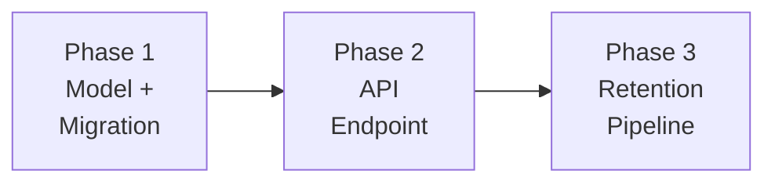

# Phased Delivery Plan

**Parent**: [README.md](README.md) · **Status**: Draft

---

## Phase Overview



| Phase | Goal | User-Facing? | Migration | Rollback Strategy |
|-------|------|-------------|-----------|-------------------|
| 1 | Create `TenantSettings` model and migration | No | M1 (+ M2 if Approach B) | Drop table |
| 2 | Expose Global Settings API endpoint | No (API only) | None | Remove URL route |
| 3 | Retention pipeline reads from DB; calendar-month fix | No | None | Revert read-path code |

---

## Phase 1: Model & Migration

**Goal**: Create the `TenantSettings` table in all tenant schemas.

**Depends on**: [IQ-0](README.md#iq-0-initialization-strategy--approach-a-vs-approach-b)
— tech lead decides between Approach A (empty table, env-var fallback)
and Approach B (seed migration, all tenants get a row).

### Artifacts (Approach A — env-var fallback)

| Artifact | File | Description |
|----------|------|-------------|
| `TenantSettings` model | `reporting/tenant_settings/models.py` | New Django model |
| Module init | `reporting/tenant_settings/__init__.py` | New module |
| Migration M1 | `reporting/migrations/0344_tenantsettings.py` | DDL + `CHECK` constraint |

### Additional Artifacts (Approach B — seed migration)

| Artifact | File | Description |
|----------|------|-------------|
| Migration M2 | `reporting/migrations/0345_seed_tenantsettings.py` | Data migration: one row per tenant schema |

### Validation

- Migration runs without error on fresh DB and on existing schemas
- Template schema contains the new table (for future tenant clones)
- `TenantSettings.objects.create()` respects default values
- `CHECK` constraint rejects values outside `[3, 120]`
- (Approach B only) Every tenant schema has exactly one row after M2

### Rollback

1. Reverse migration: drops `tenant_settings` table
2. No other code depends on the table yet

---

## Phase 2: API Endpoint

**Goal**: Expose GET/PUT for data retention configuration (on-prem only).

### Artifacts

| Artifact | File | Description |
|----------|------|-------------|
| `TenantSettingsSerializer` | `api/settings/serializers.py` | Validation for `data_retention_months` |
| `GlobalSettingsView` | `api/settings/views.py` | GET/PUT view with env-var override logic |
| URL route | `api/urls.py` | On-prem gated route registration |

### Validation

- `GET` returns default values for a new tenant
- `GET` returns `env_override: true` when `RETAIN_NUM_MONTHS` is set
- `PUT` updates the value and persists across restarts
- `PUT` returns `403` when env var is set
- `PUT` returns `400` for values outside `[3, 120]`
- Non-admin users get `403` on PUT
- Endpoint does not exist when `ONPREM = False`

### Rollback

1. Remove URL route from `api/urls.py`
2. Revert view and serializer additions
3. Table remains (harmless)

---

## Phase 3: Retention Pipeline Integration

**Goal**: Retention pipeline reads from `TenantSettings` and uses
correct calendar-month arithmetic.

### Artifacts

| Artifact | File | Description |
|----------|------|-------------|
| `get_data_retention_months()` | `api/settings/utils.py` | Centralized read helper (env > DB > default) |
| Expiration fix | `masu/processor/expired_data_remover.py` | `relativedelta` replaces `months × 30` |
| Kafka gate update | `masu/external/kafka_msg_handler.py` | Reads from helper |
| Materialized view update | `api/utils.py` | `materialized_view_month_start` accepts `schema_name` |
| Constructor change | `masu/processor/_tasks/remove_expired.py` | Passes `schema_name` to `ExpiredDataRemover` |

### Validation

- `get_data_retention_months()` returns env var value when set
- `get_data_retention_months()` returns DB value when env var unset
- `get_data_retention_months()` returns startup default (4) when no DB row
- `_calculate_expiration_date()` produces correct calendar-month dates:
  - 3 months from March 10 → December 1 (not December 16)
  - 12 months from March 10 → March 1 of previous year
  - 13 months from January 31 → December 1 (two years prior, not off-by-one)
- Kafka handler rejects payloads outside per-tenant retention
- `materialized_view_month_start` returns correct start for tenants
  with non-default retention
- Existing test suite passes (retention behavior unchanged for default config)

### Rollback

1. Revert all read-path changes → code falls back to
   `Config.MASU_RETAIN_NUM_MONTHS` (static env var)
2. Calendar-month fix can be reverted independently if needed

---

## Risk Register

### R1: Template-clone misses new table

**Phase**: 1 · **Severity**: Medium

If the template schema has not been migrated before a new tenant is
provisioned, the cloned schema will not contain `tenant_settings`.

**Mitigation**: The migration runs on the template schema before
any tenant schemas. Verify in CI with a test that provisions a new
tenant after migration and confirms the table exists. The
get-or-create fallback in the API (Phase 2) provides a safety net.

---

### R2: Duplicate row race condition

**Phase**: 2 · **Severity**: Low

Two concurrent requests to a newly provisioned tenant could both
attempt get-or-create, inserting two rows.

**Mitigation**: Use `select_for_update()` inside `transaction.atomic()`
for the get-or-create path in PUT. The GET endpoint is side-effect-free
and does not create rows. Alternatively, add a database-level constraint
(partial unique index on a constant column, or simply always read
`.first()` and accept an extra row is harmless since all queries use
`.first()`).

---

### R3: Deploy default inconsistency

**Severity**: Low · **Status**: Accepted — no action required

Kustomize says `"3"`, Django says `4`, docker-compose says `4`.
Different defaults could confuse operators.

**Resolution**: We intentionally keep `DEFAULT_RETAIN_NUM_MONTHS = 4`
in Django and docker-compose to preserve existing behavior (see
[R6](#r6-default-change-eliminated--no-phase-4)). Kustomize `"3"` is
SaaS-specific and always delivered via the env var, which overrides
the code default. The new `TenantSettings.DEFAULT_RETENTION_MONTHS = 3`
only applies to the DB column default for **new** tenants who
explicitly configure retention via the API. The inconsistency is
cosmetic and well-documented — operators interact only with the API
or env var, never with the Django code default directly.

---

### R4: Calendar-month fix shifts expiration date on first run

**Phase**: 3 · **Severity**: Medium

The switch from `months × 30 days` to `relativedelta(months=N)`
changes the computed expiration date. For the current default of
3–4 months the shift is small (days), but for larger values it
grows. On the first purge after deploy, data that was previously
retained could be deleted (or vice versa).

**Mitigation**:
1. Log both old and new expiration dates during the first purge
   cycle after deploy (temporary dual-log).
2. Unit tests compare old vs new formula for values 3, 4, 6, 12,
   24, 60, 120 to document the exact shift.
3. First purge can run in `simulate=True` mode to preview what
   would be deleted before committing.

---

### R5: Kafka schema resolution overhead

**Phase**: 3 · **Severity**: Low

The Kafka handler must resolve `schema_name` from the manifest's
provider to call `get_data_retention_months()`.

**Mitigation**: The manifest → provider → customer chain is already
loaded in the handler's context. The schema is a field on the
customer object, not an extra query.

---

### R6: Default change eliminated — no Phase 4

**Original Severity**: High · **Status**: **Resolved — eliminated by design**

**Original risk**: Changing `DEFAULT_RETAIN_NUM_MONTHS` from `4` to
`3` in Django and docker-compose would cause existing on-prem
deployments (that never set `RETAIN_NUM_MONTHS` explicitly) to
silently delete one additional month of data on the next purge cycle.

**Resolution**: We do **not** change Django's `DEFAULT_RETAIN_NUM_MONTHS`
or the docker-compose default. Both remain at `4`. Phase 4 is removed
from the delivery plan entirely. The reasoning:

1. **SaaS already uses `3`** — kustomize sets `RETAIN_NUM_MONTHS = "3"`
   via the env var, which overrides the code default. No change needed.
2. **On-prem relies on the code default of `4`** — deployments that
   never set `RETAIN_NUM_MONTHS` have been retaining 4 months of data
   since inception. Changing the code default would silently reduce
   retention by one month with no operator action or warning.
3. **The PRD says the *minimum* is 3 months** (90 days), not that the
   *default* must be 3. The `CHECK (>= 3)` constraint and the
   `TenantSettings.DEFAULT_RETENTION_MONTHS = 3` column default
   enforce the PRD floor for tenants who actively configure retention.
4. **No behavioral change for existing deployments** — the priority
   chain (`env var → DB → code default`) means existing tenants
   continue to get `4` unless they explicitly opt in via the API or
   their operator sets the env var.

This eliminates R6 without trade-offs. The only `3` in the system is
the DB column default (for new `TenantSettings` rows) and the `CHECK`
constraint floor — both only come into play when an admin actively
uses the new Global Settings feature.

---

### R7: DB read failure in purge path causes data loss

**Phase**: 3 · **Severity**: **High**

If `get_data_retention_months()` fails to read from the DB (connection
error, schema issue, migration not yet applied), it could fall back to
a shorter retention than the tenant's actual setting. If the tenant's
actual retention is `12` and the fallback is `4`, this could cause the
purge to delete 8 months of data.

**Mitigation**:
1. The helper falls back to the **env var first** (which is always set
   on SaaS). On-prem without the env var falls to
   `Config.MASU_RETAIN_NUM_MONTHS` (startup-cached default `4`).
2. If the DB query raises an exception, the helper logs an error and
   falls back to `Config.MASU_RETAIN_NUM_MONTHS` — the same startup-
   cached value. This preserves current behavior on failure.
3. `ExpiredDataRemover` already supports `simulate=True` — the
   scheduled Beat job can be configured to simulate first and only
   purge after verification.

```python
def get_data_retention_months(schema_name: str) -> int:
    env_val = os.environ.get("RETAIN_NUM_MONTHS")
    if env_val is not None:
        return int(env_val)

    try:
        with schema_context(schema_name):
            row = TenantSettings.objects.first()
            if row:
                return row.data_retention_months
    except Exception:
        LOG.error(
            "Failed to read tenant_settings for %s, "
            "falling back to MASU_RETAIN_NUM_MONTHS",
            schema_name,
        )

    # Fallback is Config.MASU_RETAIN_NUM_MONTHS (startup-cached,
    # default 4) — NOT TenantSettings.DEFAULT_RETENTION_MONTHS (3).
    # See R10 for the reasoning.
    return Config.MASU_RETAIN_NUM_MONTHS
```

---

### R8: Approach B seed migration reads wrong env var value

**Phase**: 1 (Approach B only) · **Severity**: Medium

If Approach B is chosen, M2 reads `RETAIN_NUM_MONTHS` from the
environment at migration time. If the migration runner pod has a
different env var value than the worker pods (e.g., migration runs
with `3` but workers use `4`), the seeded rows will not match the
effective retention.

**Mitigation**:
1. Document that the migration must run in the same environment
   configuration as the workers.
2. The migration logs the seeded value for each schema so operators
   can audit.
3. After migration, operators can verify via the GET endpoint.

---

### R9: Phase ordering violation — pipeline reads DB before API exists

**Phase**: 2–3 · **Severity**: Low (downgraded from Medium)

If Phase 3 (pipeline reads from DB) deploys before Phase 2 (API
endpoint), there is no way to create a `tenant_settings` row via the
API. With Approach A (no seed migration), tenants have no DB row, so
the helper falls through to the code default (`4`).

Since we no longer change the code default (see
[R6](#r6-default-change-eliminated--no-phase-4)), this fallback
produces the **same value as today** — making this scenario safe.

**Mitigation**:
1. Phases 2 and 3 should ship together (or Phase 2 first).
2. Phase ordering is enforced by PR sequencing.

---

### R10: Helper fallback and GET side-effect reintroduce R6

**Phase**: 2–3 · **Severity**: Medium · **Status**: **Resolved — fixed in design**

**Original risk**: Although we kept Django's code default at `4`
(resolving R6), the risk re-entered through two paths:

1. **Helper final fallback**: `get_data_retention_months()` returned
   `TenantSettings.DEFAULT_RETENTION_MONTHS` (`3`) as its last-resort
   fallback when no env var was set and no DB row existed. For
   Approach A on-prem deployments, this would silently cut retention
   from `4` to `3` — the same R6 scenario.

2. **GET view side-effect**: The GET endpoint called
   `TenantSettings.objects.get_or_create(defaults={"data_retention_months": 3})`.
   An admin simply checking the current value would create a DB row
   with `3`, and all subsequent purge reads would use it instead of
   the effective `4`.

**Resolution**:

1. **Helper fallback changed**: The final fallback is now
   `Config.MASU_RETAIN_NUM_MONTHS` (startup-cached from
   `settings.RETAIN_NUM_MONTHS`, default `4`) — same value the system
   used before this feature. No env var + no DB row = same behavior
   as today.

2. **GET is now side-effect-free**: It calls
   `get_data_retention_months(schema)` which reads env var → DB →
   startup default without creating any rows. Only PUT creates a row
   (via `get_or_create` with `select_for_update()`), seeded with
   `Config.MASU_RETAIN_NUM_MONTHS` (`4`) — not the column default
   (`3`).

This ensures R6 stays eliminated across all code paths.

---

### Summary

| ID | Risk | Phase | Severity | Status |
|----|------|-------|----------|--------|
| R1 | Template-clone misses new table | 1 | Medium | Mitigated — CI + get-or-create fallback |
| R2 | Duplicate row race condition | 2 | Low | Mitigated — `select_for_update()` |
| R3 | Deploy default inconsistency | — | Low | Accepted — cosmetic, well-documented |
| R4 | Calendar-month fix shifts expiration date | 3 | Medium | Mitigated — dual-log + unit tests + simulate |
| R5 | Kafka schema resolution overhead | 3 | Low | Mitigated — no extra query |
| R6 | Default 4→3 causes unexpected data deletion | — | ~~High~~ | **Resolved** — eliminated by keeping code default at `4`; Phase 4 removed |
| R7 | DB read failure in purge causes data loss | 3 | **High** | Mitigated — exception handler falls back to env-cached value |
| R8 | Seed migration reads wrong env var | 1 | Medium | Mitigated — docs + logging (Approach B only) |
| R9 | Phase ordering violation | 2–3 | Low | Mitigated — code default unchanged, fallback is safe |
| R10 | Helper fallback / GET side-effect reintroduce R6 | 2–3 | Medium | **Resolved** — helper fallback changed to `Config.MASU_RETAIN_NUM_MONTHS`; GET is side-effect-free |

---

## Changelog

| Version | Date | Summary |
|---------|------|---------|
| v1.0 | 2026-03-11 | Initial draft |
| v1.1 | 2026-03-11 | Expanded risk register: R6 (default change data loss), R7 (DB failure fallback), R8 (seed env mismatch), R9 (phase ordering) |
| v1.2 | 2026-03-11 | R6 resolved: keep `DEFAULT_RETAIN_NUM_MONTHS = 4`, remove Phase 4. R3 accepted, R9 downgraded to Low |
| v1.3 | 2026-03-11 | R10 found and resolved: helper fallback + GET side-effect would have reintroduced R6. Helper uses startup-cached default; GET is read-only; PUT seeds with `4` and includes `select_for_update()` + cache invalidation |
