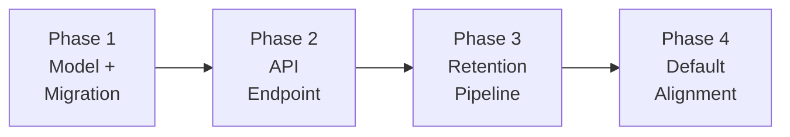

# Phased Delivery Plan

**Parent**: [README.md](README.md) · **Status**: Draft

---

## Phase Overview

| Phase | Goal | User-Facing? | Migration | Rollback Strategy |
|-------|------|-------------|-----------|-------------------|
| 1 | Create `TenantSettings` model and migration | No | M1 (+ M2 if Approach B) | Drop table |
| 2 | Expose Global Settings API endpoint | No (API only) | None | Remove URL route |
| 3 | Retention pipeline reads from DB; calendar-month fix | No | None | Revert read-path code |
| 4 | Align deploy defaults to 3 months | No | None | Revert defaults |

---

## Phase 1: Model & Migration

**Goal**: Create the `TenantSettings` table in all tenant schemas.

**Depends on**: [IQ-0](README.md#iq-0-initialization-strategy--approach-a-vs-approach-b)
— tech lead decides between Approach A (empty table, env-var fallback)
and Approach B (seed migration, all tenants get a row).

### Artifacts (Approach A — env-var fallback)

| Artifact | File | Description |
|----------|------|-------------|
| `TenantSettings` model | `reporting/tenant_settings/models.py` | New Django model |
| Module init | `reporting/tenant_settings/__init__.py` | New module |
| Migration M1 | `reporting/migrations/0344_tenantsettings.py` | DDL + `CHECK` constraint |

### Additional Artifacts (Approach B — seed migration)

| Artifact | File | Description |
|----------|------|-------------|
| Migration M2 | `reporting/migrations/0345_seed_tenantsettings.py` | Data migration: one row per tenant schema |

### Validation

- Migration runs without error on fresh DB and on existing schemas
- Template schema contains the new table (for future tenant clones)
- `TenantSettings.objects.create()` respects default values
- `CHECK` constraint rejects values outside `[3, 120]`
- (Approach B only) Every tenant schema has exactly one row after M2

### Rollback

1. Reverse migration: drops `tenant_settings` table
2. No other code depends on the table yet

---

## Phase 2: API Endpoint

**Goal**: Expose GET/PUT for data retention configuration (on-prem only).

### Artifacts

| Artifact | File | Description |
|----------|------|-------------|
| `TenantSettingsSerializer` | `api/settings/serializers.py` | Validation for `data_retention_months` |
| `GlobalSettingsView` | `api/settings/views.py` | GET/PUT view with env-var override logic |
| URL route | `api/urls.py` | On-prem gated route registration |

### Validation

- `GET` returns default values for a new tenant
- `GET` returns `env_override: true` when `RETAIN_NUM_MONTHS` is set
- `PUT` updates the value and persists across restarts
- `PUT` returns `403` when env var is set
- `PUT` returns `400` for values outside `[3, 120]`
- Non-admin users get `403` on PUT
- Endpoint does not exist when `ONPREM = False`

### Rollback

1. Remove URL route from `api/urls.py`
2. Revert view and serializer additions
3. Table remains (harmless)

---

## Phase 3: Retention Pipeline Integration

**Goal**: Retention pipeline reads from `TenantSettings` and uses
correct calendar-month arithmetic.

### Artifacts

| Artifact | File | Description |
|----------|------|-------------|
| `get_data_retention_months()` | `api/settings/utils.py` | Centralized read helper (env > DB > default) |
| Expiration fix | `masu/processor/expired_data_remover.py` | `relativedelta` replaces `months × 30` |
| Kafka gate update | `masu/external/kafka_msg_handler.py` | Reads from helper |
| Materialized view update | `api/utils.py` | `materialized_view_month_start` accepts `schema_name` |
| Constructor change | `masu/processor/_tasks/remove_expired.py` | Passes `schema_name` to `ExpiredDataRemover` |

### Validation

- `get_data_retention_months()` returns env var value when set
- `get_data_retention_months()` returns DB value when env var unset
- `get_data_retention_months()` returns default (3) when no DB row
- `_calculate_expiration_date()` produces correct calendar-month dates:
  - 3 months from March 10 → December 1 (not December 16)
  - 12 months from March 10 → March 1 of previous year
  - 13 months from January 31 → December 1 (two years prior, not off-by-one)
- Kafka handler rejects payloads outside per-tenant retention
- `materialized_view_month_start` returns correct start for tenants
  with non-default retention
- Existing test suite passes (retention behavior unchanged for default config)

### Rollback

1. Revert all read-path changes → code falls back to
   `Config.MASU_RETAIN_NUM_MONTHS` (static env var)
2. Calendar-month fix can be reverted independently if needed

---

## Phase 4: Default Alignment

**Goal**: Align all deploy defaults to 3 months per PRD.

### Artifacts

| Artifact | File | Description |
|----------|------|-------------|
| Django default | `koku/koku/settings.py` | `DEFAULT_RETAIN_NUM_MONTHS = 3` |
| Compose default | `docker-compose.yml` | `RETAIN_NUM_MONTHS=${RETAIN_NUM_MONTHS-3}` |

### Validation

- Fresh deployment uses 3-month retention
- Existing deployments with `RETAIN_NUM_MONTHS` explicitly set are
  unaffected (env var overrides default)

### Rollback

1. Revert default values to `4`

---

## Risk Summary

| ID | Risk | Phase | Severity | Mitigation |
|----|------|-------|----------|------------|
| R1 | Template-clone misses new table | 1 | Medium | Verify in CI |
| R2 | Duplicate row race condition | 2 | Low | `select_for_update()` |
| R3 | Deploy default inconsistency | 4 | Low | Align all to `3` |
| R4 | Calendar-month fix shifts expiration date on first run | 3 | Medium | Log old vs new; compare in tests |
| R5 | Kafka schema resolution overhead | 3 | Low | Provider chain already loaded |

---

## Changelog

| Version | Date | Summary |
|---------|------|---------|
| v1.0 | 2026-03-11 | Initial draft |
