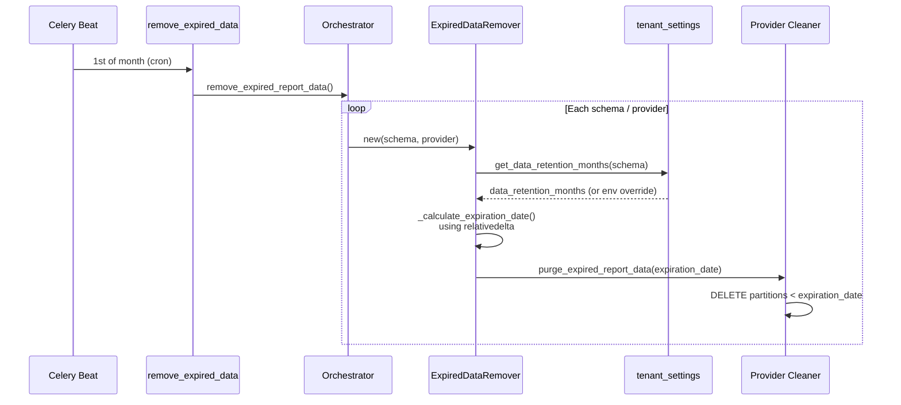

# Retention Pipeline Changes

**Parent**: [README.md](README.md) · **Status**: Draft

---

## Overview

This document covers changes to the data retention pipeline:

1. **Blast radius analysis** — comprehensive inventory of all data
   cleanup paths and which ones are affected.
2. **Read path refactor** — all retention consumers read from the new
   helper instead of `settings.RETAIN_NUM_MONTHS` directly.
3. **Calendar-month fix** — `_calculate_expiration_date()` switches from
   `months × 30 days` to `relativedelta(months=N)`.
4. **Kafka ingest gate** — updated to use the same helper.

---

## Blast Radius Analysis

### Retention-Driven Cleanup (affected — must use `get_data_retention_months()`)

These paths currently read `RETAIN_NUM_MONTHS` / `MASU_RETAIN_NUM_MONTHS`
and must be updated to call `get_data_retention_months(schema)`:

| # | Path | Schedule / Trigger | What It Deletes | Current Source |
|---|------|--------------------|----------------|----------------|
| 1 | `remove_expired_data` (Beat) → `Orchestrator` → `ExpiredDataRemover` → Provider Cleaners (AWS, Azure, GCP, OCP) | Monthly (1st, 00:00 UTC) | Postgres partitions, bills, usage periods, manifests | `Config.MASU_RETAIN_NUM_MONTHS` |
| 2 | `remove_expired_trino_partitions` (same Beat job) → OCP cleaner | Same as above | Trino/Hive partitions per month per source | `Config.MASU_RETAIN_NUM_MONTHS` |
| 3 | `kafka_msg_handler` — OCP ingest gate | Per Kafka message | Rejects + deletes temp payload for OCP data outside retention | `Config.MASU_RETAIN_NUM_MONTHS` |
| 4 | `materialized_view_month_start()` — API date window | Per API request | No deletion — bounds valid `start_date`/`end_date` range | `settings.RETAIN_NUM_MONTHS` |

**Provider cleaner detail** (all flow through `ExpiredDataRemover`):

| Cleaner | File | Deletes |
|---------|------|---------|
| `AWSReportDBCleaner` | `masu/processor/aws/aws_report_db_cleaner.py` | `PartitionedTable` rows + `cascade_delete` bills |
| `AzureReportDBCleaner` | `masu/processor/azure/azure_report_db_cleaner.py` | Same pattern |
| `GCPReportDBCleaner` | `masu/processor/gcp/gcp_report_db_cleaner.py` | Same pattern |
| `OCPReportDBCleaner` | `masu/processor/ocp/ocp_report_db_cleaner.py` | Postgres partitions + `cascade_delete` usage periods + Trino `delete_hive_partition_by_month` |
| `ReportManifestDBAccessor` | `masu/database/report_manifest_db_accessor.py` | `purge_expired_report_manifest` / `purge_expired_report_manifest_provider_uuid` |

### Hardcoded Values (affected — IQ-2)

| # | Path | Schedule / Trigger | What It Deletes | Hardcoded Value |
|---|------|--------------------|----------------|-----------------|
| 5 | `migrate_trino_tables --remove-expired-partitions` | Manual (management command) | Trino partitions for `MANAGED_TABLES` | `months = 5` |

### Event-Driven Cleanup (NOT affected — no retention dependency)

These paths delete data based on provider deletion, ETL dedup, or
ops commands. They do not use `RETAIN_NUM_MONTHS` and need no changes.

| # | Path | Trigger | What It Deletes |
|---|------|---------|----------------|
| 6 | `delete_source_beat` → `delete_source` | Beat daily 04:00 | Sources/providers marked for deletion |
| 7 | `delete_archived_data` | `Provider.post_delete` signal | S3 CSV/parquet + Trino rows for deleted provider |
| 8 | `purge_s3_files` / `purge_manifest_records` | Manual API (Unleash-gated) | S3 objects + manifests by prefix |
| 9 | `ParquetReportProcessor._delete_old_data` | ETL pipeline (per file) | Dedup: clears old parquet/Postgres data for reprocessed window |
| 10 | `trigger_delayed_tasks` | Beat every 30 min | Expired `DelayedCeleryTasks` rows (fires queued work) |
| 11 | `remove_stale_tenants` | Manual (not in Beat) | Tenant rows with no sources, older than 2 weeks (hardcoded) |
| 12 | `delete_openshift_on_cloud_data` | Chained in OCP-on-cloud summary | TRUNCATE/DELETE line items for date range during summarization |
| 13 | ETL SQL (`masu/database/sql/`) | Summary update tasks | DELETE/TRUNCATE during summary refresh (UI tables, tag tables) |
| 14 | `aws_null_bill_cleanup` | Manual management command | AWS bills with null payer (hardcoded date list, one-off ops) |
| 15 | `Provider.delete()` cascade | Source/provider deletion | Cross-schema cascade delete of all reporting tables for a provider |
| 16 | `crawl_account_hierarchy` | Beat daily 00:00 | Soft-delete only (sets `deleted_timestamp` on AWS org rows) |

### Summary

```
Affected:       5 code paths (4 read RETAIN_NUM_MONTHS + 1 hardcoded)
Not affected:  11 code paths (event-driven, not retention-based)
```

---

## 2. Read Path Refactor

### Current Call Sites

Every consumer currently reads a static value cached at startup:

| Consumer | Current Source | File |
|----------|---------------|------|
| `ExpiredDataRemover.__init__` | `Config.MASU_RETAIN_NUM_MONTHS` | `masu/processor/expired_data_remover.py:51` |
| Postgres provider cleaners (AWS, Azure, GCP, OCP) | via `ExpiredDataRemover` | `masu/processor/*/\*_report_db_cleaner.py` |
| Trino partition cleanup | hardcoded `months = 5` | `masu/management/commands/migrate_trino_tables.py:467` |
| `kafka_msg_handler` | `Config.MASU_RETAIN_NUM_MONTHS` | `masu/external/kafka_msg_handler.py:391` |
| `materialized_view_month_start` | `settings.RETAIN_NUM_MONTHS` | `api/utils.py:514` |
| `masu/api/status.py` | `Config.MASU_RETAIN_NUM_MONTHS` | `masu/api/status.py:55` |

**Note**: The Postgres provider cleaners (partition deletes, bill/usage
period deletes, manifest purge) all flow through `ExpiredDataRemover`,
so updating the `ExpiredDataRemover` read path covers the full Postgres
cleanup pipeline. The Trino `migrate_trino_tables` command is a separate
code path with a hardcoded value that must be updated independently.

### Proposed Change

All call sites switch to `get_data_retention_months(schema_name)`,
defined in [data-model.md § Read Helper](data-model.md#read-helper).

```
Before:  Config.MASU_RETAIN_NUM_MONTHS  (static int, one value for all tenants)
After:   get_data_retention_months(schema_name)  (per-tenant, DB-backed)
```

**Environment-agnostic**: This refactor applies to both SaaS and
on-prem code paths — there are no `if ONPREM` checks in the retention
logic. On SaaS the `RETAIN_NUM_MONTHS` env var is always set, so the
helper returns the env value and never hits the DB. On on-prem without
the env var, it reads from `tenant_settings` (or falls back to default
`3`). The distinction is transparent to callers.

**Impact on `Config.MASU_RETAIN_NUM_MONTHS`**: This attribute is no
longer the primary source of truth. It remains as a module-level
fallback for code paths that do not have a `schema_name` in scope
(e.g., `masu/api/status.py` for operational visibility). The env-var
override logic in the helper handles this transparently.

### `materialized_view_month_start` Change

This function is called from report serializers where `request.user`
is available:

```python
# api/utils.py (modified)

def materialized_view_month_start(dh=DateHelper(), schema_name=None):
    """Datetime of midnight on the first of the month where
    materialized summary starts."""
    months = (
        get_data_retention_months(schema_name)
        if schema_name
        else settings.RETAIN_NUM_MONTHS
    )
    return dh.this_month_start - relativedelta(months=months - 1)
```

Callers in report serializers pass `schema_name` from the request
context. The fallback to `settings.RETAIN_NUM_MONTHS` preserves
backwards compatibility for callers that don't have a schema.

---

## 3. Calendar-Month Expiration Fix

### Current Bug

```python
# masu/processor/expired_data_remover.py (current)

def _calculate_expiration_date(self):
    months = self._months_to_keep
    today = DateHelper().today
    middle_of_current_month = today.replace(day=15)
    num_of_days_to_expire_date = months * timedelta(days=30)  # ← BUG
    middle_of_expire_date_month = middle_of_current_month - num_of_days_to_expire_date
    expiration_date = datetime(
        year=middle_of_expire_date_month.year,
        month=middle_of_expire_date_month.month,
        day=1,
        tzinfo=settings.UTC,
    )
    return expiration_date
```

**Problem**: `months × 30 days` is an approximation. For 12 months it
computes 360 days instead of a full calendar year. The PRD explicitly
states: *"approximating 1 month = 30 days is not valid"*.

**Example**: With `data_retention_months = 12` and today = March 10, 2026:
- Current: `12 × 30 = 360 days` → expiration ≈ April 1, 2025
- Correct: `relativedelta(months=12)` → March 1, 2025

### Proposed Fix

```python
# masu/processor/expired_data_remover.py (proposed)

def _calculate_expiration_date(self):
    months = self._months_to_keep
    today = DateHelper().today
    expiration_ref = today - relativedelta(months=months)
    expiration_date = datetime(
        year=expiration_ref.year,
        month=expiration_ref.month,
        day=1,
        tzinfo=settings.UTC,
    )
    msg = f"Report data expiration is {expiration_date} "
          f"for a {months} month retention policy"
    LOG.info(msg)
    return expiration_date
```

**Semantics**: Retain `N` full calendar months. The expiration date is
the first of the month that is `N` months before today. All data in
the current partial month and the previous `N-1` complete months is
retained.

Example with `data_retention_months = 12` and today = March 10, 2026:
- `today - 12 months` = March 10, 2025
- Expiration date = **March 1, 2025**
- Retained: March 2025 through March 2026 (current month)

### ExpiredDataRemover Constructor Change

The constructor accepts `schema_name` so it can call the helper:

```python
# masu/processor/expired_data_remover.py (proposed)

def __init__(self, customer_schema, provider, ..., schema_name=None):
    ...
    self._months_to_keep = num_of_months_to_keep
    if self._months_to_keep is None:
        if schema_name:
            self._months_to_keep = get_data_retention_months(schema_name)
        else:
            self._months_to_keep = Config.MASU_RETAIN_NUM_MONTHS
```

The `schema_name` is available in the Celery task that creates the
`ExpiredDataRemover` — it is passed as the first argument (`schema`).

---

## 4. Kafka Ingest Gate

### Current Code

```python
# masu/external/kafka_msg_handler.py:389-395

dh = DateHelper()
manifest_end = manifest.end or dh.month_end(manifest.date)
if manifest_end < dh.relative_month_end(-Config.MASU_RETAIN_NUM_MONTHS):
    msg = f"Received OCP data outside our retention period ..."
    LOG.warning(...)
    shutil.rmtree(payload_path.parent)
    return None, manifest.uuid
```

### Proposed Change

```python
schema_name = ...  # resolved from manifest → provider → customer
retention_months = get_data_retention_months(schema_name)

dh = DateHelper()
manifest_end = manifest.end or dh.month_end(manifest.date)
if manifest_end < dh.relative_month_end(-retention_months):
    ...
```

**Schema resolution**: The `kafka_msg_handler` has access to the
`CostUsageReportManifest` which links to a `Provider` which links
to a `Customer` (and therefore `schema_name`). The schema can be
resolved from the manifest's provider.

---

## Purge Flow Diagram (After Changes)



---

## Files Changed

| File | Change |
|------|--------|
| `masu/processor/expired_data_remover.py` | Calendar-month fix + read from helper |
| `masu/external/kafka_msg_handler.py` | Read retention from helper |
| `api/utils.py` | `materialized_view_month_start` accepts `schema_name` |
| `masu/config.py` | `MASU_RETAIN_NUM_MONTHS` becomes fallback only |
| `masu/processor/_tasks/remove_expired.py` | Pass `schema_name` to `ExpiredDataRemover` |
| `masu/management/commands/migrate_trino_tables.py` | Replace hardcoded `months = 5` with `get_data_retention_months()` |

---

## Risks

| ID | Risk | Severity | Mitigation |
|----|------|----------|------------|
| R4 | Calendar-month change shifts expiration date — could delete or retain more data than before on first run | Medium | Compare old vs new expiration dates in tests; log both during transition |
| R5 | Kafka handler schema resolution adds a DB query per message | Low | The manifest → provider → customer chain is already loaded; schema is cached on the provider |

---

## Changelog

| Version | Date | Summary |
|---------|------|---------|
| v1.0 | 2026-03-11 | Initial draft |
| v1.1 | 2026-03-11 | Add blast radius analysis: 5 affected paths, 11 unaffected event-driven paths |
