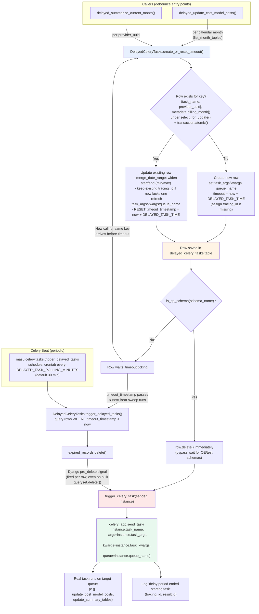

# Delayed Celery Tasks

Debounce/coalesce mechanism for Celery tasks that would otherwise be enqueued
too frequently (e.g. repeated cost-model or price-list edits). Instead of
firing a task immediately, callers "park" a row describing the task with a
timeout. Repeat calls for the same key reset the timer and widen the payload
instead of enqueuing duplicate tasks. A periodic Beat job sweeps expired rows;
deleting a row is what actually fires the real task, via a Django `pre_delete`
signal.

**Model / table**: [`DelayedCeleryTasks`](../../koku/reporting_common/models.py#L149-L278)
(`delayed_celery_tasks`, public schema — see [`.cursor/rules/multi-tenancy.mdc`](../../.cursor/rules/multi-tenancy.mdc)).

## Diagram

## Key mechanics

1. **Debounce key** — rows are keyed by `(task_name, provider_uuid)`, or
   `(task_name, provider_uuid, metadata.billing_month)` when `billing_month`
   is passed (used by cost-model updates so there's one pending row per
   calendar month).
2. **Coalescing under lock** —
   [`create_or_reset_timeout`](../../koku/reporting_common/models.py#L197-L260)
   wraps the lookup/update in `transaction.atomic()` + `select_for_update()`,
   so concurrent calls for the same key serialize instead of racing.
3. **Date-range widening** — when `merge_date_range=True` (cost-model path),
   a new call's `start_date`/`end_date` are widened (min/max) against the
   existing row rather than overwritten, in
   [`_merge_task_kwargs_date_range`](../../koku/reporting_common/models.py#L176-L195).
4. **Firing mechanism** — nothing calls `send_task` directly. Deleting a
   `DelayedCeleryTasks` row (whether via the Beat sweep's bulk `.delete()` or
   the QE immediate-delete bypass) triggers the `pre_delete` signal receiver
   [`trigger_celery_task`](../../koku/reporting_common/models.py#L263-L278),
   which reconstructs the original task call from the stored
   `task_name`/`task_args`/`task_kwargs`/`queue_name`.
5. **QE bypass** — for QE/test schemas (`is_qe_schema`), the row is deleted
   right after creation/update so the task fires almost immediately instead
   of waiting out the full delay.
6. **Timing** — worst-case latency after the last edit is `DELAYED_TASK_TIME`
   (default 3600s, configurable per env — e.g. 20-30s in local
   `docker-compose`) plus up to one `DELAYED_TASK_POLLING_MINUTES` Beat
   interval (default 30 min).

## Producers

| Caller | Key includes `billing_month`? | `merge_date_range`? |
|---|---|---|
| [`delayed_summarize_current_month`](../../koku/masu/processor/tasks.py#L208-L226) | No | No |
| [`delayed_update_cost_model_costs`](../../koku/masu/processor/tasks.py#L229-L280) | Yes | Yes |

## Consumer (Beat schedule)

- Schedule registered in [`koku/koku/celery.py`](../../koku/koku/celery.py) as
  `delayed_tasks_trigger`, driven by `DELAYED_TASK_POLLING_MINUTES`.
- Task: [`masu.celery.tasks.trigger_delayed_tasks`](../../koku/masu/celery/tasks.py#L539-L542),
  queue `DownloadQueue.DEFAULT`.

## Related docs

- [`celery-tasks.md`](celery-tasks.md#delayed-task-trigger) — task inventory entry and Beat schedule context.
- [`cost-models.md`](cost-models.md) — how `delayed_update_cost_model_costs` fits into cost model rate sync.
