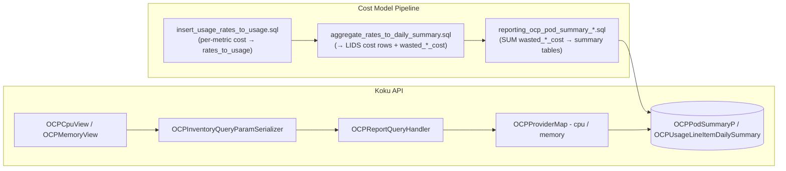

# Efficiency scores (Optimizations Summary)

Help FinOps and Dev/Ops reason about CPU and memory utilization using **usage efficiency** and **wasted cost** on OpenShift workload reports. The UI (koku-ui) consumes the same **`/reports/openshift/compute/`** and **`/reports/openshift/memory/`** endpoints as existing inventory reports; this hub describes what the Koku backend **implements today** and what remains product backlog.

---

## One-paragraph scope

**Implemented:** For `cpu` and `memory` report types, the API adds **`total_score`** on the **`total`** object and **`score`** on each **data** row (when scores are computed), exposing **`usage_efficiency_percent`** (computed at query time) and **`wasted_cost`** (pre-computed in the cost model pipeline and stored as `wasted_cpu_cost` / `wasted_memory_cost` columns on [`OCPUsageLineItemDailySummary`](../../../koku/reporting/provider/ocp/models.py) and the three pod summary tables). Migration [`0351`](../../../koku/reporting/migrations/0351_pod_summary_wasted_cost.py) added the new columns. **Not implemented:** a separate `efficiency`-only route; cost/volume reports do not expose these fields. **Backlog** (out of code): idle/cost-efficiency/overhead scores and dedicated Optimizations Summary routing in the UI.

---

## Prerequisites (read before coding)

| Topic | Where |
|-------|--------|
| Multi-tenancy (tenant vs public, `tenant_context` / `schema_context`) | [`.cursor/rules/multi-tenancy.mdc`](../../../.cursor/rules/multi-tenancy.mdc), [`AGENTS.md`](../../../AGENTS.md) |
| Report API pattern (serializer → query handler → provider map → ORM) | [`api-serializers-provider-maps.md`](../api-serializers-provider-maps.md) |
| OCP daily line item columns (usage vs request hours) | [`csv-processing-ocp.md`](../csv-processing-ocp.md) |
| Formulas, cost basis, accuracy, response shape | [formulas-and-data-contract.md](./formulas-and-data-contract.md) |

---

## Document catalog and reading order

| Order | Document | Role |
|-------|----------|------|
| 1 | This README | As-built behavior, code map, builder handoff |
| 2 | [formulas-and-data-contract.md](./formulas-and-data-contract.md) | Exact math, pipeline phases, query table selection, code snippets, accuracy worked example |

---

## As-built behavior (summary)

| Area | Behavior |
|------|-----------|
| **Endpoints** | [`OCPCpuView`](../../../koku/api/report/ocp/view.py) → `GET /api/cost-management/v1/reports/openshift/compute/`; [`OCPMemoryView`](../../../koku/api/report/ocp/view.py) → `…/memory/`. Router: [`koku/api/urls.py`](../../../koku/api/urls.py). |
| **Serializer** | [`OCPInventoryQueryParamSerializer`](../../../koku/api/report/ocp/serializers.py) — [`InventoryOrderBySerializer`](../../../koku/api/report/ocp/serializers.py) adds `order_by[usage_efficiency]` and `order_by[wasted_cost]`. |
| **Scores in response** | [`OCPReportQueryHandler._pack_score`](../../../koku/api/report/ocp/query_handler.py) builds `usage_efficiency_percent` (int, ORM-computed at query time) and `wasted_cost` `{ value, units }` (ORM `SUM` of pre-computed `wasted_cpu_cost` / `wasted_memory_cost` column). The **`total`** block exposes this as **`total_score`** (rename from internal `score` after packing). **Data rows** keep the key **`score`** (same inner shape). |
| **When scores are omitted** | For `cpu` / `memory` only: if **more than one** `group_by` dimension is present **or** there is **tag** `group_by` **or** tag keys under **`filter`**, `should_compute` is false → `total_score` and per-row `score` are **empty objects** `{}`. **Tag `exclude` is not part of this check** ([`execute_query`](../../../koku/api/report/ocp/query_handler.py) uses `get_tag_filter_keys()` with the default **`filter`** parameter in [`ReportQueryHandler.get_tag_filter_keys`](../../../koku/api/report/queries.py)). Multi `group_by` is covered by [`test_efficiency_score_multi_group_by_returns_empty`](../../../koku/api/report/test/ocp/test_ocp_query_handler.py). |
| **Reports without scores** | `costs`, `costs_by_project`, `volume`, and other non-inventory types do not add `total_score`. Tests: [`test_efficiency_score_cost_report_excluded`](../../../koku/api/report/test/ocp/test_ocp_query_handler.py), [`test_efficiency_score_volume_report_excluded`](../../../koku/api/report/test/ocp/test_ocp_query_handler.py). |
| **Aggregations** | [`OCPProviderMap._efficiency_annotations`](../../../koku/api/report/ocp/provider_map.py) defines ORM expressions for `usage_efficiency` (query-time ratio) and `wasted_cost` (sum of pre-computed column) on `cpu` and `memory` **aggregates** and **report_annotations**. |
| **Ordering** | In-memory sort includes `usage_efficiency` and `wasted_cost` in [`ReportQueryHandler._order_by`](../../../koku/api/report/queries.py) (`numeric_ordering` includes `usage_efficiency` and `wasted_cost`). |
| **Tenant boundary** | All queries run under **`tenant_context(self.tenant)`** in [`OCPReportQueryHandler.execute_query`](../../../koku/api/report/ocp/query_handler.py). |
| **Pipeline / SQL** | `wasted_cpu_cost` / `wasted_memory_cost` are pre-computed in [`aggregate_rates_to_daily_summary.sql`](../../../koku/masu/database/sql/openshift/cost_model/usage_rates/aggregate_rates_to_daily_summary.sql) (Phase 2 of cost model application) and rolled up by the three pod UI summary SQL files. Migration [`0351`](../../../koku/reporting/migrations/0351_pod_summary_wasted_cost.py) added the columns. The `trino_sql` / `self_hosted_sql` dual paths are **not** affected — these SQL files live in `masu/database/sql/` (shared). |

---

## Architecture (implemented)

---

## Resolved decisions (formerly IQ)

| ID | Resolution | Evidence |
|----|------------|----------|
| IQ-5 (endpoint shape) | **Extend** existing compute/memory inventory endpoints; **no** separate `efficiency` route. | Views unchanged path; handler gates on `report_type in ("cpu", "memory")`. |
| IQ-1 (fleet / total row) | **Single ratio over the filtered row set** — totals use the same aggregate expressions as grouped rows (ratio-of-sums style at the SQL aggregate level). | `query.aggregate(**aggregates)` in [`execute_query`](../../../koku/api/report/ocp/query_handler.py) includes `usage_efficiency` / `wasted_cost` from [`OCPProviderMap`](../../../koku/api/report/ocp/provider_map.py). |
| IQ-2 (wasted cost basis) | **`wasted_cost = GREATEST(0, cost_model_cpu_cost * (1 - usage / effective))`**, computed **per LIDS row in the pipeline** (Phase 2 SQL), stored as a column, and summed at query time. Uses `effective_hours` (`MAX(usage, request)` per pod-hour) as the denominator, not `request_hours`. | [`aggregate_rates_to_daily_summary.sql`](../../../koku/masu/database/sql/openshift/cost_model/usage_rates/aggregate_rates_to_daily_summary.sql); details in [formulas-and-data-contract.md](./formulas-and-data-contract.md). |
| IQ-6 (RBAC) | Same access pattern as other OCP report views (no separate optimizations-only permission in backend). | Reuses existing views. |
| Cross-dim fix | Cross-dimensional queries (`group_by[node]` + `filter[project]`, etc.) previously returned `wasted_cost = 0` because those key-tuple combinations fell through to the LIDS fallback and `wasted_cpu_cost` was never populated on LIDS. **Fixed:** Phase 2 now writes `wasted_cpu_cost` / `wasted_memory_cost` directly onto LIDS cost model rows, so the LIDS fallback path returns real values. See query table selection in [formulas-and-data-contract.md](./formulas-and-data-contract.md). |

---

## Open questions / backlog (product or future engineering)

| ID | Topic | Notes |
|----|--------|------|
| IQ-3 | Idle / signed request−usage vs clamped unused | [`calculate_unused`](../../../koku/api/report/ocp/capacity/cluster_capacity.py) still clamps; not used for efficiency scores. |
| IQ-4 | Cost efficiency / overhead scores | Not in API. |
| — | **`effective == 0`** semantics | Implementation stores **0** (not `null`) for `wasted_cost` when `effective_hours` is zero. Confirm UX/OpenAPI wording. |
| — | Tag / multi-dimension `group_by` | Scores intentionally empty; document for UI. |
| — | Tag **`exclude`** vs `should_compute` | Code does not pass `"exclude"` into [`get_tag_filter_keys`](../../../koku/api/report/queries.py); align product/UI expectations or extend `has_tag_interaction` if excludes should suppress scores. |
| — | `wasted_cost` for cloud infrastructure cost | Current formula only covers `cost_model_cpu_cost` / `cost_model_memory_cost`. Cloud infrastructure waste (if desired) would require a separate design. |

---

## Changelog

| Date | Summary |
|------|---------|
| 2026-04-16 | Initial agent-focused hub and formulas doc from product brief. |
| 2026-04-17 | Rewrote hub for **as-built** implementation (compute/memory, `total_score` / `score`, formulas, no new pipeline). |
| 2026-04-21 | Corrected **when scores are omitted**: tag **`exclude`** does not affect `should_compute` today (only tag `group_by` and tag **`filter`** keys). |
| 2026-05-28 | Updated for pipeline pre-computation: `wasted_cpu_cost` / `wasted_memory_cost` pre-computed in Phase 2 SQL and stored on LIDS + summary tables (migration 0351); corrected IQ-2 resolution; updated architecture diagram; added cross-dim bug fix to resolved decisions; added relevant files section; removed dependency on `efficiency-scores-current-state.md`. |

---

## Builder handoff

| Block | Content |
|-------|---------|
| **Doc map** | This README (overview + links) → [formulas-and-data-contract.md](./formulas-and-data-contract.md) (math, pipeline phases, query table selection, code snippets, accuracy worked example). |
| **Assumptions** | None beyond what is cited from code; UI "Optimizations Summary" tab wiring lives in koku-ui. |
| **IQ / decisions** | Resolved items in **Resolved decisions** table; backlog in **Open questions**. |
| **API contract summary** | `GET …/reports/openshift/compute/` and `GET …/reports/openshift/memory/` with `filter` / `group_by` / `order_by` as other OCP inventory reports. Response: **`total.total_score`**: `{ usage_efficiency_percent: int, wasted_cost: { value, units } }` or `{}`. Data leaves: **`score`** same shape or `{}`. **`order_by[usage_efficiency]`**, **`order_by[wasted_cost]`** supported (with valid `group_by` per existing serializer rules). |
| **Data & tenancy** | Tenant model [`OCPUsageLineItemDailySummary`](../../../koku/reporting/provider/ocp/models.py) (LIDS, `wasted_cpu_cost` at line ~207) plus summary models [`OCPPodSummaryP`](../../../koku/reporting/provider/ocp/models.py) (~746), [`OCPPodSummaryByProjectP`](../../../koku/reporting/provider/ocp/models.py) (~810), [`OCPPodSummaryByNodeP`](../../../koku/reporting/provider/ocp/models.py) (~878); queries via **`tenant_context`**. New columns: `wasted_cpu_cost` and `wasted_memory_cost` (DecimalField) on all four models, added by migration [`0351`](../../../koku/reporting/migrations/0351_pod_summary_wasted_cost.py). |
| **Pipeline / tasks** | No new Celery tasks. Existing cost model pipeline (`OCPCostModelCostUpdater`) drives `aggregate_rates_to_daily_summary.sql` (Phase 2) and the UI summary SQL. Do **not** add entries to [`celery-tasks.md`](../celery-tasks.md) unless future work adds async precomputation. |
| **SQL / dual-path** | Changed files all live in `masu/database/sql/` (shared by both modes): `aggregate_rates_to_daily_summary.sql` (writes `wasted_*_cost` to LIDS) and the three `reporting_ocp_pod_summary_*.sql` files (roll up to summary tables). No changes to `trino_sql/` or `self_hosted_sql/`. |
| **Phased delivery** | **Shipped:** Pipeline pre-computation of `wasted_*_cost`; ORM `usage_efficiency` at query time; `total_score` / `score` in API response. **Future:** optional dedicated endpoint, tag-aware scores, cloud infrastructure waste, extra metrics — each needs its own design. |
| **Out of scope for this doc** | Frontend layout, OpenAPI regeneration policy, PM validation of `effective=0` UX. |

---

## Relevant files

| File | Role |
|------|------|
| [`insert_usage_rates_to_usage.sql`](../../../koku/masu/database/sql/openshift/cost_model/usage_rates/insert_usage_rates_to_usage.sql) | Phase 1: per-metric cost rows → `rates_to_usage` staging table |
| [`aggregate_rates_to_daily_summary.sql`](../../../koku/masu/database/sql/openshift/cost_model/usage_rates/aggregate_rates_to_daily_summary.sql) | Phase 2: aggregates `rates_to_usage` → LIDS cost rows; computes `wasted_cpu_cost` / `wasted_memory_cost` |
| [`reporting_ocp_pod_summary_p.sql`](../../../koku/masu/database/sql/openshift/ui_summary/reporting_ocp_pod_summary_p.sql) | UI summary: cluster grain — rolls up `wasted_*_cost` from LIDS |
| [`reporting_ocp_pod_summary_by_project_p.sql`](../../../koku/masu/database/sql/openshift/ui_summary/reporting_ocp_pod_summary_by_project_p.sql) | UI summary: namespace grain — rolls up `wasted_*_cost` from LIDS |
| [`reporting_ocp_pod_summary_by_node_p.sql`](../../../koku/masu/database/sql/openshift/ui_summary/reporting_ocp_pod_summary_by_node_p.sql) | UI summary: node grain — rolls up `wasted_*_cost` from LIDS |
| [`ocp/provider_map.py`](../../../koku/api/report/ocp/provider_map.py) | `views` dict (query table selection), ORM annotations for `wasted_cost` and `usage_efficiency` |
| [`ocp/query_handler.py`](../../../koku/api/report/ocp/query_handler.py) | `execute_query`, `should_compute` guard, `_pack_score` |
| [`queries.py`](../../../koku/api/report/queries.py) | `query_table` property — views dict lookup and LIDS fallback |
| [`reporting/provider/ocp/models.py`](../../../koku/reporting/provider/ocp/models.py) | `wasted_cpu_cost` on LIDS (~line 207), `OCPPodSummaryP` (~746), `OCPPodSummaryByProjectP` (~810), `OCPPodSummaryByNodeP` (~878) |
| [`reporting/migrations/0351_pod_summary_wasted_cost.py`](../../../koku/reporting/migrations/0351_pod_summary_wasted_cost.py) | Added `wasted_cpu_cost` / `wasted_memory_cost` to LIDS and all three summary tables |
