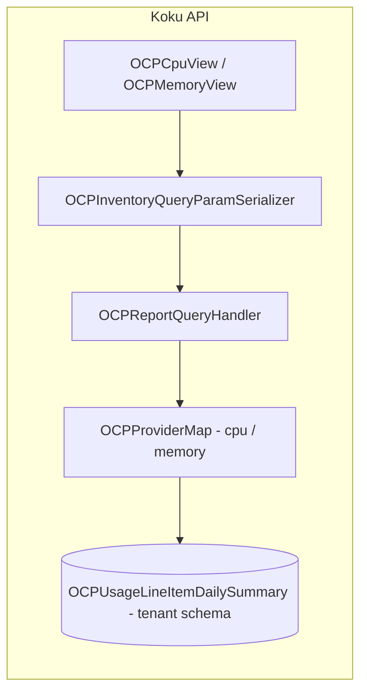

# Efficiency scores (Optimizations Summary)

Help FinOps and Dev/Ops reason about CPU and memory utilization using **usage efficiency** and **wasted cost** on OpenShift workload reports. The UI (koku-ui) consumes the same **`/reports/openshift/compute/`** and **`/reports/openshift/memory/`** endpoints as existing inventory reports; this hub describes what the Koku backend **implements today** and what remains product backlog.

---

## One-paragraph scope

**Implemented:** For `cpu` and `memory` report types, the API adds **`total_score`** on the **`total`** object and **`score`** on each **data** row (when scores are computed), exposing **`usage_efficiency_percent`** and **`wasted_cost`** derived from aggregated usage/request hours and CPU- or memory-scoped **`cost_total`** on [`OCPUsageLineItemDailySummary`](../../../koku/reporting/models.py). **Not implemented:** a separate `efficiency`-only route; cost/volume reports do not expose these fields. **Backlog** (out of code): idle/cost-efficiency/overhead scores and dedicated Optimizations Summary routing in the UI.

---

## Prerequisites (read before coding)

| Topic | Where |
|-------|--------|
| Multi-tenancy (tenant vs public, `tenant_context` / `schema_context`) | [`.cursor/rules/multi-tenancy.mdc`](../../../.cursor/rules/multi-tenancy.mdc), [`AGENTS.md`](../../../AGENTS.md) |
| Report API pattern (serializer → query handler → provider map → ORM) | [`api-serializers-provider-maps.md`](../api-serializers-provider-maps.md) |
| OCP daily line item columns (usage vs request hours) | [`csv-processing-ocp.md`](../csv-processing-ocp.md) |
| Formulas, edge cases, response shape | [formulas-and-data-contract.md](./formulas-and-data-contract.md) |

---

## Document catalog and reading order

| Order | Document | Role |
|-------|----------|------|
| 1 | This README | As-built behavior, code map, builder handoff |
| 2 | [formulas-and-data-contract.md](./formulas-and-data-contract.md) | Exact math, cost basis, rounding, when scores are empty |
| 3 | [cost-basis-and-additivity.md](./cost-basis-and-additivity.md) | **Shared** `cloud_infrastructure` + `markup` in both `cpu` / `memory` `cost_total`; do **not** add cross-report `wasted_cost` without a defined allocation (IQ-7) |
| 4 (IQ-7) | [iq-7-solution-options.md](./iq-7-solution-options.md) | Options A–F (disclosure, allocation, combined metric, upstream split, etc.) until product resolves additivity |

---

## As-built behavior (summary)

| Area | Behavior |
|------|-----------|
| **Endpoints** | [`OCPCpuView`](../../../koku/api/report/ocp/view.py) → `GET /api/cost-management/v1/reports/openshift/compute/`; [`OCPMemoryView`](../../../koku/api/report/ocp/view.py) → `…/memory/`. Router: [`koku/api/urls.py`](../../../koku/api/urls.py). |
| **Serializer** | [`OCPInventoryQueryParamSerializer`](../../../koku/api/report/ocp/serializers.py) — [`InventoryOrderBySerializer`](../../../koku/api/report/ocp/serializers.py) adds `order_by[usage_efficiency]` and `order_by[wasted_cost]`. |
| **Scores in response** | [`OCPReportQueryHandler._pack_score`](../../../koku/api/report/ocp/query_handler.py) builds `usage_efficiency_percent` (int) and `wasted_cost` `{ value, units }`. The **`total`** block exposes this as **`total_score`** (rename from internal `score` after packing). **Data rows** keep the key **`score`** (same inner shape). |
| **When scores are omitted** | For `cpu` / `memory` only: if **more than one** `group_by` dimension is present **or** there is **tag** `group_by` **or** tag keys under **`filter`**, `should_compute` is false → `total_score` and per-row `score` are **empty objects** `{}`. **Tag `exclude` is not part of this check** ([`execute_query`](../../../koku/api/report/ocp/query_handler.py) uses `get_tag_filter_keys()` with the default **`filter`** parameter in [`ReportQueryHandler.get_tag_filter_keys`](../../../koku/api/report/queries.py)). Multi `group_by` is covered by [`test_efficiency_score_multi_group_by_returns_empty`](../../../koku/api/report/test/ocp/test_ocp_query_handler.py). |
| **Reports without scores** | `costs`, `costs_by_project`, `volume`, and other non-inventory types do not add `total_score`. Tests: [`test_efficiency_score_cost_report_excluded`](../../../koku/api/report/test/ocp/test_ocp_query_handler.py), [`test_efficiency_score_volume_report_excluded`](../../../koku/api/report/test/ocp/test_ocp_query_handler.py). |
| **Aggregations** | [`OCPProviderMap._efficiency_annotations`](../../../koku/api/report/ocp/provider_map.py) defines ORM expressions for `usage_efficiency` and `wasted_cost` on `cpu` and `memory` **aggregates** and **report_annotations**. The **`wasted_cost`** cost multiplier is **`cloud_infrastructure_cost + markup_cost + cost_model_cpu_cost` or `+ cost_model_memory_cost`**, so **infrastructure and markup** are in **both** dimensions’ bases—[cost-basis-and-additivity.md](./cost-basis-and-additivity.md). |
| **Ordering** | In-memory sort includes `usage_efficiency` and `wasted_cost` in [`ReportQueryHandler._order_by`](../../../koku/api/report/queries.py). |
| **Tenant boundary** | All queries run under **`tenant_context(self.tenant)`** in [`OCPReportQueryHandler.execute_query`](../../../koku/api/report/ocp/query_handler.py). |
| **Pipeline / SQL** | No Celery tasks and no new SQL templates — scores are ORM aggregates on existing tenant line items. **Dual-path** (`trino_sql` / `self_hosted_sql`) is unchanged for this feature. |

---

## Architecture (implemented)

---

## Resolved decisions (formerly IQ)

| ID | Resolution | Evidence |
|----|------------|----------|
| IQ-5 (endpoint shape) | **Extend** existing compute/memory inventory endpoints; **no** separate `efficiency` route. | Views unchanged path; handler gates on `report_type in ("cpu", "memory")`. |
| IQ-1 (fleet / total row) | **Single ratio over the filtered row set** — totals use the same aggregate expressions as grouped rows (ratio-of-sums style at the SQL aggregate level). | `query.aggregate(**aggregates)` in [`execute_query`](../../../koku/api/report/ocp/query_handler.py) includes `usage_efficiency` / `wasted_cost` from [`OCPProviderMap`](../../../koku/api/report/ocp/provider_map.py). |
| IQ-2 (wasted cost basis) | **`wasted_cost = max(cost_total * (1 - usage/request), 0)`** with CPU- or memory-specific **`cost_total`** and matching usage/request **sums**. | [`_efficiency_annotations`](../../../koku/api/report/ocp/provider_map.py). Details in [formulas-and-data-contract.md](./formulas-and-data-contract.md). |
| IQ-6 (RBAC) | Same access pattern as other OCP report views (no separate optimizations-only permission in backend). | Reuses existing views. |

---

## Open questions / backlog (product or future engineering)

| ID | Topic | Notes |
|----|--------|------|
| IQ-3 | Idle / signed request−usage vs clamped unused | [`calculate_unused`](../../../koku/api/report/ocp/capacity/cluster_capacity.py) still clamps; not used for efficiency scores. |
| IQ-4 | Cost efficiency / overhead scores | Not in API. |
| — | **`request_sum == 0`** semantics | Implementation coalesces **`usage_efficiency_percent`** to **0** and **`wasted_cost`** to **0** (not `null`). Confirm UX/OpenAPI wording. |
| — | Tag / multi-dimension `group_by` | Scores intentionally empty; document for UI. |
| — | Tag **`exclude`** vs `should_compute` | Code does not pass `"exclude"` into [`get_tag_filter_keys`](../../../koku/api/report/queries.py); align product/UI expectations or extend `has_tag_interaction` if excludes should suppress scores. |
| IQ-7 (open) | **Cross-dimension additivity of `wasted_cost`** | CPU and memory each multiply waste by a **per-report** `cost_total` that **includes the full** `cloud_infrastructure_cost + markup_cost` (plus a dimension-specific `cost_model_*_cost`). Summing **`wasted_cost` from `…/compute/` + `…/memory/`** can **double-count** the shared cost base. Product/engineering: allocation rules, a combined metric, or “do not add” in UI copy. [cost-basis-and-additivity.md](./cost-basis-and-additivity.md) · [iq-7-solution-options.md](./iq-7-solution-options.md) |

---

## Changelog

| Date | Summary |
|------|---------|
| 2026-04-16 | Initial agent-focused hub and formulas doc from product brief. |
| 2026-04-17 | Rewrote hub for **as-built** implementation (compute/memory, `total_score` / `score`, formulas, no new pipeline). |
| 2026-04-21 | Corrected **when scores are omitted**: tag **`exclude`** does not affect `should_compute` today (only tag `group_by` and tag **`filter`** keys). |
| 2026-04-23 | [cost-basis-and-additivity.md](./cost-basis-and-additivity.md) + **IQ-7** — `wasted_cost` basis overlaps across CPU and memory; sum-of-endpoints is not a defined total waste. |
| 2026-04-23 | [iq-7-solution-options.md](./iq-7-solution-options.md) — documented options A–F for resolving cross-report additivity. |

---

## Builder handoff

| Block | Content |
|-------|---------|
| **Doc map** | This README (overview + links) → [formulas-and-data-contract.md](./formulas-and-data-contract.md) (math + JSON) → [cost-basis-and-additivity.md](./cost-basis-and-additivity.md) → [iq-7-solution-options.md](./iq-7-solution-options.md) (IQ-7). |
| **Assumptions** | None beyond what is cited from code; UI “Optimizations Summary” tab wiring lives in koku-ui. |
| **IQ / decisions** | Resolved items in **Resolved decisions** table; backlog in **Open questions**. |
| **API contract summary** | `GET …/reports/openshift/compute/` and `GET …/reports/openshift/memory/` with `filter` / `group_by` / `order_by` as other OCP inventory reports. Response: **`total.total_score`**: `{ usage_efficiency_percent: int, wasted_cost: { value, units } }` or `{}`. Data leaves: **`score`** same shape or `{}`. **`order_by[usage_efficiency]`**, **`order_by[wasted_cost]`** supported (with valid `group_by` per existing serializer rules). **Do not** present **`wasted_cost(cpu) + wasted_cost(memory)`** as an authoritative total without **IQ-7** resolution. |
| **Data & tenancy** | Tenant model [`OCPUsageLineItemDailySummary`](../../../koku/reporting/models.py); queries via **`tenant_context`**. No new columns. |
| **Pipeline / tasks** | None; **do not** add entries to [`celery-tasks.md`](../celery-tasks.md) for this feature unless future work adds async precomputation. |
| **SQL / dual-path** | No `masu/database/*` changes for current implementation. |
| **Phased delivery** | **Shipped:** ORM efficiency on cpu/memory. **Future:** optional dedicated endpoint, tag-aware scores, extra metrics — each needs its own design. |
| **Out of scope for this doc** | Frontend layout, OpenAPI regeneration policy, PM validation of `request=0` UX. |
