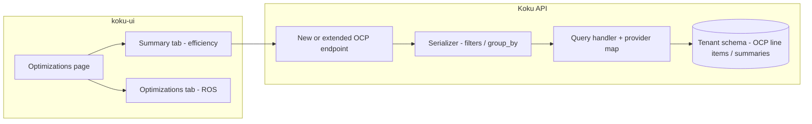

# Efficiency scores (Optimizations Summary)

Help FinOps and Dev/Ops improve CPU and memory utilization without pushing workloads into saturation; surface metrics on a new **Summary** tab next to **Optimizations** (ROS) in the Optimizations area of Cost Management.

---

## One-paragraph scope

Deliver **usage-based efficiency** (and later **cost-based** and **overhead** scores) for OpenShift workloads at **namespace (project), node, cluster, and fleet** scope. The backend must expose stable **CPU** and **memory** metrics with agreed **group_by** and **filter** parity (cluster, node, project). UI is primarily **koku-ui** (not in this repo); this hub focuses on **Koku API**, **tenant data**, and how scores relate to existing **usage / request** reporting.

---

## Prerequisites (read before coding)

| Topic | Where |
|-------|--------|
| Multi-tenancy (tenant vs public, `tenant_context` / `schema_context`) | [`.cursor/rules/multi-tenancy.mdc`](../../../.cursor/rules/multi-tenancy.mdc), [`AGENTS.md`](../../../AGENTS.md) |
| Report API pattern (serializer → query handler → provider map → ORM) | [`api-serializers-provider-maps.md`](../api-serializers-provider-maps.md) |
| OCP daily line item columns (usage vs request hours) | [`csv-processing-ocp.md`](../csv-processing-ocp.md) (context on requests vs usage) |
| Formulas, API shape, edge cases | [formulas-and-data-contract.md](./formulas-and-data-contract.md) (this feature) |

---

## Document catalog and reading order

| Order | Document | Role |
|-------|----------|------|
| 1 | This README | Scope, code map, agent workflow, open questions |
| 2 | [formulas-and-data-contract.md](./formulas-and-data-contract.md) | Exact math, rounding, `request=0`, fleet aggregation, example JSON |

---

## Current implementation map (ground truth for agents)

These are the **canonical places** to reuse or mirror when adding efficiency data. Do not invent paths; extend the same patterns.

### HTTP surface (OCP today)

| User-facing path | View | `report` key | Serializer (params) |
|------------------|------|--------------|----------------------|
| `GET …/reports/openshift/compute/` | [`OCPCpuView`](../../../koku/api/report/ocp/view.py) | `"cpu"` | [`OCPInventoryQueryParamSerializer`](../../../koku/api/report/ocp/serializers.py) |
| `GET …/reports/openshift/memory/` | [`OCPMemoryView`](../../../koku/api/report/ocp/view.py) | `"memory"` | same |

Router: [`koku/api/urls.py`](../../../koku/api/urls.py) (`reports/openshift/compute/`, `reports/openshift/memory/`).

### Query execution

- **Handler:** [`OCPReportQueryHandler`](../../../koku/api/report/ocp/query_handler.py) — sets `OCPProviderMap`, adjusts `report_type` for grouped cost views, merges OCP-specific **pack** definitions (`PACK_DEFINITIONS`), runs `execute_query()` from [`ReportQueryHandler`](../../../koku/api/report/queries.py).
- **Aggregations and filters:** [`OCPProviderMap`](../../../koku/api/report/ocp/provider_map.py) — for `cpu` / `memory` report types, `report_annotations` already define **`usage`**, **`request`**, **`limit`**, and cost breakdowns against [`OCPUsageLineItemDailySummary`](../../../koku/reporting/models.py) (imported in provider map from `reporting.models`).
- **Unused / capacity helpers:** [`calculate_unused`](../../../koku/api/report/ocp/capacity/cluster_capacity.py) in `cluster_capacity.py` — today **`request_unused = max(request - usage, 0)`** (clamped). Product copy speaks of **idle = request − usage** possibly **negative**; that is a **behavior change** if reused for the new scores (see IQ table).

### Tenant boundary

All queries against `OCPUsageLineItemDailySummary` and related reporting models run inside **`tenant_context(self.tenant)`** in the query handler — see [`OCPReportQueryHandler.execute_query`](../../../koku/api/report/ocp/query_handler.py). Agents must preserve this for any new endpoint or annotation.

### Dual-path note

Efficiency scores for OCP in this design are expected to be **PostgreSQL ORM** aggregates on tenant summary/line tables (same path as current OCP reports). If a future design pre-aggregates in **Trino** / **self_hosted_sql**, mirror per [`AGENTS.md`](../../../AGENTS.md) dual-path rules; the **first** iteration should stay aligned with existing OCP report query patterns unless performance requires otherwise.

---

## Target architecture (proposed)

**Default implementation hypothesis:** add a **dedicated** report route (e.g. `reports/openshift/efficiency/` or `…/optimizations/summary/`) with its own `report_type` key in `OCPProviderMap` so serializers stay small and the contract is explicit for the UI. **Alternative:** extend `cpu` / `memory` responses with optional `score` objects — higher risk of breaking existing consumers and cache keys; document in IQ.

---

## Open questions / decisions (IQ)

| ID | Question | Blocking | Notes / default for agents |
|----|----------|----------|----------------------------|
| IQ-1 | **Fleet efficiency:** sum of per-cluster percentages vs **single ratio** `(Σ usage) / (Σ request)`? | Yes | FinOps math usually prefers **ratio of sums** for fleet; product text says “sum of all cluster efficiencies” — **confirm with PM** before implementing fleet rows. |
| IQ-2 | **Wasted cost** exact formula and cost basis (raw vs cost model total vs CPU-only cost)? | Yes | PRD snippet shows `wasted_cost` currency; link to cost column(s) in [`OCPProviderMap`](../../../koku/api/report/ocp/provider_map.py) `cpu`/`memory` `cost_total` / `cost_usage` etc. Document options in [formulas-and-data-contract.md](./formulas-and-data-contract.md). |
| IQ-3 | **Idle score** (request − usage, “lower is better”, may be negative): expose raw signed idle or clamp like today’s `request_unused`? | Medium | Code today clamps unused request at 0 in `calculate_unused`. |
| IQ-4 | **Cost efficiency** and **overhead** scores: “TBD” / UX direction (higher vs lower is better for overhead)? | No (phase 2) | Stub API fields or omit until decided. |
| IQ-5 | New **endpoint** vs extend **`/compute/`** and **`/memory/`**? | Medium | Dedicated endpoint recommended for agent clarity and OpenAPI. |
| IQ-6 | **RBAC:** reuse [`OpenShiftAccessPermission`](../../../koku/api/common/permissions/openshift_access.py) only, or tighter scope for optimizations? | Medium | Default: same as other OCP reports unless IAM specifies otherwise. |

---

## Agent workflow (implementing from this doc)

1. **Re-read** IQ table; if IQ-1 or IQ-2 unresolved, implement only **non-fleet** or **percentage-only** slices behind a flag or leave `wasted_cost` unset with explicit TODO — do not guess currency rules.
2. **Trace** `OCPProviderMap` for `cpu` and `memory` → copy `report_annotations` pattern for a new `report_type` (or extension) with **separate CPU and memory** score blocks in the response contract.
3. **Add** URL + view + serializer validations for `group_by` / `filter` (**cluster**, **node**, **project** / namespace) matching product notes; align naming with existing OCP keys (`project` maps to `namespace` in DB — see provider map `filters`).
4. **Compute** usage efficiency in the handler or via ORM `ExpressionWrapper` / `Case(When(request=0), …)` — see [formulas-and-data-contract.md](./formulas-and-data-contract.md) for division-by-zero.
5. **Round** usage efficiency to **nearest integer** (product: “closest whole number”) for API output; keep higher precision internally if needed for wasted cost.
6. **Tests:** follow [`IamTestCase`](../../../koku/api/iam/test/iam_test_case.py) / [`MasuTestCase`](../../../koku/masu/test/__init__.py) patterns; mock `get_currency` where serializers touch currency; use `schema_context` for tenant fixtures per rules.
7. **Docs:** after merge, add a one-line entry to [`celery-tasks.md`](../celery-tasks.md) **only** if new Celery work is introduced (not expected for read-only aggregates).

---

## Implementation checklist (mechanical)

- [ ] `OCPProviderMap`: new `report_type` (or agreed extension) with aggregates over `pod_usage_*` / `pod_request_*` fields (see existing `cpu` / `memory` entries).
- [ ] Serializer: `group_by` + `filter` for cluster, node, project; time filters consistent with other OCP reports.
- [ ] `urls.py` + `view.py`: register GET route; `permission_classes` and throttling consistent with [`OCPView`](../../../koku/api/report/ocp/view.py).
- [ ] Response builder: either extend `_format_query_response` / packing in [`OCPReportQueryHandler`](../../../koku/api/report/ocp/query_handler.py) or a small dedicated formatter to avoid breaking `PACK_DEFINITIONS` consumers.
- [ ] OpenAPI: regenerate if this repo ships OpenAPI from code.
- [ ] Unit tests: division by zero, usage > request, rounding boundary (e.g. 59.5 → 60), multi-cluster group_by.

---

## Changelog

| Date | Summary |
|------|---------|
| 2026-04-16 | Initial agent-focused hub and formulas doc from product brief. |
