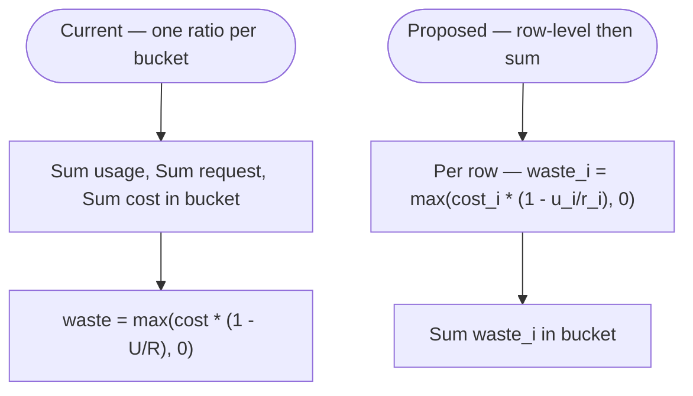

# Efficiency scores — solution options and known limitations

Companion to [README.md](./README.md) and [formulas-and-data-contract.md](./formulas-and-data-contract.md). This document **analyzes** the three cost-efficiency issues. It does **not** change implementation; it maps problems to **verified backend behavior** and lists **solution axes** for future work.

---

## Scope restatement

| Aspect | Detail |
| --- | --- |
| Goal | Produce engineering-ready options so builders and PM can choose semantics without rediscovering math or data grain. |
| In scope | Problem ↔ code mapping; solution families; tradeoffs; tenancy and query-performance notes; IQ/decisions. |
| Out of scope | Serializer code, migrations, SQL templates, UI copy, OpenAPI regeneration. |

**Success criteria:** A reader can explain why fleet `wasted_cost` can differ from a sum of “intuitive” per-workload waste, what would change under each fix, and what remains a **product definition** choice (e.g. naming two different metrics).

---

## Verified: how the backend computes waste today

The ORM builds **`usage_efficiency`** and **`wasted_cost`** from **aggregated** `usage_sum` and `request_sum` expressions at the **same grain as the report query** (fleet `aggregate()`, or `values(...).annotate(...)` for each group). The waste term is:

`Greatest(cost_total * (1 - usage_sum / NullIf(request_sum, 0)), 0)` — see [`_efficiency_annotations`](../../../koku/api/report/ocp/provider_map.py) and [formulas-and-data-contract.md](./formulas-and-data-contract.md).

**Consequences (mathematical, not bugs):**

1. **Fleet / group `wasted_cost` is not** \(\sum_i \max(c_i \cdot (1 - u_i/r_i), 0)\) **unless** each line item is computed separately and then summed. The shipped formula is **one** ratio applied to **one** pooled `cost_total` for the grouped rows.
2. **`Greatest(..., 0)` applies once** to that pooled expression. If the pooled ratio exceeds 1 (usage > request in aggregate), the whole waste term is **0** for that bucket—even when some underlying rows would have positive waste under a per-row formula.

These match **Problem 1 (aggregation bias)** and **Problem 2 (negative waste offset)** in the brief. IQE reproducers linked from that brief (`test_api_ocp_ingest_efficiency_calc_logic`, `test_api_ocp_ingest_efficiency_overutilization`) are the regression anchor if behavior changes.

### Flow contrast (conceptual)

---

## Problem 1 — Aggregation bias in efficiency / wasted cost

### Detailed description

Many FinOps users think of **wasted cost** as an **additive** quantity: for each workload (pod, service, line item), estimate how much of *that* workload’s spend is “unused” relative to requests, then **add** those amounts to get a cluster, project, or fleet total. That is a **bottom-up** definition.

The backend today uses a **top-down** definition at each API bucket (fleet `total`, or each `group_by` row such as cluster or project). It first **adds** usage hours, request hours, and cost across every line item in the bucket, then applies **one** utilization ratio \(U/R\) to **one** pooled `cost_total` for that bucket (see [formulas-and-data-contract.md](./formulas-and-data-contract.md) and [`_efficiency_annotations`](../../../koku/api/report/ocp/provider_map.py)).

Those two definitions are **different functions** of the underlying data. They coincide in special cases (e.g. a single homogeneous workload, or proportional cost and identical ratios) but **diverge** when:

- **Costs are uneven** across rows with different usage/request ratios (cheap rows vs expensive rows pull the pooled ratio and pooled cost differently than a sum of per-row waste).
- **`group_by` changes the bucket** (e.g. project view vs cluster view): the same underlying pods appear in different groupings, so top-down waste **per row** is not a simple roll-up of a single canonical “pod list” unless the math matches bottom-up.

So the “problem” is not random API error; it is a **semantic mismatch** between **pooled structural waste** (what ships) and **sum of per-workload opportunity** (what many dashboards assume). The gap can appear as “**incorrect** total wasted cost” in **group_by project** and wrong **totals and per-row cluster** behavior in **group_by cluster**.

### Worked example (two pods, one cluster bucket)

Assume a single cluster bucket contains **two** workloads. Costs and hours are chosen so bottom-up and top-down disagree (same numbers as in the cost-efficiency brief).

| Workload | Cost \(c_i\) | Usage \(u_i\) | Request \(r_i\) | Utilization \(u_i/r_i\) | Bottom-up waste \(\max(c_i(1-u_i/r_i), 0)\) |
|----------|-------------|----------------|------------------|-------------------------|-----------------------------------------------|
| Pod 1 | $200 | 5 | 10 | 50% | \(200 \times (1 - 0.5) =\) **$100** |
| Pod 2 | $1,050 | 1 | 5 | 20% | \(1050 \times (1 - 0.2) =\) **$840** |
| **Pooled (what the API uses for the bucket)** | **$1,250** | **6** | **15** | \(6/15 = 40\%\) | \(1250 \times (1 - 0.4) =\) **$750** |

- **Bottom-up (sum of opportunities):** \(100 + 840 =\) **$940**.
- **Top-down (current backend):** one ratio on pooled sums: \((1 - 6/15) \times 1250 = 0.6 \times 1250 =\) **$750**.

**Discrepancy:** **$190** (~20% in this toy scenario) between the two definitions. The backend matches **top-down**; users who sum or mentally aggregate **per-pod** waste will expect **bottom-up**.

### How this ties to `wasted_cost` in code

For each response bucket, `usage_sum` and `request_sum` are **aggregates over all rows** in that bucket, and `wasted_cost` applies `Greatest(cost_total × (1 - usage_sum/request_sum), 0)` once. There is **no** intermediate per-row waste term in the shipped path.

### Solution families

| ID | Approach | Idea | Pros | Cons / risks |
|----|-----------|------|------|----------------|
| **S1-a** | **Per–line-item waste, then `Sum`** in SQL/ORM | Annotate each `OCPUsageLineItemDailySummary` row with row-level waste (same `cost_total` basis as today, but using **row** usage/request fields), aggregate with `Sum` for fleet and for each `group_by`. | Aligns with FinOps “sum of opportunities”; stable under splitting/merging pods in examples. | Heavier queries; must define **row grain** (see IQ-7); `cost_total` at row level must remain defined and consistent with CPU vs memory split (ties to Problem 3). |
| **S1-b** | **Keep formula; rename / document** | Treat current `wasted_cost` as **“pooled structural waste”** (or similar); add separate optional field for bottom-up sum if product wants both. | No query rewrite; clears customer confusion. | Two metrics to explain; UI and API surface decisions. |
| **S1-c** | **Weighted / Shapley-style allocation** | Allocate pooled waste to dimensions by a principled rule. | Single headline number with axioms. | Hard to explain; implementation complexity; may still disagree with pod-sum intuition. |

**Recommendation for design discussion:** Default engineering path for “fix the number” is **S1-a** at the **finest grain stored in** [`OCPUsageLineItemDailySummary`](../../../koku/reporting/provider/ocp/models.py) **that still carries the same cost and usage fields** as the report—**after** product confirms that grain matches “workload” in their examples (IQ-7).

---

## Problem 2 — Over-utilization masking under-utilization waste

### Detailed description

When **some** workloads in a bucket are **under-provisioned** (usage below request, so there is “headline” waste) and **others** are **over-provisioned** (usage above request, sometimes called burst or pressure risk), a reasonable product question is: **should over-utilization reduce reported waste for the whole bucket?**

Under the **current** formula, **aggregation happens first**: the bucket’s total usage \(U\) and total request \(R\) are summed, then \(1 - U/R\) is computed **once**. If \(U > R\) for the bucket as a whole, then \((1 - U/R) < 0\), and **`Greatest(..., 0)`** forces **`wasted_cost` to $0** for that entire bucket—even if **individual** rows would still show positive waste if waste were computed **per row** and then summed (each over-provisioned row would contribute **$0** after its own clamp, but under-provisioned rows would still contribute positive amounts).

So **over-utilized** lines do not “subtract” dollar waste in a ledger sense; they **inflate the pooled utilization ratio** so much that the **single** pooled \((1-U/R)\) term goes non-positive, and the **one** `Greatest` at bucket level **zeros out** the whole bucket. That **masks** under-provisioned waste in reporting—a **cluster** or **project** total can read **$0** while **actionable** right-sizing opportunity still exists on a subset of pods.

This is the same **order-of-operations** issue as Problem 1, but the user-visible symptom is often described as **“negative waste offset”** or **subsidy**: burst usage on one cohort **hides** savings opportunity on another.

### Worked example (one under-provisioned pod, one over-provisioned pod)

| Workload | Cost \(c_i\) | Usage \(u_i\) | Request \(r_i\) | \(u_i/r_i\) | Per-row waste \(\max(c_i(1-u_i/r_i),0)\) |
|----------|-------------|----------------|------------------|-------------|-------------------------------------------|
| Pod 1 (under) | $200 | 5 | 10 | 50% | **$100** |
| Pod 2 (over) | $1,150 | 15 | 5 | 300% | \(\max(1150 \times (1 - 3), 0) =\) **$0** |
| **Pooled bucket** | **$1,350** | **20** | **15** | \(20/15 \approx 133\%\) | **Current:** \(\max(1350 \times (1 - 20/15), 0) = \max(\text{negative}, 0) =\) **$0** |

- **Bottom-up sum of clamped row waste:** \(100 + 0 =\) **$100** (still **$100** of opportunity on Pod 1 if you resize requests).
- **Current backend (pooled):** **$0** for the cluster bucket.

So the dashboard can show **no** wasted cost at **cluster** (and similar masking can appear at **project** level in the brief’s screenshots), while the **actual** opportunity narrative remains **$100**. IQE coverage: `test_api_ocp_ingest_efficiency_overutilization` (see external brief / plugin MR).

### How this ties to `wasted_cost` in code

[`_efficiency_annotations`](../../../koku/api/report/ocp/provider_map.py) applies **`Greatest`** to the expression built from **already-aggregated** `usage_sum_prop` and `request_sum_prop`. There is **no** per-row `Greatest` before the `Sum` in the shipped implementation.

### Solution families

| ID | Approach | Relationship to Problem 1 |
|----|-----------|---------------------------|
| **S2-a** | **Row-level clamp, then sum** (`Sum(Greatest(row_expr, 0))`) | Same implementation core as **S1-a**; fixes both bias and masking in typical examples. |
| **S2-b** | **Cap efficiency at 100% for waste only** | `waste ∝ max(0, 1 - min(U/R, 1))` at aggregated or row level; **does not** by itself restore sum-of-pod waste if cost is still pooled in one ratio—usually combined with S1-a or careful definition. |
| **S2-c** | **Document only** | State that fleet waste is **zero whenever aggregate efficiency ≥ 100%** regardless of per-pod mix. | Lowest cost; leaves PM/CS explaining edge cases. |

**Recommendation:** **S2-a** is the same lever as **S1-a**; separating them in the brief is useful for **QA and messaging**, not for two different code paths unless product wants **both** “pooled” and “opportunity” metrics.

---

## Problem 3 — Infrastructure (and full) cost in both CPU and memory dimensions

### Detailed description

OpenShift **compute** (`…/reports/openshift/compute/`) and **memory** (`…/reports/openshift/memory/`) reports are **separate** report types. Each builds **`wasted_cost`** from a **dimension-specific** `cost_total`: CPU uses CPU-related cost model components; memory uses memory-related ones ([formulas-and-data-contract.md](./formulas-and-data-contract.md)).

However, **both** dimensions’ `cost_total` expressions include the **same** classes of charges that are **not** split by dimension—specifically **`cloud_infrastructure_cost + markup_cost`** in each case, plus the respective **`cost_model_cpu_cost`** or **`cost_model_memory_cost`**. Intuitively, much of **raw infrastructure** spend is **shared** by a running pod (you pay for the node/cluster once, not “once per dimension” in the customer’s mental model).

If a consumer **adds** `wasted_cost` from the **CPU** response to `wasted_cost` from the **memory** response (or the UI shows two large “waste” numbers that users mentally combine), **shared** infrastructure and markup can be **counted twice** in that **sum**. Finance teams then cannot reconcile “total wasted” from the UI to a **single** bill line or to **actual maximum** waste for one pod (which cannot exceed **100%** of that pod’s true economic cost once).

### Worked example (one pod, idle on both dimensions)

Suppose a workload’s **true** attributable spend for the period is **$100** (one economic unit). On **both** CPU and memory reports, usage vs request implies **0%** utilization (idle relative to request) for that dimension.

| Dimension | Attributed `cost_total` (simplified) | Waste % (from ratio) | `wasted_cost` (illustrative) |
|-----------|--------------------------------------|----------------------|-------------------------------|
| **CPU** | $100 (includes full infra + markup slice used by CPU report) | 100% | **$100** |
| **Memory** | $100 (same infra + markup pattern for memory report) | 100% | **$100** |
| **User mental “total”** | — | — | **$200** if summed |

- **Maximum plausible waste** for one **$100** asset: **$100** (you cannot waste more than the resource cost in this mental model).
- **Summed API-style interpretation:** **$200** → **100% inflation** vs bill reconciliation.

The implementation is **consistent** with the chosen **per-dimension cost basis**; the tension is **cross-endpoint aggregation** and **UI/FinOps semantics**, not an accidental double insert in one SQL row.

### Product / team disposition (from brief)

The brief records **team agreement** to **ship as-is** for now and revisit if customers object, because **splitting infrastructure cleanly** between CPU and memory is a **data model / cost allocation** problem, not a one-line ORM tweak.

### Solution families (future)

| ID | Approach | Notes |
|----|-----------|------|
| **S3-a** | **Allocate `cloud_infrastructure_cost` by driver** (e.g. request-hours shares, or cost model weights) into `cpu_infra` / `memory_infra` in pipeline or reporting | Touches summarization and possibly Trino/self-hosted SQL paths per [`.cursor/rules/onprem-vs-saas.mdc`](../../../.cursor/rules/onprem-vs-saas.mdc); **tenant** tables only under `tenant_context`. |
| **S3-b** | **New combined “workload” endpoint or metric** that computes waste once on a unified cost | API/product change; avoids double-count in **one** contract if UI sums dimensions today. |
| **S3-c** | **UI / docs: never sum CPU + memory wasted** | Operational mitigation; backend unchanged. |

---

## Cross-cutting concerns

### Tenancy

Any change continues to run under **`tenant_context`** in [`OCPReportQueryHandler.execute_query`](../../../koku/api/report/ocp/query_handler.py); no public-schema reads for this report path.

### Performance

Row-level annotation + `Sum` over the full filtered line set can increase **DB work** versus a single `aggregate()` over pre-joined sums. Needs **budget**: tenant size, date range, indexes on filter columns, and EXPLAIN on representative tenants.

### Ordering and `group_by`

Today **`order_by[wasted_cost]`** and **`order_by[usage_efficiency]`** sort on the **same** annotations as the response. If `wasted_cost` becomes **sum-of-row-waste** but `usage_efficiency` stays **ratio-of-sums** (or vice versa), product must decide whether **ordering tracks** the displayed waste definition (IQ-8).

### `should_compute` / tags

Tag and multi-`group_by` gates in [`execute_query`](../../../koku/api/report/ocp/query_handler.py) unchanged unless product extends when scores appear; any new metric should reuse the same gate for consistency.

### Dual-path SQL

Current scores are **ORM-only** on tenant summaries ([README](./README.md)). **S3-a** or precomputed row facts may touch **`masu/database/sql/`**, **`trino_sql/`**, **`self_hosted_sql/`**; parity is required for on-prem if pipeline changes.

---

## IQ / decisions (solution pass)

| ID | Question | Owner hint |
|----|----------|------------|
| **IQ-7** | What is the **canonical “row”** for bottom-up waste: one `OCPUsageLineItemDailySummary` row (PK `uuid`), pod-level upstream, or something else? The model has **no `pod` name column**; docstring says *“daily aggregation … aggregated by OCP resource”* — confirm whether one row ≡ one pod for CPU/memory pod reports or a coarser roll-up. | Product + pipeline |
| **IQ-8** | Should **`usage_efficiency_percent`** and **`wasted_cost`** always reflect the **same** aggregation story, or can they diverge (e.g. ratio-of-sums efficiency + sum-of-row waste)? | Product |
| **IQ-9** | If both **pooled** and **opportunity** waste are exposed, **names**, **defaults**, and **deprecation** of the current field? | Product + API review |
| **IQ-10** | For **S3-a**, acceptable **allocation** method for infra (and markup) between CPU and memory for **finance reconciliation**? | Cost model + Finance |

---

## Phased delivery (suggested)

| Phase | Content | Validation |
|-------|---------|------------|
| **P0** | Docs only (this file + hub links); optional customer-facing “do not sum CPU + memory waste” note via PM/CS. | No code change. |
| **P1** | Spike: ORM or SQL prototype of **S1-a/S2-a** on one tenant; compare fleet vs sum-of-rows for IQE scenarios; EXPLAIN. | Numeric match to reproducers; perf budget. |
| **P2** | Implement chosen semantics; align `order_by`; extend tests in [`test_ocp_query_handler`](../../../koku/api/report/test/ocp/test_ocp_query_handler.py) and related. | Regression + OpenAPI if fields added/renamed. |
| **P3** | **S3-*** cost split or combined endpoint if IQ-10 resolved. | Pipeline + dual-path parity; reconciliation sign-off. |

---

## Builder handoff

| Block | Content |
|-------|---------|
| **Doc map** | [README.md](./README.md) (as-built) → [formulas-and-data-contract.md](./formulas-and-data-contract.md) (math) → **this file** (limitations + options). |
| **Assumptions** | External brief is accurate; team disposition on Problem 3 as stated there is still current. |
| **IQ / decisions** | **IQ-7–IQ-10** above. |
| **API contract summary** | **No change** in this doc. Future: possible new fields or redefinition of `wasted_cost` / `usage_efficiency_percent` per IQ-8/IQ-9—requires OpenAPI and UI coordination. |
| **Data & tenancy** | Reads/writes (if pipeline) on **tenant** [`OCPUsageLineItemDailySummary`](../../../koku/reporting/provider/ocp/models.py); `tenant_context` preserved. |
| **Pipeline / tasks** | **None** for S1-a/S2-a if done purely in report ORM; **possible** summarization tasks/SQL for S3-a—**propose** only after spike; update [`celery-tasks.md`](../celery-tasks.md) when tasks are added. |
| **SQL / dual-path** | ORM-only path unchanged today; S3-a likely touches **`masu/database/*`** — flag parity in implementation PR. |
| **Out of scope for builders** | Choosing between pooled vs opportunity headline; finance allocation policy; pasting IQE MR links into this repo (keep in Jira/epic). |

---

## Changelog

| Date | Summary |
|------|---------|
| 2026-04-24 | Initial doc; expanded Problems 1–3 with detailed descriptions, worked examples, and code tie-ins. |
