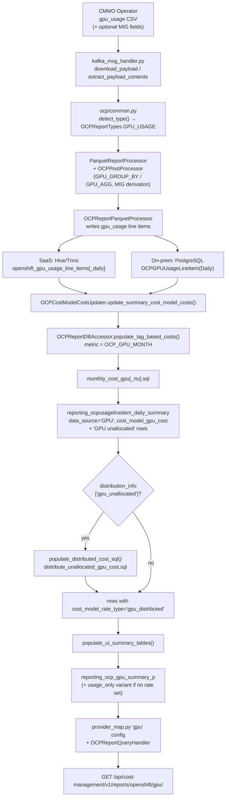

# GPU Metric Integration Architecture

**Purpose:** End-to-end reference for how GPU usage data flows through Koku — from the Cost Management Metrics Operator (CMMO) CSV contract, through Kafka ingestion, Parquet/Trino (or self-hosted PostgreSQL) storage, cost model application and distribution, into UI summary tables and the REST API.

**Scope:** This doc covers the full GPU pipeline (dedicated GPUs and MIG-partitioned GPUs). For the detailed slice-weighting math, MIG-specific data model, and worked examples, see [`mig-gpu-support.md`](mig-gpu-support.md) — that doc is the deep dive on MIG; this doc is the map of the whole subsystem.

**Last Updated:** July 15, 2026

---

## Table of Contents

1. [Overview](#overview)
2. [High-Level Flow](#high-level-flow)
3. [Stage 1 — CMMO Contract and Report Type Detection](#stage-1--cmmo-contract-and-report-type-detection)
4. [Stage 2 — Kafka Ingestion and Parquet Processing](#stage-2--kafka-ingestion-and-parquet-processing)
5. [Stage 3 — Storage (Dual Path)](#stage-3--storage-dual-path)
6. [Stage 4 — Cost Model Application](#stage-4--cost-model-application)
7. [Stage 5 — Unallocated Cost and Distribution](#stage-5--unallocated-cost-and-distribution)
8. [Stage 6 — UI Summary Tables](#stage-6--ui-summary-tables)
9. [Stage 7 — API Layer](#stage-7--api-layer)
10. [Feature Flags and Gating](#feature-flags-and-gating)
11. [Dual-Path SQL Inventory](#dual-path-sql-inventory)
12. [Key Files Reference](#key-files-reference)
13. [Related Docs](#related-docs)
14. [Changelog](#changelog)

---

## Overview

GPU cost tracking is a distinct pipeline layered on top of the standard OCP CSV/Parquet processing described in [`csv-processing-ocp.md`](csv-processing-ocp.md). It differs from CPU/memory/storage usage in two important ways:

- **GPU rows are inserted, not merged.** GPU cost rows are written directly into `reporting_ocpusagelineitem_daily_summary` with `data_source='GPU'` by dedicated cost-model SQL — there is no join into the pod-usage summary path.
- **Rates are tag-based on `gpu_model_name`,** using a single monthly metric (`gpu_cost_per_month`), not a per-hour usage metric like CPU/memory.

The pipeline supports both **dedicated** GPUs (one pod occupies a whole physical GPU) and **MIG-partitioned** GPUs (NVIDIA Multi-Instance GPU, where a physical GPU is split into compute slices shared by multiple pods/namespaces). Both cases flow through the same stages below; MIG only changes the slice-fraction math inside the cost-model SQL (see [`mig-gpu-support.md`](mig-gpu-support.md)).

Like every OCP feature, this pipeline must work in both execution paths — see [`.cursor/rules/onprem-vs-saas.mdc`](../../.cursor/rules/onprem-vs-saas.mdc):

| Mode | Storage | Aggregation |
|------|---------|-------------|
| SaaS | Hive/Trino Parquet tables | `masu/database/trino_sql/` |
| On-prem | PostgreSQL self-hosted models | `masu/database/self_hosted_sql/` |

---

## High-Level Flow



---

## Stage 1 — CMMO Contract and Report Type Detection

GPU usage arrives as a `gpu_usage` CSV inside the standard OCP upload tarball, alongside `pod_usage`, `storage_usage`, `node_labels`, etc. Koku only consumes this CSV contract; the operator is responsible for querying Prometheus/Thanos.

- Report type enum: [`OCPReportTypes.GPU_USAGE`](../../koku/masu/util/ocp/common.py#L87)
- Required columns: [`GPU_USAGE_COLUMNS`](../../koku/masu/util/ocp/common.py#L277-L290) — `gpu_uuid`, `gpu_model_name`, `gpu_vendor_name`, `gpu_memory_capacity_mib`, `gpu_pod_uptime`, plus node/namespace/pod/interval fields.
- Optional MIG columns (older operators may omit them): [`GPU_USAGE_NEWV_COLUMNS_AND_TYPES`](../../koku/masu/util/ocp/common.py#L295-L303) — `mig_instance_id`, `mig_profile`, `mig_strategy` come from the operator; `mig_slice_count`, `mig_memory_capacity_mib`, `gpu_max_slices` are **derived** in the post-processor, not sent by the operator.
- Registry entry tying the above together: [`OCP_REPORT_TYPES["gpu_usage"]`](../../koku/masu/util/ocp/common.py#L377-L383).
- Type detection happens in `detect_type()` in the same module, invoked from the Kafka message handler.

---

## Stage 2 — Kafka Ingestion and Parquet Processing

- Kafka listener downloads and extracts the payload: [`kafka_msg_handler.py`](../../koku/masu/external/kafka_msg_handler.py) — `download_payload()`, `extract_payload_contents()`.
- Conversion to Parquet is orchestrated by [`ParquetReportProcessor`](../../koku/masu/processor/parquet/parquet_report_processor.py).
- Aggregation, MIG-field derivation, and GPU model-name normalization happen in [`OCPPostProcessor`](../../koku/masu/util/ocp/ocp_post_processor.py):
  - `process_dataframe()` (around [line 338](../../koku/masu/util/ocp/ocp_post_processor.py#L338)) normalizes `gpu_model_name` (strips punctuation so cost-model tag values match regardless of formatting).
  - `_generate_daily_data()` aggregates raw interval rows to daily rows using [`GPU_GROUP_BY`](../../koku/masu/util/ocp/common.py#L305) / [`GPU_AGG`](../../koku/masu/util/ocp/common.py#L307-L320).
  - [`get_gpu_max_slices()`](../../koku/masu/util/ocp/ocp_post_processor.py#L68) resolves the physical GPU's max MIG slice count via substring match against [`GPU_MAX_SLICES_BY_MODEL`](../../koku/masu/util/ocp/common.py#L324-L332).
- Writing Parquet rows into the line-item tables is handled by [`OCPReportParquetProcessor`](../../koku/masu/processor/ocp/ocp_report_parquet_processor.py), which declares GPU numeric columns (`gpu_memory_capacity_mib`, `gpu_pod_uptime`, `gpu_max_slices`, ...) around [line 71](../../koku/masu/processor/ocp/ocp_report_parquet_processor.py#L71-L74).
- Field-length validation: [`ocp_data_validator.py`](../../koku/masu/util/ocp/ocp_data_validator.py).

---

## Stage 3 — Storage (Dual Path)

The `gpu_usage` report type maps to the same table names in both modes, but the underlying storage differs:

| Table role | SaaS (Hive/Trino) | On-prem (PostgreSQL) |
|---|---|---|
| Raw line items | `openshift_gpu_usage_line_items` — [`TRINO_LINE_ITEM_TABLE_MAP["gpu_usage"]`](../../koku/reporting/provider/ocp/models.py#L14-L21) | [`OCPGPUUsageLineItem`](../../koku/reporting/provider/ocp/self_hosted_models.py#L329-L333) |
| Daily line items | `openshift_gpu_usage_line_items_daily` — [`TRINO_LINE_ITEM_TABLE_DAILY_MAP["gpu_usage"]`](../../koku/reporting/provider/ocp/models.py#L23-L30) | [`OCPGPUUsageLineItemDaily`](../../koku/reporting/provider/ocp/self_hosted_models.py#L359-L363) |
| Model registries | — | [`SELF_HOSTED_MODEL_MAP`](../../koku/reporting/provider/ocp/self_hosted_models.py#L462-L469) / [`SELF_HOSTED_DAILY_MODEL_MAP`](../../koku/reporting/provider/ocp/self_hosted_models.py#L471-L478) |

Cost is ultimately stored on `OCPUsageLineItemDailySummary.cost_model_gpu_cost` (present on every provider's daily-summary model variant, e.g. [line 200](../../koku/reporting/provider/ocp/models.py#L200)), and rolled up onto [`OCPGpuSummaryP.cost_model_gpu_cost`](../../koku/reporting/provider/ocp/models.py#L1023) for the UI.

---

## Stage 4 — Cost Model Application

GPU costs are **not** produced by the classic tiered `usage_costs.sql` path used for CPU/memory. Instead they go through the tag-based cost path, keyed by GPU model name as the tag value:

1. Entry point: [`OCPCostModelCostUpdater.update_summary_cost_model_costs()`](../../koku/masu/processor/ocp/ocp_cost_model_cost_updater.py#L790) calls [`OCPReportDBAccessor.populate_tag_based_costs()`](../../koku/masu/database/ocp_report_db_accessor.py#L1801-L1811) (invoked around [line 882](../../koku/masu/processor/ocp/ocp_cost_model_cost_updater.py#L882)).
2. `populate_tag_based_costs()` looks up the metric [`metric_constants.OCP_GPU_MONTH`](../../koku/api/metrics/constants.py#L33) (`"gpu_cost_per_month"`) in its `metric_metadata` map (around [line 1854](../../koku/masu/database/ocp_report_db_accessor.py#L1854-L1858)) and resolves the SQL file `monthly_cost_gpu[_rtu].sql`.
3. Two runtime gates apply only to GPU (around [line 1878](../../koku/masu/database/ocp_report_db_accessor.py#L1878-L1895)):
   - `gpu_table_exists` — skip entirely if `openshift_gpu_usage_line_items_daily` doesn't exist for the schema.
   - `OCP_GPU_COST_MODEL_UNLEASH_FLAG` — Unleash feature flag gate (see [Feature Flags](#feature-flags-and-gating)).
4. The SQL template (`masu/database/trino_sql/openshift/cost_model/monthly_cost_gpu.sql`, mirrored in `self_hosted_sql/`) computes, per pod/namespace:

   ```text
   cost = (rate / days_in_month) × (gpu_pod_uptime / 86400) × (mig_slice_count / gpu_max_slices)
   ```

   The slice-fraction term defaults to `1` for dedicated (non-MIG) GPUs. See [`mig-gpu-support.md#cost-calculation`](mig-gpu-support.md#cost-calculation) for the full formula derivation and worked examples.
5. The same SQL run also inserts **`namespace = 'GPU unallocated'`** rows representing the portion of GPU capacity nobody consumed — these feed Stage 5.
6. Rows are written into `reporting_ocpusagelineitem_daily_summary` with `data_source='GPU'` and `cost_model_gpu_cost` populated.

An RTU (rates-to-usage) variant of the same SQL exists (`_rtu` suffix) for the newer rates-to-usage cost-model pipeline; see [`cost-models.md`](cost-models.md) for that pipeline's general design.

---

## Stage 5 — Unallocated Cost and Distribution

GPU distribution follows the same generic `DistributionConfig` mechanism used for platform/worker/storage/network distribution, but with GPU-specific requirements because slice math needs a **full month** of data to be accurate:

- Config entry: [`metric_constants.GPU_UNALLOCATED`](../../koku/masu/database/ocp_report_db_accessor.py#L696-L702) inside [`populate_distributed_cost_sql()`](../../koku/masu/database/ocp_report_db_accessor.py#L661-L703):

  ```text
  sql_file="distribute_unallocated_gpu_cost.sql"
  cost_model_rate_type="gpu_distributed"
  query_type="trino"
  required_table="openshift_gpu_usage_line_items_daily"
  requires_full_month=True
  ```

- **Full-month finalization timing** (implemented generically for any `requires_full_month` distribution, around [line 716](../../koku/masu/database/ocp_report_db_accessor.py#L716-L754)):
  - *Artificial trigger*: on day 2 of the current month, the previous month is finalized as a safety net.
  - *Natural trigger*: runs directly whenever late data for a completed month is processed (no day restriction).
  - *Redundancy guard*: before re-running the artificial trigger, an `EXISTS` check against `OCPUsageLineItemDailySummary` for `cost_model_rate_type=gpu_distributed` skips the work if that month is already finalized — this avoids redundant runs for customers sending hourly payloads.
- **Data-presence gate**: [`_reporting_period_has_gpu_data()`](../../koku/masu/database/ocp_report_db_accessor.py#L205-L248) skips GPU distribution entirely if the cluster has no GPU line items for the period (checked around [line 772](../../koku/masu/database/ocp_report_db_accessor.py#L772-L786)).
- **Distribution toggle**: controlled per cost model by `distribution_info["gpu_unallocated"]` (default `False` — see [`GPU_UNALLOCATED_DEFAULT`](../../koku/api/metrics/constants.py#L307) and [`DEFAULT_DISTRIBUTION_INFO`](../../koku/api/metrics/constants.py#L316)). When enabled, unallocated cost is redistributed to namespaces weighted by slice-time (`gpu_pod_uptime × slices`), not plain uptime.
- Orchestration: [`OCPCostModelCostUpdater.distribute_costs_and_update_ui_summary()`](../../koku/masu/processor/ocp/ocp_cost_model_cost_updater.py#L775-L779) calls `populate_distributed_cost_sql()` then `populate_ui_summary_tables()`.
- Result rows carry `cost_model_rate_type='gpu_distributed'` and are exposed via the API as `cost_gpu_unallocated_distributed` (see Stage 7).

See [`mig-gpu-support.md#gpu-finalization`](mig-gpu-support.md#gpu-finalization) and [PR #6012](https://github.com/project-koku/koku/pull/6012) for the history of this finalization mechanism.

---

## Stage 6 — UI Summary Tables

[`populate_ui_summary_tables()`](../../koku/masu/database/ocp_report_db_accessor.py#L105-L127) runs all of `UI_SUMMARY_TABLES` (which includes `reporting_ocp_gpu_summary_p`, see [`UI_SUMMARY_TABLES`](../../koku/reporting/provider/ocp/models.py#L48-L59)) via shared PostgreSQL SQL in `sql/openshift/ui_summary/`, then handles two GPU-specific cases:

- **Normal case (cost model configured):** `sql/openshift/ui_summary/reporting_ocp_gpu_summary_p.sql` aggregates `reporting_ocpusagelineitem_daily_summary` rows where `data_source='GPU'`, excluding `gpu_distributed` and `'GPU unallocated'` rows (those are summed separately into the distributed-cost annotation at query time — see Stage 7).
- **Usage-only fallback (no `gpu_cost_per_month` rate set):** [`_populate_gpu_ui_summary_table_with_usage_only()`](../../koku/masu/database/ocp_report_db_accessor.py#L129-L203) runs `.../ui_summary/reporting_ocp_gpu_summary_p_usage_only.sql` so GPU usage (model, vendor, count, memory) still shows up in the UI even when costs are all zero. It first checks `cost_model_accessor.metric_to_tag_params_map.get(OCP_GPU_MONTH)` — if a rate exists, it defers to the cost-bearing SQL above and returns early (around [line 171](../../koku/masu/database/ocp_report_db_accessor.py#L171)).
- Destination model: [`OCPGpuSummaryP`](../../koku/reporting/provider/ocp/models.py#L974) (table `reporting_ocp_gpu_summary_p`) — vendor/model/MIG identity fields plus `cost_model_gpu_cost`.
- Most other `reporting_ocp_*_summary*.sql` files also `sum(cost_model_gpu_cost)` so GPU cost rolls into the general OCP cost/pod/volume/network/VM summaries alongside CPU/memory costs.

---

## Stage 7 — API Layer

| Layer | File | Detail |
|---|---|---|
| URLs | [`api/urls.py`](../../koku/api/urls.py#L338-L349) | `reports/openshift/gpu/`, `reports/openshift/gpu/mig_profiles/`; resource types at [`resource-types/openshift-gpu-{vendors,models}/`](../../koku/api/urls.py#L515-L516) |
| Views | [`OCPGpuView`](../../koku/api/report/ocp/view.py#L74-L77) (`report = "gpu"`), `OCPMigProfilesView` (same file); [`OCPGpuModelsView`](../../koku/api/resource_types/openshift_gpus/view.py#L12) / [`OCPGpuVendorsView`](../../koku/api/resource_types/openshift_gpus/view.py#L25) |
| Provider map | [`api/report/ocp/provider_map.py`](../../koku/api/report/ocp/provider_map.py) — `"gpu"` report config at [line 1021](../../koku/api/report/ocp/provider_map.py#L1021-L1043); query table is `OCPGpuSummaryP`; `__cost_model_gpu_cost()` helper ([line 166](../../koku/api/report/ocp/provider_map.py#L166-L181)); `gpu_count` uses `Count("gpu_uuid", distinct=True)` ([line 1093](../../koku/api/report/ocp/provider_map.py#L1093)) to correctly count unique physical GPUs across aggregated rows; `distributed_unallocated_gpu_cost` property ([line 1476-L1478](../../koku/api/report/ocp/provider_map.py#L1476-L1478)) applies exchange-rate-adjusted `gpu_distributed` cost |
| Query handler | [`OCPReportQueryHandler`](../../koku/api/report/ocp/query_handler.py) — packs `cost_gpu_unallocated_distributed` ([line 89](../../koku/api/report/ocp/query_handler.py#L89)), `gpu_memory` ([line 117](../../koku/api/report/ocp/query_handler.py#L117)), `gpu_count` ([line 120](../../koku/api/report/ocp/query_handler.py#L120)) into the response via `PACK_DEFINITIONS` |
| Serializers | [`OCPGpuQueryParamSerializer`](../../koku/api/report/ocp/serializers.py#L438), [`OCPMigProfilesQueryParamSerializer`](../../koku/api/report/ocp/serializers.py#L484) |

Endpoint: `GET /api/cost-management/v1/reports/openshift/gpu/` — supports `group_by[mig_profile]`, filters on `gpu_vendor`, `gpu_model`, `gpu_mode`, `mig_profile`. See [`mig-gpu-support.md#api-changes`](mig-gpu-support.md#api-changes) for full request/response examples including the `mig_profiles/` sub-endpoint.

GPU costs also surface implicitly in every other OCP cost report (compute, cluster, project, etc.) because `cost_model_gpu_cost` and `distributed_unallocated_gpu_cost` are added into the shared cost annotations used across those provider-map entries (e.g. [line 92](../../koku/api/report/ocp/provider_map.py#L92), repeated at each cost-summary block).

---

## Feature Flags and Gating

| Gate | Where | Effect |
|---|---|---|
| `OCP_GPU_COST_MODEL_UNLEASH_FLAG` = `"cost-management.backend.ocp_gpu_cost_model"` ([`masu/processor/__init__.py`](../../koku/masu/processor/__init__.py#L23)) | Checked in [`populate_tag_based_costs()`](../../koku/masu/database/ocp_report_db_accessor.py#L1881-L1886) | If disabled, GPU tag-based cost calculation (Stage 4) is skipped entirely for the schema |
| `gpu_table_exists` (Trino table existence check) | Same function, [line 1826](../../koku/masu/database/ocp_report_db_accessor.py#L1826) | Skips GPU cost calc if the cluster has never sent GPU data |
| `cluster_params.get("cluster_id")` | Same function, [line 1887](../../koku/masu/database/ocp_report_db_accessor.py#L1887-L1895) | Skips GPU cost calc if no `cluster_id` resolved for the source |
| `distribution_info["gpu_unallocated"]` (default `False`, [`GPU_UNALLOCATED_DEFAULT`](../../koku/api/metrics/constants.py#L307)) | [`populate_distributed_cost_sql()`](../../koku/masu/database/ocp_report_db_accessor.py#L769) | Per-cost-model opt-in for redistributing unallocated GPU cost to namespaces |
| `_reporting_period_has_gpu_data()` | [`ocp_report_db_accessor.py`](../../koku/masu/database/ocp_report_db_accessor.py#L205-L248) | Skips distribution SQL if no GPU data exists for the period (avoids wasted full-month scans) |
| `metric_to_tag_params_map.get(OCP_GPU_MONTH)` | [`_populate_gpu_ui_summary_table_with_usage_only()`](../../koku/masu/database/ocp_report_db_accessor.py#L171) | Chooses cost-bearing UI summary SQL vs usage-only fallback |

---

## Dual-Path SQL Inventory

Per [`AGENTS.md`](../../AGENTS.md), [`.cursor/rules/onprem-vs-saas.mdc`](../../.cursor/rules/onprem-vs-saas.mdc), and [`CLAUDE.md`](../../CLAUDE.md), every Trino template has a self-hosted PostgreSQL counterpart at the same relative path. GPU-related files:

| Relative path (under `masu/database/`) | Trino (SaaS) | Self-hosted (on-prem) |
|---|---|---|
| `openshift/cost_model/monthly_cost_gpu.sql` (+ `_rtu`) | `trino_sql/...` | `self_hosted_sql/...` |
| `openshift/cost_model/distribute_cost/distribute_unallocated_gpu_cost.sql` | `trino_sql/...` | `self_hosted_sql/...` |
| `openshift/ui_summary/reporting_ocp_gpu_summary_p_usage_only.sql` | `trino_sql/...` | `self_hosted_sql/...` |
| `openshift/ui_summary/reporting_ocp_gpu_summary_p.sql` | `sql/...` (shared, PostgreSQL syntax, both modes) | — |

The self-hosted variants additionally fall back to node labels (`nvidia.com/gpu.count`, `nvidia.com/gpu.product`, `nvidia.com/mig-*` labels) when GPU usage line items are absent but the node advertises GPU capacity — see [`mig-gpu-support.md#accessing-node-labels-in-sql-self-hosted`](mig-gpu-support.md#accessing-node-labels-in-sql-self-hosted) for the JSONB cast pattern this requires.

---

## Key Files Reference

| Concern | File |
|---|---|
| Report type / column contract | [`koku/masu/util/ocp/common.py`](../../koku/masu/util/ocp/common.py) |
| Post-processing / aggregation | [`koku/masu/util/ocp/ocp_post_processor.py`](../../koku/masu/util/ocp/ocp_post_processor.py) |
| Parquet writer | [`koku/masu/processor/ocp/ocp_report_parquet_processor.py`](../../koku/masu/processor/ocp/ocp_report_parquet_processor.py) |
| Field validation | [`koku/masu/util/ocp/ocp_data_validator.py`](../../koku/masu/util/ocp/ocp_data_validator.py) |
| Trino/on-prem table models | [`koku/reporting/provider/ocp/models.py`](../../koku/reporting/provider/ocp/models.py), [`koku/reporting/provider/ocp/self_hosted_models.py`](../../koku/reporting/provider/ocp/self_hosted_models.py) |
| Cost model orchestration | [`koku/masu/processor/ocp/ocp_cost_model_cost_updater.py`](../../koku/masu/processor/ocp/ocp_cost_model_cost_updater.py) |
| DB accessor (tag costs, distribution, UI summary) | [`koku/masu/database/ocp_report_db_accessor.py`](../../koku/masu/database/ocp_report_db_accessor.py) |
| Metric / distribution constants | [`koku/api/metrics/constants.py`](../../koku/api/metrics/constants.py) |
| Feature flag constant | [`koku/masu/processor/__init__.py`](../../koku/masu/processor/__init__.py) |
| Provider map | [`koku/api/report/ocp/provider_map.py`](../../koku/api/report/ocp/provider_map.py) |
| Query handler | [`koku/api/report/ocp/query_handler.py`](../../koku/api/report/ocp/query_handler.py) |
| Views / serializers | [`koku/api/report/ocp/view.py`](../../koku/api/report/ocp/view.py), [`koku/api/report/ocp/serializers.py`](../../koku/api/report/ocp/serializers.py) |
| Resource types (GPU vendor/model dropdowns) | [`koku/api/resource_types/openshift_gpus/view.py`](../../koku/api/resource_types/openshift_gpus/view.py) |
| URL routing | [`koku/api/urls.py`](../../koku/api/urls.py) |

---

## Related Docs

- [`mig-gpu-support.md`](mig-gpu-support.md) — MIG slice-weighting formulas, unallocated/distribution math, worked examples, backward compatibility, testing requirements, troubleshooting.
- [`csv-processing-ocp.md`](csv-processing-ocp.md) — General OCP CSV report-type processing (of which GPU is one report type among several).
- [`cost-models.md`](cost-models.md) — Cost model JSON structure, metric catalog, distribution mechanism used generically across platform/worker/storage/network/GPU.
- [`api-serializers-provider-maps.md`](api-serializers-provider-maps.md) — General report API / provider-map / query-handler pattern that the GPU endpoint follows.
- [`.cursor/rules/onprem-vs-saas.mdc`](../../.cursor/rules/onprem-vs-saas.mdc) — Trino vs self-hosted PostgreSQL conventions referenced throughout this doc.

---

## Changelog

| Date | Summary |
|---|---|
| 2026-07-15 | Initial version: full pipeline map (ingestion → cost model → distribution → UI → API), feature-flag/gating table, dual-path SQL inventory. |
