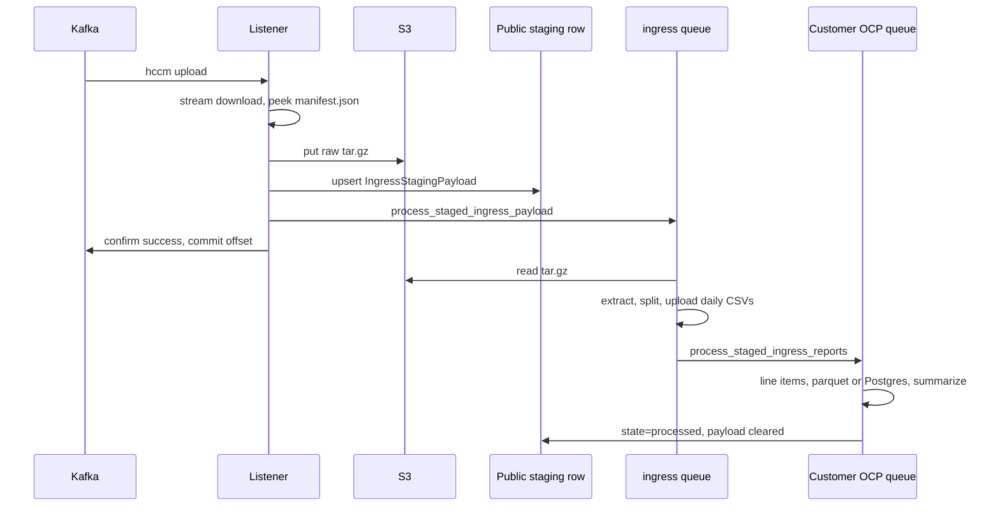

# Ingress staging (COST-8282)

Branch `COST-8282-decouple-kafka` moves HCCM Kafka ingress off the listener thread. With `cost-management.backend.ingress-staging-listener` on, the listener downloads the tarball, stores it, confirms the upload, and commits the offset. Extract, CSV split, Hive DDL, and line items run on workers.

The flag defaults off. Stage and production stay on the previous listener until it is enabled per schema. Production on-prem stays on that listener: the flag is not in `ONPREM_FLAG_DEFAULTS`, and `dev_fallback=True` is true only when the Unleash environment is `development`.

Design notes for this change live at [`decouple-kafka-ingress.md`](../../decouple-kafka-ingress.md). The punch list in [`decouple-kafka-ingress-followups.md`](../../decouple-kafka-ingress-followups.md) is implemented in this branch.

Related: [OpenShift CSV processing](csv-processing-ocp.md), [Celery tasks](celery-tasks.md).

## What changed

| Area | Change |
|------|--------|
| Listener | [`handle_message`](../../koku/masu/external/kafka_msg_handler.py) checks the staging flag after the public `Customer` lookup. When the flag is on it calls [`stage_ingress_payload`](../../koku/masu/external/downloader/ocp/ingress_staging.py) and returns no report metadata, so [`process_messages`](../../koku/masu/external/kafka_msg_handler.py) confirms without extract or line items. |
| Download | [`download_payload`](../../koku/masu/external/downloader/ocp/download.py) streams the quarantine body to disk (1 MiB chunks, 10s connect timeout, 60s read timeout). HTTP 408 and 429 rewind the consumer. Other 4xx responses, including a missing quarantine object, confirm as failure. |
| Staging record | Public table `reporting_common_ingress_staging_payload` ([`IngressStagingPayload`](../../koku/reporting_common/models.py), migration [`0046_ingressstagingpayload`](../../koku/reporting_common/migrations/0046_ingressstagingpayload.py)). Apply that migration before any schema has the flag on. A `ProgrammingError` on the staging read or upsert becomes `KafkaMsgHandlerError`, so the consumer rewinds. |
| Object layout | `{WAREHOUSE_PATH}/ingress_staging/{org_id}/{cluster_id}/YYYY/MM/DD/{request_id}.tar.gz`. `cluster_id` and the manifest uuid come from a manifest peek. The listener does not extract the archive. |
| Workers | [`process_staged_ingress_payload`](../../koku/masu/processor/ocp/staged_payloads/process_staged.py) claims the row and extracts on the `ingress` queue. [`process_staged_ingress_reports`](../../koku/masu/processor/ocp/staged_payloads/process_staged.py) runs line items on the customer OCP queue (`ocp`, `ocp_xl`, or `ocp_penalty`). |
| Day slices | Daily CSV names are `{report_type}.{day}.{manifest_id}.{digest}.csv`. `digest` is the first 12 hex characters of the SHA-256 of that slice. An identical replay writes the same object key. [`divide_csv_daily`](../../koku/masu/processor/ocp/staged_payloads/processing.py) no longer takes the manifest `report_tracker` row lock. |
| Dead-letter queue | Unchanged, and still second. It runs only when the staging flag is off and `cost-management.backend.ingress-dead-letter-queue` is on. |

The previous listener path remains as [`legacy_message_processing`](../../koku/masu/external/kafka_msg_handler.py). Extract and line-item code moved from `kafka_msg_handler.py` into [`processing.py`](../../koku/masu/processor/ocp/staged_payloads/processing.py). The listener still calls that module when the flag is off.

## Flag-on flow

Ordering on the listener:

1. If this `request_id` already has an `s3_key`, enqueue the worker and confirm success. The tarball is not uploaded again.
2. Stream the quarantine object. A missing `url`, an unreadable manifest, or a permanent download error confirms failure.
3. Put the object, then upsert the row (`state=pending`). An S3 or database failure raises `KafkaMsgHandlerError` and the consumer rewinds. The object can already be in the bucket; the next delivery reconciles by `request_id`.
4. Enqueue `process_staged_ingress_payload` on `ingress`. A broker error is logged and does not rewind Kafka. The reconciler picks the row up.
5. Confirm success and commit. Ingress validation fires when the tarball and row are durable, before line items or Hive partitions exist.

`payload` on the row is the Kafka value, including `b64_identity`, so ROS can run on the worker. It is cleared when the row is marked processed. Do not log `payload`.

## Worker state machine

States on [`IngressStagingState`](../../koku/reporting_common/models.py): `pending`, `processing`, `processed`, `failed`.

[`claim_ingress_staging_row`](../../koku/masu/external/downloader/ocp/ingress_staging.py) wins with one `UPDATE`. It sets `claim_token`, `claimed_at`, and increments `attempts`. A second claim while the lease is held returns without processing and does not bump `attempts`. A processing row is eligible again only after [`INGRESS_STAGING_LEASE`](../../koku/masu/external/downloader/ocp/ingress_staging.py) (2 hours) and only when `attempts` is still under `settings.MAX_UPDATE_RETRIES` (5).

The extract task and the line-item task share that token. A background heartbeat refreshes `claimed_at` every 5 minutes. Both tasks use a Celery soft limit of 90 minutes and a hard limit of 105 minutes, under the lease, so a hung task is killed before another worker can claim the row. [`mark_processed`](../../koku/masu/external/downloader/ocp/ingress_staging.py) and [`release_for_retry`](../../koku/masu/external/downloader/ocp/ingress_staging.py) update `WHERE request_id AND claim_token`. A worker that loses the token does not write `processed`, `pending`, or `failed`.

`process_staged_ingress_payload`:

- Unknown cluster, retention skip, or files that are already complete: mark processed. No line-item task.
- Reports still to process: enqueue `process_staged_ingress_reports` with `get_customer_queue(schema, OCPQueue)`. A broker failure releases the claim for retry. The row stays `processing` across that handoff. Handoff is not completion.

`process_staged_ingress_reports` downloads the daily CSVs (extract ran on another pod), runs [`process_extracted_reports`](../../koku/masu/processor/ocp/staged_payloads/processing.py), then marks the row processed and nulls `payload`. On SaaS that path still creates Hive tables and syncs partitions. On-prem it writes line items to PostgreSQL. The listener never opens Trino.

Retries use `not_before` with backoff `min(2^(attempts-1), 30)` minutes. At the retry limit, `release_for_retry` sets `failed`, clears the token, and logs `request_id`, `org_id`, `cluster_id`, `s3_key`, and `attempts`. There is no second ingress validation. The object stays in the bucket.

## Reconciler, retention, and metrics

| Task | Schedule | Queue | Role |
|------|----------|-------|------|
| [`reconcile_ingress_staging`](../../koku/masu/external/downloader/ocp/ingress_staging.py) | Every minute | `ingress` | Enqueues rows the eager handoff did not finish. It does not claim them. A successful publish sets `enqueued_at`; that `request_id` is skipped until the two-hour lease passes. Pending rows younger than one minute are left for the in-flight task. Batch size 100. |
| [`expire_ingress_staging`](../../koku/masu/external/downloader/ocp/ingress_staging.py) | Hourly at minute 0 | `ingress` | Deletes `processed` rows with `stored_at` older than 7 days and deletes the matching object. `failed` rows and their objects stay until an operator replays or drops them. |

The OCP worker consumes `ocp,ingress` ([`deploy/clowdapp.yaml`](../../deploy/clowdapp.yaml), [`worker-ocp.yaml`](../../deploy/kustomize/patches/worker-ocp.yaml)). `SCHEDULER_WORKER_QUEUE` does not include `ingress`, so the scheduler publishes the beat tasks and does not run extract or Trino for them.

Gauges, published by the reconciler:

| Metric | Meaning |
|--------|---------|
| `ingress_backlog` | Celery depth of the `ingress` queue |
| `ingress_staging_pending` | Rows in `pending` |
| `ingress_staging_failed` | Rows in `failed` |
| `ingress_staging_oldest_unprocessed_seconds` | Age of the oldest row in `pending`, `processing`, or `failed` |

Indexes: `(state, not_before)` for claims, `(state, claimed_at)` for lease reclaim.

## Rollout

1. Apply migration `0046` before enabling the flag. A missing table rewinds the consumer for schemas that have the flag on.
2. Enable `cost-management.backend.ingress-staging-listener` per schema in Unleash. Stickiness is `schema`. ON is the staging path. Default remains off in stage and production.
3. Leave on-prem on [`legacy_message_processing`](../../koku/masu/external/kafka_msg_handler.py) until a later release adds the flag to `ONPREM_FLAG_DEFAULTS`.
4. Watch `ingress_staging_failed` and `ingress_staging_oldest_unprocessed_seconds`. A confirmed upload that never becomes cost data shows up there. This branch does not add a paging rule.
5. The dead-letter flag can stay as the incident park-and-skip path for schemas that are not on staging. It still has no replay worker.

## Tests

- Listener confirms without `extract_payload` or `process_report` when the flag is on, including a redelivered `request_id`, an upsert failure after S3, and a broker error after the row is stored: [`test_kafka_msg_handler.py`](../../koku/masu/test/external/test_kafka_msg_handler.py).
- Claim fencing, reconciler publish-once, and retention: [`test_ingress_staging.py`](../../koku/masu/test/external/downloader/ocp/test_ingress_staging.py).
- Line items go to the customer OCP queue, a replay of a completed file does not call `process_report` again, and the scheduler queue list omits `ingress`: [`test_process_staged.py`](../../koku/masu/test/processor/ocp/staged_payloads/test_process_staged.py).
