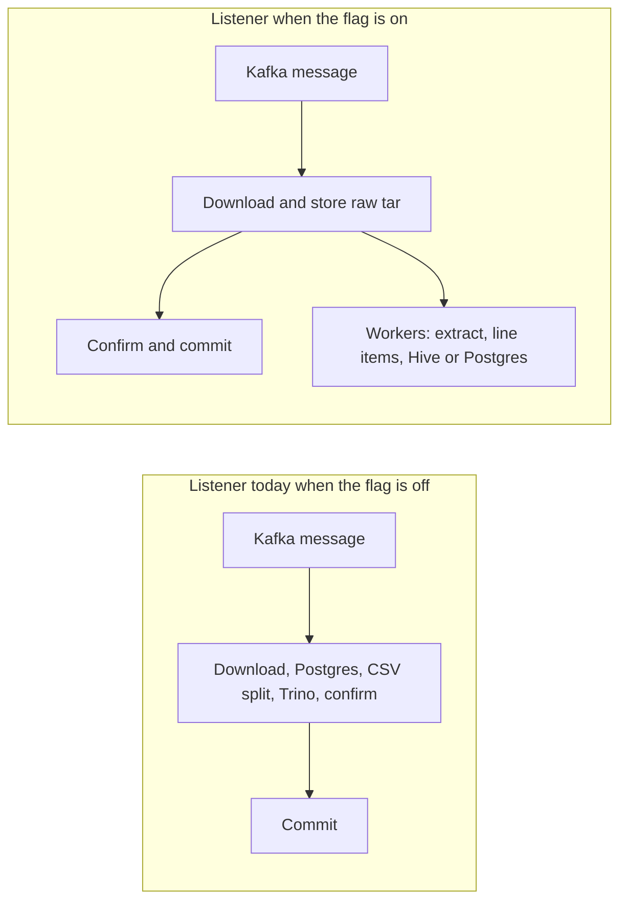
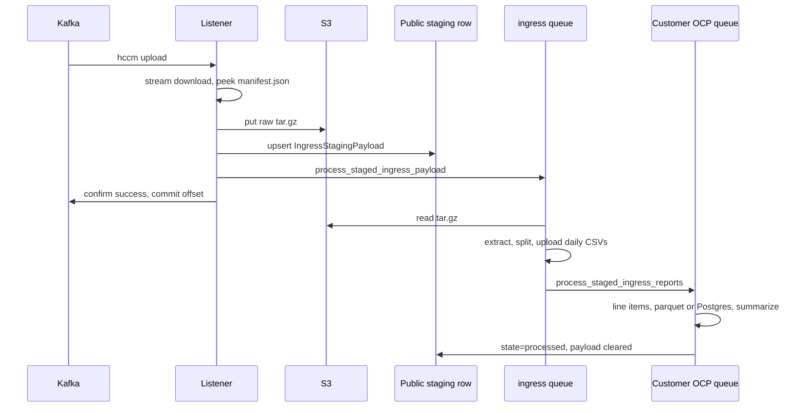
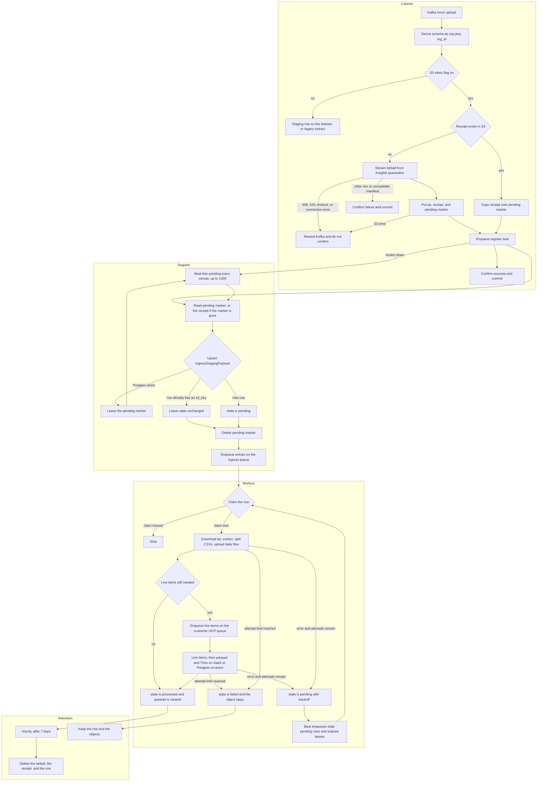

# Ingress staging (COST-8282)

Branch `COST-8282-decouple-kafka` moves HCCM Kafka ingress off the listener thread. With `cost-management.backend.ingress-staging-listener` on, the listener downloads the tarball, stores it, confirms the upload, and commits the offset. Extract, CSV split, Hive DDL, and line items run on workers.

The flag defaults off. Stage and production stay on the previous listener until it is enabled per schema. Production on-prem stays on that listener: the flag is not in `ONPREM_FLAG_DEFAULTS`, and `dev_fallback=True` is true only when the Unleash environment is `development`.

Design notes for this change live at [`decouple-kafka-ingress.md`](../../decouple-kafka-ingress.md). The punch list in [`decouple-kafka-ingress-followups.md`](../../decouple-kafka-ingress-followups.md) is implemented in this branch.

Related: [OpenShift CSV processing](csv-processing-ocp.md), [Celery tasks](celery-tasks.md).

## Concept

The HCCM listener is one thread. It polls Kafka with manual commits, so the next upload waits until the current message returns. Today that return includes the whole pipeline: download the quarantine tarball, write manifests in PostgreSQL, split CSVs, convert to parquet, and on SaaS run Hive DDL and partition sync. A slow or deadlocked database rewinds the consumer, and the topic stops. A Trino failure commits the offset, so the upload can be dropped while the thread was still blocked.

This change treats the upload as two jobs.

1. **Make the bytes durable.** The listener streams the tarball into our bucket, records one public row keyed by `request_id`, tells Insights the upload succeeded, and commits Kafka.
2. **Turn the bytes into cost data.** A worker reads that object back, extracts it, and hands line items to the customer’s OCP queue. If the worker dies, the row is still there and a minutely reconciler enqueues it again.

Kafka progress now tracks “we have the file.” Cost-data progress tracks “we have processed the file.” Those used to be the same moment.

The flag keeps both shapes in the same binary. Off is the current thread. On is the split. On-prem production stays off until a later release.

## Pros and cons

### Pros

- **Kafka lag follows download time, not database or Trino time.** A Hive metastore outage or a manifest deadlock delays cost data. It does not stall the consumer for every other tenant.
- **A worker crash does not lose the upload.** The tarball and the staging row are written before the offset is committed. The reconciler retries from that record. The dead-letter path parks payloads and has no replay worker; this path does.
- **Redelivery is safe.** The same `request_id` does not upload a second object. A claim token plus a heartbeat means a second worker does not run extract or line items while the first still holds the row. Day-slice names are a hash of the CSV bytes, so a replay writes the same object key and no longer locks `report_tracker`.
- **Large clusters stay on the queues that already exist for them.** Extract is shared on `ingress`. Line items use `ocp`, `ocp_xl`, or `ocp_penalty`. The scheduler pod publishes the beat tasks and does not run Trino for them.
- **A hung quarantine download can end.** The body is streamed to disk with connect and read timeouts. HTTP 408 and 429 rewind; a gone object confirms as failure.
- **A confirmed upload that never becomes cost data is visible.** Gauges report pending rows, failed rows, and the age of the oldest unfinished row. Permanent failure is logged with `request_id`, org, cluster, and object key.
- **Rollout is per schema.** The previous listener remains in the binary. One tenant can take the new path while the rest stay on the old one.

### Cons

- **“Upload succeeded” no longer means “cost data is ready.”** Insights and anything listening on `platform.upload.available` can see the payload before line items or Hive partitions exist. Queries miss that data until the worker finishes.
- **With only the staging flag on, the listener still depends on a short public Postgres round trip.** It looks up `Customer` and upserts the staging row. A public-schema outage still rewinds the consumer. [`cost-management.backend.ingress-staging-s3-inbox`](../../koku/masu/processor/__init__.py) removes that round trip: the listener writes the tarball and a pending marker and does not open Postgres or Trino. The beat creates the row when the database is back. Tenant reporting transactions and Trino stay on the workers either way.
- **More places to fail after Kafka has moved on.** Extract, parquet, and summarization errors no longer rewind the topic. They retry on the row, then sit in `failed` with the object kept. Ingress is not told again. Someone has to watch `ingress_staging_failed` and replay or drop those rows. This branch adds the gauges and does not add a page.
- **Identity sits in the public table until the row is processed.** `payload` includes `b64_identity` so ROS can run on the worker. It is cleared on success. Failed rows keep it until an operator acts. Processed rows and objects expire after seven days.
- **Each payload is copied more than once.** Quarantine to disk, disk to `ingress_staging/`, worker back to disk, daily CSVs to the bucket, then those CSVs onto the line-item pod. That is the cost of letting the listener return before extract.
- **Extract is still a shared queue.** One large tarball can sit in front of other staged payloads on `ingress`. Customer fairness applies after extract, when line items move to the OCP queues.
- **The state machine is easy to get wrong.** Lease, claim token, heartbeat, soft time limit, and reconciler `enqueued_at` all have to agree. A worker that loses the token must not overwrite `processed`. The tests cover that; the operational story is heavier than the old single-threaded path.
- **On-prem does not take this path yet.** Production on-prem keeps the listener that talks to Postgres on the consumer thread. The flag is a SaaS rollout until it is added to the on-prem defaults.

## What changed

| Area | Change |
|------|--------|
| Listener | [`handle_message`](../../koku/masu/external/kafka_msg_handler.py) checks the staging flag. When the S3 inbox flag is also on, it derives the schema and calls [`stage_ingress_s3_inbox`](../../koku/masu/external/downloader/ocp/ingress_staging.py) with no Postgres. Otherwise it looks up `Customer` and calls [`stage_ingress_payload`](../../koku/masu/external/downloader/ocp/ingress_staging.py). Either path returns no report metadata, so [`process_messages`](../../koku/masu/external/kafka_msg_handler.py) confirms without extract or line items. |
| Download | [`download_payload`](../../koku/masu/external/downloader/ocp/download.py) streams the quarantine body to disk (1 MiB chunks, 10s connect timeout, 60s read timeout). HTTP 408 and 429 rewind the consumer. Other 4xx responses, including a missing quarantine object, confirm as failure. |
| Staging record | Public table `reporting_common_ingress_staging_payload` ([`IngressStagingPayload`](../../koku/reporting_common/models.py), migration [`0046_ingressstagingpayload`](../../koku/reporting_common/migrations/0046_ingressstagingpayload.py)). Apply that migration before any schema has the flag on. A `ProgrammingError` on the staging read or upsert becomes `KafkaMsgHandlerError`, so the consumer rewinds. |
| Object layout | Staging flag: `{WAREHOUSE_PATH}/ingress_staging/{org_id}/{cluster_id}/YYYY/MM/DD/{request_id}.tar.gz`. S3 inbox flag: the same prefix without the date, plus `pending/` and `by_request/` markers. `cluster_id` and the manifest uuid come from a manifest peek. The listener does not extract the archive. |
| Workers | [`process_staged_ingress_payload`](../../koku/masu/processor/ocp/staged_payloads/process_staged.py) claims the row and extracts on the `ingress` queue. [`process_staged_ingress_reports`](../../koku/masu/processor/ocp/staged_payloads/process_staged.py) runs line items on the customer OCP queue (`ocp`, `ocp_xl`, or `ocp_penalty`). |
| Day slices | Daily CSV names are `{report_type}.{day}.{manifest_id}.{digest}.csv`. `digest` is the first 12 hex characters of the SHA-256 of that slice. An identical replay writes the same object key. [`divide_csv_daily`](../../koku/masu/processor/ocp/staged_payloads/processing.py) no longer takes the manifest `report_tracker` row lock. |
| Dead-letter queue | Unchanged, and still second. It runs only when the staging flag is off and `cost-management.backend.ingress-dead-letter-queue` is on. |

The previous listener path remains as [`legacy_message_processing`](../../koku/masu/external/kafka_msg_handler.py). Extract and line-item code moved from `kafka_msg_handler.py` into [`processing.py`](../../koku/masu/processor/ocp/staged_payloads/processing.py). The listener still calls that module when the flag is off.

## Flag-on flow

This is the path when `cost-management.backend.ingress-staging-listener` is on and `cost-management.backend.ingress-staging-s3-inbox` is off. The listener still upserts the public staging row.

Ordering on the listener:

1. If this `request_id` already has an `s3_key`, enqueue the worker and confirm success. The tarball is not uploaded again.
2. Stream the quarantine object. A missing `url`, an unreadable manifest, or a permanent download error confirms failure.
3. Put the object, then upsert the row (`state=pending`). An S3 or database failure raises `KafkaMsgHandlerError` and the consumer rewinds. The object can already be in the bucket; the next delivery reconciles by `request_id`.
4. Enqueue `process_staged_ingress_payload` on `ingress`. A broker error is logged and does not rewind Kafka. The reconciler picks the row up.
5. Confirm success and commit. Ingress validation fires when the tarball and row are durable, before line items or Hive partitions exist.

`payload` on the row is the Kafka value, including `b64_identity`, so ROS can run on the worker. It is cleared when the row is marked processed. Do not log `payload`.

## S3 inbox

`cost-management.backend.ingress-staging-s3-inbox` is checked only after `cost-management.backend.ingress-staging-listener` is on for the same schema. Both default off. The schema is `org{org_id}` from [`schema_name_for_org`](../../koku/masu/external/kafka_msg_handler.py), including `SCHEMA_SUFFIX`, with no `Customer` query. On-prem stays on the legacy listener.

[`stage_ingress_s3_inbox`](../../koku/masu/external/downloader/ocp/ingress_staging.py) writes three objects, confirms, and commits. It does not open Postgres or Trino. Postgres and Trino are used later, by the beat and the workers.

| Object | Key |
|--------|-----|
| Tarball | `{WAREHOUSE_PATH}/ingress_staging/{org_id}/{cluster_id}/{request_id}.tar.gz` |
| Receipt | `{WAREHOUSE_PATH}/ingress_staging/by_request/{request_id}.json` |
| Pending marker | `{WAREHOUSE_PATH}/ingress_staging/pending/{request_id}.json` |

`request_id` in the key is stripped to letters and digits, same as the dated staging key. The marker and the receipt hold `s3_key`, `org_id`, `cluster_id`, `assembly_id`, `account`, and the Kafka value. Do not log them. The calendar date is not part of the key, so a replay overwrites the same object.

A redelivery HEADs the receipt. When it exists, the listener copies that receipt onto the pending marker, enqueues registration, and confirms. It does not download the quarantine object again and does not upload the tarball again.

[`register_ingress_staging_marker`](../../koku/masu/external/downloader/ocp/ingress_staging.py) reads `pending/{request_id}.json`, upserts [`IngressStagingPayload`](../../koku/reporting_common/models.py), deletes the marker, and enqueues `process_staged_ingress_payload`. The listener enqueues that register task best-effort. A broker failure does not rewind Kafka. The same function falls back to the receipt when the pending marker is already gone.

[`reconcile_ingress_staging`](../../koku/masu/external/downloader/ocp/ingress_staging.py) lists `ingress_staging/pending/` every minute before it enqueues rows. One run registers at most 1000 markers. The marker is deleted only after the upsert succeeds. A database error leaves the marker and stops that batch. The upsert does not reset a row that already has an `s3_key`, so a second register cannot turn `processed` back into `pending`.

Postgres or Trino can be down and the listener still stores and confirms. Markers stay under `pending/` until the beat can insert rows. S3 being down still rewinds the consumer. Processing still needs Postgres, and on SaaS it still needs Trino, on the workers.

[`expire_ingress_staging`](../../koku/masu/external/downloader/ocp/ingress_staging.py) deletes the tarball and the `by_request` receipt with the processed row. Failed rows and their objects stay. The pending-marker gauges are `ingress_staging_pending_markers` and `ingress_staging_pending_marker_oldest_seconds`. The count and age come from that capped listing, so a backlog larger than 1000 shows as 1000 until the prefix drains.

## Worker state machine

States on [`IngressStagingState`](../../koku/reporting_common/models.py): `pending`, `processing`, `processed`, `failed`.

[`claim_ingress_staging_row`](../../koku/masu/external/downloader/ocp/ingress_staging.py) wins with one `UPDATE`. It sets `claim_token`, `claimed_at`, and increments `attempts`. A second claim while the lease is held returns without processing and does not bump `attempts`. A processing row is eligible again only after [`INGRESS_STAGING_LEASE`](../../koku/masu/external/downloader/ocp/ingress_staging.py) (2 hours) and only when `attempts` is still under `settings.MAX_UPDATE_RETRIES` (5).

The extract task and the line-item task share that token. A background heartbeat refreshes `claimed_at` every 5 minutes. Both tasks use a Celery soft limit of 90 minutes and a hard limit of 105 minutes, under the lease, so a hung task is killed before another worker can claim the row. [`mark_processed`](../../koku/masu/external/downloader/ocp/ingress_staging.py) and [`release_for_retry`](../../koku/masu/external/downloader/ocp/ingress_staging.py) update `WHERE request_id AND claim_token`. A worker that loses the token does not write `processed`, `pending`, or `failed`.

`process_staged_ingress_payload`:

- Unknown cluster, retention skip, or files that are already complete: mark processed. No line-item task.
- Reports still to process: enqueue `process_staged_ingress_reports` with `get_customer_queue(schema, OCPQueue)`. A broker failure releases the claim for retry. The row stays `processing` across that handoff. Handoff is not completion.

`process_staged_ingress_reports` downloads the daily CSVs (extract ran on another pod), runs [`process_extracted_reports`](../../koku/masu/processor/ocp/staged_payloads/processing.py), then marks the row processed and nulls `payload`. On SaaS that path still creates Hive tables and syncs partitions. On-prem it writes line items to PostgreSQL. The listener never opens Trino.

Retries use `not_before` with backoff `min(2^(attempts-1), 30)` minutes. At the retry limit, `release_for_retry` sets `failed`, clears the token, and logs `request_id`, `org_id`, `cluster_id`, `s3_key`, and `attempts`. There is no second ingress validation. The object stays in the bucket.

## Reconciler, retention, and metrics

| Task | Schedule | Queue | Role |
|------|----------|-------|------|
| [`reconcile_ingress_staging`](../../koku/masu/external/downloader/ocp/ingress_staging.py) | Every minute | `ingress` | Registers up to 1000 pending S3 markers, then enqueues rows the eager handoff did not finish. It does not claim them. A successful publish sets `enqueued_at`; that `request_id` is skipped until the two-hour lease passes. Pending rows younger than one minute are left for the in-flight task. Row batch size 100. |
| [`expire_ingress_staging`](../../koku/masu/external/downloader/ocp/ingress_staging.py) | Hourly at minute 0 | `ingress` | Deletes `processed` rows with `stored_at` older than 7 days and deletes the tarball and `by_request` receipt. `failed` rows and their objects stay until an operator replays or drops them. |

The OCP worker consumes `ocp,ingress` ([`deploy/clowdapp.yaml`](../../deploy/clowdapp.yaml), [`worker-ocp.yaml`](../../deploy/kustomize/patches/worker-ocp.yaml)). `SCHEDULER_WORKER_QUEUE` does not include `ingress`, so the scheduler publishes the beat tasks and does not run extract or Trino for them.

Gauges, published by the reconciler:

| Metric | Meaning |
|--------|---------|
| `ingress_backlog` | Celery depth of the `ingress` queue |
| `ingress_staging_pending` | Rows in `pending` |
| `ingress_staging_failed` | Rows in `failed` |
| `ingress_staging_oldest_unprocessed_seconds` | Age of the oldest row in `pending`, `processing`, or `failed` |
| `ingress_staging_pending_markers` | Pending S3 markers listed this run, capped at 1000 |
| `ingress_staging_pending_marker_oldest_seconds` | Age of the oldest marker in that listing |

Indexes: `(state, not_before)` for claims, `(state, claimed_at)` for lease reclaim.

## Rollout

1. Apply migration `0046` before enabling the flag. A missing table rewinds the consumer for schemas that have the flag on.
2. Enable `cost-management.backend.ingress-staging-listener` per schema in Unleash. Stickiness is `schema`. ON is the staging path. Default remains off in stage and production. Enable `cost-management.backend.ingress-staging-s3-inbox` only after that, for schemas that should accept uploads with Postgres down.
3. Leave on-prem on [`legacy_message_processing`](../../koku/masu/external/kafka_msg_handler.py) until a later release adds the flag to `ONPREM_FLAG_DEFAULTS`.
4. Watch `ingress_staging_failed` and `ingress_staging_oldest_unprocessed_seconds`. A confirmed upload that never becomes cost data shows up there. This branch does not add a paging rule.
5. The dead-letter flag can stay as the incident park-and-skip path for schemas that are not on staging. It still has no replay worker.

## Tests

- Listener confirms without `extract_payload` or `process_report` when the flag is on, including a redelivered `request_id`, an upsert failure after S3, and a broker error after the row is stored: [`test_kafka_msg_handler.py`](../../koku/masu/test/external/test_kafka_msg_handler.py).
- Claim fencing, reconciler publish-once, and retention: [`test_ingress_staging.py`](../../koku/masu/test/external/downloader/ocp/test_ingress_staging.py).
- Line items go to the customer OCP queue, a replay of a completed file does not call `process_report` again, and the scheduler queue list omits `ingress`: [`test_process_staged.py`](../../koku/masu/test/processor/ocp/staged_payloads/test_process_staged.py).
- With the S3 inbox flag on, a database error during stage still confirms, a redelivery HEADs the receipt and does not upload again, a failed marker upsert leaves the marker, and a second register does not reset `processed`.
