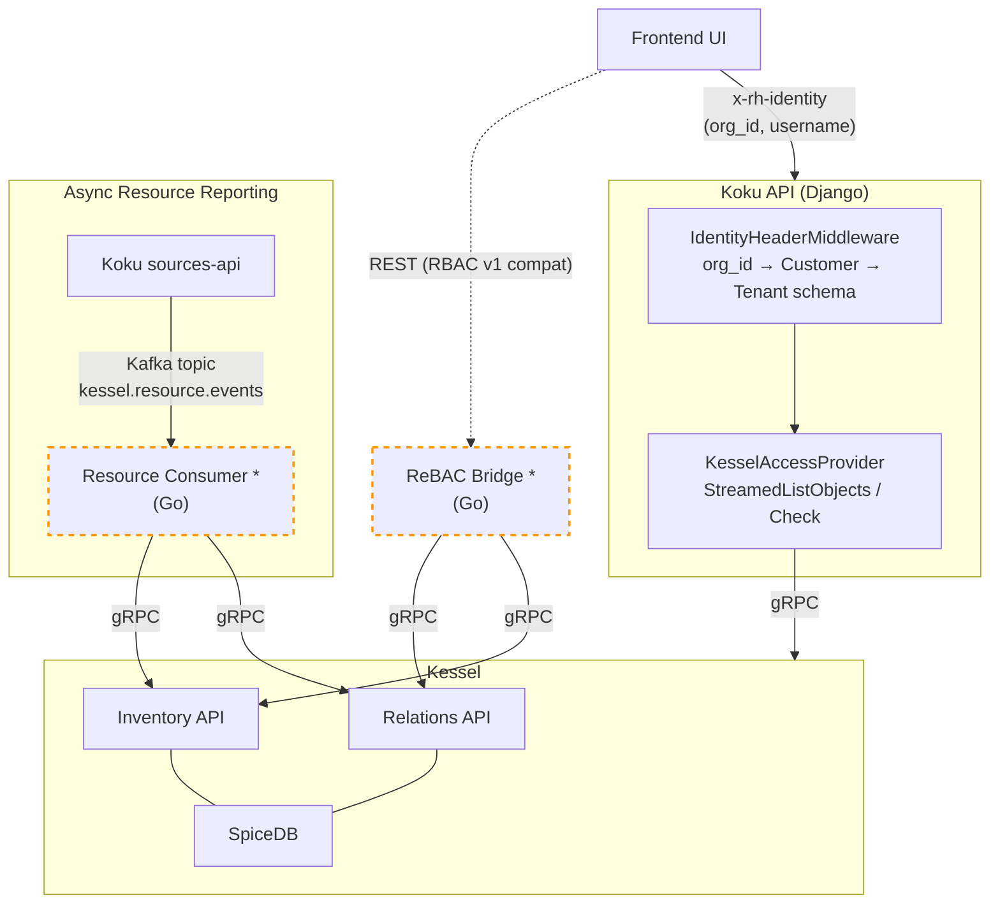
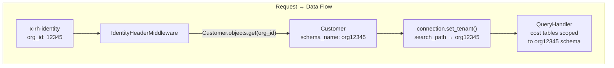
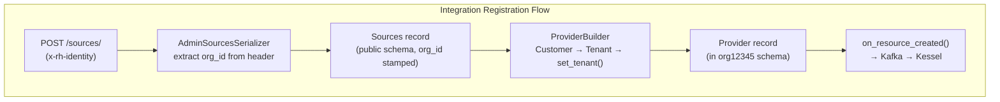

# Kessel Integration for Cost Management On-Prem

This directory contains the design, architecture, and decision records for
integrating [Kessel](https://github.com/project-kessel) (ReBAC / SpiceDB) as
the authorization backend for Koku on-prem deployments, replacing the SaaS
`insights-rbac` service.

**Jira Epic**: [FLPATH-2799](https://issues.redhat.com/browse/FLPATH-2799)
**Primary Story**: [FLPATH-3294](https://issues.redhat.com/browse/FLPATH-3294)

---

## Quick Start

| Your goal | Start here |
|-----------|------------|
| Understand the overall architecture and integration flows | [kessel-ocp-integration.md](./kessel-ocp-integration.md) |
| Understand the implementation details | [kessel-ocp-detailed-design.md](./kessel-ocp-detailed-design.md) |
| Set up a local dev environment with Kessel | [kessel-development-guide.md](./kessel-development-guide.md) |
| Understand how the on-prem admin management API works | [rebac-bridge-design.md](./rebac-bridge-design.md) |
| Review the ZED schema gaps with upstream `rbac-config` | [zed-schema-upstream-delta.md](./zed-schema-upstream-delta.md) |

---

## Reading Order

The documents build on each other. The recommended order depends on your role.

### For architects and tech leads (full context)

Read in this order to understand why decisions were made, what was evaluated
and discarded, and what the final architecture looks like:

1. [onprem-authorization-backend.md](./onprem-authorization-backend.md) -- Why Kessel was chosen over RBAC v1
2. [insights-rbac-kessel-onprem-feasibility.md](./insights-rbac-kessel-onprem-feasibility.md) -- Why insights-rbac was ruled out
3. [kessel-authorization-delegation-dd.md](./kessel-authorization-delegation-dd.md) -- Adapter Pattern vs Full Delegation (Adapter won)
4. [rbac-config-reuse-for-onprem.md](./rbac-config-reuse-for-onprem.md) -- Reuse of existing permissions/roles
5. **[kessel-ocp-integration.md](./kessel-ocp-integration.md)** -- HLD: system architecture, sequence diagrams, flows
6. **[kessel-ocp-detailed-design.md](./kessel-ocp-detailed-design.md)** -- DD: middleware, AccessProvider, resource sync
7. [onprem-workspace-management-adr.md](./onprem-workspace-management-adr.md) -- Workspace hierarchy, team access, tuple lifecycle
8. [rebac-bridge-design.md](./rebac-bridge-design.md) -- ReBAC Bridge: RBAC v1 compatible management API `*`
9. [kessel-resource-reporting-kafka-dd.md](./kessel-resource-reporting-kafka-dd.md) -- Kafka-based async resource reporting `*`

### For developers implementing or reviewing code

Start with the two starred documents and the dev guide:

| # | Document | What you get |
|---|----------|-------------|
| 1 | [kessel-ocp-integration.md](./kessel-ocp-integration.md) | Architecture overview, component diagram, sequence diagrams for every major flow |
| 2 | [kessel-ocp-detailed-design.md](./kessel-ocp-detailed-design.md) | Implementation details: `AccessProvider` abstraction, middleware changes, `KesselAccessProvider`, resource reporting, ZED schema, role seeding |
| 3 | [kessel-development-guide.md](./kessel-development-guide.md) | Local setup: podman compose, seeding roles, running with `AUTHORIZATION_BACKEND=rebac` |
| 4 | [kessel-ocp-test-plan.md](./kessel-ocp-test-plan.md) | Unit, integration, contract, and E2E test cases |

### For the Kessel team (schema and API contract)

| # | Document | What you get |
|---|----------|-------------|
| 1 | [kessel-ocp-integration.md](./kessel-ocp-integration.md) | How Koku uses Kessel APIs (Relations, Inventory, Check, StreamedListObjects) |
| 2 | [zed-schema-upstream-delta.md](./zed-schema-upstream-delta.md) | Gap-by-gap delta between on-prem schema and upstream `rbac-config` schema |
| 3 | [onprem-workspace-management-adr.md](./onprem-workspace-management-adr.md) | Workspace hierarchy, tuple patterns, structural relationships |
| 4 | [kessel-resource-reporting-kafka-dd.md](./kessel-resource-reporting-kafka-dd.md) | How resources are reported to Kessel Inventory and Relations APIs |

---

## Document Catalog

### Decisions (ADRs)

| Document | Status | Summary |
|----------|--------|---------|
| [onprem-authorization-backend.md](./onprem-authorization-backend.md) | **Resolved** — Kessel selected | Evaluates Kessel (rebac) vs RBAC v1 (rbac) vs hybrid for on-prem authorization. |
| [kessel-authorization-delegation-dd.md](./kessel-authorization-delegation-dd.md) | **Resolved** — Adapter Pattern selected | Decides integration depth: Adapter Pattern (Kessel as access-list provider) vs Full Delegation (Kessel as inline authorizer). |
| [onprem-workspace-management-adr.md](./onprem-workspace-management-adr.md) | Proposed | Workspace hierarchy design: team workspaces, cross-team sharing, Keycloak automation, tuple lifecycle management. |
| [rbac-config-reuse-for-onprem.md](./rbac-config-reuse-for-onprem.md) | **Resolved** — Reuse confirmed | Confirms that `rbac-config` permissions and roles are Koku-specific (not SaaS-specific) and should be seeded into SpiceDB on-prem. |
| [insights-rbac-kessel-onprem-feasibility.md](./insights-rbac-kessel-onprem-feasibility.md) | **Resolved** — Not viable as-is | Feasibility analysis of deploying `insights-rbac` + `insights-rbac-ui` on-prem. Concluded it requires too much infrastructure (Kafka, Debezium) and the UI is tightly coupled to the SaaS console shell. Led to the ReBAC Bridge design. |

### Design Documents

| Document | Type | Status | Summary |
|----------|------|--------|---------|
| [kessel-ocp-integration.md](./kessel-ocp-integration.md) | HLD | **Implemented** | System architecture, component responsibilities, dual-write pattern, sequence diagrams for role seeding, user access, provider CRUD, authorization checks, and error handling. |
| [kessel-ocp-detailed-design.md](./kessel-ocp-detailed-design.md) | DD | **Implemented** | Implementation design for FLPATH-3294: `AccessProvider` abstraction, middleware integration, `KesselAccessProvider` internals, resource reporting, ZED schema and role seeding, deployment and operations. |
| [rebac-bridge-design.md](./rebac-bridge-design.md) | DD | Draft (design only) | ReBAC Bridge `*`: a Go microservice exposing `insights-rbac` v1 compatible REST endpoints backed by Kessel/SpiceDB. Covers API surface, workspace abstraction, group-level resource assignment, and UI component extraction from `insights-rbac-ui`. |
| [kessel-resource-reporting-kafka-dd.md](./kessel-resource-reporting-kafka-dd.md) | DD | Draft (design only) | Kafka resource consumer `*`: async pipeline for resource reporting from `sources-api` to Kessel. Replaces synchronous gRPC calls in `resource_reporter.py` with Kafka publish; a Go consumer processes events with infinite retry. |

### Schema and Configuration

| Document | Summary |
|----------|---------|
| [zed-schema-upstream-delta.md](./zed-schema-upstream-delta.md) | Tracks every difference between the local on-prem ZED schema (`dev/kessel/schema.zed`) and the upstream SaaS schema in `RedHatInsights/rbac-config`, with severity, owner, and resolution status per gap. |

### Test Plans

| Document | Covers |
|----------|--------|
| [kessel-ocp-test-plan.md](./kessel-ocp-test-plan.md) | Unit, integration, contract, and E2E test cases for the Kessel OCP integration (FLPATH-3294). |
| [rebac-bridge-test-plan.md](./rebac-bridge-test-plan.md) | Test plan for the ReBAC Bridge service (IEEE 829-based): Roles, Groups, Principals, Resources APIs. |

### Developer Guides

| Document | Summary |
|----------|---------|
| [kessel-development-guide.md](./kessel-development-guide.md) | Local development setup: starting the Kessel stack with podman compose, seeding roles into SpiceDB, running Koku with `AUTHORIZATION_BACKEND=rebac`, and troubleshooting. |

---

## Architecture at a Glance

> **\*** Components with dashed borders are **not yet implemented** — design only. See [rebac-bridge-design.md](./rebac-bridge-design.md) and [kessel-resource-reporting-kafka-dd.md](./kessel-resource-reporting-kafka-dd.md).

**Key data flow**: The `org_id` from the identity header determines the
PostgreSQL tenant schema (e.g., `org_id=12345` → schema `org12345`). All cost
data, providers, and integrations are scoped to that schema. Kessel/SpiceDB
holds the authorization tuples (who can see what); Koku queries Kessel at
request time via `KesselAccessProvider` to build the user's access dict, then
uses it to filter results within the tenant schema.

---

## Key Jira References

| Jira | Description |
|------|-------------|
| [FLPATH-2799](https://issues.redhat.com/browse/FLPATH-2799) | Epic: Kessel integration for Cost Management |
| [FLPATH-2690](https://issues.redhat.com/browse/FLPATH-2690) | Parent story |
| [FLPATH-3294](https://issues.redhat.com/browse/FLPATH-3294) | Primary implementation story (OCP integration) |
| [FLPATH-3319](https://issues.redhat.com/browse/FLPATH-3319) | ZED schema upstream reconciliation |
