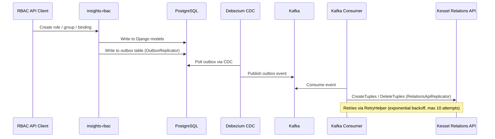
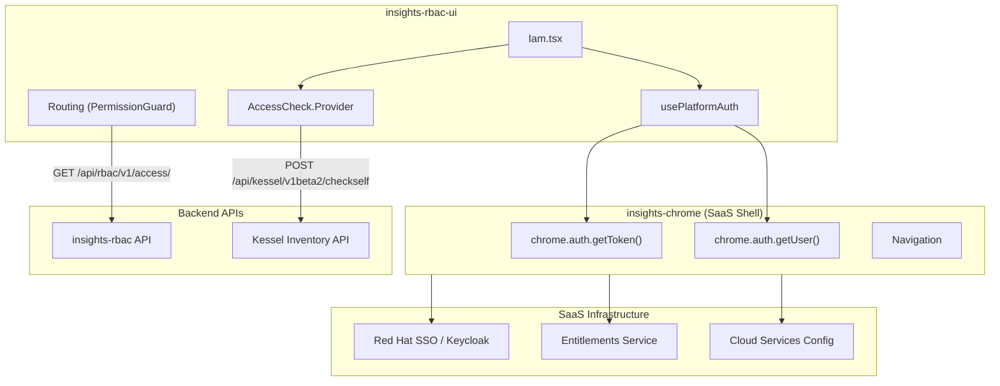
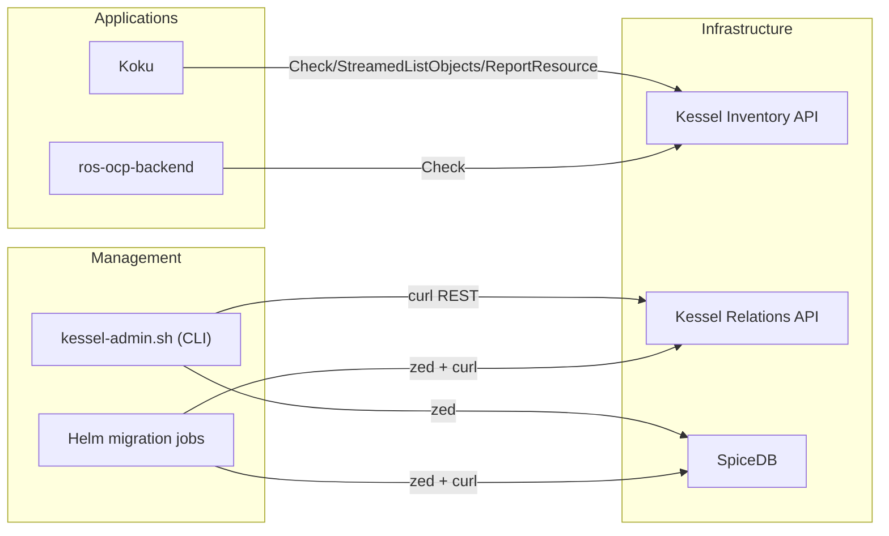
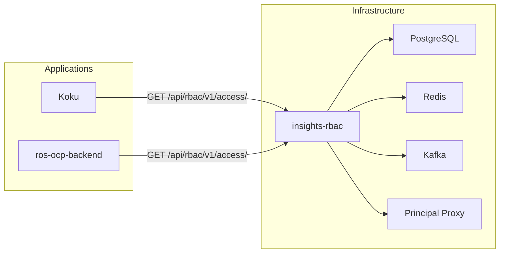
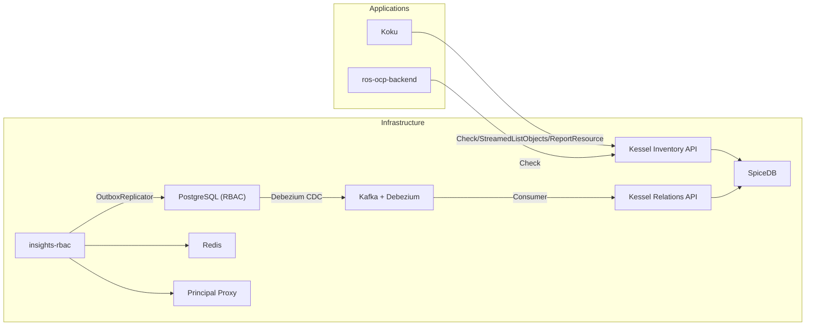
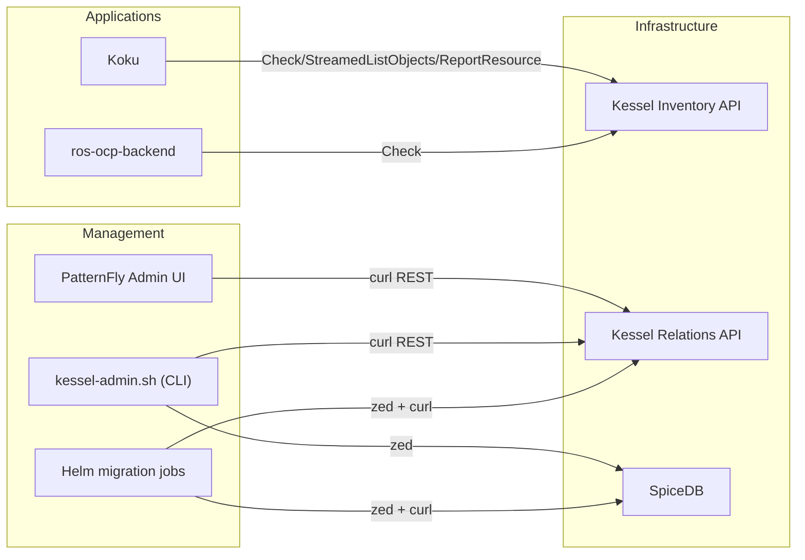

# insights-rbac + Kessel On-Prem Feasibility Analysis

**Date**: 2026-02-13
**Status**: Triaged (v1.1) — **Resolved**: The conclusion that insights-rbac is not viable as-is led to the design of a standalone ReBAC Bridge service. See [ReBAC Bridge Design](./rebac-bridge-design.md) for the adopted approach.
**Context**: Evaluate whether insights-rbac can serve as the management plane for Kessel-based authorization in Koku on-prem deployments, and whether insights-rbac-ui is viable as a management UI.

---

## 1. Executive Summary

This analysis investigates the feasibility of the user's proposed hybrid architecture:

- **insights-rbac** as the management plane (roles, groups, bindings, workspaces)
- **insights-rbac-ui** as the management UI
- **Kessel** as the authorization engine (Check, StreamedListObjects, ReportResource)
- **Koku** as a pure Kessel consumer

**Key findings**:

1. **insights-rbac Kessel dual-write is asynchronous and requires Kafka/Debezium** -- the dual-write path always goes through PostgreSQL outbox -> Debezium -> Kafka -> consumer -> Relations API. There is no synchronous direct-write option without code changes.
2. **insights-rbac-ui is NOT viable on-prem without major adaptation** (weeks-months) -- it is tightly coupled to the SaaS console shell (insights-chrome), which itself requires Keycloak, entitlements, and config services.
3. **insights-rbac CAN work on-prem as a management API** (no UI) with Kessel dual-write, but requires deploying Kafka + Debezium + Kessel Relations API, adding significant infrastructure overhead.
4. **A minimal PatternFly admin UI** could be built in 3-6 weeks as a lighter alternative.
5. **The current plan (kessel-admin.sh + Helm jobs) remains the lowest-risk path** for on-prem management, with the option to add a UI later. (Note: `kessel-admin.sh` is a deployment-level CLI tool shipped with the Helm chart, not part of the Koku application.)

---

## 2. insights-rbac Kessel Integration Assessment

### 2.1 Dual-Write Architecture (Corrected Understanding)

The dual-write in insights-rbac does NOT offer a synchronous direct-to-Relations-API path. The actual architecture is:



**Source code evidence**:

| Component | File | Replicator Used |
|-----------|------|-----------------|
| Dual-write handlers | `rbac/management/group/relation_api_dual_write_subject_handler.py` | `OutboxReplicator` (default) |
| Kafka consumer | `rbac/core/kafka_consumer.py` | `RelationsApiReplicator` |

The dual-write handler constructor:
```python
# relation_api_dual_write_subject_handler.py (lines 114-144)
self._replicator = replicator if replicator else OutboxReplicator()
```

The Kafka consumer:
```python
# kafka_consumer.py (lines 40-48)
from management.relation_replicator.relations_api_replicator import RelationsApiReplicator
relations_api_replication = RelationsApiReplicator()
```

**Critical correction**: The first investigation incorrectly stated `REPLICATION_TO_RELATION_ENABLED=True` enables direct gRPC writes. In reality, the flag gates whether outbox events are written at all. The actual flow is always:
1. RBAC API operation triggers dual-write handler
2. Handler writes to PostgreSQL outbox table via `OutboxReplicator`
3. Debezium captures outbox changes via CDC
4. Debezium publishes to Kafka
5. Kafka consumer reads events
6. Consumer calls `RelationsApiReplicator` to write to Relations API via gRPC

### 2.2 Configuration Requirements

| Setting | Default | Required Value | Purpose |
|---------|---------|---------------|---------|
| `REPLICATION_TO_RELATION_ENABLED` | `False` | `True` | Enables dual-write to outbox |
| `RELATION_API_SERVER` | - | Kessel Relations API address | gRPC endpoint for consumer |
| `RELATION_API_CLIENT_ID` | - | OAuth2 client ID | Consumer auth |
| `RELATION_API_CLIENT_SECRET` | - | OAuth2 client secret | Consumer auth |
| `RBAC_KAFKA_CONSUMER_REPLICAS` | `0` | `1+` | Enable Kafka consumer pod |

**Infrastructure dependencies for insights-rbac (ClowdApp baseline)**:
- PostgreSQL 16 (database)
- Redis (`inMemoryDb: true` in ClowdApp -- used for access caching via `ACCESS_CACHE_ENABLED`)
- Kafka (ClowdApp declares 4 topics: notifications, external sync, chrome, consumer replication)
- Principal Proxy / BOP (required dependency for user identity resolution)

**Minimal on-prem footprint (without dual-write, without SaaS features)**:
- PostgreSQL 16 (can share with Koku)
- Redis (can share with Koku; or disable with `ACCESS_CACHE_ENABLED=False`)
- Kafka: **NOT required** -- set `KAFKA_ENABLED=False`, `NOTIFICATIONS_ENABLED=False`
- Principal Proxy: **NOT required** -- set `BYPASS_BOP_VERIFICATION=True` (skips user verification; `/principals/` returns DB-only data). Alternatively, deploy [MBOP](https://github.com/RedHatInsights/mbop) pointed at Keycloak for full principal resolution.

**Additional dependencies when dual-write is ENABLED**:
- Debezium Connect (CDC from PostgreSQL outbox table to Kafka)
- Kafka (required for outbox event transport)
- Kessel Relations API (gRPC target for Kafka consumer)
- SpiceDB (behind Relations API)

**Note**: The ClowdApp declares Kafka and Principal Proxy as baseline dependencies, but both can be disabled for on-prem via environment variables. The minimal on-prem deployment only strictly requires PostgreSQL.

### 2.3 Dual-Write Coverage Assessment

| RBAC Operation | Dual-Write Handler | Kessel Tuples Created |
|---------------|-------------------|----------------------|
| Create group | `RelationApiDualWriteGroupHandler` | `rbac/group:{id}#t_owner@rbac/tenant:{org}` |
| Add member to group | `RelationApiDualWriteSubjectHandler` | `rbac/group:{id}#member@rbac/principal:{user}` |
| Remove member from group | `RelationApiDualWriteSubjectHandler` | Delete member tuple |
| Create role binding | `RelationApiDualWriteSubjectHandler` / `RelationApiDualWriteGroupHandler` | `rbac/role_binding:{id}#...` tuples |
| Delete role binding | `RelationApiDualWriteSubjectHandler` / `RelationApiDualWriteGroupHandler` | Delete binding tuples |
| Create custom role | `RelationApiDualWriteHandler` | Role + permission tuples (requires `select_for_update` lock) |
| Update custom role | `RelationApiDualWriteHandler` | Updated permission tuples (requires `select_for_update` lock) |
| Delete custom role | `RelationApiDualWriteHandler` | Delete role tuples |
| Seed system role | `SeedingRelationApiDualWriteHandler` | System role tuples (during `seeds` command) |
| Update system role | `SeedingRelationApiDualWriteHandler` | Updated system role tuples |
| Delete system role | `SeedingRelationApiDualWriteHandler` | Delete system role tuples |

**Source**: `rbac/management/role/relation_api_dual_write_handler.py` -- contains both `RelationApiDualWriteHandler` (custom roles, API-driven) and `SeedingRelationApiDualWriteHandler` (system roles, seeds command). Both default to `OutboxReplicator`.

**Remaining gaps**:
- Workspace hierarchy tuples require explicit seeding (not auto-created by dual-write)
- All handlers use `OutboxReplicator` by default -- no synchronous path to Relations API

### 2.4 Error Handling and Consistency

| Scenario | Behavior |
|----------|----------|
| Kafka consumer fails | Does not commit offset; retries on restart |
| Relations API unreachable | `RetryHelper` retries (exponential backoff, max 10 attempts, max 30s backoff) |
| Max retries exceeded | Consumer stops; offset not committed; manual intervention needed |
| Debezium CDC lag | Events delayed; eventual consistency only |
| Outbox write fails | PostgreSQL transaction rolls back; RBAC write fails too (consistent) |

**Consistency model**: **Eventually consistent**. There is a window between RBAC write and tuple availability in SpiceDB. The window size depends on Debezium poll interval + Kafka consumer lag + Relations API latency.

### 2.5 Production Readiness

| Indicator | Status |
|-----------|--------|
| Default `REPLICATION_TO_RELATION_ENABLED` in ClowdApp | `False` |
| Jobs with hardcoded `True` | `user-id-populator`, `workspace-populator` only |
| Stage/prod separation | Single template; values from app-interface |
| Known SaaS production dual-write status | Unclear; likely staging only |
| Test coverage for dual-write | Present but not comprehensive |

**Assessment**: The dual-write mechanism exists and functions, but it is gated behind a feature flag that defaults to `False` and appears to be in a staged rollout, not yet fully production-enabled in SaaS.

---

## 3. insights-rbac On-Prem Deployment Assessment

### 3.1 Core RBAC Functionality (Without Kessel)

insights-rbac CAN function as a standalone RBAC API on-prem without Kessel:

| Capability | On-Prem Viable | Notes |
|-----------|---------------|-------|
| Role management (CRUD) | Yes | Django models in PostgreSQL |
| Group management (CRUD) | Yes | Django models in PostgreSQL |
| Principal management | Yes | From `x-rh-identity` header |
| Policy/binding management | Yes | Django models in PostgreSQL |
| Access resolution (`/api/rbac/v1/access/`) | Yes | Computes from groups -> policies -> roles -> access |
| Multi-tenancy | Yes | django-tenants with schema per tenant |
| Role seeding | Yes | `seeds` command reads from `definitions/*.json` |
| Permission seeding | Yes | `seeds` command reads from `permissions/*.json` |

### 3.2 Tenant Resolution

insights-rbac uses `django-tenants`. Tenant is derived from `x-rh-identity` header:

```
x-rh-identity: base64({"identity": {"account_number": "12345", "org_id": "org-1", ...}})
```

On-prem: Envoy Lua script already creates this header from JWT. No changes needed.

### 3.3 Role Seeding for Cost Management

Roles and permissions come from JSON files:
- **Roles**: `management/role/definitions/cost-management.json` (or mounted via ConfigMap from rbac-config)
- **Permissions**: `management/role/permissions/cost-management.json`

5 pre-defined roles are available:

| Role | Permissions |
|------|-------------|
| Cost Administrator | `cost-management:*:*` |
| Cost Price List Administrator | `cost_model:read`, `cost_model:write`, `settings:*` |
| Cost Price List Viewer | `cost_model:read`, `settings:read` |
| Cost Cloud Viewer | All cloud providers |
| Cost OpenShift Viewer | `openshift.cluster:*` |

These are Koku feature-specific, not SaaS-specific. See [rbac-config-reuse-for-onprem.md](rbac-config-reuse-for-onprem.md) for full analysis.

### 3.4 Koku Compatibility

Koku's `RbacService` (`koku/koku/rbac.py`) calls:
```
GET /api/rbac/v1/access/?application=cost-management&limit=100
```

Response format:
```json
{
  "data": [
    {
      "permission": "cost-management:openshift.cluster:read",
      "resourceDefinitions": [
        {
          "attributeFilter": {
            "key": "cost-management.openshift.cluster",
            "operation": "equal",
            "value": "cluster-uuid"
          }
        }
      ]
    }
  ]
}
```

**Compatibility**: insights-rbac returns exactly this format. Koku's `_process_acls()` consumes it without changes.

**Path adjustment**: Koku uses `RBAC_SERVICE_PATH` (default `/r/insights/platform/rbac/v1/access/`). On-prem set: `RBAC_SERVICE_PATH=/api/rbac/v1/access/`.

---

## 4. insights-rbac-ui On-Prem Assessment

### 4.1 Architecture Dependencies



### 4.2 Critical Coupling Points

| Dependency | What It Provides | On-Prem Impact |
|-----------|-----------------|----------------|
| `useChrome()` | `auth.getToken()`, `auth.getUser()` | Blocking: no auth without Chrome |
| insights-chrome | Header, navigation, CSS, JS API | Requires full platform stack |
| `@redhat-cloud-services/frontend-components-config` | Build/dev config | Has `standalone: true` mode (dev only) |
| `AccessCheck.Provider` | Kessel CheckSelf calls | Always mounted, no feature flag |
| Unleash feature flags | Workspace features | `platform.rbac.workspaces`, etc. |

### 4.3 Kessel in the UI

The UI uses `@project-kessel/react-kessel-access-check` for workspace-level access checks:

| Endpoint | API | Purpose |
|----------|-----|---------|
| `POST /api/kessel/v1beta2/checkself` | Kessel Inventory API | Self-access check (implicit subject from auth context) |
| `POST /api/kessel/v1beta2/checkselfbulk` | Kessel Inventory API | Bulk self-access check |
| `GET /api/rbac/v2/workspaces/?type={type}` | insights-rbac v2 API | Fetch workspace IDs |

**CheckSelf vs Check**:
- `CheckSelf`: Subject is implicit (authenticated caller). Used by UI.
- `Check`: Subject is explicit in request. Used by backend services (Koku, ros-ocp-backend).
- `CheckSelf` is **exclusively** a Kessel Inventory API endpoint -- NOT available in Relations API.

**Impact**: The UI requires Kessel Inventory API to be deployed and accessible at `/api/kessel/v1beta2/`.

### 4.4 Can the UI Work Without Kessel?

- **Core RBAC operations (roles, groups, principals, permissions)**: Yes -- these use `useAccessPermissions` which calls the RBAC API.
- **Workspace features**: No -- `useSelfAccessCheck` calls Kessel. Workspace-related views will fail.
- **Route protection (`PermissionGuard`)**: Uses RBAC API, not Kessel. Basic navigation works.

Conclusion: The UI would partially function without Kessel, but workspace management (a key feature for Kessel integration) would be broken.

### 4.5 On-Prem Viability Verdict

**NOT viable without significant adaptation (estimated 6-12 weeks)**:

| Adaptation Required | Effort |
|--------------------|--------|
| Replace `useChrome()` with custom auth provider | 2-3 weeks |
| Deploy insights-chrome or build adapter | 3-4 weeks |
| Configure Keycloak + entitlements + config services | 1-2 weeks |
| Make `AccessCheck.Provider` conditional | 1 week |
| Testing and integration | 2-3 weeks |

---

## 5. Alternative: Minimal PatternFly Admin UI

Two backend architectures are possible for a custom admin UI. They are distinct and have different trade-offs.

### 5.1 Architecture A: UI against insights-rbac API

The UI calls insights-rbac's REST API for high-level RBAC operations. Requires deploying insights-rbac as the backend.

| Feature | API Endpoints | Complexity |
|---------|--------------|-----------|
| Groups list/create/update/delete | `GET/POST /groups/`, `GET/PUT/DELETE /groups/{uuid}/` | Medium |
| Group member management | `GET/POST/DELETE /groups/{uuid}/principals/` | Low |
| Group role assignment | `GET/POST/DELETE /groups/{uuid}/roles/` | Low |
| Roles list/create/update/delete | `GET/POST /roles/`, `GET/PUT/PATCH/DELETE /roles/{uuid}/` | Medium |
| Permission browser | `GET /permissions/`, `GET /permissions/options/` | Low |
| Principal browser | `GET /principals/` | Low |
| Access viewer | `GET /access/` | Low |

Total: ~15-20 API endpoints to integrate.

**Pros**: High-level API, built-in validation, multi-tenancy, role seeding.
**Cons**: Requires insights-rbac deployment (PostgreSQL + Redis + Kafka + Principal Proxy).

### 5.2 Architecture B: UI against Relations API REST (no insights-rbac)

The UI calls Kessel Relations API REST endpoints directly, translating high-level operations into tuple CRUD. No insights-rbac needed.

| Feature | API Endpoints | Complexity |
|---------|--------------|-----------|
| Groups | `POST/GET/DELETE /v1beta1/tuples` with group filters | Medium-High |
| Group members | `POST/DELETE /v1beta1/tuples` with member relation | Medium |
| Role bindings | `POST/GET/DELETE /v1beta1/tuples` with binding filters | High |
| Roles | `POST/GET/DELETE /v1beta1/tuples` with role filters | Medium |
| Principals | Read from Keycloak API / LDAP directly | Medium |

Total: 3 REST endpoints (CreateTuples, ReadTuples, DeleteTuples) but the UI must encode/decode tuple semantics.

**Pros**: Zero insights-rbac dependency, synchronous writes, same API as kessel-admin.sh.
**Cons**: UI must understand tuple schema, no built-in validation, no access resolution API, higher frontend complexity.

### 5.3 Effort Estimate

| Scope | Architecture A (RBAC API) | Architecture B (Relations API) |
|-------|--------------------------|-------------------------------|
| Minimal CRUD (groups + roles + assignments) | 3-4 weeks | 4-5 weeks |
| With permission picker and validation | 5-6 weeks | 6-8 weeks |
| Full parity with insights-rbac-ui | 8-12 weeks | Not applicable |

Architecture B requires more frontend logic to translate high-level RBAC concepts into tuples, but eliminates the insights-rbac deployment entirely.

### 5.4 Tech Stack (Both Architectures)

- `@patternfly/react-core` + `@patternfly/react-table` (Red Hat design system)
- Keycloak JS for auth (direct, no insights-chrome needed)
- `x-rh-identity` header construction from Keycloak JWT

---

## 6. Deployment Options Comparison

### Option A: Current Plan (Kessel-only + kessel-admin.sh)



| Criterion | Assessment |
|-----------|-----------|
| Infrastructure | SpiceDB + Kessel Inventory API + Relations API |
| Management | CLI (kessel-admin.sh) + Helm jobs |
| UI | None (CLI only) |
| Koku code changes | Full Kessel migration (existing plan) |
| Kafka dependency | Only for Kessel Inventory API `write_visibility=IMMEDIATE` (internal Kessel Kafka, not customer-managed) |
| ACM readiness | Yes -- Koku is a pure Kessel consumer |
| Risk | Low (well-understood, no external dependencies beyond Kessel) |
| Effort | As specified in existing plan |

### Option B: insights-rbac as RBAC API (No Kessel in Koku)



| Criterion | Assessment |
|-----------|-----------|
| Infrastructure | insights-rbac + PostgreSQL + Redis + Kafka + Principal Proxy |
| Management | insights-rbac seeds + API (REST) |
| UI | None initially; PatternFly admin UI (3-4 weeks, Architecture A) |
| Koku code changes | Zero (uses existing `AUTHORIZATION_BACKEND=rbac` path) |
| Kafka dependency | Yes (insights-rbac requires Kafka for notifications/sync even without dual-write) |
| ACM readiness | No -- Koku does not speak Kessel; requires migration later |
| Risk | Medium (insights-rbac on-prem deployment is uncharted; requires Kafka + Redis + Principal Proxy) |
| Effort | Medium (deploy insights-rbac stack + configure + adapt for on-prem) |

### Option C: Hybrid (insights-rbac Management + Kessel Authorization)



| Criterion | Assessment |
|-----------|-----------|
| Infrastructure | insights-rbac + PostgreSQL + Redis + Kafka + Debezium + Principal Proxy + Kessel (full) + SpiceDB |
| Management | insights-rbac REST API |
| UI | PatternFly admin UI (3-4 weeks, Architecture A) against insights-rbac API |
| Koku code changes | Full Kessel migration (existing plan) |
| Kafka dependency | Customer-managed Kafka cluster + Debezium (insights-rbac baseline + dual-write consumer) |
| ACM readiness | Yes -- Koku speaks Kessel |
| Risk | High -- async dual-write consistency, infrastructure complexity, many moving parts |
| Effort | Existing plan + insights-rbac deployment + Debezium setup + UI |

### Option D: Kessel-only + Minimal PatternFly Admin UI



| Criterion | Assessment |
|-----------|-----------|
| Infrastructure | SpiceDB + Kessel (same as Option A) |
| Management | CLI + PatternFly admin UI (against Relations API REST) |
| UI | Minimal PatternFly CRUD (3-4 weeks) |
| Koku code changes | Full Kessel migration (existing plan) |
| Kafka dependency | Only internal Kessel Kafka |
| ACM readiness | Yes -- Koku is a pure Kessel consumer |
| Risk | Low-Medium (admin UI is thin CRUD; Relations API REST is proven) |
| Effort | Existing plan + 3-4 weeks UI development |

---

## 7. Comparison Matrix

| Criterion | A: Kessel + CLI | B: RBAC-only | C: Hybrid | D: Kessel + UI |
|-----------|----------------|-------------|-----------|---------------|
| **Infrastructure footprint** | Small (3 services) | Small-Medium (3 pods + shared DB/Redis) | Large (8+ services) | Small (3 services) |
| **Kafka/Debezium required** | No (internal only) | No (`KAFKA_ENABLED=False`) | Yes (baseline + Debezium CDC) | No (internal only) |
| **Redis required** | No | Optional (can share existing or disable) | Yes (insights-rbac cache) | No |
| **Koku code changes** | Full migration | Zero | Full migration | Full migration |
| **ACM ready** | Yes | No | Yes | Yes |
| **Management UI** | None (CLI) | None (add later) | Add later | 4-5 weeks (Architecture B) |
| **SaaS parity (Koku code)** | Yes | No | Yes | Yes |
| **Consistency model** | Synchronous (IMMEDIATE) | Synchronous (SQL) | Eventually consistent | Synchronous (IMMEDIATE) |
| **Operational complexity** | Low | Low-Medium | High | Low-Medium |
| **Risk** | Low | Low-Medium | High | Low-Medium |
| **Time to delivery** | Existing plan | 2-3 weeks (Helm + config + testing) | Existing plan + months | Existing plan + 4-5 weeks |

**Note on Option B effort revision**: Kafka, Redis, and Principal Proxy can all be disabled via environment variables (`KAFKA_ENABLED=False`, `ACCESS_CACHE_ENABLED=False` or shared Redis, `BYPASS_BOP_VERIFICATION=True`). If the chart already provides PostgreSQL, Kafka, and Redis, the incremental infrastructure is just the insights-rbac pods (API + Celery worker + Celery beat). See T7/T8 and Appendix D.

---

## 8. Risks and Concerns

### R1: insights-rbac dual-write consistency gap

**Risk**: The dual-write is asynchronous (outbox -> Debezium -> Kafka -> consumer). There is a consistency window where RBAC shows a role assignment but Kessel has not yet processed it.

**Impact**: A user assigned a role via insights-rbac may not immediately have access via Kessel-backed Koku authorization.

**Mitigation**: None available without code changes to insights-rbac. The outbox pattern is designed for eventual consistency.

### R2: insights-rbac dual-write coverage gaps

**Risk**: Not all RBAC operations have complete dual-write handlers. Custom role permission changes have partial coverage.

**Impact**: Some management operations may not replicate to Kessel, causing authorization drift.

**Mitigation**: Periodic reconciliation job (not built), or restrict management to operations with full dual-write coverage.

### R3: Kafka/Debezium infrastructure burden

**Risk**: Option C requires a customer-managed Kafka cluster + Debezium Connect instance.

**Impact**: Significant operational overhead for on-prem customers. Kafka is a complex distributed system.

**Mitigation**: Use Option A or D instead.

### R4: insights-rbac-ui is not on-prem viable

**Risk**: The UI cannot be deployed on-prem without major adaptation (insights-chrome dependency).

**Impact**: No management UI from insights-rbac-ui.

**Mitigation**: Build minimal PatternFly admin UI (Option D) or use CLI (Option A).

### R5: insights-rbac production dual-write status unknown

**Risk**: `REPLICATION_TO_RELATION_ENABLED` defaults to `False` in the ClowdApp template. Only `user-id-populator` and `workspace-populator` jobs hardcode `True`. It is unclear if the dual-write is enabled in SaaS production.

**Impact**: If not production-proven, we inherit risk of undiscovered bugs.

**Mitigation**: Verify with the RBAC team, or avoid dependency on dual-write (Options A/D).

### R6: insights-rbac baseline infrastructure (revised -- lighter than initially assessed)

**Updated finding**: While the ClowdApp declares Kafka, Redis, and Principal Proxy as baseline dependencies, all three can be disabled for on-prem via environment variables:
- **Kafka**: `KAFKA_ENABLED=False`, `NOTIFICATIONS_ENABLED=False` -- disables all Kafka producers. No Kafka needed.
- **Redis**: `ACCESS_CACHE_ENABLED=False` -- disables Redis cache. Performance impact on access resolution, but functional.
- **Principal Proxy**: `BYPASS_BOP_VERIFICATION=True` -- skips BOP/MBOP calls for principal verification. `/principals/` returns DB-only data.

**Revised impact**: Deploying insights-rbac on-prem requires only PostgreSQL at minimum. If the chart already provides PostgreSQL, Kafka, and Redis, the incremental infrastructure cost is near zero.

**Remaining risk**: Running insights-rbac with Kafka/Redis/BOP disabled is not the tested production path. Subtle issues may surface.

### R7: insights-rbac without Kessel still viable for bootstrapping

**Observation**: Koku already has `AUTHORIZATION_BACKEND=rbac` working. Deploying insights-rbac as a pure RBAC API (no dual-write) gives us management without any Kessel dependency. With Kafka and Principal Proxy disabled, the deployment footprint is just the insights-rbac pods sharing existing PostgreSQL (and optionally Redis).

### R8: Principal Proxy dependency for insights-rbac (resolved)

**Risk**: insights-rbac uses a "Principal Proxy" (BOP/MBOP) service for user identity resolution.

**Resolution**: Two viable on-prem options:
1. **`BYPASS_BOP_VERIFICATION=True`** -- skips all BOP calls. Principals are managed from DB only. Sufficient for RBAC CRUD operations. Used in insights-rbac's own `docker-compose` dev setup.
2. **Deploy [MBOP](https://github.com/RedHatInsights/mbop) pointed at Keycloak** -- MBOP is a lightweight Go service that fronts Keycloak with BOP-compatible endpoints. This gives full principal resolution against Keycloak users. MBOP is already used in ephemeral/staging environments.

**Gap**: MBOP does not implement `/v2/accountMapping/orgIds` (tenant population). For single-tenant on-prem this is not needed.

---

## Appendix D: Principal Proxy Deep Dive (Investigation 2026-02-26)

### D.1 What is Principal Proxy?

The "Principal Proxy" in insights-rbac is the **HTTP client interface** to the **BOP (Backoffice Proxy)** service—a Red Hat internal user/identity service. The code refers to it as "BOP" throughout (`rbac/management/principal/proxy.py`). In ephemeral/staging, **MBOP (Mock BOP)** is used as a substitute; MBOP connects to Keycloak to resolve users.

**Source**: `rbac/management/principal/proxy.py` — class `PrincipalProxy`, Prometheus metrics `rbac_proxy_request_processing_seconds`, `bop_request_status_total`.

### D.2 What Service Does It Connect To?

| Environment | Service | Purpose |
|-------------|---------|---------|
| **Production** | BOP (backoffice-proxy) | Red Hat internal identity/account service |
| **Ephemeral/Stage** | MBOP (Mock BOP) | `https://github.com/RedHatInsights/mbop` — proxies to Keycloak |

**ClowdApp default** (`deploy/rbac-clowdapp.yml` rbac-secret, base64-decoded):
- `principal-proxy-host`: **mbop**
- `principal-proxy-port`: **8090**
- `principal-proxy-protocol`: **http**
- `principal-proxy-env`: **stage**

### D.3 What Does It Do?

1. **User identity resolution**: Fetches user details (username, email, first_name, last_name, is_active, is_org_admin, user_id, org_id) from BOP/MBOP.
2. **Principal verification**: Validates that a username exists in the account/org before creating/using a Principal in RBAC.
3. **Account-to-org mapping**: Fetches `account_id` → `org_id` mapping for tenant population (internal endpoint).
4. **user_id lookup**: Resolves `user_id` for Kessel principal IDs when not in DB (used by `get_user_id_from_request`, `get_kessel_principal_id`).

**API paths used** (`proxy.py`):
- `GET /v3/accounts/{org_id}/users` — list users for org
- `POST /v3/accounts/{org_id}/usersBy` — filter users by criteria
- `POST /v1/users` — filter specific usernames (used by `request_filtered_principals`)
- `POST /v2/accountMapping/orgIds` — account_id → org_id mapping

**MBOP** uses Keycloak Admin API; BOP uses Red Hat IT infrastructure. MBOP does **not** implement `/v2/accountMapping/orgIds` (used only by internal tenant population).

### D.4 Which Endpoints Depend on Principal Proxy?

| Endpoint/Component | Principal Proxy Usage | Bypass with `BYPASS_BOP_VERIFICATION=True`? |
|-------------------|----------------------|-------------------------------------------|
| `GET /api/rbac/v1/principals/` | `request_principals`, `request_filtered_principals` | Yes — returns DB principals with fake attributes |
| `GET /groups/{uuid}/principals/` | `request_filtered_principals` (verify users) | Partially — verification skipped |
| `POST /groups/{uuid}/principals/` | `verify_principal_with_proxy` in `management/utils.py` | Yes |
| `GET /access/?username=X` | `_check_user_username_is_org_admin` → BOP | Yes — uses `request.user.admin` |
| `GET /roles/?username=X` | Same org_admin check | Yes |
| `GET /groups/?username=X` | Same org_admin check | Yes |
| `POST /_private/api/utils/populate_tenant_org_id/` | `fetch_account_org_mapping` | No — would fail |
| Tenant bootstrap (middleware) | `get_user_id` → `request_filtered_principals` | No — needs user_id for Kessel |
| Principal cleanup job (UMB) | `request_filtered_principals` | No — would fail |
| Role binding access (Kessel) | `get_kessel_principal_id` → PrincipalProxy | No — needs user_id |
| Workspace access | `get_user_id_from_request` → PrincipalProxy | No — needs user_id |

### D.5 Can insights-rbac Function Without Principal Proxy?

**Yes, with `BYPASS_BOP_VERIFICATION=True`**, but with limitations:

| Scenario | Works? | Notes |
|----------|--------|-------|
| Core RBAC (roles, groups, access) | Yes | Uses `x-rh-identity`; BOP bypass returns DB data |
| `/principals/` with `username_only=true` | Yes | Bypass returns DB principals only |
| `/principals/` full user list | Degraded | Returns DB principals with fake first_name/last_name/email |
| Add user to group (new user) | Yes | Bypass skips verification; user created in DB |
| Kessel integration (user_id) | No | `get_user_id_from_request` needs BOP for users not in DB |
| Tenant org_id population | No | `fetch_account_org_mapping` has no bypass |
| Principal cleanup job | No | No bypass in cleaner |
| Workspace access (Kessel) | No | Needs user_id from BOP |

**Docker-compose** sets `BYPASS_BOP_VERIFICATION=True` by default for local dev.

### D.6 Could Keycloak Admin API Serve as a Substitute?

**Yes.** MBOP already does this: it fronts Keycloak and exposes BOP-compatible paths. For on-prem:

1. **Deploy MBOP** with Keycloak (MBOP uses `KEYCLOAK_SERVER`, `KEYCLOAK_USERNAME`, `KEYCLOAK_PASSWORD`).
2. **Configure insights-rbac** to point to MBOP:
   - `PRINCIPAL_PROXY_SERVICE_HOST` = MBOP host
   - `PRINCIPAL_PROXY_SERVICE_PORT` = 8090
   - `PRINCIPAL_PROXY_SERVICE_PATH` = `` (or `/r/insights-services` if MBOP is behind a gateway)
   - `PRINCIPAL_PROXY_USER_ENV` = e.g. `stage`
   - `PRINCIPAL_PROXY_CLIENT_ID`, `PRINCIPAL_PROXY_API_TOKEN` = MBOP auth (MBOP may not enforce these in ephemeral)

**Gap**: MBOP does not implement `/v2/accountMapping/orgIds`. For on-prem with single-tenant or pre-created tenants, this internal endpoint may be unnecessary. The `populate_tenant_org_id` job is for migrating legacy tenants.

**Alternative**: Implement a thin adapter that translates Keycloak Admin API (`GET /admin/realms/{realm}/users`) into BOP response format. Effort: ~1–2 weeks.

### D.7 Environment Variables (from `deploy/rbac-clowdapp.yml`)

| Variable | Secret/Param | Required | Purpose |
|----------|--------------|----------|---------|
| `PRINCIPAL_PROXY_SERVICE_PROTOCOL` | rbac-secret: principal-proxy-protocol | Yes (optional: false in ClowdApp) | `http` or `https` |
| `PRINCIPAL_PROXY_SERVICE_HOST` | rbac-secret: principal-proxy-host | Yes | BOP/MBOP hostname |
| `PRINCIPAL_PROXY_SERVICE_PORT` | rbac-secret: principal-proxy-port | Yes | Port (e.g. 8090 for MBOP) |
| `PRINCIPAL_PROXY_SERVICE_PATH` | value: `''` | No | Path prefix (e.g. `/r/insights-services`) |
| `PRINCIPAL_PROXY_USER_ENV` | rbac-secret: principal-proxy-env | Yes | Env header (e.g. `stage`) |
| `PRINCIPAL_PROXY_CLIENT_ID` | insights-rbac: client-id | Yes | Client ID for BOP auth |
| `PRINCIPAL_PROXY_API_TOKEN` | insights-rbac: token | Yes | API token for BOP auth |
| `PRINCIPAL_PROXY_SERVICE_SSL_VERIFY` | rbac-secret (optional) | No | SSL verification |
| `PRINCIPAL_PROXY_SERVICE_SOURCE_CERT` | rbac-secret (optional) | No | Client cert path |
| `BYPASS_BOP_VERIFICATION` | Param: BYPASS_BOP_VERIFICATION | No | When `True`, skip all BOP calls |

### D.8 On-Prem / Standalone Mode

**No explicit "on-prem" or "standalone" mode** exists in insights-rbac. The closest is:

- `BYPASS_BOP_VERIFICATION=True` — bypasses BOP for principal operations (used in docker-compose).
- `DEVELOPMENT=True` — enables dev middleware (mock identity header).

**Recommendation for on-prem**: Use **MBOP + Keycloak** as the Principal Proxy substitute. This is the same pattern used in ephemeral environments. Ensure Keycloak users have attributes: `is_active`, `is_org_admin`, `org_id`, `account_id` (or equivalent).

---

## 9. Triage: Re-Assessment with Fresh Eyes

### T1: Is the Hybrid (Option C) worth the infrastructure cost?

**Assessment**: No. The infrastructure burden (customer Kafka + Debezium) far outweighs the benefit (management REST API). The same management capability is achievable via Relations API REST (`kessel-admin.sh`) or a thin admin UI, without Kafka or Debezium.

### T2: Can insights-rbac dual-write be made synchronous?

**Assessment**: Theoretically yes -- the dual-write handlers accept a `replicator` parameter. Injecting `RelationsApiReplicator()` directly (instead of default `OutboxReplicator()`) would bypass Kafka. However:
- This requires code changes to insights-rbac (fork or upstream PR)
- Error semantics change (failure on Relations API write affects RBAC write)
- Transaction rollback behavior is unclear
- Not tested or designed for this path

**Verdict**: Not recommended without upstream collaboration.

### T3: Does insights-rbac add value over kessel-admin.sh?

**Assessment**: For on-prem specifically, insights-rbac adds:
- Multi-tenancy (django-tenants)
- Role seeding from rbac-config JSON
- Access resolution API (`/api/rbac/v1/access/`)
- Group/role/policy data model with validation

However, Koku's Kessel integration (the current plan) makes Koku a pure Kessel consumer that does NOT call `/api/rbac/v1/access/`. The access resolution happens in Koku's `KesselAccessProvider` via Kessel Check/StreamedListObjects. So insights-rbac's access resolution API is NOT needed when Koku uses Kessel.

**Verdict**: insights-rbac adds complexity without proportional value when Koku speaks directly to Kessel.

### T4: What about the SaaS path? Does this diverge?

**Assessment**: In SaaS:
1. insights-rbac manages roles/groups/bindings
2. insights-rbac dual-writes to Kessel/SpiceDB (via outbox -> Kafka -> consumer)
3. Koku uses Kessel Inventory API for authorization (Check, StreamedListObjects)
4. Koku uses Kessel Inventory API for resource reporting (ReportResource)

The current plan (Option A) makes Koku a pure Kessel consumer, which is the SAME as the SaaS target state from Koku's perspective. The difference is only in the management plane:
- SaaS: insights-rbac manages, dual-writes to Kessel
- On-prem (Option A): kessel-admin.sh manages, writes directly to Relations API
- On-prem future: ACM replaces kessel-admin.sh

**Koku's code is identical in all cases.** The management plane is externalized, so switching from kessel-admin.sh to insights-rbac or ACM requires zero Koku code changes.

### T5: CheckSelf endpoint -- do we need it?

**Assessment**: `CheckSelf` (Kessel Inventory API) is used by the UI only, not by backend services. Backend services (Koku, ros-ocp-backend) use `Check` with explicit subject. If we build a minimal admin UI, it can use `Check` with the user's identity extracted from JWT -- it does not strictly need `CheckSelf`.

However, if we want SaaS UI parity in the future, the UI would use `CheckSelf`. This requires the Kessel Inventory API (which we already deploy).

**Verdict**: `CheckSelf` is available but not critical for the admin UI. Backend authorization uses `Check` exclusively.

### T6: Is there a gap in workspace management?

**Assessment**: The current plan uses `rbac/workspace` for OCP resources (via `ReportResource`) and `rbac/tenant` for org-level checks. Workspace management (create/list/update/delete workspaces) is handled by:
- SaaS: insights-rbac v2 API (`/api/rbac/v2/workspaces/`)
- On-prem (current plan): `kessel-admin.sh` creates workspace tuples (`rbac/workspace:org-1#t_parent@rbac/tenant:org-1`)

For the minimal on-prem case (single workspace per org), `kessel-admin.sh` is sufficient. For advanced multi-workspace scenarios, a management API would be needed -- but this is a future concern when ACM is available.

**Verdict**: No gap for the current scope. Workspace management is adequately handled by kessel-admin.sh for the single-workspace-per-org pattern.

### T7: insights-rbac infrastructure footprint (revised)

**Assessment**: The ClowdApp declares Kafka, Redis, and Principal Proxy as baseline dependencies, but all three are disableable via environment variables:

| Dependency | ClowdApp Baseline | On-Prem Minimum | Env Var |
|------------|-------------------|-----------------|---------|
| Kafka | 4 topics | Not needed | `KAFKA_ENABLED=False`, `NOTIFICATIONS_ENABLED=False` |
| Redis | `inMemoryDb: true` | Can share existing or disable | `ACCESS_CACHE_ENABLED=False` |
| Principal Proxy (BOP) | Required | Not needed | `BYPASS_BOP_VERIFICATION=True` |

**Revised impact**: If the on-prem Helm chart already provides PostgreSQL, Kafka, and Redis, the incremental infrastructure cost of adding insights-rbac is **near zero** -- just the application pods (API + Celery worker + Celery beat). Kafka and Redis can be shared with Koku's existing instances; Principal Proxy can be bypassed or replaced with MBOP + Keycloak.

**Remaining risk**: Running insights-rbac with these features disabled is not the tested production path. The `docker-compose` dev setup uses `BYPASS_BOP_VERIFICATION=True` and no Kafka, but it is not equivalent to production load or multi-tenant scenarios.

### T8: insights-rbac Kafka/Redis/BOP dependencies (resolved)

**Assessment**: All three can be disabled via existing environment variables:
- **Kafka**: `KAFKA_ENABLED=False` disables the Kafka producer entirely. No code changes needed. Notifications and external sync are disabled.
- **Redis**: `ACCESS_CACHE_ENABLED=False` disables the Redis access cache. No code changes needed. Access resolution still works (just slower, no caching).
- **Principal Proxy**: `BYPASS_BOP_VERIFICATION=True` skips all BOP/MBOP calls. Principals are managed from DB only. Alternatively, deploy [MBOP](https://github.com/RedHatInsights/mbop) + Keycloak for full principal resolution (same pattern as ephemeral environments).

**Verdict**: The adaptation is straightforward. Environment variables are sufficient; no code changes or forks needed. See Appendix D for full details.

### T9: Admin UI calling Relations API directly (Architecture B)

**Assessment**: The Kessel Relations API exposes REST endpoints via gRPC-Gateway:
- `POST /v1beta1/tuples` (CreateTuples)
- `GET /v1beta1/tuples` (ReadTuples)
- `DELETE /v1beta1/tuples` (DeleteTuples)

**Note**: The `/api/authz` prefix seen in some deployments (e.g., `kessel-admin.sh`) is a gateway/routing convention, not part of the Relations API proto definition.

A PatternFly admin UI could call these REST endpoints directly, translating high-level operations (create group, assign role, add member) into tuple operations. This eliminates the need for insights-rbac as a middleware.

**Advantages**:
- Zero Kafka/Debezium dependency
- Synchronous writes (direct to Relations API)
- Consistent with kessel-admin.sh (same API)
- No eventual consistency concerns

**Disadvantages**:
- UI must understand tuple semantics (more complex frontend logic)
- No built-in validation beyond Relations API
- Custom RBAC data model in the UI

**Verdict**: Viable for Option D. The UI would be a thin CRUD layer over Relations API REST.

---

## 10. Recommendation

### Primary: Option A (Kessel-only + kessel-admin.sh)

Proceed with the current plan. It provides:
- Lowest infrastructure footprint (3 services: SpiceDB + Kessel Inventory API + Relations API)
- Direct Kessel integration (ACM-ready)
- SaaS parity from Koku's perspective
- Synchronous authorization (write_visibility=IMMEDIATE)
- No Kafka/Redis/Debezium customer burden
- No insights-rbac deployment complexity

Management is CLI-based via `kessel-admin.sh`. This is adequate for the initial on-prem deployment where operators are expected to have CLI access.

### Follow-up: Option D (Add minimal PatternFly admin UI)

After Option A is delivered, build a minimal PatternFly admin UI (4-5 weeks, Architecture B) that:
- Calls Relations API REST directly (same as kessel-admin.sh)
- Provides group/role/binding CRUD
- Uses Keycloak JS for auth (no insights-chrome)
- Ships as a separate container in the Helm chart
- Zero insights-rbac dependency

This gives operators a UI without the complexity of insights-rbac + Kafka + Redis + Debezium + Principal Proxy.

### NOT recommended: Option B (insights-rbac as RBAC API)

While Koku's existing `AUTHORIZATION_BACKEND=rbac` path works with insights-rbac, deploying insights-rbac on-prem requires Kafka + Redis + Principal Proxy at minimum. This infrastructure overhead, combined with the uncharted territory of running insights-rbac outside the SaaS ClowdApp environment, makes this option riskier and heavier than originally assumed. It also delays Kessel integration and ACM readiness.

### NOT recommended: Option C (Hybrid with insights-rbac dual-write)

The infrastructure burden (Kafka + Debezium + Redis + Principal Proxy + insights-rbac + Kessel stack) and consistency risks (async dual-write) do not justify the benefits. The same management capability is achievable with direct Relations API REST calls (Option A/D) with a fraction of the infrastructure.

---

## 11. Open Questions

| ID | Question | Impact | Owner |
|----|----------|--------|-------|
| Q1 | Is insights-rbac dual-write enabled in SaaS production? | Affects confidence in the dual-write path | RBAC team |
| Q2 | Will ACM support direct Kessel tuple management? | Determines post-ACM management story | ACM team |
| Q3 | Can insights-rbac's dual-write be made synchronous upstream? | Would make Option C viable | RBAC team |
| Q4 | Is there an upstream plan for a standalone Kessel management UI? | Could eliminate the need for a custom admin UI | Kessel team |
| Q5 | Can insights-rbac run without Kafka and Redis? | Would reduce Option B infrastructure to just PostgreSQL | RBAC team |
| Q6 | Is there a Principal Proxy substitute for on-prem (Keycloak admin API)? | Required for insights-rbac principal discovery on-prem | RBAC team |
| Q7 | What is the Debezium poll interval in SaaS? | Determines dual-write consistency window size | RBAC team |

---

## Appendix A: Kessel API Taxonomy

| API | Transport | Endpoints | Used By |
|-----|----------|-----------|---------|
| **Kessel Inventory API v1beta2** | gRPC + REST (gRPC-Gateway) | Check, CheckSelf, CheckSelfBulk, StreamedListObjects, ReportResource, DeleteResource | Koku, ros-ocp-backend, UI (CheckSelf) |
| **Kessel Relations API v1beta1** | gRPC + REST (gRPC-Gateway) | CreateTuples, ReadTuples, DeleteTuples, Check, CheckBulk, LookupResources | kessel-admin.sh, Helm jobs, insights-rbac consumer |
| **SpiceDB Direct** | gRPC | WriteSchema, ReadSchema | zed CLI only (legitimate exception) |

## Appendix B: insights-rbac V2 Endpoints

| Endpoint | Purpose | On-Prem Relevance |
|----------|---------|-------------------|
| `GET /api/rbac/v2/workspaces/` | List workspaces | SaaS only (WorkspaceResolver) |
| `POST /api/rbac/v2/workspaces/` | Create workspace | SaaS only |
| `GET /api/rbac/v2/workspaces/{id}/` | Get workspace | SaaS only |
| `PATCH /api/rbac/v2/workspaces/{id}/` | Update workspace | SaaS only |
| `DELETE /api/rbac/v2/workspaces/{id}/` | Delete workspace | SaaS only |

On-prem uses `kessel-admin.sh` for workspace tuple management, not RBAC v2 endpoints.

## Appendix C: Source References

| Repository | Relevant Files |
|-----------|---------------|
| [insights-rbac](https://github.com/RedHatInsights/insights-rbac) | `rbac/management/relation_replicator/`, `rbac/core/kafka_consumer.py`, `rbac/rbac/settings.py`, `deploy/rbac-clowdapp.yml` |
| [insights-rbac-ui](https://github.com/RedHatInsights/insights-rbac-ui) | `src/Iam.tsx`, `src/hooks/usePlatformAuth.ts` |
| [kessel-sdk-browser](https://github.com/project-kessel/kessel-sdk-browser) | `packages/react-kessel-access-check/src/api-client.ts` |
| [inventory-api](https://github.com/project-kessel/inventory-api) | `api/kessel/inventory/v1beta2/inventory_service.proto`, `openapi.yaml` |
| [rbac-config](https://github.com/RedHatInsights/rbac-config) | `configs/prod/roles/cost-management.json`, `configs/prod/permissions/cost-management.json` |
| [insights-chrome](https://github.com/RedHatInsights/insights-chrome) | Auth providers, navigation shell |

---

**Document Version**: 1.1
**Last Updated**: 2026-02-13
**Authors**: AI-assisted analysis
**Review Status**: Triaged -- all findings verified against source code
**Triage Status**: 9 items assessed (T1-T9), 8 risks catalogued (R1-R8), 7 open questions (Q1-Q7)
**Key Correction**: insights-rbac requires Kafka + Redis + Principal Proxy baseline (not just PostgreSQL). This significantly affects Options B and C feasibility.
