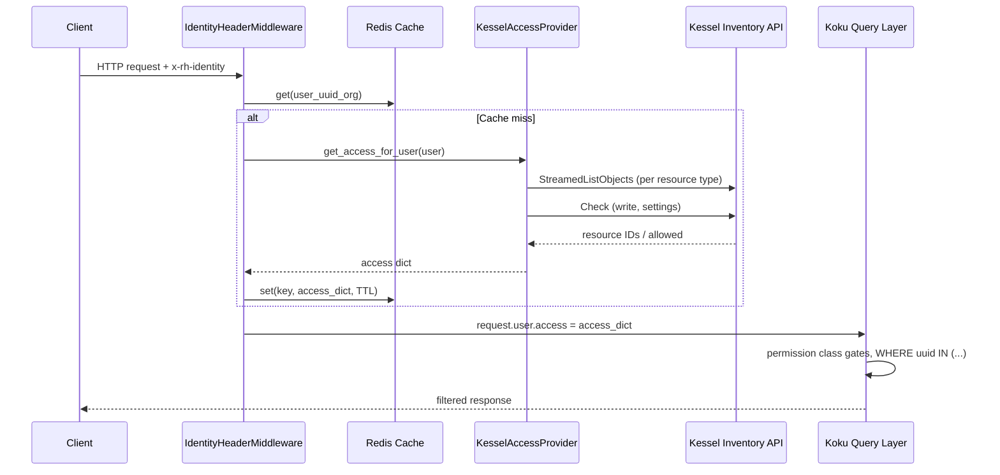
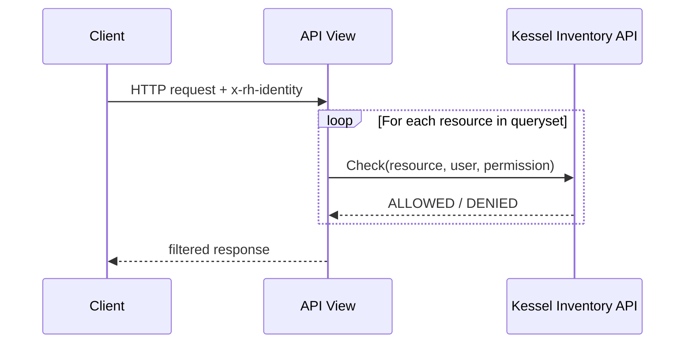

# Authorization Delegation Strategy -- Design Document

| Field         | Value                                                                 |
|---------------|-----------------------------------------------------------------------|
| Jira          | [FLPATH-3294](https://issues.redhat.com/browse/FLPATH-3294)          |
| Parent HLD    | [onprem-authorization-backend.md](onprem-authorization-backend.md) |
| Author        | Jordi Gil                                                             |
| Status        | Decision — **Resolved**: Option A (Adapter Pattern) was selected and implemented. See [kessel-ocp-detailed-design.md](./kessel-ocp-detailed-design.md) for the full implementation design and [ReBAC Bridge Design](./rebac-bridge-design.md) for runtime management. |
| Created       | 2026-02-26                                                           |
| Last updated  | 2026-02-26                                                           |

## Table of Contents

1. [Purpose and Context](#1-purpose-and-context)
2. [Option A: Adapter Pattern -- Kessel as Access-List Provider](#2-option-a-adapter-pattern----kessel-as-access-list-provider)
3. [Option B: Full Delegation -- Kessel as Inline Authorizer](#3-option-b-full-delegation----kessel-as-inline-authorizer)
4. [Tradeoff Analysis](#4-tradeoff-analysis)
5. [Decision](#5-decision)
6. [Workspace Cardinality and Tuple Lifecycle](#6-workspace-cardinality-and-tuple-lifecycle)
7. [References](#7-references)

---

## 1. Purpose and Context

With Kessel selected as the on-prem authorization backend
([Scenario A](onprem-authorization-backend.md#2-scenario-a-kessel-rebac)),
a secondary design question arises: **how deeply should Koku integrate with
Kessel for authorization decisions?**

Two integration patterns are possible:

- **Option A (Adapter)**: Kessel serves as an access-list provider.
  Koku queries Kessel once per request to build an access dict, then applies
  its own local filtering logic -- the same code path used with RBAC v1.
- **Option B (Full delegation)**: Koku delegates every authorization decision
  to Kessel at query time. Each API view calls Kessel directly instead of
  maintaining a local access dict.

This document evaluates both options, explains the decision, and provides an
architectural analysis of Kessel's workspace construct and the on-prem tuple
lifecycle.

### Relationship to the HLD

The [HLD](onprem-authorization-backend.md) decided **which** backend to use
(Kessel). This document decides **how** Koku integrates with that backend.
The [Detailed Design](./kessel-ocp-detailed-design.md) captures the
implementation of whichever option is chosen here.

---

## 2. Option A: Adapter Pattern -- Kessel as Access-List Provider

This is the current implementation.

### How it works



`KesselAccessProvider` calls `StreamedListObjects` for each resource type to
get explicit resource IDs the user can access, with a workspace-level `Check`
fallback for wildcard detection. It returns the same dict shape as
`RbacService.get_access_for_user()`:

```python
{
    "openshift.cluster": {"read": ["cluster-uuid-1", "cluster-uuid-2"]},
    "cost_model": {"read": ["uuid1"], "write": ["uuid1"]},
    "settings": {"read": ["*"], "write": ["*"]},
    ...
}
```

Downstream Koku code is backend-agnostic. Permission classes check
`len(read_access) > 0`.
[`QueryParameters._set_access()`](../../../koku/api/query_params.py) checks
`has_wildcard(access_list)` -- if wildcard, no filtering; if specific IDs,
applies `QueryFilter(parameter=access, ...)`.

### Key properties

- Single resolution per request, cached for TTL (default 300s)
- Zero changes to permission classes or query layer
- Same code path as RBAC v1 -- battle-tested
- Application-specific logic (cross-provider intersection, write-grants-read,
  settings asymmetry) handled locally

### Source references

- [`koku_rebac/access_provider.py`](../../../koku/koku_rebac/access_provider.py)
  -- KesselAccessProvider implementation
- [`koku/rbac.py`](../../../koku/koku/rbac.py) -- RbacService,
  `_apply_access()`, `_process_acls()`
- [`koku/middleware.py`](../../../koku/koku/middleware.py) --
  IdentityHeaderMiddleware, cache key selection
- [`api/query_params.py`](../../../koku/api/query_params.py) --
  `_set_access()`, `has_wildcard()`
- [DD Section 3](./kessel-ocp-detailed-design.md#3-accessprovider-abstraction-phase-1)
  -- AccessProvider abstraction
- [DD Section 5](./kessel-ocp-detailed-design.md#5-kesselaccessprovider-internals)
  -- KesselAccessProvider internals
- [docs/rbac.md](../../rbac.md) -- RBAC permission classes, access dict shape

---

## 3. Option B: Full Delegation -- Kessel as Inline Authorizer

This option was evaluated but **not** implemented.

### How it would work



Each API view would call `Check()` or `CheckBulk()` per resource instead of
filtering locally with an access dict. Koku would stop maintaining the access
dict entirely; every authorization decision would be delegated to Kessel in
real time.

### Key properties

- N+1 gRPC calls per request (1 per resource in the response set)
- Every API request depends on Kessel uptime
- Application-specific logic must be encoded in the ZED schema or Koku
  middleware
- No caching layer (or requires custom TTL logic per-resource)

---

## 4. Tradeoff Analysis

- **Performance**: Option A resolves all permissions in a single
  `StreamedListObjects` call per resource type, cached for 300s. Option B
  requires N+1 gRPC round-trips per request. For a user with access to 50
  clusters, Option A makes ~10 Kessel calls (one per resource type) cached for
  5 minutes; Option B makes 50+ calls on every request.

- **Availability coupling**: Option A degrades gracefully -- if Kessel is
  unreachable, the middleware returns HTTP 424 (Failed Dependency) on cache
  miss but serves from cache on hit. Option B makes every single API request
  fail-closed on Kessel outages with no cache buffer.

- **Application-specific logic**: Koku's query layer handles several
  authorization patterns that are not expressible in Kessel's ZED schema:
  - **Cross-provider OCP inheritance**: cluster access implies node/project
    access. In Option A this is handled by the ZED schema's permission
    propagation (`t_workspace->` relation), transparent to Koku. In Option B
    Koku would need to issue hierarchical checks.
  - **Write-grants-read**: `_update_access_obj` in
    [`rbac.py`](../../../koku/koku/rbac.py#L111) ensures write access implies
    read. Option A handles this in `_resolve_per_resource_access`. Option B
    would need the ZED schema to model this.
  - **Settings asymmetry**: settings is a workspace-level capability (not a
    per-resource concept). Option A uses workspace-level `Check` exclusively
    for settings. Option B would need special-casing.
  - **Wildcard heuristics**: when `StreamedListObjects` returns empty, Option A
    falls back to a workspace-level `Check` to distinguish "no resources
    registered yet" from "no access". Option B has no equivalent.

- **Workspace maturity**: Kessel's workspace construct has known limitations
  (see [Section 6](#6-workspace-cardinality-and-tuple-lifecycle)). Keeping
  local filtering insulates Koku from upstream workspace changes.

- **SaaS migration path**: Both options are compatible with a future SaaS
  migration to Kessel. Option A is already the SaaS design intent.

- **Code complexity**: Option A keeps the existing well-tested query layer
  (permission classes, `_set_access()`, `has_wildcard()`) completely unchanged.
  Option B requires rewriting every view's authorization logic.

---

## 5. Decision

**Option A (Adapter Pattern) is chosen.**

Koku uses Kessel as an access-list provider and performs local filtering.
This is the same pattern used with RBAC v1, and the same pattern planned for
SaaS Kessel migration.

### Rationale

1. **Performance**: one-time access dict resolution with cache vs N+1 per
   request
2. **Availability**: cache buffer protects against transient Kessel outages
3. **Application-specific logic**: handled locally without ZED schema coupling
4. **Zero query-layer changes**: permission classes and `_set_access()` are
   unchanged
5. **Workspace immaturity**: local filtering insulates against upstream changes
6. **SaaS parity**: Option A is the intended SaaS pattern

### What "delegation" means in practice

Koku **does** delegate to Kessel -- it just does so at the access-dict level
rather than per-resource. `StreamedListObjects` returns the authoritative list
of resources a user can see; `Check` returns the authoritative write/settings
permissions. Koku trusts these results completely. The local filtering is
simply the mechanism for applying those results to SQL queries -- it is not
re-interpreting or overriding Kessel's decisions.

### Why "fetch all access, intersect locally" -- not Check() per resource

The adapter pattern exists because **Koku needs a set of allowed resource IDs
to build SQL queries**, not a yes/no answer for a single resource. The query
pipeline works as follows:

1. Middleware calls the access provider and caches the result.
2. [`QueryParameters._set_access()`](../../../koku/api/query_params.py) reads
   the ID list for each resource type from `request.user.access`.
3. [`ReportQueryHandler`](../../../koku/api/report/queries.py) builds
   `WHERE cluster_id IN ('id-1', 'id-2', ...)` into the SQL query.

Using `Check()` per resource would invert this flow: Koku would first have to
query the database for **all** clusters/nodes/projects in the org, then call
`Check()` on each one, then discard the unauthorized rows. For an org with 100
clusters that is 100 gRPC round-trips versus a single `StreamedListObjects`
call.

#### Historical context: the RBAC Service shaped the architecture

The SaaS RBAC Service exposes a single bulk endpoint
(`GET /v1/access/?application=cost-management`) that returns every ACL for a
user in one response. There is no per-resource `Check()` API.
[`RbacService.get_access_for_user()`](../../../koku/koku/rbac.py) calls that
endpoint once, and the rest of Koku -- permission classes, `_set_access()`,
`has_wildcard()`, `QueryFilter` -- was designed around this bulk-fetch model.
The Kessel adapter produces the same dict shape so none of that code changes.

#### How the three user categories are handled

| User category | What happens | Kessel calls |
|---|---|---|
| **Org admin** (`ENHANCED_ORG_ADMIN`) | Middleware returns `{}` (empty dict = full access). No Kessel call at all. | 0 |
| **Wildcard role** (e.g. cost-administrator bound to the tenant) | `StreamedListObjects` returns every resource ID in the org. Access map contains explicit IDs, functionally equivalent to `["*"]`. | 1 per resource type |
| **Per-resource access** (specific tuples for individual clusters) | `StreamedListObjects` returns only the authorized IDs. Access map contains `["id-1", "id-2"]`. | 1 per resource type |

In all three cases the downstream code receives the same dict shape and applies
the same filtering logic. The authorization backend is invisible to the query
layer.

#### Why Check() alone would not work

`Check()` answers: *"Can user X perform action Y on resource Z?"* -- a boolean.

Koku's query pattern is: *"Which resources can user X perform action Y on?"*
-- a list of IDs.

To bridge that gap with `Check()` only, you would need to:

1. Query the database for all possible resource IDs in the org.
2. Call `Check()` for each one -- O(N) gRPC calls.
3. Intersect the results back into the SQL query.

`StreamedListObjects` answers the second question directly in O(1) calls per
resource type. `Check()` is still used where it is the right tool:
workspace-level capabilities like `settings` (where there is no per-resource
dimension) and as a fallback when `StreamedListObjects` returns empty (to
distinguish "no resources registered" from "no access").

---

## 6. Workspace Cardinality and Tuple Lifecycle

### 6.1 Workspace Management

Kessel exposes **no dedicated workspace management API**. The Inventory API
service definition
([`inventory_service.proto`](https://github.com/project-kessel/inventory-api/blob/main/api/kessel/inventory/v1beta2/inventory_service.proto))
exposes: `Check`, `CheckSelf`, `CheckForUpdate`, `CheckBulk`, `CheckSelfBulk`,
`ReportResource`, `DeleteResource`, and `StreamedListObjects`. There is no
`CreateWorkspace`, `ListWorkspaces`, or `DeleteWorkspace`.

Workspaces exist purely as SpiceDB objects of type `rbac/workspace`, managed
through tuple CRUD on the Relations API (or via `kessel-admin.sh`).

### 6.2 Workspace Hierarchy

The ZED schema defines workspace hierarchy:

```zed
definition rbac/workspace {
    relation t_parent: rbac/workspace | rbac/tenant
    relation t_binding: rbac/role_binding
    permission cost_management_openshift_cluster_view = ...
    // ... permissions propagate through t_parent
}
```

Permissions propagate upward through `t_parent`, enabling nested workspaces.
On-prem, `ShimResolver` maps `org_id` directly to `workspace_id` (flat
hierarchy, no nesting).

### 6.3 Multi-Workspace Cardinality

Each resource type defines `relation t_workspace: rbac/workspace`. In SpiceDB,
**relations are set-valued** -- nothing prevents creating multiple tuples:

```
cost_management/openshift_cluster:cluster-1#t_workspace -> rbac/workspace:org-A
cost_management/openshift_cluster:cluster-1#t_workspace -> rbac/workspace:org-B
```

Both tuples can coexist, and `StreamedListObjects` would return the resource
for users in either workspace.

However, the Inventory API's internal `SetWorkspace()` method
([`kessel.go`](https://github.com/project-kessel/inventory-api/blob/main/internal/authz/kessel/kessel.go))
creates **one** tuple at a time and has a `TODO: remove previous tuple for
workspace` comment, indicating single-workspace-per-resource is the **intended
design** but enforcement is not yet implemented.

Koku assumes 1:1 mapping (each resource belongs to one org's workspace).
Multi-tenancy isolation relies on Koku always writing the correct single
workspace -- Kessel does not enforce this.

### 6.4 Tuple Lifecycle: On-Prem Gap and Resolution

#### How Koku reports resources (correct)

Koku's Sources API, pipeline hooks, and middleware call `on_resource_created()`
which calls `ReportResource` with `workspace_id` in `representations.common`.
This is documented in test plan
[UT-KESSEL-RR-008](./kessel-ocp-test-plan.md):
*"The `workspace_id` enables Kessel to auto-create the `#t_workspace` parent
tuple."* Hook points:

| Hook | Resource type | Trigger |
|------|---------------|---------|
| `ProviderBuilder.create_provider_from_source()` | `openshift_cluster` | New OCP source |
| `populate_openshift_cluster_information_tables()` | `openshift_node`, `openshift_project` | Pipeline processes OCP data |
| `CostModelViewSet.perform_create()` | `cost_model` | New cost model |
| `IdentityHeaderMiddleware.create_customer()` | `settings` | New org first seen |

#### How the Inventory API creates tuples (SaaS architecture)


The Inventory API uses a CDC outbox pattern
([`outboxeventsrepository.go`](https://github.com/project-kessel/inventory-api/blob/main/internal/data/outboxeventsrepository.go)):
tuple events are written to the outbox table and immediately deleted within
the same transaction (captured by PostgreSQL's WAL). Debezium CDC reads the
WAL and publishes to Kafka. The in-process consumer reads from Kafka
(`consumer.bootstrap-servers`) and calls `KesselAuthz.SetWorkspace()` to
create the SpiceDB tuple.

This is confirmed by the upstream
[`full-setup.yaml`](https://github.com/project-kessel/inventory-api/blob/main/development/configs/full-setup.yaml)
(consumer requires `bootstrap-servers`) and
[`debezium-connector.json`](https://github.com/project-kessel/inventory-api/blob/main/development/configs/debezium-connector.json)
(CDC on `public.outbox_events`).

#### On-prem configuration

Our [`inventory-config.yaml`](../../../dev/kessel/inventory-config.yaml):

```yaml
authz:
  impl: kessel            # KesselAuthz is wired up (SetWorkspace available)
  kessel:
    url: relations-api:9000
eventing:
  eventer: stdout          # CDC events go to console, not Kafka
consumer:
  enabled: false           # in-process Kafka consumer disabled
```

The `KesselAuthz` authorizer is configured, but the CDC+consumer pipeline is
disabled. Tuple events are written to the WAL but never consumed.
**Per-resource `t_workspace` tuples are not auto-created.**

Without these tuples, `StreamedListObjects` cannot return any resources --
authorization would be broken.

#### Tuple lifecycle options evaluated

| Option | Mechanism | Consistency | Infrastructure | Koku changes |
|--------|-----------|-------------|----------------|--------------|
| **A: Full CDC** | Debezium -> Kafka -> consumer -> SetWorkspace | Eventual | Debezium Connect + Kafka topics | None |
| **B: Direct Relations API (chosen)** | `on_resource_created` -> `POST /tuples` | Immediate | None (Relations API already deployed) | `_create_resource_tuples()` |
| **C: Kafka + sink connector** | Koku -> Kafka -> kafka-relations-sink -> Relations API | Eventual | kafka-relations-sink + Kafka topics | Kafka producer |

#### Decision: Option B -- Koku creates tuples directly via Relations API

Extend `on_resource_created` in
[`resource_reporter.py`](../../../koku/koku_rebac/resource_reporter.py) to call
`POST /api/authz/v1beta1/tuples` on the Relations API, creating the
`cost_management/<type>:<id>#t_workspace -> rbac/workspace:<org_id>` tuple.
This is symmetric with the existing `_delete_resource_tuples()` for cleanup.

**Rationale:**

- **Symmetric lifecycle**: creation mirrors the existing two-phase cleanup
  (`ReportResource` + Relations API delete). The full lifecycle becomes:
  - **Create**: `ReportResource` (metadata) + `POST /tuples` (SpiceDB tuple)
  - **Delete**: `DeleteResource` (metadata) + `DELETE /tuples` (SpiceDB tuple)
- **Immediate consistency**: the tuple exists in SpiceDB the moment
  `on_resource_created` returns. No eventual-consistency window.
- **Visible errors**: if the Relations API call fails, it is logged with
  resource type, ID, and HTTP status in the same request context. Option C
  buries failures in Kafka consumer lag or sink connector metrics.
- **Natural retry**: `on_resource_created` is fire-and-forget (errors logged,
  never propagated). The pipeline re-calls it on subsequent runs.
  `CreateTuples` with `upsert: true` is idempotent.
- **Zero infrastructure**: the Relations API is already deployed. No Debezium,
  no Kafka topics, no sink connectors.
- **Option A (Debezium CDC) is documented as the future SaaS-parity path** if
  full alignment with upstream Kessel architecture is needed.

---

## 7. References

| Resource | Path |
|----------|------|
| On-prem authorization backend HLD | [onprem-authorization-backend.md](onprem-authorization-backend.md) |
| Kessel detailed design | [kessel-ocp-detailed-design.md](./kessel-ocp-detailed-design.md) |
| Kessel test plan | [kessel-ocp-test-plan.md](./kessel-ocp-test-plan.md) |
| RBAC overview and permission classes | [docs/rbac.md](../../rbac.md) |
| KesselAccessProvider implementation | [koku_rebac/access_provider.py](../../../koku/koku_rebac/access_provider.py) |
| Resource reporter (create/delete lifecycle) | [koku_rebac/resource_reporter.py](../../../koku/koku_rebac/resource_reporter.py) |
| RbacService and access dict | [koku/rbac.py](../../../koku/koku/rbac.py) |
| IdentityHeaderMiddleware | [koku/middleware.py](../../../koku/koku/middleware.py) |
| Query layer access filtering | [api/query_params.py](../../../koku/api/query_params.py) |
| ZED schema (SpiceDB authorization model) | [dev/kessel/schema.zed](../../../dev/kessel/schema.zed) |
| Inventory API config (on-prem) | [dev/kessel/inventory-config.yaml](../../../dev/kessel/inventory-config.yaml) |
| Inventory API proto (upstream) | [inventory_service.proto](https://github.com/project-kessel/inventory-api/blob/main/api/kessel/inventory/v1beta2/inventory_service.proto) |
| Inventory API authorizer (upstream) | [kessel.go](https://github.com/project-kessel/inventory-api/blob/main/internal/authz/kessel/kessel.go) |
| Inventory API resource usecase (upstream) | [resource_service.go](https://github.com/project-kessel/inventory-api/blob/main/internal/biz/usecase/resources/resource_service.go) |
| Inventory API outbox (upstream) | [outboxeventsrepository.go](https://github.com/project-kessel/inventory-api/blob/main/internal/data/outboxeventsrepository.go) |
| Inventory API full-setup config (upstream) | [full-setup.yaml](https://github.com/project-kessel/inventory-api/blob/main/development/configs/full-setup.yaml) |
| Debezium connector config (upstream) | [debezium-connector.json](https://github.com/project-kessel/inventory-api/blob/main/development/configs/debezium-connector.json) |
