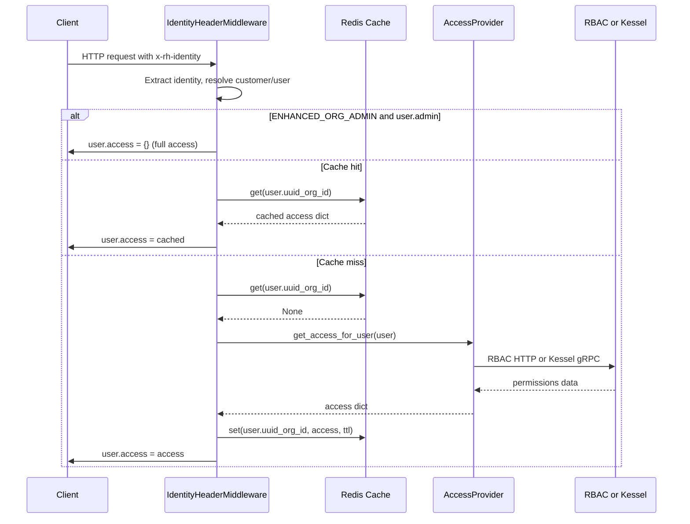
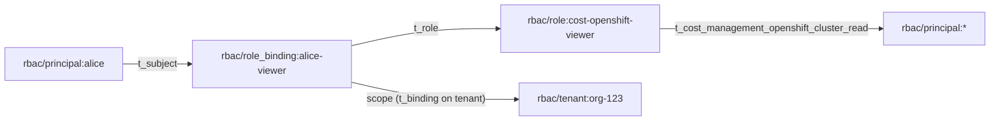

# Kessel/ReBAC Detailed Design -- Cost Management OCP Integration

| Field         | Value                                                                 |
|---------------|-----------------------------------------------------------------------|
| Jira          | [FLPATH-3294](https://issues.redhat.com/browse/FLPATH-3294)          |
| Parent story  | [FLPATH-2690](https://issues.redhat.com/browse/FLPATH-2690)          |
| Epic          | [FLPATH-2799](https://issues.redhat.com/browse/FLPATH-2799)          |
| HLD           | [kessel-ocp-integration.md](./kessel-ocp-integration.md)             |
| Author        | Jordi Gil                                                             |
| Status        | Draft                                                                 |
| Created       | 2026-02-18                                                           |
| Last updated  | 2026-02-26                                                           |

## Table of Contents

1. [Overview and Scope](#1-overview-and-scope)
2. [Configuration and Startup](#2-configuration-and-startup)
3. [AccessProvider Abstraction (Phase 1)](#3-accessprovider-abstraction-phase-1)
4. [Middleware Integration (Phase 1)](#4-middleware-integration-phase-1)
5. [KesselAccessProvider Internals](#5-kesselaccessprovider-internals)
6. [Resource Reporting and Sync (Phase 1)](#6-resource-reporting-and-sync-phase-1)
7. [ZED Schema and Role Seeding](#7-zed-schema-and-role-seeding)
8. [Testing Strategy](#8-testing-strategy)
9. [Deployment and Operations](#9-deployment-and-operations)
10. [Dependencies](#10-dependencies)
11. [Risks and Mitigations](#11-risks-and-mitigations)

---

## 1. Overview and Scope

This document describes the detailed design for integrating Kessel/ReBAC as the authorization backend for Cost Management, replacing RBAC for on-premise deployments and providing a future migration path for SaaS.

### 1.1 Phases

All three phases are delivered in a single branch/PR, using phases as logical checkpoints:

- **Phase 1** -- AccessProvider abstraction, middleware integration, resource reporting, pipeline sync
- **Phase 2** -- `StreamedListObjects()` and `Check()` via Inventory API as the primary Kessel methods for retrieving access lists, complete query-layer transparency

### 1.2 Deployment Matrix

| Environment | Authorization backend | How selected                                                     |
|-------------|-----------------------|------------------------------------------------------------------|
| On-prem     | ReBAC (Kessel)        | `ONPREM=true` forces `AUTHORIZATION_BACKEND=rebac` at startup    |
| SaaS        | RBAC (default)        | `AUTHORIZATION_BACKEND=rbac` (default, no env var needed)        |
| SaaS future | ReBAC (Kessel)        | Unleash flag overrides to `rebac` per org (documented hook only) |

### 1.3 Design Principles

- **Deployment-agnostic code**: The `ONPREM` check is confined to `settings.py` (startup-time derivation). The rest of the codebase reads only `AUTHORIZATION_BACKEND`.
- **Transparent pass-through**: `KesselAccessProvider` returns exactly what Kessel reports. No interpretation, no `"*"` fabrication.
- **Zero changes to query layer**: Koku already supports granular resource ID lists. Permission classes and query filtering work unchanged.
- **Resource lifecycle matches RBAC**: Koku's behavior is identical regardless of backend. Source deletion preserves Kessel resources (historical cost data remains queryable). Kessel Inventory resources and SpiceDB permission tuples are only cleaned up when cost data is purged from PostgreSQL due to retention expiry.

---

## 2. Configuration and Startup

All new settings are added to [`koku/koku/settings.py`](../../../koku/koku/settings.py).

### 2.1 Backend Selection

```python
from koku_rebac.config import resolve_authorization_backend

ONPREM = ENVIRONMENT.bool("ONPREM", default=False)
AUTHORIZATION_BACKEND = resolve_authorization_backend(
    onprem=ONPREM,
    env_value=ENVIRONMENT.get_value("AUTHORIZATION_BACKEND", default="rbac"),
)
```

`ONPREM=true` is the only mandatory env var for on-prem. It forces `AUTHORIZATION_BACKEND=rebac` regardless of any explicit `AUTHORIZATION_BACKEND` value. The `resolve_authorization_backend()` function ([`koku_rebac/config.py`](../../../koku/koku_rebac/config.py)) validates the input and returns one of `"rbac"` or `"rebac"`.

### 2.2 Kessel Connection

One gRPC service (Inventory API v1beta2) is used for all authorization and resource management:

```python
KESSEL_INVENTORY_CONFIG = {
    "host": ENVIRONMENT.get_value("KESSEL_INVENTORY_HOST", default="localhost"),
    "port": int(ENVIRONMENT.get_value("KESSEL_INVENTORY_PORT", default="9081")),
}

KESSEL_CA_PATH = ENVIRONMENT.get_value("KESSEL_CA_PATH", default="")
KESSEL_AUTH_ENABLED = ENVIRONMENT.bool("KESSEL_AUTH_ENABLED", default=False)
KESSEL_AUTH_CLIENT_ID = ENVIRONMENT.get_value("KESSEL_AUTH_CLIENT_ID", default="")
KESSEL_AUTH_CLIENT_SECRET = ENVIRONMENT.get_value("KESSEL_AUTH_CLIENT_SECRET", default="")
KESSEL_AUTH_OIDC_ISSUER = ENVIRONMENT.get_value("KESSEL_AUTH_OIDC_ISSUER", default="")
```

When `KESSEL_CA_PATH` is non-empty, the client reads the CA certificate and uses `grpc.ssl_channel_credentials()` for a secure channel. When empty, the client uses an insecure channel (suitable for local development). OIDC-based authentication is enabled via `KESSEL_AUTH_ENABLED=true`, requiring the client ID, secret, and issuer URL to be set.

### 2.3 Schema Version Tracking

Schema versioning is managed externally via the ZED schema file ([`dev/kessel/schema.zed`](../../../dev/kessel/schema.zed)) and the `zed` CLI. No Django settings entry is needed.

### 2.4 Cache Configuration

A new `kessel` cache entry mirrors the existing `rbac` cache (see [`settings.py` line 294](../../../koku/koku/settings.py#L294)):

```python
class CacheEnum(StrEnum):
    default = "default"
    api = "api"
    rbac = "rbac"
    kessel = "kessel"  # new
    worker = "worker"

```

The `CACHES` dict gets a new `CacheEnum.kessel` entry identical in structure to `CacheEnum.rbac`, with `TIMEOUT` set to `ENVIRONMENT.get_value("KESSEL_CACHE_TIMEOUT", default=300)`. The test `CACHES` block also gets the new entry with `DummyCache`.

### 2.5 App Registration

```python
INSTALLED_APPS = [
    ...
    "koku_rebac",  # new
]

SHARED_APPS = (
    ...
    "koku_rebac",  # new -- KesselSyncedResource lives in public schema
)
```

### 2.6 Bootstrap Configuration

| Setting              | On-prem mandatory? | Purpose                                             |
|----------------------|--------------------|-----------------------------------------------------|
| `ONPREM=true`        | Yes                | Forces `AUTHORIZATION_BACKEND=rebac`                |
| `ENHANCED_ORG_ADMIN` | No (default False) | Temporary bootstrap aid for first admin             |
| `KESSEL_INVENTORY_*` | Yes                | Inventory API gRPC endpoint                         |
| `KESSEL_CA_PATH`     | No                 | TLS CA certificate path (empty = insecure)          |
| `KESSEL_AUTH_*`      | Conditional        | OIDC auth settings (when `KESSEL_AUTH_ENABLED=true`) |

---

## 3. AccessProvider Abstraction (Phase 1)

New file: [`koku/koku_rebac/access_provider.py`](../../../koku/koku_rebac/access_provider.py)

### 3.1 Interface Contract

Both providers implement the same duck-typed interface:

- `get_access_for_user(self, user) -> dict` -- returns the access dict
- `get_cache_ttl(self) -> int` -- returns cache TTL in seconds

### 3.2 Implementations

**`RBACAccessProvider`** -- wraps existing [`RbacService`](../../../koku/koku/rbac.py#L171) with zero changes to `rbac.py`:

```python
class RBACAccessProvider:
    def __init__(self):
        self._service = RbacService()

    def get_access_for_user(self, user):
        return self._service.get_access_for_user(user)

    def get_cache_ttl(self) -> int:
        return self._service.get_cache_ttl()
```

**`KesselAccessProvider`** -- calls `StreamedListObjects()` and `Check()` via Inventory API for each resource type, builds the identical dict structure that [`_apply_access()`](../../../koku/koku/rbac.py#L127) returns:

```python
class KesselAccessProvider:
    def get_access_for_user(self, user) -> dict:
        # See Section 5 for implementation details
        ...

    def get_cache_ttl(self) -> int:
        return int(getattr(settings, "KESSEL_CACHE_TIMEOUT", 300))
```

### 3.3 Factory

```python
def get_access_provider():
    """Factory: return the access provider for the configured backend."""
    if settings.AUTHORIZATION_BACKEND == "rebac":
        return KesselAccessProvider()
    return RBACAccessProvider()
```

Returns a new instance per call. Providers are stateless (client is a separate singleton via `get_kessel_client()`), so no caching is needed at this layer.

### 3.4 Critical Contract

`KesselAccessProvider.get_access_for_user()` MUST return the same dict shape as `RbacService.get_access_for_user()`:

**RBAC example** (wildcard access):

```python
{
    "aws.account": {"read": ["*"]},
    "openshift.cluster": {"read": ["*"]},
    "cost_model": {"read": ["*"], "write": ["*"]},
    "settings": {"read": ["*"], "write": ["*"]},
    ...
}
```

**ReBAC example** (explicit IDs, no wildcards):

```python
{
    "aws.account": {"read": []},
    "openshift.cluster": {"read": ["cluster-uuid-1", "cluster-uuid-2"]},
    "cost_model": {"read": ["uuid1", "uuid2"], "write": ["uuid1"]},
    "settings": {"read": ["settings-org123"], "write": ["settings-org123"]},
    ...
}
```

### 3.5 Why Zero Changes to Permission Classes and Query Layer

Koku's existing permission classes and query filtering already support both patterns:

- **Permission classes** (Layer 1): gate access with `len(read_access) > 0`. An empty list from ReBAC means "no access" -- handled identically to RBAC returning no permissions.
- **Query engine** (Layer 2): [`QueryParameters._set_access()`](../../../koku/api/query_params.py#L266) checks `has_wildcard(access_list)`. If wildcard, no filtering. If specific IDs, applies `QueryFilter(parameter=access, ...)`. ReBAC always returns specific IDs.
- **Cost model view**: [`CostModelViewSet.get_queryset()`](../../../koku/cost_models/view.py) does `queryset.filter(uuid__in=read_access_list)` when not wildcard.

---

## 4. Middleware Integration (Phase 1)

Modifications to [`koku/koku/middleware.py`](../../../koku/koku/middleware.py).

### 4.1 Changes to IdentityHeaderMiddleware

Replace direct `RbacService` instantiation at [line 235](../../../koku/koku/middleware.py#L235):

```python
# Before
class IdentityHeaderMiddleware(MiddlewareMixin):
    rbac = RbacService()

# After
class IdentityHeaderMiddleware(MiddlewareMixin):
    access_provider = get_access_provider()
```

Update `_get_access()` at [line 270](../../../koku/koku/middleware.py#L270):

```python
def _get_access(self, user):
    if settings.ENHANCED_ORG_ADMIN and user.admin:
        return {}
    return self.access_provider.get_access_for_user(user)
```

### 4.2 Cache Key Selection

Update the cache lookup at [line 370](../../../koku/koku/middleware.py#L370):

```python
cache_name = CacheEnum.kessel if settings.AUTHORIZATION_BACKEND == "rebac" else CacheEnum.rbac
cache = caches[cache_name]
user_access = cache.get(f"{user.uuid}_{org_id}")

if not user_access:
    ...
    try:
        user_access = self._get_access(user)
    except KesselConnectionError as err:
        return HttpResponseFailedDependency({"source": "Kessel", "exception": err})
    except RbacConnectionError as err:
        return HttpResponseFailedDependency({"source": "Rbac", "exception": err})
    cache.set(f"{user.uuid}_{org_id}", user_access, self.access_provider.get_cache_ttl())
```

### 4.3 Settings Sentinel Creation

Add resource reporting hook in `create_customer()` at [line 239](../../../koku/koku/middleware.py#L239), after the customer is saved:

```python
@staticmethod
def create_customer(account, org_id, request_method):
    try:
        with transaction.atomic():
            ...
            if request_method and request_method not in ["GET", "HEAD"]:
                customer.save()
                UNIQUE_ACCOUNT_COUNTER.inc()
                LOG.info("Created new customer from account_id %s and org_id %s.", account, org_id)
                on_resource_created("settings", f"settings-{org_id}", org_id)
    ...
```

### 4.4 Unchanged Behaviors

- `ENHANCED_ORG_ADMIN` bypass (line 272) works identically for both backends
- `DEVELOPMENT_IDENTITY` bypass (line 374) remains unchanged
- `DEVELOPMENT` passthrough remains unchanged

### 4.5 Request Flow



---

## 5. KesselAccessProvider Internals

### 5.1 Execution Flow

```python
def get_access_for_user(self, user) -> dict:
    client = get_kessel_client()
    access = _init_empty_access()

    for koku_type, kessel_type in KOKU_TO_KESSEL_TYPE_MAP.items():
        operations = RESOURCE_TYPES.get(koku_type, ["read"])
        for operation in operations:
            kessel_perm = _to_kessel_permission(kessel_type, operation)
            try:
                if operation == "read":
                    request = _build_list_request(kessel_type, kessel_perm, user.username)
                    for resp in client.inventory_stub.StreamedListObjects(request):
                        access[koku_type][operation].append(resp.resource.id)
                else:
                    request = _build_check_request(kessel_type, kessel_perm, user.username)
                    resp = client.inventory_stub.Check(request)
                    if resp.allowed:
                        access[koku_type][operation] = ["*"]
            except grpc.RpcError as exc:
                LOG.warning(
                    log_json(msg="Kessel Inventory API failed",
                             resource_type=kessel_type, permission=kessel_perm)
                )
                raise KesselConnectionError(
                    f"Kessel query failed for {kessel_type}/{kessel_perm}"
                ) from exc

    return access
```

Key design details:

- **Dual-method approach**: `StreamedListObjects` is used for `read` operations (returns explicit resource ID lists), `Check` is used for `write` operations (returns a boolean -- mapped to `["*"]` if allowed, `[]` if denied). This matches the access patterns: read scoping needs per-resource granularity, write permissions are tenant-level.
- **Compound permission names**: Koku operations are mapped to Kessel compound permissions via `_to_kessel_permission()`: `read` -> `cost_management_{type}_view`, `write` -> `cost_management_{type}_edit`. These compound permissions are resolved by SpiceDB through the ZED schema.
- **On success, always returns a dict.** Empty lists for resource types with no access. This matches the middleware's expectation for both backends.
- **gRPC errors propagate as `KesselConnectionError`.** This mirrors RBAC's pattern: `RbacService._request_user_access()` raises `RbacConnectionError` on `ConnectionError` or HTTP 5xx (see [`rbac.py` line 200](../../../koku/koku/rbac.py#L200)). Kessel follows the same contract -- any `grpc.RpcError` raises `KesselConnectionError`, which the middleware catches and returns as HTTP 424 (Failed Dependency). Errors are never silently consumed.
- **No OCP inheritance cascade**: unlike the Relations API `LookupResources` approach, `StreamedListObjects` via Inventory API returns only resources the user is explicitly authorized for. The ZED schema handles permission propagation (cluster-level access cascades to nodes/projects through the schema).

### 5.2 Transparent Pass-Through Principle

`KesselAccessProvider` returns exactly what Kessel reports:

- For `read` operations, `StreamedListObjects()` returns explicit resource IDs. We return them as-is.
- For `write` operations, `Check()` returns a boolean. If allowed, we return `["*"]` (tenant-level write); if denied, `[]`.
- If a user has tenant-level access to all clusters, `StreamedListObjects()` returns all cluster IDs. We return them as-is.
- If no resources of a type exist (e.g., no AWS accounts on-prem), Kessel returns nothing and we return `[]`.
- The query layer handles both cases: specific IDs trigger filtered queries, empty lists result in no data or 403 depending on the permission class.

### 5.3 Performance Consideration

Returning explicit ID lists instead of `"*"` means the query layer always applies `WHERE uuid IN (...)` filters. For users with access to many resources, this is functionally equivalent to no filter but marginally less efficient. This is an acceptable trade-off for correctness and deployment-agnostic behavior. Optimization (e.g., query-layer awareness of "all resources" case) can be added later if needed.

### 5.4 Koku-to-Kessel Type Mapping

Defined as a constant in [`koku/koku_rebac/access_provider.py`](../../../koku/koku_rebac/access_provider.py):

| Koku `RESOURCE_TYPES` key  | Kessel resource type                        | Koku DB identifier         |
|-----------------------------|---------------------------------------------|----------------------------|
| `openshift.cluster`         | `cost_management/openshift_cluster`         | `Provider.uuid`            |
| `openshift.node`            | `cost_management/openshift_node`            | node name string           |
| `openshift.project`         | `cost_management/openshift_project`         | namespace name string      |
| `cost_model`                | `cost_management/cost_model`                | `CostModel.uuid`           |
| `settings`                  | `cost_management/settings`                  | `settings-{org_id}`        |
| `aws.account`               | `cost_management/aws_account`               | usage account ID string    |
| `aws.organizational_unit`   | `cost_management/aws_organizational_unit`   | org unit ID string         |
| `azure.subscription_guid`   | `cost_management/azure_subscription`        | subscription GUID string   |
| `gcp.account`               | `cost_management/gcp_account`               | account ID string          |
| `gcp.project`               | `cost_management/gcp_project`               | project ID string          |

All resource types are queried uniformly. No special-casing by type. On on-prem OCP, Kessel has no AWS/Azure/GCP resources registered, so those queries return empty lists naturally.

### 5.5 Permission Mapping

Koku operation names are mapped to Kessel compound permission names via `_to_kessel_permission()`:

| Koku operation | Kessel compound permission pattern | Example |
|----------------|--------------------------------------|---------|
| `read`         | `cost_management_{type}_view`        | `cost_management_openshift_cluster_view` |
| `write`        | `cost_management_{type}_edit`        | `cost_management_cost_model_edit` |

These compound permissions are resolved by SpiceDB through the ZED schema's permission propagation chain (`principal -> role_binding -> role -> permission`). The `_view` suffix maps to read access and `_edit` maps to write access in the schema.

---

## 6. Resource Reporting and Sync (Phase 1)

### 6.1 Tracking Model

New file: [`koku/koku_rebac/models.py`](../../../koku/koku_rebac/models.py) (registered in `SHARED_APPS` -- public schema):

```python
class KesselSyncedResource(models.Model):
    resource_type = models.CharField(max_length=128)
    resource_id = models.CharField(max_length=256)
    org_id = models.CharField(max_length=64)
    kessel_synced = models.BooleanField(default=False)
    last_synced_at = models.DateTimeField(null=True, blank=True)
    created_at = models.DateTimeField(auto_now_add=True)
    updated_at = models.DateTimeField(auto_now=True)

    class Meta:
        db_table = "kessel_synced_resource"
        ordering = ["created_at"]
        unique_together = (("resource_type", "resource_id", "org_id"),)
        indexes = [
            models.Index(fields=["org_id"], name="idx_kessel_sync_org"),
            models.Index(fields=["resource_type", "org_id"], name="idx_kessel_sync_type_org"),
        ]
```

### 6.2 Transparent Resource Reporter

New file: [`koku/koku_rebac/resource_reporter.py`](../../../koku/koku_rebac/resource_reporter.py)

The reporter is called unconditionally by Koku's core code. The backend decides internally what to do:

- **RBAC backend**: all methods are no-ops (RBAC doesn't track individual resources)
- **ReBAC backend**: calls Inventory API `ReportResource()` first, then records success in `KesselSyncedResource`

```python
def on_resource_created(resource_type, resource_id, org_id):
    """Report a new resource to Kessel Inventory if ReBAC is active.
    gRPC errors are logged but never propagated to the caller."""
    if settings.AUTHORIZATION_BACKEND != "rebac":
        return

    client = get_kessel_client()
    request = _build_report_request(resource_type, resource_id, org_id)

    try:
        client.inventory_stub.ReportResource(request)
    except grpc.RpcError:
        LOG.exception(
            log_json(msg="Failed to report resource to Kessel",
                     resource_type=resource_type, resource_id=resource_id)
        )
        return

    _track_synced_resource(resource_type, resource_id, org_id)
```

The call-then-track ordering ensures that the `KesselSyncedResource` tracking record is only created after a successful gRPC call. Failed reports are logged but do not create stale tracking rows.

### 6.3 Hook Points

All hooks call the reporter unconditionally. The reporter no-ops for RBAC.

| Hook location | Resource type | Resource ID | When triggered |
|---|---|---|---|
| [`ProviderBuilder.create_provider_from_source()`](../../../koku/api/provider/provider_builder.py#L122) | `openshift_cluster` | `provider.uuid` | New OCP source registered |
| [`ocp_report_db_accessor.populate_openshift_cluster_information_tables()`](../../../koku/masu/database/ocp_report_db_accessor.py#L749) | `openshift_node`, `openshift_project` | node name, namespace name | Pipeline processes OCP data |
| [`CostModelViewSet.perform_create()`](../../../koku/cost_models/view.py) | `cost_model` | `cost_model.uuid` | New cost model created |
| [`IdentityHeaderMiddleware.create_customer()`](../../../koku/koku/middleware.py#L239) | `settings` | `settings-{org_id}` | New org first seen |

### 6.3.1 Sources API Flow (On-Prem)

When `ONPREM=true`, the Sources API is extended with full CRUD capabilities ([`view.py`](../../../koku/sources/api/view.py)).
The creation flow for OCP sources automatically triggers Kessel resource reporting:

```
POST /api/cost-management/v1/sources/
  -> SourcesViewSet.create()
    -> AdminSourcesSerializer.create()
      -> ProviderBuilder.create_provider_from_source()
        -> _report_ocp_resource(provider.uuid, org_id)
          -> on_resource_created("openshift_cluster", uuid, org_id)
            -> Kessel Inventory ReportResource gRPC
```

Key details:
- The `ONPREM` gate at module level in [`view.py`](../../../koku/sources/api/view.py) enables `CreateModelMixin`, `UpdateModelMixin`, and `DestroySourceMixin`
- CMMO compatibility: `source_type_id` and `source_ref` fields on serializers ([`serializers.py`](../../../koku/sources/api/serializers.py)) allow operators to create sources using CMMO IDs (e.g., `"1"` for OCP) via [`source_type_mapping.py`](../../../koku/sources/api/source_type_mapping.py)
- On-prem is OCP-only; the `_report_ocp_resource()` hook in `ProviderBuilder` fires exclusively for OCP providers

### 6.3.2 Deletion Policy

**Resources are NOT removed from Kessel when a source is deleted.** The `DestroySourceMixin` destroys the Koku provider and `Sources` DB record, but does not call any Kessel delete API. Historical cost data remains in PostgreSQL and must remain queryable -- preserving the Kessel Inventory resources ensures authorization continues to work for that historical data.

### 6.3.3 Data Expiry Cleanup

**Resources ARE removed from Kessel when cost data is purged from PostgreSQL due to retention expiry.** When `remove_expired_data` (in [`tasks.py`](../../../koku/masu/processor/tasks.py)) fully purges a provider's data past the retention period, the corresponding Kessel Inventory resources and SpiceDB permission tuples must also be cleaned up via `DeleteResource`. The `KesselSyncedResource` tracking rows are deleted at the same time. *(Target design -- requires assessment of `OCPReportDBCleaner` interaction and implementation.)*

### 6.4 Error Handling

Kessel sync failures are **non-fatal** (unlike access queries in Section 5.1 where gRPC errors raise `KesselConnectionError`):
- The resource is created in Postgres normally -- a Kessel outage must never block data ingestion
- The gRPC error is logged; no `KesselSyncedResource` row is created for the failed attempt
- Retry occurs on the next pipeline cycle (idempotent `ReportResource` call)

The rationale for different error handling: access queries are on the **request path** (user waiting for a response -- fail-closed, matching RBAC's `RbacConnectionError`), while resource reporting is on the **write path** (background/pipeline work -- fire-and-forget with retry). RBAC has no equivalent to resource reporting, so there is no RBAC pattern to mirror here.

### 6.5 Resource Lifecycle

The design principle is that Koku's behavior is identical regardless of authorization backend.

**RBAC today:**

- **Create**: Koku creates resource in Postgres. RBAC doesn't know. Users with `"*"` see it; users with specific IDs need an admin to add the ID in RBAC UI.
- **Update**: Koku updates in Postgres. RBAC doesn't know or care.
- **Delete**: Koku deletes from Postgres. RBAC doesn't know. Stale IDs in RBAC are harmless.
- **Org removal**: `remove_stale_tenants` drops the Postgres schema. RBAC doesn't know.

**ReBAC mirrors this:**

- **Create**: Koku creates in Postgres. Reporter reports to Kessel (RBAC: no-op). Users with tenant-level bindings see it via `StreamedListObjects()`.
- **Update**: No Kessel action. Resource IDs are immutable (`Provider.uuid`, node name, namespace name, `CostModel.uuid`). Kessel tracks identity, not attributes.
- **Delete (source removal)**: No Kessel action. Resource stays in Kessel, preserving authorization for historical cost data still in PostgreSQL. Both backends are append-only for source-level operations.
- **Delete (data expiry)**: When `remove_expired_data` purges cost data past retention, `DeleteResource` is called on Kessel Inventory API to remove the resource and its SpiceDB tuples. `KesselSyncedResource` tracking rows are also deleted.
- **Org removal**: [`remove_stale_tenants`](../../../koku/masu/processor/tasks.py#L1131) drops the Postgres schema. Kessel resources for the org should also be cleaned up (hook point for future implementation).

### 6.6 Complete Resource Lifecycle Summary

| Resource | Created | Updated | Deleted from Kessel? |
|---|---|---|---|
| Role definitions (global) | `seed-roles.yaml` at deploy | `zed` CLI (additive schema) | Never (global definitions) |
| Settings sentinel (per-org) | `create_customer()` middleware | N/A (sentinel) | On org removal (future) |
| OCP Cluster | `create_provider_from_source()` | No-op (UUID unchanged) | No on source deletion (historical data preserved); Yes on data expiry via `remove_expired_data` |
| OCP Nodes | `populate_node_table()` pipeline | No-op (name unchanged) | No on source deletion; Yes on data expiry |
| OCP Projects | `populate_project_table()` pipeline | No-op (name unchanged) | No on source deletion; Yes on data expiry |
| Cost Model | `CostModelViewSet.perform_create()` | No-op (UUID unchanged) | No on deletion; Yes on data expiry |
| Role bindings (per-user) | `kessel-admin.sh` / `zed` CLI | Delete + recreate | Yes, via `kessel-admin.sh` / `zed` CLI |

---

## 7. ZED Schema and Role Seeding

### 7.1 Production ZED Schema (Current State)

Source: [`RedHatInsights/rbac-config/configs/prod/schemas/schema.zed`](https://github.com/RedHatInsights/rbac-config/blob/master/configs/prod/schemas/schema.zed)

The production schema already defines **23 cost_management permissions** on `rbac/role` (lines 163-208):

```zed
definition rbac/role {
    ...
    permission cost_management_all_all = t_cost_management_all_all
    relation t_cost_management_all_all: rbac/principal:*
    permission cost_management_aws_account_all = t_cost_management_aws_account_all
    relation t_cost_management_aws_account_all: rbac/principal:*
    permission cost_management_aws_account_read = t_cost_management_aws_account_read
    relation t_cost_management_aws_account_read: rbac/principal:*
    permission cost_management_aws_organizational_unit_all = t_cost_management_aws_organizational_unit_all
    relation t_cost_management_aws_organizational_unit_all: rbac/principal:*
    permission cost_management_aws_organizational_unit_read = t_cost_management_aws_organizational_unit_read
    relation t_cost_management_aws_organizational_unit_read: rbac/principal:*
    permission cost_management_azure_subscription_guid_all = t_cost_management_azure_subscription_guid_all
    relation t_cost_management_azure_subscription_guid_all: rbac/principal:*
    permission cost_management_azure_subscription_guid_read = t_cost_management_azure_subscription_guid_read
    relation t_cost_management_azure_subscription_guid_read: rbac/principal:*
    permission cost_management_cost_model_all = t_cost_management_cost_model_all
    relation t_cost_management_cost_model_all: rbac/principal:*
    permission cost_management_cost_model_read = t_cost_management_cost_model_read
    relation t_cost_management_cost_model_read: rbac/principal:*
    permission cost_management_cost_model_write = t_cost_management_cost_model_write
    relation t_cost_management_cost_model_write: rbac/principal:*
    permission cost_management_gcp_account_all = t_cost_management_gcp_account_all
    relation t_cost_management_gcp_account_all: rbac/principal:*
    permission cost_management_gcp_account_read = t_cost_management_gcp_account_read
    relation t_cost_management_gcp_account_read: rbac/principal:*
    permission cost_management_gcp_project_all = t_cost_management_gcp_project_all
    relation t_cost_management_gcp_project_all: rbac/principal:*
    permission cost_management_gcp_project_read = t_cost_management_gcp_project_read
    relation t_cost_management_gcp_project_read: rbac/principal:*
    permission cost_management_openshift_cluster_all = t_cost_management_openshift_cluster_all
    relation t_cost_management_openshift_cluster_all: rbac/principal:*
    permission cost_management_openshift_cluster_read = t_cost_management_openshift_cluster_read
    relation t_cost_management_openshift_cluster_read: rbac/principal:*
    permission cost_management_openshift_node_all = t_cost_management_openshift_node_all
    relation t_cost_management_openshift_node_all: rbac/principal:*
    permission cost_management_openshift_node_read = t_cost_management_openshift_node_read
    relation t_cost_management_openshift_node_read: rbac/principal:*
    permission cost_management_openshift_project_all = t_cost_management_openshift_project_all
    relation t_cost_management_openshift_project_all: rbac/principal:*
    permission cost_management_openshift_project_read = t_cost_management_openshift_project_read
    relation t_cost_management_openshift_project_read: rbac/principal:*
    permission cost_management_settings_all = t_cost_management_settings_all
    relation t_cost_management_settings_all: rbac/principal:*
    permission cost_management_settings_read = t_cost_management_settings_read
    relation t_cost_management_settings_read: rbac/principal:*
    permission cost_management_settings_write = t_cost_management_settings_write
    relation t_cost_management_settings_write: rbac/principal:*
    ...
}
```

**Gap**: These permissions exist on `rbac/role` but are **NOT yet wired** through `rbac/role_binding` or `rbac/tenant`. The `role_binding` and `tenant` definitions in prod only propagate permissions for other services (HBI, notifications, etc.), not cost management. This means the authorization chain `principal -> role_binding -> tenant` cannot yet evaluate cost management permissions. Completing this wiring is part of the schema PR to `rbac-config`.

**Full delta tracking**: A comprehensive comparison of our local `dev/kessel/schema.zed` against the SaaS production schema -- including naming divergences, missing `_all` verb permissions, structural type differences, and a step-by-step reconciliation plan -- is maintained in [`zed-schema-upstream-delta.md`](./zed-schema-upstream-delta.md).

### 7.2 SaaS Role Definitions

Source: [`RedHatInsights/rbac-config/configs/prod/roles/cost-management.json`](https://github.com/RedHatInsights/rbac-config/blob/master/configs/prod/roles/cost-management.json)

These are the 5 standard roles used in SaaS production. The role seeding process (see Section 7.3) must create these exact role instances with the exact same permission mappings:

| Role name | RBAC slug | RBAC permissions | Description |
|---|---|---|---|
| Cost Administrator | `cost-administrator` | `cost-management:*:*` | All cost management permissions |
| Cost Price List Administrator | `cost-price-list-administrator` | `cost-management:cost_model:*`, `cost-management:settings:*` | Cost model and settings read/write |
| Cost Price List Viewer | `cost-price-list-viewer` | `cost-management:cost_model:read`, `cost-management:settings:read` | Cost model and settings read-only |
| Cost Cloud Viewer | `cost-cloud-viewer` | `cost-management:aws.account:*`, `cost-management:aws.organizational_unit:*`, `cost-management:azure.subscription_guid:*`, `cost-management:gcp.account:*`, `cost-management:gcp.project:*` | All cloud resource types |
| Cost OpenShift Viewer | `cost-openshift-viewer` | `cost-management:openshift.cluster:*` | OpenShift cluster read/all |

### 7.3 RBAC Permission to Kessel Relation Mapping

The mapping from RBAC permission strings (e.g., `cost-management:openshift.cluster:*`) to Kessel relation names (e.g., `t_cost_management_openshift_cluster_all`) is defined declaratively in [`dev/kessel/seed-roles.yaml`](../../../dev/kessel/seed-roles.yaml). This file is the single source of truth for role definitions and their permission mappings.

The mapping follows a deterministic convention: the RBAC permission `cost-management:{resource_type}:{verb}` maps to the Kessel relation `t_cost_management_{resource_type}_{verb}` on `rbac/role`. Wildcard permissions (`*:*` or `{type}:*`) expand to all matching relations for that scope.

### 7.4 Role Seeding Process

Role seeding is handled by [`deploy-kessel.sh`](../../../dev/kessel/deploy-kessel.sh) which processes `seed-roles.yaml` and writes the resulting tuples to SpiceDB via the Relations API. This script is invoked as a Helm post-install hook.

For each role defined in `seed-roles.yaml`:

1. Creates the role instance tuple: `rbac/role:{slug}` (implicit on first relation write)
2. For each permission entry, creates a tuple: `rbac/role:{slug}#{relation} rbac/principal:*`

**Example**: Seeding "Cost OpenShift Viewer" produces two tuples:

```
rbac/role:cost-openshift-viewer#t_cost_management_openshift_cluster_all@rbac/principal:*
rbac/role:cost-openshift-viewer#t_cost_management_openshift_cluster_read@rbac/principal:*
```

### 7.5 Roles Source

Role definitions are stored in `seed-roles.yaml` (committed to the repository). This file is derived from the SaaS production [`cost-management.json`](https://github.com/RedHatInsights/rbac-config/blob/master/configs/prod/roles/cost-management.json) and must be kept in sync when upstream roles change. The YAML format is suitable for air-gapped on-prem deployments (no network fetching required).

### 7.6 Authorization Hierarchy

Resources are linked directly to the tenant (org-level). Kessel workspaces are not used.

```
principal -> role_binding -> role -> permissions
                         -> tenant (scope)
```

The authorization chain in the production schema follows:



**Workspaces exclusion rationale**: Kessel workspaces (`rbac/workspace`) are organizational containers between tenant and resources, used by inventory services (HBI, ACM) for sub-org grouping. Cost management resources don't need sub-org segmentation -- all resources are at the org level. If a future requirement for cluster grouping (e.g., "production" vs "staging") emerges, workspaces can be added as a layer between tenant and resources without breaking the existing model.

### 7.7 Schema Upgrade Strategy

- **Additive-only policy**: Schema changes only add new types, relations, or permissions. Never remove or rename existing ones.
- **Tooling**: Schema upgrades are applied via the `zed` CLI as a Helm post-upgrade hook. There are no Django management commands for schema management.

### 7.8 Operational Tooling

Schema management and role seeding are handled by external scripts, not Django management commands:

- **[`deploy-kessel.sh`](../../../dev/kessel/deploy-kessel.sh)** -- applies the ZED schema and seeds roles from `seed-roles.yaml`. Used as Helm post-install/post-upgrade hook.
- **[`kessel-admin.sh`](../../../dev/kessel/kessel-admin.sh)** -- operator tool for managing role bindings, groups, and ad-hoc SpiceDB operations (create/delete bindings, enumerate tuples).

---

## 8. Testing Strategy

A separate [test plan document](./kessel-ocp-test-plan.md) maps every feature to specific test scenarios.

### 8.1 Scenario ID Convention

Format: `{TIER}-{MODULE}-{FEATURE}-{NNN}`

| Segment | Values | Description |
|---------|--------|-------------|
| TIER | `UT`, `IT`, `CT`, `E2E` | Unit, Integration, Contract, End-to-End |
| MODULE | `KESSEL`, `MW`, `SETTINGS`, `MASU`, `API`, `SRC`, `COSTMODEL` | Koku module where the test code lives |
| FEATURE | Short mnemonic (e.g., `AP`, `CL`, `RR`, `AUTH`, `SYNC`, `PB`, `CLEANUP`) | Feature under test |
| NNN | `001`-`999` | Sequential scenario number |

### 8.2 Module Reference

| Code | Koku module | Covers |
|------|-------------|--------|
| `KESSEL` | `koku/koku_rebac/` | access_provider, client, resource_reporter, models, workspace, config, exceptions |
| `MW` | `koku/koku/middleware.py` | Middleware integration (provider dispatch, caching, error handling) |
| `SETTINGS` | `koku/koku/settings.py` | Configuration and startup derivation |
| `MASU` | `koku/masu/` | Pipeline hook (ocp_report_db_accessor sync) |
| `API` | `koku/api/` | ProviderBuilder hook |
| `SRC` | `koku/sources/api/` | Sources API CRUD, CMMO compatibility, Kessel resource lifecycle |
| `COSTMODEL` | `koku/cost_models/` | CostModelViewSet hook |

### 8.3 Per-Scenario Format (IEEE 829-Inspired)

Each test scenario follows a structured format:

| Field | Description |
|-------|-------------|
| **ID** | `{TIER}-{MODULE}-{FEATURE}-{NNN}` |
| **Title** | Short descriptive name |
| **Priority** | P0 (Critical), P1 (High), P2 (Medium), P3 (Low) |
| **Business Value** | 1-2 sentences linking the test to a requirement or risk |
| **Phase** | 1, 1.5, or 2 (maps to DD checkpoint) |
| **Fixtures** | Explicit setup: base class, `@override_settings`, `@patch()`, `baker.make()` |
| **Steps** | BDD format: Given / When / Then |
| **Acceptance Criteria** | Concrete pass/fail conditions |

### 8.4 Priority Levels

| Level | Meaning | Triage guidance |
|-------|---------|-----------------|
| P0 (Critical) | Core contract, blocks all downstream | Must fix immediately; blocks PR merge |
| P1 (High) | Key feature, significant user impact | Fix before phase checkpoint |
| P2 (Medium) | Important but not blocking | Fix before final PR merge |
| P3 (Low) | Defensive, unlikely paths | Can defer to follow-up |

### 8.5 Tier Mapping to Koku Infrastructure

| DD tier | Koku runner | Runs in CI? | Kessel needed? |
|---------|-------------|-------------|----------------|
| Tier 1 (Unit) `UT-*` | Django `manage.py test` / tox | Yes | No (mocked gRPC) |
| Tier 2 (Integration) `IT-*` | Django `manage.py test` with `@override_settings` | Yes | No (mocked gRPC) |
| Tier 3 (Contract) `CT-*` | Django `manage.py test` with Podman Compose Kessel stack | Local only | Yes (real gRPC stack) |
| Tier 4 (E2E) `E2E-*` | IQE plugin with new Kessel markers | No (OCP cluster) | Yes (full stack) |

### 8.6 Coverage Target

Greater than 80% code coverage on the `koku/koku_rebac/` module for unit tier (`UT-*`).

---

## 9. Deployment and Operations

### 9.1 On-Prem Required Environment Variables

| Variable | Required | Default | Purpose |
|----------|----------|---------|---------|
| `ONPREM` | Yes | `false` | Forces `AUTHORIZATION_BACKEND=rebac` |
| `KESSEL_INVENTORY_HOST` | Yes | `localhost` | Inventory API gRPC host |
| `KESSEL_INVENTORY_PORT` | Yes | `9081` | Inventory API gRPC port |
| `KESSEL_CA_PATH` | No | `""` | Path to CA certificate for TLS; empty = insecure channel |
| `KESSEL_AUTH_ENABLED` | No | `false` | Enable OIDC-based auth for Kessel calls |
| `KESSEL_AUTH_CLIENT_ID` | Cond. | `""` | OIDC client ID (required when `KESSEL_AUTH_ENABLED=true`) |
| `KESSEL_AUTH_CLIENT_SECRET` | Cond. | `""` | OIDC client secret (required when `KESSEL_AUTH_ENABLED=true`) |
| `KESSEL_AUTH_OIDC_ISSUER` | Cond. | `""` | OIDC issuer URL (required when `KESSEL_AUTH_ENABLED=true`) |
| `ENHANCED_ORG_ADMIN` | No | `false` | Temporary bootstrap for first admin |
| `KESSEL_CACHE_TIMEOUT` | No | `300` | Access cache timeout in seconds |

### 9.2 Bootstrap Path A -- Gradual (ENHANCED_ORG_ADMIN)

1. Deploy Koku + Kessel/SpiceDB with `ONPREM=true`, `ENHANCED_ORG_ADMIN=true`
2. Seed roles via Helm post-install hook (applies [`seed-roles.yaml`](../../../dev/kessel/seed-roles.yaml) using `deploy-kessel.sh`)
3. First org admin logs in. `ENHANCED_ORG_ADMIN=True` bypasses Kessel -- full access granted
4. Admin creates role bindings for other users via `kessel-admin.sh` or `zed` CLI
5. Set `ENHANCED_ORG_ADMIN=false` and restart. Role bindings now govern access

### 9.3 Bootstrap Path B -- Pre-Configured

1. Deploy Kessel/SpiceDB
2. Seed roles via `deploy-kessel.sh` (applies `seed-roles.yaml`)
3. Pre-load role bindings via `zed` CLI (`zed relationship create`) or Relations API `ImportBulkTuples` (`POST /v1beta1/tuples/bulkimport`)
4. Deploy Koku with `ONPREM=true` only. Users have access from first login

### 9.4 Operational Characteristics

- **Kessel unavailability**: HTTP 424 (Failed Dependency) on every request until Kessel recovers. No fallback to RBAC.
- **No rollback to RBAC on-prem**: RBAC was never deployed. Fix-forward is the only recovery path.
- **Schema upgrades**: Additive-only. Applied via `zed` CLI as a Helm post-upgrade hook.

### 9.5 SaaS Future Wiring (Documented Hook Only)

Koku uses Unleash for feature flags via `UnleashClient` (see [`koku/koku/feature_flags.py`](../../../koku/koku/feature_flags.py)). The existing pattern uses `UNLEASH_CLIENT.is_enabled(flag_name, context)` with per-account context.

When SaaS is ready for per-org Kessel rollout, the hook point is in `get_access_provider()`:

```python
def get_access_provider(org_id=None) -> AccessProvider:
    if settings.AUTHORIZATION_BACKEND == "rebac":
        return KesselAccessProvider()
    # Future SaaS hook: per-org Unleash override
    # if org_id and is_feature_flag_enabled_by_account(
    #     org_id, "cost-management.backend.enable-kessel-rebac"
    # ):
    #     return KesselAccessProvider()
    return RBACAccessProvider()
```

This follows the existing Unleash pattern used throughout Koku (e.g., `cost-management.backend.ocp_gpu_cost_model` in [`masu/processor/__init__.py`](../../../koku/masu/processor/__init__.py#L27)). Implementation is deferred -- only the hook point is documented.

---

## 10. Dependencies

### 10.1 Python Packages

Added to `Pipfile`:

| Package | Purpose | Used by |
|---------|---------|---------|
| `kessel-sdk` | Inventory API client (gRPC) -- `StreamedListObjects`, `Check`, `ReportResource`, `DeleteResource` | `KesselAccessProvider`, `ResourceReporter` |
| `grpcio` | gRPC runtime | Transitive dep, explicit in Pipfile |

### 10.2 Inventory API Client

Source: [project-kessel/kessel-sdk-py](https://github.com/project-kessel/kessel-sdk-py)

Key methods on `KesselInventoryServiceStub`:
- `StreamedListObjects` -- list resources the principal has a given permission on (used for scoped `read` access)
- `Check` -- verify a single principal-resource-permission tuple (used for wildcard / `write` access checks)
- `ReportResource` -- report resource existence to Kessel Inventory
- `DeleteResource` -- remove resource from Kessel Inventory (used for resource lifecycle cleanup)

### 10.3 External Schema Dependency (Blocking)

The production ZED schema in [`rbac-config`](https://github.com/RedHatInsights/rbac-config) (`configs/prod/schemas/schema.zed`) defines 23 `cost_management_*` permissions on `rbac/role` but does **not** propagate them through `rbac/role_binding` or `rbac/tenant`. This means `StreamedListObjects()` and `Check()` cannot evaluate cost management permissions even when role bindings exist.

**Scope: OCP-only (13 of 23 permissions).** The initial PR targets on-prem OCP environments only. Cloud permissions (AWS, Azure, GCP) are deferred until SaaS onboarding.

**Jira:** [FLPATH-3319](https://issues.redhat.com/browse/FLPATH-3319)

**Required changes** (PR to [`RedHatInsights/rbac-config`](https://github.com/RedHatInsights/rbac-config)):

1. `rbac/role_binding` -- add 13 OCP-scoped permission arrows using the existing pattern `(subject & t_role->X)`:
   ```zed
   definition rbac/role_binding {
       // ... existing permissions for other services ...
       permission cost_management_all_all = (subject & t_role->cost_management_all_all)
       permission cost_management_openshift_cluster_all = (subject & t_role->cost_management_openshift_cluster_all)
       permission cost_management_openshift_cluster_read = (subject & t_role->cost_management_openshift_cluster_read)
       permission cost_management_openshift_node_all = (subject & t_role->cost_management_openshift_node_all)
       permission cost_management_openshift_node_read = (subject & t_role->cost_management_openshift_node_read)
       permission cost_management_openshift_project_all = (subject & t_role->cost_management_openshift_project_all)
       permission cost_management_openshift_project_read = (subject & t_role->cost_management_openshift_project_read)
       permission cost_management_cost_model_all = (subject & t_role->cost_management_cost_model_all)
       permission cost_management_cost_model_read = (subject & t_role->cost_management_cost_model_read)
       permission cost_management_cost_model_write = (subject & t_role->cost_management_cost_model_write)
       permission cost_management_settings_all = (subject & t_role->cost_management_settings_all)
       permission cost_management_settings_read = (subject & t_role->cost_management_settings_read)
       permission cost_management_settings_write = (subject & t_role->cost_management_settings_write)
   }
   ```

2. `rbac/tenant` -- add 13 OCP-scoped permission arrows using the existing pattern `t_binding->X + t_platform->X`:
   ```zed
   definition rbac/tenant {
       // ... existing permissions for other services ...
       permission cost_management_all_all = t_binding->cost_management_all_all + t_platform->cost_management_all_all
       permission cost_management_openshift_cluster_all = t_binding->cost_management_openshift_cluster_all + t_platform->cost_management_openshift_cluster_all
       permission cost_management_openshift_cluster_read = t_binding->cost_management_openshift_cluster_read + t_platform->cost_management_openshift_cluster_read
       permission cost_management_openshift_node_all = t_binding->cost_management_openshift_node_all + t_platform->cost_management_openshift_node_all
       permission cost_management_openshift_node_read = t_binding->cost_management_openshift_node_read + t_platform->cost_management_openshift_node_read
       permission cost_management_openshift_project_all = t_binding->cost_management_openshift_project_all + t_platform->cost_management_openshift_project_all
       permission cost_management_openshift_project_read = t_binding->cost_management_openshift_project_read + t_platform->cost_management_openshift_project_read
       permission cost_management_cost_model_all = t_binding->cost_management_cost_model_all + t_platform->cost_management_cost_model_all
       permission cost_management_cost_model_read = t_binding->cost_management_cost_model_read + t_platform->cost_management_cost_model_read
       permission cost_management_cost_model_write = t_binding->cost_management_cost_model_write + t_platform->cost_management_cost_model_write
       permission cost_management_settings_all = t_binding->cost_management_settings_all + t_platform->cost_management_settings_all
       permission cost_management_settings_read = t_binding->cost_management_settings_read + t_platform->cost_management_settings_read
       permission cost_management_settings_write = t_binding->cost_management_settings_write + t_platform->cost_management_settings_write
   }
   ```

**Deferred (SaaS follow-up):** The remaining 10 cloud permissions (`cost_management_aws_account_*`, `cost_management_aws_organizational_unit_*`, `cost_management_azure_subscription_guid_*`, `cost_management_gcp_account_*`, `cost_management_gcp_project_*`) will be added when SaaS onboards Kessel for cost management.

Until this PR lands, the E2E flow (`principal -> role_binding -> role -> tenant -> resource`) will not resolve for cost management permissions. Unit and integration tests (which mock gRPC) are unaffected.

**Additional gaps identified**: Beyond the wiring gap, there are permission naming divergences and missing `_all` verb permissions between our local schema and upstream. See [`zed-schema-upstream-delta.md`](./zed-schema-upstream-delta.md) for the full delta tracking, comparison matrix, and reconciliation plan.

### 10.4 External Tooling (Operator Use)

- `zed` CLI -- SpiceDB schema writes, relationship creation, backup/restore (Bootstrap Path B)
- Relations API REST -- `ImportBulkTuples` (`POST /v1beta1/tuples/bulkimport`) for bulk pre-loading

---

## 11. Risks and Mitigations

| Risk | Impact | Mitigation |
|------|--------|------------|
| **ZED schema gap: cost_management permissions not wired through role_binding/tenant** | `StreamedListObjects` / `Check` will not return results even with correct role bindings because the authorization chain is incomplete | [FLPATH-3319](https://issues.redhat.com/browse/FLPATH-3319): Submit PR to `rbac-config` adding 13 OCP-scoped `cost_management_*` permission propagation through `rbac/role_binding` and `rbac/tenant`. Cloud permissions (10) deferred to SaaS onboarding. Full delta in [`zed-schema-upstream-delta.md`](./zed-schema-upstream-delta.md). **Blocking external dependency** |
| ~~**ZED schema naming divergence**~~ | ~~Local schema used abbreviated permission names~~ | **Resolved**: All local names aligned to upstream convention (G-2). See [delta doc](./zed-schema-upstream-delta.md#g-2-permission-naming-divergence) |
| **gRPC in Django WSGI process** | Thread-safety concerns with gRPC channels | Lazy singleton with `threading.Lock`; verify in load tests |
| **Performance: many Inventory API calls** | 9 `Check` calls + 3 `StreamedListObjects` calls = 12 gRPC calls per cache miss (derived from `RESOURCE_TYPES` in `rbac.py`) | Cache aggressively (300s default); batch where SDK supports it |
| **Inventory API gRPC failure** | Any resource type query fails mid-request | Raise `KesselConnectionError` (fail-closed, matching RBAC's `RbacConnectionError` pattern). Middleware returns HTTP 424. See Section 5.1 |
| **Kessel unavailability** | All requests fail with 424 | Expected operational model; monitoring and alerting required |
| **No RBAC rollback on-prem** | Cannot fall back to RBAC | Fix-forward only; documented in operations guide |
| **SaaS future wiring** | Unleash integration not yet implemented | Documented as hook point in `get_access_provider()` |
| **Large ID lists in WHERE IN** | Performance degradation for users with access to many resources | Acceptable trade-off; optimize with query-layer awareness later |

---

## Appendix A: Files to Create/Modify

### New Files

All in new `koku/koku_rebac/` Django app:

- `koku/koku_rebac/__init__.py`
- `koku/koku_rebac/apps.py` -- Django app configuration
- `koku/koku_rebac/config.py` -- `resolve_authorization_backend()` logic
- `koku/koku_rebac/models.py` -- `KesselSyncedResource`
- `koku/koku_rebac/access_provider.py` -- `RBACAccessProvider`, `KesselAccessProvider`, `get_access_provider()`
- `koku/koku_rebac/resource_reporter.py` -- transparent resource reporting
- `koku/koku_rebac/client.py` -- Kessel Inventory API v1beta2 gRPC client wrapper (lazy singleton)
- `koku/koku_rebac/workspace.py` -- workspace resolution (`ShimResolver` for on-prem, `RbacV2Resolver` for SaaS)
- `koku/koku_rebac/exceptions.py` -- `KesselConnectionError`
- `koku/koku_rebac/urls.py` -- empty (management endpoints externalized to `kessel-admin.sh`)

### Modified Files

- `koku/koku/settings.py` -- `AUTHORIZATION_BACKEND`, `KESSEL_INVENTORY_CONFIG`, `KESSEL_CA_PATH`, `KESSEL_AUTH_*`, `CacheEnum.kessel`, cache entry, app registration
- `koku/koku/middleware.py` -- use `AccessProvider`, dual cache key, `KesselConnectionError` handling, settings sentinel hook
- `koku/api/provider/provider_builder.py` -- `on_resource_created()` call in `create_provider_from_source()`
- `koku/masu/database/ocp_report_db_accessor.py` -- `on_resource_created()` calls in `populate_openshift_cluster_information_tables()`
- `koku/cost_models/view.py` -- `on_resource_created()` call in `perform_create()`
- `Pipfile` -- add `kessel-sdk`, `grpcio`

### Unchanged Files

- `koku/api/common/permissions/*.py` -- permission classes already handle both wildcard and granular ID lists
- `koku/api/query_params.py` -- `_set_access()` already filters by specific IDs
- `koku/api/query_handler.py` -- `set_access_filters()` already applies ID-based filters
- `koku/api/resource_types/*/view.py` -- all resource type views already filter by specific IDs
- `koku/cost_models/view.py` `get_queryset()` -- already does `filter(uuid__in=read_access_list)`
- `koku/koku/rbac.py` -- `RbacService` unchanged, wrapped by `RBACAccessProvider`

---

## Appendix B: Kessel gRPC Client Wrapper

File: [`koku/koku_rebac/client.py`](../../../koku/koku_rebac/client.py)

The client wraps a single gRPC stub for the Kessel Inventory API v1beta2. All authorization
checks (`Check`, `StreamedListObjects`) and resource reporting (`ReportResource`) go through
this stub. The Relations API is not used by production code.

```python
import logging
import threading

import grpc
from django.conf import settings
from kessel.inventory.v1beta2 import inventory_service_pb2_grpc

from api.common import log_json

LOG = logging.getLogger(__name__)

_client_instance: "KesselClient | None" = None
_client_lock = threading.Lock()


def _build_channel_credentials(ca_path: str) -> grpc.ChannelCredentials:
    if ca_path:
        with open(ca_path, "rb") as f:
            root_certs = f.read()
        return grpc.ssl_channel_credentials(root_certificates=root_certs)
    return grpc.ssl_channel_credentials()


class KesselClient:
    """Wraps the Kessel Inventory API v1beta2 gRPC stub."""

    def __init__(self) -> None:
        inventory_cfg: dict = settings.KESSEL_INVENTORY_CONFIG
        ca_path: str = getattr(settings, "KESSEL_CA_PATH", "")

        channel = self._build_channel(inventory_cfg, ca_path)
        self.inventory_stub = inventory_service_pb2_grpc.KesselInventoryServiceStub(channel)

    @staticmethod
    def _build_channel(config: dict, ca_path: str) -> grpc.Channel:
        target = f"{config['host']}:{config['port']}"
        if ca_path:
            creds = _build_channel_credentials(ca_path)
            return grpc.secure_channel(target, creds)
        return grpc.insecure_channel(target)


def get_kessel_client() -> KesselClient:
    """Return (or create) the process-wide singleton KesselClient.

    Uses double-checked locking to avoid acquiring the lock on every call.
    """
    global _client_instance
    if _client_instance is None:
        with _client_lock:
            if _client_instance is None:
                _client_instance = KesselClient()
                LOG.info(log_json(msg="KesselClient initialised (Inventory API v1beta2 only)"))
    return _client_instance


def _reset_client() -> None:
    """Tear down the singleton -- intended for test isolation only."""
    global _client_instance
    with _client_lock:
        _client_instance = None
```
