# Kessel/ReBAC Integration for Koku - OCP Provider

**Date**: 2026-01-30  
**Status**: High Level Design (HLD)  
**Scope**: OpenShift (OCP) Provider - On-Premise Deployments

---

## Table of Contents

- [Executive Summary](#executive-summary)
- [System Architecture](#system-architecture)
  - [Complete Component Overview](#complete-component-overview)
  - [Component Responsibilities](#component-responsibilities)
  - [Critical Design Principle: Dual-Write Pattern](#critical-design-principle-dual-write-pattern)
- [Sequence Diagrams](#sequence-diagrams)
  - [1. Initial Setup: Role Seeding](#1-initial-setup-role-seeding)
  - [2. User Access Management: Assign Role to User](#2-user-access-management-assign-role-to-user)
  - [3. Provider Creation: Resource Synchronization](#3-provider-creation-resource-synchronization)
  - [4. Authorization Check: Wildcard Permission (Phase 1)](#4-authorization-check-wildcard-permission-phase-1)
  - [5. Authorization Check: Resource-Specific Permission (Phase 2)](#5-authorization-check-resource-specific-permission-phase-2)
  - [6. Provider Deletion: Resource Cleanup](#6-provider-deletion-resource-cleanup)
  - [7. Error Handling: Kessel Unavailable](#7-error-handling-kessel-unavailable)
- [Deployment Architecture](#deployment-architecture)
- [Use Case: OCP Provider](#use-case-ocp-provider)
- [Current State Analysis](#current-state-analysis)
  - [What Exists Today](#what-exists-today)
  - [Gap Analysis](#gap-analysis)
- [Proposed Solution](#proposed-solution)
  - [Phase 1: Wildcard-Only Support](#phase-1-wildcard-only-support)
  - [Phase 2: Resource-Specific Permissions](#phase-2-resource-specific-permissions)
- [Resource Synchronization Strategy](#resource-synchronization-strategy)
- [Implementation Details](#implementation-details)
  - [Authorization Service](#authorization-service)
  - [Permission Classes](#permission-classes)
  - [Sources API Integration](#sources-api-integration)
  - [Access Management API](#access-management-api)
  - [Access Management UI](#access-management-ui)
- [Operational Considerations](#operational-considerations)
  - [Monitoring & Observability](#monitoring--observability)
  - [Troubleshooting Tools](#troubleshooting-tools)
  - [Logging Strategy](#logging-strategy)
  - [Backup & Recovery](#backup--recovery)
  - [Capacity Planning](#capacity-planning)
  - [Runbooks](#runbooks)
- [Testing Strategy](#testing-strategy)
- [Rollout Plan](#rollout-plan)
  - [Phase 1: Wildcard-Only Support](#phase-1-wildcard-only-support-1)
  - [Phase 1.5: Access Management API & UI](#phase-15-access-management-api--ui)
  - [Phase 2: Resource-Specific Permissions](#phase-2-resource-specific-permissions-1)
- [Open Questions](#open-questions)
- [Appendices](#appendices)

---

## Executive Summary

### Goal
Enable **Kessel (Red Hat's ReBAC platform)** as an optional authorization backend for Koku's **OpenShift (OCP) provider** in on-premise deployments, allowing for more fine-grained access control than current RBAC provides.

### Scope
- **Provider**: **Standalone OpenShift (OCP) only**
  - ✅ In Scope: Native OCP clusters
  - ❌ Out of Scope: OCP-on-AWS, OCP-on-Azure, OCP-on-GCP (future release)
- **Deployment**: On-premise only (enabled via `KOKU_ONPREM_DEPLOYMENT` environment variable)
- **Approach**: Two-phase implementation based on existing platform schema capabilities

### Key Findings

**What exists in Red Hat's production ReBAC schema:**
- ✅ All 6 OCP platform permissions (`cost_management_openshift_cluster_read/all`, `node_read/all`, `project_read/all`)
- ✅ 3-tier permission model (principal → role_binding → platform → tenant)
- ✅ Group support and role management

**What's missing:**
- ❌ 3 OCP resource type definitions (`cost_management/openshift_cluster`, `openshift_node`, `openshift_project`)

### Phased Approach

| Phase | Timeline | Capability | Schema Changes Required |
|-------|----------|------------|------------------------|
| **Phase 1** | Immediate | Wildcard permissions only | None - use existing schema |
| **Phase 2** | 2-4 months | Resource-specific permissions + ownership | 3 resource definitions (schema PR) |

---

## System Architecture

### Complete Component Overview

The Kessel/ReBAC integration involves **7 major components** across frontend, backend, and data stores:


**Legend:**
- 🟨 **Yellow (NEW)**: Components to be built from scratch (4 components)
- 🔵 **Blue (Modified)**: Existing components requiring changes (2 components)
- 🟢 **Green (Existing)**: No changes required (1 component)

**Components Requiring Modification:**

1. **Cost API** - Modified permission classes
   - File: `koku/api/common/permissions/openshift_access.py`
   - Update `has_permission()` to use authorization service
   - Update `has_object_permission()` for resource-specific checks (Phase 2)
   - Affects: `OpenShiftAccessPermission`, `OpenShiftNodePermission`, `OpenShiftProjectPermission`

2. **Sources API** - Add Kessel resource synchronization
   - File: `koku/api/provider/provider_builder.py`
   - Add helper methods to sync cluster resources to Kessel
   - Modify `create_provider_from_source()` to call Kessel reporter
   - Modify `destroy_provider()` to remove resources from Kessel

### Component Responsibilities

| # | Component | Type | Responsibility |
|---|-----------|------|----------------|
| 1 | **Authorization Adapter** | NEW | Permission checks via Kessel (replaces RBAC API in on-premise) |
| 2 | **Resource Reporter** | NEW | Syncs Koku resources (clusters, nodes, projects) to Kessel |
| 3 | **Sources API** (`provider_builder.py`) | Modified | Dual-write: Store in Postgres **AND** report to Kessel |
| 4 | **Permission Classes** (`openshift_access.py`) | Modified | Update to use authorization service instead of direct RBAC checks |
| 5 | **Access Management API** | NEW | REST wrapper around Kessel Relations API for user/role management |
| 6 | **Access Management UI** | NEW | Admin interface for managing user access and permissions |
| 7 | **Monitoring & Tooling** | NEW | Health checks, metrics, debugging tools |

### Critical Design Principle: Dual-Write Pattern

**Sources API must write to BOTH data stores**:

```
Provider Created → 1. Store in Postgres (for cost queries)
                 → 2. Report to Kessel (for authorization)
```

**Why both?**
- **Postgres**: Stores provider configs, cost data, clusters, nodes, projects for reporting/queries
- **Kessel**: Stores resource existence + relationships for authorization decisions

**This is NOT "instead of" but "in addition to"** - each system serves a different purpose.

**Key Difference from Current RBAC:**

| Authorization System | Data Flow | Why |
|---------------------|-----------|-----|
| **Current RBAC (SaaS)** | Provider → Postgres ONLY | RBAC uses wildcard permissions - doesn't track individual resources |
| **Kessel ReBAC (On-Premise)** | Provider → Postgres + Kessel | Phase 2 enables resource-specific permissions - Kessel must know which resources exist |

**Note**: The dual-write pattern is **new architectural functionality** for ReBAC. Today, Sources API only writes to Postgres because RBAC doesn't need resource inventory.

---

## Sequence Diagrams

### 1. Initial Setup: Role Seeding

**Scenario**: Operator deploys Koku on-premise for the first time and needs to seed standard roles.

**Note**: This is a **platform-level responsibility**, not Koku-specific. The Kessel/Platform team should provide tooling to seed role instances from `rbac-config/roles/cost-management.json` into Kessel. In SaaS, the RBAC Service automatically handles this. See [Open Questions](#open-questions) for verification status.

**Required outcome**: The following role instances must exist in Kessel before users can be assigned:
- `rbac/role:cost-administrator`
- `rbac/role:cost-openshift-viewer`
- `rbac/role:cost-price-list-administrator`
- `rbac/role:cost-price-list-viewer`
- `rbac/role:cost-cloud-viewer`

---

### 2. User Access Management: Assign Role to User

**Scenario**: Admin assigns "Cost OpenShift Viewer" role to user Alice for organization.


---

### 3. Provider Creation: Resource Synchronization

**Scenario**: User creates new OCP provider, triggering resource sync to Kessel.


---

### 4. Authorization Check: Wildcard Permission (Phase 1)

**Scenario**: User Alice requests OCP cost data, system checks if she has wildcard `openshift.cluster:read` permission.

```mermaid
sequenceDiagram
    participant User as User: Alice
    participant API as Cost<br/>API
    participant PermClass as Permission<br/>Class
    participant AuthAdapter as Authorization<br/>Adapter
    participant Kessel as Kessel<br/>Check API
    
    User->>API: GET /api/v1/reports/ocp/costs/
    activate API
    
    API->>PermClass: check_permission(request, view)
    activate PermClass
    
    PermClass->>AuthAdapter: has_permission(<br/>user="alice",<br/>resource_type="openshift.cluster",<br/>action="read")
    activate AuthAdapter
    
    Note over AuthAdapter: Check cache (30s TTL)
    
    AuthAdapter->>Kessel: CheckPermission(<br/>subject: rbac/principal:alice<br/>permission: cost_management_openshift_cluster_read<br/>object: rbac/tenant:acme-corp)
    activate Kessel
    
    Note over Kessel: Kessel evaluates:<br/>1. Alice → role_binding<br/>2. role_binding → role<br/>3. role → permission<br/>4. role_binding → tenant
    
    Kessel-->>AuthAdapter: ALLOWED ✓
    deactivate Kessel
    
    Note over AuthAdapter: Cache result for 30s
    
    AuthAdapter-->>PermClass: True
    deactivate AuthAdapter
    
    PermClass-->>API: Permission granted
    deactivate PermClass
    
    Note over API: Execute query,<br/>return all clusters user<br/>can access
    
    API-->>User: 200 OK {data: [...]}
    deactivate API
```



---

### 5. Authorization Check: Resource-Specific Permission (Phase 2)

**Scenario**: User Bob requests access to specific cluster "prod-east-1" with resource-specific permission check.

```mermaid
sequenceDiagram
    participant User as User: Bob
    participant API as Cost<br/>API
    participant PermClass as Permission<br/>Class
    participant AuthAdapter as Authorization<br/>Adapter
    participant Kessel as Kessel<br/>Check API
    
    User->>API: GET /api/v1/reports/ocp/costs/<br/>?cluster=prod-east-1
    activate API
    
    API->>PermClass: check_object_permission(<br/>request, view, cluster_obj)
    activate PermClass
    
    PermClass->>AuthAdapter: has_object_permission(<br/>user="bob",<br/>resource_id="prod-east-1",<br/>action="view")
    activate AuthAdapter
    
    AuthAdapter->>Kessel: CheckPermission(<br/>subject: rbac/principal:bob<br/>permission: view<br/>object: cost_management/openshift_cluster:prod-east-1)
    activate Kessel
    
    Note over Kessel: Kessel evaluates:<br/>1. Bob → viewer → cluster (direct)<br/>2. Bob → owner → cluster (direct)<br/>3. Bob → role → tenant (wildcard)<br/>4. Bob → cluster.owner (hierarchical)
    
    alt Bob has access
        Kessel-->>AuthAdapter: ALLOWED ✓
        AuthAdapter-->>PermClass: True
        PermClass-->>API: Permission granted
        
        Note over API: Execute query for<br/>prod-east-1 only
        
        API-->>User: 200 OK {data: [...]}
    else Bob doesn't have access
        Kessel-->>AuthAdapter: DENIED ✗
        deactivate Kessel
        AuthAdapter-->>PermClass: False
        deactivate AuthAdapter
        PermClass-->>API: Permission denied
        deactivate PermClass
        
        API-->>User: 403 Forbidden
    end
    
    deactivate API
```



---

### 6. Provider Deletion: Resource Cleanup

**Scenario**: User deletes OCP provider, triggering cascade deletion in Kessel.


---

### 7. Error Handling: Kessel Unavailable

**Scenario**: Kessel is down, demonstrating graceful degradation.


---

## Deployment Architecture

### Kessel-Only Deployment

**On-premise architecture uses Kessel ONLY** (no RBAC Service)

**What this means**:
- ✅ Permission **type definitions** exist in `schema.zed` (part of Red Hat platform schema)
- ✅ 12 Cost Management permission definitions on `rbac/role`
- ❌ Role **instances** (e.g., "Cost Administrator") do NOT automatically exist in Kessel
- ⚠️ Role instances must be created in Kessel by operators

**Key Distinction**:

| Component | SaaS (RBAC Service) | On-Premise (Kessel-Only) |
|-----------|-------------------|--------------------------|
| **Permission definitions** | ✅ In schema.zed | ✅ In schema.zed (deployed) |
| **Role definitions** | ✅ In schema.zed | ✅ In schema.zed (deployed) |
| **Role instances** | ✅ Auto-seeded from roles.json | ⚠️ Must create manually |
| **Role UI** | ✅ Via RBAC Service | ❌ None (Kessel API only) |

**Solution**: Koku provides **role seeding tool** to simplify role instance creation for operators.

**See details**: [kessel-only-role-provisioning.md](./kessel-only-role-provisioning.md)

---

## Use Case: OCP Provider

### Problem Statement

**Current Limitation**: Koku's RBAC system provides coarse-grained access control:
- Users can access **all** OCP clusters in their organization, or none
- No ability to grant access to specific clusters, nodes, or projects
- No resource ownership or delegation model
- No team-based resource sharing

**Desired Capability**: Fine-grained, relationship-based access control:
- Grant user access to specific OCP clusters (e.g., `cluster-prod-east`, `cluster-dev-west`)
- Delegate cluster management to team leads
- Share resources between teams within an organization
- Hierarchical access (cluster access implies node and project access)

### OCP Resource Hierarchy


**Key Architecture Points:**
- Permission hierarchy: Cluster access grants both node AND project access independently

### OCP Provider Variants

Koku supports 4 OCP deployment models, but **Phase 1 & 2 only support Standalone OCP**:

| Provider Type | RBAC Permissions Required | Infrastructure Dependency | This Release |
|--------------|---------------------------|---------------------------|--------------|
| **Standalone OCP** | `openshift.cluster` read | None | ✅ **In Scope** |
| **OCP-on-AWS** | `aws.account` read **AND** `openshift.cluster` read | AWS account (dual check) | ❌ Future |
| **OCP-on-Azure** | `azure.subscription_guid` read **AND** `openshift.cluster` read | Azure subscription (dual check) | ❌ Future |
| **OCP-on-GCP** | `gcp.project` read **AND** `openshift.cluster` read | GCP project (dual check) | ❌ Future |

**Rationale**: Focus on core OCP ReBAC implementation first. OCP-on-Cloud variants require additional complexity (dual permission checks, infrastructure relationships) that will be addressed in a future release after Standalone OCP is validated.

---

## Current State Analysis

### What Exists Today

#### 1. RBAC Permissions (Production)

**Source**: `github.com/RedHatInsights/rbac-config` - `configs/prod/permissions/cost-management.json`

All 3 OCP resource types are defined:

```json
{
  "openshift.cluster": [
    {"verb": "*"},
    {"verb": "read"}
  ],
  "openshift.node": [
    {"verb": "*"},
    {"verb": "read"}
  ],
  "openshift.project": [
    {"verb": "*"},
    {"verb": "read"}
  ]
}
```

#### 2. ReBAC Platform Permissions (Production Schema)

**Source**: `github.com/RedHatInsights/rbac-config` - `configs/prod/schemas/schema.zed`

All 6 OCP permissions are defined on `rbac/role`:

```zed
definition rbac/role {
    // Cluster permissions
    permission cost_management_openshift_cluster_all = t_cost_management_openshift_cluster_all
    relation t_cost_management_openshift_cluster_all: rbac/principal:*
    
    permission cost_management_openshift_cluster_read = t_cost_management_openshift_cluster_read
    relation t_cost_management_openshift_cluster_read: rbac/principal:*
    
    // Node permissions
    permission cost_management_openshift_node_all = t_cost_management_openshift_node_all
    relation t_cost_management_openshift_node_all: rbac/principal:*
    
    permission cost_management_openshift_node_read = t_cost_management_openshift_node_read
    relation t_cost_management_openshift_node_read: rbac/principal:*
    
    // Project permissions
    permission cost_management_openshift_project_all = t_cost_management_openshift_project_all
    relation t_cost_management_openshift_project_all: rbac/principal:*
    
    permission cost_management_openshift_project_read = t_cost_management_openshift_project_read
    relation t_cost_management_openshift_project_read: rbac/principal:*
}
```

**Verification**:
```bash
gh api repos/RedHatInsights/rbac-config/contents/configs/prod/schemas/schema.zed \
  --jq '.content' | base64 -d | grep "cost_management_openshift"
```

#### 3. ReBAC 3-Tier Model (Production Schema)


**What this enables (Phase 1)**:
```python
# Check if user can view all OCP clusters in their organization
kessel.Check(
    subject="principal:alice",
    permission="cost_management_openshift_cluster_read",
    object="tenant:org-123"
)
# Returns: True if alice's role has this permission on org-123
```

#### 4. Koku's Current Permission Classes

**Source**: `koku/api/common/permissions/openshift_access.py`

```python
class OpenShiftAccessPermission(BasePermission):
    """Permission class for openshift.cluster access."""
    resource_type = "openshift.cluster"

class OpenShiftProjectPermission(BasePermission):
    """Permission class for openshift.project access."""
    resource_type = "openshift.project"

class OpenShiftNodePermission(BasePermission):
    """Permission class for openshift.node access."""
    resource_type = "openshift.node"
```

**Current behavior**: Checks RBAC API for wildcard (`*`) or specific resource IDs in `request.user.access`.

#### 5. OCP Provider Data Flow


**Key Files**:
- `koku/api/provider/provider_builder.py` - Provider lifecycle management
- `koku/koku/middleware.py` - Access control middleware
- `koku/api/report/ocp/view.py` - OCP cost reporting views

### Gap Analysis

#### What Works TODAY (Phase 1)

| Capability | RBAC Example | Kessel Check | Status |
|------------|-------------|--------------|--------|
| Wildcard cluster access | `{"openshift.cluster": {"read": ["*"]}}` | `Check(principal, cost_management_openshift_cluster_read, tenant)` | ✅ **Works** |
| Wildcard node access | `{"openshift.node": {"read": ["*"]}}` | `Check(principal, cost_management_openshift_node_read, tenant)` | ✅ **Works** |
| Wildcard project access | `{"openshift.project": {"read": ["*"]}}` | `Check(principal, cost_management_openshift_project_read, tenant)` | ✅ **Works** |

**Phase 1 Compatibility**: 100% for Standalone OCP wildcard permissions

**Note**: OCP-on-Cloud variants (AWS/Azure/GCP) are out of scope for Phase 1 & 2.

#### What's BLOCKED (Phase 2 Needed)

| Capability | RBAC Example | Why Blocked | Missing Component |
|------------|-------------|-------------|-------------------|
| Specific cluster access | `{"openshift.cluster": {"read": ["cluster-1"]}}` | No resource type to check | `definition cost_management/openshift_cluster` |
| Specific node access | `{"openshift.node": {"read": ["node-a"]}}` | No resource type to check | `definition cost_management/openshift_node` |
| Specific project access | `{"openshift.project": {"read": ["my-namespace"]}}` | No resource type to check | `definition cost_management/openshift_project` |
| Cluster ownership | N/A (not in current RBAC) | No direct relationships | All 3 resource definitions |
| Resource delegation | N/A (not in current RBAC) | No viewer/editor relationships | All 3 resource definitions |
| Schema-based hierarchy | N/A (handled in query logic) | No cluster→{node,project} relationships | All 3 resource definitions |

**Phase 2 Dependency**: Schema PR to `rbac-config` repository

---

## Proposed Solution

### Phase 1: Wildcard-Only Support

**Timeline**: Immediate (0-1 month)  
**Goal**: Enable Kessel for on-premise OCP deployments with 100% RBAC compatibility for wildcard permissions

#### What's Included

✅ **Authorization Backend Selection**
- Environment variable `KOKU_ONPREM_DEPLOYMENT=true` enables Kessel
- Fallback to RBAC when Kessel unavailable
- Transparent switching at authorization service layer

✅ **Wildcard Permission Checks**
- Org-level cluster/node/project read permissions for Standalone OCP
- Uses existing production ReBAC schema (no changes needed)
- 3-tier model: principal → role_binding → platform → tenant

✅ **Application-Layer Hierarchy**
- Cluster access implies node/project access (query logic)
- No schema changes needed

✅ **100% Backward Compatibility**
- Identical behavior to current RBAC system
- SaaS deployment unaffected (continues using RBAC Service)

#### What's NOT Included

❌ Specific resource IDs (`cluster-1`, `node-a`, `my-namespace`)  
❌ Resource ownership or delegation  
❌ Schema-based hierarchical relationships  
❌ Resource synchronization to Kessel  
❌ OCP-on-Cloud variants (OCP-on-AWS, OCP-on-Azure, OCP-on-GCP)

#### Architecture


#### Deployment Requirements

**On-Premise Operators Must**:

1. **Deploy Kessel instance** (SpiceDB + Relations API)

2. **Deploy Red Hat platform schema** to Kessel:
   ```bash
   # Download production schema
   curl -o schema.zed https://raw.githubusercontent.com/RedHatInsights/rbac-config/master/configs/prod/schemas/schema.zed
   
   # Write to Kessel
   spicedb schema write --schema schema.zed
   ```

3. **Seed standard Cost Management roles** into Kessel:
   
   **Platform Responsibility**: Role instances from `rbac-config/roles/cost-management.json` need to be seeded into Kessel. This is a **platform-level concern** applicable to all Red Hat apps using Kessel, not Koku-specific.
   
   **Expected roles to be seeded:**
   - Cost Administrator (full access)
   - Cost OpenShift Viewer (OCP read-only)
   - Cost Price List Administrator (cost model write)
   - Cost Price List Viewer (cost model read)
   - Cost Cloud Viewer (AWS/Azure/GCP read-only)
   
   **Note**: In SaaS, the RBAC Service auto-seeds these roles. For on-premise Kessel-only deployments, the platform/Kessel team should provide tooling for this. See [Open Questions](#open-questions) for verification status.

4. **Create tenant resource** for organization (if not already exists):
   ```bash
   # Via Kessel API or Koku admin interface
   # Example: rbac/tenant:org-acme-corp
   ```

5. **Assign users to roles** (manual Kessel API calls for Phase 1):
   ```python
   # Example: Assign alice as Cost Administrator for org
   kessel.CreateRelation(
       subject="rbac/principal:alice",
       relation="member",
       object="rbac/role_binding:alice-admin"
   )
   kessel.CreateRelation(
       subject="rbac/role_binding:alice-admin",
       relation="grants",
       object="rbac/role:cost-administrator"
   )
   kessel.CreateRelation(
       subject="rbac/role_binding:alice-admin",
       relation="t_binding",
       object="rbac/tenant:org-acme-corp"
   )
   ```

6. **Configure Koku** environment variables:
   ```bash
   KOKU_ONPREM_DEPLOYMENT=true
   KESSEL_ENDPOINT=kessel.example.com:8443
   KESSEL_TOKEN=your-auth-token
   ```

**Koku Changes Required**: None for deployment prerequisites (configuration only)

---

### Phase 2: Resource-Specific Permissions

**Timeline**: 2-4 months  
**Goal**: Enable resource-specific permissions and ownership model

#### Prerequisites

**Schema Submission to `rbac-config` Repository**:

1. Submit PR with 3 resource type definitions
2. Platform ReBAC team review (Tuesday/Thursday schedule)
3. Stage deployment (every Tuesday)
4. Production deployment (every Thursday)
5. On-premise operators update schema manually

**Estimated Timeline**: 4-6 weeks for schema + 2-4 weeks for implementation

#### Resource Type Definitions Needed

Three resource definitions must be submitted to `rbac-config` repository:

1. **`cost_management/openshift_cluster`**
   - Relations: `org` (tenant), `viewer` (principals/groups), `owner` (principals/groups)
   - Permissions: `view`, `manage`
   - Supports both org-level wildcard and resource-specific access

2. **`cost_management/openshift_node`**
   - Relations: `org` (tenant), `viewer` (principals/groups), `cluster` (parent cluster)
   - Permission: `view` (inherits from parent cluster)

3. **`cost_management/openshift_project`**
   - Relations: `org` (tenant), `viewer` (principals/groups), `cluster` (parent cluster)
   - Permission: `view` (inherits from parent cluster)

**Full ZED schema definitions**: See [kessel-ocp-implementation-guide.md](./kessel-ocp-implementation-guide.md#phase-2-zed-schema-definitions)

#### What's Included

✅ **Resource-Specific Permission Checks**
- Check access to specific cluster IDs
- Check access to specific node/project IDs
- Backward compatible with wildcard checks

✅ **Resource Ownership Model**
- `owner` relationship for cluster management
- `viewer` relationship for read-only access
- Team-based resource sharing via groups

✅ **Schema-Based Hierarchy**
- Cluster access automatically grants both node AND project access
- No application query logic needed for cluster-level inheritance

✅ **Resource Synchronization**
- Automatic reporting of new clusters to Kessel
- Hierarchy maintenance (cluster → {nodes, projects})
- Integration with Sources API lifecycle

#### Resource Synchronization Flow


---

## Resource Synchronization Strategy

### Integration Point: Sources API

**Primary Hook**: `koku/api/provider/provider_builder.py`

The `ProviderBuilder` class manages provider lifecycle based on Sources API events:
- `create_provider_from_source()` - New provider creation
- `update_provider_from_source()` - Provider updates
- `destroy_provider()` - Provider deletion

**Why Sources API?**
- Single entry point for all provider lifecycle events
- Captures cluster_id and organizational context
- Existing transaction boundary for atomicity
- Already handles error cases and rollback

### Kessel Resource Reporter

**New Component**: `koku/kessel/resource_reporter.py`

Responsible for synchronizing Koku resources to Kessel's resource registry.

**Key Responsibilities:**
- Report new OCP clusters to Kessel when providers are created
- Establish resource-to-tenant relationships
- Create ownership relationships (creator becomes owner)
- Report nodes and projects with hierarchical relationships
- Handle resource deletion (cascade to children)

**Methods:**
- `report_ocp_cluster(cluster_id, org_id, tenant_id, creator_principal)` - Reports cluster and sets creator as owner
- `report_ocp_node(node_id, cluster_id, org_id, tenant_id)` - Reports node with parent cluster relationship
- `report_ocp_project(project_id, cluster_id, org_id, tenant_id)` - Reports project with parent cluster relationship
- `remove_ocp_cluster(cluster_id)` - Removes cluster (cascades to nodes/projects)

**Error Handling:**
- Non-blocking: Kessel failures do not prevent provider operations
- All operations logged for troubleshooting
- Returns boolean success status for optional retry logic

**Implementation**: See [kessel-ocp-implementation-guide.md](./kessel-ocp-implementation-guide.md#resource-reporter)

### Integration with ProviderBuilder

**Modification Points**:

**1. Provider Creation** (`create_provider_from_source()`)
- After successful provider creation, check if provider type is OCP
- If OCP and on-prem deployment, call `_report_ocp_cluster_to_kessel()`
- Extract cluster_id, org_id, tenant_id, and creator from context
- Pass to `KesselResourceReporter.report_ocp_cluster()`

**2. Provider Deletion** (`destroy_provider()`)
- Before deleting provider, check if provider type is OCP
- If OCP and on-prem deployment, call `_remove_ocp_cluster_from_kessel()`
- Extract cluster_id and call `KesselResourceReporter.remove_ocp_cluster()`

**Error Handling Strategy**:
- Kessel synchronization failures **do not block** provider operations
- All errors logged with full context for troubleshooting
- Provider creation/deletion succeeds even if Kessel operation fails
- Manual resync command available for recovery scenarios

**Implementation**: See [kessel-ocp-implementation-guide.md](./kessel-ocp-implementation-guide.md#sources-api-integration)

### Node and Project Discovery

**Challenge**: Nodes and projects are discovered during cost data processing, not at provider creation time.

**Solution Options**:

**Option 1: Lazy Synchronization (Recommended)**
- Report resources to Kessel during first cost data query
- Cache reported resource IDs to avoid duplicate reports
- Simple, no new background jobs

**Option 2: Background Sync Job**
- Celery task to periodically scan for unreported resources
- More robust, but adds complexity
- Useful for large clusters with many nodes/projects

**Recommendation**: Start with Option 1, add Option 2 if performance issues arise.

### Synchronization States

| Event | Action | Kessel Operation |
|-------|--------|------------------|
| OCP provider created | Report cluster | `Create cluster resource + owner relationship` |
| OCP provider updated | Update cluster metadata (if supported) | `Update cluster resource` (future) |
| OCP provider deleted | Remove cluster | `Delete cluster resource` (cascades to nodes/projects) |
| Node discovered | Report node | `Create node resource + cluster relationship` |
| Project discovered | Report project | `Create project resource + cluster relationship` |
| Cost data queried | Lazy sync (if needed) | `Create missing resources` |

---

## Implementation Details

### Authorization Service

**New Component**: `koku/kessel/authorization_service.py`

Implements an adapter pattern to support both RBAC and Kessel authorization backends transparently.

**Architecture:**

```
AbstractAuthorizationBackend
├── RBACAuthorizationBackend (existing system)
└── KesselAuthorizationBackend (new Kessel integration)
```

**`RBACAuthorizationBackend`** (SaaS - Current System)
- Checks `request.user.access` dictionary populated by RBAC Service API middleware
- **Note**: Not used in on-premise deployments (Kessel-only architecture)
- Supports wildcard (`*`) and specific resource ID checks
- No external API calls (uses pre-fetched access data)

**`KesselAuthorizationBackend`** (New System)
- Initializes Kessel SDK client with endpoint and credentials
- Maps RBAC resource types to Kessel permission names
- Phase 1: Checks org-level permissions on tenant
- Phase 2: Checks resource-specific permissions
- Handles connection failures with fail-closed strategy

**Backend Selection:**
- Singleton pattern for efficiency
- Selected based on `KOKU_ONPREM_DEPLOYMENT` setting
- Single factory function: `get_authorization_service()`

**Implementation**: See [kessel-ocp-implementation-guide.md](./kessel-ocp-implementation-guide.md#authorization-service)

### Permission Classes

**Modification**: `koku/api/common/permissions/openshift_access.py`

Updates existing Django REST Framework permission classes to use the authorization service abstraction.

**Changes to All Three Permission Classes:**
- `OpenShiftAccessPermission` (cluster)
- `OpenShiftNodePermission` (node)
- `OpenShiftProjectPermission` (project/namespace)

**Modifications:**

1. **`has_permission()` method** (view-level check)
   - Called before view execution
   - Gets authorization service via `get_authorization_service()`
   - Calls `has_permission()` with resource_type and verb (wildcard check)

2. **`has_object_permission()` method** (object-level check, Phase 2)
   - Called when accessing specific resource objects
   - Extracts resource ID from object (`cluster_id`, `node_id`, `namespace`)
   - Calls `has_permission()` with resource_type, verb, and resource_id

**Backward Compatibility:**
- No changes to API views or URL patterns
- Permission class names and behavior unchanged
- Falls back to wildcard check if no resource_id available

**Implementation**: See [kessel-ocp-implementation-guide.md](./kessel-ocp-implementation-guide.md#permission-classes)

### Sources API Integration

**File**: `koku/api/provider/provider_builder.py`

Minimal modifications to existing provider lifecycle methods to trigger Kessel synchronization.

**New Helper Methods:**

1. **`_report_ocp_cluster_to_kessel(provider, customer)`**
   - Called after successful provider creation
   - Guards: Only runs if `KOKU_ONPREM_DEPLOYMENT=True` and provider is OCP type
   - Extracts cluster_id from provider credentials
   - Extracts creator username from request context
   - Calls `KesselResourceReporter.report_ocp_cluster()`
   - Logs warnings on failure but doesn't raise exceptions

2. **`_remove_ocp_cluster_from_kessel(provider)`**
   - Called before provider deletion
   - Guards: Only runs if `KOKU_ONPREM_DEPLOYMENT=True` and provider is OCP type
   - Extracts cluster_id from provider credentials
   - Calls `KesselResourceReporter.remove_ocp_cluster()`
   - Logs errors on failure but doesn't block deletion

**Integration Points:**
- `create_provider_from_source()` - Add call to `_report_ocp_cluster_to_kessel()` after `_create_provider()`
- `destroy_provider()` - Add call to `_remove_ocp_cluster_from_kessel()` before deletion logic

**Key Design Decisions**:
1. **Non-blocking**: Kessel failures don't prevent provider operations
2. **Logging**: All sync events logged with full context for troubleshooting
3. **Creator tracking**: User who creates provider becomes owner in Kessel
4. **Idempotent**: Safe to retry resource reporting operations

**Implementation**: See [kessel-ocp-implementation-guide.md](./kessel-ocp-implementation-guide.md#sources-api-integration)

---

### Access Management API

**New Component**: `koku/api/access/` or `koku/api/rbac/`

REST API that wraps Kessel Relations API operations for managing user access, providing a simpler interface for operators and enabling future UI development.

#### Purpose

In Kessel-only deployments, operators need to manage user access but don't have the RBAC Service UI. This API provides:
- User-friendly REST endpoints (instead of raw gRPC)
- Validation and error handling
- Audit logging
- Foundation for Access Management UI

#### API Endpoints

**Phase 1: Role Management**

```
GET    /api/cost-management/v1/access/roles/
       Description: List all available Cost Management roles
       Response: [
         {
           "id": "cost-administrator",
           "name": "Cost Administrator",
           "description": "Full access to cost management",
           "permissions": ["cost-management:*:*"]
         },
         ...
       ]

GET    /api/cost-management/v1/access/users/{principal_id}/roles/
       Description: Get user's current role assignments
       Response: [
         {
           "role_id": "cost-openshift-viewer",
           "role_name": "Cost OpenShift Viewer",
           "tenant_id": "acme-corp",
           "assigned_at": "2026-01-25T10:30:00Z",
           "assigned_by": "admin@example.com"
         }
       ]

POST   /api/cost-management/v1/access/users/{principal_id}/roles/
       Description: Assign role to user for organization
       Request Body: {
         "role": "cost-administrator",
         "tenant_id": "acme-corp"
       }
       Response: 201 Created
       
       Behind the scenes:
       1. Validate role exists
       2. Validate user has permission to grant role
       3. Create role_binding resource in Kessel
       4. Create 3 relations (principal→role_binding, role_binding→role, role_binding→tenant)
       5. Log audit event

DELETE /api/cost-management/v1/access/users/{principal_id}/roles/{role_binding_id}/
       Description: Remove role assignment from user
       Response: 204 No Content

GET    /api/cost-management/v1/access/audit/
       Description: Get audit log of access changes
       Query params: ?user={id}&start_date={date}&end_date={date}
       Response: [
         {
           "timestamp": "2026-01-25T10:30:00Z",
           "action": "grant_role",
           "actor": "admin@example.com",
           "target_user": "alice@example.com",
           "role": "cost-openshift-viewer",
           "tenant": "acme-corp"
         }
       ]
```

**Phase 2: Resource-Specific Permissions**

```
GET    /api/cost-management/v1/access/clusters/{cluster_id}/permissions/
       Description: List who has access to specific cluster
       Response: [
         {
           "principal_id": "alice@example.com",
           "permission": "owner",
           "granted_via": "direct"
         },
         {
           "principal_id": "bob@example.com",
           "permission": "viewer",
           "granted_via": "role:cost-openshift-viewer"
         }
       ]

POST   /api/cost-management/v1/access/clusters/{cluster_id}/viewers/
       Description: Grant user/group viewer access to specific cluster
       Request Body: {
         "principal_id": "carol@example.com",
         "permission": "viewer"
       }
       Response: 201 Created

DELETE /api/cost-management/v1/access/clusters/{cluster_id}/viewers/{principal_id}/
       Description: Remove user's viewer access to cluster
       Response: 204 No Content
```

#### Authentication & Authorization

**Who can use this API?**

Phase 1: Require special admin permission
- New permission: `cost_management_access_administrator`
- Only users with this permission can manage access
- Defined in platform schema (role seeding handled by platform team)

Phase 2: Consider delegated access
- Org admins can manage their own organization
- Cluster owners can grant viewer access to their clusters

#### Validation

**Request Validation**:
- User/principal IDs exist
- Role names are valid (match seeded roles)
- Tenant IDs exist
- No duplicate assignments

**Business Logic Validation**:
- Prevent self-removal of last admin
- Prevent circular role dependencies
- Enforce org isolation (can't grant access to other orgs)

#### Error Handling

```
400 Bad Request - Invalid role name, malformed request
403 Forbidden - User lacks permission to manage access
404 Not Found - User, role, or tenant doesn't exist
409 Conflict - Role already assigned to user
500 Internal Server Error - Kessel communication failure
503 Service Unavailable - Kessel is down
```

#### Audit Logging

Every access change logs:
- **Timestamp**: When the change occurred
- **Actor**: Who made the change (admin user)
- **Action**: What happened (grant_role, revoke_role, grant_cluster_access)
- **Target**: Who was affected (target user/group)
- **Resource**: What was changed (role, cluster_id)
- **Context**: Tenant, IP address, request ID

Audit logs stored in:
- Postgres table for searchability
- JSON logs for external SIEM integration

#### Implementation Considerations

**Technology Stack**:
- Django REST Framework serializers for validation
- Custom permission class: `IsAccessAdministrator`
- Kessel SDK client for gRPC communication
- Django signals for audit logging

**Testing**:
- Unit tests for validation logic
- Integration tests with mock Kessel
- End-to-end tests with real Kessel instance
- Permission boundary tests (negative cases)

**Implementation**: See [kessel-ocp-implementation-guide.md](./kessel-ocp-implementation-guide.md#access-management-api)

---

### Access Management UI

**New Frontend Module**: React-based admin interface for managing user access

#### Purpose

Provide operators with a user-friendly interface to manage access in Kessel-only deployments, eliminating the need for manual Kessel API/gRPC calls.

#### Key Features

**Phase 1: Essential Access Management**

1. **Role Management Dashboard**
   - View all available Cost Management roles
   - See role descriptions and permissions
   - Role assignment counts (how many users have each role)

2. **User Access Management**
   - Search for users by email/ID
   - View user's current role assignments
   - Assign/revoke roles for users
   - Filter by organization/tenant

3. **Role Assignment Workflow**
   ```
   1. Search for user → 2. Select role → 3. Select organization → 4. Confirm → 5. Success
   ```

4. **Audit Log Viewer**
   - View recent access changes
   - Filter by user, date, action type
   - Export audit logs for compliance

**Phase 2: Advanced Features**

5. **Resource-Specific Permissions**
   - Grant cluster-specific access
   - View cluster access matrix (who can access which clusters)
   - Bulk permission management

6. **Group Management**
   - Create and manage user groups
   - Assign roles to groups (affects all members)
   - View group membership

7. **Permission Visualization**
   - Visual diagram of user's effective permissions
   - "Why can this user access X?" troubleshooting tool
   - Permission inheritance tree

#### UI Wireframes (Conceptual)

**Page 1: User Search & Role Assignment**
```
┌─────────────────────────────────────────────────────────┐
│ Access Management                                    [?] │
├─────────────────────────────────────────────────────────┤
│                                                         │
│ Search Users:  [___________________________] [Search]  │
│                                                         │
│ Results:                                                │
│ ┌─────────────────────────────────────────────────┐   │
│ │ alice@example.com                               │   │
│ │ Current Roles: Cost OpenShift Viewer            │   │
│ │ Organization: acme-corp                         │   │
│ │ [Manage Roles] [View History]                   │   │
│ └─────────────────────────────────────────────────┘   │
│ ┌─────────────────────────────────────────────────┐   │
│ │ bob@example.com                                 │   │
│ │ Current Roles: None                             │   │
│ │ Organization: acme-corp                         │   │
│ │ [Manage Roles] [View History]                   │   │
│ └─────────────────────────────────────────────────┘   │
└─────────────────────────────────────────────────────────┘
```

**Page 2: Role Assignment Modal**
```
┌──────────────────────────────────────────┐
│ Assign Role to alice@example.com         │
├──────────────────────────────────────────┤
│                                          │
│ Select Role:                             │
│ ( ) Cost Administrator                   │
│     Full access to cost management       │
│                                          │
│ (*) Cost OpenShift Viewer                │
│     Read-only access to OCP cost data    │
│                                          │
│ ( ) Cost Price List Administrator        │
│     Manage cost models and pricing       │
│                                          │
│ Organization: [acme-corp ▼]              │
│                                          │
│         [Cancel]  [Assign Role]          │
└──────────────────────────────────────────┘
```

**Page 3: Audit Log**
```
┌─────────────────────────────────────────────────────────────┐
│ Audit Log                                                   │
├─────────────────────────────────────────────────────────────┤
│ Filters: User: [All ▼]  Action: [All ▼]  Date: [Last 7d ▼] │
├──────┬───────────┬────────────┬──────────────┬─────────────┤
│ Time │ Actor     │ Action     │ Target User  │ Details     │
├──────┼───────────┼────────────┼──────────────┼─────────────┤
│ 10:30│admin@...  │Grant Role  │alice@...     │Cost OCP...  │
│ 09:15│admin@...  │Revoke Role │bob@...       │Cost Admin   │
│ 08:00│system     │Seed Roles  │-             │5 roles      │
└──────┴───────────┴────────────┴──────────────┴─────────────┘
```

#### Technical Architecture

**Frontend Stack**:
- React with TypeScript
- Redux for state management (user list, audit logs)
- PatternFly components (Red Hat design system)
- Axios for API calls to Access Management API

**Key Components**:
```
src/components/access-management/
├── UserSearch.tsx          - Search and list users
├── RoleAssignment.tsx      - Assign/revoke roles modal
├── RoleList.tsx            - Display available roles
├── AuditLog.tsx            - Audit log viewer
├── PermissionMatrix.tsx    - (Phase 2) Visual permission grid
└── ClusterAccessPanel.tsx  - (Phase 2) Cluster-specific access
```

**State Management**:
- `users`: List of users and their role assignments
- `roles`: Available Cost Management roles
- `auditLog`: Recent access changes
- `loading`: API request states
- `errors`: Validation and API errors

**API Integration**:
```typescript
// Example API call from UI
const assignRole = async (userId: string, roleId: string, tenantId: string) => {
  try {
    const response = await axios.post(
      `/api/cost-management/v1/access/users/${userId}/roles/`,
      { role: roleId, tenant_id: tenantId }
    );
    return response.data;
  } catch (error) {
    // Handle validation errors, permissions errors, etc.
  }
};
```

#### User Experience

**Success Feedback**:
- Toast notifications: "✓ Role assigned successfully"
- Inline updates: Role appears immediately in user's role list
- Audit log updates in real-time

**Error Handling**:
- Clear error messages: "You don't have permission to assign this role"
- Inline validation: "This user already has this role"
- Retry mechanism for transient Kessel failures

**Accessibility**:
- WCAG 2.1 AA compliance
- Keyboard navigation support
- Screen reader friendly
- High contrast mode

#### Security Considerations

**Authentication**:
- Inherits Koku's authentication (session/JWT)
- Requires `cost_management_access_administrator` permission
- Session timeout after inactivity

**CSRF Protection**:
- Django CSRF tokens on all POST/DELETE requests
- SameSite cookie attributes

**Input Sanitization**:
- All user inputs sanitized
- Email validation
- Prevent XSS attacks

#### Rollout Strategy

**Phase 1 (Week 5-8)**:
- Basic UI with user search, role assignment, audit log
- Alpha testing with internal operators
- Feedback collection and iteration

**Phase 2 (Week 9-12)**:
- Add cluster-specific permissions UI
- Group management
- Permission visualization
- Beta testing with select customers

**Documentation**:
- Operator guide with screenshots
- Video walkthrough
- Troubleshooting guide
- FAQ

---

## Operational Considerations

### Monitoring & Observability

**Key Metrics to Track**:

1. **Kessel Health**
   - Connection status (up/down)
   - Request latency (p50, p95, p99)
   - Error rate (by error type)
   - Connection pool utilization

2. **Permission Check Performance**
   - Average permission check latency
   - Cache hit rate
   - Cache miss rate spike (indicates Kessel issues)
   - Slow query rate (>500ms)

3. **Resource Synchronization**
   - Sync success rate
   - Sync failures (by reason: timeout, validation, etc.)
   - Sync lag (time between provider creation and Kessel sync)
   - Pending sync queue depth

4. **Access Management API**
   - Role assignment rate
   - Failed assignments (by reason)
   - Audit log growth rate
   - Admin API latency

**Dashboards**:

Create Grafana dashboards for:
- Kessel connection health (uptime, latency, errors)
- Permission check performance (latency distribution, cache efficiency)
- Resource sync status (success/failure rates, pending operations)
- Access management activity (role assignments over time, audit events)

**Alerts**:

| Alert | Condition | Severity | Action |
|-------|-----------|----------|--------|
| Kessel Down | Connection failures >5 in 2min | Critical | Page on-call, check Kessel deployment |
| High Latency | p95 permission check >500ms | Warning | Investigate Kessel load, check network |
| Sync Failures | Sync failure rate >10% for 5min | Warning | Check Kessel capacity, review logs |
| Cache Miss Spike | Cache miss rate >80% for 5min | Warning | Possible Kessel instability |
| Audit Log Gap | No audit events for >1 hour (during business hours) | Info | May indicate API downtime |

### Troubleshooting Tools

**1. Kessel Connection Tester**

Django management command to verify Kessel connectivity:

```bash
python manage.py kessel_healthcheck

# Output:
✓ Kessel endpoint: kessel.example.com:8443
✓ Authentication: OK
✓ Schema version: 2026-01-30
✓ Test permission check: OK (42ms)
✓ Test resource lookup: OK (38ms)
```

**2. Permission Debugger**

API endpoint or CLI tool to debug why a user has/doesn't have permission:

```bash
python manage.py kessel_debug_permission \
  --user alice@example.com \
  --resource openshift.cluster \
  --action read

# Output:
Checking permission for alice@example.com...
✓ User exists in Kessel
✓ User has role_binding: alice-viewer
✓ Role binding grants role: cost-openshift-viewer
✓ Role has permission: cost_management_openshift_cluster_read
✓ Role binding bound to tenant: acme-corp
Result: ALLOWED
Path: principal:alice → role_binding:alice-viewer → role:cost-openshift-viewer → permission
```

**3. Resource Sync Status**

View synchronization status of providers:

```bash
python manage.py kessel_sync_status

# Output:
Provider ID | Cluster ID      | Sync Status | Last Sync       | Errors
------------|-----------------|-------------|-----------------|-------
123         | prod-east-1     | ✓ Synced    | 2026-01-30 10:30| 0
124         | prod-west-1     | ✓ Synced    | 2026-01-30 10:25| 0
125         | dev-central-1   | ✗ Failed    | 2026-01-30 09:00| Timeout
```

**4. Bulk Resource Resync**

Management command to resync all or specific providers to Kessel:

```bash
# Resync all OCP providers
python manage.py kessel_sync_resources --provider-type ocp

# Resync specific provider
python manage.py kessel_sync_resources --provider-id 123

# Dry-run mode (show what would be synced)
python manage.py kessel_sync_resources --dry-run
```

### Logging Strategy

**Log Levels**:

- **DEBUG**: Permission check details, cache hits/misses
- **INFO**: Successful operations (provider created, role assigned, resource synced)
- **WARNING**: Non-critical failures (sync retry, cache miss during Kessel downtime)
- **ERROR**: Operation failures (sync failed, permission check error, API error)
- **CRITICAL**: System-level issues (Kessel completely unavailable, data inconsistency)

**Structured Logging**:

All Kessel-related logs include:
```json
{
  "timestamp": "2026-01-30T10:30:00Z",
  "level": "INFO",
  "component": "kessel_resource_reporter",
  "operation": "report_ocp_cluster",
  "cluster_id": "prod-east-1",
  "org_id": "acme-corp",
  "duration_ms": 45,
  "success": true,
  "error": null
}
```

**Log Aggregation**:
- Send logs to centralized logging system (Splunk, ELK, CloudWatch)
- Correlation ID for request tracing across services
- Support for distributed tracing (OpenTelemetry)

### Backup & Recovery

**Kessel State Recovery**:

If Kessel data is lost or corrupted:

1. **Role Recovery**: Use platform-provided role seeding tooling
   - Platform team should provide mechanism to re-seed roles from `rbac-config/roles/cost-management.json`
   - Until platform tooling is available, manual recreation via Kessel API is required

2. **Resource Recovery**: Bulk resync all providers
   ```bash
   python manage.py kessel_sync_resources --provider-type ocp --all
   ```

3. **User Access Recovery**: Requires manual restoration from audit logs
   - Export audit logs from Postgres
   - Replay role assignments via Access Management API
   - Verify with permission checks

**Data Consistency Checks**:

Periodic job to verify Postgres ↔ Kessel consistency:
```bash
python manage.py kessel_verify_consistency

# Checks:
# - All OCP providers in Postgres exist in Kessel
# - No orphaned resources in Kessel
# - Report discrepancies for manual review
```

### Capacity Planning

**Kessel Resource Scaling**:

As Koku usage grows, monitor:
- Number of OCP clusters (resource count in Kessel)
- Number of users/role bindings (authorization overhead)
- Permission check rate (QPS to Kessel)

**Estimated Load**:
- Small deployment: 10 clusters, 50 users → ~1000 permission checks/min
- Medium deployment: 100 clusters, 500 users → ~10,000 permission checks/min
- Large deployment: 1000 clusters, 5000 users → ~100,000 permission checks/min

**Scaling Recommendations**:
- Enable permission caching (30s TTL) to reduce Kessel load
- Use Kessel read replicas for permission checks
- Consider batch permission checks for list endpoints

### Runbooks

**Runbook 1: Kessel is Down**
1. Check Kessel deployment status
2. Verify DNS resolution and network connectivity
3. Check Kessel logs for errors
4. Verify authentication credentials
5. Restart Kessel if necessary
6. Monitor cache hit rate during outage
7. After recovery: verify permission checks work

**Runbook 2: High Permission Check Latency**
1. Check Kessel resource utilization (CPU, memory)
2. Check network latency between Koku and Kessel
3. Review slow query logs in Kessel
4. Check for permission cache configuration
5. Consider scaling Kessel horizontally
6. Review schema for optimization opportunities

**Runbook 3: Resource Sync Failures**
1. Check Kessel connectivity and health
2. Review error logs for specific failure reason
3. Verify schema is deployed correctly
4. Check for resource validation errors
5. Manually retry sync for affected providers
6. If persistent, use bulk resync command

---

## Testing Strategy

### Phase 1 Testing

#### Unit Tests

**Authorization Service** (`koku/kessel/test/test_authorization_service.py`):
- Test wildcard cluster access with mocked Kessel response
- Test denied cluster access
- Test Kessel unavailability with fail-closed behavior
- Test permission mapping (RBAC resource types → Kessel permissions)
- Test RBAC backend wildcard and specific resource checks

**Permission Classes** (`koku/api/common/permissions/test/test_openshift_access_kessel.py`):
- Test permission classes use Kessel backend when enabled
- Test fallback to RBAC backend when disabled
- Test view-level permissions (`has_permission`)
- Test object-level permissions (`has_object_permission`, Phase 2)

#### Integration Tests

**Provider Creation** (`koku/api/provider/test/test_provider_builder_kessel.py`):
- Test OCP provider creation reports cluster to Kessel
- Test provider creation succeeds even if Kessel fails
- Test non-OCP providers don't trigger Kessel reporting
- Test SaaS deployment skips Kessel integration

**End-to-End Tests**:
- Test complete permission check flow with Kessel for Standalone OCP
- Test multiple cluster scenarios
- Test cache behavior (if caching enabled)
- Test permission denial scenarios (user without OCP permissions)

### Phase 2 Testing

**Resource-Specific Permissions**:
- Test specific cluster/node/project access
- Test hierarchy enforcement (cluster grants both node and project access)
- Test resource ownership model
- Test resource delegation to groups

**Resource Synchronization**:
- Test node and project reporting
- Test hierarchical relationship creation
- Test resource removal and cascading deletion
- Test lazy synchronization during queries

**Test code examples**: See [kessel-ocp-implementation-guide.md](./kessel-ocp-implementation-guide.md#testing-examples)

### End-to-End Testing

**Test Scenarios**:

| Scenario | Setup | Expected Behavior |
|----------|-------|-------------------|
| Admin user | User with `cost_management_openshift_cluster_all` | Can view all Standalone OCP clusters |
| Viewer with wildcard | User with `cost_management_openshift_cluster_read` on org | Can view all Standalone OCP clusters |
| Viewer with specific access (Phase 2) | User with `viewer` on `cluster-1` | Can view cluster-1, nodes, projects; cannot view cluster-2 |
| No permissions | User without any OCP permissions | 403 on all OCP endpoints |
| Cluster owner (Phase 2) | User with `owner` on cluster-1 | Can manage cluster-1 |

---

## Rollout Plan

### Phase 1: Wildcard-Only Support

**Timeline**: Week 1-4

**Week 1-2: Development**
- [ ] Implement `AuthorizationBackend` abstraction
- [ ] Implement `KesselAuthorizationBackend` with wildcard checks
- [ ] Update permission classes to use authorization service
- [ ] Add configuration for Kessel endpoint
- [ ] Unit tests for authorization service

**Week 3: Integration Testing**
- [ ] Integration tests with mock Kessel
- [ ] Test with real Kessel instance (dev environment)
- [ ] Verify RBAC fallback works (SaaS continues using RBAC Service)
- [ ] Test with various Standalone OCP cluster configurations

**Week 4: Documentation & Deployment**
- [ ] Deployment guide for on-premise operators
- [ ] Schema deployment instructions
- [ ] Troubleshooting guide
- [ ] Stage environment deployment

**Success Criteria**:
- All existing OCP tests pass with Kessel backend
- Wildcard permissions work identically to RBAC
- Kessel unavailability handled gracefully
- Zero regressions in SaaS deployment

---

### Phase 1.5: Access Management API & UI

**Timeline**: Week 5-8 (parallel to Phase 2 schema work)

**Week 5-6: Backend API Development**
- [ ] Implement Access Management REST API (`koku/api/access/`)
- [ ] Create endpoints for role listing, user role management
- [ ] Implement audit logging for access changes
- [ ] Add `IsAccessAdministrator` permission class
- [ ] Unit tests for API endpoints
- [ ] Integration tests with mock Kessel

**Week 7-8: Frontend UI Development**
- [ ] Create React components for user search and role assignment
- [ ] Implement role assignment workflow
- [ ] Build audit log viewer
- [ ] Add error handling and validation feedback
- [ ] UI accessibility testing (WCAG 2.1 AA)
- [ ] End-to-end tests with Cypress

**Week 8: Documentation & Deployment**
- [ ] Operator guide with screenshots
- [ ] API documentation (OpenAPI/Swagger)
- [ ] Video walkthrough
- [ ] Deploy to stage environment
- [ ] Alpha testing with internal operators

**Success Criteria**:
- Operators can assign/revoke roles via UI (no manual Kessel API calls needed)
- Audit logs capture all access changes
- API properly validates inputs and permissions
- UI is accessible and user-friendly
- Zero security vulnerabilities in access management flow

---

### Phase 2: Resource-Specific Permissions

**Timeline**: Week 5-16 (parallel schema submission)

**Week 5-6: Schema Development**
- [ ] Write 3 OCP resource definitions in ZED
- [ ] Test schema locally with `spicedb validate`
- [ ] Create examples and documentation
- [ ] Submit PR to `rbac-config` repository

**Week 7-10: Schema Review & Deployment** (External dependency)
- Platform ReBAC team reviews schema
- Stage deployment (Tuesday schedule)
- Production deployment (Thursday schedule)
- On-premise schema update guidance

**Week 11-13: Resource Synchronization**
- [ ] Implement `KesselResourceReporter`
- [ ] Integrate with `ProviderBuilder.create_provider_from_source()`
- [ ] Integrate with provider deletion
- [ ] Add retry logic for transient failures
- [ ] Unit tests for resource reporter

**Week 14-15: Specific Permission Checks**
- [ ] Update `KesselAuthorizationBackend` for resource-specific checks
- [ ] Update permission classes for object-level checks
- [ ] Implement hierarchy checks (cluster grants node and project)
- [ ] Integration tests for specific permissions

**Week 16: Testing & Documentation**
- [ ] End-to-end testing with specific resource IDs
- [ ] Test cluster ownership and delegation
- [ ] Test hierarchy enforcement
- [ ] Update operator documentation
- [ ] Production deployment

**Success Criteria**:
- Specific cluster/node/project IDs work correctly
- Hierarchy enforcement works (cluster access grants both node and project independently)
- Resource ownership model functional
- All resources synchronized to Kessel
- 100% RBAC compatibility maintained

---

## Open Questions

### Phase 1

**Q1: What happens when Kessel is unavailable?**
- **Decision Needed**: Fail open (allow all) or fail closed (deny all)?
- **Recommendation**: Fail closed with cached permissions (if available)
- **Rationale**: Security over availability, but cache prevents total outage

**Q2: Should we cache Kessel permission checks?**
- **Decision Needed**: Cache TTL and invalidation strategy
- **Recommendation**: 30-second TTL (matching current RBAC cache)
- **Rationale**: Balance between performance and permission freshness

**Q3: How are role instances seeded into Kessel for on-premise deployments?**
- **Critical Question**: Who provides tooling to seed roles from `rbac-config/roles/cost-management.json`?
- **Context**: In SaaS, RBAC Service auto-seeds these roles. On-premise Kessel-only deployments lack this automation.
- **Platform Responsibility**: This is a platform-level concern affecting all Red Hat apps using Kessel
- **Action Required**: Verify with Kessel/Platform team if they provide:
  - Built-in role seeding mechanism
  - CLI tool for bootstrapping roles
  - Bulk import from `rbac-config` JSON files
- **Temporary Workaround**: Manual role creation via Kessel Relations API if no platform tooling exists
- **Impact**: Blocks deployment until resolved

**Q3a: Does Kessel provide a UI for operators to manage roles and permissions?**
- **Status**: To be verified with Kessel team
- **Impact**: If UI exists, reference in operator documentation; if not, document API-only approach
- **Note**: Koku's Access Management UI (planned) will help with user-to-role assignments, but not initial role seeding

### Phase 2

**Q4: Who becomes the cluster owner when provider is created?**
- **Options**: 
  1. User who creates provider
  2. Organization admin
  3. No default owner (explicit assignment required)
- **Recommendation**: User who creates provider
- **Rationale**: Matches intuitive ownership model

**Q5: How to handle node/project discovery synchronization?**
- **Options**:
  1. Lazy sync during first query
  2. Background Celery job
  3. Event-driven sync during data processing
- **Recommendation**: Start with lazy sync (Option 1)
- **Rationale**: Simpler, no new background jobs

**Q6: Should we support bulk resource synchronization?**
- **Use Case**: Operator adds Kessel to existing Koku deployment with many clusters
- **Recommendation**: Add management command for bulk resync
- **Example**: `python manage.py kessel_sync_resources --provider-type ocp`

**Q7: How to handle Kessel schema version updates?**
- **Decision Needed**: Schema migration strategy
- **Recommendation**: Follow Red Hat platform schema versioning
- **Rationale**: Centralized schema management reduces operational burden

---

## Appendices

### Appendix A: Kessel Python SDK

**Repository**: https://github.com/project-kessel/kessel-sdk-py

**Installation**: `pip install kessel-sdk-py`

**Key Operations**:
- Permission checking (wildcard and resource-specific)
- Relationship creation (org, viewer, owner, cluster, node)
- Resource deletion (with cascade support)
- Connection configuration (endpoint, credentials, timeout)

**Code examples**: See [kessel-ocp-implementation-guide.md](./kessel-ocp-implementation-guide.md#kessel-sdk-usage)

### Appendix B: Red Hat RBAC Config Repository

**Repository**: https://github.com/RedHatInsights/rbac-config

**Key Files**:
- `configs/prod/permissions/cost-management.json` - RBAC resource type definitions
- `configs/prod/roles/cost-management.json` - Pre-defined roles
- `configs/prod/schemas/schema.zed` - Production ReBAC schema
- `README.md` - Contribution guidelines and deployment schedule

**Deployment Schedule**:
- **Stage**: Every Tuesday
- **Production**: Every Thursday

**Schema Submission Process**:
1. Fork repository
2. Add/modify schema in `configs/prod/schemas/schema.zed`
3. Test with `make ksl-test-schema-prod`
4. Submit PR with clear description
5. Wait for platform team review (Tuesday/Thursday)

### Appendix C: OCP Permission Mapping

| RBAC Resource Type | RBAC Verb | Kessel Permission | Kessel Resource (Phase 2) |
|-------------------|-----------|-------------------|---------------------------|
| `openshift.cluster` | `read` | `cost_management_openshift_cluster_read` | `cost_management/openshift_cluster:{id}` |
| `openshift.cluster` | `*` | `cost_management_openshift_cluster_all` | `cost_management/openshift_cluster:{id}` |
| `openshift.node` | `read` | `cost_management_openshift_node_read` | `cost_management/openshift_node:{id}` |
| `openshift.node` | `*` | `cost_management_openshift_node_all` | `cost_management/openshift_node:{id}` |
| `openshift.project` | `read` | `cost_management_openshift_project_read` | `cost_management/openshift_project:{id}` |
| `openshift.project` | `*` | `cost_management_openshift_project_all` | `cost_management/openshift_project:{id}` |

### Appendix D: Configuration Variables

**Required Environment Variables**:
- `KOKU_ONPREM_DEPLOYMENT=true` - Enables Kessel authorization backend
- `KESSEL_ENDPOINT` - Kessel server endpoint (e.g., `kessel.example.com:8443`)
- `KESSEL_TOKEN` - Authentication token for Kessel API

**Optional Environment Variables**:
- `KESSEL_TIMEOUT` - Connection timeout in seconds (default: 10)
- `KESSEL_CACHE_ENABLED` - Enable permission caching (default: true)
- `KESSEL_CACHE_TTL` - Cache TTL in seconds (default: 30)

**Django Settings Integration**:
- Validate required variables when `KOKU_ONPREM_DEPLOYMENT=True`
- Build `KESSEL_CONFIG` dictionary from environment
- Raise error if required settings missing

**Full configuration code**: See [kessel-ocp-implementation-guide.md](./kessel-ocp-implementation-guide.md#configuration)

### Appendix E: Useful Links

**Kessel/Project Kessel**:
- Main repo: https://github.com/project-kessel
- Documentation: https://github.com/project-kessel/docs
- Python SDK: https://github.com/project-kessel/kessel-sdk-py

**SpiceDB**:
- Main repo: https://github.com/authzed/spicedb
- Documentation: https://authzed.com/docs
- Playground: https://play.authzed.com

**Red Hat ReBAC**:
- Config repo: https://github.com/RedHatInsights/rbac-config
- RBAC service: https://github.com/RedHatInsights/insights-rbac

**Koku Architecture Docs**:
- Sources and data ingestion: `docs/architecture/sources-and-data-ingestion.md`
- API serializers: `docs/architecture/api-serializers-provider-maps.md`
- Celery tasks: `docs/architecture/celery-tasks.md`

---

**Document Type**: High Level Design (HLD)  
**Version**: 1.0  
**Last Updated**: 2026-01-30  
**Authors**: Koku Team  
**Reviewers**: [TBD]
