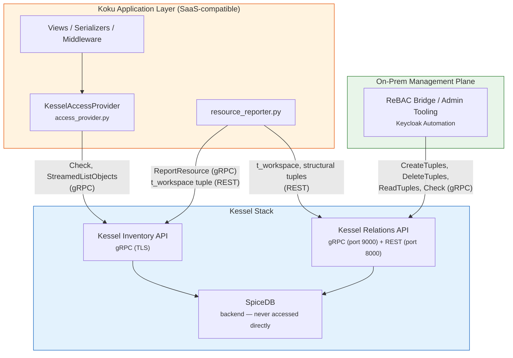
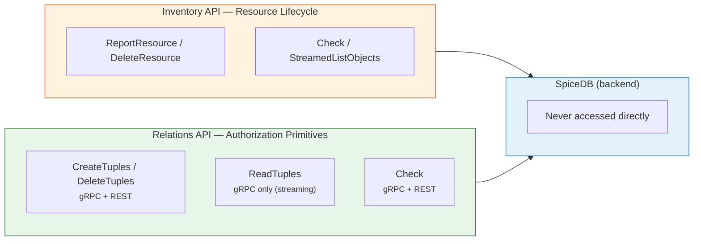
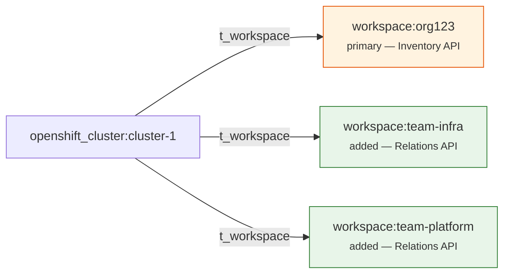
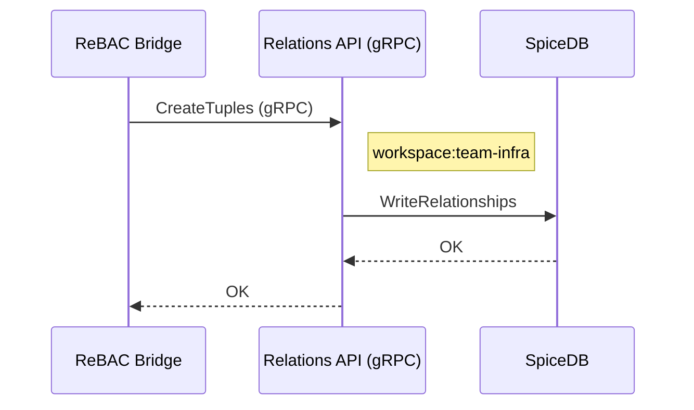
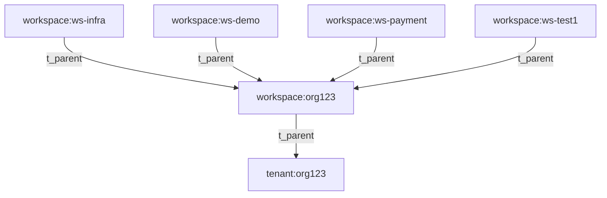

# ADR: On-Prem Workspace Management for Kessel Authorization

**Date**: 2026-03-02
**Status**: Proposed
**Authors**: Cost Management On-Prem Team
**Reviewers**: Kessel Team, Cost Management SaaS Team
**Related**: [kessel-ocp-integration.md](./kessel-ocp-integration.md), [FLPATH-3294](https://issues.redhat.com/browse/FLPATH-3294), [FLPATH-3319](https://issues.redhat.com/browse/FLPATH-3319), [ReBAC Bridge Design](./rebac-bridge-design.md)

---

## Table of Contents

- [Context](#context)
- [Problem Statement](#problem-statement)
- [Constraints](#constraints)
- [Decision](#decision)
- [Architecture Overview](#architecture-overview)
  - [Layer Separation](#layer-separation)
  - [Permission Resolution Flow](#permission-resolution-flow)
  - [Default Visibility Model](#default-visibility-model)
  - [Team-Based Access Grants](#team-based-access-grants)
  - [Cross-Team Resource Sharing](#cross-team-resource-sharing)
- [Workspace Hierarchy Design](#workspace-hierarchy-design)
- [Tuple Management: Who Writes What](#tuple-management-who-writes-what)
- [Re-Ingestion Safety](#re-ingestion-safety)
- [Resource Deletion and Multi-Workspace Cleanup](#resource-deletion-and-multi-workspace-cleanup)
- [Kessel API Layer Separation](#kessel-api-layer-separation)
  - [Why Two APIs, Not One](#why-two-apis-not-one)
  - [What Each Component Uses](#what-each-component-uses)
- [Inventory API Design Notes](#inventory-api-design-notes)
  - [Inventory API Single-Workspace-Per-Resource](#inventory-api-single-workspace-per-resource)
  - [Workspace Lifecycle via Relations API](#workspace-lifecycle-via-relations-api)
  - [Relations API ReadTuples — REST vs gRPC](#relations-api-readtuples--rest-vs-grpc)
  - [Business Case: Opt-In Access Model](#business-case-opt-in-access-model)
  - [Upstream Improvements Summary](#upstream-improvements-summary)
    - [Thin IAM Convenience Layer (Longer-Term)](#thin-iam-convenience-layer-longer-term)
- [Integration as First-Class Kessel Resource](#integration-as-first-class-kessel-resource)
  - [Computed Permissions and Structural Relationships](#computed-permissions-and-structural-relationships)
  - [Authorization Cascade Example](#authorization-cascade-example)
  - [Kessel Gap Inventory](#kessel-gap-inventory)
- [PRD12 Requirements Coverage](#prd12-requirements-coverage)
  - [Current Permissions — Full Coverage](#current-permissions--full-coverage)
  - [Intersection](#intersection)
  - [Inheritance](#inheritance)
  - [Scope and Relationships (Multi-Group Membership)](#scope-and-relationships-multi-group-membership)
  - [Future Expansion — Pre-Provisioned Schema](#future-expansion--pre-provisioned-schema)
  - [Future Expansion — Split Metering/Cost/Recommendations](#future-expansion--split-meteringcostrecommendations)
- [SaaS Compatibility Analysis](#saas-compatibility-analysis)
- [Alternatives Considered](#alternatives-considered)
- [Risks and Mitigations](#risks-and-mitigations)
- [Implementation Status](#implementation-status)
- [Open Questions](#open-questions)

---

## Context

Koku's on-prem deployment uses [Kessel](https://github.com/project-kessel) as its authorization backend, replacing the SaaS RBAC service that is not available outside cloud.redhat.com. The Kessel stack consists of:

- **SpiceDB**: The authorization engine (Zanzibar-inspired relationship-based access control)
- **Kessel Inventory API**: gRPC service for resource metadata and authorization queries (`Check`, `StreamedListObjects`, `ReportResource`, `DeleteResource`)
- **Kessel Relations API**: REST service for SpiceDB tuple management (create/delete relationships)

Koku's `KesselAccessProvider` ([access_provider.py](../../../koku/koku_rebac/access_provider.py)) queries the Inventory API to determine what resources a user can see. Koku's `resource_reporter` ([resource_reporter.py](../../../koku/koku_rebac/resource_reporter.py)) registers resources and creates SpiceDB `t_workspace` tuples that make resources discoverable.

The [ZED schema](../../../dev/kessel/schema.zed) defines the authorization model: resources belong to workspaces via `t_workspace` tuples, users are bound to workspaces via `role_binding` tuples, and permissions are computed by traversing these relationships.

**The missing piece**: how on-prem administrators manage **who can see which resources**. The current implementation assigns all resources to a single org-level workspace, making everything visible to all users with any role binding at that workspace. There is no mechanism for per-team or per-resource access control.

---

## Problem Statement

On-prem customers need the ability to:

1. **Restrict resource visibility** — Team A should see clusters A and B, Team B should see clusters B and C, admin should see all.
2. **Grant access via groups** — Access managed through Keycloak groups, not individual user tuples.
3. **Survive data re-ingestion** — When Koku processes new data for an existing cluster, it must not overwrite custom access assignments.
4. **Cross-team sharing** — A single resource must be visible to multiple teams without workspace hierarchy explosion.

These requirements must be met **without changing Koku's application layer** (`access_provider.py`, views, serializers, middleware), which must remain SaaS-compatible.

---

## Constraints

| Constraint | Rationale |
|---|---|
| **Koku's `KesselAccessProvider` must be unchanged** | Same code runs in SaaS and on-prem. It calls `StreamedListObjects` and `Check` — it must not know about workspace topology. |
| **ZED schema must be a superset of upstream `rbac-config`** | Existing definitions (`rbac/role`, `rbac/workspace`, etc.) are not modified. On-prem adds the `cost_management/integration` type and structural relations (`has_cluster`, `has_project`) to enable computed permissions. |
| **One `workspace_id` per resource in Kessel Inventory API** | `ReportResource` accepts a single `workspace_id` in representations. The Inventory API's contract is one workspace per resource. |
| **SpiceDB allows multiple `t_workspace` tuples per resource** | SpiceDB itself has no single-workspace constraint. Multiple `t_workspace` tuples are valid and permission resolution uses union (`+`). |
| **On-prem does not use Kessel's CDC pipeline** | The CDC-to-consumer pipeline that automatically creates tuples from Inventory API events is disabled on-prem. Koku writes tuples directly. |

---

## Decision

**Team Workspaces with Inheritance + Keycloak-Driven Automation + Pure Kessel APIs.**

All operations go through the Kessel stack — no component accesses SpiceDB
directly. The Kessel Inventory API handles resource lifecycle and
authorization queries; the Kessel Relations API handles RBAC primitive
tuple CRUD (workspaces, role bindings, groups, resource-to-workspace
assignments).

Specifically:

1. **Workspace hierarchy**: Create team workspaces as children of the org-level workspace. Resources are assigned to team workspaces. Workspace inheritance (`t_parent`) grants admin visibility into all child workspaces.

2. **Default visibility**: New resources are assigned to the org-level workspace by `resource_reporter.py`. Only users bound at the org-level workspace (admins) see newly registered resources. Regular users are bound at team workspaces and do not inherit upward.

3. **Team-based grants**: Admin assigns resources to team workspace(s) by writing `t_workspace` tuples via the Relations API gRPC. Team members (bound at the team workspace via `role_binding`) can then see those resources.

4. **Cross-team sharing**: A resource can have multiple `t_workspace` tuples (one per team workspace). The primary org-level tuple is managed by `resource_reporter.py` (via Inventory API). Additional team-workspace tuples are managed by admin tooling (via Relations API gRPC). The two never conflict.

5. **Re-ingestion safety**: The `org_id` comes from the cost management metrics operator and is immutable for a given cluster. Since `resource_reporter.py` always upserts the primary `t_workspace` tuple using the same `org_id`, re-ingestion is inherently idempotent. Admin-managed additional tuples (team workspace assignments) are never touched by `resource_reporter`.

6. **Keycloak automation**: On-prem admin tooling syncs Keycloak groups via the Relations API: group creation → workspace + role_binding tuples, group membership changes → `t_subject` / `t_member` tuple updates.

---

## Architecture Overview

### Layer Separation



The SaaS-compatible boundary separates code that runs identically in both environments (Koku application layer) from on-prem-specific admin operations (management plane). Koku's application layer has **zero awareness** of workspace topology, team workspaces, or Keycloak groups. All components interact with SpiceDB exclusively through Kessel APIs (Inventory API or Relations API).

**Which Kessel API for what:**

| Object type | Operation | Service | Protocol | Why |
|---|---|---|---|---|
| Resources (`cost_management/*`) | Report / delete | **Inventory API** | gRPC | Resource lifecycle — "this thing exists" |
| Resources (`cost_management/*`) | Check / list visible | **Inventory API** | gRPC | Authorization queries on inventory resources |
| Resources (`cost_management/*`) | Assign to team workspace | **Relations API** | gRPC | Authorization relationship — not a lifecycle event |
| RBAC primitives (`rbac/workspace`) | Create / delete / list | **Relations API** | gRPC | Workspaces are authorization constructs, not inventory |
| RBAC primitives (`rbac/role_binding`) | Create / delete | **Relations API** | gRPC | Authorization binding |
| RBAC primitives (`rbac/group`) | Add/remove members | **Relations API** | gRPC | Group membership |
| Any | Enumerate existing tuples | **Relations API** | gRPC | `ReadTuples` (streaming) |

### Permission Resolution Flow

When Koku calls `StreamedListObjects` for a user, SpiceDB traverses the relationship graph:

```
StreamedListObjects(resource_type="openshift_cluster", subject="rbac/principal:redhat/alice")

SpiceDB resolves:
  For each cost_management/openshift_cluster:
    → follow t_workspace → rbac/workspace
      → check cost_management_openshift_cluster_read permission
        → t_binding → role_binding (does alice match t_subject?)
          → t_granted → role (does role have the permission?)
        → t_parent → parent workspace (inherit and check recursively)

Returns: [cluster IDs where alice has read permission]
```

This resolution is identical regardless of whether the `t_workspace` tuple was created by `resource_reporter.py` (via Relations API REST) or by the ReBAC Bridge (via Relations API gRPC). SpiceDB does not distinguish tuple origin — both paths write to the same backend.

### Default Visibility Model

```
                     ┌──────────────────────┐
                     │  rbac/tenant:org123   │
                     └──────────┬───────────┘
                                │ t_platform
                     ┌──────────▼───────────┐
                     │ rbac/workspace:org123 │ ← admin role_binding (admin-user)
                     │  (org-level default)  │
                     └──────────┬───────────┘
                           t_parent │
                    ┌───────────┴───────────┐
         ┌──────────▼──────────┐  ┌─────────▼──────────┐
         │ workspace:team-infra│  │workspace:team-fin   │
         │                     │  │                     │
         │ role_binding:       │  │ role_binding:       │
         │   infra-group       │  │   finance-group     │
         └─────────────────────┘  └─────────────────────┘
```

**On resource registration** (`on_resource_created`):

```
cost_management/openshift_cluster:new-cluster
    #t_workspace → rbac/workspace:org123
```

At this point:
- **admin-user** (bound at `workspace:org123`): **CAN** see `new-cluster`
- **infra-member** (bound at `workspace:team-infra`): **CANNOT** see `new-cluster`
- **finance-member** (bound at `workspace:team-fin`): **CANNOT** see `new-cluster`

Inheritance flows **downward** (parent permissions available in children), not upward (child bindings do not grant access to parent resources).

### Team-Based Access Grants

Admin assigns `new-cluster` to `team-infra`:

```
Admin tooling → SpiceDB WriteRelationships:
    cost_management/openshift_cluster:new-cluster
        #t_workspace → rbac/workspace:team-infra   (additional tuple)
```

Now:
- **admin-user**: **CAN** see `new-cluster` (via org123 tuple, unchanged)
- **infra-member**: **CAN** see `new-cluster` (via team-infra tuple)
- **finance-member**: **CANNOT** see `new-cluster`

The original `t_workspace → org123` tuple remains. The admin tuple is additive.

### Cross-Team Resource Sharing

Admin also grants finance access to `new-cluster`:

```
Admin tooling → SpiceDB WriteRelationships:
    cost_management/openshift_cluster:new-cluster
        #t_workspace → rbac/workspace:team-fin     (third tuple)
```

Now:
- **admin-user**: **CAN** see `new-cluster` (via org123)
- **infra-member**: **CAN** see `new-cluster` (via team-infra)
- **finance-member**: **CAN** see `new-cluster` (via team-fin)

The resource has three `t_workspace` tuples. SpiceDB resolves all paths. `StreamedListObjects` returns `new-cluster` for all three users.

---

## Workspace Hierarchy Design

### Relationship Chain

```
rbac/tenant:org123
    │
    └── rbac/workspace:org123  (t_platform → tenant)
            │
            ├── rbac/workspace:team-infra  (t_parent → workspace:org123)
            │       │
            │       └── rbac/role_binding:rb-infra
            │               t_granted → rbac/role:ocp-viewer
            │               t_subject → rbac/group:infra-group#member
            │
            ├── rbac/workspace:team-fin  (t_parent → workspace:org123)
            │       │
            │       └── rbac/role_binding:rb-fin
            │               t_granted → rbac/role:ocp-viewer
            │               t_subject → rbac/group:finance-group#member
            │
            └── rbac/role_binding:rb-admin
                    t_granted → rbac/role:cost-admin
                    t_subject → rbac/principal:redhat/admin-user
```

### Why Inheritance Works for Admin

When `new-cluster` has `t_workspace → workspace:org123`, SpiceDB checks:

```
workspace:org123.cost_management_openshift_cluster_read
    = t_binding->cost_management_openshift_cluster_read   (rb-admin grants this)
    + t_parent->cost_management_openshift_cluster_read    (tenant-level, if any)
```

Admin's `role_binding:rb-admin` at `workspace:org123` grants the permission. Resources in child workspaces are also visible to admin because children include `t_parent->cost_management_openshift_cluster_read` which resolves up to `workspace:org123` where admin is bound.

### Why Team Members Cannot See Org-Level Resources

When `new-cluster` has only `t_workspace → workspace:org123`, SpiceDB checks permissions **on `workspace:org123`** (not on `workspace:team-infra`). The infra-member's binding is at `workspace:team-infra`, which is a **child**, not the resource's workspace. Child bindings do not propagate to parents.

The infra-member gains access only when the resource has a `t_workspace → workspace:team-infra` tuple, at which point SpiceDB checks permissions on `workspace:team-infra` where the binding exists.

---

## Tuple Management: Who Writes What

| Tuple | Written by | Kessel API | Protocol | When | SaaS-compatible? |
|---|---|---|---|---|---|
| `resource #t_workspace → workspace:org123` | `resource_reporter.py` | Relations API | REST | Resource creation / data ingestion | Yes |
| `resource #t_workspace → workspace:team-X` | ReBAC Bridge / admin tooling | Relations API | gRPC | Admin grants team access | On-prem only |
| `workspace:team-X #t_parent → workspace:org123` | ReBAC Bridge / admin tooling | Relations API | gRPC | Team workspace creation | On-prem only |
| `role_binding #t_granted → role` | ReBAC Bridge / admin tooling | Relations API | gRPC | Role assignment | On-prem only |
| `role_binding #t_subject → group#member` | ReBAC Bridge / Keycloak sync | Relations API | gRPC | Group binding | On-prem only |
| `group #t_member → principal` | ReBAC Bridge / Keycloak sync | Relations API | gRPC | User added to group | On-prem only |

| `integration #t_workspace → workspace:org123` | `resource_reporter.py` | Relations API | Source creation (via `ProviderBuilder`) | Yes |
| `integration #has_cluster → openshift_cluster` | `resource_reporter.py` | Relations API | Source creation (via `ProviderBuilder`) | On-prem only (no-op when backend != rebac) |
| `openshift_cluster #has_project → openshift_project` | `resource_reporter.py` | Relations API | Data ingestion (cluster info population) | On-prem only (no-op when backend != rebac) |

`resource_reporter.py` manages the primary org-level `t_workspace` tuples and structural relationship tuples (`has_cluster`, `has_project`). All workspace hierarchy, role bindings, and group management tuples are managed by the on-prem admin plane.

---

## Re-Ingestion Safety

When Koku processes new data for an existing cluster, `on_resource_created` is called again with the same `(resource_type, resource_id, org_id)`. The `org_id` comes from the **cost management metrics operator** running on the OCP cluster — it identifies which organization the cluster belongs to. This value is immutable: the same cluster always reports the same `org_id`.

### Why No Workspace Resolution Is Needed

The primary `t_workspace` tuple always uses `org_id` as the workspace. Since the metrics operator always sends the same `org_id` for a given cluster, re-ingestion upserts the identical tuple — effectively a no-op. There is no risk of overwriting a different workspace because the `org_id` never changes.

Admin-managed team workspace tuples (written via the Relations API gRPC) are completely separate from the primary tuple. `resource_reporter.py` does not know about them, does not query for them, and never modifies them.

### What happens during re-ingestion

| Tuple | Written by | Re-ingestion behavior |
|---|---|---|
| `cluster #t_workspace → workspace:org123` | `resource_reporter.py` | Upsert with same `org_id` — **idempotent no-op** |
| `cluster #t_workspace → workspace:team-infra` | ReBAC Bridge (Relations API gRPC) | **Untouched** — `resource_reporter` does not know about it |
| `cluster #t_workspace → workspace:team-fin` | ReBAC Bridge (Relations API gRPC) | **Untouched** — `resource_reporter` does not know about it |

This separation is inherent to the architecture: `resource_reporter.py` manages the **org-level primary tuple** (deterministic, always `org_id`), and the **admin tooling manages team assignments** (additive tuples via the Relations API). The two never conflict.

---

## Resource Deletion and Multi-Workspace Cleanup

When a resource's cost data is fully purged from PostgreSQL (retention expiry), `on_resource_deleted` removes the resource from both Kessel Inventory and SpiceDB. This must clean up **all** `t_workspace` tuples — including admin-managed ones for team workspaces — without needing to know which workspaces the resource was assigned to.

### How It Works

`_delete_resource_tuples()` in [resource_reporter.py](../../../koku/koku_rebac/resource_reporter.py#L316-L353) sends a filter-based DELETE to the Relations API:

```python
params = {
    "filter.resource_namespace": "cost_management",
    "filter.resource_type": resource_type,
    "filter.resource_id": resource_id,
}
# DELETE /api/authz/v1beta1/tuples?filter.*=...
```

The filter matches on `resource_namespace + resource_type + resource_id` only — it does **not** specify a relation or subject. This means the DELETE removes **all** tuples for that resource (`t_workspace`, `has_cluster`, `has_project`, etc.), regardless of which workspace they point to or what relation type they are.

### Deletion Sequence

```
on_resource_deleted("openshift_cluster", "cluster-prod", "org123")
│
├─ 1. DeleteResource (Inventory API gRPC)
│     Removes resource metadata from Kessel Inventory database.
│
├─ 2. _delete_resource_tuples("openshift_cluster", "cluster-prod")
│     Relations API DELETE with filter-by-resource-id.
│     Removes ALL t_workspace tuples:
│       ✗  cluster-prod #t_workspace → workspace:org123      (primary, written by resource_reporter)
│       ✗  cluster-prod #t_workspace → workspace:team-infra  (admin-managed)
│       ✗  cluster-prod #t_workspace → workspace:team-fin    (admin-managed)
│
└─ 3. KesselSyncedResource.delete()
      Removes the tracking row from Koku's database.
```

### Why This Is Correct

- **The resource no longer exists in Koku's data.** Once cost data is purged from PostgreSQL, there is nothing to query or display. The resource should not be discoverable by any user in any workspace.
- **No enumeration needed.** The filter-based DELETE handles any number of workspace assignments without Koku needing to track which workspaces the admin assigned. One API call cleans up everything.
- **Same behavior for orphan cleanup.** `cleanup_orphaned_kessel_resources()` follows the same pattern — iterates tracked resources for a provider and calls `_delete_resource_tuples` for each, which removes all workspace assignments.

### When Deletion Does NOT Happen

`on_resource_deleted` fires in two scenarios:

1. **Retention expiry**: When cost data is fully purged from PostgreSQL after retention expires
2. **Source deletion (integration only)**: When a source is deleted on-prem, `DestroySourceMixin.destroy()` calls `on_resource_deleted("integration", source_uuid, org_id)` — the integration resource represents the source itself and should be cleaned up

It does **not** fire for OCP clusters, nodes, or projects when a source is deleted — historical cost data must remain queryable until retention expires. It also does not fire for data re-processing or correction.
- An admin removes the resource from a specific workspace (that's a targeted tuple delete via admin tooling, not resource deletion)

This distinction is important: **admin workspace management (adding/removing team assignments) is separate from resource lifecycle (creation/deletion)**. Admin operations modify individual `t_workspace` tuples. Resource deletion removes the resource entirely.

---

## Kessel API Layer Separation

The Kessel stack exposes two API layers, each designed for a distinct
purpose. All on-prem operations go through one of these layers — no
component accesses SpiceDB directly.



| Layer | Purpose | Used by | Protocol |
|---|---|---|---|
| **Inventory API** | Resource lifecycle ("what exists") + authorization queries | Koku (`KesselAccessProvider`, `resource_reporter.py`) | gRPC (TLS) |
| **Relations API** | RBAC primitive CRUD ("who can do what") | ReBAC Bridge, `kessel-admin.sh`, `resource_reporter.py` (tuples) | gRPC (port 9000) + REST (port 8000) |
| **SpiceDB** | Backend engine | Neither — accessed only through the APIs above | — |

### Why Two APIs, Not One

The distinction matters because resources and authorization primitives
have different lifecycles and ownership:

- **Resources** (`cost_management/openshift_cluster`, `integration`, etc.)
  are created by data pipelines (Koku's `resource_reporter.py`). The
  Inventory API tracks their existence, sets their primary workspace, and
  provides authorization queries (`Check`, `StreamedListObjects`).

- **Authorization primitives** (`rbac/workspace`, `rbac/role_binding`,
  `rbac/group`) are created by admin operations. They define the
  authorization topology — who can see what. The Relations API manages
  these as raw tuples.

- **Team-workspace assignments** (`resource #t_workspace → workspace:team-X`)
  are authorization decisions, not resource lifecycle events. The resource
  already exists (reported via Inventory API). Assigning it to a team is
  an authorization change — the correct layer is the Relations API.

### What Each Component Uses

| Component | Inventory API | Relations API |
|---|---|---|
| **Koku `KesselAccessProvider`** | `Check`, `StreamedListObjects` (gRPC) | — |
| **Koku `resource_reporter.py`** | `ReportResource`, `DeleteResource` (gRPC) | `CreateTuples`, `DeleteTuples` (REST) for `t_workspace` and structural tuples |
| **ReBAC Bridge** | — | `CreateTuples`, `DeleteTuples`, `ReadTuples`, `Check` (gRPC) |
| **`kessel-admin.sh`** | — | `CreateTuples`, `DeleteTuples`, `Check` (REST) |

The Inventory API remains in the stack because `KesselAccessProvider`
depends on it for `StreamedListObjects` and `Check`. The Relations API
handles all RBAC primitive management and team-workspace assignments.

---

## Inventory API Design Notes

This section documents two Inventory API design characteristics that are
relevant to the on-prem architecture. Neither requires SpiceDB bypass —
both are handled through the Relations API, which is the correct Kessel
layer for authorization primitive management.

### Inventory API Single-Workspace-Per-Resource

**Layer**: Kessel Inventory API (`SetWorkspace()` in
[`kessel.go`](https://github.com/project-kessel/inventory-api/blob/main/internal/authz/kessel/kessel.go))

**What it is**: When `ReportResource` is called, the Inventory API's
`SetWorkspace()` method creates exactly one `t_workspace` tuple for the
resource. The code contains a `TODO: remove previous tuple for workspace`
comment, indicating the **intended** design is to _replace_ the workspace
assignment, not accumulate multiple ones.

**Why it matters for cross-team sharing**: Per-team resource visibility
requires a resource to belong to multiple team workspaces simultaneously:



The Inventory API's `ReportResource` creates the primary org-level tuple.
It cannot create the additional team-workspace tuples.

**Why this is not a blocker**: Team-workspace `t_workspace` tuples are
authorization relationships, not resource lifecycle events. The correct
Kessel layer for these is the **Relations API**, which can create any tuple
valid in the schema — including multiple `t_workspace` tuples on the same
resource. The [ReBAC Bridge](./rebac-bridge-design.md) uses
`CreateTuples` (gRPC) for this purpose.

**Risk to monitor**: Today, `SetWorkspace()` does not yet implement the
removal TODO — multiple `t_workspace` tuples coexist in SpiceDB. If the
Kessel team implements the TODO, `ReportResource` would delete tuples it
didn't create (the team-workspace tuples written by the Relations API).
This would break cross-team sharing. However, this risk only applies if
the Inventory API starts deleting tuples based on `t_workspace` relation
filters broadly rather than scoping the deletion to tuples it originally
created. The ideal upstream fix is a dedicated `AssignWorkspace` RPC
(tracked in [FLPATH-3405](https://issues.redhat.com/browse/FLPATH-3405)).

**Our approach**: Koku's `resource_reporter.py` uses `ReportResource` for
the primary workspace tuple (org-level, one per resource — safe). The
ReBAC Bridge uses the Relations API gRPC to create additional team-workspace
tuples. Each layer uses the correct Kessel API for its purpose.

### Workspace Lifecycle via Relations API

**Layer**: Kessel Inventory API (service definition)

The Inventory API has no `CreateWorkspace`, `ListWorkspaces`, or
`DeleteWorkspace` endpoints. Its protobuf service definition
([`inventory_service.proto`](https://github.com/project-kessel/inventory-api/blob/main/api/kessel/inventory/v1beta2/inventory_service.proto))
exposes resource-oriented RPCs (`ReportResource`, `DeleteResource`,
`Check`, `StreamedListObjects`) but does not manage `rbac/workspace`
objects.

**Why this is not a constraint**: Workspaces (`rbac/workspace`) are
authorization primitives, not inventory resources. They belong to the
**Relations API** layer, not the Inventory API. Creating a workspace means
writing tuples — `t_parent` for hierarchy, `t_binding` for role bindings —
which is exactly what the Relations API's `CreateTuples` does:



The [ReBAC Bridge](./rebac-bridge-design.md) handles workspace lifecycle
(create, list, delete, set parent) entirely through the Relations API gRPC.
The `kessel-admin.sh` script does the same via the Relations API REST
endpoints (`POST /api/authz/v1beta1/tuples`).

If the Kessel team adds dedicated workspace management endpoints in the
future (tracked in [FLPATH-3405](https://issues.redhat.com/browse/FLPATH-3405)),
the bridge could migrate to them, but the current Relations API approach is
architecturally correct — not a workaround.

### Relations API `ReadTuples` — REST vs gRPC

The Relations API exposes `ReadTuples` as a **server-streaming gRPC** RPC.
The HTTP gateway (Kratos) does not register routes for streaming RPCs, so
`GET /api/authz/v1beta1/tuples` returns **404** over REST. This only
affects `curl`-based tooling (`kessel-admin.sh`). The ReBAC Bridge uses
the gRPC endpoint (port 9000) for `ReadTuples`, which works correctly.

An upstream fix (non-streaming HTTP endpoint for tuple reads) is desirable
for general REST tooling and is tracked in
[FLPATH-3405](https://issues.redhat.com/browse/FLPATH-3405).

### Business Case: Opt-In Access Model

The on-prem deployment requires an **opt-in** access model: users see
nothing until an administrator explicitly grants them access to specific
resources via team workspaces. This is the core justification for
multi-workspace support and the reason the Inventory API's
single-workspace-per-resource assumption is a risk.

#### Current State (flat — everyone sees everything)

```
resource_reporter.py (Koku):
  cost_management/openshift_cluster:cluster-A  #t_workspace → workspace:org123
  cost_management/openshift_cluster:cluster-B  #t_workspace → workspace:org123

kessel-admin.sh (bootstrap):
  workspace:org123                  #t_parent  → tenant:org123
  workspace:org123                  #t_binding → role_binding:org123--alice--cost-administrator
  workspace:org123                  #t_binding → role_binding:org123--bob--cost-administrator

Result: Alice sees cluster-A AND cluster-B.  Bob sees cluster-A AND cluster-B.
        No scoping is possible.
```

All resources land in the org workspace. All users are bound at the org
workspace. SpiceDB's union semantics on `t_workspace→read` grant every
user access to every resource. This is suitable for single-team
deployments but unacceptable for multi-team environments.

#### Reference Scenario (opt-in — groups, workspaces, namespace scoping)

The following scenario is implemented by `kessel-admin.sh demo` and exercises
all three access dimensions: role-based, workspace-based, and group-based.

**Resources** (created by Koku's `resource_reporter` → Inventory API):

| Cluster | Namespaces | Primary workspace |
|---|---|---|
| cluster-a | demo | org123 |
| cluster-b | demo, payment | org123 |
| cluster-c | test, payment | org123 |

**Workspace hierarchy** (created by admin / ReBAC Bridge → Relations API):



**Groups and membership:**

| Group | Members | Workspace | Role |
|---|---|---|---|
| demo | test1 | ws-demo | cost-openshift-viewer |
| infra | test2 | ws-infra | cost-openshift-viewer |
| payment | test3 | ws-payment | cost-openshift-viewer |

**Direct user bindings:**

| User | Workspace | Role | Reason |
|---|---|---|---|
| admin | org123 + tenant | cost-administrator | Org admin — sees everything |
| test1 | ws-test1 | cost-openshift-viewer | Personal access to Cluster B |

**Resource → team workspace assignments** (additional `t_workspace` tuples):

| Workspace | Cluster-level | Namespace-level | Rationale |
|---|---|---|---|
| ws-infra | cluster-a, cluster-c | demo-a, test-c, payment-c | Full Clusters A and C |
| ws-demo | cluster-a | demo-a | Full Cluster A |
| ws-payment | — | payment-b, payment-c | Namespace-level only |
| ws-test1 | cluster-b | demo-b, payment-b | Full Cluster B (test1 direct) |

**Expected verification matrix:**

| Resource | admin | test1 | test2 | test3 |
|---|---|---|---|---|
| cluster-a | read | read (ws-demo) | read (ws-infra) | DENIED |
| cluster-b | read | read (ws-test1) | DENIED | read (has_project) |
| cluster-c | read | DENIED | read (ws-infra) | read (has_project) |
| ns demo-a | read | read (ws-demo) | read (ws-infra) | DENIED |
| ns demo-b | read | read (ws-test1) | DENIED | DENIED |
| ns payment-b | read | read (ws-test1) | DENIED | read (ws-payment) |
| ns test-c | read | DENIED | read (ws-infra) | DENIED |
| ns payment-c | read | DENIED | read (ws-infra) | read (ws-payment) |

**Key schema behaviors demonstrated:**

1. **Workspace scoping** — users only see resources assigned to their workspace(s)
2. **Group access** — group members inherit workspace bindings via
   `role_binding#t_subject → group#member`
3. **Direct access** — test1 has personal workspace `ws-test1` for Cluster B
4. **Namespace-level scoping** — test3 sees payment namespaces but not
   demo/test namespaces in the same clusters
5. **`has_project` cascade** — test3 sees clusters B and C through namespace
   access (`openshift_cluster.read` includes `has_project->read`)
6. **Koku needs zero changes** — `resource_reporter.py` is unchanged

#### Why Koku Needs Zero Changes

| Component | Why it works as-is |
|---|---|
| `resource_reporter.py` | Still reports resources with `workspace_id = org_id`. The primary `t_workspace → workspace:org_id` tuple is unchanged. Team-workspace tuples are additive. |
| `access_provider.py` | Calls `StreamedListObjects(resource_type, relation, subject)` — this is workspace-agnostic. SpiceDB evaluates all `t_workspace` tuples on each resource and returns it if any path grants the permission. |
| Schema (`schema.zed`) | `permission read = t_workspace->...read + ...` uses **union** semantics. Multiple `t_workspace` relations are evaluated — if any workspace grants the user access, the resource is visible. |
| Koku business logic | Never references workspace IDs. It asks "can user X see resource Y?" and Kessel resolves it through the SpiceDB graph. |

#### What Changes (Authorization Layer Only)

| Component | Change |
|---|---|
| `kessel-admin.sh` | `do_sync` only binds admin users at org level. New commands: `create-workspace`, `assign-resource`, `grant`, `grant-group`, `add-group-member`, `link-resource`. Full demo via `kessel-admin.sh demo`. |
| ReBAC Bridge | Provides REST API for team workspace CRUD, resource assignment, group and user binding. Delegates to Relations API gRPC. |
| Admin workflow | Opt-in: admin creates team workspaces and groups → assigns resources to workspaces → grants groups/users to workspaces. Users start with zero access. |

#### Why Multi-Workspace Per Resource Is Required

The opt-in model requires each resource to have **at minimum two**
`t_workspace` tuples:

1. **Primary** (`workspace:org_id`) — created by `resource_reporter.py`
   via the Inventory API. Makes the resource visible to org-level admins.
2. **Team** (`workspace:team-X`) — created by the ReBAC Bridge or
   `kessel-admin.sh` via the Relations API. Makes the resource visible
   to users scoped to that team.

If the Inventory API's `SetWorkspace()` TODO is implemented to enforce
one-workspace-per-resource, it would delete the team-workspace tuples on
every `ReportResource` call, breaking the opt-in model entirely. This is
the **single critical constraint** that must not change, and the primary
justification for requesting an `AssignWorkspace` RPC on the Inventory
API (tracked in [FLPATH-3405](https://issues.redhat.com/browse/FLPATH-3405)).

### Upstream Improvements Summary

| Area | Current state | Ideal upstream change | Impact | Tracked |
|---|---|---|---|---|
| Multi-workspace per resource | Relations API handles team-workspace tuples correctly | `AssignWorkspace` RPC on Inventory API (eliminates risk of future `SetWorkspace` cleanup breaking team tuples) | Eliminates risk, not a blocker | [FLPATH-3405](https://issues.redhat.com/browse/FLPATH-3405) |
| Workspace lifecycle | Relations API `CreateTuples`/`DeleteTuples`/`ReadTuples` handles all operations | Dedicated workspace CRUD endpoints (convenience, not necessity) | Convenience, not a blocker | [FLPATH-3405](https://issues.redhat.com/browse/FLPATH-3405) |
| Tuple reads over REST | `ReadTuples` gRPC works; REST returns 404 | Non-streaming HTTP endpoint for tuple reads | Convenience for REST tooling, not a blocker | [FLPATH-3405](https://issues.redhat.com/browse/FLPATH-3405) |
| Thin IAM convenience layer | Every consumer (SaaS `insights-rbac`, on-prem ReBAC Bridge) re-implements the same tuple-construction logic for standard `rbac/*` patterns | Kessel-native semantic API for common IAM operations (see below) | Eliminates cross-consumer duplication, not a blocker | [FLPATH-3405](https://issues.redhat.com/browse/FLPATH-3405) |

**None of these are blockers.** The on-prem architecture operates entirely
within the Kessel stack using the correct API layer for each operation
type. The upstream improvements would add convenience and reduce risk but
are not required for the architecture to function.

#### Thin IAM Convenience Layer (Longer-Term)

Kessel's Relations API exposes generic tuple CRUD — it has no knowledge of
the `rbac/*` schema semantics. Every consumer ends up building the same
IAM management layer on top of raw tuple operations:

- **SaaS**: `insights-rbac` (Django, PostgreSQL, Kafka, Redis)
- **On-prem**: ReBAC Bridge (Go)
- **Any future consumer**: same boilerplate

The common operations are always the same tuple patterns derived from the
KSL `rbac/*` schema:

| Operation | Tuples constructed |
|---|---|
| `CreateWorkspace(id, parent)` | `workspace:id#t_parent → workspace:parent` |
| `DeleteWorkspace(id)` | delete all tuples on `workspace:id` |
| `AssignWorkspace(resource, workspace)` | `resource#t_workspace → workspace:id` |
| `RemoveWorkspace(resource, workspace)` | delete that `t_workspace` tuple |
| `CreateRoleBinding(workspace, role, subject)` | `role_binding#t_granted → role`, `role_binding#t_subject → subject`, `workspace#t_binding → role_binding` |
| `DeleteRoleBinding(workspace, role, subject)` | delete those 3 tuples |
| `AddGroupMember(group, principal)` | `group#t_member → principal` |
| `RemoveGroupMember(group, principal)` | delete that `t_member` tuple |
| `ListWorkspaceBindings(workspace)` | `ReadTuples` filter on `workspace` `t_binding` |
| `ListGroupMembers(group)` | `ReadTuples` filter on `group` `t_member` |

A Kessel-native thin IAM API implementing these standard KSL tuple
patterns would:

1. **Eliminate duplicate tuple-construction logic** across all consumers
2. **Subsume the workspace CRUD and `AssignWorkspace` RPC** requests above
3. **Keep Kessel as an authorization engine** (no identity storage, no
   metadata, no Keycloak integration)
4. **Leave app-specific concerns to consuming apps** (UI, display metadata,
   business rules, IdP integration)

This is **not** a full IAM system — it is a semantic convenience layer
over the Relations API for standard `rbac/*` schema patterns. App-specific
bridges (like the ReBAC Bridge) would still exist for REST compatibility,
metadata storage, and IdP integration, but their core tuple logic would
delegate to this API instead of reimplementing it.

---

## Integration as First-Class Kessel Resource

### Why This Type Exists

The `cost_management/integration` resource type is a **Koku-API-specific construct** that does not exist in the upstream Kessel or KSL schema. It was created to solve a visibility problem unique to Koku's data model:

Koku exposes a `/api/cost-management/v1/sources/` endpoint (the "Integrations" page in the UI) that lists configured data sources. This endpoint is **independent** from the cost report endpoints — it queries the `Sources` Django model, not the cost data tables. Without a dedicated Kessel resource backing it, the sources endpoint had no way to determine per-user source visibility:

- **Before**: The endpoint used `SettingsAccessPermission`, a blunt workspace-level capability check that grants all-or-nothing access to all sources. This made per-team source filtering impossible.
- **After**: Each source is registered as a `cost_management/integration` resource in Kessel. The sources endpoint calls `StreamedListObjects("integration")` to get the list of source UUIDs the user can see, then filters the queryset by `source_uuid__in=...`.

**The integration resource is purely a computed visibility resource.** No role bindings are ever created on it. Its `read` permission is entirely derived from the structural containment chain (`has_cluster → has_project → t_workspace`). Admin never grants access to an integration directly — they grant access to namespaces or clusters, and SpiceDB computes integration visibility automatically.

This is a new construct that must be documented as a Kessel gap: the upstream schema has no concept of application-specific "container" resources whose visibility is computed from child resource access. If Kessel adopts a similar pattern, the on-prem integration type could converge with the upstream schema.

### Why Not Business Logic Instead?

An alternative was considered: skip the integration resource type entirely and compute source visibility in Koku's business logic by joining the Sources table against the user's cluster/account access lists (the "Option A" approach). For OCP-only, this produces the same result with less schema machinery.

However, Koku supports multiple provider types — AWS (accounts, organizational units), Azure (subscription GUIDs), GCP (accounts, projects), and OCP (clusters). Each has different resource types and different join logic. Without the integration type, the sources endpoint would need type-specific filtering for every provider:

```python
# Without integration type — grows with each provider type
ocp_sources = Sources.filter(source_type="OCP", koku_uuid__in=cluster_access)
aws_sources = Sources.filter(source_type="AWS", koku_uuid__in=aws_account_access)
azure_sources = Sources.filter(source_type="Azure", koku_uuid__in=azure_sub_access)
# ... and so on for every new provider type
```

With the integration type, the sources endpoint is always one generic query regardless of provider type:

```python
# With integration type — provider-agnostic, never changes
integration_access = user.access["integration"]["read"]
return Sources.objects.filter(source_uuid__in=integration_access)
```

The provider-specific containment (`has_cluster`, `has_account`, `has_subscription`) lives in the SpiceDB schema, not in Koku's business logic. This keeps the sources-api code generic and ensures new provider types only require schema additions, not application code changes.

### Computed Permissions and Structural Relationships

The [ZED schema](../../../dev/kessel/schema.zed) defines cross-type structural relations that enable permission cascading:

```
cost_management/integration
    ├── has_cluster → cost_management/openshift_cluster
    │                     ├── has_project → cost_management/openshift_project
    │                     └── read permission cascades from has_project->read
    └── read permission cascades from has_cluster->read
```

This hierarchy means:
- **Project access** cascades upward to cluster visibility (via `has_project->read`)
- **Cluster visibility** cascades upward to integration visibility (via `has_cluster->read`)
- Admin only needs to grant namespace-level access; integration and cluster visibility is computed by SpiceDB

Structural tuples are written by Koku during data ingestion:

| Structural Tuple | Written by | When |
|---|---|---|
| `integration:<source_uuid>#has_cluster → openshift_cluster:<provider_uuid>` | `ProviderBuilder.create_provider_from_source` | OCP source creation |
| `openshift_cluster:<provider_uuid>#has_project → openshift_project:<name>` | `_report_ocp_resources_to_kessel` | Data ingestion (cluster info population) |

These tuples are deterministic and idempotent: the same source always produces the same structural relationships. Re-ingestion is safe because `create_structural_tuple` uses upsert mode.

### Authorization Cascade Example

**Scenario**: Admin grants user `test` access to namespace `payments`.

**Admin actions** (management plane only):
```
openshift_project:payments → t_workspace → rbac/workspace:team-a
rbac/role_binding:rb-test binds test to cost-openshift-viewer on team-a
```

**SpiceDB automatically computes** (via schema, zero admin action):
- `test` can view `openshift_project:payments` (direct workspace permission)
- `test` can view `openshift_cluster:cluster-A` (because `cluster-A#has_project → payments`)
- `test` can view `openshift_cluster:cluster-B` (because `cluster-B#has_project → payments`)
- `test` can view `integration:source-A` (because `source-A#has_cluster → cluster-A`)
- `test` can view `integration:source-B` (because `source-B#has_cluster → cluster-B`)

**Result**: User sees source-A and source-B on the integrations page; cost reports show only `payments` namespace data from both clusters.

**What test cannot see**: Other namespaces, cluster-wide costs, or integrations that don't contain the `payments` namespace.

### Kessel Gap Inventory

The following operations use the Relations API (not the Inventory API) because no higher-level semantic API exists. Some also represent upstream Kessel gaps:

| Gap | Operation | Current Kessel API | Proposed Improvement |
|---|---|---|---|
| **Workspace management** | Create/delete `rbac/workspace` resources and `t_parent` relations | Relations API `CreateTuples`/`DeleteTuples` (gRPC) | Dedicated workspace CRUD endpoints (convenience) |
| **Role binding management** | Bind roles to users/groups on workspaces | Relations API `CreateTuples`/`DeleteTuples` (gRPC) | Role binding CRUD endpoints (convenience) |
| **Multi-workspace assignment** | Assign resources to additional team workspaces | Relations API `CreateTuples` (gRPC) | `AssignWorkspace` RPC on Inventory API (reduces risk) |
| **Tuple enumeration** | List existing tuples for admin queries | Relations API `ReadTuples` (gRPC — streaming) | Non-streaming HTTP endpoint for REST tooling |
| **Structural relationships** | Write `has_cluster`, `has_project` cross-type relations | Relations API `CreateTuples` (REST) | `ReportResource` should support declaring structural relationships alongside metadata |
| **Schema deployment** | Deploy/update the `.zed` schema | SpiceDB `SPICEDB_SCHEMA_FILE` env var (deployment-time) | Schema management API or versioned schema registry |
| **CDC pipeline** | Auto-create `t_workspace` tuples from Inventory events | Disabled on-prem; Koku writes tuples via Relations API directly | On-prem CDC support or explicit `ReportResource` option to create tuples synchronously |
| **Computed permissions** | Cross-type permission resolution (`has_cluster->read`, `has_project->read`) | Custom schema additions to the on-prem `.zed` file | Upstream KSL schema support for structural resource relationships |
| **Application-specific computed-visibility resources** | `cost_management/integration` — visibility derived from child resource access | Custom `integration` type in on-prem `.zed` schema; Koku registers via Inventory API | Upstream support for application-defined "container" resource types with computed visibility |

> **Note**: Schema deployment is the only operation that touches SpiceDB directly (via the `SPICEDB_SCHEMA_FILE` environment variable at container startup). This is a deployment-time operation handled by `deploy-kessel.sh`, not a runtime operation. All runtime operations go through Kessel APIs.

### Kessel API Authentication Hardening

The Relations API and Inventory API both support JWT-based authentication but ship with auth **disabled** by default. In the initial on-prem deployment, inter-service calls rely on network-level isolation (ClusterIP services, no external Routes) as the sole access control.

#### Unauthenticated Paths (before hardening)

| Caller | Target API | Protocol | Risk |
|---|---|---|---|
| Koku `resource_reporter.py` | Relations API | HTTP REST `:8000` | Any pod in the cluster can write/delete authorization tuples |
| Koku `client.py` | Inventory API | gRPC `:9000` | Any pod can perform Check/StreamedListObjects/ReportResource |
| Inventory API | Relations API | gRPC `:9000` | Internal authz calls are unauthenticated |

#### Authentication Design

When `kessel.auth.enabled=true` in the Helm chart (or `KESSEL_API_AUTH_ENABLED=true` for deploy scripts):

- **Two dedicated Keycloak service account clients** are created via the `KeycloakRealmImport` CR in `deploy-rhbk.sh`:
  - `cost-management-koku` — used by Koku pods for Relations API (HTTP) and Inventory API (gRPC) calls
  - `cost-management-inventory` — used by the Inventory API pod for its outbound Relations API (gRPC) calls
- **Relations API** enables JWT validation via `ENABLEAUTH=true` + `JWKSURL` pointing to Keycloak's JWKS endpoint
- **Inventory API** switches from `allow-unauthenticated: true` to an OIDC authenticator chain, and enables `enable-oidc-auth: true` for its outbound Relations API calls with SA credentials
- **Koku** uses a thread-safe `TokenProvider` ([`koku_rebac/kessel_auth.py`](../../../koku/koku_rebac/kessel_auth.py)) that acquires tokens via client_credentials grant and caches them until 30s before expiry
- **SpiceDB** remains secured by preshared key (unchanged)

#### Deployment

Kessel API authentication is **mandatory** — there is no unauthenticated mode. The deployment scripts enforce this:
1. `deploy-rhbk.sh` creates the Keycloak service account clients and extracts their secrets
2. `install-helm-chart.sh` copies `kessel-koku-client` to the cost-onprem namespace and `kessel-inventory-client` to the kessel namespace — **fails hard** if either secret is missing
3. `deploy-kessel.sh` configures Relations API with `ENABLEAUTH=true` and Inventory API with OIDC authentication — **fails hard** if the Inventory client secret is missing
4. Koku pods always set `KESSEL_AUTH_ENABLED=True` and mount the `kessel-koku-client` secret

#### Operational Rotation of Kessel Credentials

Token refresh and secret rotation are different operations:

- **JWT access tokens** are rotated automatically in-process by
  `TokenProvider` (`client_credentials` flow, refresh before expiry).
- **OIDC client secrets** are loaded from Kubernetes Secrets at process
  startup and require rollout/restart to take effect after rotation.

Recommended rotation runbook:

1. Create/rotate the client secret in Keycloak for
   `cost-management-koku` and/or `cost-management-inventory`.
2. Update Kubernetes Secrets used by Koku and Inventory API pods.
3. Roll out dependent deployments so processes reload environment and
   mounted secrets.
4. Verify:
   - Koku logs show successful token refresh and no auth errors
   - Inventory↔Relations calls succeed with auth enabled
   - sample Kessel permission checks return expected results
5. Revoke old secret only after verification passes.

This ADR documents the required operational order; it does not claim
hot-reload of client secrets inside already-running pods.

---

## PRD12 Requirements Coverage

This section maps each requirement from [PRD12 COST-7292](https://docs.google.com/document/d/1kZoRADs0-wAalFDC4MkSFV8RxpXb1YER1UXNn-5EvdE/edit?tab=t.0#heading=h.4tv3gbbbc9rd) ("Kessel integration") to the current Kessel on-prem implementation, confirming full coverage of existing RBAC v1 capabilities and documenting the plan for future expansions.

### Current Permissions — Full Coverage

PRD12 requires that **no current RBAC v1 permission capability is lost**. All 11 resource-type read permissions plus cost model and settings read/write are supported:

| PRD Permission | Kessel Resource Type | In [Schema](../../../dev/kessel/schema.zed) | In [Access Provider](../../../koku/koku_rebac/access_provider.py) | One / Many / All |
|---|---|---|---|---|
| Read AWS account | `aws_account` | Yes | Yes | Wildcard via org workspace; specific via team workspace tuples |
| Read AWS organizational unit | `aws_organizational_unit` | Yes | Yes | Same |
| Read Azure subscription | `azure_subscription_guid` | Yes | Yes | Same |
| Read GCP account | `gcp_account` | Yes | Yes | Same |
| Read GCP project | `gcp_project` | Yes | Yes | Same |
| Read OpenShift cluster | `openshift_cluster` | Yes | Yes | Same |
| Read OpenShift node | `openshift_node` | Yes | Yes | Same |
| Read OpenShift project | `openshift_project` | Yes | Yes | Same |
| Read/Write cost model | `cost_model` | Yes | Yes | Same |
| Read/Write settings | `settings` | Yes | Yes | Same |

**"Automagically handled"** (PRD language for dynamic resource discovery): When a user has wildcard (`*`) access via the org-level workspace, new resources appear automatically because `resource_reporter.py` assigns them `t_workspace → org-workspace` on creation. For specific-resource access via team workspaces, new resources require explicit admin assignment — identical to RBAC v1's behavior with resource definitions.

### Intersection

PRD12 requires: *"it must be possible to say a user (group) only has permissions on namespace X when running on cluster Y on AWS account Z, excluding everything else."*

**This is handled identically to RBAC v1** — it is a Koku application-layer concern, not an authorization backend concern.

`StreamedListObjects` returns per-type access lists:
```
user.access = {
    "openshift.cluster": {"read": ["cluster-Y"]},
    "openshift.project": {"read": ["namespace-X"]},
    "aws.account":       {"read": ["account-Z"]},
}
```

Koku's views and serializers apply the intersection in SQL WHERE clauses: cost data must match the user's allowed cluster IDs AND project names AND account IDs. This logic is unchanged between RBAC v1 and Kessel — the access provider populates the same `user.access` dict regardless of backend.

**No SpiceDB-level intersection is needed.** SpiceDB grants access per type independently. The intersection semantics live in Koku's data query layer, where they have always lived.

### Inheritance

PRD12 requires: *"if you have read permissions on one cluster, you can also see all of the nodes and projects in that cluster."*

This is handled by **two complementary mechanisms**:

1. **Downward inheritance (Koku business logic, unchanged from RBAC v1)**: When a user has cluster-level access, Koku's SQL queries return all nodes and projects for that cluster. The `openshift_node` and `openshift_project` resource definitions in SpiceDB include the cluster-level permissions in their `read` computation:

```
definition cost_management/openshift_project {
    permission read = ... + t_workspace->cost_management_openshift_cluster_read + ...
}
```

This means: if a user has `openshift_cluster_read` on the resource's workspace, they can also read projects in that workspace. This is a SpiceDB-level inheritance that mirrors the RBAC v1 behavior.

2. **Upward cascade (structural relations, on-prem addition)**: Access to a project cascades upward to cluster and integration visibility via `has_project->read` and `has_cluster->read`. This is the reverse direction — it enables the sources endpoint to show integrations that contain resources the user can access.

Both directions are covered. Downward is the same as RBAC v1. Upward is a new on-prem addition.

### Scope and Relationships (Multi-Group Membership)

PRD12 explicitly states: *"Limiting one resource to one workspace is not acceptable since it would lead to the creation of artificial workspaces only for the purpose of ReBAC."*

And gives the example:
- Role R1: clusters A, B, C
- Role R2: clusters D, E, F
- Role R3: clusters C, D

**This is a core design decision** of this ADR: multiple `t_workspace` tuples per resource in SpiceDB. Cluster C gets `t_workspace → team-1` and `t_workspace → team-3`. Cluster D gets `t_workspace → team-2` and `t_workspace → team-3`. SpiceDB resolves all paths via union (`+`).

See [Cross-Team Resource Sharing](#cross-team-resource-sharing) for the full design.

### Future Expansion — Pre-Provisioned Schema

PRD12 mentions future resource types and structural relationships. The [ZED schema](../../../dev/kessel/schema.zed) pre-provisions these so they are ready when Koku onboards each provider or feature:

**OpenShift Virtualization VMs** (PRD12: *"Explicit read permission on OpenShift Virtualization VMs"*):

```
definition cost_management/openshift_vm {
    relation t_workspace: rbac/workspace
    permission read = ... (inherits from project, node, cluster, and all-level permissions)
}

definition cost_management/openshift_project {
    relation has_vm: cost_management/openshift_vm    ← VM access cascades upward
}
```

Full permission chain is wired through `rbac/role`, `rbac/role_binding`, `rbac/tenant`, and `rbac/workspace`. When Koku adds VM support, only application code (resource reporting, access provider type map) needs updating — the schema is ready.

**AWS structural containment** (integration → accounts, OUs → accounts):

```
definition cost_management/integration {
    relation has_account: cost_management/aws_account
    relation has_organizational_unit: cost_management/aws_organizational_unit
}

definition cost_management/aws_organizational_unit {
    relation has_account: cost_management/aws_account    ← account access cascades to OU visibility
}
```

**Azure structural containment** (integration → subscriptions):

```
definition cost_management/integration {
    relation has_subscription: cost_management/azure_subscription_guid
}
```

**GCP structural containment** (integration → accounts → projects):

```
definition cost_management/integration {
    relation has_gcp_account: cost_management/gcp_account
    relation has_gcp_project: cost_management/gcp_project
}

definition cost_management/gcp_account {
    relation has_project: cost_management/gcp_project    ← project access cascades to account visibility
}
```

These structural relations enable the same computed-permission cascade pattern proven with OCP: granting access to a leaf resource (e.g., a GCP project) automatically makes the parent resources (GCP account, integration) visible to that user. No code changes to Koku's application layer are needed — only `resource_reporter.py` additions to write the structural tuples during provider-specific data ingestion.

### Future Expansion — Split Metering/Cost/Recommendations

PRD12 mentions: *"it should be possible to say 'this user is able to see the cost data for a project but not the resource optimization recommendations' (or viceversa)."*

Currently, a single `read` permission on a resource type grants access to all data aspects (metering, cost, recommendations). To split these, the recommended approach is **aspect-based capability types** — orthogonal to resource access, modeled similarly to `settings`:

**Recommended design: Workspace-scoped capability resources**

```
definition cost_management/metering_capability {
    relation t_workspace: rbac/workspace
    permission read = t_workspace->cost_management_metering_capability_read + ...
}

definition cost_management/cost_capability {
    relation t_workspace: rbac/workspace
    permission read = t_workspace->cost_management_cost_capability_read + ...
}

definition cost_management/recommendations_capability {
    relation t_workspace: rbac/workspace
    permission read = t_workspace->cost_management_recommendations_capability_read + ...
}
```

**How it works**: A user's effective access is the intersection of two dimensions:

| Dimension | What it controls | How it's checked |
|---|---|---|
| **Resource access** (existing) | Which clusters/projects/accounts can the user see? | `StreamedListObjects` per resource type |
| **Aspect capability** (new) | What data types can the user see for those resources? | `StreamedListObjects("metering_capability")` etc. |

The Koku view layer checks both: *"does the user have access to this cluster?"* AND *"does the user have the metering capability?"*

**Per-workspace granularity**: Because capabilities are workspace-scoped, an admin can grant different aspect access per team:
- `team-full`: role with metering + cost + recommendations capabilities
- `team-cost-only`: role with cost capability only

A user in `team-cost-only` who has access to cluster-A (via that workspace) sees cost data but not metering or recommendations for cluster-A.

**Why this approach**:

| Alternative | Problem |
|---|---|
| New permission verbs per resource type (`read_metering`, `read_cost`, `read_recommendations`) | 3 verbs × 10+ types = 30+ new role relations. Schema explosion. |
| Application-level flags (no SpiceDB involvement) | Not Kessel-native. Cannot be managed by the admin tooling alongside resource access. |
| Capability types (recommended) | 3 new types following the `settings` pattern. Koku views already separate metering/cost/recommendations endpoints. The intersection with resource access happens naturally. |

**Implementation status**: Not yet implemented. The schema additions are minimal (3 new types + role/workspace propagation), and no existing definitions need modification. This can be added when Koku's roadmap prioritizes split data access.

### PRD12 Summary Matrix

| PRD Requirement | Status | Mechanism |
|---|---|---|
| Read AWS account (one / many / all, dynamic) | **Covered** | `aws_account` type + `StreamedListObjects` |
| Read AWS organizational unit (one / many / all, dynamic) | **Covered** | `aws_organizational_unit` type + `StreamedListObjects` |
| Read Azure subscription (one / many / all, dynamic) | **Covered** | `azure_subscription_guid` type + `StreamedListObjects` |
| Read GCP account (one / many / all, dynamic) | **Covered** | `gcp_account` type + `StreamedListObjects` |
| Read GCP project (one / many / all, dynamic) | **Covered** | `gcp_project` type + `StreamedListObjects` |
| Read OpenShift cluster (one / many / all, dynamic) | **Covered** | `openshift_cluster` type + `StreamedListObjects` |
| Read OpenShift node (one / many / all, dynamic) | **Covered** | `openshift_node` type + `StreamedListObjects` |
| Read OpenShift project (one / many / all, dynamic) | **Covered** | `openshift_project` type + `StreamedListObjects` |
| Read/Write cost models | **Covered** | `cost_model` type + `StreamedListObjects` |
| Read/Write settings | **Covered** | `settings` type + `SettingsAccessPermission` / `IsAuthenticated` |
| Intersection (namespace X on cluster Y on account Z) | **Covered** | Koku SQL layer applies per-type access list intersection (unchanged from RBAC v1) |
| Inheritance (cluster access → see nodes/projects) | **Covered** | SpiceDB schema (child types include parent-level permissions) + Koku SQL layer |
| Multi-group resource membership (one resource in multiple roles/groups) | **Covered** | Multiple `t_workspace` tuples per resource in SpiceDB |
| Dynamic add/delete of resources | **Covered** | `resource_reporter.py` creates/deletes tuples during ingestion; wildcard roles auto-include new resources |
| Workspace restriction (1:1) is unacceptable | **Addressed** | Core design decision: multiple `t_workspace` tuples, documented in ADR |
| OpenShift Virtualization VMs | **Schema ready** | `openshift_vm` type + `openshift_project#has_vm` pre-provisioned; awaiting Koku application code |
| AWS structural containment | **Schema ready** | `integration#has_account`, `aws_organizational_unit#has_account` pre-provisioned |
| Azure structural containment | **Schema ready** | `integration#has_subscription` pre-provisioned |
| GCP structural containment | **Schema ready** | `integration#has_gcp_account`, `integration#has_gcp_project`, `gcp_account#has_project` pre-provisioned |
| Split metering / cost / recommendations | **Designed** | Aspect-based capability types (see above); schema additions needed when Koku prioritizes |
| API-only vs UI-only users | **Future** | Application-layer concern (route middleware); no SpiceDB changes needed |

---

## SaaS Compatibility Analysis

| Aspect | SaaS | On-Prem | Compatible? |
|---|---|---|---|
| `KesselAccessProvider` code | Unchanged | Unchanged | **Yes** |
| `StreamedListObjects` / `Check` | Via Inventory API | Via Inventory API | **Yes** |
| `resource_reporter.py` | `on_resource_created` writes primary tuple | Same — always uses `org_id` from metrics operator | **Yes** — identical upsert behavior |
| Workspace topology | Single org-level workspace (RBAC v2 manages hierarchy) | Team workspace hierarchy (admin tooling manages) | **Compatible** — Koku is unaware of topology |
| Multiple `t_workspace` per resource | Not used (CDC creates one) | Used for cross-team sharing | **SpiceDB-compatible** — Inventory API unaffected (reads, not writes) |
| ZED schema | Canonical `rbac-config` | Canonical schema + resource definitions + `integration` type + structural relations (`has_cluster`, `has_project`) | **Compatible** — additions are on-prem only, do not modify upstream definitions |
| `integration` resource type | Not used | Sources registered as Kessel `integration` resources; visibility computed via structural relations | **Safe** — `StreamedListObjects("integration")` returns empty on SaaS (no resources registered). Sources view ONPREM-gated. |
| Structural tuples (`has_cluster`, `has_project`) | Not used | Written during source creation and data ingestion via Relations API | **Safe** — `create_structural_tuple` is a no-op when `AUTHORIZATION_BACKEND != "rebac"` |
| Role/group management | RBAC v2 API | Admin tooling / Keycloak sync → SpiceDB | **Compatible** — different management plane, same SpiceDB model |

**Key insight**: The divergence spans two layers: the **tuple management plane** (how tuples are created and by whom) and the **schema layer** (on-prem adds structural relations for computed permissions). Koku's shared application code remains generic — the sources-api changes are gated by `settings.ONPREM`, and the access provider addition (`integration` type) is a no-op on SaaS.

---

## Alternatives Considered

### Alternative 1: Single Workspace (No Restriction)

All resources in the org workspace, all users bound there.

- **Rejected because**: No per-team access control. Every user sees every resource. Does not meet customer requirements.

### Alternative 2: Sub-Workspace Reassignment Only

Move resources from org workspace to sub-workspaces. No multiple `t_workspace` tuples.

- **Rejected because**: Cannot share a resource across sibling workspaces without workspace proliferation (need a dedicated workspace for every combination of teams). E.g., for 3 teams sharing different subsets: `team-A-only`, `team-B-only`, `team-C-only`, `team-A-B`, `team-A-C`, `team-B-C`, `team-A-B-C` = 7 workspaces.

### Alternative 3: Direct Group-to-Resource Relations (Schema Extension)

Add `t_viewer: rbac/principal | rbac/group#member` relation to resource definitions.

- **Rejected because**: Requires schema changes that diverge from upstream `rbac-config`. Would need Kessel team approval for a non-standard relation type. Workspace model handles the same use case without schema changes.

### Alternative 4: Resource-Level Role Bindings

Create a role_binding per resource, not per workspace.

- **Rejected because**: Role bindings are scoped to workspaces in the Kessel model, not to individual resources. Would require schema redesign.

### Alternative 5: Kessel Relations API for All Operations

Use the Relations API for both `resource_reporter` and admin operations.

- **Accepted**: All operations go through Kessel APIs. `resource_reporter.py` uses the Inventory API (`ReportResource`) for resource lifecycle and the Relations API (REST) for tuples. The ReBAC Bridge uses the Relations API (gRPC) for all RBAC primitive management. See [Kessel API Layer Separation](#kessel-api-layer-separation).

---

## Risks and Mitigations

| Risk | Severity | Mitigation |
|---|---|---|
| **Multiple `t_workspace` tuples diverge from Kessel Inventory API contract** | Medium | Only the ReBAC Bridge creates additional team-workspace tuples (via Relations API gRPC). `resource_reporter.py` writes one tuple per resource (Kessel-compatible). Inventory API reads are unaffected — `StreamedListObjects` and `Check` resolve through SpiceDB regardless of tuple count. |
| **Inventory API `SetWorkspace` TODO may delete team-workspace tuples** | Low | If the Kessel team implements the `TODO: remove previous tuple for workspace`, `ReportResource` could delete tuples created by the Relations API. Mitigated by: (a) the TODO targets tuples created by the Inventory API, not arbitrary `t_workspace` tuples; (b) on-prem controls the Kessel version; (c) tracked in [FLPATH-3405](https://issues.redhat.com/browse/FLPATH-3405) for a proper `AssignWorkspace` RPC. |
| **Workspace hierarchy management complexity** | Medium | Keycloak-driven automation (Option E) handles workspace/binding lifecycle. Admin tooling provides CLI and API for manual operations. |
| **Re-ingestion writes a duplicate tuple** | Negligible | `on_resource_created` upserts with the same `org_id` every time — idempotent no-op at the SpiceDB level. |
| **Schema drift between on-prem and upstream `rbac-config`** | Medium | On-prem schema is a superset: adds resource type definitions ([FLPATH-3319](https://issues.redhat.com/browse/FLPATH-3319)), the `integration` type, and structural relations (`has_cluster`, `has_project`). No existing definitions are modified. Tracked in [zed-schema-upstream-delta.md](./zed-schema-upstream-delta.md). |
| **Structural relations diverge from upstream schema** | Medium | `has_cluster` and `has_project` are on-prem additions enabling computed permissions. These are documented as Kessel gaps and proposed for upstream adoption. If upstream adopts them, the on-prem schema converges. If not, the additions remain isolated to on-prem. |

---

## Implementation Status

| Component | Status | Location |
|---|---|---|
| `KesselSyncedResource` tracking model | **Implemented** | [models.py](../../../koku/koku_rebac/models.py) |
| `on_resource_created()` — primary `t_workspace` tuple (always `org_id`) | **Implemented** | [resource_reporter.py](../../../koku/koku_rebac/resource_reporter.py) |
| `on_resource_deleted()` — cleanup primary tuple | **Implemented** | [resource_reporter.py](../../../koku/koku_rebac/resource_reporter.py) |
| `create_structural_tuple()` — cross-type relations | **Implemented** | [resource_reporter.py](../../../koku/koku_rebac/resource_reporter.py) |
| `integration` resource reporting on source create | **Implemented** | [provider_builder.py](../../../koku/api/provider/provider_builder.py) |
| `integration` resource deletion on source destroy | **Implemented** | [sources/api/view.py](../../../koku/sources/api/view.py) |
| `has_project` structural tuples during ingestion | **Implemented** | [ocp_report_db_accessor.py](../../../koku/masu/database/ocp_report_db_accessor.py) |
| `integration` in access provider type map | **Implemented** | [access_provider.py](../../../koku/koku_rebac/access_provider.py) |
| `SourcesAccessPermission` (integration-based) | **Implemented** | [sources_access.py](../../../koku/api/common/permissions/sources_access.py) |
| Sources queryset filter by integration access | **Implemented** | [sources/api/view.py](../../../koku/sources/api/view.py) |
| `AccountSettings` read access for ONPREM | **Implemented** | [api/settings/views.py](../../../koku/api/settings/views.py) |
| ZED schema — `integration` type + structural relations | **Implemented** | [schema.zed](../../../dev/kessel/schema.zed) |
| Unit tests (create, delete, idempotency, structural tuples) | **Implemented** | [test_resource_reporter.py](../../../koku/koku_rebac/test/test_resource_reporter.py), [test_sources_access.py](../../../koku/api/common/permissions/test/test_sources_access.py) |
| Django migration | **Implemented** | [0001_initial.py](../../../koku/koku_rebac/migrations/0001_initial.py) |
| Admin tooling (workspace CRUD, Relations API gRPC) | **Not started** | [rebac-bridge-design.md](./rebac-bridge-design.md) |
| Keycloak group sync automation | **Not started** | — |
| Admin API endpoints | **Not started** | — |

---

## Open Questions

1. **Kessel team review**: Does the multiple `t_workspace` approach for cross-team sharing conflict with any planned Kessel Inventory API changes?

2. **Admin tooling delivery**: Should the admin tooling be a standalone CLI, a Koku management command, or a Helm chart hook? What's the right UX for on-prem administrators?

3. **Keycloak sync mechanism**: Push (Keycloak webhook → sync service) or pull (periodic reconciliation loop)? What Keycloak event types are available?

4. **Default workspace for new resources**: Should new resources be assigned to the org-level workspace (admin-only visibility, current implementation) or to a configurable default team workspace?

5. **Resource deletion cleanup**: When `on_resource_deleted` fires, it deletes ALL tuples for the resource (including admin-managed `t_workspace`, `has_cluster`, `has_project`, etc.) via a filter on `resource_namespace + resource_type + resource_id` without specifying a relation or workspace subject. This is correct: if the resource's cost data has been purged from PostgreSQL, it should not remain discoverable in any workspace. No code changes needed.
