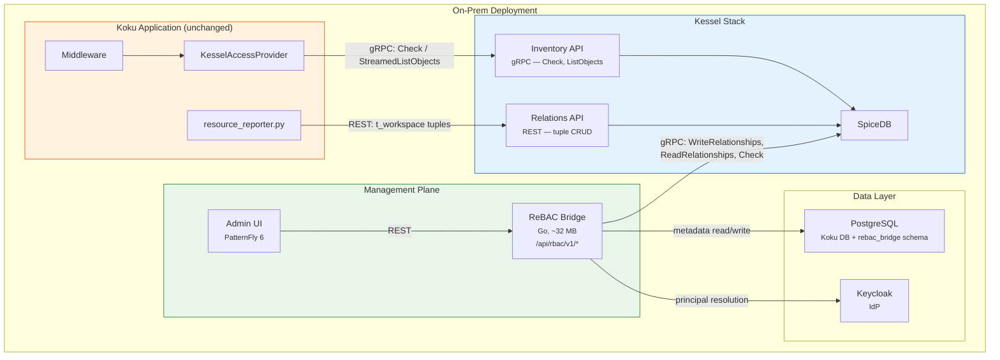
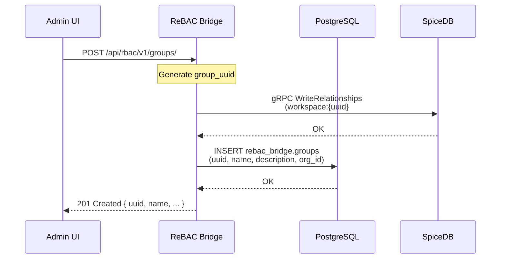
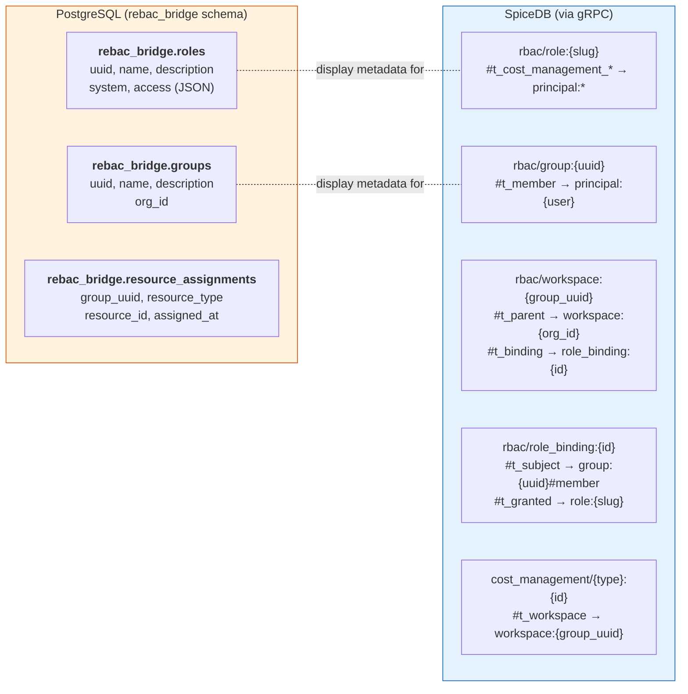
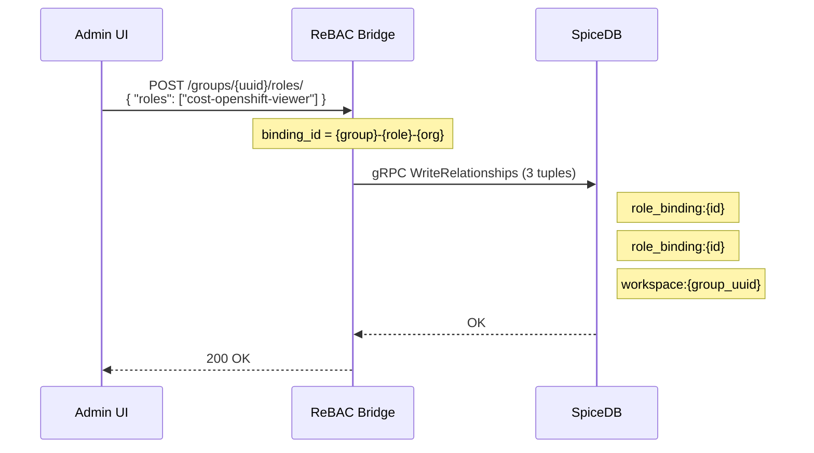
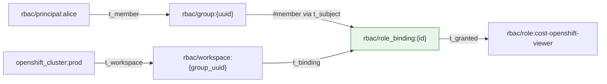
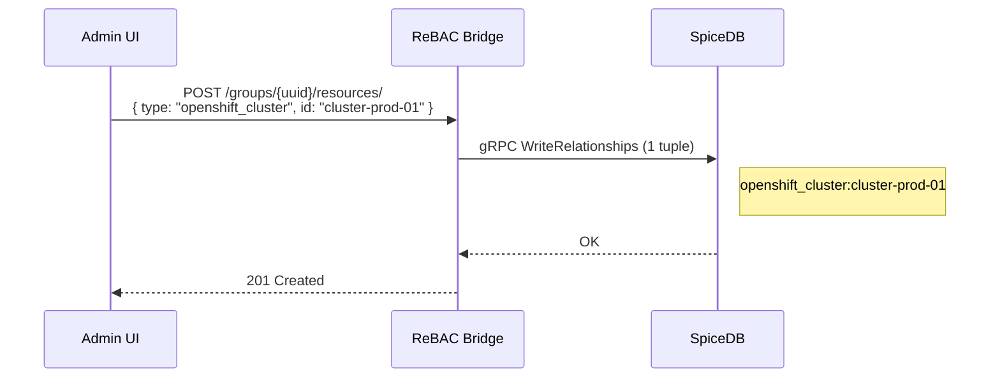
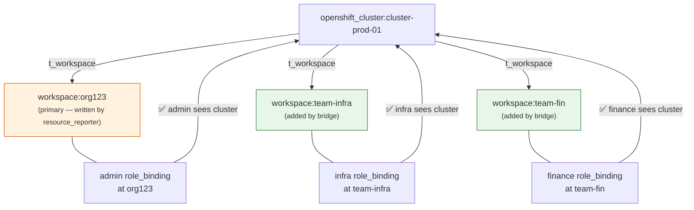
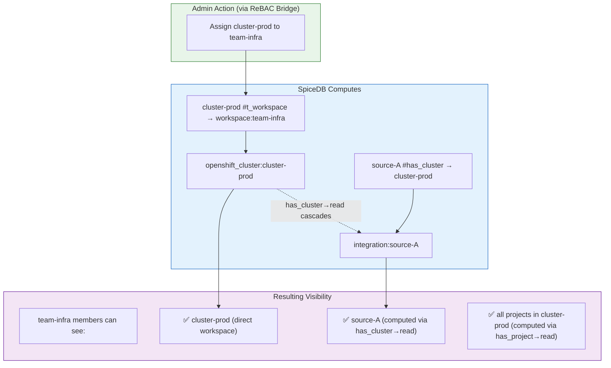
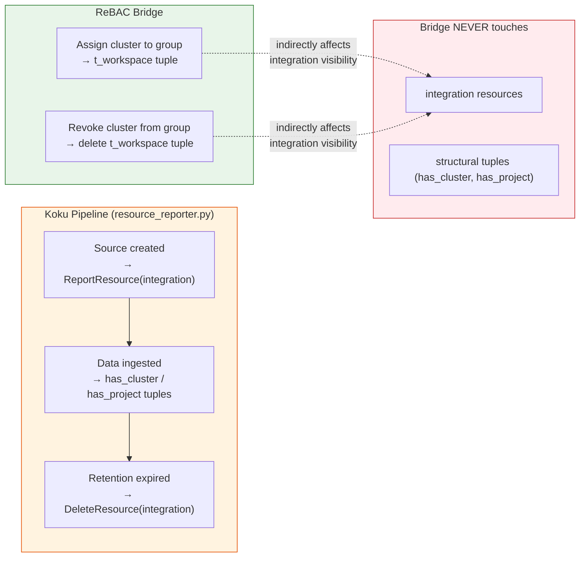
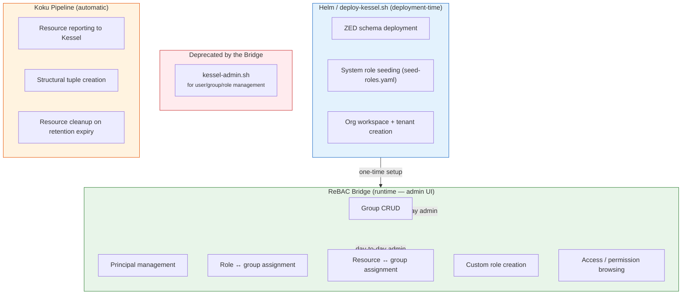

# Design Document: ReBAC Bridge Service for Koku On-Prem

**Date**: 2026-03-05
**Status**: Draft
**Authors**: Cost Management On-Prem Team
**Related**:
- [On-Prem Workspace Management ADR](./onprem-workspace-management-adr.md)
- [On-Prem Authorization Backend](./onprem-authorization-backend.md)
- [insights-rbac Kessel On-Prem Feasibility](./insights-rbac-kessel-onprem-feasibility.md)
- [rbac-config Reuse for On-Prem](./rbac-config-reuse-for-onprem.md)
- [Kessel OCP Detailed Design](./kessel-ocp-detailed-design.md)

---

## Table of Contents

- [Context and Motivation](#context-and-motivation)
- [Problem Statement](#problem-statement)
- [Decision](#decision)
- [Goals and Non-Goals](#goals-and-non-goals)
- [Architecture Overview](#architecture-overview)
  - [Component Diagram](#component-diagram)
  - [Request Flow](#request-flow)
  - [Workspace Abstraction](#workspace-abstraction)
- [API Surface](#api-surface)
  - [Roles](#roles)
  - [Groups](#groups)
  - [Group Principals](#group-principals)
  - [Group Roles](#group-roles)
  - [Group Resources](#group-resources)
  - [Principals](#principals)
  - [Access and Permissions](#access-and-permissions)
- [Data Model](#data-model)
  - [PostgreSQL Metadata Tables](#postgresql-metadata-tables)
  - [SpiceDB as Source of Truth](#spicedb-as-source-of-truth)
  - [What Lives Where](#what-lives-where)
- [Translation Layer: API to SpiceDB Tuples](#translation-layer-api-to-spicedb-tuples)
  - [SpiceDB Client](#spicedb-client)
  - [Group Creation](#group-creation)
  - [Role Assignment to Group](#role-assignment-to-group)
  - [Resource Assignment to Group](#resource-assignment-to-group)
  - [Principal Management](#principal-management)
  - [Access Resolution](#access-resolution)
- [Consistency Model](#consistency-model)
  - [Write Ordering Principle](#write-ordering-principle)
  - [Per-Operation Consistency Strategy](#per-operation-consistency-strategy)
  - [Background Reconciler](#background-reconciler)
- [Authentication and Authorization](#authentication-and-authorization)
- [Role Seeding](#role-seeding)
- [Deployment](#deployment)
  - [Resource Footprint](#resource-footprint)
  - [Configuration](#configuration)
  - [Health Checks](#health-checks)
- [Integration Resource Lifecycle](#integration-resource-lifecycle)
  - [What the Bridge Does NOT Manage](#what-the-bridge-does-not-manage)
  - [How Admin Actions Affect Integration Visibility](#how-admin-actions-affect-integration-visibility)
  - [Integration Lifecycle Summary](#integration-lifecycle-summary)
- [Management Boundary: Bridge vs Scripts vs Helm](#management-boundary-bridge-vs-scripts-vs-helm)
- [Relationship to Existing Components](#relationship-to-existing-components)
  - [Koku Application Layer](#koku-application-layer)
  - [Kessel Stack](#kessel-stack)
  - [insights-rbac-ui Extraction](#insights-rbac-ui-extraction)
- [Development Plan](#development-plan)
- [Risks and Mitigations](#risks-and-mitigations)
- [Disposability](#disposability)
- [Open Questions](#open-questions)

---

## Context and Motivation

Koku's on-prem deployment uses [Kessel](https://github.com/project-kessel) (SpiceDB) as its authorization backend. The authorization data plane — how Koku checks permissions and discovers visible resources — is fully implemented via `KesselAccessProvider` ([access_provider.py](../../../koku/koku_rebac/access_provider.py)).

The missing piece is the **management plane**: how on-prem administrators manage roles, groups, users, and resource access assignments. Currently, management is limited to:

- **`kessel-admin.sh`**: A CLI tool for operators comfortable with SpiceDB tuple semantics.
- **Helm migration jobs**: Declarative role seeding during deployment.

These tools require deep knowledge of SpiceDB tuple structure and are unsuitable for day-to-day administration by non-technical operators. The [insights-rbac-ui](https://github.com/RedHatInsights/insights-rbac-ui) provides a proven admin UI in SaaS, but the analysis in the [feasibility study](./insights-rbac-kessel-onprem-feasibility.md) concluded that deploying insights-rbac on-prem introduces significant infrastructure overhead (PostgreSQL, Redis, Kafka, Principal Proxy) and that the UI is tightly coupled to the SaaS shell (`insights-chrome`).

This document describes a lightweight Go service — the **ReBAC Bridge** — that exposes insights-rbac v1 compatible REST endpoints backed by SpiceDB, enabling the UI team to extract and reuse insights-rbac-ui components with minimal adaptation.

---

## Problem Statement

On-prem administrators need to:

1. **Manage groups** — create teams, add/remove members.
2. **Manage roles** — view available roles, create custom roles with specific permissions.
3. **Assign roles to groups** — grant a group a set of permissions.
4. **Assign resources to groups** — control which clusters, accounts, and projects a team can see.
5. **Browse users and permissions** — view who has access to what.

These operations must:

- Translate into SpiceDB tuple CRUD operations via direct [SpiceDB gRPC](https://github.com/authzed/authzed-go).
- Expose REST endpoints compatible with insights-rbac v1 to maximize UI code reuse.
- Have minimal memory and infrastructure footprint (this service is temporary).
- Not require Kafka, Debezium, or insights-rbac deployment.

---

## Decision

Build a **standalone Go microservice** that:

1. Exposes insights-rbac v1 compatible REST endpoints for roles, groups, principals, and permissions.
2. Adds new endpoints for group-level resource assignments (not in insights-rbac v1).
3. Uses a thin PostgreSQL schema (in Koku's existing database) for display metadata (role names, group descriptions).
4. Communicates with SpiceDB directly via gRPC for all authorization tuple operations.
5. Resolves principals from Keycloak.

### Why Go

| Concern | Go | Python (Django) |
|---|---|---|
| Memory at idle | ~10-20 MB | ~80-150 MB (Django + gunicorn) |
| Startup time | <1s | 5-15s (Django migrations, app loading) |
| Dependencies | Single static binary | Python runtime, pip packages, migrations |
| Disposability | Delete binary, done | Uninstall Django app, clean up migrations |
| HTTP/REST | `net/http` stdlib | Django REST Framework |
| PostgreSQL | `pgx/v5` | Django ORM |

The service is intentionally temporary — it will be replaced when a permanent management UI solution is available (potentially ACM-provided or a Kessel-native admin interface). Go's low footprint and simple deployment model minimize the commitment.

---

## Goals and Non-Goals

### Goals

- insights-rbac v1 API compatibility for roles, groups, principals, access, and permissions endpoints.
- Group-level resource assignment (teams see specific resources).
- SpiceDB as the single source of truth for authorization decisions.
- Minimal infrastructure: reuse Koku's PostgreSQL, no new databases or message brokers.
- Low memory footprint (<64 MB).

### Non-Goals

- Full insights-rbac v2 API (workspaces are internal, not exposed).
- Kessel Inventory API integration (the bridge talks directly to SpiceDB, not Inventory).
- SaaS deployment (this service is on-prem only).
- Long-term maintenance (explicitly designed to be replaced).

---

## Architecture Overview

### Component Diagram



**Key separation**: Koku's request-path authorization (`KesselAccessProvider`) talks to the Kessel Inventory API via gRPC. The ReBAC Bridge talks to SpiceDB directly via gRPC. They share SpiceDB as the underlying data store but are otherwise completely decoupled.

### Request Flow

Example: creating a group.



Note the write ordering: SpiceDB first (authorization), PostgreSQL second (display metadata). If the SpiceDB write succeeds but PostgreSQL fails, an orphaned workspace exists (harmless — reconciler cleans up). If the SpiceDB write fails, nothing is created. See [Consistency Model](#consistency-model).

### Workspace Abstraction

Kessel workspaces (`rbac/workspace`) are internal authorization primitives — they are **not exposed** in the ReBAC Bridge API. The bridge abstracts workspace management behind group-level operations:

| Admin action | ReBAC Bridge translates to |
|---|---|
| Create group "team-infra" | 1. Generate UUID<br/>2. Create `rbac/workspace:{uuid}` + `t_parent → workspace:{org_id}` in SpiceDB<br/>3. Create `rebac_bridge.groups` row in PostgreSQL |
| Delete group "team-infra" | 1. Delete `rebac_bridge.groups` row (PG first)<br/>2. Delete role bindings on workspace (SpiceDB)<br/>3. Delete resource assignments (`t_workspace` tuples pointing to workspace)<br/>4. Delete `t_parent` tuple<br/>5. Delete workspace<br/>6. Delete `rbac/group:{uuid}` tuples |
| Assign resource to group | Create `resource #t_workspace → rbac/workspace:{group-workspace}` tuple |
| Remove resource from group | Delete `resource #t_workspace → rbac/workspace:{group-workspace}` tuple |

The admin thinks in terms of "teams and resources." The bridge handles the workspace plumbing.

---

## API Surface

Base path: `/api/rbac/v1/`

All endpoints require an `x-rh-identity` header (base64-encoded identity JSON, same format as Koku). The bridge validates the caller's admin permissions before allowing write operations (see [Authentication and Authorization](#authentication-and-authorization)).

All list endpoints support insights-rbac v1 pagination parameters (`limit`, `offset`, `order_by`) and return the standard pagination envelope (`meta.count`, `links.first/previous/next/last`, `data[]`). This is required for UI compatibility — the extracted insights-rbac-ui components expect paginated responses.

### Roles

Roles represent named permission bundles. System roles (seeded from [rbac-config](./rbac-config-reuse-for-onprem.md)) are read-only. Custom roles can be created.

| Method | Path | Description |
|---|---|---|
| GET | `/roles/` | List all roles (system + custom) |
| GET | `/roles/{uuid}/` | Get role details with permissions |
| POST | `/roles/` | Create custom role |
| PUT | `/roles/{uuid}/` | Update custom role |
| DELETE | `/roles/{uuid}/` | Delete custom role (system roles cannot be deleted) |

**Response format** (insights-rbac v1 compatible):

```json
{
  "uuid": "cost-administrator",
  "name": "Cost Administrator",
  "display_name": "Cost administrator",
  "description": "Perform any available operation on cost management resources.",
  "system": true,
  "created": "2026-01-01T00:00:00Z",
  "modified": "2026-01-01T00:00:00Z",
  "access": [
    {
      "permission": "cost-management:*:*",
      "resourceDefinitions": []
    }
  ]
}
```

**Implementation**:

- System roles: read from `rebac_bridge.roles` (seeded at startup from [seed-roles.yaml](../../../dev/kessel/seed-roles.yaml)).
- Custom roles: CRUD in `rebac_bridge.roles` + SpiceDB tuple creation for the role's permission relations.
- Custom role creation writes tuples: `rbac/role:{slug}#t_cost_management_{type}_{verb} → rbac/principal:*` for each permission.

### Groups

Groups represent teams of users. Each group has an implicit SpiceDB workspace used for scoping role bindings and resource assignments.

| Method | Path | Description |
|---|---|---|
| GET | `/groups/` | List all groups |
| POST | `/groups/` | Create group |
| GET | `/groups/{uuid}/` | Get group details |
| PUT | `/groups/{uuid}/` | Update group metadata |
| DELETE | `/groups/{uuid}/` | Delete group (cascades: role bindings, resource assignments, workspace) |

**On creation**, the bridge creates (SpiceDB first, PostgreSQL second — see [write ordering](#write-ordering-principle)):

1. `rbac/workspace:{uuid}` with `t_parent → rbac/workspace:{org_id}` (SpiceDB)
2. `rbac/group:{uuid}` (SpiceDB — implicit on first relation write)
3. `rebac_bridge.groups` row (PostgreSQL)

The `t_parent` relation ensures that org-level admins (bound at the org workspace) inherit visibility into all resources assigned to this group's workspace. See the [workspace hierarchy design](./onprem-workspace-management-adr.md#workspace-hierarchy-design) in the ADR.

### Group Principals

Manage group membership. Members are resolved from Keycloak and stored as SpiceDB `t_member` tuples on the group.

| Method | Path | Description |
|---|---|---|
| GET | `/groups/{uuid}/principals/` | List group members |
| POST | `/groups/{uuid}/principals/` | Add principals to group |
| DELETE | `/groups/{uuid}/principals/` | Remove principals from group |

**Add principal** creates:

```
rbac/group:{group_uuid}#t_member → rbac/principal:redhat/{username}
```

**Remove principal** deletes that tuple.

The bridge validates that the principal exists in Keycloak before creating the tuple. The `redhat/` prefix is a fixed convention from the upstream Kessel principal format (matching what `KesselAccessProvider` uses in `access_provider.py`). It is not derived from the Keycloak realm name.

### Group Roles

Assign roles to groups. This creates a role binding scoped to the group's workspace.

| Method | Path | Description |
|---|---|---|
| GET | `/groups/{uuid}/roles/` | List roles assigned to group |
| POST | `/groups/{uuid}/roles/` | Assign roles to group |
| DELETE | `/groups/{uuid}/roles/` | Remove roles from group |

**Assign role to group** creates three tuples per role:

```
rbac/role_binding:{group_uuid}-{role_slug}-{org_id}
    #t_subject → rbac/group:{group_uuid}#member
    #t_granted → rbac/role:{role_slug}

rbac/workspace:{group_uuid}
    #t_binding → rbac/role_binding:{group_uuid}-{role_slug}-{org_id}
```

The first two tuples define the role binding itself (who gets what role). The third tuple attaches the binding to the group's workspace — this is what makes SpiceDB evaluate the binding when resolving permissions on resources in that workspace. Note the direction: the **workspace** points to the role_binding via `t_binding`, not the other way around. This matches the ZED schema where `rbac/workspace` has `relation t_binding: rbac/role_binding`. Group members (via `t_subject → group#member`) gain the role's permissions on all resources assigned to that workspace.

**Why only workspace-level binding (not tenant-level)**: The existing `kessel-admin.sh` script binds role_bindings to both the workspace and the tenant because it assigns roles to individual principals at the org level. The bridge uses team-scoped workspace bindings instead — the workspace inherits from the org workspace via `t_parent`, so org-level admins automatically gain visibility into team workspaces without a redundant tenant-level binding.

### Group Resources

> **UI TEAM ACTION REQUIRED**: These are **new endpoints** with no counterpart in insights-rbac v1. The extracted insights-rbac-ui does not include resource assignment UI — new PatternFly components must be built from scratch (resource picker, assignment list, grant/revoke actions). This is the only area where the "zero UI changes" compatibility principle does not apply. See [insights-rbac-ui Extraction](#insights-rbac-ui-extraction) for the full scope.

These endpoints enable the team-based resource assignment model described in the [workspace management ADR](./onprem-workspace-management-adr.md#team-based-access-grants).

| Method | Path | Description |
|---|---|---|
| GET | `/groups/{uuid}/resources/` | List resources this group can see |
| POST | `/groups/{uuid}/resources/` | Grant group access to a resource |
| DELETE | `/groups/{uuid}/resources/{type}/{id}/` | Revoke group access to a resource |

**Grant resource access** creates:

```
cost_management/{type}:{id}#t_workspace → rbac/workspace:{group_uuid}
```

This is an additive tuple. The resource's primary `t_workspace` tuple (pointing to the org workspace, written by `resource_reporter.py`) is never modified. See [re-ingestion safety](./onprem-workspace-management-adr.md#re-ingestion-safety).

**Revoke resource access** deletes that specific `t_workspace` tuple. It never touches the primary org-level tuple.

**List resources** reads tuples from SpiceDB where `relation=t_workspace` and `subject=rbac/workspace:{group_uuid}`.

**Available resources** (for the resource picker UI):

| Method | Path | Description |
|---|---|---|
| GET | `/groups/{uuid}/resources/available/` | List org-level resources not yet assigned to this group |

This endpoint reads all resources in the org workspace (via `ReadRelationships` where `relation=t_workspace` and `subject=rbac/workspace:{org_id}`) and subtracts those already assigned to the group. The response is the same format as the list endpoint. Without this endpoint, the admin would need to know resource IDs by heart — the resource picker UI component depends on it.

**Request format** (grant):

```json
{
  "resource_type": "openshift_cluster",
  "resource_id": "cluster-prod-01"
}
```

**Response format** (list):

```json
{
  "data": [
    {
      "resource_type": "openshift_cluster",
      "resource_id": "cluster-prod-01",
      "assigned_at": "2026-03-01T10:30:00Z"
    },
    {
      "resource_type": "openshift_project",
      "resource_id": "payments",
      "assigned_at": "2026-03-02T14:15:00Z"
    }
  ]
}
```

**Supported resource types** correspond to the [Kessel resource types](./kessel-ocp-detailed-design.md#71-saas-production-schema) defined in the ZED schema:

| ReBAC Bridge resource type | Kessel resource type |
|---|---|
| `openshift_cluster` | `cost_management/openshift_cluster` |
| `openshift_node` | `cost_management/openshift_node` |
| `openshift_project` | `cost_management/openshift_project` |
| `aws_account` | `cost_management/aws_account` |
| `aws_organizational_unit` | `cost_management/aws_organizational_unit` |
| `azure_subscription_guid` | `cost_management/azure_subscription_guid` |
| `gcp_account` | `cost_management/gcp_account` |
| `gcp_project` | `cost_management/gcp_project` |
| `openshift_vm` | `cost_management/openshift_vm` |

> **Why not `cost_model` or `settings`?** These resource types are not appropriate for team-scoped workspace assignment. `settings` is a capability permission (checked via `CHECK_ONLY_TYPES` in `access_provider.py`, not via resource listing). `cost_model` is org-wide and scoped by its own provider mapping (`CostModelMap`), not by workspace visibility. Both remain valid permissions in Roles and the Permissions browser — they are only excluded from the Group Resources assignment endpoints.

### Principals

Read-only. Lists principals from Keycloak for the organization.

| Method | Path | Description |
|---|---|---|
| GET | `/principals/` | List principals (query Keycloak) |

### Access and Permissions

Read-only endpoints for browsing the permission model.

| Method | Path | Description |
|---|---|---|
| GET | `/access/` | Get calling user's effective access (reads SpiceDB via `ReadRelationships`) |
| GET | `/permissions/` | List all cost-management permissions (including `integration:read`) |
| GET | `/permissions/options/?field={application\|resource_type\|verb}` | List distinct values for the given field — used by the role builder UI for dropdown population |

The `/access/` endpoint reconstructs the same `user.access` data structure that Koku's `KesselAccessProvider` produces, but exposed via REST for the UI to display. It queries SpiceDB via `ReadRelationships` (gRPC), not via the Kessel Inventory API.

---

## Data Model

### PostgreSQL Metadata Tables

The bridge stores display metadata in Koku's existing PostgreSQL database under a dedicated schema (`rebac_bridge`). These tables hold human-readable information that SpiceDB cannot store (names, descriptions, timestamps).

```sql
CREATE SCHEMA IF NOT EXISTS rebac_bridge;

CREATE TABLE rebac_bridge.roles (
    uuid        VARCHAR(150) PRIMARY KEY,
    name        VARCHAR(150) NOT NULL,
    display_name VARCHAR(150),
    description TEXT DEFAULT '',
    system      BOOLEAN DEFAULT FALSE,
    access      JSONB NOT NULL DEFAULT '[]',
    created_at  TIMESTAMPTZ DEFAULT now(),
    modified_at TIMESTAMPTZ DEFAULT now()
);

CREATE TABLE rebac_bridge.groups (
    uuid        UUID PRIMARY KEY DEFAULT gen_random_uuid(),
    name        VARCHAR(150) NOT NULL,
    description TEXT DEFAULT '',
    org_id      VARCHAR(64) NOT NULL,
    created_at  TIMESTAMPTZ DEFAULT now(),
    modified_at TIMESTAMPTZ DEFAULT now()
);

CREATE INDEX idx_groups_org_id ON rebac_bridge.groups(org_id);

CREATE TABLE rebac_bridge.resource_assignments (
    group_uuid    UUID NOT NULL REFERENCES rebac_bridge.groups(uuid) ON DELETE CASCADE,
    resource_type VARCHAR(100) NOT NULL,
    resource_id   VARCHAR(255) NOT NULL,
    assigned_at   TIMESTAMPTZ DEFAULT now(),
    PRIMARY KEY (group_uuid, resource_type, resource_id)
);
```

The `resource_assignments` table stores display metadata for the `/groups/{uuid}/resources/` endpoints. SpiceDB is the source of truth for authorization (the `t_workspace` tuple), but it cannot store timestamps. The `assigned_at` field is populated when the bridge creates the tuple and is used for API response formatting. The `ON DELETE CASCADE` ensures cleanup when a group is deleted from PostgreSQL.

**Why PostgreSQL for metadata**: SpiceDB stores relationships (tuples), not entity metadata. A tuple like `rbac/role:cost-administrator#t_cost_management_...` carries no display name, description, or creation timestamp. The PostgreSQL tables provide the envelope data that the API needs for human-readable responses.

**Why not a separate database**: The bridge reuses Koku's existing PostgreSQL instance. A dedicated schema (`rebac_bridge`) isolates the bridge's tables from Koku's application tables (`public`, `org*` tenant schemas). When the bridge is decommissioned, `DROP SCHEMA rebac_bridge CASCADE` cleans up everything.

### SpiceDB as Source of Truth

All authorization decisions flow through SpiceDB. The PostgreSQL tables are supplementary metadata — if they diverge from SpiceDB, SpiceDB wins for authorization purposes.

| Data | Store | Purpose |
|---|---|---|
| Role display name, description | PostgreSQL | API response metadata |
| Role permission tuples | SpiceDB | Authorization resolution |
| Group display name, description | PostgreSQL | API response metadata |
| Group membership | SpiceDB | Authorization resolution |
| Role bindings (group → role → workspace) | SpiceDB | Authorization resolution |
| Resource assignments (resource → workspace) | SpiceDB (tuples) + PostgreSQL (`resource_assignments.assigned_at`) | Authorization + display timestamp |
| Workspace hierarchy (t_parent) | SpiceDB | Authorization resolution |

### What Lives Where



---

## Translation Layer: API to SpiceDB Tuples

The core of the bridge is the translation between high-level RBAC operations (the UI's mental model) and low-level SpiceDB tuples (the authorization engine's data model).

### SpiceDB Client

The bridge communicates directly with SpiceDB via gRPC using the [authzed-go](https://github.com/authzed/authzed-go) client library:

```go
type SpiceDBClient struct {
    client *authzed.Client
}

func (c *SpiceDBClient) WriteTuples(ctx context.Context, tuples []*v1.RelationshipUpdate) (*v1.WriteRelationshipsResponse, error) {
    return c.client.WriteRelationships(ctx, &v1.WriteRelationshipsRequest{
        Updates: tuples,
    })
}

func (c *SpiceDBClient) ReadTuples(ctx context.Context, filter *v1.RelationshipFilter) ([]*v1.Relationship, error) {
    resp, err := c.client.ReadRelationships(ctx, &v1.ReadRelationshipsRequest{
        RelationshipFilter: filter,
    })
    // stream collect ...
    return relationships, err
}

func (c *SpiceDBClient) DeleteTuples(ctx context.Context, filter *v1.RelationshipFilter) error {
    _, err := c.client.DeleteRelationships(ctx, &v1.DeleteRelationshipsRequest{
        RelationshipFilter: filter,
    })
    return err
}

func (c *SpiceDBClient) Check(ctx context.Context, resource, relation, subject string) (bool, error) {
    resp, err := c.client.CheckPermission(ctx, &v1.CheckPermissionRequest{
        Resource:   parseRef(resource),
        Permission: relation,
        Subject:    &v1.SubjectReference{Object: parseRef(subject)},
    })
    return resp.GetPermissionship() == v1.CheckPermissionResponse_PERMISSIONSHIP_HAS_PERMISSION, err
}
```

**Why direct SpiceDB gRPC instead of the Kessel Relations API**: The Relations API is a thin REST-to-gRPC translation layer over SpiceDB — it does not provide higher-level user, group, or role management APIs. All semantics (groups, roles, role bindings) are constructed by the bridge regardless of which client is used. Direct SpiceDB gRPC provides:

1. **Performance**: Native gRPC avoids the HTTP/JSON serialization overhead of the Relations API REST layer. Batch `WriteRelationships` calls are more efficient than individual REST requests.
2. **Stability**: The Relations API is under active development (v1beta1) and its REST surface may change. SpiceDB's gRPC API (`authzed.api.v1`) is stable and well-documented.
3. **Feature access**: Direct access to SpiceDB features like `CheckPermission` (used for admin authorization), streaming `ReadRelationships`, and `WriteRelationships` with preconditions — not all of which are exposed via the Relations API REST layer.
4. **Precedent**: The existing `ros-ocp-backend` Go service already uses SpiceDB gRPC directly for authorization queries in the same on-prem stack.

> **Note**: Koku's `resource_reporter.py` continues to use the Relations API REST endpoints for `t_workspace` tuple creation. The bridge's use of direct SpiceDB gRPC is an independent choice — both paths write to the same underlying SpiceDB instance. The `deploy-kessel.sh` script already creates the SpiceDB pre-shared key, which the bridge reads from its configuration.

### Group Creation

When `POST /api/rbac/v1/groups/` is called:

```
Input: { "name": "Infrastructure Team", "description": "Infra engineers" }

Step 1: Generate UUID
  group_uuid = gen_random_uuid()

Step 2: SpiceDB (gRPC WriteRelationships) — write authorization state first
  WriteRelationships([
    // Create workspace for this group, linked to org workspace
    { resource: "rbac/workspace:{group_uuid}",
      relation: "t_parent",
      subject:  "rbac/workspace:{org_id}" },
  ])

Step 3: PostgreSQL — write display metadata second
  INSERT INTO rebac_bridge.groups (uuid, name, description, org_id)
  VALUES ({group_uuid}, 'Infrastructure Team', 'Infra engineers', '1234567')

Output: 201 Created, { "uuid": "{group_uuid}", "name": "Infrastructure Team", ... }
```

This follows the [write ordering principle](#write-ordering-principle): SpiceDB first for creates, so the worst-case failure mode is an orphaned workspace (harmless, cleaned up by the reconciler) rather than a group visible in the API with no authorization backing.

### Role Assignment to Group

When `POST /api/rbac/v1/groups/{uuid}/roles/` is called with `{ "roles": ["cost-openshift-viewer"] }`:



The three tuples form the full authorization chain described in the [workspace hierarchy design](./onprem-workspace-management-adr.md#workspace-hierarchy-design):



Group members gain the role's permissions on all resources assigned to the group's workspace.

### Resource Assignment to Group

When `POST /api/rbac/v1/groups/{uuid}/resources/` is called with `{ "resource_type": "openshift_cluster", "resource_id": "cluster-prod-01" }`:



This is the additive workspace tuple described in the [ADR's team-based access grants](./onprem-workspace-management-adr.md#team-based-access-grants). The resource's primary `t_workspace → org-workspace` tuple (created by `resource_reporter.py`) is never modified.

**Cross-team sharing**: The same resource can be assigned to multiple groups. Each assignment adds a `t_workspace` tuple pointing to that group's workspace. SpiceDB resolves all paths via union:



### Principal Management

When `POST /api/rbac/v1/groups/{uuid}/principals/` is called with `{ "principals": [{"username": "alice"}] }`:

```
For each principal:
  1. Validate principal exists in Keycloak (GET /admin/realms/{realm}/users?username=alice)

  2. WriteRelationships([
       { resource: "rbac/group:{group_uuid}",
         relation: "t_member",
         subject:  "rbac/principal:redhat/alice" },
     ])
```

The principal ID format is `redhat/{username}` — a fixed convention from upstream Kessel (matching what `KesselAccessProvider.access_provider.py` uses: `f"redhat/{user_id}"`). The `redhat` prefix is **not** derived from the Keycloak realm name (`kubernetes`). The bridge validates that the user exists in Keycloak (using the configured realm), but always constructs the SpiceDB principal ID with the `redhat/` prefix.

### Access Resolution

When `GET /api/rbac/v1/access/?application=cost-management` is called:

```
1. Extract principal from x-rh-identity header
2. ReadRelationships with filters to find:
   a. Which groups the principal belongs to (t_member tuples)
   b. Which role bindings exist for those groups
   c. Which roles are granted by those bindings
3. Aggregate permissions from all roles
4. Return in insights-rbac v1 format:
   {
     "data": [
       { "permission": "cost-management:openshift.cluster:read",
         "resourceDefinitions": [] }
     ]
   }
```

This endpoint is informational (for the UI to display user permissions). The actual authorization enforcement happens in Koku via `KesselAccessProvider`.

---

## Consistency Model

The bridge writes to two systems: PostgreSQL (metadata) and SpiceDB (authorization tuples). Since there is no distributed transaction, the bridge uses a write ordering convention to minimize inconsistency windows.

### Write Ordering Principle

| Operation type | Write order | Rationale |
|---|---|---|
| **Create** (group, role, binding) | SpiceDB first, PostgreSQL second | If SpiceDB write succeeds but PG fails, SpiceDB has orphan tuples but they're harmless (no matching metadata). Retry creates the PG row. If SpiceDB fails, nothing is created — no cleanup needed. |
| **Delete** (group, role, binding) | PostgreSQL first, SpiceDB second | If PG delete succeeds but SpiceDB fails, the entity disappears from the API but stale tuples remain in SpiceDB. The reconciler cleans these up. If PG fails, nothing is deleted — the entity remains fully consistent. |

**Critical insight**: Most operations that matter for authorization are **SpiceDB-only** (resource assignments, principal membership, role bindings). The PostgreSQL writes are for display metadata only. Authorization correctness depends on SpiceDB alone.

### Per-Operation Consistency Strategy

| Operation | PostgreSQL | SpiceDB | Failure mode |
|---|---|---|---|
| List roles | Read | - | N/A (read-only) |
| Create custom role | Write (role metadata) | Write (permission tuples) | SpiceDB first: if PG fails, role works for auth but not visible in list. Reconciler fills PG. |
| Create group | Write (group metadata) | Write (workspace + t_parent) | SpiceDB first: if PG fails, workspace exists but group not listable. Reconciler fills PG. |
| Add principal to group | - | Write (t_member tuple) | SpiceDB-only: atomic, no cross-system concern. |
| Assign role to group | - | Write (3 role_binding tuples) | SpiceDB-only: atomic within single `WriteRelationships` call. |
| Assign resource to group | Write (resource_assignments row) | Write (t_workspace tuple) | SpiceDB first: if PG fails, resource is accessible but `assigned_at` is missing. Reconciler fills PG. |
| Delete group | Delete PG row | Delete tuples (workspace, bindings, assignments) | PG first: if SpiceDB cleanup fails, group disappears from list but stale tuples remain. Reconciler cleans up. |
| List access | - | Read (tuples) | SpiceDB-only: consistent read. |
| List principals | - | Read (tuples) + Keycloak | If Keycloak unavailable, return SpiceDB-known principals only. |

### Background Reconciler

A lightweight periodic task (every 5 minutes) checks for divergence between PostgreSQL and SpiceDB:

1. **Orphaned SpiceDB entities**: Workspaces/groups that exist in SpiceDB but not in PostgreSQL (from failed PG writes during creation). Action: create PG metadata row.
2. **Stale SpiceDB tuples**: Workspaces/groups that exist in SpiceDB but were deleted from PostgreSQL (from failed SpiceDB cleanup during deletion). Action: delete SpiceDB tuples.

The reconciler runs inside the bridge process (a goroutine with a ticker), not as a separate job.

---

## Authentication and Authorization

### Identity Resolution

The bridge reads the `x-rh-identity` header (same format as Koku, generated by the Envoy gateway from a validated Keycloak JWT):

```json
{
  "identity": {
    "account_number": "10001",
    "org_id": "1234567",
    "type": "User",
    "user": {
      "username": "admin_user",
      "email": "admin@example.com"
    }
  }
}
```

> **Important**: The on-prem `x-rh-identity` header **does not include `is_org_admin`**. The Envoy Lua filter in the gateway intentionally omits this field. The bridge must not rely on it.

### Who Can Use the Bridge

- **Read operations** (GET): Any authenticated user in the organization.
- **Write operations** (POST, PUT, DELETE): The bridge checks whether the calling user has admin permissions by querying SpiceDB directly via gRPC:

```
Check(
  resource:  "rbac/workspace:{org_id}",
  relation:  "cost_management_all_write",
  subject:   "rbac/principal:redhat/{username}"
)
```

If the Check returns `ALLOWED`, the user has admin-level write access. This approach is consistent with the on-prem design philosophy of delegating all authorization decisions to Kessel/SpiceDB rather than relying on identity header claims. It also means admin privileges are managed through the same role/group mechanism as everything else — a user is an admin because they have a role binding that grants `cost_management_all_write` on the org workspace.

The `cost_management_all_write` permission resolves via the ZED schema: `role.cost_management_all_write = t_cost_management_all_write + t_cost_management_all_all + all_all_all`. The `cost-administrator` role seeds `t_cost_management_all_all` (the wildcard), which grants both `cost_management_all_read` and `cost_management_all_write`. See [seed-roles.yaml](../../../dev/kessel/seed-roles.yaml).

The initial "bootstrap admin" (the first user who needs admin access before the UI is available) is granted access via `kessel-admin.sh do_grant` during deployment, creating the necessary role binding tuples in SpiceDB.

---

## Role Seeding

Role seeding is **not** the bridge's responsibility. System roles and their SpiceDB permission tuples are seeded during deployment by a standalone script (currently `kessel-admin.sh seed-roles` or a Koku migration job), prior to the bridge starting. This keeps the bridge stateless with respect to role provisioning.

On startup, the bridge:

1. **Reads** `seed-roles.yaml` (mounted as a ConfigMap) to know which system roles exist.
2. **Loads** role metadata into `rebac_bridge.roles` (PostgreSQL) with `system=true` for API display purposes.
3. **Does not write** any SpiceDB tuples for system roles — it trusts that the seeding script has already created them.

If the bridge detects that a system role from `seed-roles.yaml` is missing from SpiceDB (via a `ReadRelationships` check), it logs a warning but does **not** attempt to create it. This avoids the bridge becoming a deployment-time dependency and keeps the seeding responsibility in one place.

The 5 standard roles from [rbac-config](./rbac-config-reuse-for-onprem.md):

| Role | Slug | Permissions (from [seed-roles.yaml](../../../dev/kessel/seed-roles.yaml)) |
|---|---|---|
| Cost Administrator | `cost-administrator` | `cost-management:*:*` (wildcard via `t_cost_management_all_all`) + all individual read/write permissions |
| Cost Cloud Viewer | `cost-cloud-viewer` | `aws.account:read`, `aws.organizational_unit:read`, `gcp.account:read`, `gcp.project:read`, `azure.subscription_guid:read` |
| Cost OpenShift Viewer | `cost-openshift-viewer` | `openshift.cluster:read`, `openshift.node:read`, `openshift.project:read` |
| Cost Price List Administrator | `cost-price-list-administrator` | `cost_model:read`, `cost_model:write` |
| Cost Price List Viewer | `cost-price-list-viewer` | `cost_model:read` |

**Custom roles** created via the bridge API **do** write SpiceDB tuples (the bridge creates permission relation tuples for the custom role). Only system role seeding is excluded from the bridge's write path.

---

## Deployment

### Resource Footprint

```yaml
apiVersion: apps/v1
kind: Deployment
metadata:
  name: rebac-bridge
spec:
  replicas: 1
  template:
    spec:
      containers:
        - name: rebac-bridge
          image: quay.io/insights-onprem/rebac-bridge:latest
          ports:
            - containerPort: 8080
          resources:
            requests:
              memory: 32Mi
              cpu: 50m
            limits:
              memory: 64Mi
              cpu: 200m
          env:
            - name: DATABASE_URL
              value: postgres://postgres:postgres@db:5432/postgres?search_path=rebac_bridge
            - name: SPICEDB_URL
              value: spicedb:50051
            - name: SPICEDB_PRESHARED_KEY
              valueFrom:
                secretKeyRef:
                  name: kessel-config
                  key: spicedb-preshared-key
            - name: SPICEDB_INSECURE
              value: "true"
            - name: KEYCLOAK_URL
              value: http://keycloak:8080
            - name: KEYCLOAK_REALM
              value: kubernetes
            - name: LISTEN_ADDR
              value: :8080
            - name: SEED_ROLES_PATH
              value: /config/seed-roles.yaml
          readinessProbe:
            httpGet:
              path: /readyz
              port: 8080
            periodSeconds: 10
          livenessProbe:
            httpGet:
              path: /healthz
              port: 8080
            periodSeconds: 30
```

Compared to insights-rbac on-prem (from the [feasibility analysis](./insights-rbac-kessel-onprem-feasibility.md)):

| Component | insights-rbac stack | ReBAC Bridge |
|---|---|---|
| Application | insights-rbac (Django) ~150 MB | rebac-bridge (Go) ~32 MB |
| PostgreSQL | Dedicated instance | Shares Koku's database |
| Redis | Required (caching) | Not needed |
| Kafka | Required (Kessel dual-write) | Not needed |
| Principal Proxy | Required | Not needed (direct Keycloak) |
| Total pods | 5-6 additional | 1 additional |
| Total memory | ~600 MB+ | ~32-64 MB |

### Configuration

| Variable | Required | Default | Description |
|---|---|---|---|
| `DATABASE_URL` | Yes | - | PostgreSQL connection string, pointing to Koku's database |
| `SPICEDB_URL` | Yes | - | SpiceDB gRPC endpoint (e.g. `spicedb:50051`) |
| `SPICEDB_PRESHARED_KEY` | Yes | - | SpiceDB pre-shared key for authentication (from `kessel-config` secret, key `spicedb-preshared-key` — created by `deploy-kessel.sh` and copied to cost management namespace by `install-helm-chart.sh`) |
| `SPICEDB_INSECURE` | No | `true` | Disable TLS for SpiceDB connection (development/on-prem) |
| `KEYCLOAK_URL` | Yes | - | Keycloak base URL for principal resolution |
| `KEYCLOAK_REALM` | No | `kubernetes` | Keycloak realm name (on-prem uses `kubernetes`, deployed by `deploy-rhbk.sh`) |
| `LISTEN_ADDR` | No | `:8080` | HTTP listen address |
| `SEED_ROLES_PATH` | No | `/config/seed-roles.yaml` | Path to role definitions file |
| `RECONCILER_INTERVAL` | No | `5m` | Background reconciler interval |
| `LOG_LEVEL` | No | `info` | Logging level |

### Health Checks

| Endpoint | Checks |
|---|---|
| `GET /healthz` | PostgreSQL ping + SpiceDB gRPC reachability |
| `GET /readyz` | Same as healthz + org workspace exists in SpiceDB + system roles loaded |

### Prerequisites

The bridge assumes the following have been completed **before** it starts:

1. **ZED schema deployed** — `deploy-kessel.sh` provisions the SpiceDB schema.
2. **Org workspace and tenant created** — `deploy-kessel.sh` or `kessel-admin.sh bootstrap` creates `rbac/workspace:{org_id}` and `rbac/tenant:{org_id}`.
3. **System roles seeded** — `kessel-admin.sh seed-roles` or a Koku migration job creates role tuples in SpiceDB.
4. **Bootstrap admin granted** — `kessel-admin.sh do_grant` creates role binding tuples for the initial admin user.

On startup and at each `/readyz` probe, the bridge verifies:

1. **Org workspace exists**: `ReadRelationships` for `rbac/workspace:{org_id}` returns at least one tuple.
2. **System roles exist**: For each role in `seed-roles.yaml`, at least one permission tuple exists in SpiceDB (e.g. `rbac/role:cost-administrator#t_cost_management_all_all`).

If either check fails, the bridge fails the `/readyz` probe and logs a clear error:

```
FATAL: org workspace rbac/workspace:{org_id} not found in SpiceDB.
       Run 'kessel-admin.sh bootstrap' or verify deploy-kessel.sh completed successfully.
```

```
FATAL: system role 'cost-administrator' has no permission tuples in SpiceDB.
       Run 'kessel-admin.sh seed-roles' to seed system roles before starting the bridge.
```

The bridge **cannot operate** without the org workspace (group creation needs a parent for `t_parent`) and system roles (role assignment references them). These are hard prerequisites, not soft warnings. The bridge will never pass readiness until both are satisfied, ensuring Kubernetes does not route traffic to a non-functional instance.

---

## Integration Resource Lifecycle

The `cost_management/integration` resource type (documented in the [workspace management ADR](./onprem-workspace-management-adr.md#integration-as-first-class-kessel-resource)) is a **computed-visibility resource** — its `read` permission is entirely derived from structural relationships (`has_cluster`, `has_project`), not from direct role bindings or workspace assignments.

### What the Bridge Does NOT Manage

The bridge has **zero responsibility** for integration resources. Integrations are entirely managed by Koku's data pipeline:

| Lifecycle event | Managed by | Mechanism |
|---|---|---|
| **Creation** | `resource_reporter.py` via `ProviderBuilder` | `ReportResource` to Inventory API when a source is created |
| **Structural linking** | `resource_reporter.py` | `integration#has_cluster → cluster` tuple written during source creation |
| **Visibility** | SpiceDB computed permissions | `integration.read = has_cluster->read + has_project->read` |
| **Deletion** | `resource_reporter.py` via `on_resource_deleted` | `DeleteResource` when cost data is fully purged (retention expiry) |

The bridge never creates, modifies, or deletes integration resources or their structural tuples.

### How Admin Actions Affect Integration Visibility

Admin actions through the bridge indirectly affect which integrations a user can see, because integration visibility is computed by SpiceDB from child resource access:



**Scenario walkthrough**: Admin assigns `cluster-prod` to group `team-infra` via `POST /groups/{team-infra}/resources/`.

1. Bridge creates: `openshift_cluster:cluster-prod #t_workspace → workspace:team-infra`
2. SpiceDB already has (written by Koku during source creation): `integration:source-A #has_cluster → openshift_cluster:cluster-prod`
3. SpiceDB computes: team-infra members who have `openshift_cluster_read` via their role binding can now see `cluster-prod`, and transitively, `source-A` (via `has_cluster→read` in the ZED schema).

**No integration tuple is created by the bridge.** The visibility is emergent from the structural relationships that Koku's pipeline already maintains.

### Integration Lifecycle Summary



**When is an integration removed?** Only when Koku's `on_resource_deleted` fires — which happens when cost data is **fully purged** from PostgreSQL due to retention expiry after a source has been deleted. This is a Koku lifecycle event, not a management plane action. Removing a user from a group, or revoking a group's access to a cluster, never deletes the integration — it only changes who can see it.

---

## Management Boundary: Bridge vs Scripts vs Helm

With the ReBAC Bridge in place, the management tooling responsibilities are clearly separated:



| Responsibility | Before Bridge | After Bridge |
|---|---|---|
| **ZED schema deployment** | `deploy-kessel.sh` / Helm | `deploy-kessel.sh` / Helm (unchanged) |
| **System role seeding (SpiceDB tuples)** | `deploy-kessel.sh` / Helm | `deploy-kessel.sh` / Helm / standalone script (unchanged) — bridge loads display metadata only |
| **Org workspace + tenant setup** | `deploy-kessel.sh` / Helm | `deploy-kessel.sh` / Helm (unchanged) |
| **Group management** | `kessel-admin.sh` (CLI) | **ReBAC Bridge + Admin UI** |
| **Principal management** | `kessel-admin.sh` (CLI) | **ReBAC Bridge + Admin UI** |
| **Role assignment to groups** | `kessel-admin.sh` (CLI) | **ReBAC Bridge + Admin UI** |
| **Resource assignment to groups** | `kessel-admin.sh` (CLI) | **ReBAC Bridge + Admin UI** |
| **Custom role creation** | `kessel-admin.sh` (CLI) | **ReBAC Bridge + Admin UI** |
| **Access / permission browsing** | `kessel-admin.sh` (CLI) | **ReBAC Bridge + Admin UI** |
| **Resource reporting to Kessel** | Koku pipeline | Koku pipeline (unchanged) |
| **Resource deletion (retention)** | Koku pipeline | Koku pipeline (unchanged) |

**`kessel-admin.sh` is deprecated** for user, group, and role management once the bridge is deployed. It remains available as a low-level debugging tool for operators who need to inspect or manipulate raw SpiceDB tuples, but it is no longer the recommended management interface.

**Schema and role seeding remain deployment-time operations** handled by Helm hooks and `deploy-kessel.sh`. The bridge does not replace these — it reads the seeded roles on startup and assumes the schema and org workspace already exist. This keeps the boundary clean: Helm handles infrastructure setup, the bridge handles runtime administration.

---

## Relationship to Existing Components

### Koku Application Layer

The ReBAC Bridge has **zero coupling** to Koku's application code. Koku's `KesselAccessProvider` talks to the Kessel Inventory API via gRPC. The bridge talks to SpiceDB directly via gRPC. They share SpiceDB as the underlying data store, but neither knows about the other.

This separation is intentional: when the bridge is decommissioned, no Koku code changes are needed.

### Kessel Stack

| Kessel Component | Used by Koku | Used by ReBAC Bridge |
|---|---|---|
| Inventory API (gRPC) | Yes (Check, StreamedListObjects, ReportResource) | No |
| Relations API (REST) | Yes (resource_reporter.py for t_workspace tuples) | No |
| SpiceDB (gRPC) | Indirectly (via Inventory/Relations APIs) | Yes — direct gRPC (WriteRelationships, ReadRelationships, CheckPermission) |

### insights-rbac-ui Extraction

The bridge's API surface is designed so that extracted insights-rbac-ui components work with minimal adaptation:

| insights-rbac-ui component | API endpoints used | ReBAC Bridge coverage |
|---|---|---|
| Roles list (`src/features/roles/`) | `GET /roles/`, `GET /roles/{uuid}/` | Fully compatible |
| Role creation / editing | `POST /roles/`, `PUT /roles/{uuid}/` | Fully compatible |
| Groups list (`src/features/groups/`) | `GET /groups/` | Fully compatible |
| Group detail (members) | `GET /groups/{uuid}/principals/` | Fully compatible |
| Group detail (roles) | `GET /groups/{uuid}/roles/` | Fully compatible |
| User list (`src/features/users/`) | `GET /principals/` | Fully compatible |
| Access viewer | `GET /access/` | Fully compatible |
| Permission browser | `GET /permissions/`, `GET /permissions/options/` | Fully compatible |
| **Resource assignment** (new) | `GET/POST/DELETE /groups/{uuid}/resources/`, `GET /groups/{uuid}/resources/available/` | **New UI components required** — see callout below |

> **UI TEAM ACTION REQUIRED — Resource Assignment Components**
>
> The resource assignment feature has no equivalent in insights-rbac v1 or insights-rbac-ui. The following **new** PatternFly components must be designed and built:
>
> 1. **Resource assignment tab** in the Group detail view — lists resources currently assigned to the group (`GET /groups/{uuid}/resources/`), with a revoke action per resource (`DELETE /groups/{uuid}/resources/{type}/{id}/`).
> 2. **Resource picker modal/drawer** — lets the admin browse available resources (`GET /groups/{uuid}/resources/available/`) filtered by type (cluster, project, account, etc.) and assign them (`POST /groups/{uuid}/resources/`).
> 3. **Resource type filter** — dropdown or chip group for selecting resource types (openshift_cluster, aws_account, etc.) in both the assignment list and the picker.
>
> These components are additive — they do not modify any existing extracted insights-rbac-ui code. The REST API response shapes follow the same pagination envelope (`meta.count`, `links.*`, `data[]`) as other bridge endpoints for consistency.
>
> **Suggested placement**: A "Resources" tab alongside the existing "Members" and "Roles" tabs in the Group detail view.

The 5 Chrome adapter hooks (`usePlatformAuth`, `usePlatformTracking`, `usePlatformEnvironment`, `useAccessPermissions`, `PermissionsContext`) need replacement as documented in the [authorization backend analysis](./onprem-authorization-backend.md#scenarios-b-c1-and-c2-rbac-v1--hybrid-extract-from-insights-rbac-ui). This is UI-side work unrelated to the bridge.

**Compatibility principle**: The extracted UI code must require **zero changes** to its REST API interactions. The bridge must produce identical response shapes, pagination envelopes (`meta.count`, `links.*`, `data[]`), and error formats as insights-rbac v1. The only UI-side changes allowed are replacing Chrome/platform hooks with on-prem equivalents and adding the new resource assignment components (documented above). If the bridge cannot match an insights-rbac v1 response shape exactly, this is a bridge bug, not a UI adaptation.

---

## Development Plan

### Tech Stack

| Layer | Technology |
|---|---|
| Language | Go 1.22+ |
| HTTP | `net/http` + `chi` router (lightweight, stdlib-compatible) |
| PostgreSQL | `jackc/pgx/v5` (connection pooling, prepared statements) |
| JSON | `encoding/json` (stdlib) |
| SpiceDB client | `authzed/authzed-go` (official SpiceDB Go client) |
| HTTP client | `net/http` (stdlib, for Keycloak REST calls) |
| Configuration | Environment variables (12-factor) |
| Logging | `log/slog` (stdlib structured logging) |
| Testing | `testing` stdlib + `testcontainers-go` for integration tests |

### Estimated Effort

| Phase | Scope | Estimate |
|---|---|---|
| 1. Scaffolding | Project setup, DB schema, SpiceDB gRPC client, health checks | 1 week |
| 2. Roles + Permissions | Role seeding, roles CRUD, permissions browse | 1 week |
| 3. Groups + Principals | Groups CRUD, Keycloak integration, principal management | 1.5 weeks |
| 4. Role Bindings | Group role assignment/removal, SpiceDB tuple translation | 1 week |
| 5. Resource Assignment | Group resource endpoints, resource picker (`/available/`), cross-team sharing | 1 week |
| 6. Access Resolution | `/access/` endpoint, effective permission computation | 1 week |
| 7. Reconciler + Polish | Background reconciler, error handling, logging, docs | 1 week |
| 8. Testing | Unit tests, integration tests with testcontainers | 1.5 weeks |
| **Total** | | **~8 weeks** |

### Estimated Size

~5,000-6,000 lines of Go (excluding tests), organized as:

```
rebac-bridge/
├── cmd/
│   └── server/
│       └── main.go              # Entrypoint, config, wiring
├── internal/
│   ├── api/                     # HTTP handlers
│   │   ├── roles.go
│   │   ├── groups.go
│   │   ├── principals.go
│   │   ├── access.go
│   │   ├── permissions.go
│   │   └── middleware.go        # Identity extraction, org admin check
│   ├── spicedb/                 # SpiceDB gRPC client wrapper
│   │   ├── client.go
│   │   └── tuples.go            # Tuple construction helpers
│   ├── keycloak/                # Keycloak API client
│   │   └── client.go
│   ├── store/                   # PostgreSQL metadata store
│   │   ├── roles.go
│   │   └── groups.go
│   ├── seeder/                  # Role seeding from seed-roles.yaml
│   │   └── seeder.go
│   └── reconciler/              # Background reconciler
│       └── reconciler.go
├── config/
│   └── seed-roles.yaml          # Mounted from ConfigMap
├── migrations/
│   └── 001_initial.sql          # Schema creation
├── Dockerfile
├── go.mod
└── go.sum
```

---

## Risks and Mitigations

| Risk | Likelihood | Impact | Mitigation |
|---|---|---|---|
| SpiceDB unavailable | Medium | Bridge returns 503 for write operations; reads from PG metadata still work | Health check monitors SpiceDB gRPC connection. Bridge returns clear error messages. CLI fallback available. |
| Keycloak unavailable | Medium | Cannot validate principals or list users | Principal add operations fail with 503. Group/role operations unaffected. |
| PostgreSQL metadata diverges from SpiceDB | Low | API shows stale metadata, but authorization is correct (SpiceDB is source of truth) | Background reconciler runs every 5 minutes. Manual reconcile endpoint available. |
| insights-rbac-ui API incompatibility | Medium | Extracted UI components need unexpected changes | Bridge implements the exact v1 response shapes; integration tests validate against the UI's expected API contracts. |
| SpiceDB tuple explosion for large deployments | Low | Performance degradation with thousands of resources × teams | SpiceDB handles millions of tuples. The workspace model limits tuple count to `resources × teams`, not `resources × users`. |

---

## Disposability

The ReBAC Bridge is explicitly designed to be replaced. When a permanent solution is available:

1. **Decommission the bridge**:
   - Delete the Kubernetes deployment.
   - `DROP SCHEMA rebac_bridge CASCADE` to remove metadata tables.
   - No Koku code changes needed (Koku doesn't know the bridge exists).

2. **SpiceDB data persists**: All authorization tuples in SpiceDB are managed independently. The replacement solution reads and writes the same tuples, in the same format, via SpiceDB gRPC or the Relations API. No data migration needed.

3. **No lock-in**: The bridge writes standard SpiceDB tuples following the [rbac-config schema](https://github.com/RedHatInsights/rbac-config). Any tool that understands this schema can replace the bridge.

---

## Open Questions

| # | Question | Context |
|---|---|---|
| 1 | Should custom role creation write SpiceDB tuples immediately or defer to the existing `deploy-kessel.sh` seeding flow? | Immediate write is simpler for the UI flow; deferred is more consistent with the existing Helm-based seeding. |
| 2 | Should the bridge's PostgreSQL schema be created by the bridge's own migration tool, or by Koku's Django migrations? | Bridge-owned migrations are simpler (Go binary manages its own schema). Django migrations keep all DB state in one place. |
| 3 | Should the `/access/` endpoint query SpiceDB directly (via `ReadRelationships` + permission assembly) or proxy to Kessel Inventory API's `CheckSelf`? | Direct SpiceDB is more flexible; Inventory API's `CheckSelf` is what the UI in SaaS uses. |
| 4 | What is the permanent replacement for the bridge? ACM-provided admin UI, Kessel-native management plane, or something else? | Affects how much polish the bridge needs vs. keeping it minimal. |
