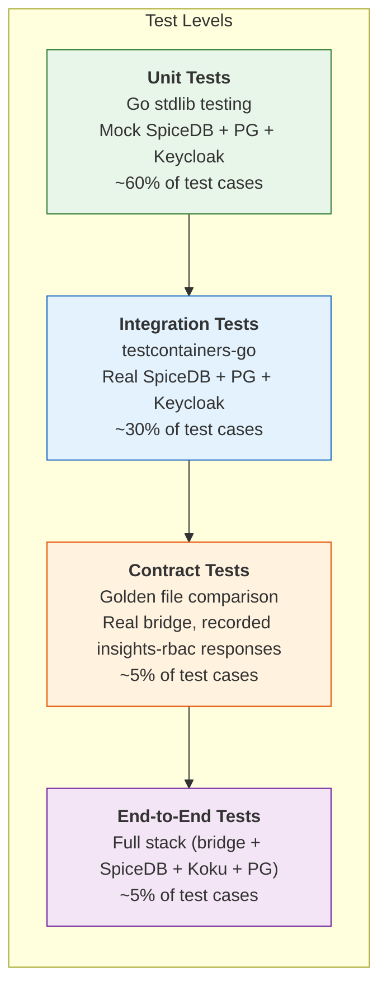

# Test Plan: ReBAC Bridge Service

**Test Plan Identifier**: TP-REBAC-BRIDGE-001
**Version**: 1.0
**Date**: 2026-03-05
**Status**: Draft
**Authors**: Cost Management On-Prem Team

Based on IEEE 829-2008 Standard for Software and System Test Documentation.

---

## Table of Contents

- [1. References](#1-references)
- [2. Introduction](#2-introduction)
- [3. Test Items](#3-test-items)
- [4. Software Risk Issues](#4-software-risk-issues)
- [5. Features to Be Tested](#5-features-to-be-tested)
  - [5.1 Roles API](#51-roles-api)
  - [5.2 Groups API](#52-groups-api)
  - [5.3 Group Principals API](#53-group-principals-api)
  - [5.4 Group Roles API](#54-group-roles-api)
  - [5.5 Group Resources API](#55-group-resources-api)
  - [5.6 Principals API](#56-principals-api)
  - [5.7 Access and Permissions API](#57-access-and-permissions-api)
  - [5.8 Authentication and Authorization](#58-authentication-and-authorization)
  - [5.9 Consistency Model](#59-consistency-model)
  - [5.10 Background Reconciler](#510-background-reconciler)
  - [5.11 Role Seeding](#511-role-seeding)
  - [5.12 Health Checks and Prerequisites](#512-health-checks-and-prerequisites)
  - [5.13 Integration Resource Lifecycle](#513-integration-resource-lifecycle)
  - [5.14 insights-rbac v1 API Compatibility](#514-insights-rbac-v1-api-compatibility)
  - [5.15 End-to-End Authorization Flow](#515-end-to-end-authorization-flow)
  - [5.16 Multi-Lifecycle Behavior Scenarios](#516-multi-lifecycle-behavior-scenarios)
- [6. Features Not to Be Tested](#6-features-not-to-be-tested)
- [7. Approach](#7-approach)
  - [7.1 Test Levels](#71-test-levels)
  - [7.2 Test Techniques](#72-test-techniques)
  - [7.3 Test Infrastructure](#73-test-infrastructure)
- [8. Item Pass/Fail Criteria](#8-item-passfail-criteria)
- [9. Suspension Criteria and Resumption Requirements](#9-suspension-criteria-and-resumption-requirements)
- [10. Test Deliverables](#10-test-deliverables)
- [11. Environmental Needs](#11-environmental-needs)
- [12. Staffing and Training Needs](#12-staffing-and-training-needs)
- [13. Responsibilities](#13-responsibilities)
- [14. Schedule](#14-schedule)
- [15. Planning Risks and Contingencies](#15-planning-risks-and-contingencies)
- [16. Approvals](#16-approvals)
- [Appendix A: Test Case Inventory](#appendix-a-test-case-inventory)
- [Appendix B: SpiceDB Tuple Verification Patterns](#appendix-b-spicedb-tuple-verification-patterns)

---

## 1. References

| ID | Document | Location |
|---|---|---|
| REF-1 | ReBAC Bridge Design Document | [rebac-bridge-design.md](./rebac-bridge-design.md) |
| REF-2 | On-Prem Workspace Management ADR | [onprem-workspace-management-adr.md](./onprem-workspace-management-adr.md) |
| REF-3 | Kessel OCP Detailed Design | [kessel-ocp-detailed-design.md](./kessel-ocp-detailed-design.md) |
| REF-4 | ZED Schema | [schema.zed](../../../dev/kessel/schema.zed) |
| REF-5 | Seed Roles Definition | [seed-roles.yaml](../../../dev/kessel/seed-roles.yaml) |
| REF-6 | Koku Access Provider | [access_provider.py](../../../koku/koku_rebac/access_provider.py) |
| REF-7 | Koku Resource Reporter | [resource_reporter.py](../../../koku/koku_rebac/resource_reporter.py) |
| REF-8 | insights-rbac v1 API | [RedHatInsights/insights-rbac](https://github.com/RedHatInsights/insights-rbac) |
| REF-9 | insights-rbac-ui | [RedHatInsights/insights-rbac-ui](https://github.com/RedHatInsights/insights-rbac-ui) |
| REF-10 | authzed-go Client Library (bridge-specific; ros-ocp-backend uses `project-kessel/relations-api` instead) | [authzed/authzed-go](https://github.com/authzed/authzed-go) |
| REF-11 | IEEE 829-2008 | IEEE Standard for Software and System Test Documentation |

---

## 2. Introduction

This test plan defines the verification and validation strategy for the ReBAC Bridge Service (REF-1), a lightweight Go microservice that provides an insights-rbac v1 compatible REST API backed by SpiceDB for the Koku on-prem deployment.

### 2.1 Scope

The test plan covers:

- All REST API endpoints under `/api/rbac/v1/`
- SpiceDB tuple translation layer (API operations to gRPC calls)
- PostgreSQL metadata storage (`rebac_bridge` schema)
- Dual-write consistency model (SpiceDB + PostgreSQL)
- Background reconciler
- Authentication and authorization middleware
- Health check and prerequisite verification
- Integration with Keycloak for principal resolution
- Compatibility with insights-rbac v1 response formats
- End-to-end authorization flow with Koku's `KesselAccessProvider`

### 2.2 Out of Scope

- Koku application layer (views, serializers, middleware) — unchanged by this feature
- Admin UI (PatternFly components) — separate test plan owned by UI team
- ZED schema correctness — covered by existing SpiceDB schema validation tests
- Kessel Inventory API and Relations API internals
- `resource_reporter.py` — covered by existing Koku tests (REF-7)

### 2.3 Objectives

1. Verify that every bridge API endpoint correctly translates to the expected SpiceDB tuples **and that those tuples produce the correct authorization outcome** (user can/cannot see specific resources).
2. Verify that the consistency model behaves correctly under partial failure conditions **and that the system self-heals to a correct authorization state**.
3. Verify that insights-rbac v1 response formats are byte-compatible with UI expectations **by comparing field names, types, nesting, and semantic values against recorded insights-rbac responses**.
4. Verify that the bridge's authorization state is correctly consumed by Koku's `KesselAccessProvider` **by confirming that Koku API cost report responses include/exclude specific data based on bridge-managed access grants**.
5. Verify that the bridge operates safely under degraded conditions (SpiceDB down, Keycloak down, PostgreSQL down) **and that no partial state corrupts authorization decisions**.

### 2.4 Testing Philosophy

**Every test must validate a business outcome, not an implementation detail.**

A test is valuable when it answers a question a stakeholder would ask:

- "Can Alice see cluster-prod costs after being added to team-infra?" (business outcome)
- "Is the tuple non-nil?" (implementation detail — anti-pattern)

#### Assertion Hierarchy

Tests should assert at the **highest meaningful level**:

```
Level 4 (best):  Business outcome   → "Alice's cost report shows $1,234 for cluster-prod"
Level 3:         Authorization effect → "SpiceDB confirms alice has openshift_cluster_read on cluster-prod"
Level 2:         Tuple correctness   → "The 3 role binding tuples exist with exact resource/relation/subject"
Level 1 (worst): Existence check     → "The response is not nil and has length > 0"
```

Every integration and E2E test should assert at Level 3 or 4. Unit tests may assert at Level 2. No test should stop at Level 1.

#### Anti-Patterns to Avoid

| Anti-Pattern | Why It's Bad | What to Do Instead |
|---|---|---|
| `assert response != nil` | Passes even if the response is an empty struct or error | Assert specific field values: `assert response.UUID == expectedUUID` |
| `assert len(data) > 0` | Passes with 1 item when you expect 5 | Assert exact count and verify each item's identity: `assert len(data) == 5 && data[0].Name == "team-infra"` |
| `assert statusCode == 200` | Passes even if the body is `{"data": []}` for a list that should have items | Assert status code AND body content: status 200 AND `meta.count == 3` AND specific items present |
| `assert statusCode == 400` | Confirms rejection but not that the system state is unchanged | Assert 400 AND verify no SpiceDB tuples were created AND no PostgreSQL row exists |
| `assert err == nil` | Passes silently without confirming the operation achieved its purpose | Assert no error AND verify the business effect (tuple created, permission granted) |
| `assert tupleExists(...)` | Confirms the tuple was written but not that it grants the expected permission | Assert tuple exists AND `CheckPermission` confirms the expected authorization effect |
| `assert response.Name != ""` | Passes for any non-empty name, even if it's wrong | Assert `response.Name == "Infrastructure Team"` with the exact expected value |
| Testing mock behavior | "Mock was called 3 times" tests the implementation, not the outcome | Test the effect: after the operation, SpiceDB contains exactly these tuples and grants these permissions |

#### Required Assertion Pattern for Write Operations

Every test that creates, modifies, or deletes state must follow this pattern:

```
1. PRECONDITION:  Verify initial state (permission denied, entity absent)
2. ACTION:        Execute the operation under test
3. POSTCONDITION: Verify business outcome (permission granted, entity present with exact values)
4. INVERSE:       Where applicable, undo the operation and verify state returns to precondition
```

#### Coverage Philosophy

The 80% coverage target is a **floor, not a ceiling**, and applies to meaningful behavioral coverage, not line counting. A codebase can have 100% line coverage and still fail in production if the assertions don't validate outcomes. Every covered line must have an assertion that would fail if the business logic were broken.

---

## 3. Test Items

| Item | Version | Source |
|---|---|---|
| ReBAC Bridge binary | Development builds (Go 1.22+) | `rebac-bridge/` repository |
| PostgreSQL schema (`rebac_bridge`) | `001_initial.sql` | `rebac-bridge/migrations/` |
| SpiceDB | Matching on-prem deployment version | `deploy-kessel.sh` |
| ZED schema | Current branch | `dev/kessel/schema.zed` |
| Seed roles | Current branch | `dev/kessel/seed-roles.yaml` |
| Keycloak | On-prem deployment version | `deploy-rhbk.sh` |

---

## 4. Software Risk Issues

| Risk ID | Risk | Severity | Likelihood | Test Priority |
|---|---|---|---|---|
| R-1 | Incorrect SpiceDB tuple structure breaks Koku authorization | Critical | Medium | **P0** — every tuple must be verified against ZED schema |
| R-2 | insights-rbac v1 response format mismatch breaks UI | High | Medium | **P0** — contract tests against real insights-rbac responses |
| R-3 | Consistency model failure leaves orphaned/stale tuples | Medium | Medium | **P1** — fault injection tests for each write path |
| R-4 | Admin authorization check bypassed or incorrectly evaluated | Critical | Low | **P0** — negative tests for all write endpoints |
| R-5 | Reconciler corrupts valid data | High | Low | **P1** — reconciler tests with various divergence scenarios |
| R-6 | Principal format mismatch between bridge and Koku | Critical | Low | **P0** — verify `redhat/{username}` format consistency |
| R-7 | Role binding direction incorrect in SpiceDB | Critical | Low | **P0** — verify workspace→role_binding direction |
| R-8 | Resource assignment does not affect Koku query results | Critical | Medium | **P0** — end-to-end test from bridge to Koku API |
| R-9 | Health checks pass when prerequisites are missing | High | Low | **P1** — negative health check tests |
| R-10 | Group deletion leaves orphaned tuples in SpiceDB | Medium | Medium | **P1** — verify cascade cleanup |

---

## 5. Features to Be Tested

### 5.1 Roles API

**Endpoints**: `GET /roles/`, `GET /roles/{uuid}/`, `POST /roles/`, `PUT /roles/{uuid}/`, `DELETE /roles/{uuid}/`

| TC ID | Test Case | Assertion (business outcome) | Type | Priority |
|---|---|---|---|---|
| ROLE-01 | List all roles returns the 5 system roles seeded from `seed-roles.yaml` | Response `meta.count == 5`, each role's `name` and `slug` match seed-roles.yaml exactly: `Cost Administrator`, `Cost Cloud Viewer`, `Cost OpenShift Viewer`, `Cost Price List Administrator`, `Cost Price List Viewer` | Unit | P0 |
| ROLE-02 | List roles includes both system and custom roles after custom role creation | Create custom role "My Custom", then list: `meta.count == 6`, the custom role appears with `system == false` and exact name/slug, the 5 system roles still have `system == true` | Integration | P0 |
| ROLE-03 | Get `cost-administrator` by UUID returns the correct permissions array | Response `access` array contains exactly 13 permission entries matching `seed-roles.yaml`, including `cost-management:*:*`; field `system == true`, `name == "Cost Administrator"` | Unit | P0 |
| ROLE-04 | Get role by non-existent UUID returns 404 with error body AND no side effects | Status 404, error body matches insights-rbac v1 error format with `detail` explaining the role was not found | Unit | P1 |
| ROLE-05 | Create custom role with `openshift.cluster:read` + `openshift.project:read`: the role is usable for authorization | **Pre**: no role with slug "ocp-limited-viewer" exists. **Action**: POST creates the role. **Post**: (a) PG row has exact `name`, `description`, `access` JSON, (b) SpiceDB has tuples `rbac/role:ocp-limited-viewer#t_cost_management_openshift_cluster_read → rbac/principal:*` AND `#t_cost_management_openshift_project_read → rbac/principal:*`, (c) assigning this role to a group and a cluster grants `CheckPermission == ALLOWED` for `openshift_cluster_read` | Integration | P0 |
| ROLE-06 | Create custom role with `system=true` is rejected and system state is unchanged | Status 400, AND no PG row created, AND no SpiceDB tuples created for the attempted slug | Unit | P1 |
| ROLE-07 | Create custom role with duplicate slug is rejected and existing role is unchanged | Status 409, AND existing role's PG metadata is unchanged (same `modified_at`), AND existing role's SpiceDB tuples are unchanged | Integration | P1 |
| ROLE-08 | Update custom role: changing permissions replaces old tuples with new ones | **Pre**: custom role has `openshift.cluster:read`. **Action**: PUT with `openshift.project:read` only. **Post**: (a) PG `access` JSON now has only project read, (b) old SpiceDB tuple `t_cost_management_openshift_cluster_read` is deleted, (c) new SpiceDB tuple `t_cost_management_openshift_project_read` exists, (d) assigning this role to a group + cluster: `CheckPermission` for `openshift_cluster_read` returns DENIED, for `openshift_project_read` returns ALLOWED | Integration | P0 |
| ROLE-09 | Update system role is rejected and the role remains functional | Status 400, AND `cost-administrator` PG metadata unchanged, AND SpiceDB tuples unchanged, AND a user with this role still passes the admin `CheckPermission` | Integration | P0 |
| ROLE-10 | Delete custom role: role is no longer usable for authorization | **Pre**: custom role "ocp-limited" assigned to group, alice is member, alice CAN see cluster. **Action**: DELETE role. **Post**: (a) no PG row for slug, (b) no SpiceDB permission tuples for slug, (c) alice can NO LONGER see the cluster (authorization effect verified) | Integration | P0 |
| ROLE-11 | Delete system role is rejected and role remains fully operational | Status 400, AND `cost-administrator` remains in role list, AND users with this role still pass admin check | Integration | P0 |
| ROLE-12 | Custom role permission tuples use exact format `rbac/role:{slug}#t_cost_management_{type}_{verb} → rbac/principal:*` | For role with `cost_model:write` permission: tuple resource is `rbac/role:my-role`, relation is `t_cost_management_cost_model_write`, subject is `rbac/principal:*` (verified by ReadRelationships with exact filter) | Integration | P0 |
| ROLE-13 | Pagination returns correct subsets: `limit=2, offset=0` returns first 2 roles, `limit=2, offset=2` returns next 2, all 5 roles are retrievable across pages, `order_by=name` returns alphabetically sorted names | Response `meta.count == 5` on every page, `links.next` is non-null on first page, `links.previous` is non-null on second page, `data` items match expected order | Unit | P1 |
| ROLE-14 | List roles response is structurally identical to insights-rbac v1: every field name, nesting level, and type matches the golden file | Golden file diff shows zero differences (excluding dynamic values: UUIDs, timestamps) | Contract | P0 |
| ROLE-15 | Create custom role with empty `access` array succeeds but the role grants no permissions | Role created in PG with empty access, no SpiceDB permission tuples, assigning this role to a group: members gain no cost-management permissions (`CheckPermission` returns DENIED for all resource types) | Integration | P1 |
| ROLE-16 | Role name with maximum length (150 chars) is stored and returned correctly without truncation | Response `name` field is exactly the 150-char string submitted | Unit | P1 |

### 5.2 Groups API

**Endpoints**: `GET /groups/`, `POST /groups/`, `GET /groups/{uuid}/`, `PUT /groups/{uuid}/`, `DELETE /groups/{uuid}/`

| TC ID | Test Case | Assertion (business outcome) | Type | Priority |
|---|---|---|---|---|
| GRP-01 | Create group "Infrastructure Team" produces a functional workspace hierarchy | **Pre**: no group exists. **Action**: POST `{"name":"Infrastructure Team","description":"Infra engineers"}`. **Post**: (a) response status 201 with `uuid`, `name=="Infrastructure Team"`, `description=="Infra engineers"`, `created` is valid ISO 8601, (b) SpiceDB `t_parent` tuple links group workspace to org workspace, (c) admin bound at org workspace has `cost_management_all_read` on the new workspace (inheritance verified via CheckPermission) | Integration | P0 |
| GRP-02 | Created group's workspace inherits from org workspace: admin can resolve permissions through the new workspace | `CheckPermission(rbac/workspace:{group_uuid}, cost_management_all_read, rbac/principal:redhat/admin_user)` returns ALLOWED (proving `t_parent → org_workspace` is correctly set up) | Integration | P0 |
| GRP-03 | API response matches PostgreSQL row exactly: UUID, name, description, created_at, org_id | Query `rebac_bridge.groups` directly: row values match the API response field-by-field (not just "row exists") | Integration | P0 |
| GRP-04 | List groups returns exactly the groups created for this org, with correct counts and metadata | Create 3 groups with known names. List: `meta.count == 3`, each group's `name` and `description` match what was submitted, `principalCount` and `roleCount` are 0 for new groups | Unit | P0 |
| GRP-05 | Get group by UUID returns complete metadata including member and role counts | Create group, add 2 principals, assign 1 role. GET: `principalCount == 2`, `roleCount == 1`, `name` and `description` match creation input | Integration | P0 |
| GRP-06 | Get group by fabricated UUID: 404 with descriptive error, no SpiceDB side effects | Status 404, response body `errors[0].detail` contains "not found", no new SpiceDB tuples created by the request | Unit | P1 |
| GRP-07 | Update group name/description: metadata changes, authorization state is completely unaffected | **Pre**: group has 1 role, 1 member, 1 resource; member CAN see the resource. **Action**: PUT with new name/description. **Post**: (a) GET returns new name/description, (b) PG row `modified_at > created_at`, (c) SpiceDB tuples unchanged (same count, same values), (d) member still CAN see the resource | Integration | P1 |
| GRP-08 | Delete group: all authorization effects are fully reversed | **Pre**: group has OCP viewer role, member alice, cluster-prod assigned; alice CAN see cluster-prod. **Action**: DELETE group. **Post**: (a) GET group returns 404, (b) `CheckPermission(cluster-prod, openshift_cluster_read, alice)` returns DENIED, (c) admin can still see cluster-prod (org-level tuple intact) | Integration | P0 |
| GRP-09 | Delete group cascade: every tuple type is cleaned up from SpiceDB | After deletion, verify with `ReadRelationships` that **zero** tuples exist for: workspace `t_parent`, workspace `t_binding`, role_binding `t_subject`, role_binding `t_granted`, group `t_member`, resource `t_workspace → group-workspace`. Each absence verified individually | Integration | P0 |
| GRP-10 | Delete non-existent group: 404, no side effects on other groups | Status 404, AND all other groups' tuples and metadata are unchanged | Unit | P1 |
| GRP-11 | Pagination: create 5 groups, `limit=2` returns 3 pages with correct items | Page 1: 2 items + `links.next` set. Page 2: 2 items + `links.previous` + `links.next`. Page 3: 1 item + `links.previous` + `links.next == null`. All 5 group names recovered across pages with no duplicates and no omissions | Unit | P1 |
| GRP-12 | Group response matches insights-rbac v1 golden file structurally | Field-by-field diff of golden file: `uuid`, `name`, `description`, `created`, `modified`, `principalCount`, `roleCount` all present with correct types | Contract | P0 |
| GRP-13 | Create group with empty name: rejected, no state created | Status 400, AND no PG row, AND no SpiceDB workspace created for the attempted UUID | Unit | P1 |
| GRP-14 | Create group with duplicate name in same org: succeeds (names are not unique, UUIDs differ) | Two groups with name "team-infra": both created with different UUIDs, both appear in list, both have independent workspaces in SpiceDB | Integration | P1 |

### 5.3 Group Principals API

**Endpoints**: `GET /groups/{uuid}/principals/`, `POST /groups/{uuid}/principals/`, `DELETE /groups/{uuid}/principals/`

| TC ID | Test Case | Assertion (business outcome) | Type | Priority |
|---|---|---|---|---|
| GPRN-01 | Add alice to group: alice gains the group's permissions | **Pre**: group has OCP viewer role + cluster-prod assigned; `CheckPermission(cluster-prod, read, alice)` returns DENIED. **Action**: POST alice to group. **Post**: `CheckPermission(cluster-prod, openshift_cluster_read, alice)` returns ALLOWED. SpiceDB tuple `rbac/group:{uuid}#t_member → rbac/principal:redhat/alice` exists with exact resource/relation/subject | Integration | P0 |
| GPRN-02 | Add principal validates Keycloak existence: fabricated user "nonexistent" is rejected, no tuple created | Status 400, AND `ReadRelationships` for `rbac/group:{uuid}#t_member` returns zero tuples for "nonexistent", AND group's `principalCount` remains unchanged | Integration | P0 |
| GPRN-03 | Rejected principal does not pollute group membership or authorization | After GPRN-02 rejection, listing group principals returns the same set as before the attempt | Integration | P1 |
| GPRN-04 | Principal ID always uses `redhat/` prefix: Keycloak realm is `kubernetes` but SpiceDB subject is `rbac/principal:redhat/alice`, not `rbac/principal:kubernetes/alice` | ReadRelationships confirms subject contains `redhat/alice`; no tuple with `kubernetes/` prefix exists | Unit | P0 |
| GPRN-05 | Remove alice from group: alice loses the group's permissions immediately | **Pre**: alice is member, CAN see cluster-prod. **Action**: DELETE alice from group. **Post**: (a) `CheckPermission(cluster-prod, read, alice)` returns DENIED, (b) `ReadRelationships` returns zero `t_member` tuples for alice on this group, (c) list principals no longer includes alice | Integration | P0 |
| GPRN-06 | Remove non-member: 404, existing members unaffected | Status 404, AND alice (existing member) is still in the group, AND alice still CAN see group resources | Unit | P1 |
| GPRN-07 | List principals returns enriched user data from Keycloak with correct usernames | Add alice and bob. List: exactly 2 items, `data[0].username == "alice"`, `data[1].username == "bob"` (or vice versa), each has `email`, `first_name`, `last_name` populated from Keycloak | Integration | P0 |
| GPRN-08 | Keycloak down: list principals returns SpiceDB-known usernames as fallback | Kill Keycloak. List: still returns alice and bob by username (extracted from `redhat/alice`), but `email`, `first_name`, `last_name` may be absent or empty | Integration | P1 |
| GPRN-09 | Add principal to fabricated group UUID: 404, no orphaned tuples in SpiceDB | Status 404, AND no `t_member` tuple exists anywhere for the fabricated group UUID | Unit | P1 |
| GPRN-10 | Add alice twice: idempotent, exactly 1 membership tuple, alice appears once in list | POST alice (success), POST alice again (success or 2xx), ReadRelationships returns exactly 1 `t_member` tuple for alice, list principals count is 1 | Integration | P1 |
| GPRN-11 | Principal format round-trip: bridge writes `redhat/{username}`, Koku's `KesselAccessProvider` resolves the same user via `f"redhat/{user_id}"` | Write principal "alice" via bridge, then execute `CheckPermission` using the format `KesselAccessProvider` would use (`redhat/alice`): ALLOWED. This proves both systems use identical principal ID format | Integration | P0 |
| GPRN-12 | Adding multiple principals in a single request: all gain permissions atomically | POST `{"principals": [{"username":"alice"}, {"username":"bob"}]}`. Both `CheckPermission` calls return ALLOWED for the group's assigned resource. List returns exactly 2 members | Integration | P0 |

### 5.4 Group Roles API

**Endpoints**: `GET /groups/{uuid}/roles/`, `POST /groups/{uuid}/roles/`, `DELETE /groups/{uuid}/roles/`

| TC ID | Test Case | Assertion (business outcome) | Type | Priority |
|---|---|---|---|---|
| GROLE-01 | Assign OCP viewer role: group members gain exactly the OCP viewer permissions | **Pre**: group has member alice, cluster-prod assigned; `CheckPermission(cluster-prod, openshift_cluster_read, alice)` returns DENIED (no role yet). **Action**: assign `cost-openshift-viewer`. **Post**: `CheckPermission` returns ALLOWED for `openshift_cluster_read`, `openshift_node_read`, `openshift_project_read`; returns DENIED for `aws_account_read`, `cost_model_write` (permissions the role does not include) | Integration | P0 |
| GROLE-02 | Role binding ID is deterministic: `{group_uuid}-{role_slug}-{org_id}` | Assign role, read binding ID from SpiceDB. Assert it equals the concatenation of group UUID, role slug, and org ID with hyphens. Re-assign the same role: binding ID is identical (not randomly generated) | Unit | P0 |
| GROLE-03 | `t_subject` tuple connects the role binding to the group's membership | `ReadRelationships` for `rbac/role_binding:{id}#t_subject`: subject is `rbac/group:{uuid}#member` (not just `rbac/group:{uuid}` — the `#member` relation reference is critical for SpiceDB to resolve through group membership) | Integration | P0 |
| GROLE-04 | `t_granted` tuple connects the role binding to the correct role | `ReadRelationships` for `rbac/role_binding:{id}#t_granted`: subject is `rbac/role:cost-openshift-viewer` (exact slug match, not a UUID) | Integration | P0 |
| GROLE-05 | `t_binding` direction: workspace points to binding (not binding to workspace) | `ReadRelationships` with resource `rbac/workspace:{group_uuid}`, relation `t_binding`: returns the role_binding. The REVERSE query (resource `rbac/role_binding:{id}`, relation `t_binding`) returns zero results — confirming the direction matches the ZED schema | Integration | P0 |
| GROLE-06 | Assign fabricated role slug: 404, no tuples created, no authorization change | Status 404, AND `ReadRelationships` for workspace `t_binding` returns zero new bindings, AND existing member permissions unchanged | Unit | P1 |
| GROLE-07 | Remove role: group members lose exactly the removed role's permissions | **Pre**: group has OCP viewer + cloud viewer roles; alice CAN see clusters AND aws_accounts. **Action**: remove OCP viewer. **Post**: alice can NO LONGER see clusters (`CheckPermission` DENIED for `openshift_cluster_read`), alice CAN still see aws_accounts (cloud viewer retained). All 3 OCP-viewer-binding tuples gone from SpiceDB | Integration | P0 |
| GROLE-08 | List group roles: returns exact role metadata including permissions, not just IDs | Assign 2 roles. List: `data` has exactly 2 entries, each with `uuid`, `name`, `display_name`, `access[]` populated from PostgreSQL role metadata. `data[0].name == "Cost OpenShift Viewer"`, `data[0].access` contains the 3 OCP permissions | Integration | P0 |
| GROLE-09 | Assign same role twice: idempotent, exactly 3 tuples (not 6), permissions unchanged | Assign role, count SpiceDB tuples for this binding (3). Assign again: same 3 tuples, no duplicates. `CheckPermission` still ALLOWED | Integration | P1 |
| GROLE-10 | All 3 tuples written atomically: mock SpiceDB to capture the `WriteRelationships` request, assert it contains exactly 3 `RelationshipUpdate` entries in a single call | Unit mock captures gRPC call: `len(request.Updates) == 3`, each update's resource/relation/subject matches expected values | Unit | P1 |
| GROLE-11 | No tenant-level binding created: only the group's workspace has `t_binding` for this role | After assignment, `ReadRelationships` for `rbac/tenant:{org_id}#t_binding` returns zero bindings for this role_binding. Only `rbac/workspace:{group_uuid}#t_binding` exists | Integration | P0 |
| GROLE-12 | Assign multiple roles to same group: member gains the union of all roles' permissions | Assign OCP viewer + cloud viewer. Alice can see `openshift_cluster` AND `aws_account` AND `gcp_project`. Each `CheckPermission` verified individually. Remove one role: only its permissions are lost | Integration | P0 |

### 5.5 Group Resources API

**Endpoints**: `GET /groups/{uuid}/resources/`, `POST /groups/{uuid}/resources/`, `DELETE /groups/{uuid}/resources/{type}/{id}/`, `GET /groups/{uuid}/resources/available/`

| TC ID | Test Case | Assertion (business outcome) | Type | Priority |
|---|---|---|---|---|
| GRES-01 | Grant cluster-prod to team-infra: team members can see cluster-prod | **Pre**: alice is member of team-infra with OCP viewer role; `CheckPermission(cluster-prod, openshift_cluster_read, alice)` returns DENIED. **Action**: POST cluster-prod to group. **Post**: `CheckPermission` returns ALLOWED. SpiceDB tuple `cost_management/openshift_cluster:cluster-prod#t_workspace → rbac/workspace:{group_uuid}` exists | Integration | P0 |
| GRES-02 | Grant writes both SpiceDB and PostgreSQL: tuple for authorization, row for display timestamp | After grant: (a) SpiceDB has the `t_workspace` tuple, (b) PG `resource_assignments` row has `group_uuid`, `resource_type == "openshift_cluster"`, `resource_id == "cluster-prod"`, `assigned_at` within 5 seconds of now. API list response `assigned_at` matches PG value | Integration | P0 |
| GRES-03 | SpiceDB-first ordering verified: if PG write is blocked (simulate failure), SpiceDB tuple still exists and authorization works | Inject PG failure after SpiceDB write. Verify: (a) API returns error, (b) `CheckPermission` returns ALLOWED (SpiceDB write succeeded), (c) list resources does not show the resource (PG row missing). This confirms the ordering and the failure mode documented in the design | Integration | P0 |
| GRES-04 | Revoke cluster-prod from team-infra: team members lose access, admin retains access | **Pre**: cluster-prod assigned to team-infra and org-workspace; alice CAN see, admin CAN see. **Action**: DELETE cluster-prod from team-infra. **Post**: (a) `CheckPermission` for alice returns DENIED, (b) `CheckPermission` for admin returns ALLOWED (org-level tuple untouched), (c) `ReadRelationships` confirms zero `t_workspace` tuples from cluster-prod to team-infra workspace, (d) `ReadRelationships` confirms org-level `t_workspace` tuple still exists | Integration | P0 |
| GRES-05 | Revoke cleans up PG row: `resource_assignments` row deleted, list no longer includes the resource | After revoke: PG query for this (group, type, id) triple returns zero rows. List endpoint `meta.count` decremented by 1 | Integration | P0 |
| GRES-06 | List resources: returns exactly the assigned resources with correct types and IDs | Assign cluster-prod (openshift_cluster) and payments (openshift_project). List: `data` has exactly 2 items; `data` includes one item with `resource_type == "openshift_cluster"` and `resource_id == "cluster-prod"`, another with `resource_type == "openshift_project"` and `resource_id == "payments"`. No extra items | Integration | P0 |
| GRES-07 | `assigned_at` timestamps reflect actual assignment times, not arbitrary values | Assign resource-A at time T1, wait 2 seconds, assign resource-B at T2. List: resource-A `assigned_at` is within 1s of T1, resource-B `assigned_at` is within 1s of T2, resource-B `assigned_at > resource-A assigned_at` | Integration | P1 |
| GRES-08 | Available resources: correct set-difference between org resources and group resources | **Setup**: org workspace has cluster-A, cluster-B, cluster-C (via resource_reporter). Assign cluster-A to group. **Assert**: `GET /available/` returns exactly cluster-B and cluster-C (not cluster-A). Assign cluster-B: `GET /available/` now returns exactly cluster-C. Revoke cluster-A: `GET /available/` returns cluster-A and cluster-C | Integration | P0 |
| GRES-09 | Available resources uses org workspace tuples, not all SpiceDB tuples | Verify that available resources include only resources with `t_workspace → org_workspace`, not resources assigned to other groups' workspaces. Create resource-X assigned only to another group (not org): it does NOT appear in `/available/` | Integration | P0 |
| GRES-10 | Cross-team sharing: cluster-prod visible to both team-infra and team-finance simultaneously | Assign cluster-prod to both groups. alice (team-infra) and bob (team-finance): both `CheckPermission` return ALLOWED. Revoke from team-infra: alice DENIED, bob still ALLOWED. SpiceDB has exactly 1 remaining team-level `t_workspace` tuple (plus the org-level one) | Integration | P0 |
| GRES-11 | Unsupported resource type "database_instance": 400, no tuple created, clear error message | Status 400, error body references the invalid type, `ReadRelationships` confirms no tuple for "database_instance" | Unit | P1 |
| GRES-12 | All 9 supported resource types are accepted and produce correct tuples | Table-driven test: for each of `openshift_cluster`, `openshift_node`, `openshift_project`, `aws_account`, `aws_organizational_unit`, `azure_subscription_guid`, `gcp_account`, `gcp_project`, `openshift_vm`: POST succeeds, SpiceDB tuple has `cost_management/{type}:{id}` as the resource, list includes the assigned resource with the correct type name | Unit | P0 |
| GRES-13 | `cost_model` and `settings` rejected: 400 with explanation, authorization state unchanged | For each: status 400, error body explains why (capability permission, not assignable), no SpiceDB tuple created | Unit | P0 |
| GRES-14 | Grant same resource twice: idempotent, exactly 1 `t_workspace` tuple, 1 PG row | Grant cluster-prod. Grant again. `ReadRelationships` returns exactly 1 tuple. PG has exactly 1 row. `assigned_at` is from the first grant (not updated). List returns 1 item | Integration | P1 |
| GRES-15 | Revoke unassigned resource: 404, existing assignments unaffected | Status 404. Other assigned resources still in list, still authorized via `CheckPermission` | Unit | P1 |
| GRES-16 | Group deletion cascades to `resource_assignments`: PG rows auto-deleted | Assign 3 resources, verify 3 PG rows. Delete group. PG query for `resource_assignments WHERE group_uuid = {deleted}` returns 0 rows | Integration | P1 |
| GRES-17 | Response format: each item has `resource_type` (string), `resource_id` (string), `assigned_at` (ISO 8601 with timezone) | Assign cluster-prod. List: `data[0].resource_type == "openshift_cluster"` (not `cost_management/openshift_cluster`), `data[0].resource_id == "cluster-prod"`, `data[0].assigned_at` parses as valid RFC 3339 datetime | Contract | P0 |
| GRES-18 | Resource assignment respects org boundary: assigning a resource that belongs to a different org's workspace is rejected or has no authorization effect | Create resource in SpiceDB with `t_workspace → workspace:different_org`. Attempt to assign to a group in `org_id=1234567`: the group's members cannot see the resource (the tuple's workspace does not link to their org) | Integration | P0 |

### 5.6 Principals API

**Endpoints**: `GET /principals/`

| TC ID | Test Case | Assertion (business outcome) | Type | Priority |
|---|---|---|---|---|
| PRIN-01 | List principals returns known Keycloak users with complete profile data | Create 3 users in Keycloak: alice, bob, charlie. List: `meta.count == 3`, each user has `username`, `email`, `first_name`, `last_name` matching the Keycloak records. Verify alice's email is `alice@example.com` (exact value, not just non-empty) | Integration | P0 |
| PRIN-02 | Keycloak unavailable: 503 with clear error, not an empty 200 | Kill Keycloak container. GET: status 503 (not 200 with empty data), error body describes Keycloak unavailability | Integration | P1 |
| PRIN-03 | Response structure matches insights-rbac v1: `data[].username`, `data[].email`, `data[].first_name`, `data[].last_name`, `data[].is_active` | Golden file diff: zero structural differences. `is_active == true` for all active Keycloak users | Contract | P0 |
| PRIN-04 | Pagination correctness: `limit=1` returns one user per page, all users recoverable across pages | 3 users total, `limit=1`: page 1 has 1 user + `meta.count == 3`. Collect all pages: 3 distinct usernames recovered, no duplicates | Unit | P1 |

### 5.7 Access and Permissions API

**Endpoints**: `GET /access/`, `GET /permissions/`, `GET /permissions/options/`

| TC ID | Test Case | Assertion (business outcome) | Type | Priority |
|---|---|---|---|---|
| ACC-01 | Alice with OCP viewer role: `/access/` returns exactly the 3 OCP read permissions | Setup: alice in group with `cost-openshift-viewer`. GET access as alice: `data` contains exactly `cost-management:openshift.cluster:read`, `cost-management:openshift.node:read`, `cost-management:openshift.project:read`. No AWS, GCP, Azure, cost_model, or settings permissions present | Integration | P0 |
| ACC-02 | Access resolution traverses the full chain: alice → group:team-infra (t_member) → role_binding:rb (t_subject) → role:ocp-viewer (t_granted) → permissions | Assert access response contains exactly the permissions defined in `seed-roles.yaml` for `cost-openshift-viewer`. No extra permissions leak from other roles or bindings | Integration | P0 |
| ACC-03 | Access response matches insights-rbac v1 format: `data[].permission` is `{app}:{type}:{verb}` string, `data[].resourceDefinitions` is empty array | `data[0].permission == "cost-management:openshift.cluster:read"` (exact string, including dots in type name). `data[0].resourceDefinitions` is `[]` (empty array, not null, not absent) | Contract | P0 |
| ACC-04 | User with no group memberships: empty access, no permissions leaked | Create user in Keycloak but don't add to any group. GET access: `data == []`, `meta.count == 0`. `CheckPermission` for every resource type returns DENIED | Integration | P1 |
| ACC-05 | Alice in 2 groups (OCP viewer + cloud viewer): access returns the union of both roles' permissions without duplicates | `data` contains 3 OCP read + 5 cloud read = 8 permissions. Each permission appears exactly once. No `cost_model` or `settings` permissions (neither role includes them) | Integration | P0 |
| ACC-06 | Admin user: access includes all permissions (from `cost-management:*:*` wildcard expansion) | Admin with `cost-administrator` role. GET access: `data` includes all 13 individual permissions from seed-roles.yaml, OR a single `cost-management:*:*` entry (depending on bridge implementation). Either way, the UI can determine the user has full access | Integration | P0 |
| PERM-01 | `/permissions/` returns the complete set of cost-management permissions including `integration:read` | Response `data` includes at minimum: `cost-management:openshift.cluster:read`, `cost-management:cost_model:write`, `cost-management:settings:read`, `cost-management:integration:read`. Count matches the total number of unique `{resource_type}:{verb}` combinations in the ZED schema | Unit | P0 |
| PERM-02 | `/permissions/options/?field=application` returns exactly `["cost-management"]` | `data == ["cost-management"]`, not an empty array, not multiple values | Unit | P1 |
| PERM-03 | `/permissions/options/?field=resource_type` returns all 11 resource types | `data` contains: `aws.account`, `aws.organizational_unit`, `azure.subscription_guid`, `gcp.account`, `gcp.project`, `openshift.cluster`, `openshift.node`, `openshift.project`, `openshift.vm`, `cost_model`, `settings`, `integration`. Exact set, no extras, no omissions | Unit | P1 |
| PERM-04 | `/permissions/options/?field=verb` returns exactly `["read", "write"]` | `data == ["read", "write"]` (or `["write", "read"]`), exactly 2 items | Unit | P1 |
| PERM-05 | Permissions response matches insights-rbac v1 golden file | Zero structural diff. `data[].permission` strings use dots for resource types (matching insights-rbac convention) | Contract | P0 |

### 5.8 Authentication and Authorization

| TC ID | Test Case | Assertion (business outcome) | Type | Priority |
|---|---|---|---|---|
| AUTH-01 | No `x-rh-identity` header: 401 AND the response body does not leak internal details (no stack trace, no SpiceDB endpoint) | Status 401, body contains only a generic auth error, no sensitive information | Unit | P0 |
| AUTH-02 | Malformed identity: invalid base64 → 401; valid base64 but missing `identity.org_id` → 401; missing `identity.user.username` → 401 | Three subtests, each returns 401 with an error message that indicates the specific missing field | Unit | P0 |
| AUTH-03 | Viewer user (no admin role) is denied all bridge admin endpoints | For GET `/roles/`, `/groups/`, `/principals/`, `/access/`, `/permissions/`: status 403 for each. The bridge requires `cost_management_all_read` (granted by `cost-administrator` via `t_cost_management_all_all`); `cost-openshift-viewer` does not have this permission. Regular users use Koku's `/user-access/` endpoint for their own permissions, not the bridge | Integration | P0 |
| AUTH-04 | Admin user (cost-administrator) can execute all write endpoints | For POST `/groups/`, POST `/groups/{uuid}/roles/`, POST `/groups/{uuid}/principals/`, POST `/groups/{uuid}/resources/`: status 2xx, operation succeeds, state changes confirmed | Integration | P0 |
| AUTH-05 | Viewer user attempting POST `/groups/`: 403, AND no group created in PG, AND no workspace created in SpiceDB | Status 403, verify zero side effects by checking PG group count and SpiceDB tuple count are unchanged from before the attempt | Integration | P0 |
| AUTH-06 | Admin check ignores `is_org_admin` header field: identity with `is_org_admin: true` but no SpiceDB admin role → 403 | Craft identity with `is_org_admin: true` for a user who has no admin role binding in SpiceDB. POST: 403. Proves the bridge uses SpiceDB `CheckPermission`, not the header field | Integration | P0 |
| AUTH-07 | Identity without `is_org_admin` field (matching on-prem Envoy filter output): admin user still passes | Standard on-prem identity (no `is_org_admin` key at all). Admin user with SpiceDB role binding: POST succeeds. Proves the field is truly not required | Unit | P0 |
| AUTH-08 | Bootstrap admin: user granted via `kessel-admin.sh do_grant` tuple structure can create groups | Setup: create the 5 role binding tuples that `do_grant` creates (directly in SpiceDB). User with those tuples: POST `/groups/` succeeds | Integration | P0 |
| AUTH-09 | `cost-administrator`'s `t_cost_management_all_all` resolves to both `cost_management_all_read` AND `cost_management_all_write` via computed permissions | `CheckPermission(rbac/workspace:{org_id}, cost_management_all_read, admin)` → ALLOWED. `CheckPermission(rbac/workspace:{org_id}, cost_management_all_write, admin)` → ALLOWED. Resolution chain: `rbac/role.cost_management_all_read = t_cost_management_all_read + t_cost_management_all_all + t_all_all_all` — cost-administrator seeds `t_cost_management_all_all`, which satisfies the computed permission. Same pattern as individual type `_view`/`_edit` permissions | Integration | P0 |
| AUTH-10 | User with `cost-openshift-viewer` only: GET `/roles/` returns 403, POST `/groups/` returns 403 | Viewer is denied both read and write on bridge admin endpoints. Both require permissions that `cost-openshift-viewer` does not have (`cost_management_all_read` / `cost_management_all_write`). The bridge is an admin-only surface | Integration | P0 |
| AUTH-11 | Admin check resolves through full chain: admin_user → group:admins (t_member) → role_binding (t_subject/t_granted) → role:cost-administrator → cost_management_all_write | Setup admin_user in a group with cost-administrator role bound to org workspace. POST `/groups/` succeeds. Then remove admin_user from the group: POST `/groups/` now returns 403. Proves the full chain resolution, not just a hardcoded check | Integration | P0 |
| AUTH-12 | Org isolation: admin of org-A cannot write to bridge for org-B | Craft identity with `org_id: "9999999"` (different org). POST `/groups/`: either 403 (org-B has no admin bindings for this user) or the group is created in org-B's scope (not org-A's). Either way, org-A's data is unaffected | Integration | P0 |

### 5.9 Consistency Model

| TC ID | Test Case | Assertion (business outcome) | Type | Priority |
|---|---|---|---|---|
| CONS-01 | Group creation, SpiceDB fails: no partial state anywhere | **Action**: inject SpiceDB gRPC error. **Post**: (a) API returns 500/503, (b) PG `rebac_bridge.groups` has no row for the attempted UUID, (c) no SpiceDB tuples exist for the attempted UUID. System is in exact same state as before the attempt | Integration | P0 |
| CONS-02 | Group creation, PG fails after SpiceDB succeeds: authorization works, metadata missing, reconciler heals | **Action**: inject PG write failure. **Post**: (a) API returns error, (b) SpiceDB workspace + t_parent tuple exists (verified), (c) admin CAN resolve permissions through the orphaned workspace (inheritance works), (d) GET `/groups/` does NOT include the orphaned group. **Then**: trigger reconciler. **Post-reconcile**: PG row created, GET `/groups/` now includes the group with correct metadata | Integration | P0 |
| CONS-03 | Group deletion, SpiceDB cleanup fails: group gone from UI, stale tuples remain, reconciler heals | **Pre**: group has member alice, role, resource; alice CAN see resource. **Action**: inject SpiceDB failure during cleanup (PG delete succeeds). **Post**: (a) GET `/groups/{uuid}` returns 404, (b) SpiceDB tuples still exist (stale), (c) alice technically still authorized (stale state). **Then**: trigger reconciler. **Post-reconcile**: all stale tuples deleted, alice can NO LONGER see resource | Integration | P0 |
| CONS-04 | Group deletion, PG fails: nothing changes, full consistency preserved | **Action**: inject PG delete failure. **Post**: (a) API returns error, (b) GET `/groups/{uuid}` still returns the group, (c) SpiceDB tuples unchanged, (d) alice still CAN see resources. Perfect rollback | Integration | P1 |
| CONS-05 | Resource assignment, PG fails after SpiceDB: resource is accessible (correct!), display metadata missing | **Action**: inject PG failure. **Post**: (a) `CheckPermission` for group member returns ALLOWED (SpiceDB tuple succeeded), (b) list resources does not include `assigned_at` for this resource (PG row missing), (c) trigger reconciler: PG row created, list now shows `assigned_at` | Integration | P1 |
| CONS-06 | Principal add is SpiceDB-only: the operation is atomic, no partial failure possible | Add alice. Verify: exactly 1 gRPC call made (mock captures). alice's membership is either fully established (tuple exists, `CheckPermission` ALLOWED) or fully absent (no tuple, DENIED). No intermediate state | Unit | P1 |
| CONS-07 | Role assignment is SpiceDB-only: all 3 tuples in 1 gRPC call, atomicity guaranteed by SpiceDB | Assign role. Verify mock: exactly 1 `WriteRelationships` call with 3 updates. If SpiceDB rejects: zero of the 3 tuples exist (not 1 or 2). If SpiceDB accepts: all 3 exist | Unit | P1 |
| CONS-08 | Custom role creation, PG fails: role works for auth but invisible in list, reconciler heals | Create custom role, inject PG failure. Assign role to group + member + resource. `CheckPermission` returns ALLOWED (SpiceDB permission tuples work). GET `/roles/` does not include the role (PG row missing). Trigger reconciler: role appears in list | Integration | P1 |
| CONS-09 | Concurrent group creation: two simultaneous create requests for different groups both succeed without interference | Execute 2 concurrent POST `/groups/` requests. Both return 201 with different UUIDs. Both groups exist in PG and SpiceDB independently. Neither group's tuples reference the other | Integration | P1 |

### 5.10 Background Reconciler

| TC ID | Test Case | Assertion (business outcome) | Type | Priority |
|---|---|---|---|---|
| RECON-01 | Orphaned workspace healed: reconciler creates PG row, group becomes visible in API | **Setup**: write workspace + t_parent tuple directly to SpiceDB (simulating CONS-02 failure). **Pre**: GET `/groups/` does not include this group. **Action**: run reconciler cycle. **Post**: GET `/groups/` now returns the group with `name` derived from workspace ID and correct `org_id` | Integration | P1 |
| RECON-02 | Stale tuples cleaned: reconciler removes SpiceDB tuples for deleted group, authorization effect reversed | **Setup**: delete PG row directly (simulating CONS-03 failure), leave SpiceDB tuples. **Pre**: alice CAN still see resource (stale tuple). **Action**: run reconciler cycle. **Post**: alice can NO LONGER see resource. All tuples (workspace, bindings, t_member, t_workspace assignments) for this group are gone from SpiceDB | Integration | P1 |
| RECON-03 | Reconciler interval: set `RECONCILER_INTERVAL=1s`, verify reconciler fires within 2 seconds | Create orphaned workspace, start bridge with 1s interval, wait 2s, verify PG row created. Confirms the goroutine respects the configured interval | Unit | P1 |
| RECON-04 | **No false positives**: reconciler leaves valid, consistent groups completely untouched | **Setup**: create 3 groups normally (PG + SpiceDB consistent). **Action**: run reconciler 3 times. **Post**: (a) all 3 groups have identical PG data (same `modified_at`, same values), (b) all SpiceDB tuples unchanged (same count, same content), (c) all members' permissions unchanged. Reconciler did NOT modify, delete, or duplicate anything | Integration | P0 |
| RECON-05 | SpiceDB unreachable during reconciliation: error logged, next cycle succeeds | Kill SpiceDB, run reconciler: log output contains error message with SpiceDB connection details. Restart SpiceDB, run reconciler again: healing completes successfully | Integration | P1 |
| RECON-06 | PostgreSQL unreachable during reconciliation: error logged, no SpiceDB corruption | Kill PG, run reconciler: log output contains error. SpiceDB tuples unchanged (reconciler doesn't blindly delete SpiceDB data when it can't read PG). Restart PG, next cycle succeeds | Integration | P1 |
| RECON-07 | Reconciler handles mixed state: some groups consistent, some orphaned, some stale — only the inconsistent ones are fixed | 5 groups: 3 consistent, 1 orphaned (SpiceDB only), 1 stale (PG only). Run reconciler. Consistent groups untouched. Orphaned group gets PG row. Stale group's leftover tuples deleted. Final state: all 4 surviving groups are fully consistent | Integration | P1 |

### 5.11 Role Seeding

| TC ID | Test Case | Assertion (business outcome) | Type | Priority |
|---|---|---|---|---|
| SEED-01 | Startup loads exactly 5 system roles with correct metadata into PostgreSQL | After startup: PG `SELECT count(*) FROM rebac_bridge.roles WHERE system = true` returns 5. Each role's `uuid` (slug), `name`, `access` JSONB column matches `seed-roles.yaml` field-for-field | Integration | P0 |
| SEED-02 | System roles are immutable via API: `system == true` is set and the bridge rejects PUT/DELETE | All 5 roles: `system == true` in PG. PUT any system role: 400. DELETE any system role: 400. Values unchanged after attempts | Unit | P0 |
| SEED-03 | Bridge does NOT write SpiceDB tuples for system roles: tuple count before and after startup is identical | **Pre**: seed SpiceDB with role tuples via `kessel-admin.sh`. Count tuples for each role. Start bridge. Count again. Assert counts are identical for all 5 roles — bridge did not add, remove, or modify any | Integration | P0 |
| SEED-04 | Missing SpiceDB role: warning logged with role slug, startup continues, bridge is functional | Remove `cost-cloud-viewer` tuples from SpiceDB. Start bridge. Log output contains `"WARN"` and `"cost-cloud-viewer"`. Bridge serves API requests normally. Other 4 roles function correctly | Integration | P1 |
| SEED-05 | Restart idempotency: PG has exactly 5 system roles after 3 consecutive restarts | Start bridge 3 times (stop, start, stop, start). PG `SELECT count(*) FROM rebac_bridge.roles WHERE system = true` returns 5 (not 10 or 15). Each role's `modified_at` is not later than after the first startup | Integration | P1 |
| SEED-06 | `cost-administrator` metadata: name is `"Cost Administrator"`, access array has 13 entries matching all permissions from seed-roles.yaml | PG row: `name == "Cost Administrator"`, `access` JSON array has exactly 13 items, first item's `permission` is `"cost-management:*:*"` | Unit | P0 |
| SEED-07 | All 5 slugs present: `cost-administrator`, `cost-cloud-viewer`, `cost-openshift-viewer`, `cost-price-list-administrator`, `cost-price-list-viewer` | PG query: `SELECT uuid FROM rebac_bridge.roles WHERE system = true ORDER BY uuid` returns exactly these 5 slugs. No extra, no missing | Unit | P0 |
| SEED-08 | `cost-cloud-viewer` has exactly 5 read permissions for cloud providers | PG `access` JSON for `cost-cloud-viewer`: 5 entries, all with `verb == "read"`, covering `aws.account`, `aws.organizational_unit`, `gcp.account`, `gcp.project`, `azure.subscription_guid`. No write permissions, no OCP permissions | Unit | P0 |

### 5.12 Health Checks and Prerequisites

| TC ID | Test Case | Assertion (business outcome) | Type | Priority |
|---|---|---|---|---|
| HC-01 | Healthy state: both dependencies up, `/healthz` confirms operational | Status 200, response body includes `{"status": "ok"}` or equivalent. Both PG and SpiceDB connectivity confirmed | Integration | P0 |
| HC-02 | PG down: `/healthz` 503 with body identifying PostgreSQL as the failed component | Kill PG. Status 503. Body includes "postgresql" or "database" in the error message (not a generic "unhealthy") | Integration | P0 |
| HC-03 | SpiceDB down: `/healthz` 503 with body identifying SpiceDB as the failed component | Kill SpiceDB. Status 503. Body includes "spicedb" in the error message | Integration | P0 |
| HC-04 | All prerequisites met: `/readyz` 200, bridge accepts and correctly processes API requests | Status 200. Then POST `/groups/`: succeeds with 201. Proves readiness means the bridge is truly operational, not just returning a cached status | Integration | P0 |
| HC-05 | Missing org workspace: `/readyz` 503 with error naming the missing workspace | Delete `rbac/workspace:{org_id}` tuples from SpiceDB. `/readyz`: 503. Body contains the org_id and a message about running `kessel-admin.sh bootstrap` or `deploy-kessel.sh` | Integration | P0 |
| HC-06 | Missing system roles: `/readyz` 503 with error naming the missing role | Delete `cost-administrator` tuples from SpiceDB. `/readyz`: 503. Body contains "cost-administrator" and a message about running `kessel-admin.sh seed-roles` | Integration | P0 |
| HC-07 | Failure messages are actionable: they tell the operator exactly what to run | HC-05 message matches the format from the design doc: `"FATAL: org workspace rbac/workspace:{org_id} not found in SpiceDB."`. HC-06 message includes the specific role slug that's missing | Integration | P1 |
| HC-08 | Bridge rejects API traffic before readiness: POST `/groups/` returns 503 (not 500, not panic) | Start bridge without org workspace. POST `/groups/`: status 503 with clear message. Then create org workspace and seed roles. Wait for readiness. POST `/groups/`: now 201 | Integration | P0 |
| HC-09 | Recovery: after fixing prerequisites, `/readyz` transitions from 503 to 200 without bridge restart | Start with missing roles (503). Seed roles into SpiceDB. Wait up to `readinessProbe.periodSeconds`. `/readyz` now returns 200 | Integration | P1 |

### 5.13 Integration Resource Lifecycle

| TC ID | Test Case | Assertion (business outcome) | Type | Priority |
|---|---|---|---|---|
| INT-01 | Bridge never touches integration resources: full CRUD lifecycle of groups/roles/resources produces zero integration tuples | **Setup**: snapshot SpiceDB tuples where resource_type contains "integration". **Action**: create group, assign role, add member, assign cluster, revoke cluster, remove member, delete group. **Post**: re-snapshot integration tuples. Diff is zero: no integration tuples created, modified, or deleted by any bridge operation | Integration | P0 |
| INT-02 | Cluster assignment cascades to integration visibility: alice sees source-A after getting cluster access | **Setup**: SpiceDB has `integration:source-A#has_cluster → openshift_cluster:cluster-prod` (written by resource_reporter). alice has no access. **Action**: assign cluster-prod to alice's group. **Post**: `CheckPermission(cost_management/integration:source-A, cost_management_integration_read, rbac/principal:redhat/alice)` returns ALLOWED. The bridge did not write any integration tuple — SpiceDB computed the permission via `has_cluster→read` | E2E | P0 |
| INT-03 | Revoking cluster reverses integration visibility without affecting admins or other groups | **Pre**: alice (team-infra) and admin both CAN see source-A. bob (team-finance with same cluster) CAN see source-A. **Action**: revoke cluster-prod from team-infra only. **Post**: alice DENIED for source-A, admin ALLOWED, bob ALLOWED. No integration tuples were modified | E2E | P0 |
| INT-04 | No integration endpoints: POST/GET/DELETE to `/groups/{uuid}/resources/` with type `integration` returns 400 | Attempt to assign `integration:source-A` to a group: status 400. `integration` is not in the supported resource types list | Unit | P1 |
| INT-05 | Namespace-level access cascades fully: project → cluster → integration | **Setup**: `integration:src-A#has_cluster → cluster-A`, `cluster-A#has_project → project-payments`. **Action**: assign only `openshift_project:project-payments` to alice's group (with OCP viewer role). **Post**: alice CAN see project-payments, alice CAN see cluster-A (via `has_project→read`), alice CAN see src-A (via `has_cluster→read`). All from a single project-level assignment | E2E | P0 |

### 5.14 insights-rbac v1 API Compatibility

These tests use golden files recorded from a real insights-rbac instance. Each test compares the bridge response against the golden file field-by-field (ignoring dynamic values: UUIDs, timestamps). A diff means a UI compatibility break.

| TC ID | Test Case | Assertion (business outcome) | Type | Priority |
|---|---|---|---|---|
| COMPAT-01 | Pagination envelope: `meta.count` is an integer (not string), `links` keys are `first`, `previous`, `next`, `last` (not `prev`), `data` is an array (not object) | For 5 roles with `limit=2`: `meta.count == 5` (total, not page count), `links.first` ends with `offset=0`, `links.next` ends with `offset=2`, `links.previous == null` on first page, `data` has exactly 2 items. This matches insights-rbac v1 behavior | Contract | P0 |
| COMPAT-02 | Role response field names are camelCase where insights-rbac uses them: `display_name` (snake_case), `access` (not `permissions`), `system` (boolean, not `isSystem`) | Golden file diff: role object has every field insights-rbac v1 returns, with exact key names and value types | Contract | P0 |
| COMPAT-03 | Group response includes computed counts: `principalCount` (camelCase, integer) and `roleCount` (camelCase, integer) | Create group with 2 members and 1 role. GET: `principalCount == 2`, `roleCount == 1`. Not `principal_count` (snake_case). Not a string "2" | Contract | P0 |
| COMPAT-04 | Principal response fields: `username` is a string, `email` is a string (may be empty, not null), `first_name` and `last_name` are strings, `is_active` is a boolean | Golden file diff: exact field names, types, and nesting match insights-rbac v1. `is_active` is `true` (boolean), not `"true"` (string) | Contract | P0 |
| COMPAT-05 | Permission string format: `cost-management:openshift.cluster:read` (application uses hyphens, type uses dots, three colon-separated segments) | Assert the exact permission string for each of the 5 system roles matches what insights-rbac would return given the same role definition | Contract | P0 |
| COMPAT-06 | Error format: 400 error returns `{"errors": [{"detail": "...", "status": "400", "source": "..."}]}` (status is a string, not integer) | Trigger a 400 (empty group name). Diff against insights-rbac v1 error golden file. `status` field is string `"400"`, not integer `400` | Contract | P1 |
| COMPAT-07 | `order_by=name` sorts alphabetically; `order_by=-name` reverses; applied to roles, groups, principals | 3 groups named A, B, C. `order_by=name`: data[0].name == "A", data[2].name == "C". `order_by=-name`: data[0].name == "C" | Unit | P1 |
| COMPAT-08 | `limit=0` edge case: `data == []` (empty array, not null), `meta.count` still reflects total | 5 roles, `limit=0`: `meta.count == 5`, `data` is `[]` (length 0), `links.next` is set | Unit | P2 |
| COMPAT-09 | Timestamps are ISO 8601 with UTC timezone suffix `Z`, not `+00:00` | `created == "2026-03-05T10:30:00Z"` format. Parsing with RFC 3339 succeeds. No `+00:00` variant (insights-rbac uses `Z`) | Unit | P1 |
| COMPAT-10 | Content-Type header is `application/json` (not `application/json; charset=utf-8`) | Verify every response has exact `Content-Type: application/json` header matching insights-rbac behavior | Unit | P1 |

### 5.15 End-to-End Authorization Flow

These tests verify the complete chain: admin action via ReBAC Bridge → SpiceDB tuples → Koku `KesselAccessProvider` (via Kessel Inventory API) → Koku cost report API response includes/excludes correct data. The Koku API response is the ultimate arbiter of correctness.

| TC ID | Test Case | Assertion (business outcome) | Type | Priority |
|---|---|---|---|---|
| E2E-01 | Full setup: group + role + member + resource → member sees cost data | Admin creates group "team-infra", assigns `cost-openshift-viewer`, adds alice, assigns cluster-prod. **Koku assertion**: alice calls `/reports/openshift/costs/?filter[cluster]=cluster-prod`: response includes cost data rows for cluster-prod (non-empty `data[].values` with `cost.total.value > 0` for cluster-prod). bob (not in group) calls same endpoint: response has no data for cluster-prod | E2E | P0 |
| E2E-02 | Incremental resource addition: member sees both clusters after second assignment | **Pre**: alice sees cluster-prod. **Action**: admin assigns cluster-staging to same group. **Koku assertion**: alice calls `/reports/openshift/costs/?group_by[cluster]=*`: response includes rows for both `cluster-prod` AND `cluster-staging` with their respective cost values. bob still sees neither | E2E | P0 |
| E2E-03 | Resource revocation: member loses access to specific cluster's data immediately | **Pre**: alice sees cluster-prod and cluster-staging. **Action**: admin revokes cluster-staging from group. **Koku assertion**: alice calls `/reports/openshift/costs/?group_by[cluster]=*`: response includes cluster-prod only. cluster-staging data is absent. admin still sees both | E2E | P0 |
| E2E-04 | Member removal: user loses all group permissions | **Pre**: alice sees cluster-prod via team-infra. **Action**: admin removes alice from team-infra. **Koku assertion**: alice calls `/reports/openshift/costs/`: empty data (no clusters visible). Admin still sees cluster-prod | E2E | P0 |
| E2E-05 | Cross-team sharing: two groups, same cluster, independent members | Admin assigns cluster-prod to team-infra (alice) and team-finance (bob). **Koku assertion**: alice sees cluster-prod cost data, bob sees cluster-prod cost data. Revoke from team-infra: alice CANNOT see cluster-prod, bob CAN still see cluster-prod. Cost values are identical for both users (same underlying data) | E2E | P0 |
| E2E-06 | Admin sees everything: admin is not constrained by team assignments | Admin (bound at org workspace) calls `/reports/openshift/costs/?group_by[cluster]=*`: response includes ALL clusters (cluster-prod, cluster-staging, any others). Admin visibility is independent of team assignments | E2E | P0 |
| E2E-07 | New resource default visibility: admin sees it, team members don't until assigned | **Action**: `resource_reporter.py` registers new-cluster (org-level t_workspace tuple). **Koku assertion**: admin sees new-cluster in reports. alice (team-infra, not assigned new-cluster) does NOT see new-cluster. **Then**: admin assigns new-cluster to team-infra. alice NOW sees new-cluster | E2E | P0 |
| E2E-08 | Custom role with limited permissions: member has exactly those permissions | Admin creates custom role with only `openshift.project:read` (no cluster read). Assigns to group with alice and cluster-prod. **Koku assertion**: alice calls `/reports/openshift/costs/?group_by[project]=*`: sees project data. alice calls `/reports/openshift/costs/?group_by[cluster]=*`: no cluster-level data (the role doesn't grant cluster read). This verifies that the custom role's permissions are precise, not over-granting | E2E | P1 |
| E2E-09 | Upward cascade: project-level access → cluster + integration visibility in Koku | **Setup**: `resource_reporter.py` has created `integration:src-A#has_cluster → cluster-A` and `cluster-A#has_project → project-payments`. **Action**: admin assigns only `openshift_project:project-payments` to alice's group. **Koku assertion**: (a) alice can see project-payments in `/reports/openshift/costs/`, (b) alice can see cluster-A in resource listings (computed via has_project), (c) alice can see src-A on the integrations page (computed via has_cluster) | E2E | P0 |
| E2E-10 | Group deletion: complete authorization reversal in Koku | **Pre**: alice sees cluster-prod via team-infra. **Action**: admin deletes team-infra group. **Koku assertion**: alice calls `/reports/openshift/costs/`: empty data. admin still sees cluster-prod. No stale data from the deleted group is visible to any user | E2E | P0 |
| E2E-11 | Full lifecycle scenario: create, populate, modify, depopulate, destroy | Admin: (1) create group, (2) add alice, (3) assign OCP viewer, (4) assign cluster-A → alice sees cluster-A, (5) assign cluster-B → alice sees both, (6) add bob → bob also sees both, (7) revoke cluster-A → both see only cluster-B, (8) remove alice → alice sees nothing, bob sees cluster-B, (9) delete group → bob sees nothing. Each step verified against Koku API responses | E2E | P0 |

### 5.16 Multi-Lifecycle Behavior Scenarios

These tests exercise complete business workflows across multiple API operations, verifying that the system behaves correctly through state transitions. Each scenario has named expected values at every step — no "is not empty" or "is not nil" checks.

| TC ID | Test Case | Assertion (business outcome) | Type | Priority |
|---|---|---|---|---|
| LIFE-01 | Team onboarding: from zero to fully operational team | (1) Create group "Platform Eng". (2) Assign `cost-openshift-viewer` + `cost-cloud-viewer`. (3) Add alice, bob, charlie. (4) Assign cluster-prod, cluster-staging, aws-account-main. **Final state**: all 3 members can see all 3 resources via CheckPermission. GET group: `principalCount == 3`, `roleCount == 2`. List resources: 3 items. List group roles: 2 roles with correct names. /access/ for alice: 8 permissions (3 OCP + 5 cloud) | Integration | P0 |
| LIFE-02 | Team restructuring: member moves from one team to another | alice is in team-A with cluster-A. Move alice: remove from team-A, add to team-B with cluster-B. **Post**: alice CANNOT see cluster-A, CAN see cluster-B. team-A's other members still see cluster-A. bob (team-B existing member) still sees cluster-B | Integration | P0 |
| LIFE-03 | Permission escalation and de-escalation | alice starts with `cost-openshift-viewer` (read OCP). Admin upgrades to `cost-administrator`. alice CAN now create groups (write permission). Admin downgrades back to `cost-openshift-viewer`. alice can NO LONGER create groups. alice CAN still read OCP data. Exact permissions verified at each step | Integration | P0 |
| LIFE-04 | Resource lifecycle: report → assign → re-ingest → verify access preserved | (1) `resource_reporter.py` reports cluster-new (org-level tuple). (2) Admin assigns cluster-new to team-infra. alice CAN see it. (3) Simulate re-ingestion: `resource_reporter.py` upserts the same org-level tuple. (4) alice CAN still see cluster-new (team assignment tuple untouched by re-ingestion). Admin CAN still see it (org tuple intact) | E2E | P0 |
| LIFE-05 | Cleanup: resource deleted from Koku, team assignments auto-cleaned | (1) cluster-old assigned to 2 teams. Both teams' members can see it. (2) `resource_reporter.py` calls `on_resource_deleted` (simulating retention expiry). (3) All `t_workspace` tuples for cluster-old are deleted (including team assignments). (4) No team member can see cluster-old. (5) Group resource lists no longer include cluster-old | E2E | P0 |
| LIFE-06 | Org admin bootstrap: from empty SpiceDB to working admin UI | (1) Deploy ZED schema. (2) Seed roles. (3) Create org workspace + tenant. (4) Bootstrap admin via `do_grant` tuples. (5) Start bridge → readiness passes. (6) Admin creates first group via bridge API. (7) Admin adds first member. Entire bootstrap sequence works end-to-end | E2E | P0 |

---

## 6. Features Not to Be Tested

| Feature | Rationale |
|---|---|
| Koku application layer (views, serializers, cost models) | Unchanged by the bridge; covered by existing Koku test suite |
| Admin UI (PatternFly components) | Separate deliverable with its own test plan |
| ZED schema permission resolution correctness | Validated by SpiceDB's own schema validation and existing `zed validate` tests |
| Kessel Inventory API internals | Third-party service; tested by the Kessel team |
| Kessel Relations API | Third-party service; bridge does not use it |
| `resource_reporter.py` tuple creation | Existing Koku tests cover this (REF-7) |
| `deploy-kessel.sh` / `kessel-admin.sh` scripts | Deployment tooling; tested via deployment verification procedures |
| Keycloak user management | External IdP; bridge only queries it |
| Performance/load testing | Deferred to a separate performance test plan if needed; the bridge is low-traffic (admin operations only) |

---

## 7. Approach

### 7.1 Test Levels



#### Unit Tests

- **Scope**: Individual handler functions, tuple construction helpers, identity parsing, pagination logic, request validation.
- **Tools**: Go `testing` stdlib, table-driven tests.
- **Mocking**: SpiceDB client interface, PostgreSQL store interface, Keycloak client interface.
- **Location**: `*_test.go` files alongside production code.
- **Coverage target**: 80% line coverage for `internal/` packages.

#### Integration Tests

- **Scope**: Full request cycle through the HTTP handler, including real SpiceDB, PostgreSQL, and Keycloak interactions.
- **Tools**: `testcontainers-go` for SpiceDB, PostgreSQL 16, and Keycloak containers.
- **Setup**: Each test suite provisions a fresh SpiceDB instance with the ZED schema, seeds system roles, creates the org workspace and tenant, and creates a test Keycloak realm with test users.
- **Teardown**: Containers are destroyed after each suite.
- **Location**: `*_integration_test.go` files with `//go:build integration` tag.

#### Contract Tests

- **Scope**: Verify that bridge API responses match insights-rbac v1 response shapes exactly.
- **Method**: Record golden response files from a real insights-rbac instance (or from the insights-rbac OpenAPI spec). Compare bridge responses field-by-field, ignoring dynamic values (UUIDs, timestamps).
- **Focus**: Pagination envelope, field names, field types, nesting, error format.
- **Location**: `internal/api/contract_test.go` with golden files in `testdata/`.

#### End-to-End Tests

- **Scope**: Full authorization chain from bridge API → SpiceDB → Koku `KesselAccessProvider` → Koku cost report API.
- **Infrastructure**: Docker Compose environment with: bridge, SpiceDB, PostgreSQL, Keycloak, Kessel Inventory API, Koku (on-prem mode).
- **Method**: Scripted HTTP calls using `curl` or a Go test client.
- **Location**: `testing/e2e/` directory.

### 7.2 Test Techniques

| Technique | Applied To | Examples |
|---|---|---|
| **Equivalence partitioning** | Request validation | Valid/invalid resource types, valid/invalid UUIDs, boundary pagination values |
| **Boundary value analysis** | Pagination, string lengths | `limit=0`, `limit=1000`, `offset` beyond total count, 150-char name |
| **State transition testing** | Group lifecycle | Created → members added → roles assigned → resources assigned → members removed → deleted |
| **Fault injection** | Consistency model | Kill SpiceDB mid-write, kill PostgreSQL mid-write, network partition |
| **Negative testing** | Authorization | Non-admin writes, missing headers, expired tokens, wrong org_id |
| **Golden file comparison** | API compatibility | Compare bridge responses against recorded insights-rbac v1 responses |
| **Tuple verification** | SpiceDB correctness | After each write operation, read back tuples and assert exact match |

### 7.3 Test Infrastructure

| Component | Container Image | Configuration |
|---|---|---|
| SpiceDB | `authzed/spicedb:latest` | `--grpc-preshared-key=testkey`, `--datastore-engine=memory` |
| PostgreSQL | `postgres:16` | `POSTGRES_PASSWORD=testpw`, `POSTGRES_DB=testdb` |
| Keycloak | `quay.io/keycloak/keycloak:latest` | Realm `kubernetes`, test users: `admin_user`, `viewer_user`, `alice`, `bob` |
| Koku (E2E only) | `quay.io/insights-onprem/koku:latest` | On-prem mode, pointing to same SpiceDB and PostgreSQL |
| Kessel Inventory API (E2E only) | Matching deployment image | Pointing to same SpiceDB |

---

## 8. Item Pass/Fail Criteria

### 8.1 Pass Criteria

A test item **passes** when:

1. All P0 test cases pass with zero failures.
2. All P1 test cases pass with zero failures or have documented, accepted waivers.
3. Unit test line coverage is >= 80% for `internal/` packages.
4. Integration test suite completes within 10 minutes.
5. All contract tests pass (zero response format mismatches).
6. All E2E tests pass (correct authorization behavior from bridge to Koku API).

### 8.2 Fail Criteria

A test item **fails** when:

1. Any P0 test case fails.
2. More than 2 P1 test cases fail without accepted waivers.
3. Unit test coverage drops below 70%.
4. Any contract test fails (UI compatibility at risk).
5. Any E2E test fails (authorization correctness at risk).

---

## 9. Suspension Criteria and Resumption Requirements

### 9.1 Suspension Criteria

Testing shall be suspended when:

1. **Infrastructure failure**: SpiceDB, PostgreSQL, or Keycloak test containers cannot be provisioned.
2. **Build failure**: The bridge binary fails to compile.
3. **Blocking defect**: A P0 test failure that prevents meaningful execution of dependent test cases (e.g., group creation broken blocks all group-related tests).
4. **ZED schema change**: If the schema is modified during the test cycle, all integration and E2E tests must be re-run.

### 9.2 Resumption Requirements

Testing shall resume when:

1. Infrastructure issue is resolved and containers are healthy.
2. Build is fixed and a new binary is available.
3. Blocking defect is fixed and verified.
4. Schema change is reviewed and test expectations updated if needed.

---

## 10. Test Deliverables

| Deliverable | Format | Timing |
|---|---|---|
| Test plan (this document) | Markdown | Before development starts |
| Unit test source code | Go `*_test.go` files | During each development phase |
| Integration test source code | Go `*_integration_test.go` files | During each development phase |
| Contract test golden files | JSON files in `testdata/` | Phase 2 (Roles + Permissions) |
| E2E test scripts | Go test or shell scripts in `testing/e2e/` | Phase 8 (Testing) |
| Test execution report | CI/CD output (GitHub Actions / Jenkins) | Each PR and merge to main |
| Coverage report | `go tool cover` HTML output | Each CI run |
| Defect log | Issue tracker (JIRA / GitHub Issues) | Continuous |

---

## 11. Environmental Needs

### 11.1 Development/CI Environment

| Resource | Specification |
|---|---|
| OS | Linux (CI) or macOS (development) |
| Go | 1.22+ (matching `go.mod`) |
| Docker/Podman | Required for `testcontainers-go` |
| PostgreSQL | 16 (via container) |
| SpiceDB | Latest stable (via container) |
| Keycloak | Latest stable (via container) |
| Network | Containers on shared Docker network; no external access needed |

### 11.2 E2E Environment

| Resource | Specification |
|---|---|
| Docker Compose | Full on-prem stack: `db`, `valkey`, `spicedb`, `kessel-inventory-api`, `keycloak`, `koku-server`, `masu-server`, `koku-worker`, `rebac-bridge` |
| Test data | OCP cluster data generated by `nise` and ingested via Masu pipeline |
| Identity header | Base64 identity for `org_id: 1234567`, users: `admin_user`, `alice`, `bob` |

### 11.3 Special Requirements

- SpiceDB must be provisioned with the ZED schema from `dev/kessel/schema.zed` before tests run.
- System roles must be seeded in SpiceDB (simulating `kessel-admin.sh seed-roles`).
- Org workspace `rbac/workspace:1234567` and tenant `rbac/tenant:1234567` must exist.
- Bootstrap admin must have role binding tuples (simulating `kessel-admin.sh do_grant`).

---

## 12. Staffing and Training Needs

| Role | Count | Skills Required |
|---|---|---|
| Test developer | 1-2 | Go testing, `testcontainers-go`, SpiceDB tuple model, insights-rbac v1 API familiarity |
| Test reviewer | 1 | ReBAC/SpiceDB domain knowledge, Koku authorization model |
| E2E test developer | 1 | Docker Compose, Koku API, full on-prem stack setup |

### Training

- SpiceDB relationship model and `authzed-go` client API.
- Kessel ZED schema and tuple verification using `zed` CLI.
- insights-rbac v1 API response format (from REF-8 OpenAPI spec).
- `testcontainers-go` patterns for container lifecycle management.

---

## 13. Responsibilities

| Activity | Responsible | Accountable |
|---|---|---|
| Unit test development | Bridge developer | Tech lead |
| Integration test development | Bridge developer | Tech lead |
| Contract test setup (golden files) | Bridge developer + UI team | Tech lead |
| E2E test development | QE / Bridge developer | QE lead |
| Test plan review | All team members | Tech lead |
| Defect triage | Bridge developer | Tech lead |
| CI pipeline setup | DevOps / Bridge developer | Tech lead |

---

## 14. Schedule

Testing is integrated into the development phases from the design document (REF-1).

| Phase | Development | Testing | Duration |
|---|---|---|---|
| 1. Scaffolding | Project setup, DB schema, SpiceDB client, health checks | HC-01 through HC-08, SEED-01 through SEED-07 | Week 1 |
| 2. Roles + Permissions | Role seeding, roles CRUD, permissions browse | ROLE-01 through ROLE-16, PERM-01 through PERM-05, COMPAT-01 through COMPAT-02, SEED-08 | Week 2 |
| 3. Groups + Principals | Groups CRUD, Keycloak integration, principal management | GRP-01 through GRP-14, GPRN-01 through GPRN-12, PRIN-01 through PRIN-04 | Weeks 3-4 |
| 4. Role Bindings | Group role assignment/removal | GROLE-01 through GROLE-12, AUTH-01 through AUTH-12 | Week 5 |
| 5. Resource Assignment | Group resource endpoints, `/available/` | GRES-01 through GRES-18 | Week 6 |
| 6. Access Resolution | `/access/` endpoint | ACC-01 through ACC-06, COMPAT-03 through COMPAT-10 | Week 7 |
| 7. Reconciler + Polish | Background reconciler, error handling | RECON-01 through RECON-07, CONS-01 through CONS-09 | Week 8 |
| 8. Integration + E2E | Full stack testing | INT-01 through INT-05, E2E-01 through E2E-11, LIFE-01 through LIFE-06 | Weeks 9-10 |

**Milestones**:

| Milestone | Criterion | Target |
|---|---|---|
| M1: Unit test baseline | All unit tests pass, >= 80% coverage | End of Week 7 |
| M2: Integration test complete | All integration tests pass with `testcontainers-go` | End of Week 9 |
| M3: Contract test complete | All golden file comparisons pass | End of Week 9 |
| M4: E2E test complete | Full authorization chain verified | End of Week 10 |
| M5: Test exit | All pass criteria met | End of Week 10 |

---

## 15. Planning Risks and Contingencies

| Risk | Impact | Likelihood | Contingency |
|---|---|---|---|
| `testcontainers-go` SpiceDB image not available | Cannot run integration tests | Low | Use SpiceDB binary directly or Docker Compose fallback |
| Keycloak container slow to start | Integration tests timeout | Medium | Increase container startup timeout; use shared Keycloak instance across test suite |
| insights-rbac v1 response format undocumented edge cases | Contract tests miss incompatibilities | Medium | Run extracted UI against bridge early (manual smoke test); record additional golden files |
| ZED schema changes during development | Tests need constant updating | Medium | Pin schema version for test suite; update as part of schema change PR |
| E2E environment setup complexity | E2E tests flaky or hard to maintain | Medium | Invest in Docker Compose test harness with health-check-based readiness gates |
| SpiceDB behavior differences between versions | Tuple operations produce unexpected results | Low | Pin SpiceDB version in `testcontainers-go`; test against same version as `deploy-kessel.sh` |

---

## 16. Approvals

| Role | Name | Date | Signature |
|---|---|---|---|
| Tech Lead | | | |
| QE Lead | | | |
| Product Owner | | | |

---

## Appendix A: Test Case Inventory

Summary of test cases by area and priority.

| Area | P0 | P1 | P2 | Total |
|---|---|---|---|---|
| Roles API (ROLE) | 8 | 8 | 0 | 16 |
| Groups API (GRP) | 6 | 8 | 0 | 14 |
| Group Principals (GPRN) | 6 | 6 | 0 | 12 |
| Group Roles (GROLE) | 8 | 4 | 0 | 12 |
| Group Resources (GRES) | 9 | 8 | 1 | 18 |
| Principals (PRIN) | 2 | 2 | 0 | 4 |
| Access + Permissions (ACC/PERM) | 7 | 5 | 0 | 12 |
| Authentication (AUTH) | 10 | 2 | 0 | 12 |
| Consistency (CONS) | 3 | 6 | 0 | 9 |
| Reconciler (RECON) | 1 | 6 | 0 | 7 |
| Role Seeding (SEED) | 5 | 3 | 0 | 8 |
| Health Checks (HC) | 5 | 4 | 0 | 9 |
| Integration Lifecycle (INT) | 3 | 2 | 0 | 5 |
| API Compatibility (COMPAT) | 5 | 4 | 1 | 10 |
| End-to-End (E2E) | 9 | 2 | 0 | 11 |
| Lifecycle Scenarios (LIFE) | 6 | 0 | 0 | 6 |
| **Total** | **93** | **70** | **2** | **165** |

---

## Appendix B: Outcome-Driven Assertion Patterns

These patterns demonstrate how to write assertions that validate **business outcomes**, not implementation details. Every example follows the PRECONDITION → ACTION → POSTCONDITION pattern from Section 2.4.

### B.1 Assert Authorization Effect (Level 3 — preferred for integration tests)

The primary assertion tool: verify that an operation **changed what a user can or cannot do**, not just that a tuple exists.

```go
func assertUserCanSeeResource(t *testing.T, client *authzed.Client, username, resourceType, resourceID string) {
    t.Helper()
    resp, err := client.CheckPermission(ctx, &v1.CheckPermissionRequest{
        Resource:   objRef("cost_management/"+resourceType, resourceID),
        Permission: "cost_management_" + strings.ReplaceAll(resourceType, "/", "_") + "_read",
        Subject:    subRef("rbac/principal", "redhat/"+username),
    })
    require.NoError(t, err)
    require.Equal(t,
        v1.CheckPermissionResponse_PERMISSIONSHIP_HAS_PERMISSION,
        resp.GetPermissionship(),
        "%s should be able to read %s:%s but cannot", username, resourceType, resourceID,
    )
}

func assertUserCannotSeeResource(t *testing.T, client *authzed.Client, username, resourceType, resourceID string) {
    t.Helper()
    resp, err := client.CheckPermission(ctx, &v1.CheckPermissionRequest{
        Resource:   objRef("cost_management/"+resourceType, resourceID),
        Permission: "cost_management_" + strings.ReplaceAll(resourceType, "/", "_") + "_read",
        Subject:    subRef("rbac/principal", "redhat/"+username),
    })
    require.NoError(t, err)
    require.NotEqual(t,
        v1.CheckPermissionResponse_PERMISSIONSHIP_HAS_PERMISSION,
        resp.GetPermissionship(),
        "%s should NOT be able to read %s:%s but can", username, resourceType, resourceID,
    )
}
```

### B.2 Assert Exact Tuple State (Level 2 — for verifying SpiceDB correctness)

When you need to verify the exact tuple structure (e.g., binding direction), assert both the tuple AND its authorization effect.

```go
func assertExactTupleAndEffect(t *testing.T, client *authzed.Client,
    resource, relation, subject string,
    effectCheck func(t *testing.T),
) {
    t.Helper()

    rels := readRelationships(t, client, resource, relation, subject)
    require.Len(t, rels, 1,
        "expected exactly 1 tuple %s#%s → %s, got %d",
        resource, relation, subject, len(rels),
    )

    // Verify the tuple's resource, relation, and subject match exactly
    rel := rels[0]
    require.Equal(t, resource, fmtObjectRef(rel.Resource))
    require.Equal(t, relation, rel.Relation)
    require.Equal(t, subject, fmtSubjectRef(rel.Subject))

    // Now verify the tuple produces the expected authorization effect
    effectCheck(t)
}
```

### B.3 Verify Group Creation — Full Business Outcome

```go
func TestGroupCreation_BusinessOutcome(t *testing.T) {
    // PRECONDITION: no group "team-infra" exists
    groups := listGroups(t)
    require.Equal(t, 0, groups.Meta.Count, "expected no groups before test")

    // ACTION: create group
    resp := createGroup(t, "Infrastructure Team", "Infra engineers")

    // POSTCONDITION 1: API response has exact values (not just "non-nil")
    require.Equal(t, "Infrastructure Team", resp.Name)
    require.Equal(t, "Infra engineers", resp.Description)
    require.NotEmpty(t, resp.UUID, "UUID must be assigned")

    // POSTCONDITION 2: workspace hierarchy is correct
    assertExactTupleAndEffect(t, spiceClient,
        "rbac/workspace:"+resp.UUID, "t_parent", "rbac/workspace:"+orgID,
        func(t *testing.T) {
            // The business effect: admin inherits permissions into the new workspace
            assertUserCanSeeResource(t, spiceClient, "admin_user",
                "openshift_cluster", "any-cluster-in-"+resp.UUID+"-workspace")
        },
    )

    // POSTCONDITION 3: PG metadata matches exactly
    pgRow := queryPGGroup(t, resp.UUID)
    require.Equal(t, "Infrastructure Team", pgRow.Name)
    require.Equal(t, "Infra engineers", pgRow.Description)
    require.Equal(t, orgID, pgRow.OrgID)

    // POSTCONDITION 4: group appears in list with correct metadata
    groups = listGroups(t)
    require.Equal(t, 1, groups.Meta.Count)
    require.Equal(t, "Infrastructure Team", groups.Data[0].Name)
    require.Equal(t, 0, groups.Data[0].PrincipalCount)
    require.Equal(t, 0, groups.Data[0].RoleCount)
}
```

### B.4 Verify Role Assignment — Authorization Chain

```go
func TestRoleAssignment_AuthorizationChain(t *testing.T) {
    // Setup
    groupUUID := createGroup(t, "team-infra").UUID
    addPrincipal(t, groupUUID, "alice")
    assignResource(t, groupUUID, "openshift_cluster", "cluster-prod")

    // PRECONDITION: alice cannot see cluster-prod (no role yet)
    assertUserCannotSeeResource(t, spiceClient, "alice", "openshift_cluster", "cluster-prod")

    // ACTION: assign OCP viewer role
    assignRole(t, groupUUID, "cost-openshift-viewer")

    // POSTCONDITION 1: alice CAN now see cluster-prod (the business outcome)
    assertUserCanSeeResource(t, spiceClient, "alice", "openshift_cluster", "cluster-prod")

    // POSTCONDITION 2: alice has EXACTLY the OCP viewer permissions, not more
    assertUserCanSeeResource(t, spiceClient, "alice", "openshift_node", "any-node")
    assertUserCanSeeResource(t, spiceClient, "alice", "openshift_project", "any-project")
    assertUserCannotSeeResource(t, spiceClient, "alice", "aws_account", "any-account")
    assertUserCannotSeeResource(t, spiceClient, "alice", "gcp_project", "any-project")

    // POSTCONDITION 3: the 3 tuples exist with correct values and direction
    bindingID := groupUUID + "-cost-openshift-viewer-" + orgID

    assertExactTuple(t, spiceClient,
        "rbac/role_binding:"+bindingID, "t_subject",
        "rbac/group:"+groupUUID+"#member",
    )
    assertExactTuple(t, spiceClient,
        "rbac/role_binding:"+bindingID, "t_granted",
        "rbac/role:cost-openshift-viewer",
    )
    assertExactTuple(t, spiceClient,
        "rbac/workspace:"+groupUUID, "t_binding",
        "rbac/role_binding:"+bindingID,
    )

    // POSTCONDITION 4: bridge creates workspace-level bindings, NOT tenant-level.
    // Note: kessel-admin.sh do_grant creates a tenant-level t_binding (tuple 5)
    // for the bootstrap admin — that's a deployment-time grant, not a bridge operation.
    // The bridge always scopes to the team workspace, not the tenant.
    tenantBindings := readRelationships(t, spiceClient,
        "rbac/tenant:"+orgID, "t_binding", "rbac/role_binding:"+bindingID)
    require.Len(t, tenantBindings, 0, "bridge must not create tenant-level binding (only workspace-level)")

    // INVERSE: remove role, alice loses access
    removeRole(t, groupUUID, "cost-openshift-viewer")
    assertUserCannotSeeResource(t, spiceClient, "alice", "openshift_cluster", "cluster-prod")
}
```

### B.5 Verify Cross-Team Sharing — Behavioral Isolation

```go
func TestCrossTeamSharing_IndependentAccess(t *testing.T) {
    // Setup: two teams, both get cluster-prod
    infraGroup := createGroup(t, "team-infra").UUID
    finGroup := createGroup(t, "team-finance").UUID

    assignRole(t, infraGroup, "cost-openshift-viewer")
    assignRole(t, finGroup, "cost-openshift-viewer")
    addPrincipal(t, infraGroup, "alice")
    addPrincipal(t, finGroup, "bob")
    assignResource(t, infraGroup, "openshift_cluster", "cluster-prod")
    assignResource(t, finGroup, "openshift_cluster", "cluster-prod")

    // Both can see cluster-prod
    assertUserCanSeeResource(t, spiceClient, "alice", "openshift_cluster", "cluster-prod")
    assertUserCanSeeResource(t, spiceClient, "bob", "openshift_cluster", "cluster-prod")

    // Revoke from team-infra ONLY: alice loses access, bob retains
    revokeResource(t, infraGroup, "openshift_cluster", "cluster-prod")

    assertUserCannotSeeResource(t, spiceClient, "alice", "openshift_cluster", "cluster-prod")
    assertUserCanSeeResource(t, spiceClient, "bob", "openshift_cluster", "cluster-prod")

    // Verify the org-level tuple is untouched
    orgTuples := readRelationships(t, spiceClient,
        "cost_management/openshift_cluster:cluster-prod", "t_workspace",
        "rbac/workspace:"+orgID)
    require.Len(t, orgTuples, 1, "org-level t_workspace tuple must survive team revocation")
}
```

### B.6 Verify Consistency — Fault Injection

```go
func TestConsistency_SpiceDBFirstPGSecond(t *testing.T) {
    // Inject PG failure: SpiceDB succeeds, PG write will fail
    pgStore.InjectWriteError(errors.New("connection refused"))
    defer pgStore.ClearInjectedErrors()

    // ACTION: create group (will partially fail)
    resp, err := createGroupRaw(t, "orphaned-team")
    require.Error(t, err, "API should return error when PG fails")

    // POSTCONDITION 1: SpiceDB workspace exists (SpiceDB-first succeeded)
    rels := readRelationships(t, spiceClient,
        "rbac/workspace:"+attemptedUUID, "t_parent", "rbac/workspace:"+orgID)
    require.Len(t, rels, 1, "SpiceDB workspace should exist despite PG failure")

    // POSTCONDITION 2: admin can resolve permissions through orphaned workspace
    // (workspace is functional even without PG metadata)
    resp2, err := spiceClient.CheckPermission(ctx, &v1.CheckPermissionRequest{
        Resource:   objRef("rbac/workspace", attemptedUUID),
        Permission: "cost_management_all_read",
        Subject:    subRef("rbac/principal", "redhat/admin_user"),
    })
    require.Equal(t, v1.CheckPermissionResponse_PERMISSIONSHIP_HAS_PERMISSION,
        resp2.GetPermissionship(), "admin should have permissions on orphaned workspace via t_parent")

    // POSTCONDITION 3: group is NOT in API list (PG row missing)
    groups := listGroups(t)
    for _, g := range groups.Data {
        require.NotEqual(t, attemptedUUID, g.UUID, "orphaned group must not appear in API")
    }

    // POSTCONDITION 4: reconciler heals the state
    pgStore.ClearInjectedErrors()
    runReconciler(t)

    groups = listGroups(t)
    found := false
    for _, g := range groups.Data {
        if g.UUID == attemptedUUID {
            found = true
            require.Equal(t, orgID, g.OrgID, "reconciler should set correct org_id")
        }
    }
    require.True(t, found, "reconciler should have created the PG row for the orphaned workspace")
}
```

### B.7 Anti-Pattern: What NOT to Write

```go
// BAD: Tests existence, not business outcome
func TestGroupCreation_Bad(t *testing.T) {
    resp := createGroup(t, "team")
    require.NotNil(t, resp)           // Anti-pattern: non-nil tells us nothing
    require.NotEmpty(t, resp.UUID)     // Anti-pattern: any UUID passes
    require.True(t, resp.Name != "")   // Anti-pattern: any non-empty name passes

    rels := readAllRelationships(t, spiceClient)
    require.True(t, len(rels) > 0)    // Anti-pattern: any tuple passes, even wrong ones

    groups := listGroups(t)
    require.NotNil(t, groups.Data)     // Anti-pattern: empty list passes
}

// GOOD: Tests exact business outcomes
func TestGroupCreation_Good(t *testing.T) {
    resp := createGroup(t, "Infrastructure Team", "Infra engineers")
    require.Equal(t, "Infrastructure Team", resp.Name)
    require.Equal(t, "Infra engineers", resp.Description)

    assertExactTuple(t, spiceClient,
        "rbac/workspace:"+resp.UUID, "t_parent", "rbac/workspace:"+orgID)

    assertUserCanSeeResource(t, spiceClient, "admin_user",
        "openshift_cluster", "cluster-in-"+resp.UUID+"-workspace")

    groups := listGroups(t)
    require.Equal(t, 1, groups.Meta.Count)
    require.Equal(t, "Infrastructure Team", groups.Data[0].Name)
    require.Equal(t, 0, groups.Data[0].PrincipalCount)
}
```
