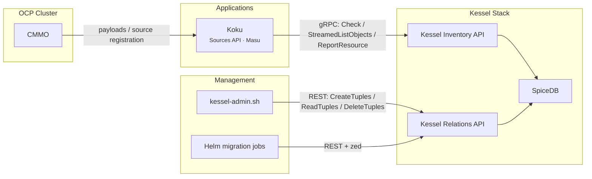
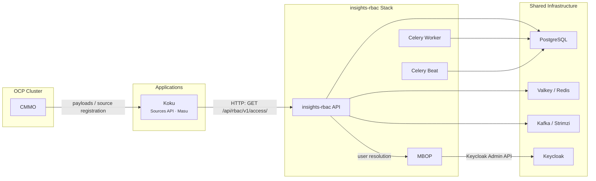
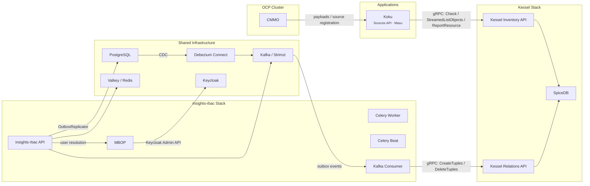
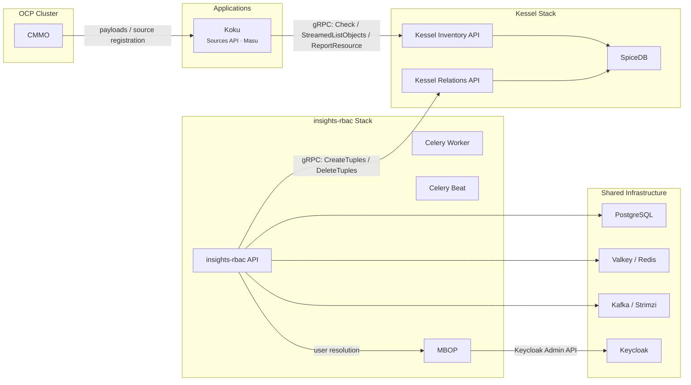

# On-Prem Authorization Backend

**Date**: 2026-02-26
**Status**: Decision
**Context**: Evaluate authorization backend options for Koku on-prem: Kessel (rebac), RBAC v1 (rbac), or a hybrid of both.

---

## 1. Purpose

Koku supports two authorization backends, controlled by `AUTHORIZATION_BACKEND` in
[koku_rebac/config.py](../../koku/koku_rebac/config.py). Both produce the same access
data structure consumed by `IdentityHeaderMiddleware`; downstream Koku code is agnostic
to which backend resolved the permissions.

| Backend | Provider | Config value |
|---------|----------|--------------|
| Kessel | `KesselAccessProvider` | `rebac` (current on-prem default when `ONPREM=True`) |
| RBAC v1 | `RBACAccessProvider` -> `RbacService` | `rbac` |

This document compares deployment scenarios (A, B, C with two variants), their
requirements, effort, and trade-offs.
For deep-dive evidence behind these findings, see the
[archived feasibility analysis](archive/insights-rbac-kessel-onprem-feasibility.md).
For permission and role definitions applicable to both paths, see
[rbac-config-reuse-for-onprem.md](rbac-config-reuse-for-onprem.md).

---

## 2. Scenario A: Kessel (rebac)

### Architecture



### How Koku uses it

- **Authorization**: `KesselAccessProvider` calls `StreamedListObjects` per resource type
  to get specific resource IDs the user can access. Falls back to workspace-level `Check`
  for wildcard access. Settings use `Check` exclusively.
- **Resource reporting**: When CMMO lands a payload, the Sources API creates a provider
  via `ProviderBuilder`; for OCP clusters this triggers `on_resource_created` ->
  `ReportResource` to Kessel Inventory. During data processing, Masu discovers additional
  resources (AWS accounts, Azure subscriptions, GCP accounts/projects, OCP nodes/projects)
  and reports them the same way. OCP resource types use `write_visibility=IMMEDIATE`;
  other types use the default (eventually consistent).
- **Resource lifecycle**: Source deletion preserves Kessel resources -- historical cost data
  remains in PostgreSQL and must remain queryable/authorizable. Kessel Inventory resources
  and SpiceDB permission tuples are only cleaned up when cost data is fully purged from
  PostgreSQL due to retention expiry (`remove_expired_data`). At that point, `DeleteResource`
  removes the Kessel resource and `KesselSyncedResource` tracking rows are deleted.
- **Workspace**: `ShimResolver` maps `org_id` directly to `workspace_id` (no RBAC v2 call).

### Infrastructure

Already planned and deployed via `deploy-kessel.sh` (in the Helm chart repo) in its own
namespace. No incremental Helm chart work. Memory already accounted for. The on-prem
Kessel stack does not use Kafka (`eventing: stdout`, `consumer: enabled: false`).

| Component | Purpose |
|-----------|---------|
| SpiceDB | Authorization data store |
| Kessel Inventory API | Check, StreamedListObjects, ReportResource (gRPC) |
| Kessel Relations API | Tuple management (REST, used by CLI and Helm jobs) |

### Management plane

CLI-based via `kessel-admin.sh` (deployment-level tool, not part of Koku) and Helm
migration jobs. Operators create/manage roles, groups, and bindings through shell commands
or declarative Helm values.

### UI path

Custom PatternFly admin UI calling Relations API REST directly (**L**):
- Build from scratch with PatternFly 6 + Keycloak JS
- Translates high-level RBAC operations (create group, assign role) into tuple CRUD
- Ships as a separate container in the Helm chart

### Key properties

| Property | Value |
|----------|-------|
| ACM readiness | **Yes** -- Koku is a pure Kessel consumer |
| SaaS code parity | **Yes** -- identical authorization code path |
| Permission-change latency | Immediate (direct gRPC to SpiceDB) |
| Extra pods | 0 (Kessel stack already planned) |
| Extra memory | 0 (already accounted for) |

---

## 3. Scenario B: RBAC v1 (rbac)

### Architecture



### How Koku uses it

- **Authorization**: `RbacService` calls
  `GET /api/rbac/v1/access/?application=cost-management&limit=100`, forwarding the
  user's `x-rh-identity` header. Handles pagination. `_process_acls()` parses the
  `cost-management:*:*` permission format with OCP inheritance (cluster -> node -> project).
- **Resource reporting**: `on_resource_created` / `ReportResource` is a no-op (gated on
  `AUTHORIZATION_BACKEND == "rebac"`). CMMO payloads still create providers via Sources
  API, but no resources are reported to Kessel.
- **Config**: Set `AUTHORIZATION_BACKEND=rbac`, `RBAC_SERVICE_PATH=/api/rbac/v1/access/`,
  `RBAC_SERVICE_HOST=<insights-rbac-service>`.
- **Prerequisite code change**: `resolve_authorization_backend()` in
  [koku_rebac/config.py](../../koku/koku_rebac/config.py) currently forces `rebac` when
  `ONPREM=True`, ignoring the env var. A one-line change is required to allow the env var
  to override (remove the `if onprem: return "rebac"` guard). The default path
  `RBAC_SERVICE_PATH` also changes from the ClowdApp default
  (`/r/insights/platform/rbac/v1/access/`) to `/api/rbac/v1/access/` for on-prem.

### Infrastructure

All infrastructure is shared with the existing chart (PostgreSQL, Valkey, Kafka via Strimzi).
The incremental cost is 4 new pods:

| Pod | Image | Memory Request | Memory Limit |
|-----|-------|----------------|--------------|
| insights-rbac API (Gunicorn, 2 workers) | `quay.io/cloudservices/rbac` | 512Mi | 1Gi |
| Celery worker | same | 256Mi | 512Mi |
| Celery beat | same | 256Mi | 512Mi |
| MBOP (Go binary, fronts Keycloak) | `quay.io/cloudservices/mbop` | ~64Mi | ~128Mi |
| **Total** | | **~1.1Gi** | **~2.2Gi** |

### Helm chart additions

| Item | Details |
|------|---------|
| Deployments + Services | insights-rbac API, Celery worker, Celery beat, MBOP |
| Init Job | `manage.py migrate --noinput && manage.py seeds` |
| ConfigMaps | Role/permission JSON from [rbac-config](https://github.com/RedHatInsights/rbac-config) |
| Secrets | `DJANGO_SECRET_KEY`, `SERVICE_PSKS` (Koku -> RBAC auth), DB credentials |
| Kafka topics | 4 topics on existing Strimzi cluster (notifications, sync, chrome, consumer) |
| Koku env | `RBAC_SERVICE_HOST`, `RBAC_SERVICE_PATH`, `AUTHORIZATION_BACKEND=rbac` |
| Database | `costonprem_rbac` on existing PostgreSQL instance |

### Management plane

insights-rbac REST API provides full CRUD:
- Roles: `GET/POST/PUT/DELETE /api/rbac/v1/roles/`
- Groups: `GET/POST/PUT/DELETE /api/rbac/v1/groups/`
- Principals: `GET /api/rbac/v1/principals/`
- Group members: `GET/POST/DELETE /api/rbac/v1/groups/{id}/principals/`
- Group roles: `GET/POST/DELETE /api/rbac/v1/groups/{id}/roles/`
- Access resolution: `GET /api/rbac/v1/access/`
- Permissions: `GET /api/rbac/v1/permissions/`

Role seeding on startup provides 5 cost-management roles covering 10 resource types
(each with `read`; `cost_model` and `settings` also support `write`).
MBOP provides user discovery against Keycloak. Alternatively, set
`BYPASS_BOP_VERIFICATION=True` to skip user verification (principals managed from DB only).

### UI path

Extract components from [insights-rbac-ui](https://github.com/RedHatInsights/insights-rbac-ui) (**M**):
- Reuse `src/features/roles/`, `src/features/groups/`, `src/features/users/`
- Reuse React Query data layer (`src/data/api/`, `src/data/queries/`)
- Replace 5 Chrome adapter hooks with Keycloak JS equivalents
- Wrap in standalone PatternFly 6 shell (no insights-chrome dependency)

### Key properties

| Property | Value |
|----------|-------|
| ACM readiness | **No** -- would need Kessel migration later |
| SaaS code parity | **No** -- SaaS is moving to Kessel |
| Permission-change latency | Immediate (SQL) |
| Extra pods | 4 (API + worker + beat + MBOP) |
| Extra memory | ~1.1Gi request / ~2.2Gi limit |

---

## 4. Scenario C: Hybrid -- insights-rbac management + Kessel authorization

Both variants share the same principle: operators manage roles/groups/bindings through
insights-rbac REST API, and Koku authorizes through Kessel. They differ in **how** RBAC
state reaches SpiceDB:

- **C1 (Async)**: RBAC writes to a PostgreSQL outbox table (same transaction), Debezium
  captures the change via CDC, publishes to Kafka, and a dedicated consumer writes tuples
  to Kessel Relations API via gRPC. This is the SaaS architecture. It adds 2 extra pods
  (Kafka consumer + Debezium) beyond Scenario B, introduces eventual consistency, and
  requires CDC infrastructure -- but needs zero insights-rbac code changes.
- **C2 (Sync)**: RBAC calls Kessel Relations API via gRPC directly in the request path.
  No outbox, no Debezium, no Kafka consumer. Same 4 pods as Scenario B. Permission
  changes are immediate. Requires a small upstream contribution (~20 lines) to add a
  configurable replicator strategy that swaps the outbox writer for the direct gRPC
  writer.

### Common to both C1 and C2

- **Koku authorization**: identical to Scenario A -- `KesselAccessProvider` uses Kessel
  Inventory API (Check, StreamedListObjects, ReportResource). `AUTHORIZATION_BACKEND=rebac`.
- **Management plane**: insights-rbac REST API (same full CRUD as Scenario B). Operators
  manage roles, groups, and bindings through the same v1 API endpoints listed in Scenario B.
- **UI path**: Same as Scenario B -- extract from insights-rbac-ui (**M**). The UI talks
  to insights-rbac REST API; the replication to Kessel is transparent.

---

### 4a. Variant C1: Async (outbox + Debezium) -- SaaS-parity path

#### Architecture



#### How the replication works

When an operator creates a role or adds a user to a group via insights-rbac, the change
is written to PostgreSQL and the outbox table (`OutboxReplicator`). Both writes are in
the same DB transaction -- atomic. Debezium captures the outbox via CDC, publishes to
Kafka. The insights-rbac Kafka consumer reads the event and calls
`RelationsApiReplicator` to write tuples to Kessel Relations API via gRPC. Tuples flow
into SpiceDB, where Koku's authorization checks resolve them.

**Config**: `REPLICATION_TO_RELATION_ENABLED=True`, `RBAC_KAFKA_CONSUMER_REPLICAS=1`.

#### Infrastructure

Combines the full Kessel stack (Scenario A) with the full insights-rbac stack (Scenario B),
plus Debezium Connect for CDC and an additional Kafka consumer pod.

| Pod | Memory Request | Memory Limit |
|-----|----------------|--------------|
| insights-rbac API | 512Mi | 1Gi |
| Celery worker | 256Mi | 512Mi |
| Celery beat | 256Mi | 512Mi |
| Kafka consumer (dual-write) | 300Mi | 300Mi |
| MBOP | ~64Mi | ~128Mi |
| Debezium Connect | ~512Mi | ~1Gi |
| **insights-rbac subtotal** | **~1.9Gi** | **~3.5Gi** |
| + Kessel stack (already planned) | (accounted for) | (accounted for) |

#### Helm chart additions (beyond Scenario A)

insights-rbac infrastructure from Scenario B (Deployments, Services, init job, ConfigMaps,
Secrets, Kafka topics, database), but **not** the Koku env overrides (`RBAC_SERVICE_HOST`,
`RBAC_SERVICE_PATH`, `AUTHORIZATION_BACKEND=rbac`) -- Koku keeps `AUTHORIZATION_BACKEND=rebac`.
Additionally:

| Item | Details |
|------|---------|
| Debezium Connect | Deployment + Service + connector config for PostgreSQL CDC |
| Kafka consumer pod | `RBAC_KAFKA_CONSUMER_REPLICAS=1` |
| Outbox topic | Additional Kafka topic for Debezium CDC events |
| Dual-write config | `REPLICATION_TO_RELATION_ENABLED=True`, `RELATION_API_SERVER` |

#### Consistency model

**Eventually consistent.** There is a window between an RBAC write and tuple availability
in SpiceDB. The window size = Debezium poll interval + Kafka consumer lag + Relations API
latency. A user assigned a role via insights-rbac may not immediately have access via Koku.

The `RetryHelper` in the Kafka consumer retries failed writes with exponential backoff
(max 10 attempts, max 30s backoff). If max retries are exceeded, the consumer stops and
requires manual intervention.

#### Key properties

| Property | Value |
|----------|-------|
| ACM readiness | **Yes** -- Koku is a pure Kessel consumer |
| SaaS code parity | **Yes** -- identical insights-rbac code path |
| Permission-change latency | **Eventually consistent** (async dual-write) |
| Extra pods | 6 (API + worker + beat + consumer + MBOP + Debezium) beyond Kessel stack |
| Extra memory | ~1.9Gi request / ~3.5Gi limit beyond Kessel stack |
| insights-rbac code changes | None (upstream config). Note: the Kafka consumer calls `delete_relationships()` and `write_relationships()` directly, bypassing `replicate()`. However, on-prem Kessel disables eventing, so the Kafka consumer is not exercised. |
| Dual-write production status | Unclear -- `REPLICATION_TO_RELATION_ENABLED` defaults to `False` in SaaS |

---

### 4b. Variant C2: Sync (direct-write) -- simplified on-prem path

#### Architecture



#### How the replication works

Instead of writing to an outbox table and relying on Debezium + Kafka to eventually
deliver tuples, the dual-write handlers call `RelationsApiReplicator` directly in the
request path. Each RBAC write (create role, add member, etc.) produces a synchronous
gRPC call to Kessel Relations API. No Debezium, no Kafka consumer, no outbox topic.

**Config**: `REPLICATION_TO_RELATION_ENABLED=True`, `RELATION_REPLICATOR_STRATEGY=direct`
(new config var, see scope of changes below).

#### Scope of insights-rbac changes (upstream contribution)

**`replicate()` is additions-only in current upstream code.** `RelationsApiReplicator.replicate()`
calls `write_relationships(event.add)` but does not process `event.remove`. The C1 Kafka
consumer calls `delete_relationships()` directly, but that code path is not exercised
on-prem (Kessel eventing is disabled). For C2, the handlers call `replicate()`, so
deletion of role/group tuples would require either extending `replicate()` to process
`event.remove` or using a separate cleanup mechanism. Note: Koku's own resource cleanup
(source deletion, data expiry) goes through the Kessel Inventory API `DeleteResource`
and is independent of `replicate()`.

The dual-write handlers use constructor injection for their replicator:

```python
self._replicator = replicator if replicator else OutboxReplicator()
```

A factory function swaps the default based on a new config toggle:

```python
# management/relation_replicator/factory.py (~8 lines, new file)
def get_replicator():
    if settings.RELATION_REPLICATOR_STRATEGY == "direct":
        return RelationsApiReplicator()
    return OutboxReplicator()
```

**Files changed** (3 modified + 1 new, ~20 lines total):

| File | Change |
|------|--------|
| `rbac/management/relation_replicator/factory.py` | New file: `get_replicator()` factory (~8 lines) |
| `rbac/management/group/relation_api_dual_write_subject_handler.py` | Default replicator via `get_replicator()` (1 line) |
| `rbac/management/role/relation_api_dual_write_handler.py` | Default replicator via `get_replicator()` in `BaseRelationApiDualWriteHandler` -- covers both `RelationApiDualWriteHandler` and `SeedingRelationApiDualWriteHandler` (1 line) |
| `rbac/rbac/settings.py` | Add `RELATION_REPLICATOR_STRATEGY` (default `"outbox"`) (2 lines) |

Note: `relation_api_dual_write_group_handler.py` does **not** need changes -- it passes
`replicator` through to `RelationApiDualWriteSubjectHandler.__init__()` via `super()`.

**Error handling decision**: When the gRPC call fails in the request path, the handler
must choose between:
- **Fail the RBAC write** (strong consistency, lower availability) -- the PG transaction
  rolls back, operator gets an error, must retry
- **Log and continue** (weak consistency, higher availability) -- PG write succeeds,
  tuple is lost, requires manual reconciliation

For on-prem (Kessel is local, failures are rare), **fail the RBAC write** is the
recommended strategy: it preserves consistency and operators can simply retry.

#### Infrastructure

Same as Scenario B -- 4 pods. No Debezium, no Kafka consumer, no outbox topic.

| Pod | Memory Request | Memory Limit |
|-----|----------------|--------------|
| insights-rbac API | 512Mi | 1Gi |
| Celery worker | 256Mi | 512Mi |
| Celery beat | 256Mi | 512Mi |
| MBOP | ~64Mi | ~128Mi |
| **insights-rbac subtotal** | **~1.1Gi** | **~2.2Gi** |
| + Kessel stack (already planned) | (accounted for) | (accounted for) |

#### Helm chart additions (beyond Scenario A)

insights-rbac infrastructure from Scenario B (Deployments, Services, init job, ConfigMaps,
Secrets, Kafka topics, database), but **not** the Koku env overrides (`RBAC_SERVICE_HOST`,
`RBAC_SERVICE_PATH`, `AUTHORIZATION_BACKEND=rbac`) -- Koku keeps `AUTHORIZATION_BACKEND=rebac`
and does not call insights-rbac. Additionally:

| Item | Details |
|------|---------|
| Dual-write config | `REPLICATION_TO_RELATION_ENABLED=True`, `RELATION_REPLICATOR_STRATEGY=direct`, `RELATION_API_SERVER` |

#### Consistency model

**Synchronous.** Permission changes are visible in SpiceDB as soon as the RBAC API call
returns. No async pipeline, no lag window. If the gRPC call fails, the RBAC write also
fails (recommended strategy) -- PG and SpiceDB stay in sync.

**Trade-off vs C1**: The outbox pattern in C1 guarantees that the PG write and the
replication event are in the same DB transaction (atomic). In C2, the PG write and the
gRPC call are NOT in the same transaction boundary. If the gRPC call fails after PG
commit (unlikely with "fail the write" strategy, but possible in edge cases), PG and
SpiceDB diverge. On-prem mitigates this: Kessel is local, network partitions are rare.

#### Key properties

| Property | Value |
|----------|-------|
| ACM readiness | **Yes** -- Koku is a pure Kessel consumer |
| SaaS code parity | **Yes** (once upstream PR is merged; changes are backwards-compatible) |
| Permission-change latency | **Immediate** (synchronous gRPC) |
| Extra pods | 4 (same as Scenario B) beyond Kessel stack |
| Extra memory | ~1.1Gi request / ~2.2Gi limit beyond Kessel stack |
| insights-rbac code changes | Upstream PR: ~20 lines across 3 modified files + 1 new factory (~8 lines) |
| RBAC availability when Kessel is down | RBAC writes fail (recommended strategy) |

---

## 5. Comparison Matrix

**T-shirt sizes**: **S** = days to ~1 week | **M** = 2-4 weeks | **L** = 4-6 weeks | **XL** = 6+ weeks

| Criterion | A: Kessel | B: RBAC v1 | C1: Hybrid async | C2: Hybrid sync |
|-----------|-----------|------------|------------------|-----------------|
| **Extra infrastructure** | None (already planned) | 4 pods, shared PG/Valkey/Kafka | 6 pods (incl. Debezium), on top of Kessel stack | 4 pods (same as B), on top of Kessel stack |
| **Extra memory** | 0 | ~1.1Gi req / ~2.2Gi lim | ~1.9Gi req / ~3.5Gi lim (+ Kessel) | ~1.1Gi req / ~2.2Gi lim (+ Kessel) |
| **Kafka usage** | None (eventing disabled on-prem) | 4 topics on customer Strimzi | 5 topics + Debezium CDC | 4 topics (same as B) |
| **Koku code changes** | None (current default) | Config + 1-line `config.py` change | None (current default) | None (current default) |
| **insights-rbac changes** | N/A | N/A | None (upstream config) | Upstream PR: ~20 lines (3 files + 1 new) |
| **Management plane** | CLI + Helm jobs | REST API (full CRUD) | REST API (full CRUD) | REST API (full CRUD) |
| **UI effort** | **L** (build from scratch) | **M** (extract + adapt) | **M** (extract + adapt) | **M** (extract + adapt) |
| **ACM readiness** | Yes | No | Yes | Yes |
| **SaaS code parity** | Yes | No | Yes | Yes (once upstream PR merged) |
| **Permission-change latency** | Immediate (direct gRPC to SpiceDB) | Immediate (SQL) | Eventually consistent (async) | Immediate (sync gRPC) |
| **Resource auto-discovery** | Yes (ReportResource) | N/A (wildcard permissions) | Yes (ReportResource) | Yes (ReportResource) |
| **Helm chart effort** | None | **S** | **M** (S baseline + Debezium/consumer) | **S** (same as B + dual-write config) |
| **Risk** | Low | Low-Medium | High (async pipeline complexity) | Low-Medium (upstream acceptance timeline, non-atomic cross-system writes) |
| **Overall effort** | Existing plan + **L** (UI only) | **M** (infra + UI parallel) | Existing plan + **M-L** (pipeline complexity) | Existing plan + **M** (infra + UI parallel) |

---

## 6. UI Strategy

All paths converge on PatternFly 6 + Keycloak JS for authentication. The difference
is what the UI talks to and how much can be reused.

### Scenario A (Kessel): build against Relations API REST

- UI translates high-level operations into tuple CRUD (`/v1beta1/tuples`)
- Higher frontend complexity (must encode/decode tuple semantics)
- No existing components to reuse
- Same API surface as `kessel-admin.sh`

### Scenarios B, C1, and C2 (RBAC v1 / Hybrid): extract from insights-rbac-ui

**Validated integration path** (confirmed against
[koku-ui-mfe-onprem](https://github.com/insights-onprem/koku-ui-mfe-onprem) and
[insights-rbac-ui](https://github.com/RedHatInsights/insights-rbac-ui)):

- **Framework compatibility confirmed**: The on-prem UI (`koku-ui-mfe-onprem`) uses
  PatternFly 6, React 18, React Router 6, and Webpack 5 -- the same stack as
  `insights-rbac-ui`. No framework version conflicts.
- **No `insights-chrome` dependency in on-prem**: `koku-ui-mfe-onprem` handles authentication
  through `oauth2-proxy` + Keycloak (nginx sidecar proxies `/oauth2/` requests). The app
  reads user identity from `x-rh-identity` headers injected by the proxy, not from Chrome.
  This means extracted RBAC components need no Chrome shim layer.
- **insights-rbac-ui Chrome isolation**: Chrome dependency is behind 5 adapter hooks:
  - `usePlatformAuth` -> replace with Keycloak JS `getToken()` / `getUser()`
  - `usePlatformTracking` -> no-op
  - `usePlatformEnvironment` -> config-driven
  - `useAccessPermissions` -> permissions from RBAC API or config
  - `PermissionsContext` -> provider with `orgAdmin` from JWT
- **Feature components** (roles, groups, users) do not import Chrome directly
- **Data layer** (`src/data/api/`, `src/data/queries/`) is environment-agnostic (React Query
  + injected axios via `ServiceContext`)
- **CLI mode** (`src/cli/api-client.ts`) proves the API layer works without Chrome
- **Integration approach**: Extract RBAC feature components, wrap in the existing
  `koku-ui-mfe-onprem` shell (which already provides Keycloak auth, routing, and PatternFly).
  The RBAC API base URL is injected at build/runtime. No module federation required.
- **Effort estimate**: **M** (3-5 weeks) -- extract, adapt 5 hooks, integrate into existing
  shell, test against on-prem insights-rbac instance.
- Identical UI for both B and C -- the dual-write to Kessel in C is transparent to the UI

---

## 7. Recommendation

**Scenario A (Kessel) remains the recommended path.** It provides ACM readiness, SaaS code
parity, and zero incremental infrastructure. Koku's authorization code is identical in
SaaS and on-prem. The management plane (CLI now, ACM later) is externalized, so switching
management tools requires zero Koku code changes.

**Scenario B (RBAC v1) is a viable alternative** if short-term management UX is prioritized
over ACM alignment. It provides a richer REST API immediately and faster UI delivery through
component reuse. The trade-offs: (1) an architectural dead-end -- SaaS is moving to Kessel,
so on-prem would eventually need to migrate as well; (2) the already-planned Kessel stack
becomes unused overhead (can be decommissioned to reclaim resources).

**Scenario C (Hybrid)** provides insights-rbac REST API for management, Kessel for
authorization, ACM readiness, and UI component reuse. Two variants exist:

- **C1 (async/outbox)** preserves full SaaS code parity but adds 6 extra pods + Debezium
  and introduces eventual consistency. The dual-write path
  (`REPLICATION_TO_RELATION_ENABLED`) defaults to `False` in SaaS and its production
  readiness is unclear. High operational complexity.
- **C2 (sync/direct-write)** eliminates the async pipeline entirely -- same 4 pods as
  Scenario B, synchronous consistency, and significantly lower operational complexity.
  The trade-off is a small upstream contribution to insights-rbac (~20 lines) to add a
  configurable replicator strategy, and RBAC writes fail if Kessel Relations API is down
  (acceptable on-prem where Kessel is local). The changes are backwards-compatible
  (default remains `"outbox"`), so SaaS code parity is preserved once the PR merges.

All paths reach a management UI within comparable effort (M-L). The choice is about
architectural direction and operational complexity tolerance, not timeline.

---

## 8. References

| Resource | Path |
|----------|------|
| Kessel integration test plan (UT/IT/CT/E2E) | [kessel-integration/kessel-ocp-test-plan.md](kessel-integration/kessel-ocp-test-plan.md) |
| Archived feasibility analysis (deep-dive) | [archive/insights-rbac-kessel-onprem-feasibility.md](archive/insights-rbac-kessel-onprem-feasibility.md) |
| RBAC permission/role reuse analysis | [rbac-config-reuse-for-onprem.md](rbac-config-reuse-for-onprem.md) |
| Kessel detailed design | [kessel-integration/kessel-ocp-detailed-design.md](kessel-integration/kessel-ocp-detailed-design.md) |
| Authorization delegation strategy DD | [kessel-integration/kessel-authorization-delegation-dd.md](kessel-integration/kessel-authorization-delegation-dd.md) |
| Koku auth config | [koku_rebac/config.py](../../koku/koku_rebac/config.py) |
| Kessel access provider | [koku_rebac/access_provider.py](../../koku/koku_rebac/access_provider.py) |
| RBAC v1 service | [koku/rbac.py](../../koku/koku/rbac.py) |
| insights-rbac repo | [github.com/RedHatInsights/insights-rbac](https://github.com/RedHatInsights/insights-rbac) |
| insights-rbac-ui repo | [github.com/RedHatInsights/insights-rbac-ui](https://github.com/RedHatInsights/insights-rbac-ui) |
| koku-ui-mfe-onprem repo | [github.com/insights-onprem/koku-ui-mfe-onprem](https://github.com/insights-onprem/koku-ui-mfe-onprem) |
| MBOP repo | [github.com/RedHatInsights/mbop](https://github.com/RedHatInsights/mbop) |
