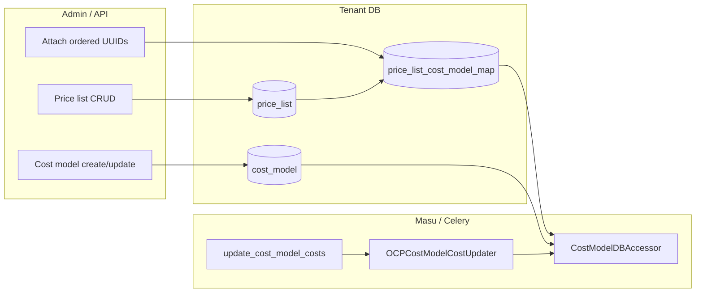

# Price Lists — Architecture and Lifecycles

This folder documents how **price lists** (versioned rate collections with
validity windows) are created, attached to cost models, resolved during
OpenShift cost calculation, and kept in sync with legacy `CostModel.rates`.

**Prerequisite reading**: [cost-models.md](../cost-models.md) — cost model
concepts, distribution, and the OCP calculation pipeline at a high level.

**Related feature docs**: [cost-breakdown/README.md](../cost-breakdown/README.md)
— breakdown work extends the same rate JSON shape; price lists are the
storage and date-resolution layer for those rates today.

---

## Dual-write transition (product plan)

Until a **dedicated price list UI** ships, the product intentionally keeps
**two writable copies** of the same rate payload in sync:

| Store | Role during transition |
|-------|-------------------------|
| **`CostModel.rates`** | Still populated and edited through **today’s cost model UI and API** (`PUT /cost-models/…` with `rates`). Remains the fallback when Masu uses `CostModelDBAccessor` with `price_list_effective_on=None` ([`effective_rates`](../../../koku/masu/database/cost_model_db_accessor.py)). |
| **`PriceList.rates`** | **Canonical for date-based OCP calculation** when `price_list_effective_on` is set (monthly `_load_rates` in [`OCPCostModelCostUpdater`](../../../koku/masu/processor/ocp/ocp_cost_model_cost_updater.py)). Kept aligned from cost model writes via [`CostModelManager`](../../../koku/cost_models/cost_model_manager.py) (auto-create list on create; sync first linked list on `rates` update). |

**Philosophy:** dual-write is a **bridge**, not a permanent split. Customers
(and the existing UI) continue to think in “cost model rates” while the
backend already resolves costs from price lists where the pipeline passes a
billing date.

**After the price list UI is delivered**, the plan is to **stop writing and
eventually remove `CostModel.rates`** as the user-facing source of truth—
rates would be authored only on price lists (validity, priority, versioning).
Follow-on engineering would then: route all accessors to list-based
resolution (or equivalent), drop dual-write in `CostModelManager`, and
remove or hollow out the JSON column / API surface according to migration and
compatibility policy. Exact sequencing is a delivery decision; this doc only
records the intent.

See [api-and-lifecycle.md § Cost model rates and dual-write](./api-and-lifecycle.md#cost-model-rates-and-dual-write).

---

## What a price list is

A **price list** is a tenant-scoped row in `price_list` with:

- **Rates**: same JSON array shape as `CostModel.rates` (see
  [`PriceList.rates`](../../../koku/cost_models/models.py)).
- **Validity**: `effective_start_date` / `effective_end_date` (inclusive
  window used in resolution queries).
- **Lifecycle metadata**: `enabled`, `version` (increments on material
  rate/currency/date changes — see
  [`PriceListManager.update`](../../../koku/cost_models/price_list_manager.py)),
  timestamps.

Cost models link to **one or more** price lists through
`price_list_cost_model_map` with a **priority** (lower number wins when
multiple lists cover the same calendar day).

Implementation: [`PriceList`](../../../koku/cost_models/models.py),
[`PriceListCostModelMap`](../../../koku/cost_models/models.py).

---

## Document map

| Topic | Doc |
|-------|-----|
| REST API, serializers, attach/delete, async recalculation | [api-and-lifecycle.md](./api-and-lifecycle.md) |
| Effective-date resolution, `CostModelDBAccessor`, OCP updater, edge paths | [calculation-and-resolution.md](./calculation-and-resolution.md) |

---

## End-to-end lifecycle (summary)

1. **Define lists** — `POST/PUT /price-lists/` creates or updates rows;
   material changes can enqueue **current-month** recalculation for linked
   providers ([`PriceListManager._trigger_recalculation`](../../../koku/cost_models/price_list_manager.py)).
2. **Attach to cost model** — optional `price_list_uuids` on cost model
   create/update replaces mappings via
   [`PriceListManager.attach_price_lists_to_cost_model`](../../../koku/cost_models/price_list_manager.py).
3. **Dual-write sync** — cost model `rates` updates copy into the first linked
   price list (or auto-create list + map) ([`CostModelManager`](../../../koku/cost_models/cost_model_manager.py)); see [Dual-write transition](#dual-write-transition-product-plan).
4. **Calculate** — for each month in range, OCP cost application loads rates
   with that month’s start date as `price_list_effective_on` ([`_load_rates`](../../../koku/masu/processor/ocp/ocp_cost_model_cost_updater.py)).

---

## Migrations and backfill

Schema and map table: [`0010_add_price_list_models`](../../../koku/cost_models/migrations/0010_add_price_list_models.py).

Data migration from JSON: [`0011_migrate_cost_model_rates_to_price_lists`](../../../koku/cost_models/migrations/0011_migrate_cost_model_rates_to_price_lists.py)
creates a default price list per cost model that had non-empty `rates` and
no map yet (under row lock).

---

## Design notes (implemented behavior)

| Topic | Behavior |
|-------|----------|
| **Priority** | Lowest `priority` value on `PriceListCostModelMap` wins among lists whose date range contains the billing day. |
| **`enabled`** | New attachments require `enabled=True`. Disabled lists **still** participate in `get_effective_price_list` for dates inside their window (see docstring in [`price_list_manager.py`](../../../koku/cost_models/price_list_manager.py)). |
| **No covering list** | When `price_list_effective_on` is set and no list matches, [`effective_rates`](../../../koku/masu/database/cost_model_db_accessor.py) is `{}` (zero tiered/tag rates from lists). |
| **Accessor without date** | `price_list_effective_on=None` uses **`CostModel.rates`** only — transitional dual-write compatibility and a few code paths that still skip list resolution (see [calculation-and-resolution.md](./calculation-and-resolution.md)); scheduled to go away when JSON rates are removed post–price list UI. |

For exceptions (markup, GPU usage-only SQL), see
[calculation-and-resolution.md § Known split paths](./calculation-and-resolution.md#known-split-paths).
