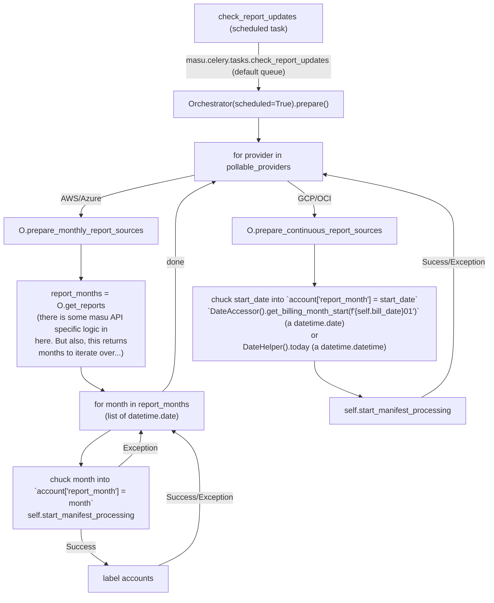

```mermaid
graph
    A["check_report_updates (scheduled task)"] -->|"masu.celery.tasks.check_report_updates (default queue)"| B["Orchestrator(scheduled=True).prepare()"];
    B --> b[for provider in pollable_providers];
    b -->|AWS/Azure| C[O.prepare_monthly_report_sources];
    C --> E["report_months = O.get_reports\n(there is some masu API specific logic in\nhere. But also, this returns\nmonths to iterate over...)"];
    E --> F["for month in report_months\n(list of datetime.date)"];
    F --> G["chuck month into `account['report_month'] = month`\nself.start_manifest_processing"];
    G -->|Success| H[label accounts];
    H -->|Success/Exception| F;
    G -->|Exception| F;
    F -->|done| b;


    b -->|GCP/OCI| D[O.prepare_continuous_report_sources];
    D --> I["chuck start_date into `account['report_month'] = start_date`\n`DateAccessor().get_billing_month_start(f'{self.bill_date}01')` (a datetime.date)\nor\nDateHelper().today (a datetime.datetime)"];
    I --> J[self.start_manifest_processing];
    J -->|Sucess/Exception| b;
```
