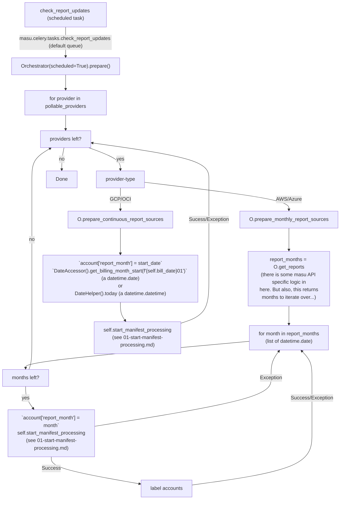

```mermaid

graph
    A["check_report_updates (scheduled task)"] -->|"masu.celery.tasks.check_report_updates (default queue)"| B["Orchestrator(scheduled=True).prepare()"]
    B --> b[for provider in pollable_providers]
    b --> bb[providers left?]
    bb -->|yes| cc[provider-type]
    cc -->|AWS/Azure| C[O.prepare_monthly_report_sources]
    C --> E["report_months = O.get_reports\n(there is some masu API specific logic in\nhere. But also, this returns\nmonths to iterate over...)"]
    E --> F["for month in report_months\n(list of datetime.date)"]
    F --> ff[months left?]
    ff -->|yes| G[" `account['report_month'] = month`\nself.start_manifest_processing\n(see 01-start-manifest-processing.md)"]
    G -->|Success| H[label accounts]
    H -->|Success/Exception| F
    G -->|Exception| F
    ff -->|no| bb


    cc -->|GCP/OCI| D[O.prepare_continuous_report_sources]
    D --> I[" `account['report_month'] = start_date`\n`DateAccessor().get_billing_month_start(f'{self.bill_date}01')` (a datetime.date)\nor\nDateHelper().today (a datetime.datetime)"]
    I --> J["self.start_manifest_processing\n(see 01-start-manifest-processing.md)"]
    J -->|Sucess/Exception| bb

    bb -->|"no"| Z[Done]
```
