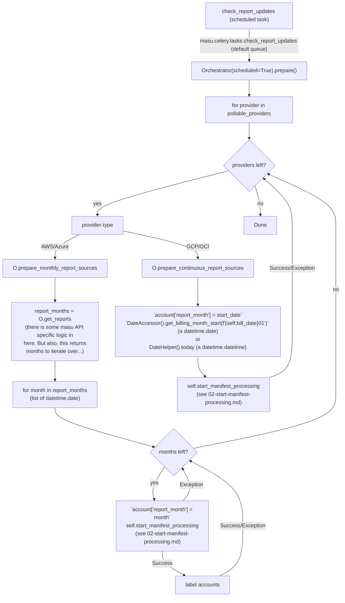

```mermaid

graph
    A["check_report_updates (scheduled task)"] -->|"masu.celery.tasks.check_report_updates (default queue)"| B["Orchestrator(scheduled=True).prepare()"]
    B --> C[for provider in pollable_providers]
    C --> D{providers left?}
    D -->|yes| E[provider-type]
    E -->|AWS/Azure| F[O.prepare_monthly_report_sources]
    F --> G["report_months = O.get_reports\n(there is some masu API specific logic in\nhere. But also, this returns\nmonths to iterate over...)"]
    G --> H["for month in report_months\n(list of datetime.date)"]
    H --> I{months left?}
    I -->|yes| J[" `account['report_month'] = month`\nself.start_manifest_processing\n(see 02-start-manifest-processing.md)"]
    J -->|Success| K[label accounts]
    K -->|Success/Exception| I
    J -->|Exception| I
    I -->|no| D


    E -->|GCP/OCI| L[O.prepare_continuous_report_sources]
    L --> M[" `account['report_month'] = start_date`\n`DateAccessor().get_billing_month_start(f'{self.bill_date}01')` (a datetime.date)\nor\nDateHelper().today (a datetime.datetime)"]
    M --> N["self.start_manifest_processing\n(see 02-start-manifest-processing.md)"]
    N -->|Success/Exception| D

    D -->|"no"| Z[Done]
```
