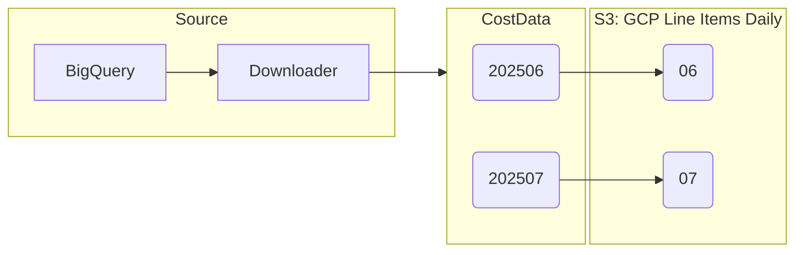
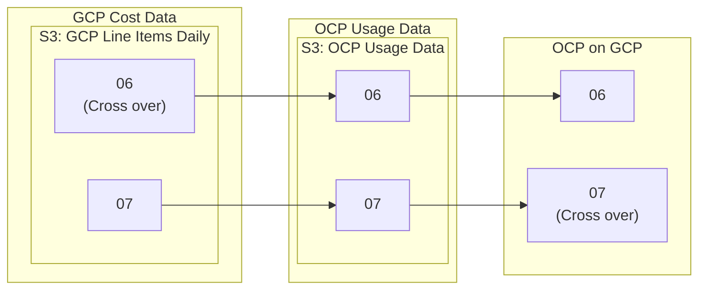

# GCP Cross Over Data

With GCP data the usage and billing data does not always align. There will be scenarios where the usage may be on July 1st; however, it will appear on the June invoice.

GCP provides an invoice month column to showcase what month that was charged.

## Partitioning Structure

### GCP Tables

Within the GCP flow, we partition the cross over data based on the invoice month. Therefore, even if the usage date is for July, we would put it in the June partition.



### OCP on GCP Tables
The OCP on GCP flow is where we correlate GCP cost data with OpenShift (OCP) usage data through finding matching resource identifiers or through tag matching. We take relevant GCP cost data and add additional columns to track OCP-specific details such as namespace, node, cluster, and PVC.

**Crucially, for these OCP on GCP tables, the previous partitioning structure is intentionally overwritten.** As highlighted in the code [here](https://github.com/project-koku/koku/pull/5650/files#diff-5d1dc91fd1242361760945a41214e7937a5d659c9a7bc35b4b60cde893d2b8efR153), these tables are partitioned based on the GCP data's usage month, not the invoice month.

This creates a scenario where costs associated with a July invoice but with June usage will be in the July partition for OCP on GCP data, but in the June partition for raw GCP data.



### Special Considerations when Partition Pruning for OCP on GCP

Extending the scenario outlined in the trino_partition_pruning.md, there are special caveats to partition pruning for OCP on GCP, due to the cross over data being switched between tables.

```
SELECT
    gcp.row_uuid,
    gcp.unblended_cost AS gcp_unblended_cost,
    ocp_on_gcp.unblended_cost AS ocpgcp_unblended_cost
FROM
    managed_reporting_ocpgcpcostlineitem_project_daily_summary AS ocp_on_gcp
JOIN
    gcp_line_items_daily AS gcp
    ON ocp_on_gcp.row_uuid = gcp.row_uuid
    AND ocp_on_gcp.year = gcp.year
    AND ocp_on_gcp.source = gcp.source
WHERE
    gcp.source = 'xyz'
    AND ocp_on_gcp.ocp_source='abc'
    AND gcp.year = '2025'
    AND gcp.month = '05'
    AND ocp_on_gcp.month in ('05', '06')
    AND gcp.usage_start >= DATE('2025-05-01')
    AND gcp.usage_start <= DATE('2025-06-30')
    AND gcp.unblended_cost < ocp_on_gcp.unblended_cost;
```

If you want to include any cross over data during your investigation of the May data. 1. You will not be able to use `ocp_on_gcp.month = gcp.month` in your join conditions since we changed partitions during the creation of the ocp on gcp data.
2. Expand the partition filter for ocp on gcp to include both months: `ocp_on_gcp.month in ('05', '06')`
